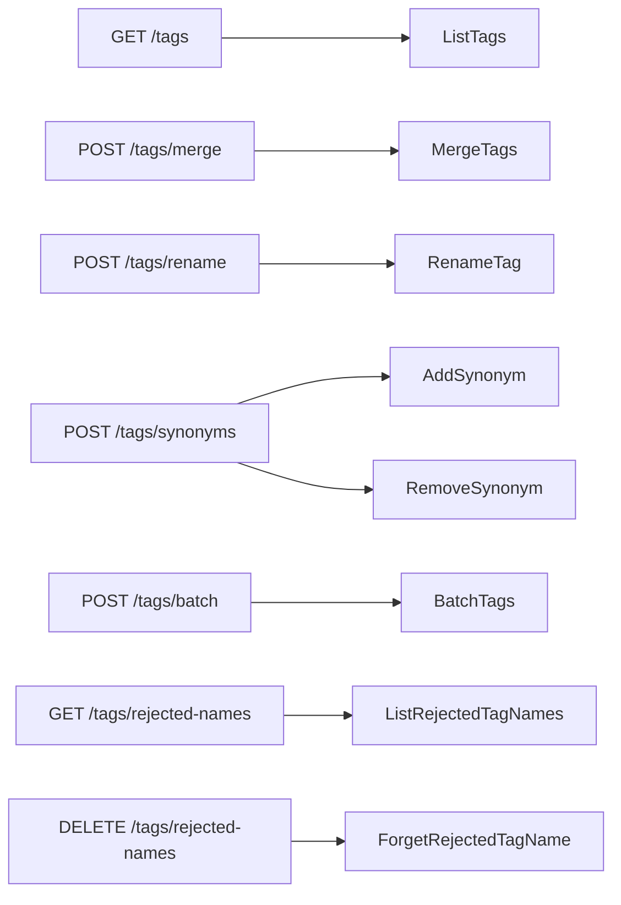
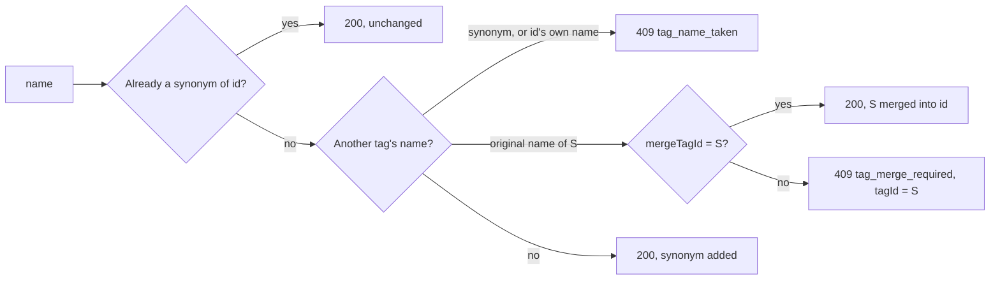

# Contract: Tag administration in the external API v1 and MCP

Source of truth: `api/external-v1.yaml`. This document describes only the
parameters, operations, fields and errors this feature adds. The shared rules
(Bearer, the error shape, count limits, the 32 MiB body) stay as in
[specs/026-external-api/contracts/external-api.md §1](../../026-external-api/contracts/external-api.md#1-common-rules).
Following the compatibility policy, only fields, parameters, operations and
`reason` values are added. Each operation runs the store operation the screen
runs ([research.md R-6](../research.md#r-6-the-external-handlers-call-the-same-tags-methods-as-the-screen-with-no-new-write-path)),
so the rules of
[036 contracts/screen-api.md](../../036-tag-admin-scale/contracts/screen-api.md)
and [031 contracts/screen-api.md](../../031-tentative-tags/contracts/screen-api.md)
hold for the state after each call; this document repeats only what the caller
sees.

The diagram shows which store operation each new or changed operation reaches.



## 0. Schema changes

| Schema | Added | Rule |
| --- | --- | --- |
| `Tag` | `createdAt: string, format: date-time` (`required`) | `tags.created_at`, the value `createdDesc` and `createdAsc` order by |
| `TagList` | `total: integer` (`required`), `totalAll: integer` (`required`), `nextCursor: string` (optional) | As the screen's `TagList`: `total` counts the tags matching `q`, `tentative` and `unused`; `totalAll` counts every tag; `nextCursor` is present only on a request with `limit` when more remain |
| `Error` | `tagId: integer, format: int64`, `tagName: string` (both optional) | The conflicting tag's id and original name. Present only with `tag_name_taken` and `tag_merge_required` |
| `ErrorReason` | `tag_not_found`, `tag_name_taken`, `tag_merge_required`, `merge_same_tag` | §2 to §4. `too_many_tags` and `invalid_cursor` exist |
| `TagSort` | `enum: [name, countDesc, countAsc, createdDesc, createdAsc]`, default `name` | The screen's `TagSort` |

New request and response schemas are given with their operations. Every array
in a response is `[]` when empty, never `null`.

## 1. `GET /api/v1/tags`

Lists tags, with the screen's search, filters, sort and pages.

| Parameter | Type | Default | Meaning |
| --- | --- | --- | --- |
| `q` | string, `maxLength: 100` | empty | Search term, matched as on the screen (folded, trimmed, substring of a name or synonym) |
| `tentative` | boolean | `false` | Tentative tags only |
| `unused` | boolean | `false` | Tags on no video only. ANDed with `q` and `tentative` |
| `sort` | `TagSort` | `name` | Sort order; ties by natural name order, then `id` |
| `cursor` | string | — | The previous `nextCursor`, opaque, valid with the same `q`, `tentative`, `unused` and `sort` |
| `limit` | integer, 1 to 200 | — | Tags per page. **Omitted, every tag** is returned without `nextCursor`, as today |

**Response**: `200 TagList`. The MCP tool `list_tags` sets `limit` to 100 when
the call omits it ([R-1](../research.md#r-1-get-apiv1tags-takes-the-screens-list-parameters-and-only-the-mcp-tool-pages-by-default)); the REST default does not change.

| Status | `code` / `reason` | When |
| --- | --- | --- |
| `400` | `invalid_request` | `sort` outside the five values, `limit` outside 1 to 200, `q` over 100 characters |
| `400` | `invalid_request` / `invalid_cursor` | `cursor` unreadable or made under another `sort` |

## 2. `POST /api/v1/tags/merge`

Merges one or more source tags into a target tag in one transaction
(requirement 2).

```json
{ "targetId": 12, "sourceIds": [31, 45] }
```

| Field | Type | Required | Meaning |
| --- | --- | --- | --- |
| `targetId` | int64 | yes | The tag that receives the assignments, names and synonyms. It becomes a confirmed tag |
| `sourceIds` | int64[], 1 to 20,000 entries as sent | yes | The tags to merge. Each one's original name and synonyms become synonyms of the target, and it is deleted. A duplicate id counts toward the 20,000 entries and is merged once |

**Response**: `200 { tag: Tag, notFoundIds: int64[] }`. Missing sources are
skipped and listed in `notFoundIds`; when every source is missing, `tag` is the
unchanged target.

| Status | `code` / `reason` | When |
| --- | --- | --- |
| `400` | `invalid_request` / `too_many_tags`, `limit` | `sourceIds` empty or over 20,000 entries, duplicates included |
| `400` | `invalid_request` / `merge_same_tag` | `sourceIds` contains `targetId`. Nothing changes |
| `404` | `not_found` / `tag_not_found` | `targetId` does not exist. Nothing changes |

## 3. `POST /api/v1/tags/rename`

Changes a tag's original name (requirement 5). A tentative tag becomes
confirmed when its name changes; the same name as now changes nothing.

```json
{ "id": 12, "name": "自撮り" }
```

**Response**: `200 Tag`.

| Status | `code` / `reason` | When |
| --- | --- | --- |
| `400` | `invalid_request` / `tag_name_empty`, `tag_name_control_characters`, `tag_name_too_long` (`limit`) | The name breaks the name rules |
| `404` | `not_found` / `tag_not_found` | `id` does not exist |
| `409` | `conflict` / `tag_name_taken`, `tagId`, `tagName` | The name is another tag's original name or synonym, or one of `id`'s own synonyms (then `tagId` is `id`). Nothing changes |

## 4. `POST /api/v1/tags/synonyms`

Adds a name to a tag's synonyms or removes one (requirement 3).

```json
{ "id": 12, "action": "add", "name": "自己撮影", "mergeTagId": 31 }
```

| Field | Type | Required | Meaning |
| --- | --- | --- | --- |
| `id` | int64 | yes | The tag whose synonyms change |
| `action` | `add` or `remove` | yes | — |
| `name` | string | yes | The synonym. Normalized as every tag name is |
| `mergeTagId` | int64 | no | With `add` only: the id of the tag whose merge the caller accepts, taken from a `tag_merge_required` error. Ignored when `name` is not another tag's original name |

The diagram shows how `add` answers.



**Response**: `200 Tag`, the tag after the change. `add` confirms a tentative
tag when it adds a name. `remove` of a name that is not a synonym of `id`
returns the tag unchanged.

| Status | `code` / `reason` | When |
| --- | --- | --- |
| `400` | `invalid_request` | `action` outside the two values |
| `400` | `invalid_request` / `tag_name_empty`, `tag_name_control_characters`, `tag_name_too_long` (`limit`) | `add` with a name that breaks the name rules. `remove` matches nothing and returns the tag unchanged |
| `404` | `not_found` / `tag_not_found` | `id` does not exist |
| `409` | `conflict` / `tag_name_taken`, `tagId`, `tagName` | `add`: the name is `id`'s own original name, or a synonym of another tag |
| `409` | `conflict` / `tag_merge_required`, `tagId`, `tagName` | `add`: the name is another tag's original name and `mergeTagId` is absent or names a different tag. Nothing changes |

## 5. `POST /api/v1/tags/batch`

Confirms, rejects or deletes several tags in one transaction (requirements 4
to 6; [R-3](../research.md#r-3-confirm-reject-and-delete-go-only-through-post-apiv1tagsbatch)).

```json
{ "action": "reject", "ids": [31, 45, 9999] }
```

| Field | Type | Required | Meaning |
| --- | --- | --- | --- |
| `action` | `confirm`, `reject` or `delete` | yes | `confirm` and `reject` apply to tentative tags, `delete` to confirmed tags |
| `ids` | int64[], 1 to 20,000 entries as sent | yes | A duplicate id counts toward the 20,000 entries and is applied once |

**Response**: `200 { appliedIds, notFoundIds, notApplicableIds }`, three
`int64[]` that do not overlap and together equal the deduplicated `ids`, in the
order they appear. A rejected tag's original name enters the rejected names;
a deleted tag's name is not remembered.

| Status | `code` / `reason` | When |
| --- | --- | --- |
| `400` | `invalid_request` | `action` outside the three values |
| `400` | `invalid_request` / `too_many_tags`, `limit` | `ids` empty or over 20,000 entries, duplicates included |
| `500` | `internal` | The transaction failed. Nothing changes |

## 6. `GET /api/v1/tags/rejected-names`

Lists the rejected names in natural name order, in pages (requirement 7).

| Parameter | Type | Default | Meaning |
| --- | --- | --- | --- |
| `cursor` | string | — | The previous `nextCursor`, opaque |
| `limit` | integer, 1 to 200 | 100 | Names per page |

**Response**: `200 { items: string[], total: integer, nextCursor?: string }`.
`total` counts every rejected name; `nextCursor` is present when more remain.

| Status | `code` / `reason` | When |
| --- | --- | --- |
| `400` | `invalid_request` | `limit` outside 1 to 200 |
| `400` | `invalid_request` / `invalid_cursor` | `cursor` unreadable |

## 7. `DELETE /api/v1/tags/rejected-names?name=…`

Removes one name from the rejected names, so the next tentative attach of that
name creates a tag again (requirement 7).

**Response**: `200 { name: string, removed: boolean }`. `name` is the
normalized spelling that was matched; `removed` is `false` when the name was
not in the list or cannot be normalized, and nothing changed
([R-5](../research.md#r-5-every-operation-returns-a-json-body-so-every-tool-has-a-result)).

| Status | `code` / `reason` | When |
| --- | --- | --- |
| `400` | `invalid_request` | `name` missing |

## 8. MCP tools

Added to the table in
[specs/026-external-api/contracts/mcp.md §2](../../026-external-api/contracts/mcp.md#2-tools).
Each tool's input is the operation's parameters or body, and its structured
result the response body; an error is a tool result with `isError: true` and
the error body. There are 14 tools after this feature.

| Tool | Operation | Hints |
| --- | --- | --- |
| `list_tags` (changed) | `GET /api/v1/tags` | `readOnlyHint: true`. Input gains the §1 parameters; `limit` defaults to 100 inside the tool (R-1) |
| `merge_tags` | `POST /api/v1/tags/merge` | `destructiveHint: true`, `idempotentHint: true` (merged sources are gone) |
| `rename_tag` | `POST /api/v1/tags/rename` | `destructiveHint: false`, `idempotentHint: true` |
| `update_tag_synonyms` | `POST /api/v1/tags/synonyms` | `destructiveHint: true`, `idempotentHint: true` (`remove` drops a name; `add` with `mergeTagId` merges) |
| `batch_tags` | `POST /api/v1/tags/batch` | `destructiveHint: true`, `idempotentHint: true` (`reject` and `delete` remove tags) |
| `list_rejected_tag_names` | `GET /api/v1/tags/rejected-names` | `readOnlyHint: true` |
| `forget_rejected_tag_name` | `DELETE /api/v1/tags/rejected-names` | `destructiveHint: true`, `idempotentHint: true` |

The `action` enums of `update_tag_synonyms` and `batch_tags` are added to the
input schema the way `update_video_tags` adds its `action` values. The tool
descriptions name the operation, its limits, and for `update_tag_synonyms` how
`tag_merge_required` and `mergeTagId` work.

## 9. `docs/how-to/external-api.md`

Gains a section "Tidy up tags" (list pages and filters, merge, synonyms with
`mergeTagId`, batch confirm, reject and delete, rename, rejected names), an
example in which an agent reads the tentative tags page by page and merges
spelling variants, and the seven tools in the MCP table. The sentence that
confirming, rejecting and rejected names are screen-only is removed.
