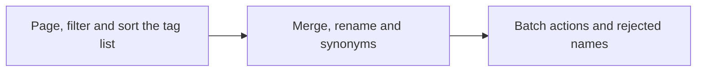

# Implementation Plan: Tidy up tags from the external API and MCP (merge, synonyms, confirm, reject, rename, delete)

**Branch**: `feature/039-external-tag-admin` | **Parent Issue**: #759

**Input**: The parent Issue. It is this feature's specification.

## Summary

A client holding an API token, such as an AI agent, reads the tag list in
pages with the tag admin screen's search, filters and sort, and merges,
renames, confirms, rejects and deletes tags, edits their synonyms, and lists
and clears rejected names, through `/api/v1` and as MCP tools. Every operation
runs the store operation the screen runs, so the state it leaves is the one
the screen would leave.

| Concern | Approach |
| --- | --- |
| List | `GET /api/v1/tags` takes the screen's `q`, `tentative`, `unused`, `sort`, `cursor` and `limit`; without `limit` it still returns every tag. The MCP tool `list_tags` pages by default ([research.md R-1](research.md#r-1-get-apiv1tags-takes-the-screens-list-parameters-and-only-the-mcp-tool-pages-by-default), [contracts/external-api.md §1](contracts/external-api.md#1-get-apiv1tags)) |
| Operations | Six literal `POST`, `GET` and `DELETE` routes under `/api/v1/tags/…` that name the tag in the body ([R-2](research.md#r-2-tag-operations-are-literal-post-routes-that-name-the-tag-in-the-body), [§2 to §7](contracts/external-api.md#2-post-apiv1tagsmerge)) |
| Confirm, reject, delete | One batch operation, no single-tag routes; a tag of the wrong kind is returned as not applicable ([R-3](research.md#r-3-confirm-reject-and-delete-go-only-through-post-apiv1tagsbatch)) |
| Name conflicts | `409 conflict` with the conflicting tag's `tagId` and `tagName`; a synonym that is another tag's original name merges only with `mergeTagId` ([R-4](research.md#r-4-name-conflicts-answer-409-conflict-with-the-conflicting-tags-tagid-and-tagname)) |
| Tool results | Every operation returns a JSON body ([R-5](research.md#r-5-every-operation-returns-a-json-body-so-every-tool-has-a-result)) |
| Parity with the screen | The handlers call the same `TagStore` operations through the same interface; no new write path ([R-6](research.md#r-6-the-external-handlers-call-the-same-tags-methods-as-the-screen-with-no-new-write-path)) |
| MCP | Six new tools and a changed `list_tags`, 14 tools in all ([§8](contracts/external-api.md#8-mcp-tools)) |

Not exposed: `POST /api/tags/impact` (the screen's confirmation counts; an
agent reads `videoCount` from the list) and the screen's single-tag confirm,
reject and delete routes (R-3). Out of scope, as the parent Issue says:
creating a tag on its own, per-token permissions, suggesting merge candidates,
undo, and the tag admin screen.

## Technical Context

**Canonical definitions**:

| Topic | Source |
| --- | --- |
| Boundaries, dependency direction, the authentication boundary, store roles | [ARCHITECTURE.md](../../ARCHITECTURE.md), [.golangci.yml](../../.golangci.yml) (depguard) |
| The external API and MCP: contract, compatibility policy, error shape, body limit, tool glue | [api/external-v1.yaml](../../api/external-v1.yaml), [specs/026-external-api/contracts/external-api.md](../026-external-api/contracts/external-api.md), [specs/026-external-api/contracts/mcp.md](../026-external-api/contracts/mcp.md), [specs/026-external-api/research.md](../026-external-api/research.md) (R-3 to R-5, R-7, R-8), [internal/httpapi/external.go](../../internal/httpapi/external.go), [internal/httpapi/external_video_tags.go](../../internal/httpapi/external_video_tags.go), [internal/httpapi/mcp.go](../../internal/httpapi/mcp.go), [docs/how-to/external-api.md](../../docs/how-to/external-api.md) |
| Tag operations the screen runs: list query, merge, rename, synonyms, batch, rejected names | [specs/014-video-tags/contracts/tags-api.md §3](../014-video-tags/contracts/tags-api.md#3-tag-management), [specs/031-tentative-tags/contracts/screen-api.md](../031-tentative-tags/contracts/screen-api.md), [specs/036-tag-admin-scale/contracts/screen-api.md](../036-tag-admin-scale/contracts/screen-api.md), [internal/httpapi/tags.go](../../internal/httpapi/tags.go), [internal/httpapi/router.go](../../internal/httpapi/router.go) (`Tags`), [internal/store/tags.go](../../internal/store/tags.go), [tag_listing.go](../../internal/store/tag_listing.go), [tag_synonyms.go](../../internal/store/tag_synonyms.go), [tag_batch.go](../../internal/store/tag_batch.go), [tentative_tags.go](../../internal/store/tentative_tags.go) |
| Domain values the operations use | [internal/domain/tag.go](../../internal/domain/tag.go), [tag_list.go](../../internal/domain/tag_list.go), [tag_batch.go](../../internal/domain/tag_batch.go), [rejected_tag_name.go](../../internal/domain/rejected_tag_name.go) |
| Concurrent edits from two surfaces | [specs/031-tentative-tags/research.md R-6](../031-tentative-tags/research.md#r-6-rejection-and-a-tentative-attach-of-the-same-name-rely-on-sqlite-write-serialization) |
| Generation and check entry points | [Taskfile.yml](../../Taskfile.yml) (`task check`, `task check-docs`, `task generate`) |

**Feature-specific context**:

- No migration, no new table or column, no domain event, no Go or npm
  dependency. No `data-model.md`: the feature adds no entity and changes no
  field ([P-2](../../docs/design-docs/plan-quality.md#p-2-do-not-create-an-artifact-with-nothing-to-say)).
- Two store signatures change so that every operation returns a body (R-5):
  `TagStore.RemoveSynonym` returns `(domain.Tag, error)` and
  `TagStore.ForgetRejectedTagName` returns `(bool, error)`. The screen handlers
  ignore the added value. `Tags` in `router.go` follows.
- `api/external-v1.yaml` only adds: six operations, six parameters on
  `listTags`, `Tag.createdAt`, three `TagList` fields, two `Error` fields, four
  `ErrorReason` values and `TagSort`. `internal/httpapi/extgen/` is regenerated
  with `task generate`.
- The size budget is acceptance criterion 1: one `list_tags` response at 2,000
  tags fits an agent's reading. With `limit` 100 a page is about 10 KB; the
  default of 100 inside the tool makes that the response of a call without
  arguments.
- [quickstart.md](quickstart.md) walks acceptance criteria 1 to 3 and 5 with a
  real MCP client, which `task check` does not run.

## Constitution Check

| Gate | Verdict |
| --- | --- |
| Dependency direction (ARCHITECTURE.md "Intended dependency direction") | Pass. `internal/httpapi` parses and converts; it reaches the store through the `Tags` interface it declares. `internal/app`, `internal/domain` and `cmd/mdm` do not change, except a `TagSynonymsAction` enum in `internal/domain` if the handler needs one |
| Store roles: one role per operation, no SQL outside `internal/store` | Pass. Every operation is an existing `TagStore` method (R-6); the two signature changes read values the transactions already have |
| API source of truth and generated files (AGENTS.md) | Pass. Edit `api/external-v1.yaml`, run `task generate`, never edit `internal/httpapi/extgen/` |
| `v1` compatibility policy (docs/how-to/external-api.md) | Pass. Only additions (R-1); the REST default for a request without `limit` stays "every tag" |
| Every request is classified by path before routing (ARCHITECTURE.md "Every read knows its viewer") | Pass. The new routes sit under `/api/v1`, which the boundary already classifies as bearer; the route-security test covers them with no new rule |
| Server text in English (gosmopolitan) | Pass. Error messages and tool descriptions are English; user data (tag names) passes through untranslated |
| Documents describe the present (core-beliefs.md) | Pass. Each unit updates `docs/how-to/external-api.md` and the tool table in `specs/026-external-api/contracts/mcp.md` for its part |

The verdicts hold after Phase 1. There is no violation for Complexity Tracking.

## Project Structure

### Documentation (this feature)

```text
specs/039-external-tag-admin/
├── plan.md               # This file
│                         # No spec.md — the parent Issue is the specification
├── research.md           # R-1 to R-6
├── quickstart.md         # Acceptance criteria 1 to 3 and 5 with a real MCP client
└── contracts/
    └── external-api.md   # The list parameters, six operations, schema and error changes, seven MCP tools
```

No `data-model.md` (see Technical Context). The parent Issue has no `ui` label,
so there is no `design` stage.

### Source Code

**Affected boundaries**:

| Boundary | What changes |
| --- | --- |
| `api/external-v1.yaml`, `internal/httpapi/extgen/` (generated) | The additions listed in Technical Context |
| `internal/httpapi` | `ListTags` in `external.go` parses the parameters (sharing the screen's `parseTagListQuery` rules); new handlers for the six operations in a new `external_tags.go`; the external error mapping for `ErrTagNotFound`, `TagNameConflict`, `TagMergeRequired` and `merge_same_tag`; `mcp.go` registers the six tools and the `list_tags` input with its default `limit`; `Tags` in `router.go` for the two changed signatures |
| `internal/store` | `RemoveSynonym` reads the tag in its transaction; `ForgetRejectedTagName` reports `RowsAffected` |
| `internal/domain` | A two-value action enum for the synonyms operation, if the handler does not reuse a string check |
| `docs/how-to/external-api.md`, `specs/026-external-api/contracts/mcp.md` | The "Tidy up tags" section, the agent example and the tool table |

**New paths**: `internal/httpapi/external_tags.go` and its tests.

**Structure decision**: follows the layout 026 chose, a separate handler type
`externalServer` in `internal/httpapi` with its own generated package
([specs/026-external-api/plan.md "Structure decision"](../026-external-api/plan.md#source-code)).

## Implementation Work

The units are ordered so that each one builds on the previous one's additions
to `api/external-v1.yaml`, `mcp.go` and the how-to, which keeps the generated
file and the tool list free of merge conflicts.



### Page, filter and sort the tag list in the external API and MCP

**Scope**: `Tag.createdAt`, the `TagList` fields and `TagSort` in
`api/external-v1.yaml`; the six parameters of `GET /api/v1/tags` and their
`400` answers; the `list_tags` tool input with `limit` defaulting to 100
([contracts/external-api.md §0, §1 and §8](contracts/external-api.md#0-schema-changes),
[research.md R-1](research.md#r-1-get-apiv1tags-takes-the-screens-list-parameters-and-only-the-mcp-tool-pages-by-default));
the list part of the how-to section and the `list_tags` row in the MCP tables
([§9](contracts/external-api.md#9-docshow-toexternal-apimd)).

**Dependencies**: None

**Acceptance**: `task check` passes. In httpapi tests, with 2,000 tentative
tags whose names share a term, `GET /api/v1/tags?tentative=true&q=<term>&limit=200`
followed by `cursor` reads every tag once and the last page has no
`nextCursor`; every page carries `total`, `totalAll` and `createdAt` on each
tag; `GET /api/v1/tags` without `limit` returns every tag and no `nextCursor`,
as the existing tests expect. In MCP tests, `list_tags` with no arguments
returns 100 items and a `nextCursor`, and `list_tags` with `limit: 10` and
`sort: "countDesc"` returns 10 items in count order. `sort` outside the enum,
`limit` 201, and a cursor from another sort return `400 invalid_request`, the
last with `invalid_cursor` (acceptance criterion 1).

### Merge, rename and edit synonyms of tags in the external API and MCP

**Scope**: `POST /api/v1/tags/merge`, `/tags/rename` and `/tags/synonyms`;
`Error.tagId` and `tagName`; the reasons `tag_not_found`, `tag_name_taken`,
`tag_merge_required` and `merge_same_tag`; `TagStore.RemoveSynonym` returning
the tag; the tools `merge_tags`, `rename_tag` and `update_tag_synonyms`
([contracts/external-api.md §2 to §4 and §8](contracts/external-api.md#2-post-apiv1tagsmerge),
[research.md R-2, R-4, R-5](research.md#r-2-tag-operations-are-literal-post-routes-that-name-the-tag-in-the-body));
their part of the how-to and the MCP tables.

**Dependencies**: Page, filter and sort the tag list in the external API and MCP

**Acceptance**: `task check` passes. In MCP tests, `merge_tags` of a tentative
source into a target returns the target with the source's name in `synonyms`
and `tentative: false`; afterwards the screen's `GET /api/tags` no longer lists
the source, and `GET /api/videos/{id}` of a video that carried the source lists
the target (acceptance criterion 2). `sourceIds` containing `targetId` returns
`400 merge_same_tag` and changes nothing; a missing target returns
`404 tag_not_found`; a half-missing `sourceIds` merges the rest and lists the
missing ids in `notFoundIds`. `rename_tag` to another tag's synonym returns
`409 tag_name_taken` with that tag's `tagId` and `tagName` and changes nothing.
`update_tag_synonyms` `add` of another tag's original name returns
`409 tag_merge_required` with its `tagId`; the same call with that
`mergeTagId` returns the tag with the name in `synonyms` and the other tag gone
from the list; `remove` returns the tag without the name. A test that runs the
same merge, rename and synonym add through the screen routes on an identical
fixture gets an identical `GET /api/tags` body (acceptance criterion 5).

### Confirm, reject and delete tags in bulk and manage rejected names in the external API and MCP

**Scope**: `POST /api/v1/tags/batch`, `GET` and `DELETE
/api/v1/tags/rejected-names`; `TagStore.ForgetRejectedTagName` reporting
`removed`; the tools `batch_tags`, `list_rejected_tag_names` and
`forget_rejected_tag_name`
([contracts/external-api.md §5 to §8](contracts/external-api.md#5-post-apiv1tagsbatch),
[research.md R-3, R-5](research.md#r-3-confirm-reject-and-delete-go-only-through-post-apiv1tagsbatch));
the rest of the how-to section, the agent example, the MCP tables, and the
removal of the sentence that confirming and rejecting are screen-only
([§9](contracts/external-api.md#9-docshow-toexternal-apimd)).

**Dependencies**: Merge, rename and edit synonyms of tags in the external API and MCP

**Acceptance**: `task check` passes. In MCP tests, `batch_tags` with
`action: "reject"` over a tentative tag, a confirmed tag and a missing id
returns the first in `appliedIds`, the second in `notApplicableIds` and the
third in `notFoundIds`, and the confirmed tag is unchanged (acceptance
criterion 4); `list_rejected_tag_names` then lists the rejected name, and
`update_video_tags` with `tentative: true` and that name returns it in
`skippedTags` and creates no tag (acceptance criterion 3); `batch_tags`
`confirm` leaves the tag with `tentative: false` in `list_tags`; `delete` of a
tentative tag puts it in `notApplicableIds`. `forget_rejected_tag_name` returns
`removed: true` once and `removed: false` the second time, and the next
tentative attach creates the tag again. The MCP tool list has 14 tools with the
hints of §8. `task check-docs` passes with the how-to and the 026 tool table
updated.
