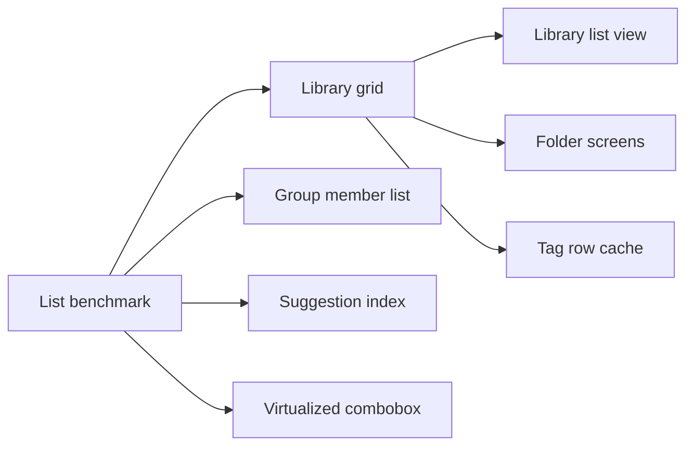

# Implementation Plan: Long lists that stay responsive at thousands of items

**Branch**: `feature/040-long-list-rendering` | **Parent Issue**: #675

**Input**: The parent Issue. It is this feature's specification.

## Summary

The library, folder and folder search grids, the library list view, the video
page's group member list and the tag suggestions stay responsive with 30,000
videos, a 6,000-video group and 3,000 tags, without changing how cards look or
are ordered (#675). Each long list draws only the items near the viewport with
`@tanstack/react-virtual`, already a dependency since 036; the list position
becomes an item anchor so return, zoom and width changes land on the same card;
tag suggestions filter an index prepared once per tag list. Server latency is
#674's and out of scope.

## Technical Context

**Canonical definitions**: [ARCHITECTURE.md, Web layer](../../ARCHITECTURE.md#web-layer),
[library-ui.md](../../docs/design-docs/library-ui.md) (window as scroll owner,
shared grid, cards), [014 UI design](../014-video-tags/ui-design.md) (tag row
overflow, Combobox), [017 UI design, Member list](../017-folder-groups/ui-design.md)
and [017 contract](../017-folder-groups/contracts/folder-groups-api.md) (group
window from #674), [014 list-url.md](../014-video-tags/contracts/list-url.md)
(list snapshot), `web/package.json`, `task check`.

**Feature-specific context**:

- Scale and budgets come from the parent Issue's acceptance criteria: 10,000
  and 30,000 videos, 3,000 tags, a 6,000-video group, 1280×800 headless
  Chromium, frames over 50 ms, 0.5 s return, 0.2 s and 0.1 s suggestions.
- No API, schema or dependency changes. The server already pages lists by 60
  and the group by 100 (#674).
- This reverses [library-ui.md, No virtual scrolling](../../docs/design-docs/library-ui.md#no-virtual-scrolling),
  whose own condition was "revisit only after measuring what is slow"; #675 is
  that measurement ([R-1](research.md#r-1-the-card-grid-draws-only-the-rows-near-the-viewport)).

## Constitution Check

| Rule | Source | Verdict |
| --- | --- | --- |
| Pages and components never call `fetch` | [ARCHITECTURE.md, Web layer](../../ARCHITECTURE.md#web-layer) | Pass: no new request; the group list keeps `listVideoGroupMembers` in `api/` |
| The window owns scrolling | [library-ui.md](../../docs/design-docs/library-ui.md#the-window-owns-scrolling) | Pass: grids use `useWindowVirtualizer`; the group column at `lg` already has its own container |
| Visual values only from `@theme` | [library-ui.md](../../docs/design-docs/library-ui.md#visual-values-in-one-css-location-with-contrast-guaranteed-by-tests) | Pass: no new colour; the blur stays ([R-4](research.md#r-4-the-duration-badge-keeps-its-blur)) |
| Documentation changes with behaviour | [AGENTS.md](../../AGENTS.md) | Each unit below names the documents it updates |
| Dependency updates follow Renovate | [dependency-updates.md](../../docs/how-to/dependency-updates.md) | Not at stake: no new dependency |

## Project Structure

### Documentation (this feature)

```text
specs/040-long-list-rendering/
├── plan.md          # This file
├── research.md      # R-1..R-8
└── quickstart.md    # Benchmark scenes per acceptance criterion
```

No `data-model.md`: the only data change is the client-side list snapshot,
which stores an anchor instead of `scrollY`
([R-3](research.md#r-3-one-item-anchor-restores-the-position-after-return-zoom-width-change-and-reload)).
No `contracts/`: no HTTP or URL contract changes.

### Source Code

**Affected boundaries**:

| Path | Change |
| --- | --- |
| `web/src/videoList/` | `VirtualGrid`, `useListAnchor` (replaces `useZoomAnchor`) |
| `web/src/api/listSnapshot.ts` | Anchor in place of `scrollY` |
| `web/src/library/` | Grid and list view through the virtualizer; tag row cache; one suggestion builder |
| `web/src/folders/` | Subfolder, video and search grids through `VirtualGrid` |
| `web/src/player/` | Virtualized member list; `VideoTags` uses the shared builder |
| `web/src/ui/Combobox.tsx` | Virtualized listbox |
| `scripts/` | `benchkit` (runner moved out of `tagsbench`), `listsbench` |
| `web/bench/` | `lists.bench.ts` |

**Structure decision**: `VirtualGrid` lives in `web/src/videoList/` beside
`Grid`, because the library and folder screens share it
([ARCHITECTURE.md, Web layer](../../ARCHITECTURE.md#web-layer)). The member
list's virtualizer stays inside `RelatedVideos.tsx`: no other screen has a
list that switches scroll owner by width.

## Implementation Work

The units and what must land first:



### Measure the library, folder, group and tag suggestion screens with scale data

**Scope**: Move the runner out of `scripts/tagsbench` into `scripts/benchkit`
without changing `tagsbench`'s flags or output; add `scripts/listsbench`, its
seed and `web/bench/lists.bench.ts` with every scene of
[quickstart.md](quickstart.md); add a how-to beside
`docs/how-to/tags-admin-benchmark.md` and link it from it
([R-8](research.md#r-8-a-list-benchmark-shares-the-tag-benchmarks-runner)).

**Dependencies**: None

**Acceptance**: `go run ./scripts/listsbench -videos 10000` writes a
`result.md` with one row per quickstart step; `go run ./scripts/tagsbench
-scale 1000` still writes the same table as before; the PR body records the
baseline numbers of the current `main` at both scales.

### Draw only the visible card rows in the library grid, and keep the position by item

**Scope**: `VirtualGrid` with the column rule of
[R-1](research.md#r-1-the-card-grid-draws-only-the-rows-near-the-viewport) and
loading placeholders as row items; `useListAnchor` and the snapshot anchor of
[R-3](research.md#r-3-one-item-anchor-restores-the-position-after-return-zoom-width-change-and-reload)
for return, zoom, column-count change and `onBundled`; the library grid view
uses both. Rewrite library-ui.md "No virtual scrolling" to describe the
virtualized grid and fix its inbound links (014 UI design "Overflow", 036
research), and update the snapshot sentence of 014 list-url.md.

**Dependencies**: Measure the library, folder, group and tag suggestion screens with scale data

**Acceptance**: Unit tests show the column count for each zoom at 375, 1280
and 1920 px, the anchor item back at the top after return, a zoom change and a
column-count change, and selection kept for a card scrolled out and back;
`listsbench` library grid scenes at both zooms meet acceptance criteria 1, 2
and 5; a visual review at 375 and 1280 px shows cards, the centred last row
and placeholders as before.

### Draw only the visible rows in the library list view

**Scope**: The list view `tbody` through the window virtualizer with spacer
rows and the index-based stripe of
[R-2](research.md#r-2-the-list-view-draws-only-the-rows-near-the-viewport-striped-by-item-index),
using the same anchor.

**Dependencies**: Draw only the visible card rows in the library grid, and keep the position by item

**Acceptance**: Unit tests show alternating stripes by item index across a
scroll and the anchor restored after return; the `listsbench` list view scene
meets acceptance criterion 1; a visual review at 375 and 1280 px shows the
columns and stripes as before.

### Draw only the visible cards on the folder screen and in folder search results

**Scope**: `FolderContents` (subfolders and videos), `RootSearchResults` and
`FolderSearchResults` render through `VirtualGrid`, and the folder screens
restore by anchor; update the folder screen's scroll restoration wording in
library-ui.md if it names `scrollY`.

**Dependencies**: Draw only the visible card rows in the library grid, and keep the position by item

**Acceptance**: Folder screen tests show the anchor item after return and after
a zoom change; the `listsbench` folder scene at the smallest zoom meets
acceptance criterion 1; a visual review at 375 and 1280 px of a folder with
subfolders and videos and of both search results.

### Reuse the tag row measurement when a card is drawn again

**Scope**: The per-list cache of visible chip counts in
`TagRowMeasureProvider` and its use in `CardTagRow`
([R-5](research.md#r-5-a-cards-tag-row-reuses-its-measurement-when-it-is-drawn-again));
update the observer sentence in 014 UI design "Overflow".

**Dependencies**: Draw only the visible card rows in the library grid, and keep the position by item

**Acceptance**: A unit test shows a remounted row with the same tags and width
reading no chip width, and a changed width measuring again; `+N` stays as
before in a visual review at the smallest zoom.

### Draw only the visible members in the video page's group list, and jump to the current member

**Scope**: The member list virtualized with the two scroll owners of
[R-6](research.md#r-6-the-group-member-list-virtualizes-the-loaded-members-and-the-position-jumps-to-the-current-member),
the open-time scroll through the virtualizer, the prepend correction kept, and
the position as a button with an accessible name in `web/src/i18n/en.ts`;
update 017 UI design "Member list" and library-ui.md "Group members".

**Dependencies**: Measure the library, folder, group and tag suggestion screens with scale data

**Acceptance**: Unit tests show drawn rows bounded after loading 1,000 members,
the current member drawn after pressing the position at both widths, and the
viewed row unmoved after a prepend; the `listsbench` group scenes meet
acceptance criterion 3; a visual review at 375 and 1280 px shows the rows and
the position as before.

### Prepare tag suggestions once per tag list, shared by the video page and the selection bar

**Scope**: One builder in `tagChoices.tsx` with the prepared index of
[R-7](research.md#r-7-tag-suggestions-filter-a-prepared-index-and-draw-only-the-visible-rows),
an excluded-ids parameter for the video page, and `VideoTags`'s own
`buildOptions` removed.

**Dependencies**: Measure the library, folder, group and tag suggestion screens with scale data

**Acceptance**: A unit test compares the new builder's options and exact option
with the current implementation's for a set of inputs (empty, prefix, synonym,
case, natural order, excluded ids) and finds them equal; the `listsbench`
per-keystroke scenes meet acceptance criterion 4.

### Draw only the visible tag suggestions in the combobox

**Scope**: `Combobox`'s listbox (popup and `inline`) through `useVirtualizer`,
keeping the active option drawn, `aria-setsize` and `aria-posinset`, and
arrow-key scrolling through the virtualizer
([R-7](research.md#r-7-tag-suggestions-filter-a-prepared-index-and-draw-only-the-visible-rows));
update 014 UI design "Combobox" with the drawn range and the set size.

**Dependencies**: Measure the library, folder, group and tag suggestion screens with scale data

**Acceptance**: Combobox tests show at most a screenful of options drawn for
3,000 options, ↓ to the last option making it drawn and `aria-activedescendant`
resolve, and the create row still last; the `listsbench` open scenes meet
acceptance criterion 4; a visual review of the video page, the selection bar
and the merge dialog lists.
