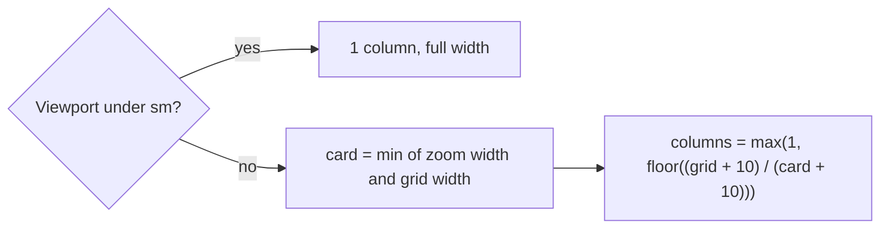
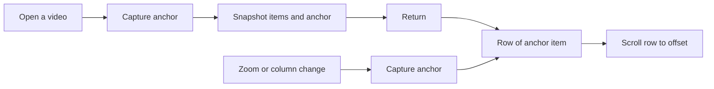

# Research: Long lists that stay responsive at thousands of items

Inherited decisions: the web layer and its directories
([ARCHITECTURE.md, Web layer](../../ARCHITECTURE.md#web-layer)), the window as
the scroll owner and the shared grid
([library-ui.md](../../docs/design-docs/library-ui.md)), the
`@tanstack/react-virtual` dependency and its use in the tag admin list
([036 research R-2](../036-tag-admin-scale/research.md#r-2-rows-are-virtualized-with-usewindowvirtualizer-from-tanstackreact-virtual)),
the group member window and `GET /api/videos/{id}/group-members` (#674,
[017 contract](../017-folder-groups/contracts/folder-groups-api.md)), and the
scale-data benchmark pattern
([036 research R-9](../036-tag-admin-scale/research.md#r-9-scriptstagsbench-builds-scale-data-and-a-playwright-script-measures-the-production-build)).
This file records only the decisions this feature adds.

## R-1: The card grid draws only the rows near the viewport

**Decision**: The library grid, a folder's subfolders and videos, and both
folder search results render through one virtualized grid
(`web/src/videoList/VirtualGrid.tsx`) built on `useWindowVirtualizer`, which
splits the items into rows of a computed column count and draws only the rows
within the viewport and an overscan of 2 rows on each side.

| Option | Elements after 1,000 cards | Return from the video page | Verdict |
| --- | --- | --- | --- |
| **Rows of computed width, `useWindowVirtualizer`, measured heights** | About one screen of cards | Draws one screen | Chosen |
| `content-visibility: auto` on each card | Grows with every card (about 55 each) | React still renders every card (the 3.9 s task) | Rejected: fails acceptance criteria 2 and 5 |
| Keep only the pages near the viewport and refetch the rest | One to three pages | Refetches | Rejected: a refetch can return a different order after an import, so restored cards and position diverge (Edge Case "next page loading") |
| `react-window` grid | One screen | Draws one screen | Rejected: needs fixed row heights; card rows differ by title wrap and tag row |

**Rationale**: The two reasons
[library-ui.md, No virtual scrolling](../../docs/design-docs/library-ui.md#no-virtual-scrolling)
gave no longer hold: #675 measured 50,000 elements and 93 long frames at 900
cards, and the column count is a formula of two widths (below). Each virtual row
is the current `Grid` row (`flex justify-center gap-2.5`), so a partial last
row stays centred and the cards look and order exactly as now (requirement 5).

The column count follows the wrapping the flex grid does today:

`grid` is the grid element's width from a `ResizeObserver`, `card` is the zoom
level's `--spacing-card-N` resolved to pixels, and 10 is `gap-2.5`. The
placeholder cards shown while the next page loads are items of the same rows,
so they flow after the last card as they do now. Selection, previews and the
infinite-scroll sentinel keep their state outside the cards, so a card that
leaves the drawn range loses nothing (Edge Case "select all, then scroll").

## R-2: The list view draws only the rows near the viewport, striped by item index

**Decision**: The library list view keeps its `table` and virtualizes `tbody`
rows with the same `useWindowVirtualizer`, using one spacer row above and one
below the drawn rows; the zebra stripe comes from the item index instead of
`nth-child`.

| Option | Verdict |
| --- | --- |
| **Spacer rows inside `tbody`, stripe from index** | Chosen |
| Keep `nth-child(odd)` | Rejected: the spacer row and a moving first drawn row flip the stripes while scrolling |
| Replace the table with absolutely positioned `div` rows | Rejected: loses the table semantics and the shared column widths of the header |

**Rationale**: The list view is light per row (540 rows were 8,000 elements),
but acceptance criterion 5 applies to every view. Every column except the title
has a fixed width, so changing which rows are drawn does not move the columns.

## R-3: One item anchor restores the position after return, zoom, width change and reload

**Decision**: The list position is an anchor, the key of the topmost visible
item and its offset from the top bar, captured by one hook
(`useListAnchor`, replacing `useZoomAnchor`) and restored by scrolling the
virtual row that now holds that item; the list snapshot stores this anchor
instead of `scrollY`.

| Option | Verdict |
| --- | --- |
| **Item anchor, restored through the virtualizer** | Chosen |
| Restore `scrollY` as now | Rejected: undrawn rows have estimated heights, so the same `scrollY` lands on other cards |
| Store the virtualizer's measurement cache in the snapshot | Rejected: invalid when the width or the sidebar changed while on the video page, which changes the column count |

**Rationale**: Back navigation (requirement 2), a zoom change and a window
resize that changes the column count (Edge Case "width or zoom") all have the
same question, "which item was at the top", and an item index survives a
changed column count where a pixel offset does not. The snapshot keeps its
items, total and cursor, so returning makes no list request, as in
[014 list-url.md](../014-video-tags/contracts/list-url.md). `onBundled`'s reload
and the folder screens use the same anchor.

## R-4: The duration badge keeps its blur

**Decision**: `backdrop-blur-sm` stays on the duration badge of video and group
cards.

| Option | Verdict |
| --- | --- |
| **Keep the blur; virtualization bounds the layers to the drawn cards** | Chosen |
| Remove the blur | Rejected: changes the card's look, which requirement 5 keeps |

**Rationale**: The 3.25 s of Layerize in #675 grows with the number of cards
in the document, one compositing layer each; after R-1 that number is about
one screen plus overscan. If the benchmark still shows a frame over 50 ms
caused by Layerize at the smallest zoom, the change of look goes back to this
Plan rather than being made in an implementation PR.

## R-5: A card's tag row reuses its measurement when it is drawn again

**Decision**: `TagRowMeasureProvider` keeps the computed visible chip count per
tag list and row width, and a `CardTagRow` that mounts with a known pair takes
the count without reading chip widths.

| Option | Verdict |
| --- | --- |
| **Cache by tag ids and row width in the list's provider** | Chosen |
| Measure on every mount, as now | Rejected: with virtualization every scroll back mounts rows again, each forcing layout reads (0.5 s in #675) |
| Compute chip widths from canvas text metrics | Rejected: chip width also has padding, icons and the folder-derived border, which a second width model would have to track |

**Rationale**: The width of the row and the tags decide the count, so the pair
is a complete key. The provider is per list, so the cache disappears with the
list and needs no invalidation beyond the key.

## R-6: The group member list virtualizes the loaded members, and the position jumps to the current member

**Decision**: The member list draws only the loaded members near the view, with
`useVirtualizer` on the column's scroll container at `lg` and up and
`useWindowVirtualizer` below `lg`; the `3 / 12` position becomes a button that
scrolls the current member into view.

| Option | Verdict |
| --- | --- |
| **Virtualize the loaded members; loading stays the #674 window** | Chosen |
| A row for every position (`total`), loading the pages a drawn range needs | Rejected: below `lg` the page would be thousands of rows tall and the related videos unreachable |
| Always draw the current member's row, without a jump control | Rejected: the row exists but the user still has no way back to it (Edge Case "current video off screen") |
| A separate `Jump to current` button | Rejected: adds a control to the column header; the position already names the current member |

**Rationale**: #674 made the first view 100 members, but scrolling loads them
all and each row holds a hover preview, a scrub band and a window `resize`
listener. The two scroll owners differ by width (as the loading direction
already does), so the virtualized list is two components chosen by
`useWideScreen`. The open-time scroll at `lg` uses `scrollToIndex` with
`align: "auto"` in place of `scrollIntoView`, and the prepend correction keeps
working because the virtualizer's total height grows with the prepended rows.

## R-7: Tag suggestions filter a prepared index and draw only the visible rows

**Decision**: One builder (`web/src/library/tagChoices.tsx`) serves the video
page and the selection bar: it prepares, once per tag list, each tag's folded
name and synonyms in natural order, filters that order per keystroke with a
stable prefix-first partition, and `Combobox` draws only the visible options
with `useVirtualizer` on its list.

| Option | Open with 3,000 tags | Per keystroke | Verdict |
| --- | --- | --- | --- |
| **Prepared index + virtualized listbox** | About 10 rows drawn | Linear scan, no sort | Chosen |
| Server search (`GET /api/tags?q=…&limit=`) as in the merge dialog | A request | A request; the tag count aggregation dominates | Rejected: misses 0.1 s per keystroke and changes matching from `includes` to the server fold |
| Show the first N matches only | N rows | Linear scan | Rejected: with an empty input most tags become unreachable from the list |
| `useDeferredValue` only | 3,000 rows drawn | Deferred, still sorted | Rejected: the open itself is the 0.9 to 1.2 s task |

**Rationale**: The result order is unchanged
([014 UI design, Combobox](../014-video-tags/ui-design.md#combobox)): natural
order is computed once, and a stable partition by prefix match keeps it within
each part. The active option is always in the drawn range (`rangeExtractor`) so
`aria-activedescendant` points at an element, and each option carries
`aria-setsize` and `aria-posinset` so assistive technology still announces the
full count. The merge dialog's server-backed list goes through the same
`Combobox` and needs no change.

## R-8: A list benchmark shares the tag benchmark's runner

**Decision**: The runner of `scripts/tagsbench` (seed, copy, start `bin/mdm`,
run a Playwright file, write `result.md`) moves into `scripts/benchkit`, and a
new `scripts/listsbench` uses it with a seed of its own and
`web/bench/lists.bench.ts`.

| Option | Verdict |
| --- | --- |
| **Shared runner, separate command and seed** | Chosen |
| More flags on `tagsbench` | Rejected: its data names, defaults and doc are about tag scale; the list scenes need a folder layout it does not make |
| A script kept outside the repository, as for #674 | Rejected: acceptance is a measurement; the next change to these screens needs to repeat it |

**Rationale**: The seed places 6,000 videos in one leaf folder (a group), 3,000
in a folder that has a child folder (not a group, for the folder screen), and
the rest directly under the media folder, with 3,000 tags from `tagsbench`'s
plan; startup builds the folder index, so the seed writes only rows through
store roles as `tagsbench` does. It runs at 10,000 and 30,000 videos and is not
part of `task check` or CI.
