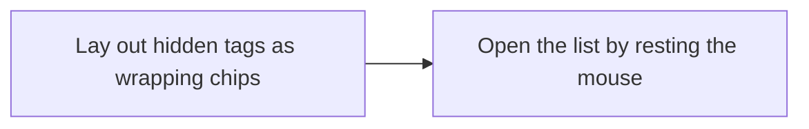

# Implementation Plan: Hidden tags behind a card's `+N`, visible and pressable at any count

**Branch**: `feature/041-tag-overflow-list` | **Parent Issue**: #813

**Input**: The parent Issue. It is this feature's specification.

## Summary

On the library and folder screens, the list behind a card's `+N` chip opens
when the mouse rests on `+N`, stays open while the pointer is on `+N` or the
list, lays the hidden tags out as wrapping chips inside the viewport with
scrolling for what does not fit, and shows every name in full; pressing `+N`
keeps opening it for touch and keyboard. The list stays the existing `Popover`
of `CardTagRow`, which both screens render, so one component change covers
video cards, group cards and folder-screen cards.

| Concern | Approach |
| --- | --- |
| Opening by hover | A hover-intent hook drives the `Popover`'s `open`: 400 ms rest of a mouse pointer opens, 200 ms after leaving `+N` and the list closes; pressing keeps working ([research.md R-1](research.md#r-1-resting-the-mouse-on-n-opens-the-same-popover-that-pressing-opens)) |
| Every tag reachable, few eye movements | Wrapping chips; `PopoverContent` capped to Radix's available height; the list scrolls inside ([R-2](research.md#r-2-the-list-is-a-wrapping-row-of-chips-that-scrolls-inside-the-viewport)) |
| Long names | No truncation in the list; a name wider than the list wraps inside its chip ([R-3](research.md#r-3-chips-in-the-list-never-truncate-a-long-name-wraps-inside-its-chip)) |
| Tags or hidden count change while open | The list is derived from the row's current tags and count on every render ([R-4](research.md#r-4-the-list-is-derived-from-the-current-tags-never-copied-when-it-opens)) |
| Pressing a tag in the list | Unchanged: `onPress` filters the library or opens `/?tag=<id>` from a folder, and the list closes |

Out of scope, as the parent Issue says: which tags the row shows, tags in the
list view, hidden tags while selecting (`+N` stays non-interactive and never
opens), and the video page's tags.

## Technical Context

**Canonical definitions**:

| Topic | Source |
| --- | --- |
| Web layer boundaries and directories | [ARCHITECTURE.md, Web layer](../../ARCHITECTURE.md#web-layer) |
| The tag row, `+N`, the fit measurement, pressing and selection | [specs/014-video-tags/ui-design.md, Overflow](../014-video-tags/ui-design.md#overflow) and [Card structure and pressing](../014-video-tags/ui-design.md#card-structure-and-pressing); [web/src/library/CardTagRow.tsx](../../web/src/library/CardTagRow.tsx), [TagRowMeasure.tsx](../../web/src/library/TagRowMeasure.tsx), [tagRowOverflow.ts](../../web/src/library/tagRowOverflow.ts); [web/src/folders/useFolderTagsRow.tsx](../../web/src/folders/useFolderTagsRow.tsx) |
| Chip forms | [017 UI design, Folder-derived tag chip](../017-folder-groups/ui-design.md#folder-derived-tag-chip), [031 UI design, Tentative mark](../031-tentative-tags/ui-design.md#tentative-mark), [components.md, Badge](../../web/registry/rules/components.md#badge) |
| Design system: `Popover`, tokens, checks and the exception list | [docs/design-docs/design-system.md](../../docs/design-docs/design-system.md), [components.md, Popover](../../web/registry/rules/components.md#popover), [web/src/ui/shadcn/popover.tsx](../../web/src/ui/shadcn/popover.tsx), [web/design-exceptions.js](../../web/design-exceptions.js), [038 contracts/registry.md](../038-design-system/contracts/registry.md) |
| Hover conventions: mouse-only 400 ms rest, width read in CSS | [010 UI design, Interaction](../010-hover-video-preview/ui-design.md#interaction), [library-ui.md, Width breakpoints in CSS, and the sidebar exception](../../docs/design-docs/library-ui.md#width-breakpoints-in-css-and-the-sidebar-exception) |
| Screen text | [web/src/i18n/en.ts](../../web/src/i18n/en.ts) (`library.tagRow`) |
| Browser tests and check entry points | [web/e2e/tags.e2e.ts](../../web/e2e/tags.e2e.ts), [Taskfile.yml](../../Taskfile.yml) (`task check`, `task check-docs`, `task test-e2e`, `task generate`) |

**Feature-specific context**:

- Web layer only: no API, store or Go change, no new npm dependency (Radix
  Popover is already in use), no new screen text. No `data-model.md` and no
  `contracts/`: the feature adds no entity and changes no interface
  ([P-2](../../docs/design-docs/plan-quality.md#p-2-do-not-create-an-artifact-with-nothing-to-say)).
- `PopoverContent` gains the available-height cap for every popover (R-2). A
  popover whose content is taller than the viewport overflows the capped box
  as it overflowed the viewport before; none of the existing popovers is known
  to be that tall. The `popover.tsx` entry in `web/design-exceptions.js` grows
  by that class, and `task generate` rebuilds the registry item.
- Hover is read from `pointerType`, not from the screen width, which keeps
  library-ui.md's rule that width is read in CSS.
- The list is portaled to `body`, so a pointer resting on it has left the
  card and the hover preview stops as on any pointer leave ([010 UI design,
  Interaction](../010-hover-video-preview/ui-design.md#interaction) rule 4).
  Nothing changes there: the preview is incidental while the tags are being
  read.
- The look of the list, the chip's wrapped form, the popover width step, and
  the hover state of `+N` are the design stage's (`ui` label): `ui-design.md`
  is written next and the units below follow it.
- [quickstart.md](quickstart.md) walks acceptance criteria 1 to 5 with a
  30-tag video at 1280×800 and 390×844; `task check` and `task test-e2e`
  check the behaviour, not how the list looks.

## Constitution Check

| Gate | Verdict |
| --- | --- |
| Radix imported only under `web/src/ui`; no raw `<button>`, no arbitrary class outside the exception list (design-system.md "Checks and exceptions") | Pass. `CardTagRow` keeps using `Popover` and `Button`; the one Radix variable class goes into `popover.tsx` with its `special` entry |
| Width read in CSS, not in JavaScript (library-ui.md) | Pass. The hook branches on `pointerType`, as the hover preview does |
| Every screen is built from the design system; a missing component is added there first (design-system.md) | Pass. No new component: `Popover` and `Badge`-shaped `Button` compose the list; the design stage records the composition |
| Documents describe the present (core-beliefs.md) | Pass. The units update 014's Overflow section and library-ui.md's Cards table for the new list |
| Screen text in the English catalog (i18n.md) | Pass. No new text; `+N` keeps its accessible name |

The verdicts hold after Phase 1. There is no violation for Complexity Tracking.

## Project Structure

### Documentation (this feature)

```text
specs/041-tag-overflow-list/
├── plan.md          # This file
│                    # No spec.md — the parent Issue is the specification
├── research.md      # R-1 to R-4
├── ui-design.md     # Written by the design stage (ui label)
└── quickstart.md    # Acceptance criteria 1 to 5 with a 30-tag video at two widths
```

No `data-model.md` and no `contracts/` (see Technical Context).

### Source Code

**Affected boundaries**:

| Boundary | What changes |
| --- | --- |
| `web/src/library` | `CardTagRow.tsx`: the list's layout, the chip's non-truncating form in the list, the hover wiring; a new hover-intent hook and its test; `CardTagRow.test.tsx` |
| `web/src/ui/shadcn/popover.tsx`, `web/design-exceptions.js`, `web/registry/r/` (generated) | The available-height cap and its exception entry; the rebuilt `popover` item |
| `web/e2e/tags.e2e.ts` | The browser tests of acceptance criteria 1 to 5 at 1280×800 and 390×844 |
| `specs/014-video-tags/ui-design.md`, `docs/design-docs/library-ui.md` | The Overflow section points to this feature for the list; the Cards table names the hover-opened list |

**New paths**: `web/src/library/useHoverOpen.ts` and `useHoverOpen.test.ts`
(the name may follow `ui-design.md`).

**Structure decision**: the hover-intent hook lives beside its one consumer in
`web/src/library`, not in `web/src/hooks` (hooks shared by registry
components) and not as a prop of `Popover`. A `Popover` that opens on hover is
this one interaction; giving the shared component a mode for it would make
every popover carry timing it never uses. The hook moves to `web/src/hooks`
when a second consumer appears.

## Implementation Work

The layout lands first, so the hover unit opens the list in its final form and
the two units never edit the same lines of `CardTagRow.tsx` at once.



### Lay out a card's hidden tags as wrapping chips that stay inside the screen

**Scope**: The list's wrapping layout, the `PopoverContent` height cap with its
exception entry and rebuilt registry item, the non-truncating chip in the
list, and the list derived from the row's current tags
([research.md R-2](research.md#r-2-the-list-is-a-wrapping-row-of-chips-that-scrolls-inside-the-viewport),
[R-3](research.md#r-3-chips-in-the-list-never-truncate-a-long-name-wraps-inside-its-chip),
[R-4](research.md#r-4-the-list-is-derived-from-the-current-tags-never-copied-when-it-opens));
the look follows `ui-design.md`. The browser tests of acceptance criteria 1
and 5 and of the edge cases for a card near the bottom and right edges, and
the updates to 014's Overflow section and library-ui.md's Cards table.

**Dependencies**: None

**Acceptance**: `task check` and `task check-docs` pass. `task test-e2e` on
`tags.e2e.ts`: with a video of 30 tags, one of them 60 characters long, at
1280×800 and at 390×844, pressing `+N` opens a list whose bounding box lies
inside the viewport, the last tag is visible after scrolling the list and
pressing it filters the library and closes the list (acceptance criterion 1);
the 60-character name is rendered in full, on more than one line, with no
`…` (criterion 5); for the last card of the grid at 1280×800 the list opens
above or beside `+N` and still lies inside the viewport (edge case). In
`CardTagRow.test.tsx`, re-rendering with fewer tags while the list is open
removes the missing tag from the list, and re-rendering with every tag fitting
unmounts `+N` and the list (R-4). The screen changes, so the implementation
PR carries screenshots of the list at both widths against the review criteria
of `ui-design.md`.

### Open a card's hidden-tag list by resting the mouse on `+N`

**Scope**: The hover-intent hook and its wiring to the `Popover` in
`CardTagRow`: 400 ms open on a resting mouse pointer, 200 ms close after
leaving `+N` and the list, no focus move for a hover-opened list, pressing
unchanged ([research.md R-1](research.md#r-1-resting-the-mouse-on-n-opens-the-same-popover-that-pressing-opens));
the hover state of `+N` from `ui-design.md`. The browser tests of acceptance
criteria 2, 3 and 4.

**Dependencies**: Lay out a card's hidden tags as wrapping chips that stay inside the screen

**Acceptance**: `task check` passes. The hook's unit test with fake timers
shows: a mouse pointer entering opens after 400 ms and not at 399 ms; leaving
before that cancels; leaving `+N` for the list and re-entering within 200 ms
keeps it open; leaving both for 200 ms closes; a `touch` pointer never opens
it. `task test-e2e` on `tags.e2e.ts` at 1280×800: moving the mouse onto `+N`
and waiting opens the list without a click, moving into the list and pressing
a chip filters and closes it (criterion 2); moving across `+N` and away within
100 ms never opens it (criterion 3); `Escape` and a press outside close a
hover-opened list; `document.activeElement` is unchanged after a hover open.
At 390×844 with touch emulation, tapping `+N` opens the list; with the
keyboard, `Tab` to `+N` and `Enter` opens it, `Tab` reaches the first chip and
`Enter` filters (criterion 4). The screen changes, so the implementation PR
carries a screenshot of `+N` in its hover state against `ui-design.md`.
