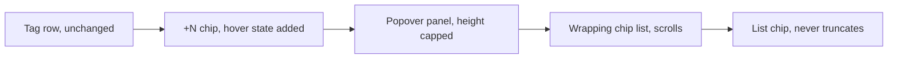
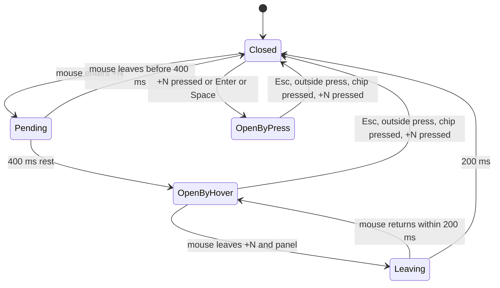

# UI design: Hidden tags behind a card's `+N`, visible and pressable at any count

**Feature**: [parent Issue #813](https://github.com/syudead/vv/issues/813) ·
[plan.md](plan.md) ·
[research.md R-1](research.md#r-1-resting-the-mouse-on-n-opens-the-same-popover-that-pressing-opens) ·
[R-2](research.md#r-2-the-list-is-a-wrapping-row-of-chips-that-scrolls-inside-the-viewport) ·
[R-3](research.md#r-3-chips-in-the-list-never-truncate-a-long-name-wraps-inside-its-chip) ·
[R-4](research.md#r-4-the-list-is-derived-from-the-current-tags-never-copied-when-it-opens) ·
[quickstart.md](quickstart.md)

Sources that already decide things, linked rather than repeated here:

| Topic | Source |
| --- | --- |
| Tokens, closed scales, shadows only on floating layers | [design-system.md, Foundations](../../docs/design-docs/design-system.md#foundations); the values in `@theme` of [`web/src/ui/tokens.css`](../../web/src/ui/tokens.css), named here and never copied |
| `Popover` and `Badge`: what they are for, default width, variants | [components.md, Popover](../../web/registry/rules/components.md#popover) and [Badge](../../web/registry/rules/components.md#badge); [`popover.tsx`](../../web/src/ui/shadcn/popover.tsx) (the panel's surface, radius, shadow, offset and collision padding) |
| The tag row, the `+N` chip, how many chips fit, pressing, selection | [014 UI design, Tag row](../014-video-tags/ui-design.md#tag-row), [Overflow](../014-video-tags/ui-design.md#overflow) and [Card structure and pressing](../014-video-tags/ui-design.md#card-structure-and-pressing); the current [`CardTagRow.tsx`](../../web/src/library/CardTagRow.tsx) |
| The folder-derived chip and the tentative mark | [017 UI design, Folder-derived tag chip](../017-folder-groups/ui-design.md#folder-derived-tag-chip), [031 UI design, Tentative mark](../031-tentative-tags/ui-design.md#tentative-mark) |
| Mouse-only 400 ms rest before a hover reveals something; the card's hover preview | [010 UI design, Interaction](../010-hover-video-preview/ui-design.md#interaction) |
| Interaction states, width read in CSS, cards | [library-ui.md, Interaction states](../../docs/design-docs/library-ui.md#interaction-states), [Width breakpoints in CSS, and the sidebar exception](../../docs/design-docs/library-ui.md#width-breakpoints-in-css-and-the-sidebar-exception), [Cards](../../docs/design-docs/library-ui.md#cards) |
| Screen text | [`web/src/i18n/en.ts`](../../web/src/i18n/en.ts) (`library.tagRow`); this feature adds none |

This feature changes one component, `CardTagRow`, which video cards, group
cards and folder-screen cards render. The diagram shows its parts and which of
them change.

Unchanged: which tags the row shows and how many fit, the chips in the row,
`+N` while selecting (a plain chip, no list), the list view, and the video
page's tags (the parent Issue's out-of-scope list).

## Why this shape

The list stays a `Popover` anchored to `+N`, so the card stays in view while
the viewer reads its tags, and the chips inside it are the row's chips laid
out in a wrapping grid instead of one per line. A column of 30 chips cannot be
scanned and leaves the viewport; a wrapping block of the same chips, capped to
the room Radix reports and scrolling inside, keeps every tag reachable and
most of them in one glance (R-2). A `Dialog` or `Sheet` would hide the card,
and growing the row in place would move every card after it (both rejected in
R-2).

The list is the one place where every tag of the card is laid out at once, so
it is where a long name is read in full; the row keeps truncating because
there the width is shared with the other chips (R-3). Opening on a resting
mouse uses the 400 ms rest the product already uses before a hover reveals
something, so the list behaves like the hover preview and the tooltips rather
than adding a third timing (R-1).

## Words

| Place | Text | Notes |
| --- | --- | --- |
| None | | `+N` keeps its text and accessible name from `library.tagRow.more` and `showMore`; the chips keep `filterBy` and its variants |

## The `+N` chip

The chip keeps the row chip's form from 014. It gains one state: while its
list is open, by hover or by pressing, `+N` is drawn in its hover look
(`bg-accent`, `text-foreground`, through the trigger's `data-open` variant),
so the open panel is visibly tied to the chip it came from, and the chip does
not flicker between looks when the pointer leaves it for the panel.

| State | What the chip shows |
| --- | --- |
| Rest | The row chip's rest look (`secondary` surface, `text-muted-foreground`) |
| Mouse over, list not yet open | The row chip's hover look; nothing announces the pending open |
| List open (hover or press) | The hover look, held until the list closes |
| Keyboard focus | The shared focus outline, drawn inside the chip as in 014 |
| Selecting | A plain chip, not a button, no hover look, no list (014) |

Nothing is added to the chip: no caret, no underline and no tooltip. The
chip's text already says that more tags exist, and the rest-to-open delay is
shorter than a viewer would take to read a hint.

## The list

The panel is the design system's `Popover` panel: `bg-popover`, `rounded-lg`,
`shadow-elevated`, no border of its own, opened `align="start"` under `+N` at
the component's default offset and collision padding. Inside it, the hidden
tags are the row's chips in the row's order, wrapping into as many lines as
they need, with `gap-1` between chips on both axes.

| Aspect | Rule |
| --- | --- |
| Width | As wide as its chips, up to `max-w-popover`; a single short name gives a small panel, and from about three chips the panel reaches the step and the chips wrap |
| Height | Capped to the height Radix reports as available (`--radix-popover-content-available-height`, set in `PopoverContent` for every popover); the chip list scrolls vertically inside the panel |
| Padding | `p-2`, outside the scroll area, so the chips never touch the panel's edge and the scroll bar sits inside the padding beside the chips, not over them |
| Position | Below `+N` when it fits, above it otherwise; shifted horizontally so the panel stays `collisionPadding` from the viewport's edges (Radix) |
| Content | Chips only: no heading, no count, no close control, no `Show all` link (`UI品質`, priority of actions) |
| Scroll cue | The scroll bar alone; no fade at the bottom edge, for the reason 014 rejects a fade in the row: it does not say whether more exists |

The list is derived from the row's current tags on every render (R-4): a tag
removed while the list is open disappears from it, a tag that now fits moves
into the row, and when nothing is hidden `+N` and the panel go together.

### List chip

A chip in the list is the row chip (`Badge` `secondary`, or the dashed
`outline` form for a folder-derived tag, with the tentative mark after the
name) with one difference: it never truncates.

| Name | Chip |
| --- | --- |
| Fits the panel's inner width | The row chip's height and text, exactly as in the row; its width is the name's |
| Wider than the panel's inner width | The chip spans the panel's inner width; the name wraps onto further lines inside the chip, breaking inside a word when the name has no space to break at, left-aligned; the chip grows in height for those lines only |
| Folder-derived or tentative | The Folder mark before the name and the tentative mark after it stay on the first line |

A wrapped chip is the exception, not the shape of the list: at
`max-w-popover` a name of about 40 characters still fits on one line, so
ordinary tags keep the row chip's size and the list reads as the row continued.
A chip's `title` keeps the name, as every chip's does, but nothing depends on
it (requirement 5).

### Interaction

The diagram shows how the list opens and closes.

| Event | Behaviour |
| --- | --- |
| Mouse pointer (`pointerType` `mouse`) rests on `+N` for 400 ms | The list opens; focus does not move; `+N` holds its hover look |
| Mouse crosses `+N` and leaves within 400 ms | Nothing opens (acceptance criterion 3) |
| Mouse moves from `+N` into the panel | The list stays open; the 6 px gap between them is covered by the 200 ms close delay (requirement 2) |
| Mouse leaves `+N` and the panel for 200 ms | The list closes; `+N` returns to rest |
| Touch, pen or mouse press on `+N`, `Enter` or `Space` while focused | Toggles the list as today (R-1); a press while the list is open by hover therefore closes it, and a second press opens it as a pressed list |
| Opened by pressing | Focus moves to the first chip; closing returns it to `+N` (today's behaviour) |
| Chip pressed, by any input | Filters by the tag (the library) or opens `/?tag=<id>` (a folder), and the list closes (requirement 6) |
| `Esc`, press outside | Closes, however the list was opened |
| Keyboard focus lands on `+N` | Nothing opens; `Enter` or `Space` opens |
| `Tab` inside an open list | Moves through the chips in order; a chip outside the scrolled area scrolls into view |
| The pointer rests on the panel | The card under it is drawn at rest: the panel is outside the card, so the card's hover lift and hover preview end as 010 says when a pointer leaves a card |
| Tags, zoom or width change while open | The list shows the new hidden set, or closes with `+N` when nothing is hidden (R-4) |
| The viewer leaves the screen | The panel unmounts with the row |

The card's hover preview keeps 010's rule unchanged: resting on `+N` for
400 ms starts the preview and the list together, since `+N` lies inside the
card; moving onto the panel stops the preview. Excluding `+N` from the preview
timer, as 010 excludes the checkbox, is a change to 010 and not part of this
feature.

## Responsive behaviour

The list's input and layout are decided by the pointer and by the room Radix
reports, not by a width breakpoint; the widths below are the ones the
implementation is judged at, and other widths change only how many cards the
grid shows.

| Width | Layout |
| --- | --- |
| 390×844 (phone, touch) | Tapping `+N` opens the list; nothing opens on hover because there is no mouse pointer. The panel is at most `max-w-popover`, which fits inside the width with the collision padding on both sides; a 30-tag list is taller than the room below a mid-screen card, so it is capped and scrolls. A 60-character name wraps inside its chip on two or three lines |
| 768×1024 (tablet) | As 390×844 for input when touched, as 1280×800 when a mouse or trackpad is attached; the panel's width and wrapping are the same as at 1280×800 |
| 1280×800 (desktop, mouse) | The list opens by rest or by press. Below a card in the top row the panel has room for about 30 chips without scrolling; below a card in the last row it opens above `+N`, or beside it when neither side has room, capped to the room and scrolling (edge case) |

## Review criteria

Judged by looking at the library at 1280×800 with a mouse and at 390×844 with
touch, on a card with 30 hidden tags of which one is 60 characters long, and
on a card with two hidden tags.

1. **Visual hierarchy**: the tag names are what the eye lands on inside the
   panel; the panel is told from the card only by its `popover` surface and
   `shadow-elevated`, and no heading, count, border or control competes with
   the chips. Open, `+N` is the one chip in the row in its hover look, so the
   panel reads as belonging to it.
2. **Information density**: at 1280×800, the 30-tag list shows at least three
   chips per line and most of the 30 chips without scrolling when the card is
   in the top row; at 390×844 the panel's chips per line are the same as at
   1280×800, since the panel width is the same, and the list scrolls to the
   last chip. The two-tag list is a small panel, not an empty `max-w-popover`
   box.
3. **Spacing rhythm**: the gap between chips in the panel, on both axes, equals
   the gap between chips in the row; the panel's padding is wider than that gap
   and the chips never touch the panel's edge or the scroll bar.
4. **Typography**: a list chip whose name fits is indistinguishable from the
   same chip in the row (height, text size, weight, colour, folder mark,
   tentative mark); the 60-character chip shows its whole name on more than
   one line with no `…`, left-aligned, and its marks sit on its first line.
5. **Priority of actions**: every pressable element in the panel is a tag
   chip; pressing one filters and closes the panel, and nothing in the panel
   does anything else.
6. **Inside the viewport**: for a card in the last row at 1280×800 and for any
   card at 390×844, the whole panel lies inside the viewport, including its
   shadow's edge, and scrolling the list reaches the last chip.
7. **Hover intent**: at 1280×800, moving the mouse across the tag row and off
   the card opens nothing; resting on `+N` opens the list without a click and
   without the page's focus outline appearing anywhere; moving down into the
   panel keeps it open; leaving the panel closes it after a short pause, with
   no intermediate flicker of `+N`.
