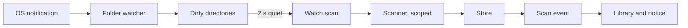
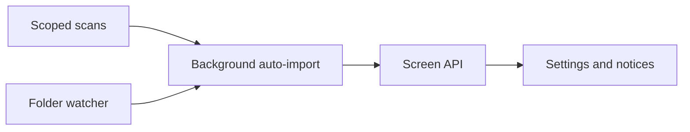

# Implementation Plan: Auto-import changed media folders

**Branch**: `feature/042-folder-watch-import` | **Parent Issue**: #786

**Input**: The parent Issue. It is this feature's specification.

## Summary

When the owner adds, deletes, moves or renames a file in a media folder, VVMDM
learns of it from the OS change notification and re-reads only the changed
directories, so the library follows without a manual scan. Nothing reads the
media folders while nothing changes, and the full scan stays manual.

The diagram shows the path of one change, from the notification to the library.



| Concern | Approach |
| --- | --- |
| Notification | fsnotify, one watch per directory, on Linux and Windows ([R-1](research.md#r-1-fsnotify-watches-every-directory-on-both-platforms)) |
| What is re-read | Only dirty directories; removal is limited to them ([R-2](research.md#r-2-a-change-marks-a-directory-dirty-and-only-dirty-directories-are-re-read)) |
| Copies in progress | A file is imported after 10 s without change; additions before removals ([R-3](research.md#r-3-a-batch-waits-for-quiet-imports-settled-files-then-removes)) |
| Running a batch | A scan row with `origin = 'watch'`, hidden unless it ends `partial` or `failed` ([R-4](research.md#r-4-a-watch-batch-is-a-scan-row-with-origin-watch)) |
| Manual scan and folder changes | They supersede a running watch batch ([R-5](research.md#r-5-a-manual-scan-or-a-media-folder-change-supersedes-a-watch-batch)) |
| Lost events, watch limits | Reported in Settings, never repaired by a scan ([R-6](research.md#r-6-lost-events-and-watch-limits-are-reported-never-repaired-by-a-scan)) |
| Setting | `settings.library.auto_import`, absent means on ([R-7](research.md#r-7-the-setting-is-a-stored-key-that-defaults-to-on)) |

Out of scope, as the parent Issue says: periodic scans, any check at startup,
auto-import where notifications do not arrive (NFS or SMB mounted inside the
container, Docker Desktop bind mounts), and starting a scan when a media folder
is added.

## Technical Context

**Canonical definitions**:

| Topic | Source |
| --- | --- |
| Boundaries, dependency direction, the "only a scan touches the media folders" invariant | [ARCHITECTURE.md](../../ARCHITECTURE.md), [.golangci.yml](../../.golangci.yml) (depguard) |
| Scan, ingest, removal and same-path succession | [internal/scanner/scanner.go](../../internal/scanner/scanner.go), [internal/app/scans.go](../../internal/app/scans.go), [internal/store/scans.go](../../internal/store/scans.go), [internal/store/scan_index.go](../../internal/store/scan_index.go), [030 data-model, Carry-over of content at the same path](../030-video-versions/data-model.md#carry-over-of-content-at-the-same-path) |
| Import progress, issues and the `scan` event | [024 contract](../024-import-progress/contracts/scan-api.md), [024 data-model](../024-import-progress/data-model.md) |
| Startup and shutdown order | [process-lifecycle.md](../../docs/design-docs/process-lifecycle.md), [cmd/mdm/main.go](../../cmd/mdm/main.go) |
| Stored settings and the Settings screen | [internal/store/settings.go](../../internal/store/settings.go), [037 network settings contract](../037-windows-app/contracts/network-settings-api.md) |
| Screen API and generated code | [api/openapi.yaml](../../api/openapi.yaml), `task generate` |
| Checks | [Taskfile.yml](../../Taskfile.yml) (`task check`, `task check-docs`, `task build-windows-check`) |

**Feature-specific context**:

- New Go dependency: `github.com/fsnotify/fsnotify` v1.10.1 (it requires
  `golang.org/x/sys`, already in `go.mod`).
- One migration, `00033_scan_origin.sql`
  ([data-model.md](data-model.md#migration)).
- The `Scanner` port gains a scope: `Scan(ctx)` becomes a full scan and a new
  scoped scan takes the dirty directories; today's removal assumes a walk of
  every root and would delete every video outside a partial walk.
- No CI runner executes Windows code; the Windows side is checked by
  `task build-windows-check` and by the Windows rows of
  [quickstart.md](quickstart.md).

## Constitution Check

| Rule (source) | Verdict |
| --- | --- |
| Adapters import neither each other nor `internal/app` (ARCHITECTURE.md, depguard) | Pass: the watcher is a new adapter `internal/watcher`; `internal/app` declares the port it uses, and `cmd/mdm` wires it |
| "Only a user-started scan walks the media folders" (ARCHITECTURE.md, Cross-cutting invariants) | Changed on purpose by `要件 1`: the invariant becomes "only a scan reads the media folders' files, and only a manual scan walks them whole"; the folder watcher reads directory entries only. The ARCHITECTURE.md edit ships in the unit that adds the watcher |
| One running scan, enforced by the database (ARCHITECTURE.md) | Pass: a watch batch is a scan row under the same index ([R-4](research.md#r-4-a-watch-batch-is-a-scan-row-with-origin-watch)) |
| Events after commit (ARCHITECTURE.md) | Pass: no new domain event; watch scans publish `ScanChanged` like manual ones |
| `internal/app` reaches the outside only through its own interfaces (ARCHITECTURE.md) | Pass: the watcher port and the scoped scan are interfaces in `internal/app` |
| Do not hand-edit generated files (AGENTS.md) | Pass: `api/openapi.yaml` changes, then `task generate` |
| Constraints testable (core-beliefs.md) | Pass: the batching rules run against a fake watcher and a clock in `internal/app` tests |

No violation, so no complexity tracking.

## Project Structure

### Documentation (this feature)

```text
specs/042-folder-watch-import/
├── plan.md
├── research.md
├── data-model.md
├── quickstart.md
└── contracts/
    └── screen-api.md
```

`ui-design.md` is written by the `design` stage (the Issue has the `ui` label).

### Source Code

**Affected boundaries**:

| Boundary | What it owns in this feature |
| --- | --- |
| `internal/scanner` | Scoped scan: walk dirty directories, additions before removals, scoped removal |
| `internal/store` | `scans.origin`, issue carry-over for watch scans, successions on a `done` watch scan, the `library.auto_import` key |
| `internal/watcher` (new) | fsnotify watches, the directory walk that arms them, event-to-dirty-directory mapping, watch problems |
| `internal/app` | `AutoImport`: the dirty set, quiet and settle timers, running watch scans through `Scans`, supersede rules, the setting |
| `internal/httpapi`, `api/openapi.yaml` | `Scan.origin`, `/api/settings/auto-import` |
| `cmd/mdm` | Wiring, startup after `ResumeInterrupted`, stop before the bus closes |
| `web/src/shell`, `web/src/settings` | Hiding watch progress, the failure notice, the toggle and watch state |

**New paths**: `internal/watcher/`, `internal/app/auto_import.go`,
`internal/store/migrations/00033_scan_origin.sql`,
`docs/design-docs/folder-watching.md`.

**Structure decision**: The watcher is its own adapter rather than part of
`internal/scanner`, because it holds long-lived OS handles and a goroutine while
the scanner is a call that ends; depguard keeps the two apart.

## Implementation Work

The diagram shows which units have to land first.



### Scope a scan to changed directories and record who started it

**Scope**: The scanner's scoped scan and the store changes in
[data-model.md, Rules](data-model.md#rules): `scans.origin` and its migration,
scoped removal, additions before removals, the supersede stop, issue
carry-over, successions on a `done` watch scan, and startup resuming only manual
scans. The full scan's behaviour does not change.

**Dependencies**: None.

**Acceptance**: `task check` passes, and scanner and store tests show: a scoped
scan of one directory leaves every location outside it; a file moved between two
dirty directories in one batch keeps its video id, tags and playback position; a
deleted dirty subtree loses its locations; a superseded scan removes nothing and
closes `done`; a watch scan keeps the previous scan's issues outside its scope;
an interrupted watch scan is closed and not resumed at startup.

### Watch media folders for changes with fsnotify

**Scope**: The adapter `internal/watcher`
([R-1](research.md#r-1-fsnotify-watches-every-directory-on-both-platforms),
[R-2](research.md#r-2-a-change-marks-a-directory-dirty-and-only-dirty-directories-are-re-read),
[R-6](research.md#r-6-lost-events-and-watch-limits-are-reported-never-repaired-by-a-scan)):
arm watches for a set of media folders by reading directories only, skip the
scanner's excluded directories and symbolic links, add a watch for each created
directory, report each change as a directory with a recursive flag, and report
overflow, watch-limit, permission and unreachable-folder problems. Adds the
fsnotify dependency.

**Dependencies**: None.

**Acceptance**: `task check` and `task build-windows-check` pass; Linux tests on
a temporary directory show a created, removed and renamed file each reporting
its parent, a created or removed directory reporting itself as recursive, a file
in a newly created subdirectory being reported, and a forced overflow and an
unreadable directory each reporting their problem.

### Import changed folders in the background

**Scope**: `AutoImport` in `internal/app`
([R-3](research.md#r-3-a-batch-waits-for-quiet-imports-settled-files-then-removes),
[R-5](research.md#r-5-a-manual-scan-or-a-media-folder-change-supersedes-a-watch-batch),
[R-7](research.md#r-7-the-setting-is-a-stored-key-that-defaults-to-on),
[R-8](research.md#r-8-an-interrupted-watch-batch-is-closed-not-resumed)):
the dirty set, the 2 s quiet and 10 s settle timers, running watch scans,
superseding on a manual scan or a media folder change and re-arming after a
folder change, the stored setting, the watch state of
[contracts/screen-api.md](contracts/screen-api.md#get-apisettingsauto-import),
and the wiring and order in `cmd/mdm`. Updates ARCHITECTURE.md (the invariant
and the subsystem map), process-lifecycle.md, running-vv.md ("Scans are
manual") and adds `docs/design-docs/folder-watching.md`, linked from the design
docs index.

**Dependencies**: Scope a scan to changed directories and record who started
it; Watch media folders for changes with fsnotify.

**Acceptance**: `task check` and `task check-docs` pass, and `internal/app`
tests with a fake watcher and clock show: no scan while events keep arriving
within 2 s; one watch scan of exactly the dirty directories after quiet; an
unsettled file kept dirty and imported once settled; changes during a manual
scan imported after it; a manual start superseding a running batch; turning the
setting on starting no scan; a running watch scan not making `Busy` true.

### Expose the auto-import setting and scan origin in the screen API

**Scope**: `api/openapi.yaml`, the handlers and the generated code for
[contracts/screen-api.md](contracts/screen-api.md): `Scan.origin` and
`GET`/`PUT /api/settings/auto-import`.

**Dependencies**: Import changed folders in the background.

**Acceptance**: `task check` passes, with no diff from `task generate`; handler
tests show `GET` returning `enabled: true` and a watch state on a fresh
database, `PUT` storing the choice without starting a scan, a guest getting the
owner-only answer, and the `scan` event carrying `origin`.

### Auto-import toggle in Settings and quiet auto-import notices

**Scope**: Following `ui-design.md`: the toggle and watch state in Settings, no
bottom-right progress for a `watch` scan, and the failure notice when a `watch`
scan ends `partial` or `failed` (`要件 6`, `要件 7`, the `UI品質` section).

**Dependencies**: Expose the auto-import setting and scan origin in the screen
API.

**Acceptance**: `task check` passes, and e2e specs show: a `watch` scan in
progress shows nothing at the bottom right; one that ends `partial` shows the
notice and its issue in Settings; the toggle stores the choice and survives a
reload; a guest sees no toggle. The screen changes, so the implementation owes a
visual review against `ui-design.md`, and the rows of
[quickstart.md](quickstart.md) are run once the unit lands.
