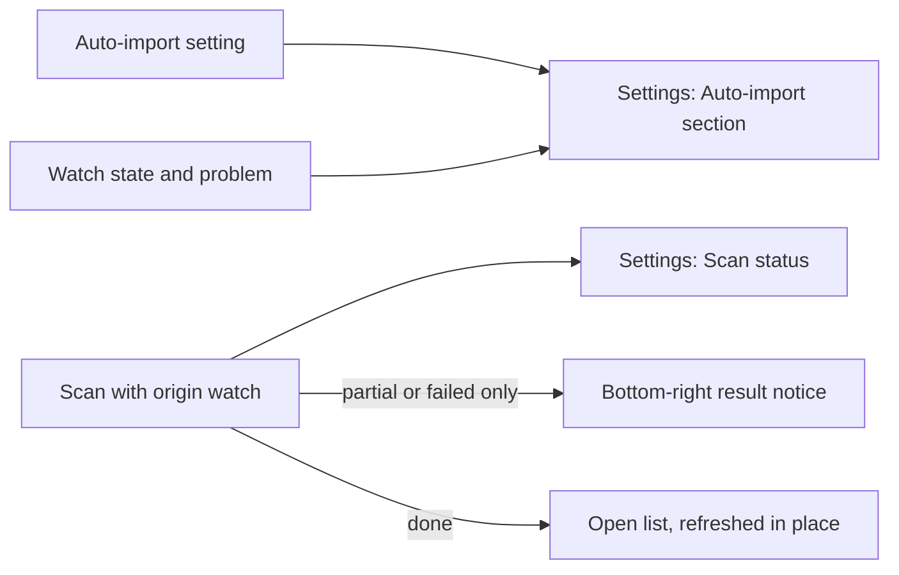
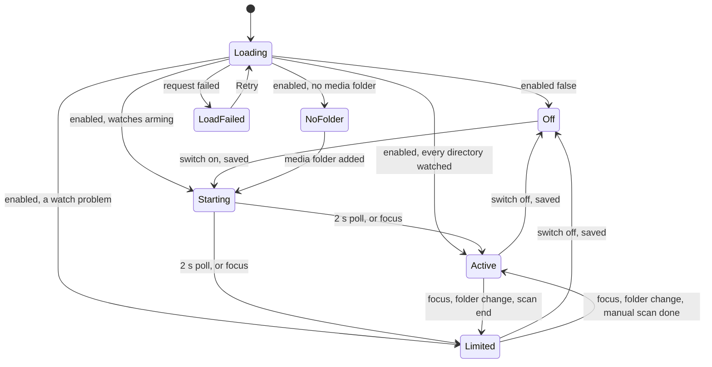

# UI design: Auto-import changed media folders

**Feature**: [parent Issue #786](https://github.com/syudead/vv/issues/786) ·
[plan.md](plan.md) ·
[research.md R-4](research.md#r-4-a-watch-batch-is-a-scan-row-with-origin-watch) ·
[R-5](research.md#r-5-a-manual-scan-or-a-media-folder-change-supersedes-a-watch-batch) ·
[R-6](research.md#r-6-lost-events-and-watch-limits-are-reported-never-repaired-by-a-scan) ·
[R-7](research.md#r-7-the-setting-is-a-stored-key-that-defaults-to-on) ·
[contracts/screen-api.md](contracts/screen-api.md) ·
[quickstart.md](quickstart.md)

Sources that already decide things, linked rather than repeated here:

| Topic | Source |
| --- | --- |
| Tokens, closed scales, library density | [design-system.md, Foundations](../../docs/design-docs/design-system.md#foundations); the values in `@theme` of [`web/src/ui/tokens.css`](../../web/src/ui/tokens.css), named here and never copied |
| `SettingsPage`, `PageSection`, `FormRow`: one section per topic, one row per setting, a `Switch` for a setting that acts at once | [patterns.md, Settings page](../../web/registry/rules/patterns.md#settings-page) and [Sections](../../web/registry/rules/patterns.md#sections) |
| `Switch`, `Alert`, `Badge`, `Sonner`: what each is for | [components.md, Checkbox and Switch](../../web/registry/rules/components.md#checkbox-and-switch), [Alert](../../web/registry/rules/components.md#alert), [Badge](../../web/registry/rules/components.md#badge), [Sonner](../../web/registry/rules/components.md#sonner) |
| The `Scan status` section, the bottom-right indicator, the summary popover, the status words and issue list | [024 UI design](../024-import-progress/ui-design.md); the current [`ScanStatusSection.tsx`](../../web/src/settings/ScanStatusSection.tsx) and [`ScanProgressIndicator.tsx`](../../web/src/shell/ScanProgressIndicator.tsx) |
| `Scan library`, the indicator's opening, closing and dismissal, the 8 s result | [library-ui.md, Scan entry and progress](../../docs/design-docs/library-ui.md#scan-entry-and-progress) |
| A settings switch that saves at once: the pressed state while saving, the error and the revert | The `Network` section, [`NetworkSection.tsx`](../../web/src/settings/NetworkSection.tsx) ([037 network settings contract](../037-windows-app/contracts/network-settings-api.md)) |
| Guests see no Settings, no scan state and no indicator | [016 UI design, Top bar](../016-single-account-auth/ui-design.md#top-bar); [`ScanProvider.tsx`](../../web/src/shell/ScanProvider.tsx) |
| Screen text | [`web/src/i18n/en.ts`](../../web/src/i18n/en.ts) (`shell.scan`, `settings.scanStatus`, `settings.mediaFolders`); this feature adds `settings.autoImport` and the words below |

The diagram shows the three surfaces this feature touches and what reaches
each of them.

Unchanged: everything a `manual` scan shows, where and how it shows it
(024, library-ui.md), the issue list, the top bar, the video page, and the
`Scan` link of an empty library or folder.

## Why this shape

The setting is its own `Auto-import` section directly under `Scan status`,
not a row inside it. `Scan status` is the result of the latest import and is
read top to bottom as status, progress, failure, list (024); a settings row
at its top would push the status word down, and one under the issue list
would sit below a region that can be half the screen high. A section of its
own, right below, keeps the two one glance apart (`UI品質`) and follows the
settings page rule of one section per topic. Its description says what
auto-import does and what it leaves to `Scan library`, so the owner never has
to infer it from the switch alone.

A watch scan is the same `Scan` the three surfaces of 024 already read
(R-4), so the only new facts on screen are its origin and its watch state.
The origin changes the status words rather than adding a badge: "Some
failed" appearing at the bottom right when the owner started nothing would
read as a scan they forgot, while "Auto-import: some failed" names the cause
in the same place with the same path to Settings. The result notice reuses the
indicator's terminal state rather than a Sonner toast, because a failure is
something the owner acts on in Settings, which Sonner is not for, and the
indicator already leads there, pauses while read, and can be dismissed.

A finished watch scan refreshes the open list in place, keeping the scroll
position and the selection, instead of clearing it and reloading from the
first page as a finished manual scan does today. A manual scan ends where the
owner is waiting for it; a watch scan ends while the owner is browsing, and
being sent to the top of the list three pages in is the interruption the
Issue rules out.

## Words

Text in `web/src/i18n/en.ts`. User data (paths) is embedded as an argument.

| Place | Text | Notes |
| --- | --- | --- |
| Settings section heading | Auto-import | `settings.autoImport.heading` |
| Section description | Files added, removed, moved or renamed in a media folder are picked up as they happen, without a scan. Changes made while it's off or while VVMDM isn't running are picked up by “Scan library” under Scan status. | One `
` under the heading |
| Switch row label | Pick up changes as they happen | The `Switch` is named by this label |
| State line, off | Off. Changes are picked up by the next scan. | Row description |
| State line, on, no media folder (`watch.state` `off`) | Add a media folder below to watch it. | |
| State line, `starting` | Starting to watch the media folders… | |
| State line, `active` | Watching the media folders. | |
| State line, `limited` | Watching, but some changes may be missed. | The problem row below says which |
| Saving line | Saving… | As the `Network` section |
| Save failed | Couldn't change the setting: {reason} | `destructive` `Alert` |
| Load failed | Couldn't load the auto-import settings: {reason} | `ErrorState` with `Retry` |
| Problem `watch_limit` | The limit on watched folders was reached, so changes under {path} aren't picked up. Raise the limit (`fs.inotify.max_user_watches` on Linux) and turn auto-import off and on, then start a scan to pick up what was missed. | Title: Some folders aren't watched |
| Problem `events_lost` | Too many changes arrived at once and some were lost. Start a scan under Scan status to pick them up. | Title: Some changes were lost |
| Problem `folder_unreachable` | {path} can't be reached. Changes there aren't picked up until it is back and auto-import is turned off and on. Then start a scan to pick up what was missed. | Title: A media folder can't be reached |
| Problem `permission_denied` | VVMDM can't read {path}. Changes there aren't picked up until it can, and auto-import is turned off and on. Then start a scan to pick up what was missed. | Title: A folder can't be read |
| Status word, watch scan `finding` or `running` | None | No badge: a running watch scan is shown nowhere (`要件 7`) |
| Status word, watch scan `done` | Auto-imported | Replaces "Done" |
| Status word, watch scan `partial` | Auto-import: some failed | Replaces "Some failed" |
| Status word, watch scan `failed` | Auto-import failed | Replaces "Scan failed" |
| Announcement, watch scan `partial` | Auto-import finished with some failures. {N videos} may not be usable. | `role="status"`, as 024 |
| Announcement, watch scan `failed` | Auto-import failed. | |
| Media folders description, last sentence | After adding or changing a folder, start a scan with “Scan library” under Scan status. Auto-import doesn't start one. | Replaces "After a change, start a scan with “Scan library” under Scan status. Scans don't start automatically." |

The other status words, the progress sentence, the detail line ("Finished
{date and time}"), the issue counts and the issue list keep 024's words for
both origins. "{path}" is the directory from `watch.path`, in `<code>` on its
own line when the sentence holds it, as the `Media folders` rows show a path.

## Settings: Auto-import section

A `PageSection` between `Scan status` and `Media folders`, so the three
sections an import involves sit together and `Scan library` is one glance
above the switch. The heading row holds the title and the description and no
action; the body is one `FormRow` and, when there is one, one problem row.

| Row | Content |
| --- | --- |
| Switch row | `FormRow` with the label "Pick up changes as they happen", the state line as its description, and a `Switch` as the one control, checked when `enabled` is `true` |
| Problem row | Only while `watch.state` is `limited`: a `warning` `Alert` (`TriangleAlert`, `AlertTitle`, `AlertDescription` with the problem text and the path) |
| Saving line | Only while a change is in flight: "Saving…" with a spinning `LoaderCircle`, `text-xs` `text-muted-foreground`, as the `Network` section |
| Save failed | Only after a failed `PUT`: a `destructive` `Alert` under the switch row; the switch returns to the stored value |

The state line is one line at every width and changes in place: the row
never grows or shrinks between states, so the `Media folders` section below
does not move while the watcher starts. The problem row is the only element
that adds height, and it stays until the problem clears
([contracts/screen-api.md, `GET`](contracts/screen-api.md#get-apisettingsauto-import)).

### States

The diagram shows the states of the section and what moves it between them.

| State | What the section shows |
| --- | --- |
| Loading | The switch row with a `Skeleton` the height of the switch in the control slot and the label; no state line, no section flicker |
| Load failed | `ErrorState` in the body with "Couldn't load the auto-import settings: {reason}" and `Retry`; no switch |
| Off | Switch unchecked; "Off. Changes are picked up by the next scan." |
| On, no media folder | Switch checked; "Add a media folder below to watch it." |
| Starting | Switch checked; "Starting to watch the media folders…"; the section re-reads the state every 2 s until it leaves `starting` (contract, Client use); no bar, no spinner, no indicator |
| Active | Switch checked; "Watching the media folders." |
| Limited | Switch checked; "Watching, but some changes may be missed."; the problem row with the title, text and path for `watch.problem` |
| Saving | The switch shows the state it was pressed to; the saving line; the switch does not react to a second press until the response |
| Save failed | The switch back at the stored value; the `destructive` `Alert` with the reason; the state line as before the press |

Turning the switch on moves the section to Starting and nothing else on any
screen: no bar in `Scan status`, no bottom-right indicator, no notice
(`要件 6`). Turning it off moves it to Off at once; a watch scan running at
that moment finishes as it is.

The section re-reads the state when it mounts, when the window regains
focus, after a media folder is added, changed or removed on this page, and
when the latest scan ends, so a problem that clears
([contracts/screen-api.md, `GET`](contracts/screen-api.md#get-apisettingsauto-import))
leaves the screen without a reload.

## Settings: Scan status with a watch scan

`Scan status` shows the latest scan whatever its origin, with 024's layout and
elements. What differs for `origin` `watch`:

| Element | Manual scan | Watch scan |
| --- | --- | --- |
| Status badge | "Scanning", "Done", "Some failed", "Scan failed" | None while it runs; "Auto-imported", "Auto-import: some failed", "Auto-import failed" once it ends |
| `Scan library` button | Disabled while the scan runs, with the reason line | Enabled while a watch scan runs: starting a manual scan supersedes it (R-5); no reason line |
| `Media folders` lock ("You can't change media folders while a scan is running") | Shown while the scan runs | Not shown: a folder change supersedes the watch scan (R-5) |
| Progress bar, progress sentence | As 024 | Never shown, running or ended: a watch scan's progress is shown nowhere |
| Detail line, issue counts, issue list | As 024 | As 024 once it ends; the issue list holds the issues carried over from the previous scan plus this one's ([data-model.md, Rules](data-model.md#rules)) |
| Failure of the import itself (`failed`) | Reason in a `destructive` `Alert` | The same |

The `Scan library` button therefore reads disabled for one reason only, a
manual scan the owner (or another tab) started, and the folder rows never
lock because of something the owner did not start.

## Bottom-right indicator and result notice

The indicator keeps the placement, surface, content, opening, closing and
dismissal of 024 and library-ui.md. For `origin` `watch` it changes only when
it is shown.

| Watch scan state | Bottom-right | Announcement |
| --- | --- | --- |
| `finding`, `running` | Not shown; the summary popover does not exist (`要件 7`) | None |
| `done`, with or without to-check items | Not shown | None |
| `partial`, with a new failure | Shown as a result: "Auto-import: some failed · K failed", for 8 s, hidden by `×`, or by pressing it (goes to `/settings#scan-status`); the summary opens on hover and focus with 024's content and "See Settings for the list." | "Auto-import finished with some failures. N videos may not be usable." |
| `partial`, no new failure | Not shown | None |
| `failed` | Shown as a result: "Auto-import failed", for 8 s, hidden and pressed as above | "Auto-import failed." |

A result notice for a watch scan appears from nothing: there was no running
indicator before it. The notice therefore holds the same frame, position and
size as the manual result, so the owner who has seen a manual scan end
recognises it, and its status word says what it is about. On the video page it
keeps the bottom-right position and `z-index` of 024 (the top right holds the
close `×`).

The issue list of a `partial` watch scan holds failures carried over from earlier scans ([data-model.md, Rules](data-model.md#rules)), so the status alone would announce an old failure again. The client announces a `partial` watch scan only when `GET /api/scans/current/issues` returns a failed item whose path and kind are not in the list it last read for the previous scan; with no earlier list read, it announces. A failure that changed kind counts as new; a failure the owner dismissed earlier and that is still the same is not announced again. A `partial` scan with no new failure shows nothing, and Settings still lists every issue.

A watch scan that ends `partial` while the owner's previous notice is
dismissed shows: dismissal is per scan id (library-ui.md). A manual scan
that supersedes a running watch scan shows its own indicator from "Starting";
the superseded scan closes `done` and shows nothing.

## Open lists after a watch scan

When a watch scan ends `done`, `partial` or `failed` (a `failed` scan can have written additions before it stopped), the list on screen (the library,
a folder page, the root folder list) takes in its result in place:

| Aspect | Rule |
| --- | --- |
| What refreshes | The pages already loaded are fetched again and replaced; the list keeps showing the current items until the new ones arrive, with no `LoadingState` and no empty frame |
| Scroll position | Kept. The window does not move; an item the owner is looking at stays where it is unless an item before it was added or removed, in which case it shifts by that item's height |
| Selection | Kept. Selected ids stay selected; the selection bar and its count do not change on their own |
| A new video | Appears at the position the current sort gives it, inside the loaded pages; a video that sorts after the loaded pages arrives with the next `Load more` |
| A removed video | Leaves the list; the cards after it close the gap |
| A moved or renamed video | Stays the same card, with its tags, playback position and favorite, under its new name when the sort or the card shows the file name |
| Filters, search, sort | Unchanged by the refresh |
| The video page | Unchanged: a moved video keeps its id, and the page keeps playing |
| A manual scan | Today's behaviour: the list is cleared and reloaded from the first page when the scan the owner saw finish ends ([`LibraryPage.tsx`](../../web/src/library/LibraryPage.tsx)) |

The refresh is quiet by design: no toast "3 videos added", no count badge,
no highlight on new cards. A new card among known ones is noticed the way a
new file in a folder is; a highlight would make every batch an event.

## Responsive behaviour

| Width | Layout |
| --- | --- |
| 360px | The switch row stacks: label and state line above, the switch below at the row's start (`FormRow` below `sm`). The problem `Alert` wraps its text; the path breaks inside the word (`break-all`) so it never widens the section. The result notice is one line as 024 at 360px, with "Auto-import: some failed" kept whole and the issue count reduced to icon and number |
| 768px | Label and state line on the left, the switch on the right of the same row; the problem `Alert` on one or two lines; the result notice as at 1280px |
| 1280px | As 768px inside the settings column (`max-w-3xl`); the section's heading, description and rows share the left edge with `Scan status` and `Media folders` |

## Review criteria

Judged by looking at Settings and the library at 360px, 768px and 1280px, with
auto-import on, after a watch scan that ended `partial` with two failed files,
and after one that ended `done`.

1. **Visual hierarchy**: in Settings, the `Auto-import` section reads as a
   sibling of `Scan status` and `Media folders`: the same `text-lg` heading,
   the same `text-sm` `text-muted-foreground` description, the same card body.
   Inside the section the row label is the strongest element, the state line
   is secondary, and a problem `Alert` is the only coloured element.
2. **Information density**: the section is two to three rows high: the switch
   row, and the problem row only when there is a problem. No count, no list of
   watched folders, no timestamp of the last batch. `Scan status` above it
   gains no element for a watch scan beyond its status word.
3. **Spacing rhythm**: the gap between `Scan status` and `Auto-import` equals
   the gap between `Auto-import` and `Media folders`; the switch row's padding
   equals a `Network` row's; the state line sits under the label at the
   `FieldDescription` distance, and the row's height is the same in Off,
   Starting, Active and Limited.
4. **Typography**: the state line is `text-sm` `text-muted-foreground`, one
   line in every state at 360px; the problem title is the `Alert`'s title
   weight and the path is `<code>`; the status words in `Scan status` and at
   the bottom right are in the same size and weight as the manual words they
   replace.
5. **Priority of actions**: the switch is the only control in the section;
   the problem `Alert` has no button, and its text names `Scan library`, which
   is the one action above. `Scan library` stays enabled while a watch scan
   runs, and the `Media folders` rows stay editable.
6. **Quiet while importing**: during a watch scan, `Scan status`, the
   library, a folder page and the video page show nothing new: no badge, no
   progress bar or sentence, no bottom-right indicator, no toast. When the scan ends `done`,
   the open list has the new cards in sort order and the window has not
   scrolled; a selected card is still selected.
7. **Only failures are announced**: when a watch scan ends `partial` with a new
   failure, the
   bottom-right result appears with "Auto-import: some failed" and the failed
   count, hides after 8 s, and pressing it opens `Scan status` with the same
   status word and the two files in the list. When it ends `done`, nothing
   appears at the bottom right.
8. **Turning on is silent**: switching auto-import on moves the state line
   through "Starting to watch the media folders…" to "Watching the media
   folders." with no bar in `Scan status`, no indicator and no toast, and the
   `Media folders` section does not move while the line changes.
9. **A problem is readable without colour**: with `events_lost`, the
   `Alert`'s icon and title say what happened and its text says what to do;
   the state line says changes may be missed. Removing colour from the screen
   loses nothing.
10. **Guests**: signed in as a guest, Settings, the switch, the indicator and
    the announcements do not exist.
