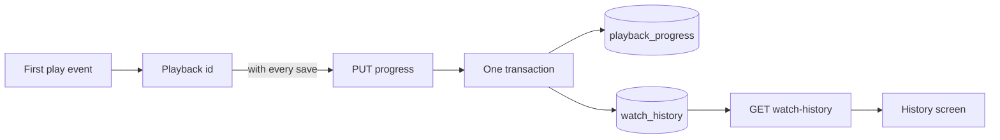
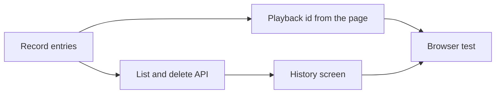

# Implementation Plan: Watch history screen

**Branch**: `feature/043-watch-history` | **Parent Issue**: #792

**Input**: The parent Issue. It is this feature's specification.

## Summary

Every playback of a video adds one entry to the owner's watch history; the
history screen lists them newest first, opens the video from an entry, and
deletes one entry or all of them, without touching the playback position, the
watch state or the "Last played" order.

The diagram shows the path of one viewing, from the first `play` to the entry
the history screen lists.



| Concern | Approach |
| --- | --- |
| Storage | A `watch_history` table keyed by the content key played, with a title snapshot and no foreign key ([R-1](research.md#r-1-a-watch_history-table-keyed-by-content-key-with-a-title-snapshot), [data-model.md](data-model.md#migration)) |
| One entry per viewing | A client-generated playback id on the existing progress save; `insert or ignore` in the position's transaction ([R-2](research.md#r-2-one-entry-per-playback-identified-by-a-client-generated-playback-id)) |
| Entry time and order | Server time of the first save with the id; `played_at` then `id`, descending ([R-3](research.md#r-3-the-entrys-time-is-the-server-time-of-the-first-save-with-its-id)) |
| Existing records | Backfilled by the migration, one entry per `playback_progress` row ([R-4](research.md#r-4-existing-playback-records-are-backfilled-by-the-migration)) |
| Content gone or replaced | The entry stays; it carries a `video` only while the content is in the library ([R-5](research.md#r-5-an-entry-whose-content-left-the-library-stays-without-a-video)) |
| Deleting | `DELETE` one or all; `404` on a vanished entry makes the screen reload ([R-6](research.md#r-6-deleting-entries-is-a-plain-delete-a-vanished-entry-answers-404-and-the-screen-reloads)) |
| Who | Owner only, through the existing gate and route rules ([R-7](research.md#r-7-watch-history-is-one-more-owner-only-screen-and-route-with-the-existing-gate-rules)) |

The Issue has the `ui` label, so the list's layout, the date grouping, the
wording and the placement of the delete and clear actions are decided by
`ui-design.md` in the next stage, judged against the parent Issue's `UI品質`.

Out of scope, as the parent Issue says: search and filters in the history,
automatic pruning and retention settings, pausing the recording, resetting
positions or watch states, the external API, guest viewings, and statistics.

## Technical Context

**Canonical definitions**:

| Topic | Source |
| --- | --- |
| Boundaries, dependency direction, user data versus the rebuildable index, the authentication boundary | [ARCHITECTURE.md](../../ARCHITECTURE.md), [.golangci.yml](../../.golangci.yml) (depguard) |
| Playback position: save, rules, the page's saving hook | [internal/store/progress.go](../../internal/store/progress.go), [internal/domain/progress.go](../../internal/domain/progress.go), [internal/httpapi/progress.go](../../internal/httpapi/progress.go), [web/src/player/useProgressSaving.ts](../../web/src/player/useProgressSaving.ts) |
| User key, succession, bundles, per-video visibility | [030 data-model](../030-video-versions/data-model.md), [internal/store/user_keys.go](../../internal/store/user_keys.go), [internal/store/successions.go](../../internal/store/successions.go) (`moveUserData`), [internal/store/visibility.go](../../internal/store/visibility.go) (`visibleVideoCondition`) |
| Owner-only screens, the gate, the sidebar | [016 ui-design](../016-single-account-auth/ui-design.md), [web/src/auth/AuthGate.tsx](../../web/src/auth/AuthGate.tsx), [web/src/shell/navigation.ts](../../web/src/shell/navigation.ts) |
| Opaque cursors | [024 scan-api](../024-import-progress/contracts/scan-api.md#get-apiscanscurrentissues), [internal/domain/scan_issue.go](../../internal/domain/scan_issue.go) |
| Screen API and generated code | [api/openapi.yaml](../../api/openapi.yaml), `task generate` |
| Screens and Web tests | [design-system.md](../../docs/design-docs/design-system.md), [web-testing.md](../../docs/design-docs/web-testing.md), [i18n.md](../../docs/design-docs/i18n.md) |
| Checks | [Taskfile.yml](../../Taskfile.yml) (`task check`, `task check-docs`, `task test-e2e`) |

**Feature-specific context**:

- One migration, `00034_watch_history.sql`, with a backfill
  ([data-model.md, Migration](data-model.md#migration)).
- `PUT /api/videos/{id}/progress` is the only existing route that changes;
  the three history routes are new
  ([contracts/screen-api.md](contracts/screen-api.md)).
- No new dependency: the playback id is `crypto.randomUUID()`, available in
  every browser the SPA targets.

## Constitution Check

| Rule (source) | Verdict |
| --- | --- |
| Adapters import neither each other nor `internal/app` (ARCHITECTURE.md, depguard) | Pass: the change is in `internal/store` and `internal/httpapi`, which talk through the `Playback` interface `internal/httpapi` declares; no use case in `internal/app` |
| The domain decides, the store enforces (ARCHITECTURE.md) | Pass: `ValidatePlaybackID` and the cursor live in `internal/domain`; one entry per id is the unique index |
| Events after commit (ARCHITECTURE.md) | Pass: no new domain event ([R-6](research.md#r-6-deleting-entries-is-a-plain-delete-a-vanished-entry-answers-404-and-the-screen-reloads)) |
| User data survives a rebuild (ARCHITECTURE.md) | Pass: keyed by the content key, no foreign key; the invariant's list and the recovery table gain `watch_history` |
| Every read knows its viewer (ARCHITECTURE.md) | Pass: the routes are owner-only, and the list reads videos with the owner's `Audience` through `visibleVideoCondition` |
| Do not hand-edit generated files (AGENTS.md) | Pass: `api/openapi.yaml` changes, then `task generate` |
| Read design-system.md before a screen; test at the lowest level (AGENTS.md) | Pass: the screen composes registry page patterns, decided in `ui-design.md`; rules out of the page get logic tests |

No violation, so no complexity tracking.

## Project Structure

### Documentation (this feature)

```text
specs/043-watch-history/
├── plan.md
├── research.md
├── data-model.md
├── quickstart.md
└── contracts/
    └── screen-api.md
```

`ui-design.md` is written by the `design` stage (the Issue has the `ui`
label).

### Source Code

**Affected boundaries**:

| Boundary | What it owns in this feature |
| --- | --- |
| `internal/domain` | `Play`, `ValidatePlaybackID`, `WatchHistoryEntry`, `WatchHistoryPage`, the cursor |
| `internal/store` | The migration and backfill, `PlaybackStore`'s entry write, list, delete and clear, the succession carry-over |
| `internal/httpapi`, `api/openapi.yaml` | `playbackId` on the progress save, the three history routes |
| `web/src/player`, `web/src/api` | The playback id in `useProgressSaving` and `client.ts`, `history.ts` |
| `web/src/history` (new), `web/src/app`, `web/src/shell`, `web/src/auth`, `web/src/i18n` | The screen, its route, the sidebar entry, the owner-only path, the catalog text |
| `web/e2e` | The browser test of the flow |

**New paths**: `internal/store/migrations/00034_watch_history.sql`,
`internal/store/watch_history.go`, `internal/domain/watch_history.go`,
`internal/httpapi/watch_history.go`, `web/src/api/history.ts`,
`web/src/history/`, `web/e2e/history.e2e.ts`.

**Structure decision**: The history stays on `PlaybackStore` rather than on a
new role, because its entry is written in the position's transaction and a
table under two roles would split one business operation
([data-model.md, Store operations](data-model.md#store-operations-playbackstore)).
The screen is its own directory, like `versions/` and `tags/`, because it
shares nothing with the card lists beyond the thumbnail.

## Implementation Work

The diagram shows which units have to land first.



### Record a watch history entry for each playback

**Scope**: The migration and backfill, `domain.Play`, `ValidatePlaybackID`
and `WatchHistoryEntry`, `PlaybackStore.SaveProgress` writing the entry in
its transaction, the succession carry-over, `playbackId` on
`PUT /api/videos/{id}/progress` and its handler
([data-model.md](data-model.md), [contracts/screen-api.md, `playbackId`](contracts/screen-api.md#playbackid-on-put-apivideosidprogress)).
Adds `watch_history` to the lists in ARCHITECTURE.md and running-vv.md.

**Dependencies**: None.

**Acceptance**: `task check` and `task check-docs` pass, with no diff from
`task generate`; store and handler tests show: a save without `playbackId`
writes no entry; two saves with one id write one entry whose time is the
first save's; saves with two ids for one video write two entries; a save
after the entry was deleted writes a new one; a malformed id is `400`; a
database with three `playback_progress` rows, one under a bundle key, has
three entries after migration, at the records' times and with the current
titles; same-path succession moves the entries to the new key and keeps the
new key's own entries; deleting an entry leaves `playback_progress` unchanged.

### Add the watch history list and delete endpoints to the screen API

**Scope**: `GET /api/watch-history`, `DELETE /api/watch-history/{id}`,
`DELETE /api/watch-history`, the schemas, the cursor, and
`PlaybackStore.ListWatchHistory`, `DeleteWatchHistoryEntry` and
`ClearWatchHistory`
([contracts/screen-api.md](contracts/screen-api.md),
[data-model.md, Store operations](data-model.md#store-operations-playbackstore)).

**Dependencies**: Record a watch history entry for each playback.

**Acceptance**: `task check` passes, with no diff from `task generate`;
tests show: the list is newest first with `id` breaking ties, and a second
page from `nextCursor` continues without repeating; an entry whose content
has no location has no `video` while another entry of present content
carries one with `progress`; a non-representative bundle member's entry
carries that member; delete answers `204` then `404`; clear answers `204` on
an empty history; a guest gets `401` on all three; `limit` 201 and an
unreadable cursor are `400`.

### Send a playback id from the video page from the first play on

**Scope**: `useProgressSaving` holding the id and `markPlayed()`,
`VideoPlayer`'s `onPlay`, and `playbackId` on `saveProgress` and
`beaconProgress`
([contracts/screen-api.md, Client use](contracts/screen-api.md#client-use),
[R-2](research.md#r-2-one-entry-per-playback-identified-by-a-client-generated-playback-id)).

**Dependencies**: Record a watch history entry for each playback.

**Acceptance**: `task check` passes; logic tests of the hook and the client
show: no save before the first play carries an id; the first play sends one
immediate save with an id; later saves, the pause save and the leave beacon
carry the same id; a remount of the player under the same video id keeps the
id; a new video id gets a new id; the page test of the video page shows the
id reaching the request body.

### Add the watch history screen to the sidebar for the owner

**Scope**: `web/src/history/` (the page, its list hook, the delete and clear
actions with the confirmation), `web/src/api/history.ts`, the `/history`
route, the sidebar entry, the gate's owner-only path, and the catalog text;
layout, grouping, wording and action placement follow `ui-design.md`.

**Dependencies**: Add the watch history list and delete endpoints to the
screen API; the `design` stage's `ui-design.md`.

**Acceptance**: This unit changes a screen, so it needs a visual and
interaction review against `ui-design.md` and the parent Issue's `UI品質`.
`task check` passes; page tests show: entries listed newest first with the
time and the title; an entry with a `video` opens `/videos/{id}` and one
without is not a link and reads as not playable; loading more sends the
previous `nextCursor`; deleting one removes that row and keeps the others; a
`404` on delete reloads the list without a message; a failed delete keeps the
row and shows a toast; clear asks first, cancel changes nothing, confirm
shows the empty state; the guest sidebar has no entry and a guest at
`/history` is sent to the login page.

### Cover the watch history flow in a browser test

**Scope**: `web/e2e/history.e2e.ts`, against the real server and media
([web-testing.md, Test levels](../../docs/design-docs/web-testing.md#test-levels)).

**Dependencies**: Send a playback id from the video page from the first play
on; Add the watch history screen to the sidebar for the owner.

**Acceptance**: `task test-e2e -- e2e/history.e2e.ts` passes and shows:
playing a video for a few seconds puts it at the top of the history with a
time (acceptance criterion 1); opening a video without playing adds nothing
(2); pausing and resuming twice leaves one entry (3); a second visit adds a
second entry (4); opening the entry resumes from the saved position (5);
deleting one entry leaves the card's progress bar and watch state (6); clear
with confirmation empties the list (7); a guest sees no entry and `/history`
shows the login page (9).
