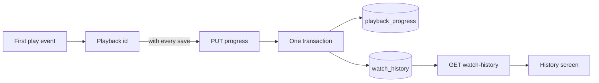
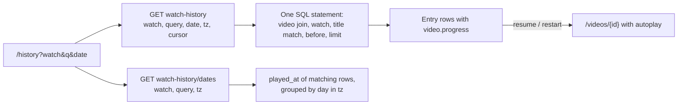
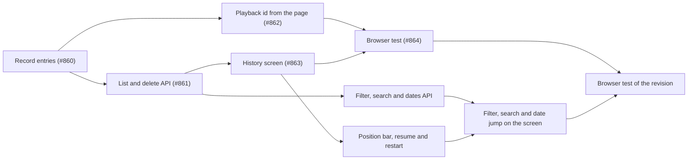

# Implementation Plan: Watch history screen

**Branch**: `feature/043-watch-history` | **Parent Issue**: #792

**Input**: The parent Issue. It is this feature's specification.

## Summary

Every playback of a video adds one entry to the owner's watch history; the
history screen lists them newest first, opens the video from an entry, and
deletes one entry or all of them, without touching the playback position, the
watch state or the "Last played" order. The revision (requirements 12 to 18)
lets the owner narrow the list by the video's current watch state and by a
title search, jump to a day or a month that has entries, and see each entry's
current position and start playback from it or from the beginning.

The diagram shows the path of one viewing, from the first `play` to the entry
the history screen lists.



| Concern | Approach |
| --- | --- |
| Storage | A `watch_history` table keyed by the content key played, with a title snapshot and no foreign key ([R-1](research.md#r-1-a-watch_history-table-keyed-by-content-key-with-a-title-snapshot), [data-model.md](data-model.md#migration)) |
| One entry per viewing | A client-generated playback id on the existing progress save; `insert or ignore` in the position's transaction ([R-2](research.md#r-2-one-entry-per-playback-identified-by-a-client-generated-playback-id)) |
| Entry time and order | Server time of the first save with the id; `played_at` then `id`, descending ([R-3](research.md#r-3-the-entrys-time-is-the-server-time-of-the-first-save-with-its-id)) |
| Existing records | Backfilled by the migration, one entry per `playback_progress` row ([R-4](research.md#r-4-existing-playback-records-are-backfilled-by-the-migration)) |
| Content gone or replaced | The entry stays; it carries a `video` only while the content is in the library ([R-5](research.md#r-5-an-entry-whose-content-left-the-library-stays-without-a-video)) |
| Deleting | `DELETE` one or all; `404` on a vanished entry makes the screen reload ([R-6](research.md#r-6-deleting-entries-is-a-plain-delete-a-vanished-entry-answers-404-and-the-screen-reloads)) |
| Who | Owner only, through the existing gate and route rules ([R-7](research.md#r-7-watch-history-is-one-more-owner-only-screen-and-route-with-the-existing-gate-rules)) |
| Filter, search, date (revision) | Conditions of the list request, applied in SQL before the page ([R-8](research.md#r-8-filter-search-and-date-jump-are-conditions-of-the-list-request)); the state is the video's, by the library's rule ([R-9](research.md#r-9-the-state-filter-reads-the-videos-current-watch-state-with-the-librarys-rule)); the search is the library's syntax on the title lines and a folded snapshot title ([R-10](research.md#r-10-title-search-uses-the-librarys-query-syntax-on-the-title-alone)) |
| Date list and jump (revision) | Days computed on the server in the browser's IANA zone; `date` + `tz` on the list request ([R-11](research.md#r-11-the-date-list-and-the-jump-are-computed-on-the-server-in-the-viewers-time-zone)) |
| Screen state (revision) | `watch`, `q` and `date` in the URL, as the library ([R-12](research.md#r-12-the-filter-the-search-and-the-date-live-in-the-screens-url)) |
| Resume and restart (revision) | The video page with `autoplay`; the existing resume rule gives the position ([R-13](research.md#r-13-the-resume-and-restart-actions-open-the-video-page-with-autoplay-and-the-existing-resume-rule-decides-the-position)) |

The diagram shows how one view of the revised screen is read.



The Issue has the `ui` label, so the list's layout, the date grouping, the
wording and the placement of the actions are decided by `ui-design.md`,
judged against the parent Issue's `UI品質`. The revision's parts (the
segmented filter, the search box, the date list, the position bar, the resume
and restart actions, the "no matches" state, the phone layout) are not in the
current `ui-design.md`; the `design` stage revises it before the screen units
below are built.

Out of scope, as the parent Issue says: filtering by tag or by a start and
end date, automatic pruning and retention settings, pausing the recording,
resetting positions or watch states, the external API, guest viewings, and
statistics.

## Technical Context

**Canonical definitions**:

| Topic | Source |
| --- | --- |
| Boundaries, dependency direction, user data versus the rebuildable index, the authentication boundary | [ARCHITECTURE.md](../../ARCHITECTURE.md), [.golangci.yml](../../.golangci.yml) (depguard) |
| Playback position: save, rules, the page's saving hook | [internal/store/progress.go](../../internal/store/progress.go), [internal/domain/progress.go](../../internal/domain/progress.go), [internal/httpapi/progress.go](../../internal/httpapi/progress.go), [web/src/player/useProgressSaving.ts](../../web/src/player/useProgressSaving.ts) |
| User key, succession, bundles, per-video visibility | [030 data-model](../030-video-versions/data-model.md), [internal/store/user_keys.go](../../internal/store/user_keys.go), [internal/store/successions.go](../../internal/store/successions.go) (`moveUserData`), [internal/store/visibility.go](../../internal/store/visibility.go) (`visibleVideoCondition`) |
| Owner-only screens, the gate, the sidebar | [016 ui-design](../016-single-account-auth/ui-design.md), [web/src/auth/AuthGate.tsx](../../web/src/auth/AuthGate.tsx), [web/src/shell/navigation.ts](../../web/src/shell/navigation.ts) |
| Opaque cursors | [024 scan-api](../024-import-progress/contracts/scan-api.md#get-apiscanscurrentissues), [internal/domain/scan_issue.go](../../internal/domain/scan_issue.go) |
| Screen API and generated code | [api/openapi.yaml](../../api/openapi.yaml), `task generate` |
| Screens and Web tests | [design-system.md](../../docs/design-docs/design-system.md), [web-testing.md](../../docs/design-docs/web-testing.md), [i18n.md](../../docs/design-docs/i18n.md) |
| Checks | [Taskfile.yml](../../Taskfile.yml) (`task check`, `task check-docs`, `task test-e2e`) |

**Feature-specific context**:

- One migration, `00034_watch_history.sql`, with a backfill
  ([data-model.md, Migration](data-model.md#migration)); the revision adds
  `00035_watch_history_title_key.sql` and a startup fill of the new column.
- `PUT /api/videos/{id}/progress` is the only existing route that changes;
  the three history routes are new
  ([contracts/screen-api.md](contracts/screen-api.md)). The revision adds
  four parameters to `GET /api/watch-history` and the route
  `GET /api/watch-history/dates`.
- The revision embeds `time/tzdata` (standard library, about 450 KiB) so
  `time.LoadLocation` answers on a host without a zone database
  ([R-11](research.md#r-11-the-date-list-and-the-jump-are-computed-on-the-server-in-the-viewers-time-zone));
  the container image already installs `tzdata`.
- No new dependency: the playback id is an RFC 4122 version 4 id built from
  `crypto.getRandomValues()`, because `crypto.randomUUID()` needs a secure
  context and the owner can open vv over plain HTTP on the local network
  ([running-vv.md](../../docs/how-to/running-vv.md); `newAttempt` in
  [web/src/player/liveOffset.ts](../../web/src/player/liveOffset.ts) avoids
  it for the same reason).

## Constitution Check

| Rule (source) | Verdict |
| --- | --- |
| Adapters import neither each other nor `internal/app` (ARCHITECTURE.md, depguard) | Pass: the change is in `internal/store` and `internal/httpapi`, which talk through the `Playback` interface `internal/httpapi` declares; no use case in `internal/app` |
| The domain decides, the store enforces (ARCHITECTURE.md) | Pass: `ValidatePlaybackID` and the cursor live in `internal/domain`; one entry per id is the unique index |
| Events after commit (ARCHITECTURE.md) | Pass: no new domain event ([R-6](research.md#r-6-deleting-entries-is-a-plain-delete-a-vanished-entry-answers-404-and-the-screen-reloads)) |
| User data survives a rebuild (ARCHITECTURE.md) | Pass: keyed by the content key, no foreign key; the invariant's list and the recovery table gain `watch_history` |
| Every read knows its viewer (ARCHITECTURE.md) | Pass: the routes are owner-only, and `ListWatchHistory` and `ListWatchHistoryDays` take the request's classified `domain.Audience` from the HTTP boundary and read videos through `visibleVideoCondition` with it |
| The domain decides, the store enforces, for the revision (ARCHITECTURE.md) | Pass: `ParseSearchQuery`, `ParseWatchHistoryFilter` and `ParseWatchHistoryPeriod` are in `internal/domain`; the store turns them into the `where` clause, reusing `watchCondition` |
| Do not hand-edit generated files (AGENTS.md) | Pass: `api/openapi.yaml` changes, then `task generate` |
| Read design-system.md before a screen; test at the lowest level (AGENTS.md) | Pass: the screen composes registry page patterns, decided in `ui-design.md`; rules out of the page get logic tests |

No violation, so no complexity tracking.

## Project Structure

### Documentation (this feature)

```text
specs/043-watch-history/
├── plan.md
├── research.md
├── data-model.md
├── quickstart.md
└── contracts/
    └── screen-api.md
```

`ui-design.md` is written by the `design` stage (the Issue has the `ui`
label) and revised by it for requirements 12 to 18.

### Source Code

**Affected boundaries**:

| Boundary | What it owns in this feature |
| --- | --- |
| `internal/domain` | `Play`, `ValidatePlaybackID`, `WatchHistoryEntry`, `WatchHistoryPage`, the cursor; revision: `WatchHistoryFilter`, `WatchHistoryQuery`, `WatchHistoryPeriod` |
| `internal/store` | The migration and backfill, `PlaybackStore`'s entry write, list, delete and clear, the succession carry-over; revision: the `title_key` migration and fill, the conditions in the list, `ListWatchHistoryDays` |
| `internal/httpapi`, `api/openapi.yaml` | `playbackId` on the progress save, the three history routes; revision: the list parameters, the dates route |
| `cmd/mdm` | Revision: the startup fill of `title_key`, the `time/tzdata` import |
| `web/src/player`, `web/src/api` | The playback id in `useProgressSaving` and `client.ts`, `history.ts` |
| `web/src/history` (new), `web/src/app`, `web/src/shell`, `web/src/auth`, `web/src/i18n` | The screen, its route, the sidebar entry, the owner-only path, the catalog text; revision: the URL criteria, the filter, search and date controls, the position bar and the actions |
| `web/e2e` | The browser test of the flow |

**New paths**: `internal/store/migrations/00034_watch_history.sql`,
`internal/store/watch_history.go`, `internal/domain/watch_history.go`,
`internal/httpapi/watch_history.go`, `web/src/api/history.ts`,
`web/src/history/`, `web/e2e/history.e2e.ts`; revision:
`internal/store/migrations/00035_watch_history_title_key.sql`,
`web/src/history/historyCriteria.ts` (the URL parameters, as
`web/src/videoList/listCriteria.ts` is for the library).

**Structure decision**: The history stays on `PlaybackStore` rather than on a
new role, because its entry is written in the position's transaction and a
table under two roles would split one business operation
([data-model.md, Store operations](data-model.md#store-operations-playbackstore)).
The screen is its own directory, like `versions/` and `tags/`, because it
shares nothing with the card lists beyond the thumbnail.

## Implementation Work

The first five units are carried by the parent's native sub-issues #860 to
#864, and each one names its Issue. Their headings are kept as written so
that `plan-to-issues` finds them represented and skips them. The four units
after the rule are the revision's work, and the only units `plan-to-issues`
creates.

The diagram shows which units have to land first.



### Record a watch history entry for each playback

**Issue**: #860.

**Scope**: The migration and backfill, `domain.Play`, `ValidatePlaybackID`
and `WatchHistoryEntry`, `PlaybackStore.SaveProgress` writing the entry in
its transaction, the succession carry-over, `playbackId` on
`PUT /api/videos/{id}/progress` and its handler
([data-model.md](data-model.md), [contracts/screen-api.md, `playbackId`](contracts/screen-api.md#playbackid-on-put-apivideosidprogress)).
Adds `watch_history` to the lists in ARCHITECTURE.md and running-vv.md.

**Dependencies**: None.

**Acceptance**: `task check` and `task check-docs` pass, with no diff from
`task generate`; store and handler tests show: a save without `playbackId`
writes no entry; two saves with one id write one entry whose time is the
first save's; saves with two ids for one video write two entries; a save
after the entry was deleted writes a new one; a malformed id is `400`; a
database with three `playback_progress` rows, one under a bundle key, has
three entries after migration, at the records' times and with the current
titles; a `playback_progress` row whose content has no video at migration
time still gets an entry (title from its display name, else empty), and that
entry carries the video again once the content is rescanned; same-path succession moves the entries to the new key and keeps the
new key's own entries; deleting an entry leaves `playback_progress` unchanged.

### Add the watch history list and delete endpoints to the screen API

**Issue**: #861.

**Scope**: `GET /api/watch-history`, `DELETE /api/watch-history/{id}`,
`DELETE /api/watch-history`, the schemas, the cursor, and
`PlaybackStore.ListWatchHistory`, `DeleteWatchHistoryEntry` and
`ClearWatchHistory`
([contracts/screen-api.md](contracts/screen-api.md),
[data-model.md, Store operations](data-model.md#store-operations-playbackstore)).

**Dependencies**: Record a watch history entry for each playback.

**Acceptance**: `task check` passes, with no diff from `task generate`;
tests show: the list is newest first with `id` breaking ties, and a second
page from `nextCursor` continues without repeating; an entry whose content
has no location has no `video` while another entry of present content
carries one with `progress`; the store read receives the audience the
boundary classified; a non-representative bundle member's entry
carries that member; delete answers `204` then `404`; clear answers `204` on
an empty history; a guest gets `401` on all three; `limit` 201 and an
unreadable cursor are `400`.

### Send a playback id from the video page from the first play on

**Issue**: #862.

**Scope**: `useProgressSaving` holding the id, `markPlayed()` and
`markEnded()`, the id generator from `crypto.getRandomValues()`,
`VideoPlayer`'s `onPlay`, and `playbackId` on `saveProgress` and
`beaconProgress`
([contracts/screen-api.md, Client use](contracts/screen-api.md#client-use),
[R-2](research.md#r-2-one-entry-per-playback-identified-by-a-client-generated-playback-id)).

**Dependencies**: Record a watch history entry for each playback.

**Acceptance**: `task check` passes; logic tests of the hook and the client
show: no save before the first play carries an id; the generated id is in
the 36-character RFC 4122 form without `crypto.randomUUID`; a first play
before the player reports `positioned` sends nothing until it does, then one
immediate save with the id at the settled position, and the leave beacon
sent in between carries no id; later
saves, the pause save and the leave beacon carry the same id; a remount of
the player under the same video id keeps the id; the save at `ended` carries
the id and the next `play` (Replay) gets a new one; a new video id gets a new
id; the page test of the video page shows the id reaching the request body.

### Add the watch history screen to the sidebar for the owner

**Issue**: #863.

**Scope**: `web/src/history/` (the page, its list hook, the delete and clear
actions with the confirmation), `web/src/api/history.ts`, the `/history`
route, the sidebar entry, the gate's owner-only path, and the catalog text;
layout, grouping, wording and action placement follow `ui-design.md`.

**Dependencies**: Add the watch history list and delete endpoints to the
screen API; the `design` stage's `ui-design.md`.

**Acceptance**: This unit changes a screen, so it needs a visual and
interaction review against `ui-design.md` and the parent Issue's `UI品質`.
`task check` passes; page tests show: entries listed newest first with the
time and the title; an entry with a `video` opens `/videos/{id}` and one
without is not a link and reads as not playable; loading more sends the
previous `nextCursor`; deleting one removes that row and keeps the others; a
`404` on delete reloads the list without a message; a failed delete keeps the
row and shows a toast; clear asks first, cancel changes nothing, confirm
shows the empty state; the guest sidebar has no entry and a guest at
`/history` is sent to the login page.

### Cover the watch history flow in a browser test

**Issue**: #864.

**Scope**: `web/e2e/history.e2e.ts`, against the real server and media
([web-testing.md, Test levels](../../docs/design-docs/web-testing.md#test-levels)).

**Dependencies**: Send a playback id from the video page from the first play
on; Add the watch history screen to the sidebar for the owner.

**Acceptance**: `task test-e2e -- e2e/history.e2e.ts` passes and shows:
playing a video for a few seconds puts it at the top of the history with a
time (acceptance criterion 1); opening a video without playing adds nothing
(2); pausing and resuming twice leaves one entry (3); a second visit adds a
second entry (4); opening the entry resumes from the saved position (5);
deleting one entry leaves the card's progress bar and watch state (6); clear
with confirmation empties the list (7); a guest sees no entry and `/history`
shows the login page (9).

---

**Revision units.** The units below cover requirements 12 to 18 and
nothing of the five above.

### Add the state filter, title search and date list to the watch history API

**Scope**: `00035_watch_history_title_key.sql`, `title_key` written with the
entry and filled at startup by `cmd/mdm`; `WatchHistoryFilter`,
`WatchHistoryQuery` and `WatchHistoryPeriod` in `internal/domain`; the
conditions in `PlaybackStore.ListWatchHistory`, `ListWatchHistoryDays`; the
`watch`, `query`, `date` and `tz` parameters, the `WatchHistoryFilter` and
`WatchHistoryDates` schemas and `GET /api/watch-history/dates` in
`api/openapi.yaml` and their handlers; the `time/tzdata` import; the
parameters on `listWatchHistory` and `listWatchHistoryDates` in
`web/src/api/history.ts`
([contracts/screen-api.md, `GET /api/watch-history`](contracts/screen-api.md#get-apiwatch-history),
[`GET /api/watch-history/dates`](contracts/screen-api.md#get-apiwatch-historydates),
[data-model.md, Migration](data-model.md#migration),
[Store operations](data-model.md#store-operations-playbackstore)).

**Dependencies**: Add the watch history list and delete endpoints to the
screen API.

**Acceptance**: `task check` passes, with no diff from `task generate`; store
and handler tests show: with one video watched, one in progress, one
unwatched and one entry without a video, `watch=inProgress` lists only the
in-progress video's entries, `watch=watched` only the watched one's, and
`watch=all` all four, and two entries of the in-progress video are both
listed under `inProgress`; a bundle member's entry is classified by the
bundle's shared progress; `query` finds an entry by a word in its video's
file title, by a word in its display name, by a word in the snapshot title of
an entry without a video, and not by a word that is only in the relative path
or a tag name; the phrase `"Summer Trip"` finds an entry titled
`Summer\nTrip` both while its video is in the library and after the video
has left it; `query` with `-word` and `a OR b` behaves as the library;
`watch` and `query` together keep only the entries both allow; rows written
before the migration have a `title_key` after startup, and a new entry has one
at once; `dates` with `tz=Asia/Tokyo` and `tz=America/Los_Angeles` puts an
entry at 23:50 UTC and one at 00:10 UTC on the days each zone says, newest
first, and follows `watch` and `query`; `date=2026-09` lists the September
entries first and `nextCursor` reaches August; `date=2026-09-15` starts at
that day; `watch=unwatched`, an unknown `tz`, `date` without `tz`,
`date=2026-9` and a 101-character `query` answer `400 invalid_request`; a
guest gets `401` on the dates route.

### Show the current position and the resume and restart actions on each watch history entry

**Scope**: The entry row in `web/src/history/`: the position and length text
with a bar from `video.progress` and `video.durationMs`, the resume action for
an in-progress video and the restart action for a watched one, both a `Link`
to the video page with `autoplay`, the row without them for an entry without
a video, and the catalog text; look and words follow the revised
`ui-design.md`
([R-13](research.md#r-13-the-resume-and-restart-actions-open-the-video-page-with-autoplay-and-the-existing-resume-rule-decides-the-position),
[contracts/screen-api.md, Client use](contracts/screen-api.md#client-use)).

**Dependencies**: Add the watch history screen to the sidebar for the owner;
the `design` stage's revised `ui-design.md`.

**Acceptance**: This unit changes a screen, so it needs a visual and
interaction review against the revised `ui-design.md` and the parent Issue's
`UI品質`. `task check` passes; page tests show: an in-progress entry shows its
position and length as `16:05 / 42:18` with a bar at that ratio and the resume
action; a watched entry shows the restart action and no resume action; an
entry with a video and no progress shows no position; an entry without a video
shows neither action; pressing the resume action navigates to `/videos/{id}`
with `state.autoplay` true and `state.from` the history URL; pressing the row
itself navigates without `autoplay`; the video page test shows that
`autoplay` from the history starts playback at `resumePosition(video)`, 0 for
a completed video.

### Filter, search and jump by date on the watch history screen

**Scope**: `web/src/history/historyCriteria.ts` (the `watch`, `q` and `date`
URL parameters), the segmented state filter, the title search box, the date
list built from `GET /api/watch-history/dates` with the days and the months,
the "no matches" state apart from the empty state, `useWatchHistory` reading
with the criteria and re-reading when they change, the row link's
`state.from` carrying the full URL, the phone layout, and the catalog text;
layout and words follow the revised `ui-design.md`
([R-11](research.md#r-11-the-date-list-and-the-jump-are-computed-on-the-server-in-the-viewers-time-zone),
[R-12](research.md#r-12-the-filter-the-search-and-the-date-live-in-the-screens-url),
[contracts/screen-api.md, Client use](contracts/screen-api.md#client-use)).

**Dependencies**: Add the state filter, title search and date list to the
watch history API; Show the current position and the resume and restart
actions on each watch history entry; the `design` stage's revised
`ui-design.md`.

**Acceptance**: This unit changes a screen, so it needs a visual and
interaction review against the revised `ui-design.md` and the parent Issue's
`UI品質` at the widths `ui-design.md` names, including the phone layout. `task
check` passes; logic tests of the criteria show that
`?watch=inProgress&q=a&date=2026-09` is read, that `watch=all`, an empty `q`
and unreadable values are omitted or treated as the default, and that `q` is
cut at 100 code points; page tests show: the filter and the search box send
`watch` and `query` on the first page and on the next page; choosing a day
sends `date` and `tz` and shows the page that comes back; the date list
requests the dates with the current `watch` and `query`, lists the days and
months the response gives, and re-requests when the filter or the search
changes; a response with no items under a filter or a search shows the "no
matches" state and not the empty state; clearing the search returns to the
unfiltered list; the row link's `state.from` carries the current query
string; a guest at `/history?watch=watched` is sent to the login page.

### Cover the history filter, search, date jump and resume actions in a browser test

**Scope**: `web/e2e/history.e2e.ts`, against the real server and media
([web-testing.md, Test levels](../../docs/design-docs/web-testing.md#test-levels)).

**Dependencies**: Filter, search and jump by date on the watch history
screen.

**Acceptance**: `task test-e2e -- e2e/history.e2e.ts` passes and shows: with
one video stopped midway and one played to the end, the in-progress filter
lists only the first, the watched filter only the second and the default both,
and the card marked watched in the library is the one under the watched filter
(acceptance criterion 10); typing part of a title lists only matching entries
and clearing the field restores the list (11); the in-progress filter with a
search keeps only entries that satisfy both (12); the date list has only the
days with entries and choosing one shows the history from that day (13); the
midway entry shows its position and length, and after watching further in
another tab and reopening the history the text has moved (14); the resume
action opens the video and playback starts at the shown position (15); the
watched entry shows the restart action and pressing it starts from 0 (16).
