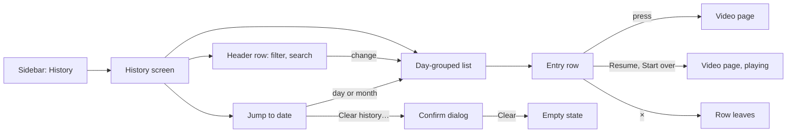
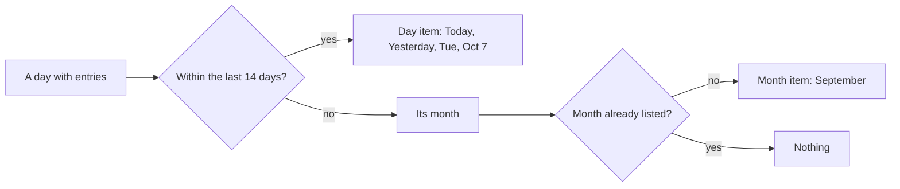

# UI design: Watch history screen

**Feature**: [parent Issue #792](https://github.com/syudead/vv/issues/792) ·
[plan.md](plan.md) ·
[research.md R-3](research.md#r-3-the-entrys-time-is-the-server-time-of-the-first-save-with-its-id) ·
[R-5](research.md#r-5-an-entry-whose-content-left-the-library-stays-without-a-video) ·
[R-6](research.md#r-6-deleting-entries-is-a-plain-delete-a-vanished-entry-answers-404-and-the-screen-reloads) ·
[R-7](research.md#r-7-watch-history-is-one-more-owner-only-screen-and-route-with-the-existing-gate-rules) ·
[R-8](research.md#r-8-filter-search-and-date-jump-are-conditions-of-the-list-request) ·
[R-9](research.md#r-9-the-state-filter-reads-the-videos-current-watch-state-with-the-librarys-rule) ·
[R-11](research.md#r-11-the-date-list-and-the-jump-are-computed-on-the-server-in-the-viewers-time-zone) ·
[R-12](research.md#r-12-the-filter-the-search-and-the-date-live-in-the-screens-url) ·
[R-13](research.md#r-13-the-resume-and-restart-actions-open-the-video-page-with-autoplay-and-the-existing-resume-rule-decides-the-position) ·
[R-14](research.md#r-14-the-entry-keeps-its-instant-the-screen-shows-only-the-day) ·
[R-15](research.md#r-15-the-timeline-section-leaves-the-registry) ·
[contracts/screen-api.md](contracts/screen-api.md) ·
[quickstart.md](quickstart.md)

This is the second revision of the screen. The first revision replaced the
first design (a `GroupedList` of day cards with a `More` menu in the header)
with a day timeline, a header row that holds the filter and the search, and a
side column for the date jump and the clear action. This revision follows the
maintainer's change to requirement 3 and `UI品質`: the day is the only unit of
time on the screen, so the list is a day-grouped list with one heading per day
and no time, no vertical rule and no dots on a row. The header row, the side
column, the row's content, the Resume and Start over actions, the removal
behaviour, the dialog, the entry without a video and the gate rules of the
first revision stand.

Sources that already decide things, linked rather than repeated here:

| Topic | Source |
| --- | --- |
| Tokens, closed scales, library density | [design-system.md, Foundations](../../docs/design-docs/design-system.md#foundations); the values in `@theme` of [`web/src/ui/tokens.css`](../../web/src/ui/tokens.css), named here and never copied |
| `ListPage`, `PageHeader`, `Toolbar`, the state blocks, `LoadMoreRow` | [patterns.md, List page](../../web/registry/rules/patterns.md#list-page) and [States](../../web/registry/rules/patterns.md#states) |
| `GroupedList`: the sticky heading, the rows, the gap between groups | [patterns.md, Sections](../../web/registry/rules/patterns.md#sections), as this revision changes it |
| `ConfirmDialog`: what it confirms, `pending`, the failure `Alert` inside it | [patterns.md, Confirm dialog](../../web/registry/rules/patterns.md#confirm-dialog) |
| `Button`, `ToggleGroup`, `Input`, `DropdownMenu`, `Tooltip`, `Separator`, `Progress`, `Sonner`, `VideoThumbnail`: what each is for | [components.md](../../web/registry/rules/components.md) |
| The library's search field: `/` focuses it, Esc clears it, the query is cut at 100 code points | [`SearchBox.tsx`](../../web/src/videoList/SearchBox.tsx); [013 list-url.md](../013-library-search/contracts/list-url.md) |
| The library's watch filter words and the `ToggleGroup` that picks one | [`FilterMenu.tsx`](../../web/src/videoList/FilterMenu.tsx), `watchLabel` in [`listSummary.ts`](../../web/src/videoList/listSummary.ts) |
| The list view row: title weight and clamp, the warning line of an unplayable video | [library-ui.md, List view and selection](../../docs/design-docs/library-ui.md#list-view-and-selection); the `VideoRow` in [`VideoCard.tsx`](../../web/src/videoList/VideoCard.tsx) |
| An owner-only list screen: entry, route, `document.title`, focus after a row leaves | [030 UI design, Duplicates page](../030-video-versions/ui-design.md#duplicates-page) |
| Sidebar entries, the rail and the drawer, what guests do not see | [016 UI design, Sidebar](../016-single-account-auth/ui-design.md#sidebar) and [Guest degradation](../016-single-account-auth/ui-design.md#guest-degradation) |
| Autoplay on arrival and the resume rule | `autoplayRequested` and `resumePosition` in [`pageDecisions.ts`](../../web/src/player/pageDecisions.ts) |
| Dates are formatted by `Intl` in the catalog's locale | [`web/src/i18n/format.ts`](../../web/src/i18n/format.ts) |
| Width breakpoints in CSS; layout checked by people | [library-ui.md, Width breakpoints](../../docs/design-docs/library-ui.md#width-breakpoints-in-css-and-the-sidebar-exception), [Layout verified by people](../../docs/design-docs/library-ui.md#layout-verified-by-people-not-machines) |
| Screen text | [`web/src/i18n/en.ts`](../../web/src/i18n/en.ts) (`shell.nav`, `common`, `list`); this feature adds `history` and the words below |

The diagram shows the parts of the screen and where each action leads.

Unchanged: the video page and how it resumes, the library's cards and list
view, the `Last played` sort, the sidebar's other entries, and the gate.

## Why this shape

The screen is a list grouped by day: one heading per day, the day's rows under
it directly on the page background, with no card and no line between rows,
and the space between two days wider than the space between two rows. The
revised requirement 3 and `UI品質` make the day the unit of looking back and
rule out a time on an entry and any decoration that draws the flow of time
finer than the day; what remains of the first revision's timeline once its
rule, its dots and its time column are gone is rows under a day heading, and
that is the shape the registry's `GroupedList` is for ("the day of a history",
[patterns.md, Sections](../../web/registry/rules/patterns.md#sections);
[R-15](research.md#r-15-the-timeline-section-leaves-the-registry)). The
maintainer compared the two forms of that shape on a canvas, the rows on one
card per day (the registry's current `GroupedList`) and the rows on the page
background (the first revision's look minus the time, the rule and the dots),
and chose the second: the first design's day cards had already been turned
down on the running screen as a list of videos that happens to have a
heading, and a frame per day draws a box the viewer does not read, where the
gap alone marks the break (`UI品質`, `余白のリズム`). So `GroupedList`
changes form rather than gaining a variant: its rows lose the card and the
line, and the history is its one user, so a card form kept beside the plain
one would be a rule no screen checks, the reason R-15 gives for not keeping
`Timeline` ([Changes to the design system](#changes-to-the-design-system)).
A `DataTable` with a date column stays rejected: the date would repeat on
every row, and the grouping that answers "what did I watch last week" cannot
be drawn by a table.

The heading carries the whole of "when": "Today", "Yesterday" or the weekday,
then the date in the muted colour, on one line. The parent Issue's `UI品質`
asks for "what" and the day it belongs to to be the two things the eye lands
on; the heading sticks under the top bar while its rows scroll, so the day is
always in view above the rows that belong to it, and no row has to say it
again. Two viewings of one video on one day are two rows under one heading
with nothing to tell them apart but their order, as requirement 3 wants: the
entry says which video, and the day says when.

The filter, the search and the date list are tools that narrow the list, so
they sit where tools sit and in the quiet forms the design system has for
them: a segmented `ToggleGroup` and a search `Input` on the header row, and a
plain list of dates in a side column that is read after the list. A filter
popover like the library's was rejected because the Issue names the three
states as the screen's own switch, and three words on the header row cost less
than a popover's extra press. The date list is a side column and not a
calendar, because only the days that have entries are listed and a calendar's
empty cells would be the placeholders Q-5 forbids.

The row shows the current position as text and a bar, next to the resume
action, because requirement 16 and 17 pair them: the viewer reads where they
are and presses the button that continues from there. The thumbnail is wider
than the library's list row (`history-thumb`, about 192×108 px at the widths
from `lg`) because the maintainer's mockup makes the frame the one picture on
the row and the position bar under it has to be readable; the row is still one
line of a log, shorter than a library card, and holds no tags, size, quality or
favorite. The library's `list-thumb` width was rejected for the position bar's
sake: a 112 px bar cannot show a position that moved by a minute in a two-hour
video. The tokens keep the widths the first revision chose and take the name
of the screen that chose them, as `related-thumb` is the video page's
([R-15](research.md#r-15-the-timeline-section-leaves-the-registry)).

The row takes its one-line form from `lg` (1024 px), the width at which the
date list turns from a strip into a side column; below `lg` the row keeps the
compact form of the phone. The first design switched at `sm` (640 px), but in
review of #879 the one-line row left the title column 0 px wide at 640 px and
126 px at 768 px, once the rail, the page padding, the 192 px thumbnail and the
two buttons had taken their widths, so titles broke into a narrow strip. The
maintainer chose the compact form for every width below `lg` over narrower
fixed columns, so the row has one form per side of the breakpoint the rest of
the screen already uses.

Clearing everything is the last item of the side column, after a divider, in
the `ghost-destructive` form, which is as quiet as the column's dates and
quieter than any row's `×`: the Issue puts the action in the side area
(requirement 8) and asks that it be less visible than a one-entry removal
and hard to press by mistake. Red text draws the eye, so it stands after a
divider and at the end of the column, where nothing is pressed by accident,
and the `ConfirmDialog` still stands between the press and the loss. Below
`lg` the column is a strip of date chips without the action, and the clear
action is where the first design had it, behind the header's `More` menu.

An entry whose content left the library stays in the list, not pressable and
without the resume action, with its snapshot title and a warning line,
because the Issue keeps the entry and asks that it be recognisably
unplayable (Edge Case). Hiding the row until the file returns was rejected
by R-5.

## Words

Text in `web/src/i18n/en.ts` under `history`, except where a key is named.
User data (the title) is embedded as an argument. The Issue's `続きから` and
`最初から` are "Resume" and "Start over" ([R-13](research.md#r-13-the-resume-and-restart-actions-open-the-video-page-with-autoplay-and-the-existing-resume-rule-decides-the-position)).
No text on the screen is a time of day: `formatTime` is not used.

| Place | Text | Notes |
| --- | --- | --- |
| Sidebar entry, page title, `document.title` | History | `shell.nav.history`, `history.title`, `history.documentTitle` |
| List accessible name | Watch history | `history.list` |
| Filter group accessible name | Watch status | `list.filter.watch` |
| Filter options | All, In progress, Watched | `list.filter.watchOptions.all`, `.inProgress`, `.watched`; `watchLabel` |
| Search field placeholder and accessible name; the search button below `lg`, its tooltip | Search titles | `history.search.label` |
| Clear the search | Clear search | `list.search.clear` |
| Day heading, first part | Today, Yesterday, else the weekday "Tuesday" | `history.day.today`, `history.day.yesterday`, else `formatWeekday` (`Intl.DateTimeFormat` with `weekday: "long"`) |
| Day heading, second part | Oct 7; Oct 7, 2025 outside the current year | `formatMonthDay` (`month: "short", day: "numeric"`, plus `year` when the day is not in the current year) |
| Day in an accessible name | Today, Oct 7 | `history.day.full(name, date)`: the heading's two parts joined by ", " |
| Folder line | Travel / 2024 | `video.folder.path` with ` / ` between segments; no line when the path is empty or `folder` is absent |
| Position | 16:05 / 42:18 | `history.position(position, duration)`; both through `formatDuration` |
| Position bar accessible name | Watched portion | The card's `list.card.watchedRatio` |
| Resume action, accessible name | Resume; Resume {title} | `history.resume`, `history.resumeFor` |
| Start-over action, accessible name | Start over; Start {title} over | `history.startOver`, `history.startOverFor` |
| Entry link accessible name | {title}, {duration}, played {day} | `history.entryLink(title, duration, day)`; {day} is `history.day.full`; without a duration, "{title}, played {day}". No time: see [Entry row](#entry-row) |
| Remove button, tooltip | Remove from history | `history.remove` |
| Remove button, accessible name | Remove "{title}" played {day} from history | `history.removeFor(title, day)`; {day} as in the entry link |
| Entry not in the library | Not in the library | `history.notInLibrary`; the warning line |
| Entry with an empty snapshot title | Unknown video | `history.unknownTitle` |
| Jump list heading, strip accessible name | Jump to date | `history.jump.title` |
| Jump list day | Today, Yesterday, else Tue, Oct 7 | `history.day.*`, else `formatWeekdayDate` (`weekday: "short", month: "short", day: "numeric"`, plus `year` outside the current year) |
| Jump list month | September; December 2025 outside the current year | `formatMonth` (`month: "long"`, plus `year`) |
| Jump list with nothing to jump to | No dates to jump to | `history.jump.none` |
| Jump list whose request failed | Couldn't load the dates | `history.jump.loadFailed`; `Retry` is `common.retry` |
| Header menu button below `lg`, tooltip and accessible name | More | `common.more` |
| Menu item below `lg`; the side column's last entry from `lg` | Clear history… | `history.clear` |
| Dialog title | Clear watch history? | `history.clearDialog.title` |
| Dialog description | Every entry is removed. Playback positions and watched marks stay as they are. | `history.clearDialog.description` |
| Dialog action | Clear | `history.clearDialog.submit`; `destructive` |
| Dialog action while sending | Clearing… | `history.clearDialog.submitting` |
| Dialog failure | Couldn't clear the history: {reason} | `history.clearDialog.failed`; `destructive` `Alert` in the dialog |
| Remove failed | {reason} | `errorText(error)` in a toast |
| Empty title | No watch history | `history.empty.title` |
| Empty description | Videos you play are listed here, newest first. | `history.empty.description` |
| No match title | No history matches these conditions | `history.noMatch.title` |
| No match description | Try a different search or change the filters. | `list.noMatchesHint` |
| No match action | Clear filters | `list.filter.clear`; removes `watch`, `q` and `date` |
| Load failed | Couldn't load the history | `history.loadFailed`; `Retry` is `common.retry` |
| Loading more, load more failed | Loading…, Couldn't load more: {reason} | The existing `list.loading` and `list.loadMoreFailed` |

## Changes to the design system

The first revision added six things to the registry. Five stand; the
`Timeline` section leaves with this revision, and the loading state and the
named steps change with it. Each change is made in the registry, its rules
file and [design-system.md](../../docs/design-docs/design-system.md) before
the screen uses it, as [patterns.md](../../web/registry/rules/patterns.md)
asks.

| Change | Item | What it is |
| --- | --- | --- |
| `ListPage` `aside` slot and `toolbarRow="header"` (stands) | `list-page` | `aside`: a column at the right of the body from `lg`, `w-list-aside` wide (a named step for a column that fits "Tue, Oct 7" and "Clear history…" on one line), stuck under the top bar while the body scrolls; below `lg` it is drawn full width between the band and the body, and the section in it decides its narrow form. `toolbarRow="header"`: from `lg` the header and the toolbar share one row, the header at its own width and the toolbar filling the rest; below `lg` they stack as today. The grid is a named utility in `tokens.css`, as `grid-cols-term` is |
| `Toolbar` `searchPlacement="end"` (stands) | `toolbar` | In the `page` placement, the search moves after the filters to the row's end, no wider than `max-w-sm`, for a row that begins with the page title; below `sm` it still takes its own full-width line |
| `JumpList` section (stands) | `jump-list` | A `ToggleGroup type="single"` of jump targets in groups divided by `Separator`s, with an optional `action` slot after a last divider; a vertical list under an `h2` from `lg` and a horizontally scrolling strip of `outline` `sm` chips below, with the heading for screen readers only and no `action`; see [Jump to date](#jump-to-date) |
| `Button` variant `ghost-destructive` (stands) | `button` | `ghost`'s shape with `text-destructive` and a `bg-destructive-soft` hover, the button form of `DropdownMenuItem variant="destructive"`; for a destructive action that stands among plain actions outside a menu, after a `Separator`, and always opens a `ConfirmDialog`. One per screen |
| `Timeline` section (removed) | `timeline`, block `timeline-example` | Leaves the registry with its rules row, its row in `design-system.md` and the `timeline` and `timeline-example` items of the manifest ([R-15](research.md#r-15-the-timeline-section-leaves-the-registry)). The history was its only user |
| `GroupedList` section (changed) | `grouped-list`, block `grouped-list-example` | The heading stays: an `h2` in `text-sm font-semibold` that sticks under the top bar while its group scrolls. The rows lose the card (`bg-card`, `rounded-md border`) and the line between them: each row is `py-2` on the page background with no horizontal padding, so its first element aligns with the heading, and the section still owns the row's one-line layout, `gap-2` between the heading and its rows and `gap-6` between groups. Its rules row, its row in `design-system.md` and the example block change with it; the block also loses the time under each row's title, because it stands for the history and the history shows no time, and keeps the thumbnail, the title and the `×` |
| `LoadingState` `layout="grouped"` (replaces `layout="timeline"`) | `loading-state` | `Skeleton` shapes of a grouped list: a heading-sized bar, then three rows on the page background, each a thumbnail-sized block (`w-history-thumb-sm`, `lg:w-history-thumb`) and two text bars, `py-2` with no line, as the rows will be. The `timeline` layout leaves |

Named steps in `tokens.css`: `list-aside` stands; `timeline-label` and
`timeline-time` leave with the section, and so do the `grid-cols-timeline-*`
utilities. `timeline-thumb` and `timeline-thumb-sm` keep their values and
become `history-thumb` (the row thumbnail from `lg`, 16:9, about 192 px wide)
and `history-thumb-sm` (below `lg`, about 128 px wide), named for the screen
whose position bar set them, as `related-thumb` is named for the video page.
Two named utilities, `grid-cols-history-row` (below `lg`: the `history-thumb-sm`
column, the text column, the `×` column) and `grid-cols-history-row-wide` (from
`lg`: the `history-thumb` column, the text column, the action column, the `×`
column), carry the row's columns, as `grid-cols-term` carries the fact list's.
No new colour token, so the contrast pairs in `web/src/theme/tokens.test.ts`
gain nothing.

## Sidebar entry and route

"History" (lucide `History`, `/history`, `ownerOnly`) is the third entry of
the sidebar's top group, after "Folders" and before "Tags": the first three
entries are then the screens for finding something to watch, and the last two
are management. A guest's top group stays "Library" and "Folders", unchanged.
The rail and the drawer treat it as the other entries, and it has no count
badge.

The route has the shape of `/duplicates`: inside `AppShell`, loaded when used,
and in the gate's owner-only paths, so a guest opening `/history` or
`/history?watch=watched` is sent to `/login?next=…` with the full URL (R-7).
`document.title` is "History".

The URL carries `watch`, `q` and `date` as
[contracts/screen-api.md, Client use](contracts/screen-api.md#client-use)
says (R-12); defaults are omitted, unreadable values are the default, and
every row link and action carries the full URL as `state.from`, so the video
page's `×` and Esc come back to the same filter, search and date.

## History screen

A `ListPage` with `toolbarRow="header"` and the `aside` slot, no band and no
selection bar. The body is one `GroupedList`, then a `LoadMoreRow` while the
next page loads, or one state block. The header, the toolbar and the aside
stay where they are in every state; only the body changes.

### Header row

From `lg` the row is, left to right: the `PageHeader` title "History"
(`text-xl font-semibold`, no count: the API gives no total, and a number
would be read as something to reduce), the `Toolbar` with the watch filter as
its child, and the search at the row's end. Nothing in the row is drawn in
`primary` except the pressed filter option's `primary-soft` fill, so the
title stays the strongest text.

| Part | Form |
| --- | --- |
| Watch filter | `ToggleGroup type="single" variant="outline" size="sm"` with the three text items "All", "In progress", "Watched", `aria-label` "Watch status"; the current value is pressed (`primary-soft` with `primary` text) and cannot be unpressed, so one option is always on. `watch` in the URL; "All" is omitted |
| Search | The library's `SearchBox` without the syntax help, placeholder and name "Search titles", `h-8`; `/` focuses it, Esc clears it and blurs, the clear `×` appears while it holds text, and the committed text goes to `q` after the library's debounce. The syntax (`-word`, `a OR b`, quotes) works as in the library (R-10) but is not advertised: the field is for a few letters of a title |
| Below `lg` | The `PageHeader` holds, in `actions`, a `ghost` `icon-sm` search toggle (lucide `Search`, tooltip and name "Search titles", `aria-expanded`) and the `ghost` `icon-sm` `More` button (lucide `Ellipsis`) that opens the one-item menu "Clear history…" (lucide `Trash2`, `variant="destructive"`). The toolbar row under the header holds the filter, and the search field only while it is open |

The search toggle below `lg` is not a filter of its own: it reveals the
toolbar's search, which stays revealed while `q` is not empty or the field
has focus, and is hidden again when Esc or the clear `×` empties it and the
focus leaves. Pressing `/` opens it and focuses the field. From `lg` the
field is always shown and the two header buttons are not drawn, so the
toggle never duplicates the field.

The `More` button and the side column's "Clear history…" are not drawn while
the list is loading, failed, empty or shows no match: there is nothing
visible to clear, and clearing from a view that shows nothing would delete
what the viewer cannot see.

### Day groups

The list is a `GroupedList` named "Watch history": one `GroupedListGroup`
per day, newest day first, with the day's entries as `GroupedListItem`s in
the order the API gives (R-3). Entries are grouped by the calendar day of
`playedAt` in the browser's time zone
([R-14](research.md#r-14-the-entry-keeps-its-instant-the-screen-shows-only-the-day)).
The section owns the heading's place, the rows' padding and every gap; the
screen passes the heading's words and the row's content.

| Part | Form |
| --- | --- |
| Day heading | The section's `h2`, one line: "Today", "Yesterday" or the weekday in `text-sm font-semibold text-foreground`, then a `·` hidden from assistive technology, then the date in `text-xs text-muted-foreground` ("Today · Oct 10", "Tuesday · Oct 7"). It sticks under the top bar (`top-navbar`) while its rows scroll past, and the next day's heading pushes it away. The same at every width |
| Rows inside a day | Directly on the page background, `py-2` each, with no card, no line and no gap between them: the section's form as this revision changes it. The row's `hover:bg-accent` fill is the only surface a row ever shows |
| Between day groups | The section's `gap-6`, visibly wider than the `py-2` between two rows, so the space alone marks the break and the days read as blocks down the page |
| Nothing else | No vertical rule, no dot, no time on a row and no date on a row (`UI品質`, `時系列の粒度`) |

The day boundary is the viewer's local midnight, so an entry from 11:50 PM
and one from 12:10 AM are in two groups. Paging can split a day across two
pages; the next page's first entries join the open group when they fall on the
same day, so a day never appears twice.

"Today" and "Yesterday" are computed from the current date at render, and the
screen renders its headings again at the viewer's next local midnight and when
the tab becomes visible again, without re-reading the list. A screen left open
overnight then shows yesterday's entries under "Yesterday" and the day before
under its weekday.

### Entry row

A row is one `GroupedListItem` whose content is a grid of the named columns.
From `lg` (`grid-cols-history-row-wide`), a row is one line: the thumbnail,
the text column, and the actions at the row's end. Below `lg`
(`grid-cols-history-row`), the row is the compact form: the `history-thumb-sm`
thumbnail at the left with the text column beside it and the `×` at the row's
end, and the resume or start-over button under the text column, aligned with
its left edge. The thumbnail, the title and the actions are vertically
centred in the row, as the list view's cells are.

| Part | Form |
| --- | --- |
| Thumbnail | `VideoThumbnail` `w-history-thumb rounded-md` from `lg`, `w-history-thumb-sm` below: the image or the "No image" placeholder, `VideoThumbnailDuration` bottom right, and `VideoThumbnailProgress` on the bottom edge with `watchedRatio(video)` while the video is in progress, as the card draws it. No favorite, no selection mark, no public mark |
| Title | `text-sm font-medium text-foreground line-clamp-2`, breaking inside a word when it has to; the full title in `title`. The video's current `video.title` |
| Folder line | `text-xs text-muted-foreground truncate`: the folder path, "Travel / 2024"; absent when the video is directly in a registered folder |
| Position line | A `Progress` (`h-1`, `max-w-xs`, `aria-label` "Watched portion") with `max` `durationMs` and `value` `progress.positionMs`, or `durationMs` when `progress.completed` is true, because the server marks a video watched up to 15 seconds or 5% before its end and a watched row's bar is full; then "16:05 / 42:18" in `text-xs text-muted-foreground tabular-nums`. The line is absent when the video has no `progress` or no `durationMs` |
| Actions | From `lg` at the row's end, `shrink-0`: the `outline` `sm` resume or start-over button, then the `ghost` `icon-sm` remove button (lucide `X`, `text-muted-foreground`, tooltip "Remove from history"); below `lg` the button under the text column and the `×` at the row's end, on the thumbnail's first line. Both are always drawn, never revealed on hover only, because the screen is used by touch as well |

The thumbnail and the text column are one `Link` to `/videos/{video.id}` with
`state.from` the current history URL. The link covers the row from the
thumbnail to the actions, with `hover:bg-accent rounded-md`; only the `×` and
the resume or start-over button sit outside it. A press
anywhere on the row but the buttons therefore opens the video as requirement
5 says: the page resumes by its own rule, without autoplay.

The resume and start-over buttons are `Button asChild` around a `Link` to the
same video with `state: { from, autoplay: true }` (R-13), so they stay
links:

| Video state (`progress`) | Button | What the video page does |
| --- | --- | --- |
| In progress (`completed` false) | "Resume" with lucide `Play` | Starts playing at `resumePosition(video)`: the position the row shows, except below `MinResumeMs` (5 s) and when a bundle member's shared position is past this version's length, where it starts at 0 ([R-13](research.md#r-13-the-resume-and-restart-actions-open-the-video-page-with-autoplay-and-the-existing-resume-rule-decides-the-position)). The word stays "Resume": the existing resume rule decides the start, as for a plain open of the video |
| Watched (`completed` true) | "Start over" with lucide `RotateCcw` | Starts playing at 0; the row's text still shows the saved position and the bar is full |
| No `progress` | None | The row itself opens the video. The case is rare (a position row exists for every viewing the server recorded), so a third word is not worth a third button |

The `×` is not a `Link` and sits after the button, so Tab reaches the row
link, then the button, then `×`. Pressing the button does not also open the
row link.

The same video seen twice on one day is two rows under one heading with the
same thumbnail, title and current position (requirements 4 and 16); nothing
merges or counts them. Their link and `×` names are the same words, "{title},
{duration}, played Today, Oct 10" and "Remove "{title}" played Today, Oct 10
from history", and the two rows are told apart by their order under the
heading, which is all that tells them apart on the screen. Reading a time in
the name was rejected by R-14 (requirement 3 removes it from the entry, for a
screen reader as for the eye), and an ordinal ("second viewing") was rejected
because it would say something the screen does not show and that a page
split across a day cannot count. The two viewings seen on two days have
different days in their names, as the eye reads them under two headings.

A video that is in the library but cannot be played (`playable` false) keeps
its link and its button, and shows under the folder line the list view row's
warning line (`text-xs text-warning`, lucide `AlertTriangle` `size-3`, the
row's `unplayable` text), so the viewer learns it before the video page says
the same.

### Entry not in the library

An entry without `video` (R-5) is the same row with these differences:

| Part | Form |
| --- | --- |
| Thumbnail | The frame with the "No image" placeholder (lucide `ImageOff`) and no duration, no progress |
| Title | The entry's snapshot `title` in `text-muted-foreground`; "Unknown video" when it is empty (a backfilled entry whose content had already left the library) |
| Folder, position | None |
| Warning | "Not in the library" in `text-xs text-warning` with lucide `AlertTriangle` `size-3`, where the position line would be |
| Link and button | None: the thumbnail and the lines are plain elements, the row has no hover fill and no pointer cursor, and no "Resume" or "Start over" is drawn (Edge Case: the entry cannot be opened or resumed) |
| Remove | As every row |

The warning carries the meaning, not the colour: the muted title and the
missing button alone would read as a loading glitch. When the content returns
after a rescan, the next read of the list gives the row its video, link,
thumbnail and button back; nothing on this screen watches for it.

### Jump to date

The `aside` is a `JumpList` of the days and months that have entries under
the current filter and search, from `GET /api/watch-history/dates` (R-11).
From `lg` it is the side column under the `h2` "Jump to date"; below `lg` it
is the strip of chips between the toolbar and the list. The diagram shows
how the days the API returns become the list.

"Last 14 days" is counted from today in the browser's zone, so the day items
cover two weeks and the months hold everything older; a month is listed once
however many of its days have entries, and a month whose days are all within
the two weeks is not listed, because its days are. Items are newest first:
the days, a `Separator`, the months, and from `lg` a `Separator` and
"Clear history…".

| Part | Form |
| --- | --- |
| From `lg` | The column: `h2` "Jump to date" in `text-sm font-semibold`, then the items as `ghost` `sm`-sized toggles, full width and left aligned, in `text-sm text-muted-foreground`; the chosen item is pressed (`primary-soft` fill, `primary` text). Months read in the same size as days. The column is stuck under the top bar (`top-navbar`) and scrolls inside itself when taller than the viewport |
| Below `lg` | The strip: the same items as `outline` `sm` chips in one horizontally scrolling line, days then a vertical `Separator` then months, no heading shown and no "Clear history…" (it is in `More`). The chosen chip is pressed and scrolled into view when the list arrives |
| Clear history… | From `lg` only: a `ghost-destructive` `sm` `Button` with lucide `Trash2`, after the last `Separator`, opening the [confirmation](#clearing-the-history) |
| Nothing to jump to | "No dates to jump to" in `text-xs text-muted-foreground` in place of the items (from `lg`); below `lg` the strip is not drawn |
| Dates failed | When `GET /api/watch-history/dates` fails, "Couldn't load the dates" in `text-xs text-muted-foreground` and a `ghost` `sm` "Retry" in place of the items: from `lg` under the heading, with "Clear history…" still after its `Separator` when the list has rows; below `lg` as the strip's one line. "Retry" requests the dates again and shows the `Skeleton` lines while it runs. The list does not depend on the dates and keeps its own state |

Choosing an item writes `date` (`YYYY-MM-DD` for a day, `YYYY-MM` for a
month) and re-reads the first page, which then starts at that day's or
month's newest entry and continues into older ones with `nextCursor`; the
window scrolls to the top. Choosing the first item removes `date` instead,
because the newest day is the top of the list and one view must not have two
URLs; pressing the chosen item again also removes `date`. The dates are
requested when the screen opens and again when `watch` or `q` changes, not
when `date` changes, so the list does not flicker on a jump. When the new
list no longer holds the chosen `date`, the `date` stays in the URL, no item
is pressed, and the list shows what matches before that date; "Clear
filters" in the no-match state removes it with the rest.

### Removing one entry

Pressing `×` sends `DELETE /api/watch-history/{id}` at once. There is no
confirmation and no success toast: the row leaving is the result, and a toast
for every removal would turn a tidy-up into a stream of notices.

| Event | Behaviour |
| --- | --- |
| Pressed | The button is `disabled` and shows a `Spinner` in place of the `X`; the row stays; a second press does nothing |
| `204` | The row leaves; a day whose last row left leaves with its heading. Focus moves to the next row's `×`, else the previous row's, else the page title (`titleRef`), as the duplicates page does. The jump list is not re-read: a day that lost its last entry stays listed until the next read of the dates, and choosing it then shows the entries before it. When the last loaded row leaves and `nextCursor` remains, older entries exist: see [Paging](#paging) |
| `404` | The list is stale (deleted in another tab): the screen re-reads from the first page under the current conditions while the current rows stay drawn, and replaces them when the page arrives, with no skeleton and no message (R-6). The window keeps its scroll position as far as the shorter list allows. An empty first page gives the empty or the no-match state; a failed re-read keeps the rows and shows `errorText(error)` in a toast |
| Other failure | The row stays, the button returns to `X`, and a toast shows `errorText(error)` |

Removing the entry of a video that is playing in another tab stops nothing:
that tab's next save writes a new entry, which this screen shows on its next
read (Edge Case).

### Clearing the history

"Clear history…" (the side column's last entry from `lg`, the one item of
the header's `More` menu below `lg`) opens a `ConfirmDialog`.

| Part | Form |
| --- | --- |
| Dialog | `ConfirmDialog`: title "Clear watch history?", description "Every entry is removed. Playback positions and watched marks stay as they are.", `Cancel` first, then the `destructive` action "Clear" |
| Sending | `pending`: both buttons disabled, the action reads "Clearing…" with a `Spinner`, the dialog stays open |
| `204` | The dialog closes, the body shows the empty state, the jump list shows "No dates to jump to", `watch`, `q` and `date` are removed from the URL, and focus goes to the page title |
| Failure | A `destructive` `Alert` "Couldn't clear the history: {reason}" under the description; the dialog stays open and the list behind it is unchanged |
| Cancel, Esc | The dialog closes, nothing changes (acceptance criterion 7) |

The description names what stays, because the one thing an owner fears here
is losing their resume positions (requirement 9); the words settle it before
the press. Clearing removes every entry, not the filtered ones, and the
dialog's title says so; the conditions are dropped on success so the empty
state is not mistaken for a no-match.

### Paging

The first read asks for the default page (`limit` 60) with the URL's
`watch`, `query`, `date` and `tz`. When the last row comes within one
viewport of the bottom, the next page is requested with `nextCursor` and the
same conditions, as the library does with its `IntersectionObserver`, and a
`LoadMoreRow` shows under the list. A failed page keeps the rows and
shows the `LoadMoreRow` failure with `Retry` for the same cursor. No "Load
more" button and no page numbers: the history is read by scrolling back
(requirement 6).

Removing rows can leave no loaded row while `nextCursor` still points at older
entries. The screen then requests the next page at once (or waits for the
request already running), with the `LoadMoreRow` alone in the body, and shows
the rows that arrive. A failure there is the `LoadMoreRow` failure with
`Retry`. The empty and no-match states appear only when no row is loaded and
no `nextCursor` remains, so older entries never become unreachable until a
reload.

### States

The diagram shows the body's states and what moves it between them.

```mermaid
stateDiagram-v2
  [*] --> Loading
  Loading --> Content: entries
  Loading --> Empty: no entries, no conditions
  Loading --> NoMatch: no entries, a condition set
  Loading --> LoadFailed: request failed
  LoadFailed --> Loading: Retry
  Content --> Loading: filter, search or date changed
  Empty --> Loading: filter or search changed
  NoMatch --> Loading: filter, search or date changed, Clear filters
  Content --> LoadingMore: near the end, more exists
  LoadingMore --> Content: next page
  LoadingMore --> LoadMoreFailed: request failed
  LoadMoreFailed --> LoadingMore: Retry
  Content --> Content: × on a row, 204, or 404 and the re-read first page
  Content --> LoadingMore: last loaded row removed, more exists
  Content --> Empty: last row removed and no more, no conditions; Clear
  Content --> NoMatch: last row removed and no more, a condition set
```

A condition is set when `watch` is not "All", `q` is not empty or `date` is
present. A `404` re-read is not a state of its own: the body stays in
`Content`, rows drawn, until the first page replaces them.

| State | What the screen shows |
| --- | --- |
| Loading | `LoadingState` `layout="grouped"` in the body: a heading-sized bar and three thumbnail-sized rows on the page background; the header row with its filter and search; the aside with its items when the dates have arrived, its failed form when their request failed, else the aside's own `Skeleton` lines; no `More` and no "Clear history…" |
| Load failed | `ErrorState` with "Couldn't load the history" and `Retry`; the aside shows "No dates to jump to" |
| Empty | `EmptyState` with lucide `History`, "No watch history" and "Videos you play are listed here, newest first."; no action. The filter and the search stay usable but find nothing. The aside shows "No dates to jump to"; below `lg` no strip |
| No match | `EmptyState` with lucide `SearchX`, "No history matches these conditions", "Try a different search or change the filters." and the `default` `sm` action "Clear filters", which removes `watch`, `q` and `date`. The filter keeps its pressed option and the search its text, so the viewer sees what excluded everything; the aside shows "No dates to jump to" or, under a `date` the new dates no longer hold, the dates with nothing pressed |
| Content | The day-grouped list; the aside with its items (or its failed form) and "Clear history…"; `More` below `lg` |
| Loading more | The list, then `LoadMoreRow` loading |
| Load more failed | The list, then `LoadMoreRow` failed with `Retry` |
| Removing a row | That row's `×` is a `Spinner`; the rest unchanged |
| Clearing | The dialog in its `pending` form over the unchanged list |

Empty and no match must read as two different things at a glance: the empty
state has the `History` icon and no button, the no-match state has the
`SearchX` icon and the "Clear filters" button, and the header above the
no-match state shows a pressed filter other than "All", text in the search or
a pressed date.

The list is read when the screen opens, when a condition changes, and when
the viewer returns to it from a video page (the `Link` leaves the route, so
the screen mounts again with the same URL and reads the first page). Every
row of that video shows the position the viewing reached (acceptance criterion
14), and, when the URL has no `date` and the viewing matches the filter and
the search, the viewing just finished sits at the top. Under a `date` the page
starts at that day or month, so a newer viewing is above it and appears when
the viewer chooses the first jump item. It does not refresh on its own while open: the
only cross-tab change the Issue names is the stale removal, which the `404`
path covers (R-6).

## Responsive behaviour

The widths below are the ones the implementation is judged at. The layout
changes at `lg` (1024 px: the header row, the side column, where the clear
action lives, and the row's form); at `sm` (640 px) the drawer becomes the
rail. The day heading has one form at every width.

| Width | Layout |
| --- | --- |
| 360px | The sidebar is the drawer. The header row is the title with the search toggle and `More` at its right; under it the filter's three options fill the toolbar row, and the search field appears on its own line while open; then the strip of date chips, scrolling sideways with the chosen chip in view. Each day is its heading ("Today · Oct 10") stuck under the top bar and its rows on the page background, with no card and no line; a row is the `w-history-thumb-sm` thumbnail at the left with the title and the position text beside it and the `×` at the row's end, and the `outline` `sm` "Resume" or "Start over" button under the text column. A long title clamps to two lines and never pushes the `×` out of the row. The dialog spans the width with the dialog's own margin |
| 768px | The rail sidebar. The header row as at 360px; the strip as at 360px. The rows keep the compact form of 360px: the `w-history-thumb-sm` thumbnail with the text column beside it, the `×` at the row's end and the button under the text; the wider text column leaves more of a long title on its two lines |
| 1280px | The rows take the one-line form from `lg`: the `w-history-thumb` thumbnail, the title, the folder line and the position bar in the middle, and the resume or start-over button and the `×` at the row's end. The header row holds the title, the filter and the search field at the row's end; no search toggle and no `More`. The `w-list-aside` side column stands at the right of the list under "Jump to date", stuck under the top bar, with "Clear history…" after its last divider. The dialog is `max-w-lg` centred |

## Review criteria

Judged by looking at the screen at 360px, 768px and 1280px with a history of
at least 30 entries over four days and two older months, including one video
seen twice on one day, one video watched to the end, one entry whose file
was removed, one entry with an empty title and one video in a subfolder.

1. **Visual hierarchy**: on each row the title is read first and the position
   second; the thumbnail supports the title and does not compete with it. The
   day heading is the strongest text on the screen after the page title, and
   nothing in a row is drawn in `primary` except the progress bar's fill and
   nothing in `semibold` or a larger size. `×` is the quietest element in the
   row; the filter and the search on the header row and the dates in the side
   column are drawn in the muted colour and the outline form, so the list is
   what the eye lands on, not its tools (`UI品質`).
2. **The day is the unit of time**: no row shows a time of day or a date, and
   no rule, dot or other mark draws the order of the viewings inside a day;
   the heading is the only place a day is named, once per day (`UI品質`,
   `時系列の粒度`; acceptance criterion 1). The two viewings of one video on
   one day are two rows under one heading that differ in nothing but their
   place.
3. **Information density**: at 1280×800 at least five entries are on screen
   without scrolling, and at 360×780 at least four, counting the day headings
   as rows; every row is shorter than a library card at the default card size,
   and holds a thumbnail, a title, one folder line, one position line and two
   buttons, with no tags, favorite, size or quality. From `lg` the position
   bar and text add no row height beyond the thumbnail's.
4. **Spacing rhythm**: no card, frame or line is drawn around or between the
   rows; the space between two days is visibly wider than the space between
   two rows, so the days read as blocks down the page from the spacing alone. When a day's rows scroll past, its heading stays
   under the top bar until the next day's heading pushes it away.
5. **Typography**: the title is `text-sm` `font-medium` as the list view
   row's title; the folder line and the position are `text-xs`
   `text-muted-foreground`, with `tabular-nums` on the position so the
   positions of a column align; the day heading is `text-sm` `font-semibold`
   followed by the date in `text-xs` muted. Side by side with the library's
   list view, the title and the secondary lines are the same size, weight and
   colour.
6. **Priority of actions**: pressing anywhere on a row except the buttons
   opens the video, which resumes by its own rule; "Resume" is the one
   outlined control on the row and starts playback without a further press at
   the shown position, or at 0 when that is under 5 seconds; "Start over" on
   the watched video starts at 0. Removing one entry is one press on `×`.
   Clearing takes "Clear history…" (in the side column, or `More` then the
   item) and then "Clear"; the clear entry is the last thing in the column,
   after a divider, and is never the most visible control on the screen.
7. **Filter and search**: pressing "In progress" lists only the midway
   video's entries, "Watched" only the finished one's, "All" both, and the
   video the library marks watched is under "Watched"; the two viewings of
   one video fall on the same side. Typing part of a title narrows the list
   after the debounce, and clearing the field with `×` or Esc restores it;
   "In progress" with text keeps only entries that satisfy both. The URL
   carries `watch` and `q`, and Back restores the previous conditions.
8. **No match and empty**: under a filter or search that matches nothing,
   the body shows "No history matches these conditions" with the `SearchX`
   icon and "Clear filters", while the header still shows the pressed option
   or the text; with the history empty and no condition set, the body shows
   "No watch history" with the `History` icon and no button. The two are told
   apart without reading the title.
9. **Date jump**: the side column lists only the days and months with
   entries, days within the last two weeks and months before them, newest
   first; choosing a month scrolls to the top and the list starts at that
   month's newest entry and continues into older months; the chosen item is
   pressed; choosing the first item or the pressed item returns to the top
   with `date` gone; the chips at 360px and 768px are the same list and the
   chosen chip is in view. Opening a video from a jumped view and coming back
   with `×` shows the same date, filter and search.
10. **An entry not in the library**: the removed video's row shows its title
    in the muted colour, "Not in the library" with the warning icon, no
    position, no "Resume" and no hover fill; pressing it opens nothing; its
    `×` works. The entry with the empty title reads "Unknown video". After
    the file returns and a rescan, the row opens the video again and shows
    its button.
11. **Position**: the midway video's rows show "16:05 / 42:18"-style text
    and a bar at that ratio, the same on both of its rows; after watching
    further in another tab and reopening the history, the text and the bar
    have moved. The watched video's row shows a full bar and "Start over".
12. **Removing and clearing leave playback alone**: after removing a row and
    after clearing, the library card of that video shows the same progress
    bar, watched mark and place under "Last played" as before (acceptance
    criterion 6). Removing the last row of a day removes its heading with it.
13. **Confirmation**: "Clear history…" opens the dialog; Cancel and Esc close
    it with the list unchanged; "Clear" shows "Clearing…", then the empty
    state with the conditions dropped. While the request runs neither
    button can be pressed again.
14. **Stale list**: with the list open in two tabs, removing an entry in one
    and then in the other leaves the second tab showing the current list
    under its conditions, with no error and no toast.
15. **Guests**: signed in as a guest, the sidebar has no "History" at any
    width, and opening `/history` or `/history?watch=watched` shows the
    login page (acceptance criterion 9).
16. **Failing examples** (`UI品質`): a time on any row, or a date repeated on
    every row; a vertical rule, dots or any other mark that draws the order
    inside a day; the title and the day heading in the same size and weight;
    a filled or large filter whose pressed option is brighter than any title;
    the side column drawn on a card or in `primary`; the rows of a day on a
    card, or a line between two rows; days so close together that they run
    into one list; "Resume" drawn as a
    `default` cyan button on every row; `×` drawn in `destructive` on every
    row; "Clear history…" above the dates or as a filled button.
