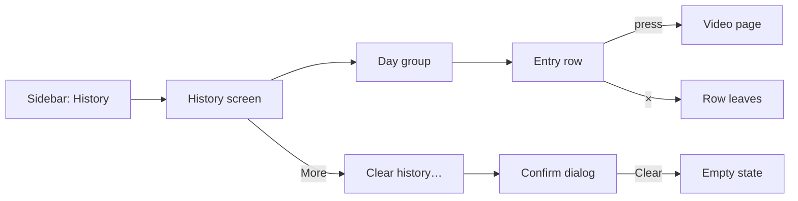
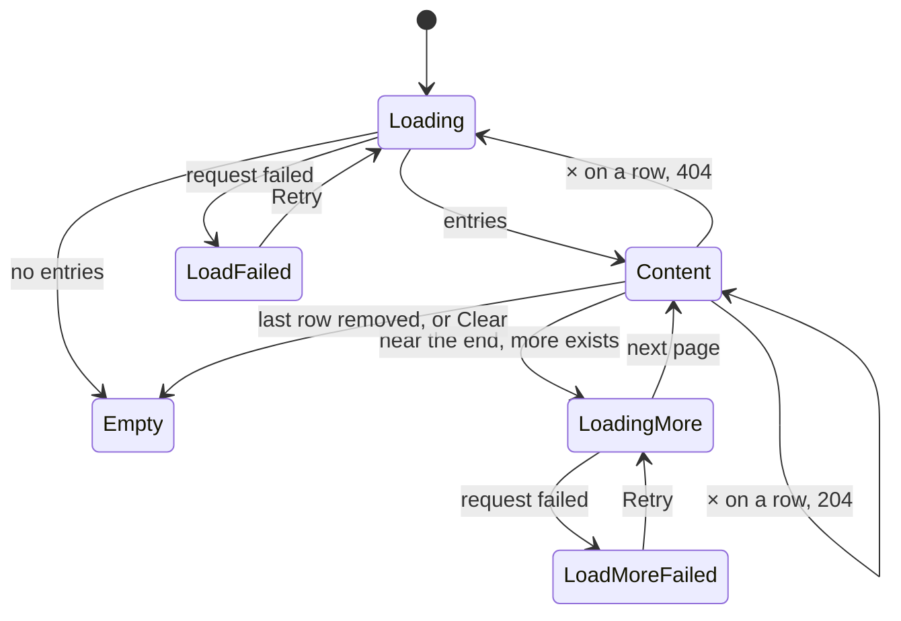

# UI design: Watch history screen

**Feature**: [parent Issue #792](https://github.com/syudead/vv/issues/792) ·
[plan.md](plan.md) ·
[research.md R-3](research.md#r-3-the-entrys-time-is-the-server-time-of-the-first-save-with-its-id) ·
[R-5](research.md#r-5-an-entry-whose-content-left-the-library-stays-without-a-video) ·
[R-6](research.md#r-6-deleting-entries-is-a-plain-delete-a-vanished-entry-answers-404-and-the-screen-reloads) ·
[R-7](research.md#r-7-watch-history-is-one-more-owner-only-screen-and-route-with-the-existing-gate-rules) ·
[contracts/screen-api.md](contracts/screen-api.md) ·
[quickstart.md](quickstart.md)

Sources that already decide things, linked rather than repeated here:

| Topic | Source |
| --- | --- |
| Tokens, closed scales, library density | [design-system.md, Foundations](../../docs/design-docs/design-system.md#foundations); the values in `@theme` of [`web/src/ui/tokens.css`](../../web/src/ui/tokens.css), named here and never copied |
| `ListPage`, `PageHeader`, the state blocks, `LoadMoreRow` | [patterns.md, List page](../../web/registry/rules/patterns.md#list-page) and [States](../../web/registry/rules/patterns.md#states) |
| `ConfirmDialog`: what it confirms, `pending`, the failure `Alert` inside it | [patterns.md, Confirm dialog](../../web/registry/rules/patterns.md#confirm-dialog) |
| `Button`, `DropdownMenu`, `Tooltip`, `Sonner`, `VideoThumbnail`: what each is for | [components.md, Button](../../web/registry/rules/components.md#button), [DropdownMenu](../../web/registry/rules/components.md#dropdownmenu), [Tooltip](../../web/registry/rules/components.md#tooltip), [Sonner](../../web/registry/rules/components.md#sonner), [VideoThumbnail](../../web/registry/rules/components.md#videothumbnail) |
| The list view row: thumbnail width, title weight and clamp, the warning line of an unplayable video | [library-ui.md, List view and selection](../../docs/design-docs/library-ui.md#list-view-and-selection); the current `VideoRow` in [`VideoCard.tsx`](../../web/src/videoList/VideoCard.tsx) |
| An owner-only list screen without a toolbar: entry, route, `document.title`, focus after a row leaves | [030 UI design, Duplicates page](../030-video-versions/ui-design.md#duplicates-page); the current [`DuplicatesPage.tsx`](../../web/src/versions/DuplicatesPage.tsx) |
| Sidebar entries, the rail and the drawer, what guests do not see | [016 UI design, Sidebar](../016-single-account-auth/ui-design.md#sidebar) and [Guest degradation](../016-single-account-auth/ui-design.md#guest-degradation); [`navigation.ts`](../../web/src/shell/navigation.ts), [`AuthGate.tsx`](../../web/src/auth/AuthGate.tsx) |
| Dates and times are formatted by `Intl` in the catalog's locale | [`web/src/i18n/format.ts`](../../web/src/i18n/format.ts) |
| Width breakpoints in CSS; layout checked by people | [library-ui.md, Width breakpoints](../../docs/design-docs/library-ui.md#width-breakpoints-in-css-and-the-sidebar-exception), [Layout verified by people](../../docs/design-docs/library-ui.md#layout-verified-by-people-not-machines) |
| Screen text | [`web/src/i18n/en.ts`](../../web/src/i18n/en.ts) (`shell.nav`, `common`, `list`); this feature adds `history` and the words below |

The diagram shows the parts of the screen and where each action leads.

Unchanged: the video page and how it resumes, the library's cards and list
view, the `Last played` sort, the sidebar's other entries, and the gate.

## Why this shape

The screen is a `ListPage` of entry rows grouped under day headings, newest
first. A row holds the thumbnail, the title and the time, and nothing else:
the parent Issue's `UI品質` asks for "when" and "what" to be the only things
the eye lands on, and for dozens of entries to be scanned at once, so the row
is the library's list view row stripped of its columns. A `CardGrid` of cards
was rejected: cards show fewer entries per screen and give every entry the
weight of a library item, when a history entry is a line in a log. A
`DataTable` with a date column was rejected: the date would repeat on every
row, and the day grouping, which is what makes "what did I watch last week"
answerable at a glance, cannot be drawn by a table.

The day heading carries the date and the row carries only the time, so the
two never say the same thing twice, and the gap between day groups is wider
than the gap between rows. Day headings stick under the top bar while their
group scrolls, so the viewer three screens down still knows which day they are
reading.

Deleting one entry is a quiet `×` at the row's end, with no confirmation: the
Issue asks for a confirmation only before clearing everything (requirement 8),
and one lost entry costs a minute of memory, not data. Clearing everything is
two presses away, behind the header's `More` menu, and then a `ConfirmDialog`:
a visible "Clear history" button in the header would be the most prominent
control on a screen whose main action is opening a video, which is the
failing example the Issue names. A one-item menu is unusual, and that is the
point: the action is found by someone looking for it and not by someone
reaching for the row's `×`.

An entry whose content left the library stays in the list, not pressable, with
its snapshot title and a warning line, because the Issue keeps the entry and
asks that it be recognisably unplayable (Edge Case). Hiding the row until the
file returns was rejected by R-5.

## Words

Text in `web/src/i18n/en.ts` under `history`, except where a key is named.
User data (the title) is embedded as an argument.

| Place | Text | Notes |
| --- | --- | --- |
| Sidebar entry, page title, `document.title` | History | `shell.nav.history`, `history.title`, `history.documentTitle` |
| Day heading, the current day | Today | `history.day.today` |
| Day heading, the day before | Yesterday | `history.day.yesterday` |
| Day heading, any other day | Sep 27, 2026 | `formatDate` of the day |
| Entry time | 3:04 PM | `formatTime`, added to `format.ts` as `Intl.DateTimeFormat` with `timeStyle: "short"` in the catalog's locale |
| Entry link accessible name | {title}, {duration} | The existing `videoLinkLabel` |
| Remove button, tooltip | Remove from history | `history.remove` |
| Remove button, accessible name | Remove "{title}" from history | `history.removeFor` |
| Entry not in the library | Not in the library | `history.notInLibrary`; the warning line |
| Entry with an empty snapshot title | Unknown video | `history.unknownTitle` |
| Header menu button, tooltip and accessible name | More | `common.more` |
| Menu item | Clear history… | `history.clear` |
| Dialog title | Clear watch history? | `history.clearDialog.title` |
| Dialog description | Every entry is removed. Playback positions and watched marks stay as they are. | `history.clearDialog.description` |
| Dialog action | Clear | `history.clearDialog.submit`; `destructive` |
| Dialog action while sending | Clearing… | `history.clearDialog.submitting` |
| Dialog failure | Couldn't clear the history: {reason} | `history.clearDialog.failed`; `destructive` `Alert` in the dialog |
| Remove failed | {reason} | `errorText(error)` in a toast |
| Empty title | No watch history | `history.empty.title` |
| Empty description | Videos you play are listed here, newest first. | `history.empty.description` |
| Load failed | Couldn't load the history | `history.loadFailed`; `Retry` is `common.retry` |
| Loading more, load more failed | Loading…, Couldn't load more: {reason} | The existing `list.loading` and `list.loadMoreFailed` |

## Sidebar entry and route

"History" (lucide `History`, `/history`, `ownerOnly`) is the third entry of
the sidebar's top group, after "Folders" and before "Tags": the first three
entries are then the screens for finding something to watch, and the last two
are management. A guest's top group stays "Library" and "Folders", unchanged.
The rail and the drawer treat it as the other entries, and it has no count
badge.

The route has the shape of `/duplicates`: inside `AppShell`, loaded when used,
and in the gate's owner-only paths, so a guest opening `/history` is sent to
`/login?next=/history` (R-7). `document.title` is "History".

## History screen

A `ListPage` with a `PageHeader` and no toolbar, band or selection bar. The
header holds the title "History" and, in `actions`, one `ghost` `icon-sm`
button (lucide `Ellipsis`, `Tooltip` "More") that opens the menu of
[Clearing the history](#clearing-the-history). No count: the API gives no
total, and a number would be read as something to reduce. The body is the
day groups, then a `LoadMoreRow` while the next page loads, or one state
block.

### Day groups

Entries are grouped by the calendar day of `playedAt` in the browser's time
zone, newest day first, and within a day in the order the API gives (R-3).
A group is a `section`: its heading, then its rows on one `bg-card` surface
with `rounded-md border border-border` and `divide-y divide-border` between
rows, as the duplicates page draws its list.

| Part | Form |
| --- | --- |
| Heading | `h2`, `text-sm font-semibold text-foreground`, `py-2`; "Today", "Yesterday", else `formatDate`. `sticky top-navbar z-10 bg-background`, so it stays under the top bar while its rows scroll past, and the next day's heading pushes it away |
| Rows | The entry rows, divided by a line, with no gap between them |
| Between groups | `gap-6` in the page body; inside a group the heading and its card are `gap-2` apart |

The day boundary is the viewer's local midnight, so an entry from 11:50 PM
and one from 12:10 AM are in two groups. Paging can split a day across two
pages; the next page's first entries join the open group when they fall on the
same day, so a day never appears twice.

### Entry row

A row is `flex items-center gap-3 p-2`. From left to right:

| Part | Form |
| --- | --- |
| Thumbnail | `VideoThumbnail` as the list view row draws it: `w-list-thumb rounded-sm`, the image or the "No image" placeholder, the duration at the bottom right, and `VideoThumbnailProgress` on the bottom edge while the video is in progress. No favorite, no selection mark, no public mark |
| Title | `text-sm font-medium text-foreground`, `line-clamp-2`, breaking inside a word when it has to; the full title in `title`. The video's current `video.title` |
| Second line | `text-xs text-muted-foreground tabular-nums`: the time, "3:04 PM" |
| Remove | `ghost` `icon-sm` `Button` with lucide `X` in `text-muted-foreground`, `shrink-0`, at the row's end, with the tooltip "Remove from history"; always drawn, never revealed on hover only, because the screen is used by touch as well |

The thumbnail and the two lines are one `Link` to `/videos/{video.id}` with
`state.from` `/history`, so the video page's `×` and Esc come back here. The
link covers the row up to the remove button, with the row's `hover:bg-accent`
fill and `rounded-md`, so a press anywhere on the row but the `×` opens the
video (`UI品質`, priority of actions). The video page resumes as it does from
anywhere (requirement 5).

The same video seen twice is two rows with the same thumbnail and title and
different times (requirement 4); nothing merges or counts them.

A video that is in the library but cannot be played (`playable` false) keeps
its link, and shows under the time the list view row's warning line
(`text-xs text-warning`, lucide `AlertTriangle` `size-3`, the row's
`unplayable` text), so the viewer learns it before the video page says the
same.

### Entry not in the library

An entry without `video` (R-5) is the same row with these differences:

| Part | Form |
| --- | --- |
| Thumbnail | The frame with the "No image" placeholder (lucide `ImageOff`) and no duration, no progress |
| Title | The entry's snapshot `title` in `text-muted-foreground`; "Unknown video" when it is empty (a backfilled entry whose content had already left the library) |
| Second line | The time, then on its own line the warning "Not in the library" in `text-xs text-warning` with lucide `AlertTriangle` `size-3` |
| Link | None: the thumbnail and the lines are plain elements, the row has no hover fill and no pointer cursor |
| Remove | As every row |

The warning carries the meaning, not the colour: the muted title and the
missing link alone would read as a loading glitch. When the content returns
after a rescan, the next read of the list gives the row its video, link and
thumbnail back; nothing on this screen watches for it.

### Removing one entry

Pressing `×` sends `DELETE /api/watch-history/{id}` at once. There is no
confirmation and no success toast: the row leaving is the result, and a toast
for every removal would turn a tidy-up into a stream of notices.

| Event | Behaviour |
| --- | --- |
| Pressed | The button is `disabled` and shows a `Spinner` in place of the `X`; the row stays; a second press does nothing |
| `204` | The row leaves; a day whose last row left leaves with its heading. Focus moves to the next row's `×`, else the previous row's, else the page title (`titleRef`), as the duplicates page does |
| `404` | The list is stale (deleted in another tab): the screen re-reads from the first page and replaces what it shows when the page arrives, with no skeleton and no message (R-6). The window keeps its scroll position as far as the shorter list allows |
| Other failure | The row stays, the button returns to `X`, and a toast shows `errorText(error)` |

Removing the entry of a video that is playing in another tab stops nothing:
that tab's next save writes a new entry, which this screen shows on its next
read (Edge Case).

### Clearing the history

The header's `More` opens a `DropdownMenu` with one item, "Clear history…"
(lucide `Trash2`, `variant="destructive"`), which opens a `ConfirmDialog`.
The menu button is not drawn while the list is loading, failed or empty: there
is nothing to clear.

| Part | Form |
| --- | --- |
| Dialog | `ConfirmDialog`: title "Clear watch history?", description "Every entry is removed. Playback positions and watched marks stay as they are.", `Cancel` first, then the `destructive` action "Clear" |
| Sending | `pending`: both buttons disabled, the action reads "Clearing…" with a `Spinner`, the dialog stays open |
| `204` | The dialog closes, the body shows the empty state, focus goes to the page title |
| Failure | A `destructive` `Alert` "Couldn't clear the history: {reason}" under the description; the dialog stays open and the list behind it is unchanged |
| Cancel, Esc | The dialog closes, nothing changes (acceptance criterion 7) |

The description names what stays, because the one thing an owner fears here
is losing their resume positions (requirement 9); the words settle it before
the press.

### Paging

The first read asks for the default page (`limit` 60). When the last row
comes within one viewport of the bottom, the next page is requested with
`nextCursor`, as the library does with its `IntersectionObserver`, and a
`LoadMoreRow` shows under the last group. A failed page keeps the rows and
shows the `LoadMoreRow` failure with `Retry` for the same cursor. No "Load
more" button and no page numbers: the history is read by scrolling back
(requirement 6).

### States

The diagram shows the body's states and what moves it between them.

| State | What the screen shows |
| --- | --- |
| Loading | The header without `More`; in the body one heading-height `Skeleton` and six row-height `Skeleton`s, `aria-hidden` |
| Load failed | `ErrorState` with "Couldn't load the history" and `Retry`; no `More` |
| Empty | `EmptyState` with lucide `History`, "No watch history" and "Videos you play are listed here, newest first."; no action and no `More`. The same block after clearing, and after the last row is removed |
| Content | The day groups; `More` in the header |
| Loading more | The groups, then `LoadMoreRow` loading |
| Load more failed | The groups, then `LoadMoreRow` failed with `Retry` |
| Removing a row | That row's `×` is a `Spinner`; the rest unchanged |
| Clearing | The dialog in its `pending` form over the unchanged list |

The list is read when the screen opens and when the viewer returns to it from
a video page (the `Link` leaves the route, so the screen mounts again and
reads the first page, where the viewing just finished now sits at the top).
It does not refresh on its own while open: the only cross-tab change the
Issue names is the stale removal, which the `404` path covers (R-6).

## Responsive behaviour

The widths below are the ones the implementation is judged at.

| Width | Layout |
| --- | --- |
| 360px | The sidebar is the drawer. A row is the thumbnail (`w-list-thumb`), the title and time in the remaining width, and `×` at the end; a long title clamps to two lines and never pushes `×` out of the row. The day heading, the card and the header share the page's `p-3` edges. The dialog spans the width with the dialog's own margin |
| 768px | The rail sidebar. The same row, with more room for the title; most titles fit on one line |
| 1280px | As 768px; the rows stretch to the body's width, as the duplicates page's rows do, and the title still starts right after the thumbnail. The dialog is `max-w-lg` centred |

## Review criteria

Judged by looking at the screen at 360px, 768px and 1280px with a history of
at least 30 entries over four days, including one video seen twice on one
day, one entry whose file was removed, and one entry with an empty title.

1. **Visual hierarchy**: on each row the title is read first and the time
   second; the thumbnail supports the title and does not compete with it. The
   day heading is the strongest text on the screen after the page title, and
   nothing in a row is drawn in `primary`, `semibold` or a larger size. `×` is
   the quietest element in the row and `More` the quietest in the header.
2. **Information density**: at 1280×800 at least eight entries are on screen
   without scrolling, and at 360×780 at least five; the library's card grid
   at the same widths shows fewer. A row holds a thumbnail, a title and one
   secondary line, and no tags, favorite, size, quality or location.
3. **Spacing rhythm**: the gap between two day groups is visibly wider than
   the gap between the heading and its rows, and rows inside a group are
   separated by a line and no gap, so the days read as blocks. Scrolling
   through two days, the heading of the current day stays under the top bar
   and is replaced by the next day's heading as it arrives.
4. **Typography**: the title is `text-sm` `font-medium` as the list view
   row's title; the time is `text-xs` `text-muted-foreground` with
   `tabular-nums`, so the times of one day align; the day heading is
   `text-sm` `font-semibold`. Side by side with the library's list view, the
   title and the secondary line are the same size, weight and colour.
5. **Priority of actions**: pressing anywhere on a row except `×` opens the
   video, and the video resumes from its saved position. Removing one entry is
   one press on `×`. Clearing takes `More`, then "Clear history…", then
   "Clear", and the first two are never the most visible control on the
   screen.
6. **An entry not in the library**: the removed video's row shows its title
   in the muted colour, "Not in the library" with the warning icon, and no
   hover fill; pressing it opens nothing; its `×` works. The entry with the
   empty title reads "Unknown video". After the file returns and a rescan, the
   row opens the video again.
7. **Removing and clearing leave playback alone**: after removing a row and
   after clearing, the library card of that video shows the same progress
   bar, watched mark and place under "Last played" as before (acceptance
   criterion 6).
8. **Same video twice**: the two viewings of one day are two rows with
   different times, and nothing on the screen counts or merges them.
9. **Confirmation**: "Clear history…" opens the dialog; Cancel and Esc close
   it with the list unchanged; "Clear" shows "Clearing…", then the empty
   state. While the request runs neither button can be pressed again.
10. **Stale list**: with the list open in two tabs, removing an entry in one
    and then in the other leaves the second tab showing the current list, with
    no error and no toast.
11. **Guests**: signed in as a guest, the sidebar has no "History" at any
    width, and opening `/history` shows the login page (acceptance criterion
    9).
12. **Failing examples** (`UI品質`): the title and the time in the same size
    and weight; a "Clear history" button in the header next to the title; a
    date repeated on every row; cards instead of rows; `×` drawn in
    `destructive` on every row.
