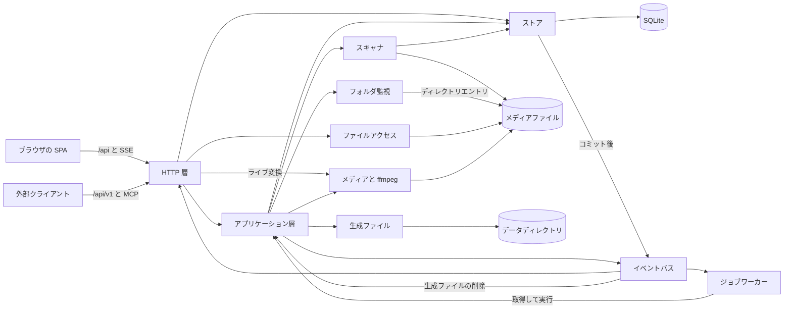
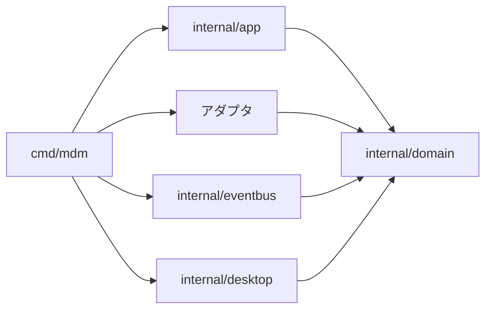
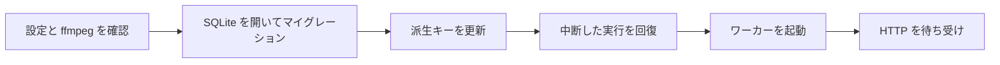

# アーキテクチャ {#architecture}

VVMDM はセルフホスト型のメディアデータ管理 (MDM) システムで、ローカルストレージ上の動画ファイルを索引付けし、ブラウザで再生する。この文書は、構成要素、その境界、構成要素をまたいで成り立つ規則の地図である。各構成要素の詳細は、[サブシステムの地図](#subsystem-map) がリンクする文書にある。技術スタックの選定は [tech-stack-selection.md](docs/design-docs/tech-stack-selection.md) にある。

## システムと実行場所 {#system-and-where-it-runs}

1 つの Go プロセスが、埋め込んだ React SPA、JSON API、バイト範囲指定の動画ストリーミングを提供する。このプロセスは SQLite とマウントしたボリューム上の動画ファイルを基盤とし、1 つのコンテナとして配布される。`ffmpeg`/`ffprobe` は子プロセスとして動き、ジョブワーカーか、それを必要とするリクエストが起動する。マルチユーザー対応はまだ作られていない。同じバイナリは Windows デスクトップアプリ `VVMDM.exe` としても配布される ([windows-app.md](docs/design-docs/windows-app.md))。

図は、プロセスの構成要素と、それぞれが読み書きするものを示す。

## 意図する依存の方向 {#intended-dependency-direction}

インポートは一方向を向き、`cmd` から `internal/` のパッケージを経て、リポジトリ内の何にも依存しない `internal/domain` に至る。

| 層 | パッケージ | 担当 | インポートしてはならないもの |
| --- | --- | --- | --- |
| ドメイン | `internal/domain` | 値の型と純粋な規則。ストアが強制する業務ルールを含む | `net/http`、`database/sql`、`os`、`os/exec`、SQLite ドライバ、他のすべての `internal/*` パッケージ |
| アプリケーション | `internal/app` | ユースケース (スキャン、自動取り込み、取り込み、カタログ、メディアフォルダ、エンコーダの選択、認証、自動タグ付け) | `net/http`、`database/sql`、`os/exec`、SQLite ドライバ、すべてのアダプタ |
| アダプタ | `internal/httpapi`、`store`、`media`、`artifacts`、`mediafs`、`opener`、`scanner`、`watcher`、`jobs`、`password`、`clef` | 外部とのやり取り | 互いと `internal/app` |
| アダプタと並ぶもの | `internal/eventbus`、`internal/desktop` | プロセス内のイベント配信、デスクトップアプリの OS 側 | `cmd/mdm` だけがインポートする |

`internal/app` は、ストレージ、`ffmpeg`、生成ファイルに、自身が宣言するインターフェースを通してのみ到達する。そのため単体テストは SQLite、`ffmpeg`、HTTP サーバーなしで動く。

CI では golangci-lint の depguard がこれらの規則を強制する ([.golangci.yml](.golangci.yml))。各規則のメッセージに理由が書かれているので、違反は `task lint` の出力でそれ自体を説明する。テストファイルは対象外である。外部の `package x_test` は自分のパッケージをインポートするからだ。

`web/embed.go` は唯一の意図的な例外である。Go の embed ディレクティブは親ディレクトリを参照できないので、`web/dist` をバイナリに取り込む宣言は SPA の隣に置かれ、`internal/httpapi` はそれを `fs.FS` として使う。

## コンポジションルート {#composition-root}

`cmd/mdm` は設定を読み、アダプタとアプリケーション層の値を作り、それらを結び付け、起動し、停止する。独自のユースケースは持たない。利用する側の各パッケージが必要なインターフェースを宣言し、そこを渡る値 (`domain.VideoFile`、`domain.Job`、`domain.VideoQuery`、…) は `internal/domain` に置かれるので、どちらの側も相手をインポートしない。イベントの購読者を登録するのは [`cmd/mdm/events.go`](cmd/mdm/events.go) だけなので、購読者を 1 つ追加しても、触れるのはその購読者とこのファイルだけである。

起動時は、リスナーを開く前にストレージとバックグラウンド処理を準備する。その順序、中断した実行の回復、停止の順序は [process-lifecycle.md](docs/design-docs/process-lifecycle.md) にある。

## 横断的な不変条件 {#cross-cutting-invariants}

**ドメインが決め、ストアが強制する。** `internal/domain` は、キューにあるどのジョブを取得してよいか、メディアフォルダを追加してよいかといった規則を持つ。`internal/store` はそれらを SQL に変換し、自身のトランザクション内でその入力を読み直す。データベースの制約 (実行中のスキャンは 1 つ、未完了のジョブは種類と動画ごとに 1 つ) が、競合に対する最後の防御である。

**ストアの役割。** `store.DB` は SQLite を開き、マイグレーションを実行し、役割の型 (`IngestStore`、`LibraryStore`、`TagStore`、`AuthStore`、…) を渡す。各業務操作はちょうど 1 つの役割に属するので、誤った役割を通して呼ぶとコンパイルできない。どの役割も他の役割の公開メソッドを呼ばない。複数の役割にまたがる処理は、パッケージ非公開のヘルパーを通して 1 つのトランザクションで実行する。SQL が `internal/store` の外に出ることはない。

**コミット後のイベント。** ストアはドメインイベントを、トランザクションのコミット後にだけ発行し、ロールバックしたトランザクションからは決して発行しない。発行側は購読者を知らず、`internal/eventbus` は各購読者に専用の goroutine とキューを与える。そのため、遅い購読者やパニックする購読者が、コミット、ワーカー、スキャンを止めることは決してない。

**ファイルを開く判断の担当は 1 つ。** ファイルを開いてよいかは `internal/mediafs` だけが決める。条件は、シンボリックリンクを解決した後で登録済みのメディアフォルダの中にあり、通常のファイルであることだ。ストリーミング、ライブ変換、字幕、既定のアプリで開く操作、ディレクトリ選択はすべてこれを通り、確認に通らない場所には、存在しないファイルと同じように応答する。

**生成ファイルの担当は 1 つ。** サムネイル、シーク用スプライト、ホバーのプレビューを配置し、公開し、開き、削除するのは `internal/artifacts` だけである。ファイルは完成して初めて見えるようになり (`.tmp` の下で生成し、名前を変えて所定の位置に置く)、削除されるのは、その内容を参照する最後の動画がなくなったときだけである。

**ユーザーデータは再構築後も残る。** 再生位置、視聴履歴、タグ、公開フラグ、お気に入り、所有者の編集は、再スキャンで再現される値 (内容の鍵、バージョンのまとまりの鍵、フォルダの絶対パス) をキーとし、`videos.id` をキーにすることは決してなく、`videos` への外部キーを持たない。どのテーブルが再構築できるかは [データと復旧](docs/how-to/running-vv.md#data-and-recovery) にある。

**どの読み取りも閲覧者を知っている。** 動画、所在、フォルダを返すストアの読み取りはそれぞれ `domain.Audience` を受け取り、そのゼロ値はゲストである。HTTP 層はすべてのリクエストを、ルーティングの前に最も外側の層で、パスによって bearer、誰でも、ゲストも可、所有者のみに分類し、`api/openapi.yaml` の各操作の `security` と一致させる (Go のテストがそれを確認する)。非表示の動画は、存在しない動画と同じ `404` を返す ([guest-api.md](specs/016-single-account-auth/contracts/guest-api.md))。

**メディアフォルダのファイルを読むのはスキャンだけ。** メディアフォルダのファイルを開くのはスキャンだけであり、全体を走査するのはユーザーが開始したスキャンだけである。フォルダの監視 (`internal/watcher`) が読むのはディレクトリエントリだけで、各ディレクトリに監視を置くために読み、ファイルは決して開かない。フォルダの索引 (フォルダのグループとフォルダ名)、フォルダの閲覧、取り込みの状況は SQLite から導き、ファイルシステムからは決して導かない。

## サブシステムの地図 {#subsystem-map}

| パッケージ | 担当 | 詳細 |
| --- | --- | --- |
| `internal/scanner` | メディアフォルダの走査と、内容によるファイルの識別。これにより移動や名前の変更があっても動画が保たれる | [017 data-model](specs/017-folder-groups/data-model.md)、[033 research](specs/033-video-dates/research.md) |
| `internal/watcher`、`internal/app` (`AutoImport`) | フォルダの変更通知を、変更のあったディレクトリとして受け取る。変更ディレクトリの集合、静止と安定の待機、それらを取り込む監視スキャン | [folder-watching.md](docs/design-docs/folder-watching.md)、[042 research](specs/042-folder-watch-import/research.md) |
| `internal/jobs`、`internal/app` (`Ingest`、`Scans`) | 永続的なジョブキューに対する、取り込み段階ごとに 1 つのワーカー。取り込みの進捗と問題 | [020 data-model](specs/020-seek-thumbnail-stage/data-model.md)、[024 research](specs/024-import-progress/research.md) |
| `internal/media` | `ffprobe`/`ffmpeg` の実行: メタデータ、サムネイル、シーク用スプライト、プレビュー、フィンガープリント | [seek-sprite-generation.md](docs/design-docs/seek-sprite-generation.md)、[030 research](specs/030-video-versions/research.md) |
| `internal/artifacts` | `MDM_DATA_DIR/thumbnails` の下の生成ファイルのパス、公開、削除 | [`internal/artifacts`](internal/artifacts) |
| ライブ変換 (`internal/media`、`internal/httpapi`) | リクエスト単位の fragmented MP4、シーク、エンコーダの選択、画質 | [live-transcode-seek.md](docs/design-docs/live-transcode-seek.md)、[hardware-encoding.md](docs/design-docs/hardware-encoding.md)、[playback-quality.md](docs/design-docs/playback-quality.md) |
| `internal/store` | SQLite のスキーマ、マイグレーション、役割の型、検索キー | [013 data-model](specs/013-library-search/data-model.md)、[030 data-model](specs/030-video-versions/data-model.md) |
| `internal/httpapi` | 画面用 API、`/api/events`、認証の境界、クライアントが受け付けるときの JSON と画面用ファイルの gzip | [auth-api.md](specs/016-single-account-auth/contracts/auth-api.md)、[error-api.md](specs/023-english-i18n/contracts/error-api.md) |
| 外部 API と MCP (`internal/httpapi`) | bearer トークンで保護された `/api/v1` と `/mcp` | [external-api.md](docs/how-to/external-api.md)、[mcp.md](specs/026-external-api/contracts/mcp.md) |
| 隣の字幕ファイル (`internal/httpapi`、`internal/media`) | リクエストごとに隣のファイルを見つけ、WebVTT に変換する | [sidecar-subtitles.md](docs/design-docs/sidecar-subtitles.md) |
| `internal/clef`、`internal/app` (`AutoTagger`) | 動画に合う既存のタグを Ollama 上の Clef 分類器に問い合わせることと、そのキュー | [auto-tagging.md](docs/design-docs/auto-tagging.md) |
| `internal/opener` | サーバー PC の既定のアプリで動画を開く。ループバックからのリクエストのみ | [video-detail-api.md](specs/012-video-detail-ia/contracts/video-detail-api.md) |
| `internal/password` | PHC 文字列での Argon2id ハッシュ化 | [016 data-model](specs/016-single-account-auth/data-model.md) |
| `internal/app` (`Auth`) | 初期設定、ログインの試行制限、セッション、API トークン | [016 data-model](specs/016-single-account-auth/data-model.md)、[026 data-model](specs/026-external-api/data-model.md) |
| `internal/eventbus` | ドメインイベントのプロセス内配信 | [process-lifecycle.md](docs/design-docs/process-lifecycle.md) |
| `internal/desktop` | デスクトップアプリのウィンドウ、ダイアログ、データフォルダ | [windows-app.md](docs/design-docs/windows-app.md) |

## API 契約と生成コード {#api-contracts-and-generated-code}

各 HTTP API の境界には、信頼できる情報源が 1 つある。

| 契約 | 境界 | 生成コード |
| --- | --- | --- |
| `api/openapi.yaml` | Go バックエンドと SPA | `internal/httpapi/gen/`、`web/src/api/gen/` |
| `api/external-v1.yaml` | 外部ツール (`/api/v1`) | `internal/httpapi/extgen/` のみ。SPA はこれを呼ばないため |

`task generate` が両方を書き出す。生成ファイルはバージョン管理され、手で編集されることは決してなく、再生成で差分が出ると CI が失敗する。

## Web 層 {#web-layer}

`web/src` の下の SPA は、ウィジェット単位ではなく責務ごとに分かれている。

| ディレクトリ | 内容 |
| --- | --- |
| `api/` | サーバーと通信する唯一の場所: `fetch`、共有の `/api/events` 接続、一覧のページングと再取得 |
| `auth/` | すべてのルートの前に置くゲートと、初期設定とログインの画面 |
| `app/` | ルート |
| `shell/` | トップバー、サイドバー、スキャンの状態、画面を囲む枠 |
| `library/`、`folders/`、`settings/`、`tags/`、`player/`、`versions/` | それぞれの製品フロー |
| `videoList/` | ライブラリ画面とフォルダ画面が共有する一覧の部品 |
| `ui/` | 再利用できるプリミティブ。`web/registry.json` の shadcn レジストリとして公開する ([design-system.md](docs/design-docs/design-system.md)) |
| `hooks/` | レジストリのコンポーネントが共有するフック（`use-mobile` など） |
| `lib/` | 複数のフローが共有する補助: ロケールに依存しない書式整形、タグ名のルール、IME のキー処理 |
| `i18n/` | 画面の文言と、ロケールに依存する書式整形 ([i18n.md](docs/design-docs/i18n.md)) |
| `preferences/` | 端末ごとの表示設定 |
| `theme/` | トークンのテストのみで、実行時のコードはない |

ページとコンポーネントが自分で `fetch` を呼ぶことは決してないので、サーバーへの到達方法は 1 か所で変わる。認証ゲートはセッションから誰が閲覧しているかを判断し、ゲストを所有者専用の画面から遠ざけ、閲覧者が変わるたびにページを再読み込みする。そのため、前の閲覧者のために読んだものはメモリに残らない。

再生画面 (`/videos/:id`) にはシェルがない。独自のヘッダー帯の下にある 2 ペインの画面であり、これを 1 つのルーティング判断に留めることで、シェルはどの画面を囲んでいるかを知らずに済む。視覚トークンは `web/src/ui/tokens.css` にだけ置かれる。画面を組み立てるコンポーネント、トークン、使い方のルールは[デザインシステム](docs/design-docs/design-system.md)である。一覧の振る舞い、スクロール、表示設定は [library-ui.md](docs/design-docs/library-ui.md) にある。

## 原則 {#principles}

- モジュールの境界を明示し、可能な場合は機械的に強制できるようにする。
- 依存は、製品に面した層から安定したドメインのインターフェースへ向ける。
- 影響の大きい設計判断は `docs/design-docs/` に記録する。
