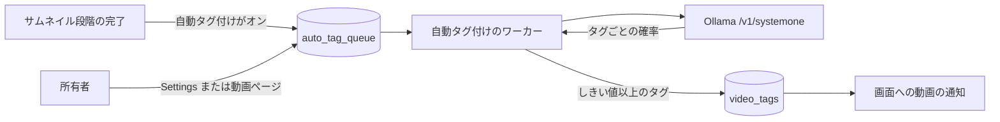
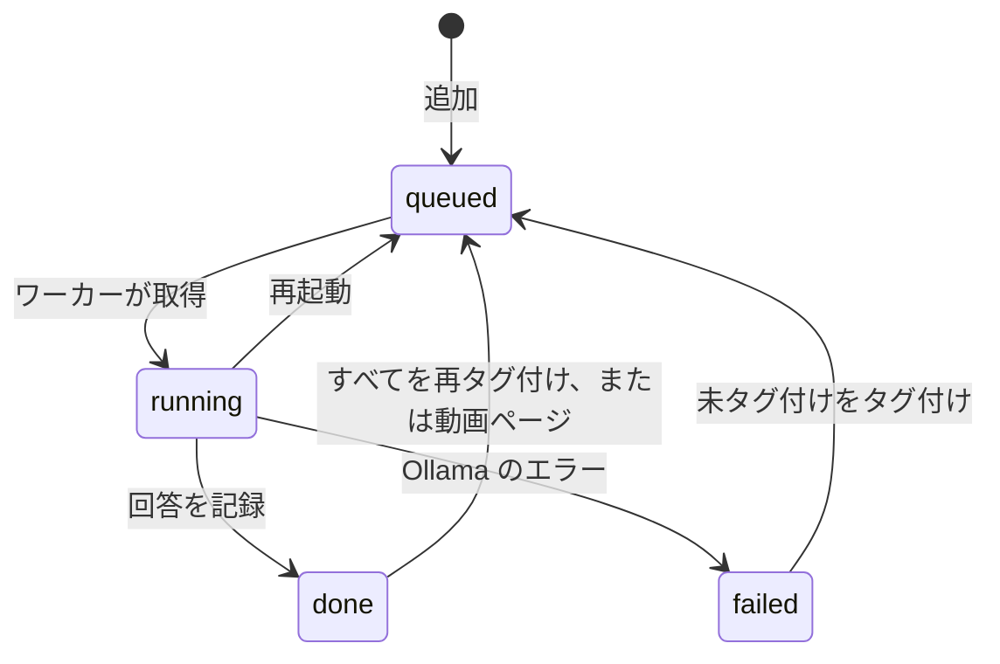

# Ollama 上の Clef 分類器による自動タグ付け {#auto-tagging-with-a-clef-classifier-in-ollama}

VVMDM は、Ollama で動く判定モデル (Cloudflare の Clef または Clef-flash) に、動画に合う既存のタグを問い合わせ、確率がしきい値に達したタグを追加する。ユースケースは [`internal/app/auto_tag.go`](../../internal/app/auto_tag.go)、キューは [`internal/store/auto_tags.go`](../../internal/store/auto_tags.go)、Ollama クライアントは [`internal/clef`](../../internal/clef) にある。

図は、動画が分類器に届く流れと、タグが戻る流れを示す。

## 分類器へのリクエスト {#classifier-request}

既存のタグはそれぞれ 1 つの yes/no (`noul`) の質問になり、動画はサムネイル画像と、タイトル、ファイル名、フォルダを入れた JSON の状態として送る。

Clef はすべての質問を非自己回帰の 1 回の処理で採点し、質問ごとに確率を返すので、1 回のリクエストで最大 64 個のタグに答える。タグがそれより多いライブラリは、同じ画像とともに 64 個ずつに分けて送る。質問はタグの名前を挙げ、その同義語を並べる。仮のタグについては問い合わせない。

| 入力 | 取得元 | ないとき |
| --- | --- | --- |
| 画像 | 取り込みがすでに作ったライブラリのサムネイル (640 px の JPEG) | テキストのみ。サムネイル段階が失敗したか、ファイルがない |
| `title` | 表示名、なければファイルのタイトル | ないことはない |
| `file_name`、`folder` | 代表の所在のパス | ないことはない |

既存のサムネイルを使い回すので、ffmpeg の処理は増えない。GPU のない 4 コアの CPU では、Clef-flash はサムネイル 1 枚に約 100 秒、テキストのみで 25 秒かかる。公表されている GPU での遅延は 0.2 秒未満だ。

## 追加するタグ {#tags-it-adds}

タグは、確率がしきい値 (既定は 0.8) 以上のとき、動画の通常のタグとして追加する。タグは作成しない。

追加したタグは所有者が追加したタグと区別できないので、既存のタグの画面がそれらを外したり統合したりする。既定のしきい値は、誤ったタグを追加するよりタグを見落とす側に寄せている。14 枚の画像での試行では、誤ったタグ 1 つの確率は 0.5 から 0.8 の間だった。

| 採用しなかった案 | 理由 |
| --- | --- |
| モデルの提案からタグを作成する | Clef は与えられた選択肢を採点するだけで、名前を生成しない |
| 追加したタグを仮のタグにする | 仮は新しく作成したタグの状態であり、これらのタグはすでに存在する |

## キューと動画を判定するとき {#queue-and-when-a-video-is-judged}

各動画の内容の鍵は `auto_tag_queue` に 1 行を持ち、その行は判定後も `done` のまま残る。これにより、その動画で自動の判定が繰り返されることはない。

| きっかけ | キューに入れるもの |
| --- | --- |
| サムネイル段階が完了し、"Tag new videos automatically" がオン | 行のない動画 |
| Settings の "Tag videos not yet tagged" | 行がないか、行が `failed` の動画 |
| Settings の "Tag all videos again" | `running` でないすべての動画 |
| 動画ページの "Suggest tags" | その動画。`running` のときを除く |

`done` の行を残すので、所有者が外したタグは、同じ内容の次の取り込みで再び追加されない。1 つのワーカーが一度に 1 本の動画を判定するので、遅い CPU のみの Ollama に、処理できない並列リクエストを送らない。

## 失敗 {#failures}

失敗したリクエストは、その行を Ollama のメッセージとともに `failed` にし、ワーカーは次へ進む。所有者が再びキューに入れるまで、何も再試行しない。

Ollama が止まっていると、キューを塞ぐ代わりに、キューにある動画はすべて数秒以内に失敗し、Settings ページにその件数と最後のメッセージが表示される。終了時にまだ `running` の行は、次の起動時に `queued` に戻る。

## 設定 {#settings}

所有者は Settings の Auto-tagging で、Ollama の URL、モデル、しきい値、自動の判定を設定する。"Save and test connection" はフォームを保存し、保存した URL に質問を 1 つ送る。

サーバーは保存した URL にだけリクエストを送り、リクエスト本文の URL には決して送らない。また、Ollama の JSON 応答のうちエラーの文言だけを伝える。そうしなければ、リクエストによってサーバーに到達可能な任意のアドレスを取得させ、その応答を表示させることができてしまう。

| 設定 | 既定値 |
| --- | --- |
| Tag new videos automatically | オフ |
| Ollama URL | `http://127.0.0.1:11434` |
| Model | `clef-flash` (`clef` は 27B で、より正確) |
| Minimum probability | 0.8 |
