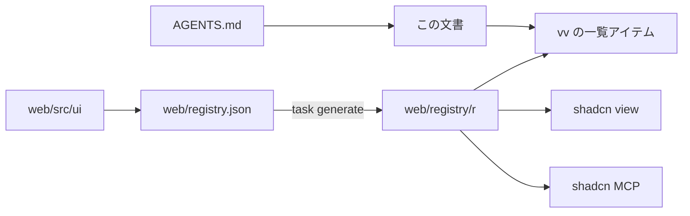

# vv デザインシステム {#vv-design-system}

- 状態: 一部採用。各層の節は、その層を作る変更が書く（[038 計画](../../specs/038-design-system/plan.md#documentation-ownership)）
- 範囲: `web/src` のすべての画面を組み立てる元になるトークン、コンポーネント、ルール、ページパターンと、エージェントとチェックがそこに届く方法

すべての画面は shadcn/ui をもとにした 1 つのデザインシステムから組み立てる。デザインシステムは `web/` に shadcn レジストリとして置かれ、エージェントは shadcn CLI と MCP サーバーを通して読む。

図は各部分の置き場所と、それを読む側を示す。

## レジストリとエージェントの経路 {#registry-and-agent-route}

レジストリはリポジトリの中にビルドされ、パスで読まれる。`web/registry.json` がアイテムを宣言し、`task generate` が `shadcn build` を実行して `web/registry/r/` に出力する。出力はバージョン管理され、手で編集しない。ビルドされたアイテムがソースより古いとき、`task check`（`generate-check`）は失敗する。

shadcn CLI と MCP サーバーはディスク上のレジストリを検索できないので、`vv` アイテムがすべてのアイテム、その層、使う場面の一覧になっている。そこから始める。

| ツール | `web/` からの呼び出し |
| --- | --- |
| CLI | `npx shadcn view ./registry/r/vv.json`、次に `./registry/r/<item>.json` |
| MCP | `view_items_in_registries` に `./registry/r/<item>.json` を渡す。アイテムの説明とファイルを返す |
| ファイルを直接読む | `web/registry/r/<item>.json` |

CLI は各ファイルの内容とアイテムの `docs` 行を出力する。この行は、当てはまる使い方のルールの節を示す。アイテムの一覧、ファイルの配置、チェックは [038 contracts/registry.md](../../specs/038-design-system/contracts/registry.md) で決めている。

エージェントは `AGENTS.md` からここに案内される。公式の shadcn スキルは `.agents/skills/shadcn/` に同梱され、`web/package.json` で固定した CLI を実行する（[VENDORED.md](../../.agents/skills/shadcn/VENDORED.md)）。shadcn MCP サーバーは Claude 向けに `.mcp.json`、Codex 向けに `.codex/config.toml` に登録されている。機能の `ui-design.md` はレジストリのコンポーネントとページパターンを組み合わせ、足りないものは先にデザインシステムに加える。

| 採用しなかった案 | 理由 |
| --- | --- |
| localhost の URL で提供する `@vv` レジストリ | どのエージェントのセッションも先にサーバーを起動しなければならない |
| GitHub のアドレス（`syudead/vv/<item>`） | プッシュ済みのコミットしか見えないので、作業ブランチで加えたコンポーネントは、それを使うエージェントから見えない |

この構成の判断は [038 調査](../../specs/038-design-system/research.md) の R-3、R-4、R-7 にある。

## チェックと例外 {#checks-and-exceptions}

`task check` はデザインシステムの外で書かれたコードで失敗する。ESLint（`task lint-web`）は `web/src` 以下のすべてのファイルを検査するが、テスト（`*.test.ts`、`*.test.tsx`）と `src/testing/` は除く。これらは画面ではなくハーネスを描画する。`eslint-plugin-better-tailwindcss` は `web/src/index.css` からテーマを読み、`className` と、`cn()` と `cva()` の文字列引数を検査する。

| 失敗する対象 | ルール | メッセージ |
| --- | --- | --- |
| `web/src/ui` の外の `<button>`、`<input>`、`<select>`、`<textarea>` | `no-restricted-syntax` | `Use the design-system component (web/registry/rules/components.md).` |
| 任意の値か任意のプロパティを持つクラス、または `(--var)` の短縮記法 | `better-tailwindcss/no-restricted-classes` | `Arbitrary value outside the design-system scale (web/registry/rules/foundations.md).` |
| テーマが生成しないクラス | `better-tailwindcss/no-unknown-classes` | `Unknown class detected: <class>` |
| トークン外の生の色、既定パレットのクラス、最小値を下回るコントラストの組 | `web/src/theme/tokens.test.ts` | テスト自身のメッセージ |

任意のバリアント（`data-[state=open]:`、`has-[...]:`、`max-[49.5rem]:`）は通る。任意の値のルールは最後のバリアントの後のユーティリティだけを検査する。`h-[3px]` と `[overflow-wrap:anywhere]` は失敗し、`data-[state=open]:bg-accent-soft` は通る。

`noInlineConfig` が `eslint-disable` コメントを無効にするので、例外はすべて `web/design-exceptions.js` の項目になる。

| フィールド | 意味 |
| --- | --- |
| `file` | `web/src` 以下のパス。例: `player/VideoPage.tsx` |
| `rules` | その項目が免除する、上の表のルール名 |
| `classes` | 省略可。許可する唯一のクラスを表す正規表現で、それぞれクラス全体と照合する。ない場合、ファイルは `rules` から免除される |
| `kind` | `migration`（そのファイルを移行する PR が削除する）または `special`（残る） |
| `reason` | `special` では必須。デザインシステムでその見た目を表現できない理由 |

`no-restricted-syntax` の免除は生のコントロールの検査だけを外す。同じルールを共有する i18n の検査は引き続き適用される。`classes` は 2 つのクラスのルールにだけ適用される。

一覧は、チェックが入った時点でチェックに違反していたすべてのファイルを `migration` 項目として始まった。それ以降、チェックに違反する新しいファイルは失敗し、各移行 PR は自分のファイルの項目を削除する（[research.md R-9](../../specs/038-design-system/research.md#r-9-screens-migrate-one-area-per-pr-behind-a-shrinking-exception-list)）。`web/src/theme/designExceptions.test.ts`（`task test-web`）は、項目が存在しないファイルを指す、未知のルールを指す、未知の `kind` を持つ、ファイルを重複させる、または `reason` のない `special` である場合に失敗する。

| 採用しなかった案 | 理由 |
| --- | --- |
| 違反箇所ごとの `eslint-disable` コメント | `noInlineConfig` が禁止しており、散らばったコメントは領域ごとに数えることも削除することもできない |
| テストも検査する | テストは画面ではない素の `<button>` ハーネスを描画する。テストを一覧に載せると、どの画面の移行でも削除されない `migration` 項目が残り続ける |

このチェックの判断は [038 調査](../../specs/038-design-system/research.md) の R-8 と R-9 にある。

## 基盤 {#foundations}

[Define the design-system foundations and apply them to the library screen](https://github.com/syudead/vv/issues/769) が書く。

## コンポーネント {#components}

[Rebuild the action and input components on shadcn/ui](https://github.com/syudead/vv/issues/770) が書く。

## ページパターン {#page-patterns}

[Define the page patterns and finish the library screen on them](https://github.com/syudead/vv/issues/772) が書く。
