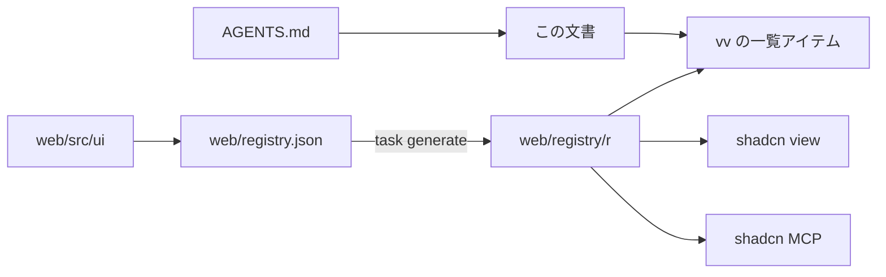
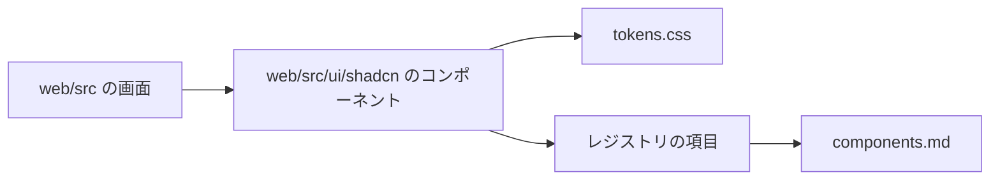
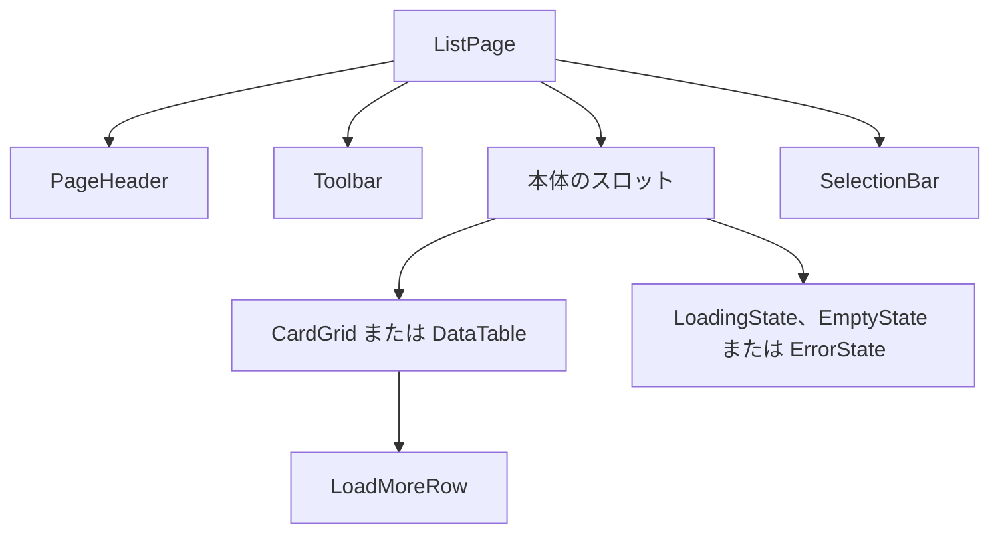

# vv デザインシステム {#vv-design-system}

- 状態: 一部採用。各層の節は、その層を作る変更が書く（[038 計画](../../specs/038-design-system/plan.md#documentation-ownership)）
- 範囲: `web/src` のすべての画面を組み立てる元になるトークン、コンポーネント、ルール、ページパターンと、エージェントとチェックがそこに届く方法

すべての画面は shadcn/ui をもとにした 1 つのデザインシステムから組み立てる。デザインシステムは `web/` に shadcn レジストリとして置かれ、エージェントは shadcn CLI と MCP サーバーを通して読む。

図は各部分の置き場所と、それを読む側を示す。

## レジストリとエージェントの経路 {#registry-and-agent-route}

レジストリはリポジトリの中にビルドされ、パスで読まれる。`web/registry.json` がアイテムを宣言し、`task generate` が `shadcn build` を実行して `web/registry/r/` に出力する。出力はバージョン管理され、手で編集しない。ビルドされたアイテムがソースより古いとき、`task check`（`generate-check`）は失敗する。

shadcn CLI と MCP サーバーはディスク上のレジストリを検索できないので、`vv` アイテムがすべてのアイテム、その層、使う場面の一覧になっている。そこから始める。

| ツール | `web/` からの呼び出し |
| --- | --- |
| CLI | `npx shadcn view ./registry/r/vv.json`、次に `./registry/r/<item>.json` |
| MCP | `view_items_in_registries` に `./registry/r/<item>.json` を渡す。アイテムの説明とファイルを返す |
| ファイルを直接読む | `web/registry/r/<item>.json` |

CLI は各ファイルの内容とアイテムの `docs` 行を出力する。この行は、当てはまる使い方のルールの節を示す。アイテムの一覧、ファイルの配置、チェックは [038 contracts/registry.md](../../specs/038-design-system/contracts/registry.md) で決めている。

エージェントは `AGENTS.md` からここに案内される。公式の shadcn スキルは `.agents/skills/shadcn/` に同梱され、`web/package.json` で固定した CLI を実行する（[VENDORED.md](../../.agents/skills/shadcn/VENDORED.md)）。shadcn MCP サーバーは Claude 向けに `.mcp.json`、Codex 向けに `.codex/config.toml` に登録されている。機能の `ui-design.md` はレジストリのコンポーネントとページパターンを組み合わせ、足りないものは先にデザインシステムに加える。

| 採用しなかった案 | 理由 |
| --- | --- |
| localhost の URL で提供する `@vv` レジストリ | どのエージェントのセッションも先にサーバーを起動しなければならない |
| GitHub のアドレス（`syudead/vv/<item>`） | プッシュ済みのコミットしか見えないので、作業ブランチで加えたコンポーネントは、それを使うエージェントから見えない |

この構成の判断は [038 調査](../../specs/038-design-system/research.md) の R-3、R-4、R-7 にある。

## チェックと例外 {#checks-and-exceptions}

`task check` はデザインシステムの外で書かれたコードで失敗する。ESLint（`task lint-web`）は `web/src` 以下のすべてのファイルを検査するが、テスト（`*.test.ts`、`*.test.tsx`）と `src/testing/` は除く。これらは画面ではなくハーネスを描画する。`eslint-plugin-better-tailwindcss` は `web/src/index.css` からテーマを読み、`className` と、`cn()` と `cva()` の文字列引数を検査する。

| 失敗する対象 | ルール | メッセージ |
| --- | --- | --- |
| `web/src/ui` の外の `<button>`、`<input>`、`<select>`、`<textarea>`、`<table>`、`<dialog>` | `no-restricted-syntax` | `Use the design-system component (web/registry/rules/components.md).` |
| `web/src/ui` の外の `role="button"` | `no-restricted-syntax` | `Use the design-system Button (web/registry/rules/components.md).` |
| `web/src/ui` の外で `style` に書いた固定値（リテラル）。`style` は実行時にわかる値にだけ使う | `no-restricted-syntax` | `A fixed value in style bypasses the design-system scale. …` |
| `web/src/ui` の外での `radix-ui` または `@radix-ui/*` からのインポート | `no-restricted-syntax` | `Use the design-system components in web/src/ui/shadcn instead of Radix directly.` |
| `web/src/ui/shadcn` の外の `outline-none`、`outline-hidden`、または `focus`、`focus-visible`、`focus-within` のいずれかのバリアントの下にある `ring` か `outline` のクラス | `better-tailwindcss/no-restricted-classes` | `Keep the shared focus ring (web/src/index.css :focus-visible); never remove it or add your own (web/registry/rules/components.md, Focus).` |
| 任意の値か任意のプロパティを持つクラス、または `(--var)` の短縮記法 | `better-tailwindcss/no-restricted-classes` | `Arbitrary value outside the design-system scale (web/registry/rules/foundations.md).` |
| テーマが生成しないクラス。尺度の外の段階（`p-7`、`text-2xl`、`rounded-xl`、`font-bold`）を含む | `better-tailwindcss/no-unknown-classes` | `Unknown class detected: <class>` |
| トークン外の生の色、既定パレットのクラス、最小値を下回るコントラストの組 | `web/src/theme/tokens.test.ts` | テスト自身のメッセージ |

任意のバリアント（`data-[state=open]:`、`has-[...]:`、`max-[49.5rem]:`）は通る。任意の値のルールは最後のバリアントの後のユーティリティだけを検査する。`h-[3px]` と `[overflow-wrap:anywhere]` は失敗し、`data-[state=open]:bg-primary-soft` は通る。

`noInlineConfig` が `eslint-disable` コメントを無効にするので、例外はすべて `web/design-exceptions.js` の項目になる。

| フィールド | 意味 |
| --- | --- |
| `file` | `web/src` 以下のパス。例: `player/VideoPage.tsx` |
| `rules` | その項目が免除する、上の表のルール名 |
| `classes` | 省略可。許可する唯一のクラスを表す正規表現で、それぞれクラス全体と照合する。ない場合、ファイルは `rules` から免除される |
| `kind` | `special`（残る）。`migration` は画面の移行を待つファイルを示していたが、もう受け付けない |
| `reason` | `special` では必須。デザインシステムでその見た目を表現できない理由 |

`no-restricted-syntax` の免除は生のコントロールの検査だけを外す。同じルールを共有する i18n の検査は引き続き適用される。`classes` は 2 つのクラスのルールにだけ適用される。

一覧は、チェックが入った時点でチェックに違反していたすべてのファイルを `migration` 項目として始まった。それ以降、チェックに違反する新しいファイルは失敗し、各移行 PR は自分のファイルの項目を削除する（[research.md R-9](../../specs/038-design-system/research.md#r-9-screens-migrate-one-area-per-pr-behind-a-shrinking-exception-list)）。すべての画面が移行した後、最後の単位が残りの `migration` 項目を削除したので、一覧には `special` 項目だけがある。`web/src/theme/designExceptions.test.ts`（`task test-web`）は、項目が存在しないファイルを指す、未知のルールを指す、`migration` 項目であるかほかの未知の `kind` を持つ、ファイルを重複させる、または `reason` のない `special` である場合に失敗する。

| 採用しなかった案 | 理由 |
| --- | --- |
| 違反箇所ごとの `eslint-disable` コメント | `noInlineConfig` が禁止しており、散らばったコメントは領域ごとに数えることも削除することもできない |
| テストも検査する | テストは画面ではない素の `<button>` ハーネスを描画する。テストを一覧に載せると、どの画面の移行でも削除されない `migration` 項目が残り続ける |

このチェックの判断は [038 調査](../../specs/038-design-system/research.md) の R-8 と R-9 にある。

## 基盤 {#foundations}

すべての視覚値は `web/src/ui/tokens.css` の `@theme` にあるトークン（レジストリの項目 `vv-theme`）であり、画面はそこから生成されるユーティリティクラスだけを使う。vv は暗い無彩色の面を保ち、シアンを唯一の操作の色とし、shadcn/ui のフラットなスタイルに従う。枠線は細く、グラデーションはなく、影は浮いているレイヤーにだけ付ける。どこでどのトークンを使うかは [foundations.md](../../web/registry/rules/foundations.md)（項目 `vv-rules`）にある。

色のトークンは shadcn/ui の意味に基づく名前を使うので、上流のコンポーネントのコードは名前を変えずに済む。それに加えて、shadcn にない vv 独自の役割を持つ。

| トークン | 役割 |
| --- | --- |
| `navbar`、`background`、`muted`、`card`、`popover` | 5 つの面。暗い順。どの 2 つも同じには見えない |
| `foreground`、`muted-foreground`（と各面の `-foreground`） | 本文と補助の文字。文字の灰色は 2 つで足りる |
| `secondary`、`accent` | 補助の塗りとホバー中の行。`accent` は shadcn のホバーの役割であり、ブランドの色ではない |
| `primary`、`primary-hover`、`primary-active`、`primary-foreground`、`primary-soft` | シアン。主な操作、選択、進行 |
| `border`、`input`、`ring` | 区切り線、コントロールの縁、キーボードフォーカス |
| `destructive`、`warning`、`success`（それぞれ `-foreground` と `-soft` を伴う）、`destructive-strong` | 状態。必ず言葉とアイコンを伴う |
| `favorite`、`overlay` | お気に入りのハートだけ。唯一の半透明の色で、ダイアログの背後とサムネイルの上に使う |

値は 6 桁の 16 進数なので、`web/src/theme/tokens.test.ts` はすべての面の上の文字と枠線の組をすべて確かめられる。暗色のセットは 1 つだ（[library-ui.md、Dark scheme only](library-ui.md#dark-scheme-only-without-a-lightdark-switch)）。トークンを専用のファイルに置くのは、`shadcn add` が上流のテーマの変数を `index.css` に書き込み、そこでは生の色の走査がそれらを失敗にするからだ。

尺度は閉じている。

| 尺度 | 段階 |
| --- | --- |
| 文字 | `text-2xs`（サムネイルの文字）から `text-xl`（ページタイトル）までの 6 段階。`font-normal`、`font-medium`、`font-semibold` |
| 余白と寸法 | 1 つの 4px の尺度（`0` から `16`。コントロールの高さに `9`）と、名前付きのレイアウトの段階（`navbar`、`sidebar`、`card-0` から `card-3`、一覧の列、履歴の行のサムネイルの列、一覧ページの横の列、ポップオーバーとコンボボックスの幅） |
| 角丸 | `sm`、`md`、`lg`、`full` |
| 影 | `shadow-card-hover`、`shadow-elevated`、`drop-shadow-mark`。静止した面には付けない |
| 動き | `fade-in`、`pop-in`、`slide-up`、および読み込み用の `shimmer`、`spin`、`pulse`。動きを減らす設定では無効 |

ライブラリは動画ページより密だ。コントロールは `h-8`、コントロールの間は `gap-2`、カードの間は `gap-3`、本文は `text-sm` で、動画ページではそれぞれ `h-9`、`gap-3`、`gap-4`、`text-base` だ。

尺度はテーマ自体が閉じている。`tokens.css` はまず各尺度について Tailwind の既定の名前空間（`--color-*`、`--text-*`、`--font-weight-*`、`--spacing` と `--spacing-*`、`--radius-*`、`--shadow-*`、`--drop-shadow-*`、`--animate-*`）をリセットし、その後尺度の段階だけを定義する。そのため段階の外のもの（`p-7`、`gap-2.5`、`text-2xl`、`rounded-xl`、`font-bold`、`bg-red-500`）は生成されず、未知のクラスとして失敗する。分数、`full`、`auto`、`px`、コンテナの幅（`max-w-md`）はリセットする名前空間に含まれないので、引き続き使える。リセットは `tw-animate-css` の出現と退出のアニメーションも取り除くので、浮遊レイヤーは `animate-pop-in` で開く。

移行中は、以前のトークン名（`surface`、`fg-muted`、`link` など）が新しい名前の `var()` の別名であり、`no-restricted-classes` のパターンが尺度の外の段階を失敗させていた。どちらもリセットとともになくなった。シアンの `accent` はすべての箇所で一度に `primary` へ改名した。shadcn は `accent` をホバーの塗りに使うからだ。

| 採用しなかった案 | 理由 |
| --- | --- |
| vv の名前（`surface`、`fg-muted`）を保つ | 後から追加する shadcn/ui のコンポーネントをすべて手で書き換えることになる |
| shadcn の既定と同じ oklch の値 | コントラストのテストは 16 進数だけを解析する |
| shadcn の既定と同じ白い主ボタン | シアンはブランドの操作の色だ |

基盤の判断は [038 調査](../../specs/038-design-system/research.md) の R-5 と R-8、および [038 UI 設計、Foundations](../../specs/038-design-system/ui-design.md#foundations) にある。

## コンポーネント {#components}

すべてのコントロールは radix ベースの shadcn/ui のコンポーネントであり、上流が付けるファイル名（`button.tsx`）のまま `web/src/ui/shadcn` に置き、レジストリの項目を通して読む。`components.json` は shadcn の `ui` エイリアスをそのフォルダに向けるので、`shadcn add` はそこに書く。構造とバリアントは上流のものであり、変わるのは色、角丸、高さだけで、それもトークンを通して変える。それぞれをいつ使うか、何と組み合わせるか、いつ使わないかは [components.md](../../web/registry/rules/components.md)（項目 `vv-rules`）にある。

| コンポーネント | 項目 | 置き換えるもの |
| --- | --- | --- |
| `Button`（`default`、`secondary`、`outline`、`ghost`、`destructive`、`ghost-destructive`、`link`。サイズは `sm`、`default`、`lg`、`icon-sm`、`icon`） | `button` | `ui/Button`、`ui/IconButton` |
| `Input`、`Textarea`、`Label`、`Field` | `input`、`textarea`、`label`、`field` | 生の `<input>` と `<textarea>` |
| `Select`、`RadioGroup` | `select`、`radio-group` | 生の `<select>`、並び替えのラジオの列 |
| `Checkbox`、`Switch` | `checkbox`、`switch` | `ui/Checkbox` |
| `Toggle`、`ToggleGroup` | `toggle`、`toggle-group` | `ui/FilterChip`、`ui/SegmentedControl` |
| `Slider` | `slider` | ズームのスライダー |
| `Combobox`（ポップオーバー内の `Command`）、`Command` | `combobox`、`command` | `ui/Combobox` |

図は、画面がどのようにコンポーネントとその規則にたどり着くかを示す。

コンポーネントは 3 つの振る舞いを共有するので、画面がそれらのスタイルを変えることはない。

| 振る舞い | 方法 |
| --- | --- |
| キーボードフォーカス | すべてのコンポーネントに共通の 1 つのリング、`web/src/index.css` の `:focus-visible` のアウトライン。上流のコンポーネントごとの `ring-[3px]` と `ring-3` は外す。メニュー、セレクト、コマンドリストの行は、代わりに `accent` の塗りでフォーカスを示す |
| 選択中と押下中 | `primary-soft` の塗りに `primary` の文字（`Toggle`、`ToggleGroup`）、または `primary` の塗り（`Checkbox`、`Switch`、`RadioGroup`） |
| 密度 | ライブラリの密度の画面は `sm` と `icon-sm`（`h-8`）を使い、動画ページは `default` と `lg` を使う |

上流に対する 5 つの変更が、チェックとカタログの規則を保つ。`Checkbox` は `indeterminate` の状態を描き、`Slider` は `aria-label` をフォーカスを受けるつまみに渡し、`CommandGroup` は見出しを包むことでスタイルを付け（上流が使う属性セレクターは任意値だからだ）、`CommandInput` は上流の `outline-hidden` を外して行より低くし、共通のフォーカスリングが `Command` の中で欠けずに見えるようにする。さらに `CommandInput` は入力欄を囲む枠のクラスと入力欄の後に置く要素を受け取り、vv の `TagCommand` が処理中のスピナーを内側に持つ小さな入力欄を描けるようにする。`Button` には上流にない変種 `ghost-destructive` も 1 つある。`ghost` の形に `destructive` の文字色と `destructive-soft` のホバーを合わせたもので、メニューの破壊的な項目のボタン版であり、メニューの外に置かれて `ConfirmDialog` を開く 1 つの破壊的な操作に使う。`Select` と `Combobox` は Radix の位置の変数（`--radix-select-*`、`--radix-popover-*`）を読む。それらのクラスは `web/design-exceptions.js` の `special` の項目である。

この層は既存の画面を変えなかった。古いコンポーネントは、画面の移行が最後の使用箇所を置き換えるまで `web/src/ui` の元のパスに残り、最後の単位がどこからも import されていないものを削除した。動画ページのタグ名の入力欄とタグ管理画面の統合先の一覧は、古い `ui/Combobox` から vv のコンポーネント `TagCommand`（タグ名の規則を持つ `Command` で、選択バーのタグのポップオーバーも使う）に移り、`ui/Combobox` は削除された。新しいコンポーネントは専用のフォルダに置くので、ファイル名が古いものと大文字小文字だけで異なることはない。古いコンポーネントはレジストリの項目ではなく、新しいコードは `web/src/ui/shadcn` から import する。

ショーケース（`/design-system`）は、各コンポーネントをバリアントと状態ごとに並べる。状態は通常、ホバー、キーボードフォーカス、押下中、選択中、無効である。状態はポインターなしで、コンポーネントを囲む要素の `data-demo-state` 属性によって描かれる。`web/src/index.css` はこの属性を Tailwind の `hover`、`focus`、`focus-visible`、`active` のバリアントに加え、フォーカスリングをその要素の最初の子に描く。画面はこの属性を設定しない。

| 採用しなかった案 | 理由 |
| --- | --- |
| 新しいコンポーネントに vv のファイル名（`Button.tsx`）を保つ | `shadcn add` は上流の名前で書くので、以後の更新のたびに手で名前を変えることになる |
| この層で古いコンポーネントを脇へ移し、ライブラリ画面を新しいものに切り替える | メンテナーは既存の画面をそれぞれの移行まで変えずに保つ |
| コンポーネントのスタイルを変えて古いものと同じ見た目にする | コンポーネントは新しい画面のためのものであり、古い見た目は画面の移行が置き換える |
| 上流のような、コンポーネントごとのフォーカスリング | 各コンポーネントが共通のアウトラインと異なる自分の複製を持つことになり、任意値の `ring-[3px]` はチェックで失敗する |

### オーバーレイとフィードバック、vv のコンポーネント {#overlays-and-feedback-and-vv-components}

これらは Radix ベースの shadcn/ui のコンポーネントであり、上流の構造とバリアントのまま取り込み、基盤のトークンを通してだけ装いを変える。vv 独自のコンポーネントも同じ形に従う。それぞれは `registry:ui` の項目であり、その `docs` は [components.md](../../web/registry/rules/components.md) の節を指す。その節は、何のためのものか、何と組み合わせるか、いつ使わないかを述べる。これらは新しい画面のための新しいコンポーネントである。メンテナーがショーケースでこの層を承認し、各画面が移行するまで、既存の画面は今のコンポーネントを使い続ける。

| コンポーネント | 置き換える予定のもの | 備考 |
| --- | --- | --- |
| `Dialog`、`AlertDialog` | `ModalFrame` | `AlertDialog` は取り消せない操作を確認する |
| `Popover`、`DropdownMenu`、`Tooltip`、`Tabs` | `Popover`、`Menu`、`Tooltip`、`Tabs` | 層の位置は Radix が決める |
| `Sonner` | `Toast` | すべての画面がこれを使う。`ui/Toast` は同時に表示する数を制限するキューだけを保つ |
| `Badge` | `Chip`、タグのチップ、件数 | 上流のバリアントに `soft`、`warning`、`success` を加える |
| `Skeleton`、`Progress`、`Spinner` | `Skeleton`、スキャンと視聴のバー | `Skeleton` はきらめき、`Progress` は `max` を受け取る |
| `Alert`、`Empty` | 停滞の警告、自動再生の通知、インラインのエラー、空の状態のブロック | `Alert` は `warning` と `success` を加える |
| `Separator`、`Kbd`、`Breadcrumb` | 区切り線、検索のキー、フォルダのパス | |
| `Sidebar`（`Sheet` と組み合わせる） | `shell/Sidebar` | 640px 以上ではアイコンのレール、640px 未満ではドロワー |
| `VideoThumbnail`、`FavoriteToggle`、`TentativeMark`、`ScrubPreview`、`ThumbnailBackdrop`、`BrandHomeLink` | カードと行のサムネイルのマークアップ、以前の `videoList/FavoriteToggle` | vv のコンポーネント |
| `TagCommand` | `ui/Combobox`、選択バーの以前の `library/TagCommand` | vv のコンポーネント。タグ名の規則を持つ `Command` |

shadcn のコンポーネントは、上流のケバブケースの名前（`dropdown-menu.tsx`）で `web/src/ui/shadcn` に、操作と入力のコンポーネントと並べて置く。上流と同じく、`Dialog` と `Sheet` は `ghost`、`icon-sm` の `Button` で閉じ、`AlertDialogAction` と `AlertDialogCancel` は `Button`（既定は `sm`）であり、`SidebarTrigger` は `Button`、`SidebarInput` は `Input` である。vv のコンポーネントは PascalCase の名前のまま `web/src/ui` に置く。`FavoriteToggle` の `page` 形式は `Tooltip` 付きの `Toggle` である。

上流の 3 つのクラスのパターンは、Radix が実行時に計算する値か、どのユーティリティも名前を持たない値を読む。浮かぶ層の変形の原点と利用できる高さ、そして `Alert` のアイコンの列である。これらは `web/design-exceptions.js` の `special` の項目である。

| 採用しなかった案 | 理由 |
| --- | --- |
| コンポーネントのスタイルを変えて、置き換える対象と同じ見た目にする | コンポーネントは新しい画面を作るためのものであり、古い見た目を繰り返すためのものではない |
| 古いコンポーネントを脇へ移し、新しいものが今その名前を引き継ぐ | この層が承認される前に、すべての画面の import が変わってしまう |
| 上流のような、別の `sidebar-*` の色トークン | サイドバーは、すでに持っていた役割である `navbar`、`accent`、`secondary` を使う |

コンポーネントの背後にある判断は [038 UI design, Components](../../specs/038-design-system/ui-design.md#components) にある。

## ページパターン {#page-patterns}

すべての画面は 3 つの層で作り、それらは `web/src/ui/patterns` に置く。余白、最大幅、領域の間の間隔は最初の 2 つの層に属するので、画面がそれらを書くことはない。画面はスロットに内容を渡すだけである。どの雛形を選ぶか、各スロットに何を入れ、何を入れてはならないかは [patterns.md](../../web/registry/rules/patterns.md)（項目 `vv-rules`）にある。

| 層 | 何であるか | レジストリ |
| --- | --- | --- |
| ページの雛形 | `ListPage`、`AdminTablePage`、`SettingsPage`、`DetailPage`、`CenteredForm`、`FormDialog`、`ConfirmDialog`。ページの領域、その順序、外側の余白、最大幅、領域の間の間隔 | `registry:ui`、それぞれ 1 項目 |
| セクション | `PageHeader`、`Toolbar`、`PageSection`、`FormRow`、`FactList`、`CardGrid`、`DataTable`、`GroupedList`、`JumpList`、`SelectionBar`。領域を埋める部品と、その行の余白と内側の間隔 | `registry:ui`、それぞれ 1 項目 |
| 状態 | `LoadingState`、`EmptyState`、`ErrorState`、`LoadMoreRow`。本体がデータの代わりに、またはデータの後に示すもの | `registry:ui`、それぞれ 1 項目 |

各雛形には例のブロック（`list-page-example` など、加えて `list-states-example`）もある。雛形、そのセクションとコンポーネントを組み合わせた動作する構成であり、i18n カタログのサンプルデータで埋めてある。新しい画面を作るエージェントはブロックを複製し、文言とデータを置き換える。ブロックは `web/src/designSystem/blocks` にあり、ショーケースが描画するのはこれである。

図は一覧ページの組み立て方を示す。

雛形とセクションは 4 つの振る舞いを共有する。

| 振る舞い | 方法 |
| --- | --- |
| 余白 | パターンの中で固定する。パターンは `className` を受け取らないので、画面はそれを上書きできない |
| 密度 | `DetailPage` は視聴の密度を与え、その下では `PageSection` と `FactList` が `p-4` の行と `text-base` に切り替わる。ほかの雛形はすべてライブラリの密度である |
| その場の状態 | 状態のブロックはデータと同じ本体のスロットに入るので、ヘッダーとツールバーは動かない（[038 UI design, States](../../specs/038-design-system/ui-design.md#states)） |
| 端がそろう | `CardGrid` は列を本体の幅まで伸ばす（`card-*` の段階に対する `auto-fill`）ので、ツールバー、件数の行、グリッドは両端を共有する |

`CardGrid` は列のテンプレートを `style` で渡す。名前付きの段階から作るテンプレートは、チェックにとって任意値だからだ。段階は引き続き `tokens.css` から来る。`DetailPage` の脇の領域は名前付きの段階 `detail-aside`（`xl` からは `detail-aside-wide`）である。`ListPage` の任意の脇の領域は `lg` からの列 `list-aside` で、名前付きのユーティリティ `grid-cols-list-aside` で配置し、上部バーの下に貼り付いている間は `list-aside-max` を上限とする。動画ページのプレーヤーの枠は、`@theme inline` ブロックで宣言した名前付きの段階（`player-width`、`player-height`、`aspect-player`）から自身の大きさを決める。これらの値は実行時に枠から動画の縦横比を読み、`:root` ではなく要素の上で解決しなければならないからだ。`DataTable` は shadcn/ui の `Table` の上に作り、この層はそれを `table` 項目として加える。

ショーケース（`/design-system`）は、すべての例のブロック、各状態の一覧ページ、ボタンの後ろにあるダイアログを描画するので、メンテナーはパターンを 1440px と 390px で確認する。

| 採用しなかった案 | 理由 |
| --- | --- |
| 今の画面から抽出したパターン | メンテナーは新しい画面を作るためのレシピを求めた。その後、画面の移行が各画面をそれらに移す |
| 雛形とセクションのコンポーネントなしの、ブロックだけ | どの複製も自分の余白と間隔を持つことになり、画面は再びばらばらになる |
| パターンの `className` という逃げ道 | パターンが固定するために存在する余白を、画面が変えられてしまう |
| この層でライブラリ画面をパターンの上に作る | メンテナーは既存の画面をそれぞれの移行まで変えずに保つ |
