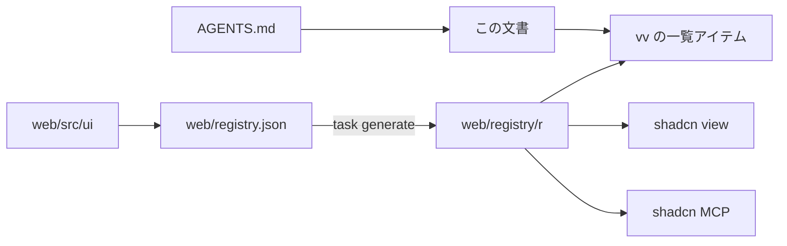

# vv デザインシステム {#vv-design-system}

- 状態: 一部採用。各層の節は、その層を作る変更が書く（[038 計画](../../specs/038-design-system/plan.md#documentation-ownership)）
- 範囲: `web/src` のすべての画面を組み立てる元になるトークン、コンポーネント、ルール、ページパターンと、エージェントとチェックがそこに届く方法

すべての画面は shadcn/ui をもとにした 1 つのデザインシステムから組み立てる。デザインシステムは `web/` に shadcn レジストリとして置かれ、エージェントは shadcn CLI と MCP サーバーを通して読む。

図は各部分の置き場所と、それを読む側を示す。

## レジストリとエージェントの経路 {#registry-and-agent-route}

レジストリはリポジトリの中にビルドされ、パスで読まれる。`web/registry.json` がアイテムを宣言し、`task generate` が `shadcn build` を実行して `web/registry/r/` に出力する。出力はバージョン管理され、手で編集しない。ビルドされたアイテムがソースより古いとき、`task check`（`generate-check`）は失敗する。

shadcn CLI と MCP サーバーはディスク上のレジストリを検索できないので、`vv` アイテムがすべてのアイテム、その層、使う場面の一覧になっている。そこから始める。

| ツール | `web/` からの呼び出し |
| --- | --- |
| CLI | `npx shadcn view ./registry/r/vv.json`、次に `./registry/r/<item>.json` |
| MCP | `view_items_in_registries` に `./registry/r/<item>.json` を渡す。アイテムの説明とファイルを返す |
| ファイルを直接読む | `web/registry/r/<item>.json` |

CLI は各ファイルの内容とアイテムの `docs` 行を出力する。この行は、当てはまる使い方のルールの節を示す。アイテムの一覧、ファイルの配置、チェックは [038 contracts/registry.md](../../specs/038-design-system/contracts/registry.md) で決めている。

エージェントは `AGENTS.md` からここに案内される。公式の shadcn スキルは `.agents/skills/shadcn/` に同梱され、`web/package.json` で固定した CLI を実行する（[VENDORED.md](../../.agents/skills/shadcn/VENDORED.md)）。shadcn MCP サーバーは Claude 向けに `.mcp.json`、Codex 向けに `.codex/config.toml` に登録されている。機能の `ui-design.md` はレジストリのコンポーネントとページパターンを組み合わせ、足りないものは先にデザインシステムに加える。

| 採用しなかった案 | 理由 |
| --- | --- |
| localhost の URL で提供する `@vv` レジストリ | どのエージェントのセッションも先にサーバーを起動しなければならない |
| GitHub のアドレス（`syudead/vv/<item>`） | プッシュ済みのコミットしか見えないので、作業ブランチで加えたコンポーネントは、それを使うエージェントから見えない |

この構成の判断は [038 調査](../../specs/038-design-system/research.md) の R-3、R-4、R-7 にある。

## チェックと例外 {#checks-and-exceptions}

[Fail lint on raw controls, arbitrary values and unknown Tailwind classes](https://github.com/syudead/vv/issues/768) が書く。

## 基盤 {#foundations}

[Define the design-system foundations and apply them to the library screen](https://github.com/syudead/vv/issues/769) が書く。

## コンポーネント {#components}

[Rebuild the action and input components on shadcn/ui](https://github.com/syudead/vv/issues/770) が書く。

## ページパターン {#page-patterns}

[Define the page patterns and finish the library screen on them](https://github.com/syudead/vv/issues/772) が書く。
