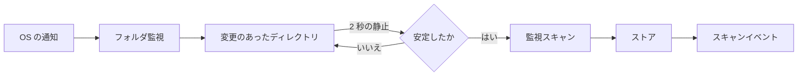
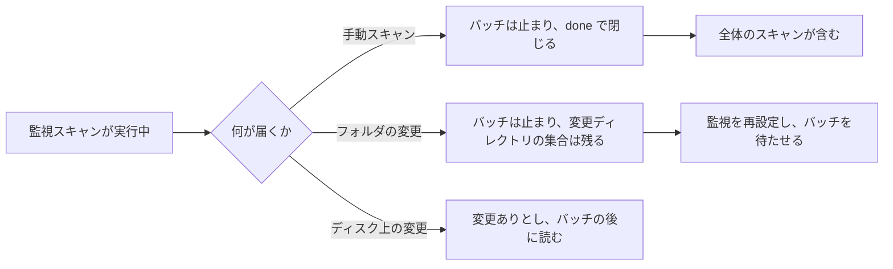

# フォルダの監視: 変更のあったメディアフォルダの取り込み {#folder-watching-importing-changed-media-folders}

VVMDM は、メディアフォルダでファイルが追加、削除、移動、名前変更されたことをオペレーティングシステムの変更通知から知り、変更のあったディレクトリだけを読み直すので、手動のスキャンなしでライブラリが追従する ([`internal/app/auto_import.go`](../../internal/app/auto_import.go))。背景: [specs/042-folder-watch-import/](../../specs/042-folder-watch-import/plan.md) (親 Issue #786)。変更がない間はメディアフォルダを何も読まず、全体のスキャンは手動のままだ。

図は 1 つの変更が通知からライブラリに届くまでの経路を示す。

## 監視はディレクトリを報告する {#the-watcher-reports-directories}

[`internal/watcher`](../../internal/watcher) は各メディアフォルダの下のすべてのディレクトリに fsnotify の監視を 1 つずつ置き、ディレクトリエントリだけを読み、変更をディレクトリと再帰フラグとして報告する。スキャナが飛ばすディレクトリ (名前が `.` で始まるもの、`@eaDir`、`#recycle`、`lost+found`) とシンボリックリンクには監視を置かない。

| イベント | 報告するディレクトリ |
| --- | --- |
| ファイルが作成、書き込み、削除、名前変更された | その親。再帰しない |
| ディレクトリが作成、削除、名前変更された | そのディレクトリ自身。再帰する |

作成されたディレクトリは報告の前に監視されるので、その中に先に書き込まれたファイルは再帰の報告に含まれる ([R-2](../../specs/042-folder-watch-import/research.md#r-2-a-change-marks-a-directory-dirty-and-only-dirty-directories-are-re-read))。

## バッチは静止と安定したファイルを待つ {#a-batch-waits-for-quiet-and-for-settled-files}

`AutoImport` は変更のあったディレクトリを保持し、最後の報告の 2 秒後にバッチを始める。始める前に、最新のファイルの変更が 10 秒より新しいディレクトリは変更ありのまま残り、その時間が過ぎたら再び確認するので、コピー中のファイルは読まれない ([R-3](../../specs/042-folder-watch-import/research.md#r-3-a-batch-waits-for-quiet-imports-settled-files-then-removes))。

バッチは起点が `watch` のスキャンだ。スキャナは変更のあったディレクトリだけを読み、すべての追加を削除より先に書き、その中にある場所だけを削除するので、変更のあった 2 つのディレクトリの間で移動したファイルは、動画、タグ、再生位置を保つ ([R-4](../../specs/042-folder-watch-import/research.md#r-4-a-watch-batch-is-a-scan-row-with-origin-watch))。

## 手動スキャンやフォルダの変更はバッチに取って代わる {#a-manual-scan-or-a-folder-change-supersedes-a-batch}

手動スキャンを始めるか、メディアフォルダを追加、置換、削除すると、実行中のバッチは次のファイルで止まり、何も削除せず、`done` で閉じる。どれかのスキャンが実行中に届いた変更は、そのスキャンが終わった後に読む。実行中のバッチは、デスクトップの終了確認ではアプリをビジー状態にしない ([R-5](../../specs/042-folder-watch-import/research.md#r-5-a-manual-scan-or-a-media-folder-change-supersedes-a-watch-batch))。

## 設定と監視の状態 {#setting-and-watch-state}

`settings.library.auto_import` は `true` か `false` を保持し、キーがなければ有効だ。有効にすると監視を設定し、スキャンは始めない。無効にすると、すべての監視を外し、変更ディレクトリの集合を捨て、実行中のバッチを止める ([R-7](../../specs/042-folder-watch-import/research.md#r-7-the-setting-is-a-stored-key-that-defaults-to-on))。

| 監視の状態 | 意味 |
| --- | --- |
| `off` | 無効、またはメディアフォルダがない |
| `starting` | 監視を追加している |
| `active` | すべてのディレクトリを監視している |
| `limited` | 問題が記録されている: 監視の上限、失われたイベント、到達できないフォルダ、権限 |

問題は表示するだけで、スキャンでは修復しない ([R-6](../../specs/042-folder-watch-import/research.md#r-6-lost-events-and-watch-limits-are-reported-never-repaired-by-a-scan))。自動取り込みを無効にして有効にし直したとき、メディアフォルダが変わったとき、または失われたイベントについては、手動スキャンが `done` で終わり、かつそのスキャンの開始後に新たな損失が報告されていないときに解消する。スキャンの実行中に報告された損失は、スキャンがすでに影響のあるディレクトリを読んでいるかもしれないので、`limited` のまま表示される。次の手動スキャンがそれを解消する。

| 採用しなかった案 | 理由 |
| --- | --- |
| ツリーの定期的な再読み込み | 何も変わっていない間もメディアフォルダを読む |
| 変更のたびにメディアフォルダ全体を読み直す | それは全体のスキャンで、手動のままにする |
| 問題を見つけたらスキャンを始める | ツリー全体をいつ読むかは所有者が決める |
