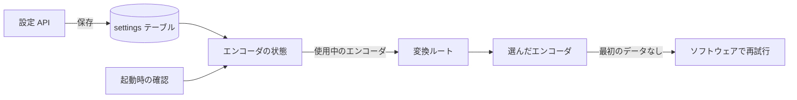
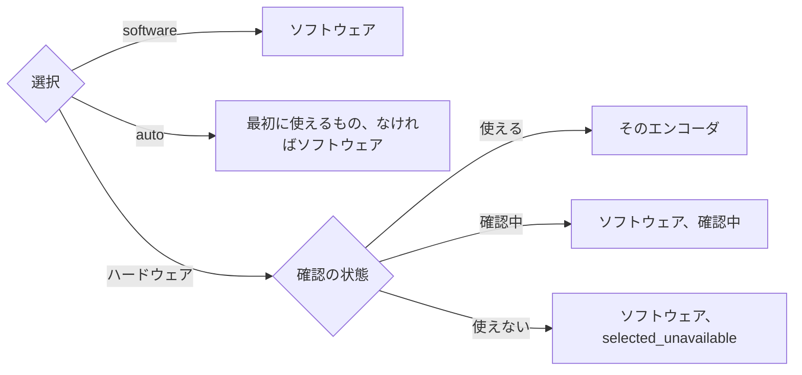
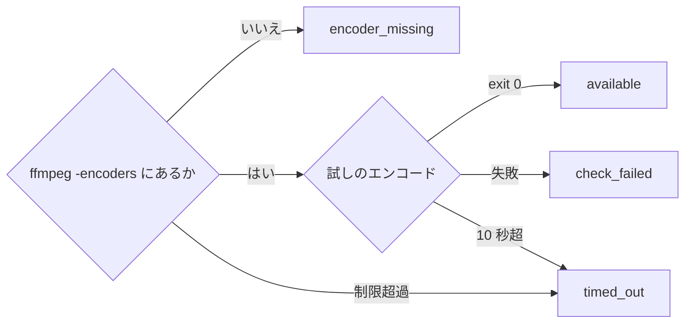
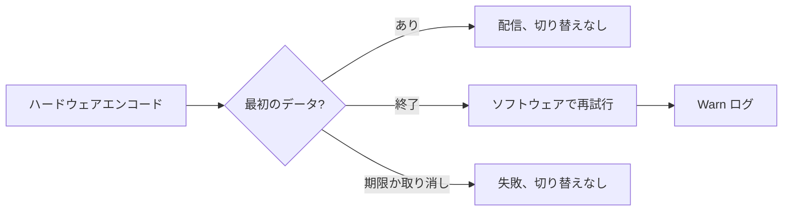

# ライブ変換のハードウェアエンコード {#hardware-encoding-for-live-transcoding}

所有者はライブ変換 (`GET /api/videos/{id}/transcode.mp4`) の動画エンコーダを選ぶ。起動時の確認がどのハードウェアエンコーダが動くかを決め、失敗したエンコーダはそのリクエストの中でソフトウェアに切り替わる ([`internal/app/transcode_settings.go`](../../internal/app/transcode_settings.go))。背景: [specs/025-hardware-encoding/](../../specs/025-hardware-encoding/plan.md) (親 Issue #370)。ライブ変換の開始は [live-transcode-seek.md](live-transcode-seek.md) に、MOV の入力は [mov-live-transcoding.md](mov-live-transcoding.md) にある。

保存された選択と確認の結果が使用中のエンコーダを決め、各変換リクエストはそれをメモリから読む。

## エンコーダと使用中のエンコーダ {#encoders-and-the-encoder-in-use}

使用中のエンコーダは、所有者の選択と起動時の確認結果から決まる。確認済みで使えるもの以外はソフトウェアになる。

GPU はエンコードの CPU 負荷を下げるが、ffmpeg のビルドに含まれるエンコーダでも、デバイスやドライバがなければ使えない (同梱の Docker イメージの中、`/dev/dri` への権限がない場合、NVIDIA のライブラリがない場合)。

選択は `software`、`nvenc`、`qsv`、`vaapi`、`videotoolbox`、`auto` のいずれかで、SQLite の `settings` テーブルの `transcode.video_encoder` に保存する。行がない場合や未知の文字列は `software` とみなし、保存された値は書き換えない。

`auto` は `nvenc`、`qsv`、`vaapi`、`videotoolbox` の順に試す。この場合のソフトウェアはフォールバックではなく、理由を持たない。確認結果はメモリにだけ置き、起動のたびに作り直す。選択、使用中のエンコーダ、理由は、確認の終了時と保存のたびに `Info` で記録する。

各リクエストが使用中のエンコーダを読むので、変更は再起動なしで次のリクエストから適用される。すでに配信中の変換はそのエンコーダを使い続ける。コピーできる動画は、エンコーダにかかわらずコピーする。

| トレードオフ | 影響 |
| --- | --- |
| リクエストごとに状態をメモリから読む | 変換の開始に SQLite の読み取りが加わらない |
| エンコーダの変更にイベントがない | 他のタブや端末には、次に設定で **Video conversion** を開くか保存したときに反映される |

## 起動時の確認 {#startup-check}

各候補エンコーダは、起動時にバックグラウンドで短い実際のエンコードを受ける。HTTP の待ち受けはそれを待たない。

`ffmpeg -encoders` はデバイスやドライバの有無を示さないので、エンコーダが動くことは実際のエンコードでしか証明できない。合成入力の `lavfi` はどのビルドにもあり、ファイルを必要としない。

候補は OS で決まる。

| OS | 候補 |
| --- | --- |
| linux | NVENC, Quick Sync, VAAPI |
| windows | NVENC, Quick Sync |
| darwin | VideoToolbox |
| その他 | `unsupported_os` |

候補は並行して、それぞれ 10 秒以内で確認する。

`-encoders` の一覧は 1 度だけ読んで共有する。試しのエンコードは、ライブ変換の引数で `-f lavfi -i testsrc2=size=256x144:rate=30 -frames:v 8` を `-f null -` へエンコードする。失敗した確認の stderr の末尾は `Warn` で記録し、API では公開しない。確認が終わるまで、設定 API は `checking: true` を返し、リクエストはソフトウェアを使う。エンコーダが 1 つ応答しないままでも、その期間は約 20 秒だ。停止シグナルは確認を取り消し、スキャンとワーカーはその後に止まる。

## リクエスト内のフォールバック {#fallback-within-a-request}

選んだハードウェアエンコーダが最初のデータを出さずに終わると、リクエストは同じプローブで `libx264` を使って再開し、ソフトウェアの出力で 200 を返す ([live-transcode-seek.md](live-transcode-seek.md#copy-path-and-gap-limit))。

ハードウェアの初期化失敗 (セッション数の上限、デバイスがない、対応していない入力) はすぐに終了するので、1 つの `StartupDeadline` の中に再試行の時間が残る。セッション数の上限は一時的なことが多いので、失敗しても設定の状態も次のリクエストも変わらない。次のリクエストは選んだエンコーダを再び試す。

`Warn` のログには、動画、エンコーダ、FFmpeg の stderr の末尾を添えたエラーを記録する。応答の形とヘッダは、フォールバックがない場合と同じだ。

## エンコーダの引数 {#encoder-arguments}

どのエンコーダも、H.264 High、Level 5.1、4:2:0 8 ビットを一定品質で出力し、強制キーフレームを IDR にする。違うのはエンコーダの指定だけだ。

フィルタ (scale、pad、setsar、fps)、`-force_key_frames expr:gte(t,n_forced*2)`、音声、`-movflags` は共通だ。`frag_keyframe` は IDR フレームでしかフラグメントを区切らず、区切りが遅れると最初のデータも遅れるので、キーフレームは IDR にする。デコードはどのエンコーダでもソフトウェアだ。

| エンコーダ | エンコーダの指定 |
| --- | --- |
| `software` | `-c:v libx264 -profile:v high -level:v 5.1 -pix_fmt yuv420p -preset superfast -crf 23` |
| `nvenc` | `-c:v h264_nvenc -profile:v high -level:v 5.1 -pix_fmt yuv420p -preset p4 -rc vbr -cq 23 -b:v 0 -forced-idr 1` |
| `qsv` | `-c:v h264_qsv -profile:v high -level 51 -pix_fmt nv12 -preset veryfast -global_quality 23 -look_ahead 0 -forced_idr 1` |
| `vaapi` | `-vaapi_device /dev/dri/renderD128`、フィルタの末尾に `format=nv12,hwupload`、`-c:v h264_vaapi -profile:v high -level 5.1 -rc_mode CQP -qp 23` |
| `videotoolbox` | `-c:v h264_videotoolbox -profile:v high -level:v 5.1 -pix_fmt yuv420p -q:v 60 -realtime 1` |

画質を指定した変換は、その画質の上限 `<cap>` と、上限の 2 倍のバッファを加える ([値と寸法](playback-quality.md#transcoding))。ソフトウェアと NVENC は上限の下で一定品質を保つので、動きの少ない場面は軽く出力される。QSV、VAAPI、VideoToolbox は一部のドライバでしか一定品質の上限を守らないので、VBR に切り替える。ソフトウェアへのフォールバックも同じ画質の引数を使う。

| エンコーダ | 画質を指定したときの指定 |
| --- | --- |
| `software`, `nvenc` | `-crf 23` / `-cq 23` を残し、`-maxrate <cap>k -bufsize <cap×2>k` を追加する |
| `qsv` | `-global_quality 23` を `-b:v <cap>k -maxrate <cap>k -bufsize <cap×2>k` に置き換える |
| `vaapi` | `-rc_mode CQP -qp 23` を `-rc_mode VBR -b:v <cap>k -maxrate <cap>k -bufsize <cap×2>k` に置き換える |
| `videotoolbox` | `-q:v 60` を `-b:v <cap>k -maxrate <cap>k -bufsize <cap×2>k` に置き換える |

| 採用しなかった案 | 理由 |
| --- | --- |
| ハードウェアデコード (`-hwaccel`) | 入力形式によって対応が大きく異なる。この機能の範囲外とした |
| `-g 60` によるキーフレーム | fps フィルタ後のフレーム数は時間からずれるので、時間に基づく `-force_key_frames` を使う |

## 設定 API {#settings-api}

`GET` と `PUT /api/settings/transcoding` (本文 `{"videoEncoder": …}`) は所有者専用で、どちらも現在の `TranscodingSettings` を `Cache-Control: no-store` 付きで返す ([契約](../../specs/025-hardware-encoding/contracts/transcoding-settings-api.md)。正本は [api/openapi.yaml](../../api/openapi.yaml))。

応答には、選択、使用中のエンコーダ、`fallbackReason`、`checking`、そして `nvenc`、`qsv`、`vaapi`、`videotoolbox` の順にそれぞれの確認結果と理由が入る。`software` と `auto` は常に受け付ける。

| 場合 | 応答 |
| --- | --- |
| 列挙にない値、または本文が JSON でない | 400 `invalid_request` |
| ハードウェアエンコーダが使えない (確認中を含む) | 409 `conflict`、理由 `encoder_unavailable`。保存された値は変わらない |
| 保存の失敗 | 500 `internal` |
