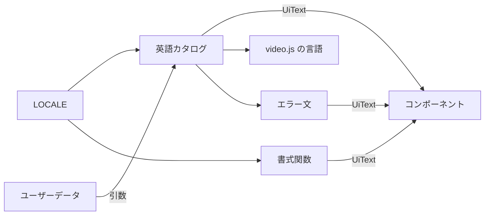
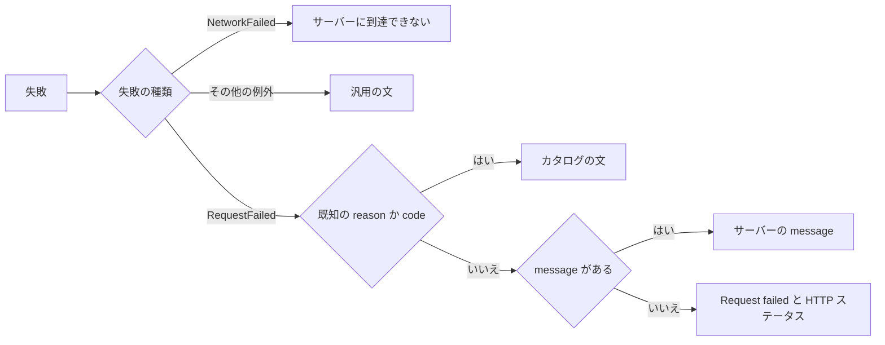

# 画面の文言と書式 (i18n) {#screen-text-and-formatting-i18n}

`web/src` の画面の文言と日付・数値の書式は [`web/src/i18n/`](../../web/src/i18n) から来る。言語は英語だけで、言語の選択はない。背景: [specs/023-english-i18n/research.md](../../specs/023-english-i18n/research.md) (R-1 から R-3、R-5、R-6、R-9)。

画面の文言はすべて、カタログか書式関数を通ってコンポーネントに届く。どちらも 1 つのロケールに固定されている。

## カタログ {#catalog}

`en.ts` は英語カタログで、画面の領域ごとに入れ子にしたオブジェクトであり、静的に import する (`import { t } from "../i18n"`)。値を埋め込む文言は関数である (`t.count.videos(n)`)。

言語は起動時に決まる 1 つの定数 (`intl.ts` の `LOCALE`) で、実行中に変わらない。そのため React の context や provider はない。

| 規則 | 振る舞い |
| --- | --- |
| 言語の追加 | `MessageSource` 型 (`typeof en`) の TypeScript オブジェクトを書く。型検査が欠けたキーと誤った引数を見つける |
| 翻訳ツール | なし。管理ツールも抽出の手順もない |
| ユーザーデータ (動画・フォルダ・タグの名前、パス) | 翻訳しない。引数として渡して埋め込む |
| 日本語フォント (Noto Sans JP) | 残す。英語の画面で日本語の名前を表示するため |

## UiText {#uitext}

カタログの値と書式の出力はブランド型 `UiText` (`uiText.ts`) を持ち、画面の文言を表示する文言 prop は `UiText` だけを受け取る。そのため、カタログ外の英語リテラルは型検査で失敗する。

| `UiText` 型にするもの | `string` のままのもの |
| --- | --- |
| `web/src/ui/` の文言 prop: `IconButton` の `label`、トーストの文言、`placeholder`、`TagCommand` の `label` とその理由の文言 | ユーザーデータを運ぶ prop: `TagChoice.label` |
| `api/` のフックが返すエラー文 | |

## 動画プレーヤー (video.js) {#video-player-videojs}

コントロールバーのアクセシブルネームとツールチップは、`t.player.controls` から組み立てた独自の言語 `en-x-vv` から来る ([`VideoPlayer.tsx`](../../web/src/player/VideoPlayer.tsx))。

キーボードショートカットを持つボタンはそのキーを表示する: `Play (Space)`、`Mute (M)`、`Fullscreen (F)`、およびコントロールバーに追加したボタンの `Restart (0)`。言語は新しいプレーヤーごとに登録し直すので、疑似ロケールがそこまで届く。Video.js はこの名前をプレーヤーの `lang` 属性にも使い、表にない文言は `en` の既定値に戻る。

## 書式 {#formatting}

`format.ts` と `intl.ts` は、カタログの `LOCALE` で `Intl` を通して書式を整える。

| 関数 | 出力 |
| --- | --- |
| `formatNumber` | 桁区切り付きの数値 |
| `formatDate`, `formatDateTime` | `medium` の日付と `short` の時刻による `Intl.DateTimeFormat` |
| `formatTime` | `short` の時刻のみによる `Intl.DateTimeFormat`。視聴履歴の項目の時刻など |
| `formatWeekday`, `formatMonthDay` | `long` の曜日 ("Tuesday") と、日を添えた `short` の月 ("Oct 7") による `Intl.DateTimeFormat`。年は現在の年以外でだけ付ける。視聴履歴の日のラベルの 2 行 |
| `formatRelative` | `Intl.RelativeTimeFormat` による "3 days ago"。しきい値は英語化前のもの。45 秒未満は `t.time.justNow` |
| `selectPlural` | `Intl.PluralRules` による `one` または `other`。カタログの件数関数が使う |
| `formatList` (`intl.ts`) | `Intl.ListFormat` による "A, B, and C"。再生画面の "being created" の行など、カタログの文言の列挙が使う |

ロケールに依存しない書式 (再生時間、ファイルサイズ、解像度、画質のラベル) は `web/src/lib/format.ts` にある。

## API エラーの表示 {#api-error-display}

`i18n/errors.ts` の `errorText` は、失敗したリクエストを応答の `status`、`code`、`message`、`reason`、`limit`、`tagName` から画面の文言にする ([contracts/error-api.md、`Error` の `reason`、`limit`、`tagName`](../../specs/023-english-i18n/contracts/error-api.md#reason-limit-and-tagname-on-error))。

文言は次の順で選ぶ。

既知の `reason` は既知の `code` より優先され、カタログの文は `limit` と `tagName` を埋め込む。「message がない」は、本文が JSON でない、空である、または `message` を持たない場合を含み、文言は `Request failed (HTTP <status>)` になる。ブラウザと例外のメッセージは決して表示しない。

エラーの表は生成された型から `Record<ErrorCode, …>` と `Record<ErrorReason, …>` として型付けされている。そのため `api/openapi.yaml` に追加した code や reason は、文を持つまで型検査で失敗する。解析と取り込みの失敗は、自由記述の `probeError` と `Scan.error` ではなく、`ProbeErrorCode` と `ScanErrorCode` (`errorPath` 付き) から説明する。code を持たない過去の失敗には汎用の文を出す。

## 未翻訳の文言の検出 {#detecting-untranslated-text}

3 つの検査が、カタログを迂回する英語や日本語を、それぞれ異なる時点で捕まえる。

| 検査 | 報告するもの |
| --- | --- |
| ESLint `no-restricted-syntax` ([`web/eslint.config.js`](../../web/eslint.config.js)) | `i18n/` 外のテスト以外のコードで: 日本語を含む文字列リテラルとテンプレート、文字を含む JSX テキスト、`aria-label`・`title`・`placeholder`・`alt` の文字列リテラル、`"ja-JP"`、ロケールを指定しない `toLocaleString` / `toLocaleDateString` / `toLocaleTimeString`。コメントは検査しない |
| 型 | `UiText` の prop と `Record` のエラーの表 |
| 疑似ロケールの画面テスト | `⟦ ⟧` で囲まれておらず、テストが与えたユーザーデータでもない、表示される文言、`aria-label`、`title`、`placeholder`、`alt` |

疑似ロケール (`i18n/pseudo.ts` の `enablePseudoLocale()`) はカタログのすべての文と書式の出力を `⟦ ⟧` で囲む。そのため、型が見逃す `string` 変数を通った英語は印なしで現れる。`web/vitest.setup.ts` は各テストの後に英語に戻す。どのテストも描画しない状態で `string` 変数を通って画面に届く文言は、どちらにも捕まらない。

## ui-design.md の文言 {#wording-in-ui-designmd}

英語カタログ ([`web/src/i18n/en.ts`](../../web/src/i18n/en.ts)) が画面の文言の正である。機能の `ui-design.md` に引用された日本語は英語化より前のもので、その画面の意図を示す。
