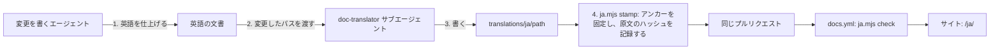

# 文書の日本語訳 {#japanese-translation-of-the-documents}

英語の文書が正である。その日本語訳は、翻訳専用のサブエージェント `doc-translator` が、英語を変更するのと同じプルリクエストで書く。訳は `translations/ja/` に置き、文書サイトが `/ja/` の下に公開する（[docs-site.md](../how-to/docs-site.md)）。

## 誰が訳すか {#who-translates}

### 決定 {#decision}

英語の文書を変更するエージェントは、まず英語を仕上げ、それから変更したパスを `doc-translator`（`.claude/agents/doc-translator.md`、`.codex/agents/doc-translator.toml`）に渡す。サブエージェントが読むのは、英語の原文、既存の訳があればその訳、そして下記の規則だけである。英語は書かず、編集もしない。訳し、訳を原文と一文ずつ比べ、足したもの、落としたもの、変えたものを直し、`node docs-site/translate/ja.mjs stamp <path>` を実行する。

### トレードオフ {#trade-offs}

最初に、CI 上で動かす翻訳特化モデルを試した（2026-10-03、実際の文書 6 本で）。

| エンジン | 結果 |
| --- | --- |
| `HY-MT1.5-7B` `Q4_K_M` を 4 vCPU のランナーで、文脈付きでセグメントごとに | 段落は読める。見出しと表のセルを誤訳した（「Say each thing once」を「各項目を一度読む」、列「Not」を「いいえ」と訳した）。リポジトリの用語を誤った（「Issues and PR bodies」を「問題と提案」と訳した）。丁寧体と普通体が混在した。コードスパンの多いセグメントは英語のまま残った |
| `HY-MT1.5-1.8B`、`TranslateGemma` 4B | 同じサンプルで 7B より悪い |
| `plamo-2-translate` | ランナー上で 1 token/s 未満 |
| Claude のサブエージェント。訳してから原文と比べる | 用語と見出しが正しく、普通体で一貫し、英語のまま残った箇所がない。比較の工程で、意味の強さが変わっていた 3 文を見つけた |

モデルは文体の規則に従えず、短いセグメントは文書がないと意味を失う。サブエージェントは文書全体と規則を読む。英語を先に書き、別の文脈で訳すことで、英語が正のまま保たれ、書き手が書いた英語ではなく意図した日本語を書いてしまうことを防ぐ。

定期実行の翻訳ジョブは採らなかった。訳が英語より後のコミットに入り、実行のたびにツリー全体を走査することになる。プルリクエストの中で訳せば、訳も同じレビューを受ける。

## 保存と検査 {#storage-and-checks}

### 決定 {#decision-1}

`translations/ja/<path>` は `<path>` を写す。その front matter は原文のパスと、訳した英語ファイルの SHA-256（`sourceHash`）を記録する。またすべての見出しの末尾に英語の見出しのアンカー（`{#slug}`）が付くので、日本語ページ間のリンクが解決する。どちらも `stamp` が書き、手で編集する者はいない。

`node docs-site/translate/ja.mjs check` は `docs.yml` で実行される。

| 状況 | 結果 |
| --- | --- |
| 見出し、リスト、表、コードブロック、インラインコード、リンク先、Mermaid の構造が原文と異なる | エラー |
| 見出しに英語のアンカーがない | エラー |
| 英語の原文がもう存在しない | エラー。訳を削除または移動する |
| `stamp` の後に英語の原文が変わった | 警告。ページに古くなった旨の注記を出す |
| 日本語の段落が行をまたいで改行されている | 警告。改行は空白として表示される |
| 公開された文書に訳がない | 件数を数える。ページは未翻訳の注記の下に英語を出す |

訳が古いことや訳がないことで CI が失敗することはないので、英語の変更が訳のせいで止まることはない。その文書に触れる次の変更、または `ja.mjs status` とサブエージェントの実行が、訳を最新にする。

`TestDocumentsAreWrittenInEnglish` と `scripts/sddguard` のリンク検査は `translations/` を飛ばす。そこの文章は日本語で、そのリンクは検査済みの英語のリンクを写したものだからである。

## 翻訳の規則 {#translation-rules}

サブエージェントはこの規則に従う。規則はそのプロンプトの一部である。

### 忠実さ {#faithfulness}

- すべての文を訳す。説明、例、表現を和らげる言葉、要約、強調を足さない。文を結合したり落としたりしない。
- すべての記述の強さを保つ。「must」「never」「only when」「unless」は同じ強さのままにする。記述は記述のまま、指示は指示のままにする。
- 簡潔なテキスト（見出し、表のセル、ラベル）は文脈の中の意味で訳す。「Write」の隣の列「Not」は `書かない例` であり、`いいえ` ではない。
- すでに訳がある文書の変更を訳すときは、英語が変わっていない文の既存の日本語を保つ。

### 構造 {#structure}

- Markdown の要素はすべて同じ位置に、同じ見出しレベル、リスト項目、表の行と列、コードブロック、リンク、画像のまま保つ。
- インラインコード、フェンス付きコード、リンク先、画像のパスは決して変えない。`mermaid` ブロックでは、ノードとエッジのラベルだけを訳す。
- 識別子、ファイルパス、コマンド、API 名、HTTP ステータスコード、UI ラベルは英語の画面に出るとおりに保つ（**Versions**、Library）。
- 各段落は 1 行で書く。日本語の段落の中の改行は空白として表示される。
- 見出しのアンカーは `stamp` が付ける。書かない。

### 文体 {#style}

- 全体を普通体（`だ・である`）で書き、`です・ます` は決して使わない。
- 短く直接的な文を書く。翻訳調を避ける。

| 避ける | 書く |
| --- | --- |
| `〜することができる` | `〜できる` |
| `〜を行う`, `〜を実施する` | 動詞そのもの（`確認する`） |
| 不要な `〜に関して`, `〜について` | 削る |
| `〜というものは`, `〜ということ` | 水増しを削る |
| 主語が明らかなときの `それは`, `これらの` | 代名詞を省く |
| 原文にない `一切`, `明らかに`, `非常に` | 省く |

- カタカナより定着した日本語の技術用語を選ぶ（response → `応答`、discovery → `検出`）。日本のエンジニアが使うカタカナはそのまま使う（`ブランチ`、`コミット`、`キャッシュ`、`ワークフロー`）。
- HTTP ステータスは、原文がそう言わない限りエラーではない（`304 を返す`）。

### 用語 {#terms}

| 英語 | 日本語 |
| --- | --- |
| Issue, parent Issue, child Issue | `Issue`, `親 Issue`, `子 Issue` |
| pull request, PR, PR body | `プルリクエスト`, `PR`, `PR 本文` |
| requirement, acceptance criterion | `要件`, `受け入れ条件` |
| repository, root documents | `リポジトリ`, `ルートの文書` |
| design document, how-to guide | `設計文書`, `手順書` |
| documentation site | `文書サイト` |
| skill, document type, skeleton | `スキル`, `型`, `雛形` |
| feature branch | `feature ブランチ` |
| live transcoding | `ライブ変換` |
| seek bar, seek thumbnail | `シークバー`, `シーク用サムネイル` |
| sidecar subtitle file | `隣の字幕ファイル` |
| owner, guest | `所有者`, `ゲスト` |
| tentative tag, folder group, content key | `仮のタグ`, `フォルダのグループ`, `内容の鍵` |
| workflow, runner | `ワークフロー`, `ランナー` |
| Mermaid | `Mermaid` |

訳が揺れる用語があれば行を足す。既存の訳は、その英語が変わるまで言い回しを保つ。
