# ライブラリ UI: 視覚ルールと一覧のレイアウト {#library-ui-visual-rules-and-list-layout}

- 状態: 採用
- 範囲: `web/` の画面（シェル、一覧、動画ページ）が従う視覚ルールと、そのルールへの準拠を確かめる方法

画面は CSS にある 1 組の視覚値を共有し、機械が確かめられることはテストが確かめる。値（色、角丸、カード幅）は [`web/src/ui/tokens.css`](../../web/src/ui/tokens.css) の `@theme` にだけあり、確かめる組は [`tokens.test.ts`](../../web/src/theme/tokens.test.ts) にだけある。ここには写さない。

図は、値がどこにあり、各部分を誰が確かめるかを示す。

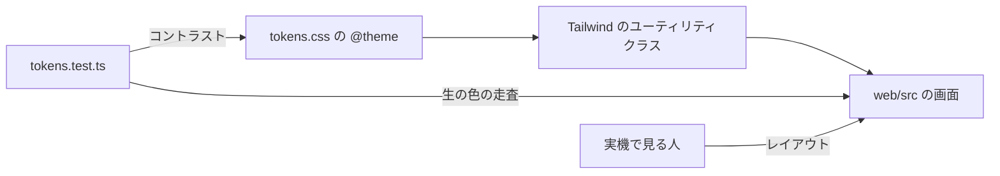

## 視覚値は CSS の 1 か所に置き、コントラストはテストで保証する {#visual-values-in-one-css-location-with-contrast-guaranteed-by-tests}

画面は、Tailwind が `@theme` から生成するユーティリティクラス（`bg-card`、`text-muted-foreground`、`rounded-md`）を通してだけ視覚値を設定し、`tokens.test.ts` は、列挙した文字と面の組がどれも WCAG 2 のコントラスト 4.5 以上に達することを確かめる。

CSS を元にするのは、画面にトークン名以外の選択肢を残さないからだ。値が 1 つのファイルにあるので、コントラストの確認はそのファイルだけを読む。

テストは次の確認をする。

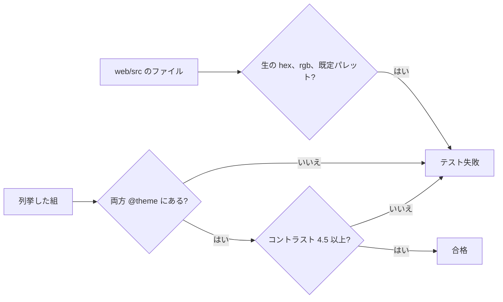

既定パレットの名前は `neutral-*`、`sky-*` などだ。組にない色は確かめられないので、**新しい文字や面の色は組に追加しなければならない**。テストが捕まえるのは CSS にない列挙済みの組で、その逆ではない。

どのトークンがどの役割（面、シアンの `primary`、コントロールの枠線、フォーカス、意味の色、お気に入りのピンク）を担うかは [design-system.md、Foundations](design-system.md#foundations) で定めている。テストは面の上の本文、主な枠線、フォーカスを対象にする。

| 採用しなかった案 | 理由 |
| --- | --- |
| 値を TypeScript に置き、CSS を生成する | 画面はどのみち Tailwind のクラス名を使うので、名前が重複し、生成ファイルが 1 つ増える |
| CI での axe や Lighthouse | 実際のブラウザが要る。コントラスト以外では、どのみち人が見直す指摘を増やす |

## 暗色の配色だけにし、明暗の切り替えは置かない {#dark-scheme-only-without-a-lightdark-switch}

`html` は `color-scheme: dark` を宣言し、暗色の値が 1 組だけある。`prefers-color-scheme` の分岐も切り替えもない。

切り替えを置くとコントラストを確かめる組が倍になり、片方の組は気づかれないまま古くなる。トークン名は色（`neutral-850`）ではなく役割（`bg`、`surface`、`elevated`、`fg`、`fg-muted`、`accent`、`danger`、`warning`）を表すので、後で明色の配色を加えるときは 2 組目の値を足すだけで、画面は変わらない。

## 仮想スクロールは使わない {#no-virtual-scrolling}

一覧は、仮想スクロールのライブラリを使わず、読み込んだ項目をすべて描画する。目標は入力への即座の応答で、DOM 要素を減らすことではない。

一覧は折り返すグリッドで、1 行のカード数は画面幅とカード幅で変わる。そのため仮想化すると、その数を計算し、スクロール位置の復元を仮想座標で作り直すことになる。ページは 60 項目ずつ読み込む（[`PAGE_SIZE`](../../web/src/api/client.ts)）ので、DOM には利用者が読み込んだものだけがある。**何が遅いかを測った後にだけ見直す。**

タグ管理の一覧（`/tags`）は測定に基づく例外だ。タグが数千あると、開く、検索、スクロールが固まったので、ビューポートの近くの行だけを描画する（`@tanstack/react-virtual` の `useWindowVirtualizer`、[036 調査、R-2](../../specs/036-tag-admin-scale/research.md)）。上の理由はどちらもそこには当てはまらない。1 列であり、行は現在の条件に対してサーバーから 100 件ずつ届く。スクロールの持ち主は文書のままで、一覧はフォーカスのある行を描画したまま保ち、Tab は描画範囲の端を越えるので、キーボードの順序はすべての行に届く。ツールバー、タブ、列見出しは、上部バーの下に貼り付く 1 つの帯としてとどまる。ページは帯を測り、その高さを仮想化の処理と `scroll-padding-top` に渡すので、フォーカスのある行が帯の下に隠れることはない（[036 UI 設計、Band](../../specs/036-tag-admin-scale/ui-design.md)）。

### スクロールはウィンドウが持つ {#the-window-owns-scrolling}

内容をスクロールするのは文書（ウィンドウ）だ。シェルのサイドバーとツールバーは固定か貼り付きで、スクロールコンテナを持たない。

一覧のスクロール位置の復元、ズームの基準位置の保持、無限スクロールは、どれも `window.scrollY` を読むかビューポートを基準に監視するので、シェルの中にスクロールコンテナを置くと 3 つすべてを書き直すことになる。

## 幅のブレークポイントは CSS に置き、サイドバーは例外とする {#width-breakpoints-in-css-and-the-sidebar-exception}

幅による変化には CSS で Tailwind の既定のブレークポイントを使う。JavaScript で幅を読むのはサイドバーだけだ（[`useSidebar.ts`](../../web/src/shell/useSidebar.ts)）。

JavaScript で幅を監視すると、監視の仕組み、最初の描画での 1 フレームのちらつき、テストでの `matchMedia` のスタブが持ち込まれる。サイドバーが例外なのは、利用者の開閉の選択を幅ごとに解釈し、ドロワーの開いた状態を保つからで、これは CSS では表せない。そのブレークポイントは `lg` と `sm` に等しい。

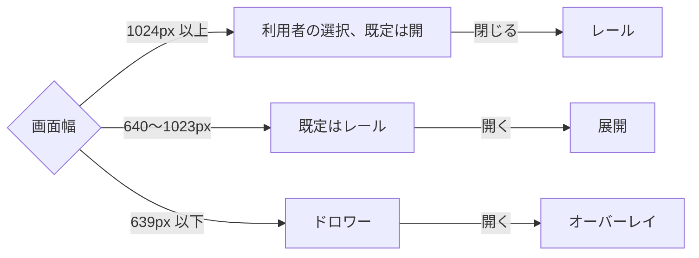

動きの抑制（`prefers-reduced-motion`）も CSS で扱う。`motion-reduce:` バリアントは装飾的な遷移を止めるが、最終的な色と対象の印は適用されるので、操作の結果は見えたままになる。

## レイアウトは機械ではなく人が確かめる {#layout-verified-by-people-not-machines}

機械はコントラスト、生の色がないこと、コンポーネントの振る舞いを確かめる。**レイアウトとその幅による変化は、人が実機で確かめる。**

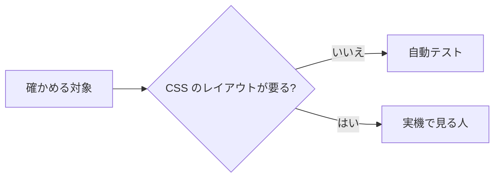

jsdom は CSS を適用しないので、`position: fixed`、メディアクエリ、折り返しは解決されず、それらを偽装すると壊れた画面でテストが通る。

| 採用しなかった案 | 理由 |
| --- | --- |
| 見た目の回帰テスト | 新しい依存、環境ごとのグリフの違いによる誤検出、UI を変えるたびに参照画像を更新すること |

## 一覧のレイアウト {#list-layout}

一覧は密度の高い管理画面のレイアウトを使う。上部バー、絞り込みの帯、枠で囲んだカードで、ライブラリとフォルダのページが 1 つのグリッド（[`Grid.tsx`](../../web/src/videoList/Grid.tsx)）を通して共有する。

図は一覧画面の部品を示す。

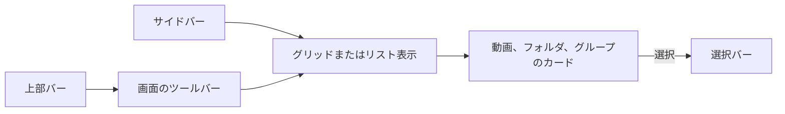

### シェルとツールバー {#shell-and-toolbar}

上部バー（[`TopBar.tsx`](../../web/src/shell/TopBar.tsx)）は ☰、ロゴ、`Refresh library` を持ち、各画面はその間に自分のツールバーを差し込む。サイドバーには 3 つの状態（展開、レール、ドロワー。[幅のブレークポイントは CSS に置き、サイドバーは例外とする](#width-breakpoints-in-css-and-the-sidebar-exception)を参照）があり、畳むとグリッドが広がる。カード幅はズームの段階に従う。ゲストのルールは [016 UI 設計、Shell entries、Guest degradation](../../specs/016-single-account-auth/ui-design.md) にある。

| 部品 | 所有者 | ゲスト |
| --- | --- | --- |
| サイドバー上部 | すべての項目 | `Library` と `Folders` だけ |
| サイドバー下部 | `Settings`、`Sign out` | `Sign in` |
| 更新ボタンと取り込みの進捗 | 表示 | 非表示 |
| 並び順 | 9 | 7 |
| 視聴状態と `Favorites only` の絞り込み | 表示 | 非表示 |

ツールバーは検索、絞り込み、表示（ライブラリだけ）、ズーム、並べ替えを持つ。

| 幅 | ツールバー |
| --- | --- |
| 広い | すべてのコントロールを横に並べる |
| 狭い | 表示、ズーム、並べ替えは `View and sort` に移る |
| `md` 未満 | 並び順は 2 列のラジオに行優先で並ぶ。所有者は 5 行、ゲストは 4 行 |
| `sm` 未満 | ズームによらず全幅の 1 列。ズームは非表示 |

件数は、ライブラリと検索結果ではグリッドの上の行に、フォルダの直下の内容では節の見出しに置く。

並び順は追加日、更新日、作成日、タイトル、長さ、ファイルサイズ、最近再生、お気に入り登録日、ランダムだ。ゲストでは所有者専用の最近再生とお気に入り登録日がなくなる。作成日はほかの日付と並ぶ（[033 UI 設計](../../specs/033-video-dates/ui-design.md)）。お気に入り登録日は最近再生の後に続き、新しい順に並べる（[035 UI 設計、Sort and direction](../../specs/035-favorites/ui-design.md)）。

絞り込みのポップオーバーは、視聴状態、`Favorites only`（URL は `fav=1`）、再生可否をこの順に並べる。`Clear filters` はお気に入りをほかの絞り込みと一緒にだけ解除し、並び順は保つ。`fav=1` や `sort=favorited*` を含むゲストの URL は、リクエストの前に既定値へ戻し、URL を正す。

### カード {#cards}

動画カード（[`VideoCard.tsx`](../../web/src/videoList/VideoCard.tsx)）は、サムネイル、その右下の長さ、下端に沿った再生の進捗、タイトルを表示する。

| カード | ルール |
| --- | --- |
| 動画、ライブラリとフォルダのページ | タイトルの下にタグの行。タグがなければ行もない（[014 UI 設計、Library card](../../specs/014-video-tags/ui-design.md)） |
| 動画、フォルダの検索結果 | タイトルの下に所在の行 |
| フォルダ | 動画カードの幅と枠線、フォルダの絵、タイトルに Folder アイコン |
| グループ（ライブラリだけ） | 動画カードの枠と大きさ、最大 4 つのメンバーのサムネイルによるフォルダの絵 |

動画カードの振る舞い:

| 場合 | 振る舞い |
| --- | --- |
| ライブラリでタグを押す | そのタグで絞り込む |
| フォルダのページでタグを押す | `/?tag=<id>` を開く |
| フォルダ名だけから来たタグ | 同じ大きさ、塗りなし、破線の枠線、Folder の印。動画ページでは × がなく、`Remove tag` の候補にならない（[017 UI 設計](../../specs/017-folder-groups/ui-design.md)） |
| ホバーのプレビュー | どの画面でも一度に 1 つ |
| ズームの変更 | 上端にあったカードに戻る |

フォルダカードは名前を最大 2 行で表示し、完全な名前は `title` に入れる。所有者にはメディアフォルダのパスも見え、末尾を優先して切り詰め、完全なパスは `title` に入れる。登録した空のルートは、そこにファイルを置いて取り込むよう案内する。

ライブラリは `GET /api/library` を読み、これはフォルダのグループを動画に混ぜて返す。フォルダのページとその検索結果は動画を 1 本ずつ並べる。グループカードは、件数（`12 videos`）と合計の長さを示すパネル、一部のメンバーが視聴途中のときだけ出る視聴済みの割合のバー、グループ名、メンバーのタグを表示する。押すと続きを見るメンバー（`/videos/{openVideoId}`）を開く。ゲストには視聴状態、視聴済み数、バーが見えない。

グループの解除、フォルダ直下の動画のグループ化、グループのタグへの変換はカードにない。これらは、フォルダのページの `Videos N` 見出し行の右端にある所有者のメニュー（[`FolderGroupingMenu.tsx`](../../web/src/folders/FolderGroupingMenu.tsx)）と、動画ページのグループ名の行にある。操作の後、キャッシュしたライブラリの一覧は破棄され、次に訪れたときに読み直す。

### お気に入りの印 {#favorite-mark}

所有者のお気に入りの印は、印と切り替えを兼ねる 1 つのハートで、動画とグループのカードのサムネイルの右上にある（[`FavoriteToggle.tsx`](../../web/src/videoList/FavoriteToggle.tsx)、[035 UI 設計、Mark、Card](../../specs/035-favorites/ui-design.md)）。

| 観点 | ルール |
| --- | --- |
| 形 | 28px の当たり領域に 22px のハート。背後に塗りも枠線もない |
| 読みやすさ | カードでは暗い `drop-shadow-mark`。リスト表示ではなし |
| オン | どこでもピンクの `favorite` で塗る |
| オフ | 白の輪郭。ホバーかフォーカスのときだけ表示する（ホバーできない環境では常に表示） |
| 押下 | カードのリンクの外にある。開きも選択もしない |
| お気に入りで絞り込み中 | 項目は次の取得まで残る |
| ゲスト | 表示しない |

印はサーバーが応答してから変わる。

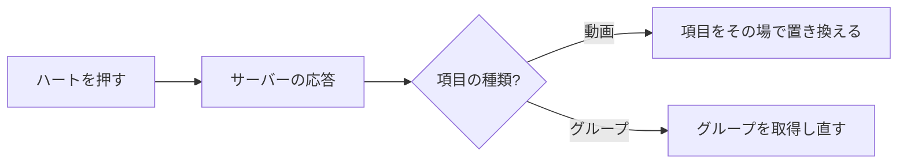

グループは `GET /api/folders/{rootId}/group` で取得し直す。

### リスト表示と選択 {#list-view-and-selection}

リスト表示（ライブラリだけ）は、タイトル、お気に入り（所有者）、視聴済み、長さ、画質、サイズ、追加日を表示する。グループの行は同じ列を使う。最初のメンバーのサムネイル、タイトルの下に Folder の印と件数、`3 / 12` の視聴済み、合計の長さとサイズ、空の画質だ（[017 UI 設計、List view row](../../specs/017-folder-groups/ui-design.md)）。

選択はライブラリと所有者だけのものだ。チェックは、グリッドではホバーかフォーカスのときに（ホバーできない環境では常に）、リスト表示では常に薄く、選択中はすべての項目に表示する。グループのチェックが何を選ぶかは [017 UI 設計、Pressing and selection](../../specs/017-folder-groups/ui-design.md#pressing-and-selection) にある。

### 選択バー {#selection-bar}

選択バーは、最初の項目を選んだときから画面の下端に固定され、ツールバーを動かしたり大きさを変えたりしない。操作名は決して短縮しないので、ホバーのない機器でも読める。

項目は順に、`N selected`、`Add tag`、`Remove tag`、`Favorite`、`Visibility`、`Bundle as versions`（動画 2 本以上）、区切り、`Select all`、解除だ。行の割り当ては実際の幅を測って決める。

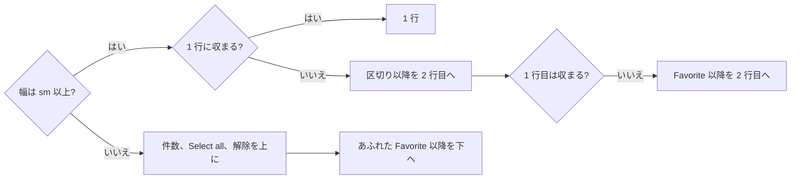

`sm` 以上では、バーは `nowrap` ではみ出す代わりに全幅に広がり、移った項目は 2 行目の右端に置かれ、`Favorite` 以降が区切りより前に来る。`sm` 未満では、最下行に 2 つのタグ操作、`Favorite`、`Visibility` を置き、収まらないものは次の行の右端へ、さらにその次の行へ移る。

詳細: タグ操作は [014 UI 設計、Selection bar](../../specs/014-video-tags/ui-design.md#selection-bar)、公開範囲のメニューは [016 UI 設計、Selection bar](../../specs/016-single-account-auth/ui-design.md#selection-bar)、`Favorite` と折り返しは [035 UI 設計、Selection bar](../../specs/035-favorites/ui-design.md#selection-bar) にある。

`Favorite` は、選択したグループごとに、グループとして送るかを決める。

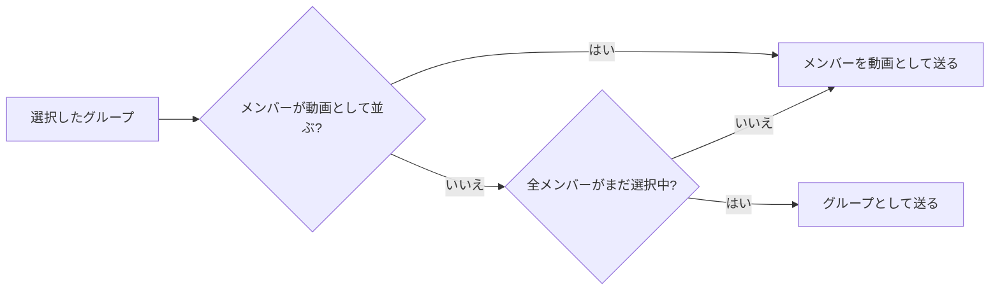

グループは、カードのチェックか `Select all` で選ばれる。選択を保ったまま一覧を取得し直したとき、たとえば取り込みの後に、メンバーが動画の項目として現れたり、グループにメンバーが増えたりする。

### 操作の状態 {#interaction-states}

通常、ホバー、focus-visible、押下中、選択中、無効は互いに区別でき、コンポーネント間で一貫している。キーボードフォーカスはアクセント色の外側の輪郭線だ。検索欄は二重の輪郭線を避けるため、内側の `input` ではなく外枠に描く。

## サイドバーのナビゲーション {#sidebar-navigation}

サイドバーの各項目は、それぞれの画面へ移る。

## 動画ページのレイアウト {#video-page-layout}

動画ページ（`/videos/:id`）は視聴のためのものなので、一覧より密度が低い。形と文言は [012 UI 設計](../../specs/012-video-detail-ia/ui-design.md) にある。

ページはシェルなしで一覧の上に重なり、× か Esc で閉じる。`DetailPage` の雛形（[デザインシステム、Page patterns](design-system.md#page-patterns)）の上に組み立て、ヘッダーの帯の下に、視聴のための主領域と情報の脇領域を置く。図はその部品を示す。

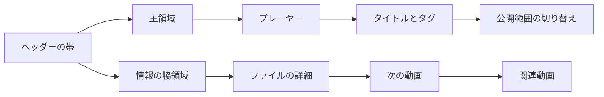

| 部品 | ルール |
| --- | --- |
| ヘッダーの帯 | ロゴ（ホーム）、フォルダへのパンくず、唯一の × |
| 戻り先 | ページを開く前の一覧。関連動画と `Play next` を経ても保つ |
| タグ | タイトルのすぐ下に 1 つのまとまりとして置く（[014 UI 設計、Video page tags](../../specs/014-video-tags/ui-design.md#video-page-tags)） |
| 公開範囲の切り替え | `role="switch"`。タイトルのまとまりの下で、主領域の最後の部品 |
| ゲスト | タグ、公開範囲の切り替え、`Open file`、`Copy path` がない（[016 UI 設計、Visibility toggle](../../specs/016-single-account-auth/ui-design.md#visibility-toggle)） |

幅による変化は、[幅のブレークポイントは CSS に置き、サイドバーは例外とする](#width-breakpoints-in-css-and-the-sidebar-exception)と同じく CSS に置く。`lg` 以上では脇領域が右の列になり、ページはビューポートの高さを保つので、主領域と脇領域はそれぞれ独立してスクロールする。`lg` 未満では脇領域が主領域の下に移り、ページ全体が 1 つとしてスクロールする。`md` 未満ではパンくずが最後の区間だけを表示する。

### ファイルの詳細 {#file-details}

ファイル情報は脇領域の最初の `PageSection` で、題は `File details` だ。その操作は節の見出しの右に置く。

| 部品 | 内容 |
| --- | --- |
| `FactList` | 項目と値の組。長さ、サイズ、追加日、編集日、作成日。続いて、グループに表示できるバージョンが 2 つ以上あるときは `Versions`、所有者にはサムネイルの位置が設定されているときに `Thumbnail` |
| 技術情報の行 | 一覧の下に解像度、コンテナ、コーデック。最も小さく、最も控えめ |
| 操作 | お気に入り、`Use current frame as thumbnail`、`Open file`、`Copy path`。ツールチップ付きの、アイコンだけのゴーストボタン |

日付は日付だけを表示し、時刻は `title` 属性と、値を押すと開くポップオーバーにある。パンくずがすでに所在を示すので、節の中にパスは出さない。

所有者のお気に入りの切り替えは操作のまとまりの先頭にあり、`Use current frame as thumbnail` の左に置く（`FavoriteToggle` の `page` 形式: `Toggle` の `sm`、`aria-pressed`）。まとまりの中で状態を持つ唯一のコントロールなので、目が最初にそこへ向く。それでもタイトルより目立つことはない。オンは小さな `bg-primary-soft` の塗りにピンクのハートだ。グループの行とゲストにはない（[035 UI 設計、Video page](../../specs/035-favorites/ui-design.md#video-page)）。

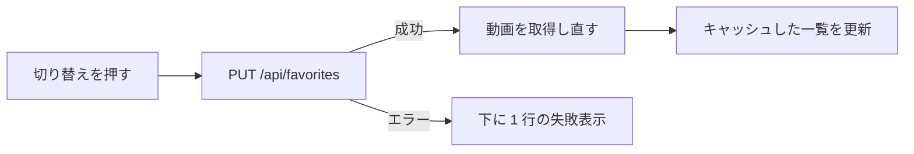

キャッシュした一覧を更新するので、戻ったときにはライブラリのカードが変わっている。失敗の行は、開く操作やキャプチャの失敗と同じく節の中の項目一覧のすぐ下に置き、トーストは出さない。

### プレーヤーの状態 {#player-states}

読み込み中、取り込みの段階、読み取りの失敗、再生の失敗、動画の消失、再生の終了は、プレーヤーの上の 1 つのコンテナから一度に 1 つずつ表示され、その順序はコンテナが決める。「作成中」の行だけはプレーヤーの下に置く。`tokens.test.ts` は半透明の `bg-overlay` の上の文字を確かめられないので、レイヤーの文字は不透明な浮遊レイヤーの面 `bg-popover` の上に置く。

停滞の警告（[`StallWarning.tsx`](../../web/src/player/StallWarning.tsx)、`role="status"`）は、プレーヤーの左上にある別の小さなバナーだ。再生を止めずコントロールも塞がないので、一度に 1 つのコンテナには入れない。

| 観点 | ルール |
| --- | --- |
| 重なり順 | 動画より上、コンテナとコントロールバーより下 |
| 入力 | × を除き、下のコントロールへ通す |
| 隠れるとき | 再生の失敗、再生の終了、次の動画、再接続中、取り込み中が表示されているとき |
| 読み込み中のスピナー | データ待ちの間はスピナーと一緒に表示する |
| 閉じた後 | 同じ動画では再び表示しない |
| 操作 | なし。画質は変えない |

ルール: [Playback quality、Stall warning](playback-quality.md#stall-warning)。詳細: [027 UI 設計、Stall warning](../../specs/027-playback-quality/ui-design.md#stall-warning)。

### 再生のエラー {#playback-errors}

再生のエラーは種類で分類し（[`playbackRecovery.ts`](../../web/src/player/playbackRecovery.ts)）、`video` 要素のコードが原因を示さないときは原因を確かめる。

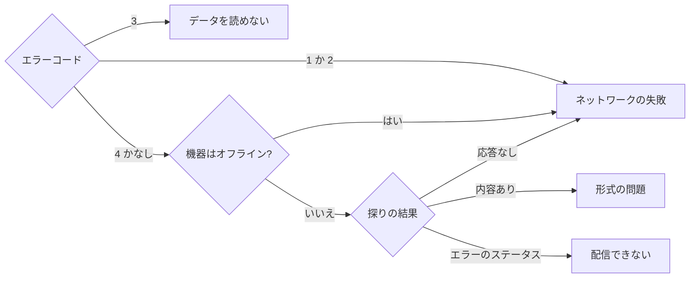

直接再生では、ファイルの最初の 1 バイトを探る。変換再生では、ストリームへのリクエストが変換を始めてしまうので、`/api/health` が応答するかだけを探る。何らかの応答があれば形式の問題とみなす。

ネットワークの失敗では、変換再生に切り替えず、今の経路のまま途切れた位置から読み直す。

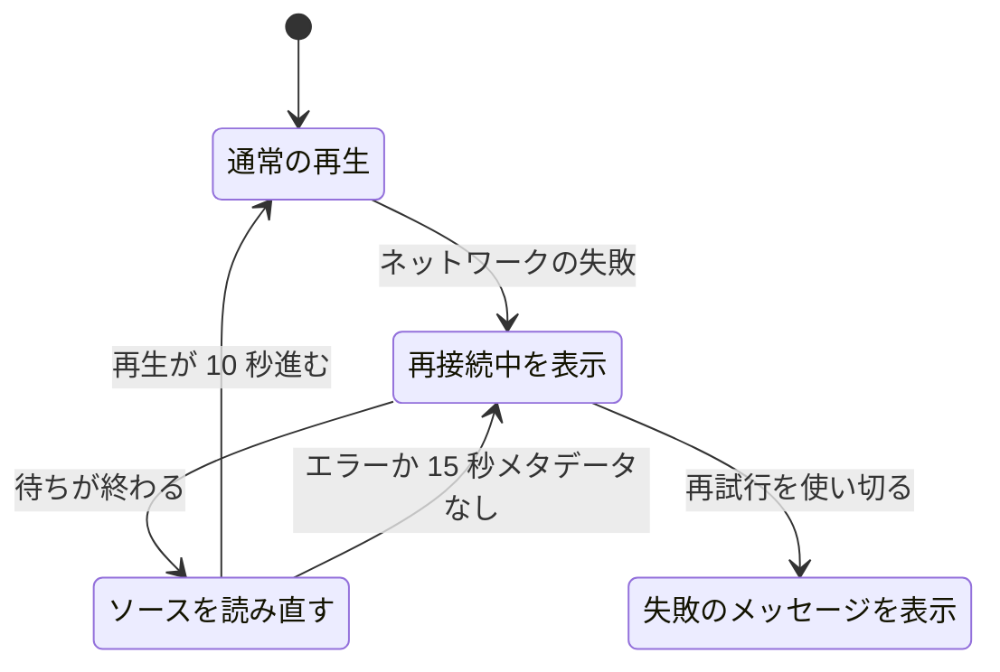

| ルール | 値 |
| --- | --- |
| 待ち時間 | 1、2、4、8、15 秒（合計約 30 秒） |
| 待ちの早期終了 | 機器が `online` に戻るか、視聴者が再生を押す |
| 再試行回数のリセット | 読み直し後に実際に 10 秒再生したとき。シークや一時停止の変化は数えない |
| 待ちの間の一時停止 | 読み直し後も一時停止のまま |
| 待ちの間のシーク | 読み直しの位置になる。リクエスト中なら、メタデータの後に適用する |
| 一時停止の状態 | 視聴者の意図から答える。再生・一時停止ボタンはそれに従う |
| 変換再生への切り替え | 1 回だけ。直接再生からだけ。データを読めない失敗と形式の失敗のときだけ |

待ちの間の視聴者の入力は、決して壊れたソースに届かない。最後のメッセージは、サーバーに届かない、データを読めない（破損）、動画を配信できない（移動、消失、形式）のどれに当たるかを示す。

### コントロールバー {#control-bar}

video.js のコンポーネントはコントロールバーの部品だけだ。先頭から再生、画質、字幕、再生速度、現在時刻と長さ、変換の表示がそれに当たる。状態の表示は React だ。video.js のコンポーネントでは画面のほかの部分と状態を共有できなかったからだ。

| コントロール | ルール |
| --- | --- |
| 右側のまとまり | 変換の表示、画質、再生速度、PiP、全画面をこの順に置く |
| 画質 | 枠、余白、開き方、Esc を再生速度に合わせた `MenuButton`（[`qualityMenu.ts`](../../web/src/player/qualityMenu.ts)） |
| 画質のラベル | 現在の画質。オリジナルでは動画の短辺 |
| 画質の選択 | プレーヤーを作り直さず、同じ位置でソースを置き換える |
| 開いたメニューでの Esc | メニューだけを閉じる |
| 字幕ボタン | 再生速度の隣。字幕のない動画ではない |
| 字幕メニュー | 字幕名と `Off`。見た目の設定はない |
| 字幕の選択 | ブラウザごとに記憶する。同じラベルを持つ次の動画はそれで始まる |
| 字幕の位置 | コントロールバーと進捗バーが出ている間は、その上へ持ち上げる |

画質: [Playback quality、Switching](playback-quality.md#switching) と [027 UI 設計、Control bar: quality menu](../../specs/027-playback-quality/ui-design.md#control-bar-quality-menu)。字幕は video.js の `vjs-text-track-display` を使う（[sidecar-subtitles.md](sidecar-subtitles.md)）。

キーボードショートカットは画面全体で効く。video.js のコンポーネントはキーの伝播を止めるので、キーは `window` のキャプチャ段階で捕まえ、フォーカスのあるボタンやスライダーを操作するキーだけを通す。Space、F、M、C（字幕）、0、Esc を扱う。

### グループのメンバー {#group-members}

グループに属する動画は、同じページに部品が加わるだけだ。どのグループにも属さない動画は変わらない（[017 UI 設計、Video page](../../specs/017-folder-groups/ui-design.md#video-page)）。

| 部品 | ルール |
| --- | --- |
| タイトルの上 | グループ名と、グループ内の位置 |
| 関連動画の列 | 先頭に `Up next` のメンバー一覧と区切り線 |
| 再生の終了 | レイヤーの代わりに次のメンバーの通知。5 秒、取り消せる、Esc で取り消す |
| グループ名の行（所有者） | `Ungroup` と `Turn the group into a tag` のメニュー。Esc はメニューだけを閉じる |
| メニューの操作の後 | 動画と関連動画を取得し直し、ページは通常の形に戻る |
| 前後のハンドル | グループ内で移動する |

`matchMedia` が `lg` の幅を読むのは、広い画面で現在のメンバーの行を見える位置へスクロールするためだけだ。狭い幅でスクロールするとページ全体が動き、プレーヤーが隠れる。

中央のタッチ操作は、[幅のブレークポイントは CSS に置き、サイドバーは例外とする](#width-breakpoints-in-css-and-the-sidebar-exception)の理由により、`matchMedia` を使わず CSS のメディア条件で `pointer: coarse` の機器に表示する。

## サーバーが適用する一覧の条件 {#list-conditions-applied-by-the-server}

一覧の条件（検索、絞り込み、並び順、シャッフルのシード）はすべてサーバーが適用し、ページは読み込んだページを決して絞り込まない（[`listCriteria.ts`](../../web/src/videoList/listCriteria.ts) が条件を URL に保つ）。

どの動画とグループがフォルダに属し、絞り込みに合うかを知るのはサーバーだけなので、手元で絞り込むページは `total` と異なる集合を表示してしまう。同じ理由で、取得し直した一覧の項目は自分の位置を決して推測しない。

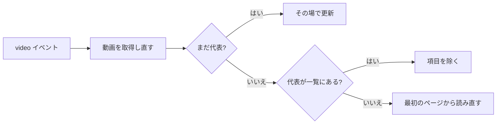

代表を直接差し込むと、フォルダや絞り込みの外の動画を表示しかねない（[`useItemRefresh.ts`](../../web/src/api/useItemRefresh.ts)）。

## 既定値を持つ機器ごとの設定 {#per-device-preferences-with-defaults}

機器ごとの表示設定は、決して例外を投げない `localStorage` 上の全域関数だ（[`web/src/preferences/`](../../web/src/preferences)）。値がない、壊れている、読めないときは既定値になり、書き込みの失敗は無視する。

設定は便宜のためのものだ。保存された不正な値やブロックされたストレージで画面を空白にしてはならない。
