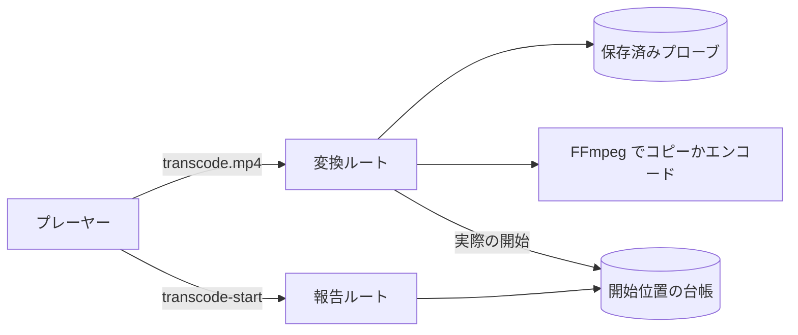
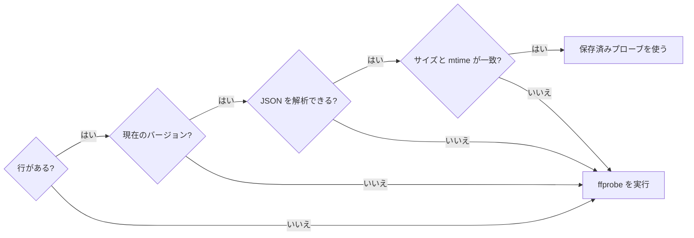
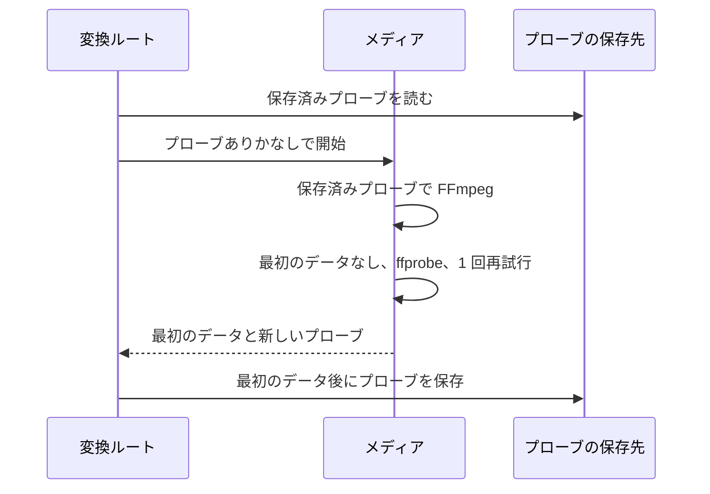
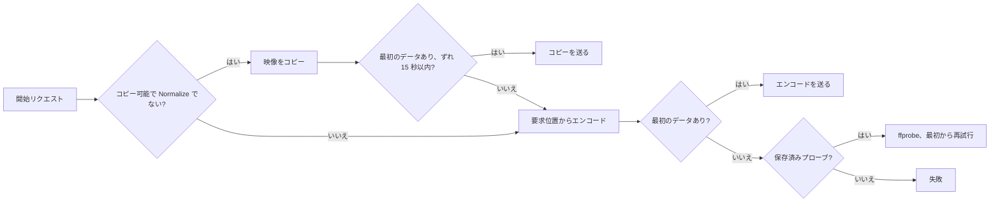
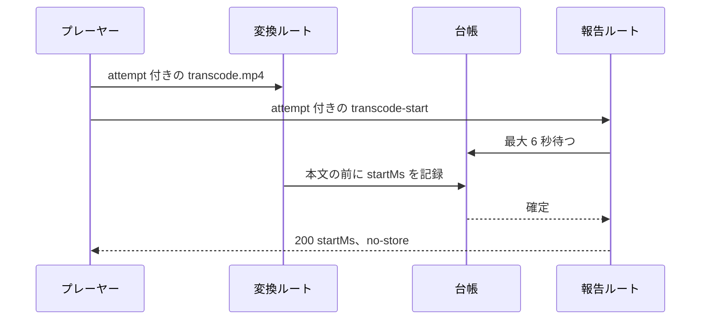
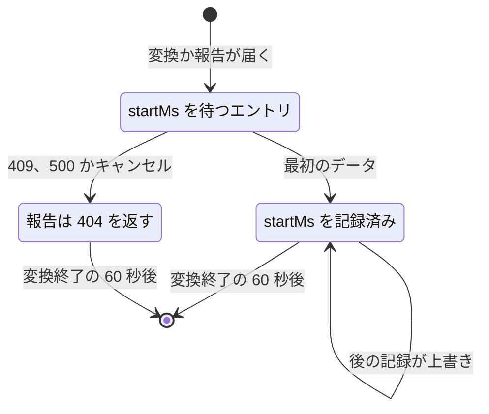

# ライブ変換のシークとプローブの再利用 {#live-transcoding-seek-and-probe-reuse}

ライブ変換 (`GET /api/videos/{id}/transcode.mp4`) は、保存済みのプローブから FFmpeg を起動し、可能なときはファイル途中の位置から映像ストリームをコピーし、実際の開始位置を `GET /api/videos/{id}/transcode-start` でプレーヤーに伝える ([`internal/httpapi/transcode.go`](../../internal/httpapi/transcode.go)、[`internal/media`](../../internal/media))。背景: [research.md](../../specs/018-live-transcode-seek/research.md)。

プレーヤーはファイル途中の位置からの変換 1 回につき 2 つのリクエストを送り、変換は実際の開始位置を台帳に記録し、報告がその台帳を読む。

## プローブの再利用 {#probe-reuse}

取り込み時の解析は、ライブ変換に必要な ffprobe の情報 (`domain.TranscodeProbe`) を `video_transcode_probes` に保存し、変換は使える保存値がないときに限り ffprobe を実行する。

FFmpeg の引数 (ストリームの選択、コピーかエンコードか、寸法、回転、fps、[2 つの MOV 入力](mov-live-transcoding.md)) は ffprobe に依存し、ネットワークドライブでは ffprobe が最初のデータまでの時間の大きな部分を占める。行は、解析した値をバージョン付きの JSON として保持し、加えて解析したファイルのサイズと更新時刻 (ナノ秒) を保持する。

保存値は、別の所在に同じ内容があっても、変換が実際に開いたファイルに対してすべての確認が通るときに限り使える。

現在のバージョンは `domain.TranscodeProbeVersion` だ。保存値から始めた変換が最初のデータなしに終わると、同じ起動期限の内側でもう一度プローブし、1 回だけ再試行する:

| 場合 | 動作 |
| --- | --- |
| 起動期限 | 6 秒 (`transcodeStartupTimeout`) がプローブ、再試行、すべての切り替えを含む。最初のデータの後には再適用しない |
| その場でプローブした後の失敗、キャンセル、期限切れ | 再試行せず、何も保存しない |
| 保存 | 最初のデータの後に、配信と並行して、リクエストのキャンセル後も続く独自の 10 秒の期限で保存する |
| プローブ中にファイルのスタンプが変わった | 結果はこの変換に使い、保存しない |
| ffprobe が途中で打ち切られた | エラーとし、保存しない |
| 取り込みと変換が同時に保存する | 単一の upsert。後の行が残る |
| 行のない取り込み済みの動画 | 最初の変換が埋める。起動時の埋め戻しはしない |

この表はインデックスだ。失われても、次の変換か再解析が埋める。適合はサイズと更新時刻だけで判断するので、両方を変えずに書き換えたファイルは古いプローブで変換される。それが最初のデータの前に失敗すれば、再試行が保存値を置き換える。メディアがストアを呼ぶことはない。ルートが使えるかを判断して保存するので、ffmpeg なしのメディアのテストに SQLite は要らない。

| 採用しなかった案 | 理由 |
| --- | --- |
| メディアがストアを読む | アダプタがアダプタに依存することになり、ARCHITECTURE.md の依存方向に反する |
| ffprobe の生の JSON を保存する | 解釈が保存時の ffprobe のバージョンに依存し、動画ごとに数十 KB を持つことになる |
| `videos` に型付きの列を足す | 一覧の行が使わない列で大きくなり、新しいフィールドのたびにマイグレーションが要る |

## コピー経路とずれの上限 {#copy-path-and-gap-limit}

ストリームをコピーできる動画 (`videoCanCopy`、たとえば MKV 内の H.264) はファイル途中の位置からコピーする。ただし、コピーが要求位置より `domain.CopySeekAllowance` (15 秒) を超えて前から始まる場合は、要求位置からエンコードする。

コピーは直前のキーフレームから始まるので、サーバーは実際に始まった時刻を知る必要がある ([research.md R-1](../../specs/018-live-transcode-seek/research.md#r-1-source-of-the-actual-start-position))。1 つのプローブについて、FFmpeg の起動を次の順に試す:

`Normalize` は直接再生からの切り替えを示す。期限切れとキャンセルでは決して切り替えない。実際の開始位置は[開始位置の台帳](#start-position-report)へ渡る。

| 開始 | 実際の開始位置 |
| --- | --- |
| 0 からのコピー | 0。引数は変えない |
| ファイル途中の位置からのコピー | 出力の `moov` で最も早いトラックの開始 |
| 要求位置より後のキーフレーム (最初のキーフレームより前へのシーク) | その後の時刻をそのまま使う |
| エンコード | 要求位置 |

ファイル途中からのコピーでは、入力側の `-noaccurate_seek -ss` に `-copyts -start_at_zero` と `+delay_moov` を加える。すると mp4 マクサーは、各トラックの開始時刻をエディットリスト (`elst`) の空のエディットとして書く。サーバーは出力を `moov` まで読み、最も早いトラックの開始を取り出し、そのトラックが 0 に来て他のトラックが差を保つように `elst` を書き換える ([`fmp4.go`](../../internal/media/fmp4.go))。`moof` と `mdat` はそのまま通る。音声がキーフレームより少し前に始まる動画では実際の開始は音声の開始になり、表示が同じ基準を使うので映像と合う。

音声は、リクエストが `Normalize` でなく `audioCanCopy` が成り立つときにコピーし、そうでなければ AAC にエンコードする。映像をファイル途中の位置からコピーするとき、音声は `-noaccurate_seek` によって同じキーフレームの時刻から始まる。2 つの MOV 入力には同じ `-ss` を与え、トラックの差は `elst` に残るので、音声と映像はずれない。

コピーの最初のデータは、ソースのキーフレーム間隔 1 つ分を読んだ後に届く。上限を超える動画は、エンコードへ切り替える前にその読み込みの時間がかかる。

### ずれの上限が 15 秒である理由 {#why-the-gap-limit-is-15-seconds}

x264/x265 の既定のキーフレーム間隔は 250 フレームで、30 fps では 8.3 秒、23.976 fps では 10.4 秒になるため、上限を 10 秒にすると、既定で作ったフィルムレートの動画をすべて再エンコードすることになる。カメラや配信の動画は 1〜10 秒を使い、15 秒ならそのすべてをコピーする。シーンの切り替わりにだけキーフレームがある動画 (数十秒から数分) は選んだ位置から戻りすぎるので、再エンコードする ([research.md R-2](../../specs/018-live-transcode-seek/research.md#r-2-allowed-gap-to-the-keyframe-when-copying))。

| 採用しなかった案 | 理由 |
| --- | --- |
| `-copyts` のタイムスタンプをそのまま出力する | Chrome と Firefox はプログレッシブ再生で最初の時刻を 0 にずらすので、プレーヤーが開始を知れない |
| FFmpeg の前にキーフレームを探す | リクエストごとにプロセスが 1 つ増え、プローブの再利用でなくした待ちが戻る |
| 各 `moof` の `tfdt` を書き換える | 送るすべてのバイトが書き換え処理を通ることになる。`moov` の書き換え 1 回で足りる |
| ファイル途中からのコピーで音声をコピーする | コピーしたストリームはデマクサーのキーフレームからのデータを保つので、音声だけが要求位置より前から始まり、キーフレームがまばらだと 10 秒を超えて前になる |

## 開始位置の報告 {#start-position-report}

プレーヤーは変換の URL にリクエストごとの `attempt` を加え、同じ `attempt` を付けて `GET /api/videos/{id}/transcode-start` に実際の開始位置を問い合わせる ([契約](../../specs/018-live-transcode-seek/contracts/transcode-start-api.md))。

`<video src>` による再生は応答ヘッダーも本文の構造も JavaScript に公開しないので、変換の応答で開始位置を運べない。報告がなければ、表示する時刻と保存する再生位置が、最大でずれの上限の分だけ映像より先に進む ([research.md R-4](../../specs/018-live-transcode-seek/research.md#r-4-path-that-reports-the-actual-start-position-to-the-player))。

ブラウザはどちらのリクエストを先に送ることもあるので、報告は台帳のエントリを待つ:

台帳の各エントリは次の状態を移る ([`transcode_start.go`](../../internal/httpapi/transcode_start.go)):

| 規則 | 動作 |
| --- | --- |
| キー | 動画 ID と `attempt`。そのため別の動画のルートからは読めない |
| 変換が作るエントリ | 動画が見つかり、`attempt` の形式が正しいと分かった後に作る |
| 報告だけが作ったエントリ | 待つ側が残っていなければ削除する |
| `attempt` のない変換 | 記録しない |
| 形式の誤った `attempt` | 両方のルートで 400 |
| 6 秒以内に確定しない、失敗した | 404 |
| ゲスト、非公開の動画 | 存在しない動画と同じ 404 |
| サーバーの再起動 | 台帳は失われる。作り直した変換は新しい `attempt` の値を使う |

プレーヤー ([`liveOffset.ts`](../../web/src/player/liveOffset.ts)) は `startMs > 0` のときに限り `attempt` (LAN 上の素の http では `crypto.randomUUID` を使えないため、ランダムな 16 バイトの 16 進表記) を作り、0 からの開始では報告を問い合わせない。プレーヤーは、バッファ外へのシークによる作り直しを含め、ソースを設定するたびに報告を問い合わせ、答えが届くまで要求位置を表示する。台帳は最初のデータの前に書かれるので、答えは映像が動く前に届く。

| 報告の結果 | プレーヤーの動作 |
| --- | --- |
| 200 | オフセットが `startMs` になり、`vvOffsetChanged` が発火し、保存位置がそれに合う |
| 404 またはエラー | 要求位置を保つ |
| 古い `attempt` に対する結果 | 破棄する |
| バッファ外へのシーク後の作り直しを待つ間 | オフセットだけが変わるので、保存位置は選んだ位置のままだ。バッファ内のシークが作り直しを取り消したら、`VideoPlayer` に新しいオフセットを伝える |

隣の字幕ファイルはこのオフセットに従い、待ち始めると `vvOffsetPending` が、オフセットが確定すると (200、404、エラー、または `attempt` のないソース) `vvOffsetSettled` が発火する ([sidecar-subtitles.md](sidecar-subtitles.md#live-transcoding-time-alignment))。

| 採用しなかった案 | 理由 |
| --- | --- |
| `/api/events` の SSE で届ける | ゲストにも必要で、再生画面が購読の状態と到着順を扱うことになる |
| 開始用のルートが FFmpeg を起動し、動画のリクエストがそこへ接続する | プロセスが 2 つのリクエストにまたがり、接続されなかったプロセスの後始末が要る |
| 応答ヘッダーを読む `fetch` と MSE | 配信を作り直すことになり、親 Issue の範囲外だ |
