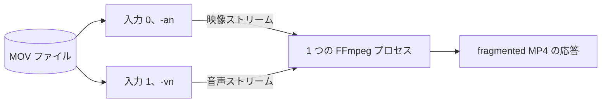
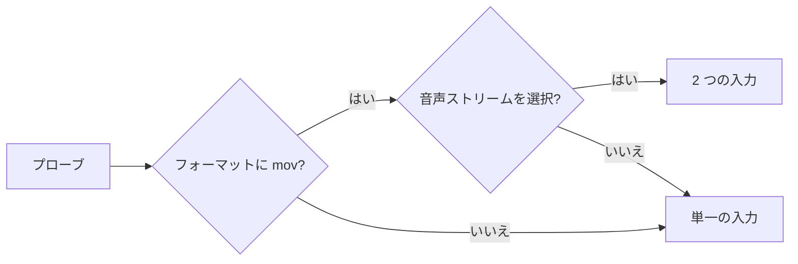

# MOV のライブ変換でのトラック別の入力 {#separate-track-inputs-for-mov-live-transcoding}

音声のある MOV では、ライブ変換は同じファイルを映像用と音声用の 2 つの FFmpeg 入力として開き、どちらのデマルチプレクサもトラック間を行き来してシークしないようにする（[`transcodeArgs`](../../internal/media/transcode.go)）。

1 つの FFmpeg プロセスがファイルを 2 回読み、各入力がリクエスト単位の fragmented MP4 の 1 ストリームを供給する。

## 決定 {#decision}

FFmpeg にパスを 2 つの入力として渡すのは、[ライブ変換のプローブ](live-transcode-seek.md#probe-reuse)のフォーマット名が `mov` を含み、選択する音声ストリームがある場合だけだ。

MOV デマルチプレクサはトラック間をシークしてパケットを時刻順に返し、ネットワークドライブ上ではこれにより最初の出力と継続中の変換が非常に遅くなる。1 つのトラックだけを追うデマルチプレクサはトラック間をシークしない。

| 入力 | フラグ | 対応付けるストリーム |
| --- | --- | --- |
| 0 | `-an`（音声を無効化） | 選択した映像ストリームのみ |
| 1 | `-vn`（映像を無効化） | 選択した音声ストリームのみ |

| 場合 | 動作 |
| --- | --- |
| シーク位置から開始する | 両方の入力に同じ `-ss` を渡す。デマルチプレクサは映像のキーフレームへシークし、`-vn` の入力は音声をその時刻に揃える |
| ファイル途中の位置から映像をコピーする | 音声は映像のキーフレームの時刻から始まる。トラック間の差は出力の `elst` に残る（[コピー経路](live-transcode-seek.md#copy-path-and-gap-limit)） |
| 映像をエンコードする | 両方の入力が要求された位置から始まる |
| 映像または音声のストリームが複数ある | 添付画像でない最初の映像ストリームと、プローブが選んだ音声ストリームだけを出力する |
| `interleaved_read` | 設定しない。デマルチプレクサは既定値のままにする |
| リクエストがキャンセルされる | 1 つのプロセスとともに両方の入力が止まる。ディスクにもデータベースにも何も書かない |

## 追加の負荷 {#added-load}

音声のある MOV はそれぞれデマルチプレクサを 2 つ使う。単一の入力よりファイルハンドル、デマックス処理、メタデータの読み込みが増え、トラックの配置と OS のキャッシュによっては 2 つの入力が同じ領域を読むことがある。この方式が保証するのはトラック間のシークが減ることであり、すべての MOV で I/O が減ることではない。

想定する利用は 1 人のユーザーによる 1〜2 件の同時視聴セッションなので、これを受け入れ、共有キャッシュや変換ワーカーは追加しない。同時に行う変換が増えたら、ファイルハンドルの上限、ネットワーク帯域、サーバーの CPU を測り直し、この決定を見直す。

| 採用しなかった案 | 理由 |
| --- | --- |
| `interleaved_read=0` | ファイル順の読み込みでは 1 つのトラックが大きく先行することがあり、マルチプレクサが待たされて最初の出力が期限に間に合わないか、再生が止まる。古い FFmpeg のビルドにはこのオプションがない |
| ローカルの一時ファイルへコピーする | 再生開始前に動画全体をコピーし、ローカルストレージの管理も必要になり、リクエスト単位の設計に反する |
| すべてのフォーマットで 2 つの入力を使う | 観測された問題は MOV デマルチプレクサにある。他のフォーマットで負荷を増やす根拠はない |
