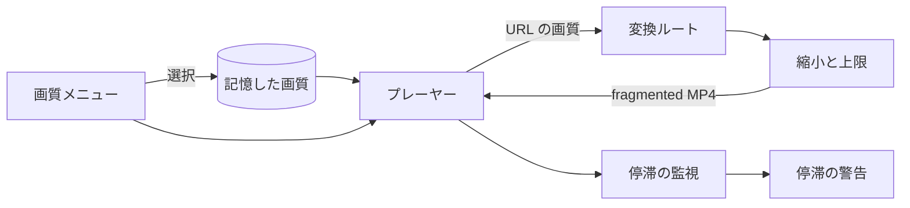
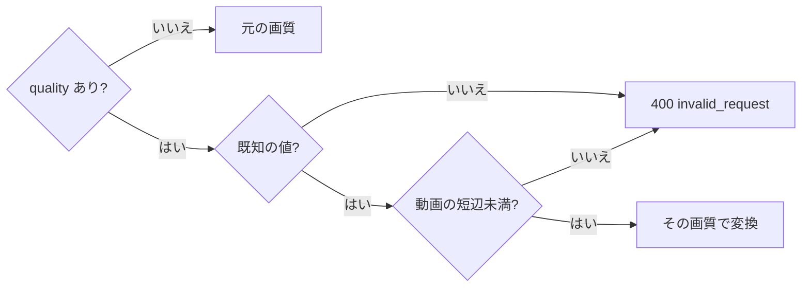
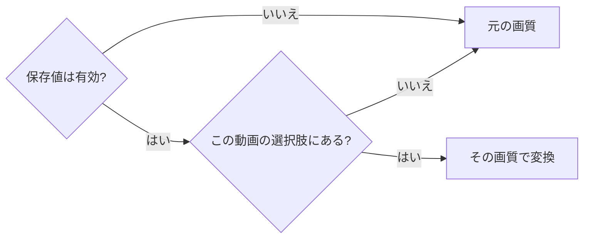
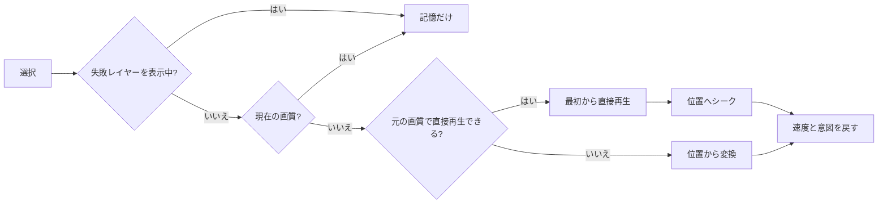
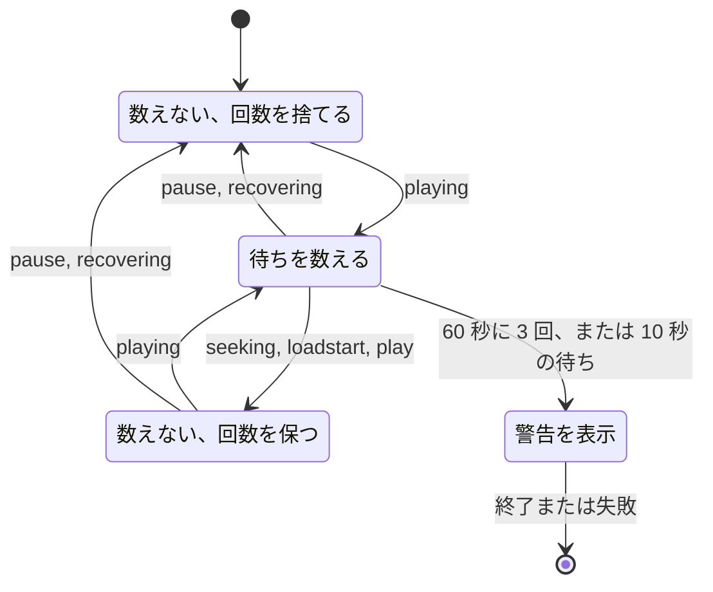

# 再生画質 {#playback-quality}

遅い回線の視聴者は小さい画質を選び、ライブ変換 (`GET /api/videos/{id}/transcode.mp4`) は動画を縮小してビットレートに上限を設ける。プレーヤーはその場で画質を切り替え、再生が止まると警告する ([`internal/domain/transcode_quality.go`](../../internal/domain/transcode_quality.go))。背景: [specs/027-playback-quality/](../../specs/027-playback-quality/plan.md) (親 Issue #521)。ライブ変換の開始は [live-transcode-seek.md](live-transcode-seek.md) に、エンコーダーの選択は [hardware-encoding.md](hardware-encoding.md) にある。

ブラウザーが画質を記憶し、プレーヤーがそれを各変換 URL に入れ、サーバーはその画質の上限に合わせてエンコードする。

## 変換 {#transcoding}

画質は表示上の短辺、映像ビットレートの上限、AAC 音声のビットレートを決め、3 つはそろって下がる。画質のない変換は従来のままだ。

遅い回線では元の画質 (コピーした映像、またはエンコード時の品質一定) が回線速度を超えるので、寸法、映像ビットレート、音声ビットレートのすべてを下げる必要がある。

| 画質 | 短辺 | 映像の上限 (`-maxrate`) | `-bufsize` | 音声 (AAC) |
| --- | --- | --- | --- | --- |
| `1080p` | 1080 | 5000 kbps | 10000 kbps | 128 kbps |
| `720p` | 720 | 2500 kbps | 5000 kbps | 128 kbps |
| `480p` | 480 | 1200 kbps | 2400 kbps | 96 kbps |
| `360p` | 360 | 700 kbps | 1400 kbps | 64 kbps |

画質は、その短辺が動画の表示上の短辺 (回転を適用したもの) より小さいときだけ選べる。寸法のない動画には選べる画質がない。拡大や同じサイズでのエンコードは、ストリームを重くするだけだ。

画質のある変換は、ない変換と次の点で異なる。

| 観点 | 画質があるとき |
| --- | --- |
| 映像 | 常にエンコードし、コピーしない。そのためストリームは要求した位置からちょうど始まる |
| 寸法 | 倍率は、画質の短辺に対する比と 3840×2160 の枠に対する比のうち小さい方。各辺は偶数に丸める |
| エンコーダー | 表の上限を受け取る ([エンコーダーの引数](hardware-encoding.md#encoder-arguments))。ソフトウェアへのフォールバックも同じ寸法と上限を使う |
| 音声 | 常に AAC (`-ac 2 -ar 48000`) で、表のレートを使う。コピーすると 256–320 kbps のままになる |
| 変わらない点 | H.264 High、Level 5.1、4:2:0 8-bit、2 秒ごとのキーフレーム、`-movflags`、fps、`setsar` |

短辺で決めるので、縦長の 1080×1920 は `480p` で 480×854 になり、横長と同じ重さになる。長辺が枠を超える動画だけが小さくなる。1200×12000 は `1080p`、`720p`、`480p` で 384×3840 に、`360p` で 360×3600 になる。

Go のテストは画面全体のノイズを `480p` で変換し、短辺が 480 で、平均映像ビットレートが 1.2 × 1200 kbps 以下であることを求める。CI はハードウェアエンコーダーを確認できない。ハードウェアエンコーダーは [quickstart.md](../../specs/027-playback-quality/quickstart.md) に沿って実機で確認する。

| 採らなかった案 | 理由 |
| --- | --- |
| 長辺で縮小する | 縦長の `720p` が 405×720 になり、横長より軽くなる |
| `-b:v` だけの平均ビットレート | 瞬間的な上限がないので、動きの多い場面が回線を超える |
| ffmpeg での `scale=-2:480` | ffmpeg にも向きが必要になり、Go の計算とそのテストが重複する |
| 枠を超えても短辺を保つ | 1080×10800 は H.264 Level 5.1 のフレーム上限を超える |

## API {#api}

変換ルートは省略可能な `quality` (`1080p`、`720p`、`480p`、`360p`) を受け取り、サーバーは各リクエストだけから画質を決める ([契約、`GET /api/videos/{id}/transcode.mp4` の `quality`](../../specs/027-playback-quality/contracts/transcode-quality-api.md#quality-on-get-apivideosidtranscodemp4))。

視聴者は再生中に画質を切り替える。サーバー側の記憶や画質ごとのルートでは、シークや再開のリクエストごとにどの画質が対応するかを追跡しなければならない。

ルートは変換を始める前に値を確認する。

寸法のない動画には選べる画質がないので、これも 400 になる。開始ログ (Debug) は `quality` か `quality=original` を持つ。`startMs` と `attempt` はこれまでどおり働き、動画は常にエンコードされるので `transcode-start` は `startMs` と等しい。応答とエラーの形は変わらず、ルートは公開動画ではゲストにも開いたままだ。

| 採らなかった案 | 理由 |
| --- | --- |
| 画質ごとのルート | 開始位置の台帳と公開の境界がルートごとに重複する |
| サーバーが画質を記憶する | ゲストには視聴者の識別子がなく、URL だけでは出力が決まらなくなる |
| 選べない画質を別の画質に対応させる | 画面上の画質と再生される画質が食い違う |

## 選択肢と記憶した画質 {#options-and-remembered-quality}

ブラウザーはすべての動画に共通の画質を 1 つ記憶し、動画はそれがその動画の選択肢にあればその画質で、なければ元の画質で再生される ([`playbackQuality.ts`](../../web/src/preferences/playbackQuality.ts))。

画質は動画ではなく回線に合わせるものなので、次の動画、シーク、ネットワーク障害後の再読み込みを経ても残る必要がある。

| 規則 | 振る舞い |
| --- | --- |
| 保存先 | `localStorage` のキー `vv.playback-quality.v1`、JSON 文字列 (`"480p"`、`"original"`)。サーバーには送らない |
| 値がない、壊れている、未知、またはストレージがない | 元の画質 |
| 選択肢 | 動画の短辺より小さい画質を大きい順に並べる。寸法がなければなし |
| 枠による強制的な縮小 | 考慮しない。規則はサーバーの短辺の確認と一致する |
| 選べない記憶した画質 | 元の画質で再生する。記憶した値は次のより大きい動画のために残す |
| 元の画質以外 | 直接再生できる動画でも、再開位置から変換する |
| バッファー外へのシーク、ネットワークの再読み込み | 同じ画質で組み立て直し、画質なしにはしない |
| 変換の表示 | `Converting to 480p` と戻し方を示す ([ui-design.md](../../specs/027-playback-quality/ui-design.md#control-bar-transcode-indicator))。画質名は翻訳しない |

| 採らなかった案 | 理由 |
| --- | --- |
| サーバーが画質を記憶する | ゲストには視聴者の識別子がない ([API](#api) を参照) |
| 選べない記憶した画質を上書きする | 小さい動画 1 本で、回線に合わせて選んだ画質が失われる |
| サーバーの応答に選択肢を含める | 規則は寸法の比較だ。`Video` の形と往復が増える |

## 切り替え {#switching}

コントロールバーで選んだ画質は、同じプレーヤーのソースを現在位置で置き換え、再生中か一時停止かを前のまま保つ ([`qualityMenu.ts`](../../web/src/player/qualityMenu.ts))。

回線速度は再生中に変わり、最初から、または停止した状態からやり直す切り替えは、それ自体が視聴を中断させる。

メニューは再生速度の前に置く。項目は元の画質 (`Original (1080p)`) と動画の選択肢で、選択肢のない動画には `No smaller sizes for this video` という注記を表示する。ボタンは現在の画質を示し、元の画質では短辺を、寸法がなければ `Orig` を示す。

各選択はすぐに記憶され、次の分岐を通る。

直接再生を読めずに変換へ切り替わった動画は、元の画質の変換のままになる。記憶した画質を選べないために元の画質で再生しているとき、元の画質を選ぶと記憶した値を置き換える。失敗後の再試行は、記憶した画質でプレーヤーを作り直す。

保留する切り替えは最新の 1 つだけだ。新しい選択は待っている選択を置き換え、メタデータは要素の現在のソースに属するときだけ数える。新しいソースが要素に届いたら (`loadstart`)、バッファー外へのシークが URL を変えても切り替えは完了する。ブラウザーは古いリクエストを中止し、それがサーバーでその変換を止める。古い開始位置の報告は attempt で破棄する。ネットワークの再読み込みを待っている間の選択は、待ちを取り消して選んだ画質を読み込む。新しいソースの失敗は通常のエラー経路を通り、切り替えた位置から再試行する。

| 採らなかった案 | 理由 |
| --- | --- |
| プレーヤーを作り直す | ポスターに戻り、コントロールバーを隠し、全画面の状態を組み立て直す |
| React のポップオーバーメニュー | 速度メニューの見た目、開き方、キーボード操作を作り直して同期させ続ける必要がある (research.md R-4) |

## 停滞の警告 {#stall-warning}

数える対象のデータ待ちが 60 秒以内に 3 回以上始まるか、1 回が 10 秒を超えて続くと、再生は停滞したと判断する。そのときバナーがそれを伝え、再生を止めず画質も変えない ([`stallMonitor.ts`](../../web/src/player/stallMonitor.ts))。

視聴者には、回線と動画のどちらに原因があるのか分からない。シーク、開始、切り替えの直後の待ちは速い回線でも起きるので、それを数えると警告が多すぎる。

データ待ちは `waiting` から次の `playing` までだ。数え方は次の状態をたどる。

`loadstart` は最初の読み込み、画質の切り替え、再読み込みを含む。いったん停滞と判断すると、その判断は再生の終了か失敗まで続く。

| 警告の振る舞い | 規則 |
| --- | --- |
| 位置 | プレーヤーの左上の小さいバナー。状態オーバーレイのコンテナーの外に置く |
| 操作 | × だけがポインター入力を受け取る。`role="status"` |
| 隠す条件 | 失敗、再生終了、次の動画、再接続中、取り込み中のレイヤーが表示されている間 |
| 読み込みスピナー | 10 秒の判断は待ちの最中に起きるので、一緒に表示する |
| 閉じた状態 | 動画 id ごとに保ち、再試行をまたいでも保つ。別の動画では忘れる |
| 動作 | なし。画質の提案も自動での引き下げもしない |

| 採らなかった案 | 理由 |
| --- | --- |
| `buffered` や `progress` から速度を推定する | 自動切り替えにつながり、`progress` の間隔はブラウザーによって大きく異なる |
| 状態オーバーレイのコンテナーのレイヤー | 一度に 1 つのレイヤーを中央の操作と排他で表示するので、中央の操作を塞ぐ |
| 画面の隅のトースト | 全画面では見えず、プレーヤーに結びつかない |
