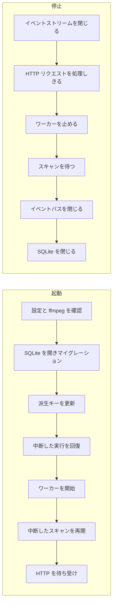

# プロセスのライフサイクル: 起動と停止の順序 {#process-lifecycle-startup-and-shutdown-order}

`cmd/mdm` はサーバーの各部分を依存の順に起動し、どの部分がどの部分に供給するかの逆順に停止する ([`cmd/mdm/main.go`](../../cmd/mdm/main.go))。デスクトップアプリは、ウィンドウが開くときと閉じるときに同じ手順を実行する ([windows-app.md](windows-app.md))。

図は 2 つの順序を示す。起動は上から下へ、停止はリスナーからデータベースへ戻る順だ。

## 起動の順序 {#startup-order}

派生データを書く手順はすべて、何かがそれを読む前に終わる。リスナーは最後に開く。

| 手順 | 失敗したとき |
| --- | --- |
| 設定、`PATH` 上の `ffmpeg`/`ffprobe`、SQLite、マイグレーション | 起動が止まる |
| 場所とタグ名の検索キー | 起動が止まる。そのため、検索が古い規則で作ったキーで動くことはない ([013 data-model §5](../../specs/013-library-search/data-model.md)) |
| フォルダ索引 | ログに記録する。次の再構築まで前の索引が残る ([017 data-model §3](../../specs/017-folder-groups/data-model.md)) |
| `.tmp` 以下の未完成の生成物 | ログに記録する |
| 中断したスキャンの再開 | ログに記録する。ユーザーはスキャンを開始できる |
| エンコーダの確認 | バックグラウンドで実行し、リスナーを遅らせることはない ([hardware-encoding.md](hardware-encoding.md)) |

フォルダ索引は検索キーが作るタイトルのキーを読むので、検索キーの後に更新する。未完成の生成物はワーカーの開始前に削除するので、まだ生成中のものが削除されることはない。

## 中断した実行の後の回復 {#recovery-after-an-interrupted-run}

作業の途中で止まった実行は実行中の行を残し、起動はそれらを次の実行が続きから進められる状態に戻す。中断したスキャンは理由 `interrupted` で `failed` として閉じ、実行中のジョブは `queued` に戻し、ワーカーが動き出すと新しいスキャンを 1 つ開始する ([037 research R-9](../../specs/037-windows-app/research.md#r-9-an-interrupted-last-scan-restarts-automatically-at-startup-for-every-way-of-starting))。

## 停止の順序 {#shutdown-order}

停止は各部分を、それが供給する部分より先に止める。そのため、すでに止まった部分に何かが書き込むことはなく、実行中のジョブはキューに戻る。

`/api/events` のストリームは自然には終わらないので、10 秒のリクエストの猶予が始まる前に閉じる。取り消したジョブは `running` のまま残り、次の起動がそれを再投入する。ジョブがキューとワーカーの間で失われることはない。

## 生成物の削除は購読を外さず処理しきる {#artifact-removals-drained-not-unsubscribed}

生成物の削除の購読は決して外さない。イベントバスを閉じると、SQLite が閉じる前に、キューにあるすべての削除が届く ([`cmd/mdm/events.go`](../../cmd/mdm/events.go))。

動画を削除するスキャンは、止まるときに、それらの動画が解放した内容を発行する。先に購読を外すと、それらの通知が捨てられ、生成したファイルが残る。サムネイルのディレクトリを掃除するものは他にないので、そのファイルを後で削除するものはない。

## スキャンの猶予期間 {#scan-grace-period}

停止は、リクエストの猶予とは別に、スキャンが止まるのを最大 10 秒待つ。

応答しないマウントからの読み取りは取り消しで戻らないので、上限のない待機では停止が終わらなくなりうる。猶予を過ぎると停止は先へ進み、スキャンの行は `running` のまま残り、次の起動がそれを閉じる ([中断した実行の後の回復](#recovery-after-an-interrupted-run) を参照)。

| 採用しなかった案 | 理由 |
| --- | --- |
| 上限なしでスキャンを待つ | 応答しないマウントがプロセスの終了を妨げる |
| スキャンを待たずにバスを閉じる | スキャンの削除通知が捨てられる |
