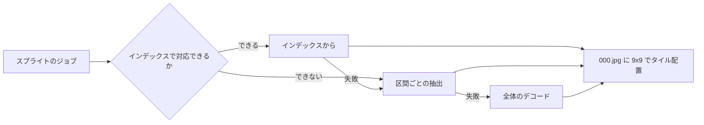
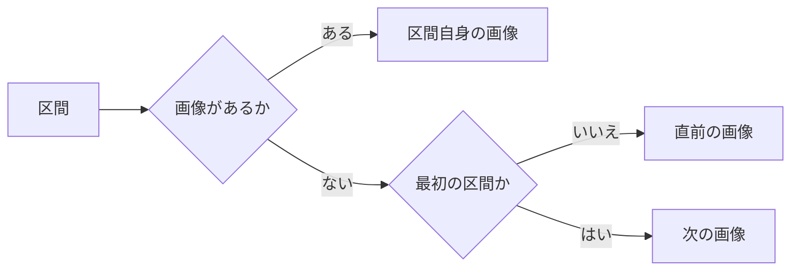
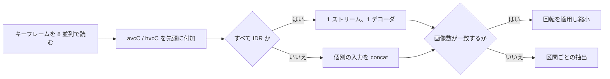
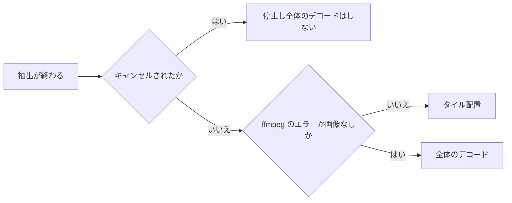

# シーク用スプライトの生成 {#seek-sprite-generation}

シーク用プレビューは最大 81 フレームからなる 9×9 のスプライト 1 枚で、各フレームは長辺 320px 以内に収まり、JPEG として `-q:v 2` でエンコードする（[`internal/media/seek_thumbnail.go`](../../internal/media/seek_thumbnail.go)）。間隔は `max(5 s, ceil(durationMs / 81))` なので、短い動画は 5 秒のままで、長い動画は 81 フレームを均等に配置する。長さが不明な動画は 1 フレームになる。フレーム k は `[k × intervalMs, (k + 1) × intervalMs)` を受け持ち、プレーヤーはレイアウト（[`domain.SeekSpriteLayout`](../../internal/domain/seek_sprite.go)）の `intervalMs`、`frameCount`、`columns`、`rows` からフレームを選ぶ。

生成は最も安価な方法から試し、失敗すると次の方法にフォールバックする。

## フレームの選択 {#frame-selection}

自身の画像がない区間は直前の区間の画像を使う。直前の区間がない最初の区間だけは次の区間の画像を使う。

空の区間は失敗ではなく通常の状態だ。コンテナが映像ストリームより少し長いと最後の区間が終端を越え、キーフレームの間隔がスプライトの間隔より長いこともある。それ以外の場合に後の場面を前へ繰り上げることはない。

## インデックスからの生成（MP4/MOV の H.264/HEVC） {#generation-from-the-index-h264hevc-in-mp4mov}

MP4/MOV の最初の映像トラックが H.264 または HEVC のとき、`moov` のサンプルテーブルを 1 回だけ読み、各区間は区間内の最初のキーフレーム、なければ区間より前の最後のキーフレームを 1 つ使う。

キーフレームの時刻は `stts`、`ctts` とエディットリストから求め、エディットリストの終端より後のキーフレームは候補にしない。そのためフレームは区間の正確な開始点ではなく近くのキーフレームになるが、ほとんどの動画はキーフレームが数秒おきにあるので差は小さい。その代わり、動画 1 本で読むのはインデックスと選んだキーフレーム（それぞれ数十〜数百 KB）だけで、フレームごとの `ffmpeg` の起動やインデックスの再読み込みも、目標時刻までのデコードもない。

選んだキーフレームは次の手順で処理する。

| 手順 | 規則 |
| --- | --- |
| 共有されるキーフレーム | キーフレームを共有する区間は、そのキーフレームを 1 回だけ読んでデコードし、画像を複製する |
| すべて IDR | 1 つのストリームに連結する。IDR は順序カウントとデコーダの状態をリセットする |
| 一部が IDR でない（オープン GOP の CRA、IDR でない I フレーム） | キーフレームごとに 1 つの入力とし、`concat` フィルタで結合する。1 つのストリームにすると順序カウントが引き継がれ、キーフレームをまたいでフレームの順序が入れ替わる。入力ごとの起動の分だけ遅い |
| 画像数が異なる | フレームがずれるので結果を破棄する |
| 回転 | 生のストリームでは `tkhd` の表示行列が失われるので、90 度単位の回転を縮小の前にかけ直す（`transpose`、`hflip,vflip`） |
| 期限または停止 | 読み込みは待たずに戻るので、応答しない保存場所でジョブが止まったままになることはない |

次の入力は直接、区間ごとの抽出に進む。

| 入力 | 理由 |
| --- | --- |
| `moov` がない（フラグメント化 MP4 など） | 読むサンプルテーブルがない |
| MP4/MOV でない、または映像が H.264/HEVC でない | インデックスの経路が読む範囲の外にある |
| サンプル記述が複数ある | 途中で解像度などが変わる |
| 空でないエディットが複数ある | 途中の部分が切り取られている |
| 回転以外を含む表示行列（反転など） | その変換はかけ直さない |

壊れたインデックスなど、読み込みやデコードに失敗したときは警告をログに出し、区間ごとの抽出に切り替える。

## 区間ごとの抽出 {#per-interval-extraction}

インデックスで対応できない入力では、フレームごとに `ffmpeg` を 1 回起動し、入力側で区間の開始点へシークし、区間の終端で止め、フレーム番号を名前にした BMP を書き出す。同時に最大 4 つまで実行する。

フレーム番号で名前を付けるので、配置は終了順に左右されない。映像ストリームが複数ある入力では、添付画像でない最初のストリームを使う。一時的な BMP は成功、失敗、キャンセルのいずれでも削除し、公開前に `internal/artifacts` が完成した出力を検査する。

次の 2 つの場合、生成は同じフレーム数、サイズ、レイアウトのまま全体のデコードにフォールバックする。

30 分の処理上限は、抽出、タイル配置、フォールバックを合わせた時間に適用する。

全体のデコードは代替処理であり、ログに出し、最近の取り込みの問題 `seek_thumbnail_full_decode` として記録する（[specs/024-import-progress/research.md](../../specs/024-import-progress/research.md) R-7）。区間ごとの抽出は対象の入力にとって通常の経路であり、代替処理ではない。

| 場合 | 記録する問題 |
| --- | --- |
| 今回の実行で全体のデコードをした | 代替処理を記録し、`fullDecode` を `sprite.json` に保存する |
| 公開から完了までの間に停止した後の再実行 | `sprite.json` から `fullDecode` を読み戻して記録する |
| 同じ内容の別の動画がスプライトを採用する | `fullDecode` を読み戻して記録する |
| `fullDecode` のない古い `sprite.json` | 問題の行は変更しない |

6 枚のシートに最大 600 フレームを持つ古いスプライトも引き続き読める。一括では再生成せず、新しい方式は新たに処理するジョブに適用するので、キューは増えない。

## フレームサイズと画質 {#frame-size-and-quality}

Library のカードは 1 フレームをカードの幅（220–480px）まで引き伸ばすので、フレームサイズがカードのスクラブプレビューの鮮明さを決める。160px のフレームは 2–3 倍に、高密度の画面では 4–6 倍に引き伸ばされていた。そのためフレームは長辺 320px とし、引き伸ばしてもブロックの境界が見えないよう JPEG の量子化値を 2 にする。

デコードにかかる時間は出力サイズによらず同じだ。増えるのは縮小、タイル配置、エンコードだけで、動画 1 本あたり約 0.04–0.07 s 増える。`scripts/previewbench` で `testsrc2` の H.264 入力を使い、4 コアの Xeon 2.1 GHz で計測した。

| 入力 | 160px、`-q:v 4` | 320px、`-q:v 2` |
| --- | --- | --- |
| 2 時間、640×360 | 0.23–0.25 s、207 KiB | 0.29 s、758 KiB |
| 2 分、1280×720 | 0.17 s、67 KiB | 0.24 s、236 KiB |
| 21 分、1920×1080 | 0.40–0.41 s、160 KiB | 0.45–0.48 s、615 KiB |

シートは約 3.5 倍大きくなる。ブラウザが 2880×1620 のシート（デコード後で約 19 MB）を保持するのは、カードのシートを読み込んでいる間だけで、カードはビューポートから外れるとシートを解放する。既存の 160px のスプライトは、その動画が再び処理されるまでそのまま残る。

## 速度と制約 {#speed-and-limits}

ローカルディスク上の 21 分の 1080p H.264 動画、160px の 81 フレーム、全キーフレームが IDR の条件で計測した。各計測では時間だけでなく内容も確認している。

| 方式 | 時間 | 読み込んだデータ量 |
| --- | --- | --- |
| 区間ごとの抽出（4 並列） | 5.6–5.9 s | 数百 MB。フレームごとにインデックスを読み直し、キーフレームからデコードする |
| インデックスから | 0.37 s | 約 15 MB（インデックス約 4 MB と 81 個のキーフレーム） |
| インデックスから、81 個の別々の入力 | 1.6–1.8 s | —（IDR でない場合の経路） |

ランダム読み込みが遅いストレージでは、時間は読み込み回数（インデックスに 1 回とキーフレームごとに 1 回）とレイテンシの積に従う。そこでもインデックスからの生成は区間ごとの抽出より速いが、フレームごとに 1 回の読み込みは残る。
