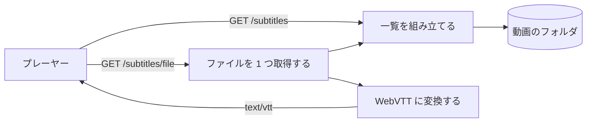
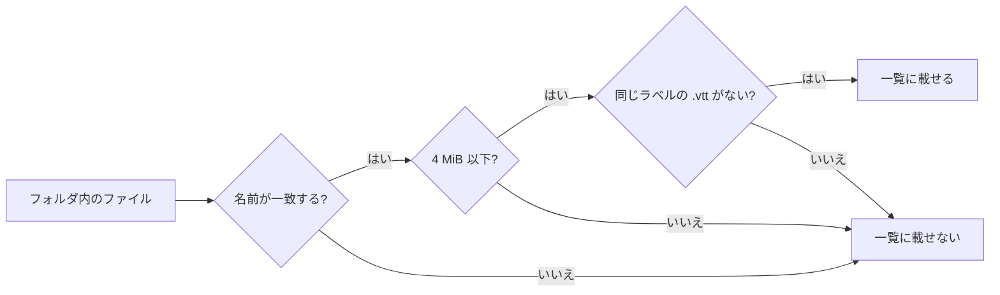
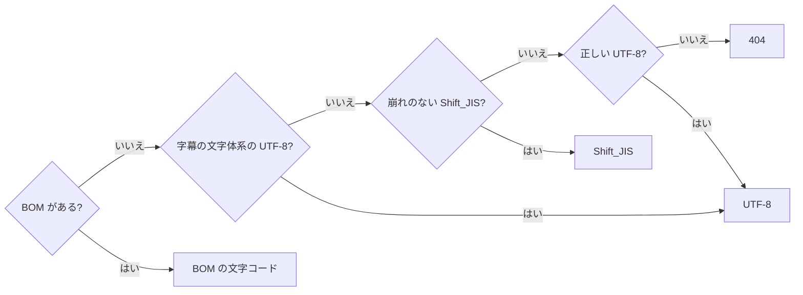
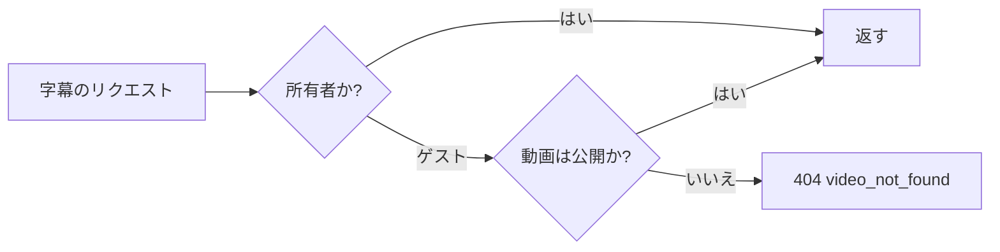
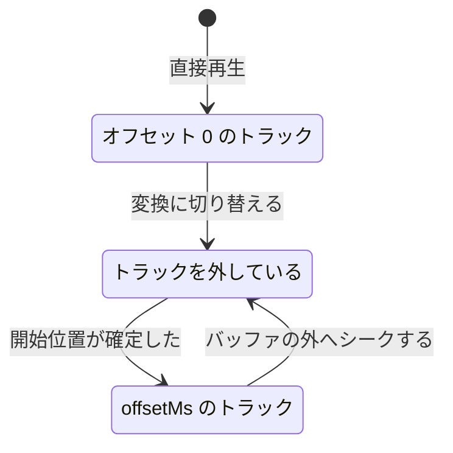

# 隣の字幕ファイル {#sidecar-subtitle-files}

VVMDM は、動画の隣に置かれた SRT と WebVTT のファイルを字幕として表示し、リクエストのたびに WebVTT へ変換する ([`internal/httpapi/subtitles.go`](../../internal/httpapi/subtitles.go))。背景: [research.md](../../specs/028-sidecar-subtitles/research.md)。API: [contracts/subtitles-api.md](../../specs/028-sidecar-subtitles/contracts/subtitles-api.md)。

プレーヤーは 2 つのリクエストを送る。一方は字幕を一覧し、もう一方はそのうちの 1 つを取得する。どちらも動画のフォルダを読み、何も保存しない。

## 検出 {#discovery}

字幕はインデックスせず、リクエストのたびに動画のフォルダを読んで見つける ([`domain.SubtitleSidecars`](../../internal/domain))。

そのため、ファイルを追加・削除すると再スキャンなしで次の一覧に反映され、フォルダと同期させておくテーブルやジョブも要らない。一覧では名前とサイズだけを読むので、負荷は小さいままだ。

再生に使う所在のフォルダにある各ファイルは、次の確認を通る。`<name>` は動画名から拡張子を除いたもので、NFC 正規化したうえで大文字と小文字を区別せずに比較する。

名前が一致するのは、`<name>.srt`、`<name>.vtt`、`<name>.<label>.srt`、`<name>.<label>.vtt` のいずれかのときだ。

一覧は、ラベルのないファイルを先頭に置き、続けてラベルを自然順に並べる。

| 場合 | 一覧の応答 |
| --- | --- |
| 壊れたファイル | 一覧に載る。取得すると 404 を返す |
| 開ける所在がない | 404 `file_unavailable` |
| フォルダを読めない | 空の一覧。理由はログに記録する |

| 採用しなかった案 | 理由 |
| --- | --- |
| スキャン中に字幕をインデックスする | 後から追加した字幕は、再スキャンしないと表示されない |

## 取得と変換 {#fetching-and-conversion}

ファイルは、その名前が新たに組み立てた一覧にあるときに限り返す。変換は `ffmpeg` を使わずに Go で実行する ([`internal/media`](../../internal/media))。

一覧と照合するので、リクエストの文字列がパスになることはなく、`..` でメディアフォルダの外に出ることはできない。開くときにメディアフォルダの規則を再び確認するので、一覧を作った後にシンボリックリンクに置き換えられたファイルはたどらない。

文字コードは次の順で決める。

崩れのない Shift_JIS とは、`U+FFFD` も C1 制御文字も出さずにデコードできるものだ。

| 入力 | 動作 |
| --- | --- |
| SRT | WebVTT に書き換える。時刻を読めないキューは捨てる |
| `offsetMs` | すべてのキューから引く。終了が 0 以下になるキューは捨てる |
| 一覧にない名前、`.vtt` に隠された `.srt`、4 MiB 超、読めない | 404 `subtitle_unavailable` |
| 不正な `offsetMs` | 400 `invalid_request` |
| 一致する `If-None-Match` | 304 |

| 採用しなかった案 | 理由 |
| --- | --- |
| `ffmpeg` で変換する | 文字コードを判定しないので、いずれにせよ Go で判定する必要がある。残るのは小さなテキストの書き換えで、リクエストごとにプロセスを起動するほどの価値はない |

## アクセス制御 {#access-control}

ゲストは、再生してよい動画の字幕を、動画そのものと同じ規則で取得してよい ([`internal/httpapi/auth.go`](../../internal/httpapi/auth.go))。

非公開の動画には存在しない動画と同じ応答を返し、動画を非公開にすると処理中のリクエストは打ち切られる。

## ライブ変換の時刻合わせ {#live-transcoding-time-alignment}

ライブ変換中は、サーバーが字幕を `offsetMs` だけずらし、プレーヤーは開始位置が確定するたびにトラックを付け直す ([`subtitleTracks.ts`](../../web/src/player/subtitleTracks.ts))。

プレーヤーは、シーク位置を 0 として始まる変換後のストリームの時刻でキューを選ぶ。プレーヤーが自分の時計に加えるオフセットは字幕には届かないので、サーバーが字幕をずらす必要がある ([research.md R-6](../../specs/028-sidecar-subtitles/research.md))。

トラックは、次の状態を経て開始位置に追従する。

付け直しても、それまで表示していたラベルを保つ。待っている間はトラックを外すので、ずれた字幕は一瞬たりとも表示されない。付け直しは変換が再開するときにだけ起こり、それにはどのみち数秒かかる。その間、字幕ボタンは隠れる。
