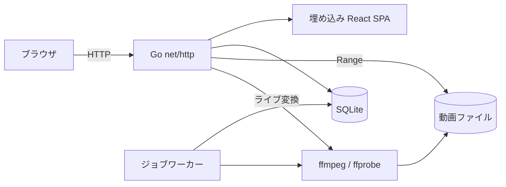
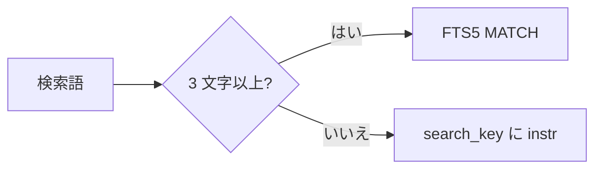

# 技術選定: MDM (Media Data Management) {#technology-selection-mdm-media-data-management}

VVMDM は動画ファイルをインデックスし、ブラウザで再生する 1 つの Go バイナリだ。この文書は、各層がどの技術を使うか、その理由を記録する。機能とデータの境界は [`ARCHITECTURE.md`](../../ARCHITECTURE.md) にある。

バイナリは、メディアファイルと、子プロセスとして実行する `ffmpeg` を除くすべての部分を持つ。

## 前提 {#premises}

| 項目 | 決定 |
| --- | --- |
| 配置 | 1 台のマシンでのセルフホスト: NAS または小型サーバー上の Docker |
| クライアント | Web ブラウザのみ (PC とスマートフォン) |
| 動画の扱い | 対応形式は元のファイルから配信し、それ以外はリクエストごとにライブ変換する |
| ユーザー | アカウントは 1 つ。ゲストは公開動画を視聴できる |
| ライブラリの規模 | ローカルディスク上の最大数万本、数 TB の動画 |

## 選定基準 {#selection-criteria}

システムはその人自身のマシン上で 1 人のユーザーに提供するので、スループットより**運用の単純さ**と**障害後の復旧**を優先する。

1. **1 つのコンテナに 1 つのプロセス。** 常駐するミドルウェア (Redis、メッセージブローカー、別の DB サーバー) を置かない。
2. **ユーザーデータと分けた、再構築できるインデックス。** スキャンは動画ファイルからインデックスを復元する。再生位置や認証情報は復元できない ([データの分類](../how-to/running-vv.md#data-and-recovery))。
3. **ツールで強制する境界。** Lint により、ドメイン層が HTTP、DB、`ffmpeg` に依存するのを止める。
4. **重い処理は境界の内側に置く。** `ffmpeg` を実行するコードはアダプタに置き、HTTP やストレージから分ける。

## 決定 {#decisions}

| 層 | 選択 | 主な理由 |
| --- | --- | --- |
| バックエンドの言語 | Go (バージョンは `go.mod`) | 単一バイナリになる。標準ライブラリが常駐プロセスと子プロセスを扱える。NAS 上でのメモリ使用量が小さい |
| HTTP サーバー | 標準の `net/http` (Go 1.22+ の `ServeMux`) | メソッドによるルーティングとパスのワイルドカードが組み込まれており、`http.ServeContent` が Range 配信を実装している |
| 動画の配信 | 対応形式は `http.ServeContent`、それ以外はリクエストごとの fragmented MP4 | 変換結果は保存しない ([ライブ変換のシーク](live-transcode-seek.md)) |
| フロントエンド | React + Vite + React Router + Tailwind CSS、コンポーネントは Radix 上の shadcn/ui | 静的ビルドを `embed` でバイナリに埋め込む SPA。コンポーネントとトークンが[デザインシステム](design-system.md)を構成する |
| API 契約 | OpenAPI 3.1 を元にし、Go は `oapi-codegen`、TypeScript は `openapi-typescript` で生成する | 2 言語間の型のずれがコンパイルエラーになる |
| DB | SQLite (`modernc.org/sqlite`、CGO なし、WAL モード) | 小さな alpine イメージ向けに静的バイナリとしてクロスコンパイルできる |
| クエリ | `database/sql` を通した手書き SQL | FTS5 を含め、SQL が一次情報のままになる |
| マイグレーション | `goose`、マイグレーションは `embed.FS` に置く | 外部ツールなしでバイナリが適用する |
| 全文検索 | SQLite FTS5 (`tokenize='trigram'`) | トークナイザや検索エンジンを追加せずに日本語の部分文字列検索ができる |
| メディア解析 | `ffprobe` / `ffmpeg` を `os/exec` 経由で実行し、タイムアウトは `context` で設定 | ラッパーを挟まないので、引数と失敗の理由が明示的なままになる |
| 認証 | ユーザー名とパスワード (Argon2id、`golang.org/x/crypto/argon2`) + SQLite に保存する HttpOnly Cookie セッション | 1 人のユーザーには十分。公開には HTTPS のリバースプロキシが必要 |
| 非同期処理 | SQLite のジョブテーブル + goroutine ワーカー、`context` で停止する | 別プロセスもブローカーも要らない。再起動後にジョブが再開する |
| ログ | JSON ハンドラを使う `log/slog` | 依存を追加せずに構造化ログを出せる |
| テスト | Go の `testing` + `net/http/httptest` + Playwright | 再生が始まることはエンドツーエンドテストでしか確かめられない |
| Lint | `golangci-lint` (`depguard` を使用) | 層をまたぐ import を CI が拒否する |
| 配布 | Docker (マルチステージ、alpine + `ffmpeg`) + Compose。Windows では各 GitHub Release に `VVMDM.exe` と `ffmpeg` の zip を置く ([Windows デスクトップアプリ](windows-app.md#distribution)) | CGO がないのでバイナリが alpine で動き、Windows 向けにクロスコンパイルできる。zip は Docker も `ffmpeg` のインストールも要らない |

パッケージの責務と依存の方向は [ARCHITECTURE.md](../../ARCHITECTURE.md#intended-dependency-direction) にある。SQLite はインデックスとユーザーデータの両方を持ち、復旧時は[データの分類](../how-to/running-vv.md#data-and-recovery)で両者を区別する。

内容の鍵は、移動や名前の変更をまたいで動画を識別する。先頭と末尾の 1 MiB とファイルサイズの SHA-256 だ。ファイル全体を読む必要がなく、標準ライブラリだけで済む。

## 不採用の候補 {#rejected-alternatives}

| 候補 | 不採用の理由 |
| --- | --- |
| TypeScript / Node.js のバックエンド | Range 配信とプロセス管理を手書きすることになり、`better-sqlite3` はネイティブの再ビルドが必要 |
| Python + FastAPI | 配布が重く、常駐ワーカーと依存管理のコストがセルフホストには大きすぎる |
| Echo / Gin / Fiber | 標準の `ServeMux` で十分。Fiber は `net/http` 互換ではなく、`ServeContent` を使えなくなる |
| GORM / ent / `sqlc` | FTS5 を含め、SQL は抽象化や生成をせず書いたまま保つ |
| `mattn/go-sqlite3` | CGO が必要で、クロスコンパイルと alpine でのビルドが複雑になる |
| PostgreSQL | 1 アカウントの配置に、別のコンテナとバックアップ手順が必要になる |
| Meilisearch / Elasticsearch | 検索品質は上だが常駐プロセスになる。数万件なら FTS5 trigram で実用になる |
| SvelteKit | 有力な候補。React が勝ったのはエコシステムと将来の人員確保の点だけだ |
| 起動時の HLS 一括変換 | ストレージと CPU のコストが大きい。リクエストごとのライブ変換で置き換える |
| Redis + 外部ジョブキュー | 各段階は 1 件ずつ処理するので、SQLite のテーブルと goroutine で扱える |
| S3 / MinIO | ローカルディスクを正とする方針と衝突し、Range 配信に中継が加わる |
| Jellyfin / Plex の採用 | このリポジトリは設計上ゼロから作る。これらは機能の参考にとどめる |

## 既知のリスクと対策 {#known-risks-and-mitigations}

| リスク | 対策 |
| --- | --- |
| フロントエンドとバックエンドで 2 言語になる | `api/openapi.yaml` から両側を生成するので、ずれはコンパイルエラーになる。`task build` が SPA のビルド、埋め込み、Go のビルドを 1 つのタスクとして実行する |
| FTS5 trigram は短い語を取りこぼす | 検索は語の長さで経路を分ける (下記) |
| ファイル名の Unicode 正規化 | NFC に正規化するのは表示名と検索文字列だけだ。実際のパスはファイルシステム上の表記を保つ。Linux では正規化したパスが別の、存在しないエントリを指しうるためだ |
| 大規模スキャン中の I/O 飽和 | 解析、サムネイル、プレビューはそれぞれ 1 件ずつ実行する。進捗は `jobs` テーブルから数え、`/api/events` で送る |

trigram の `MATCH` は 2 文字以下の語に一致できないので、各検索語は 2 つの経路のどちらかを通る ([`internal/store/search.go`](../../internal/store/search.go))。

