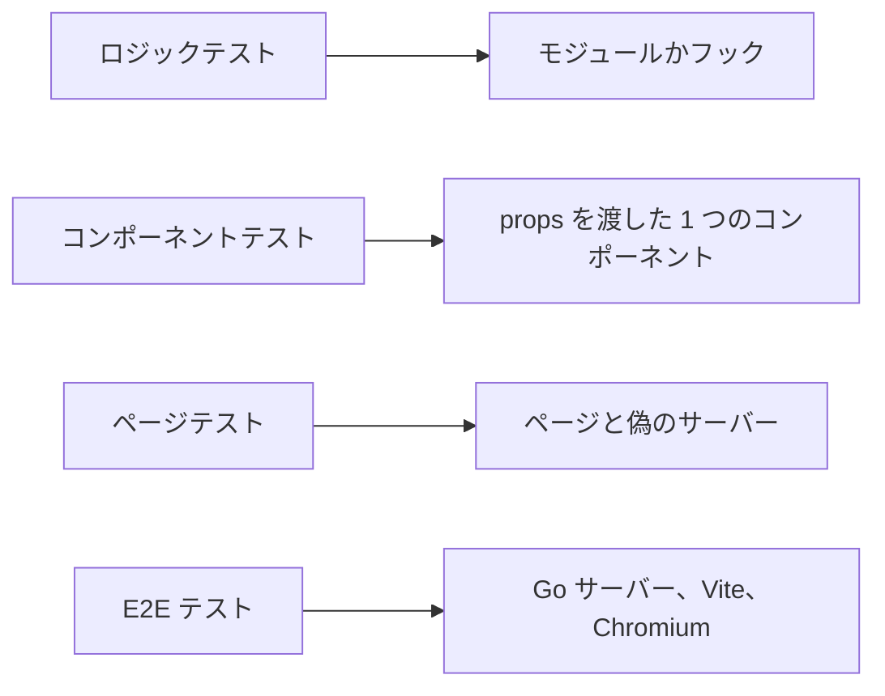
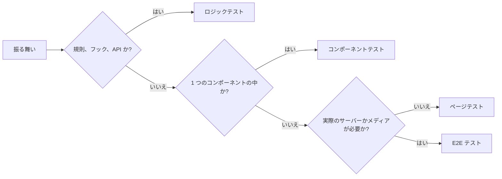

# Web のテストレベル {#web-test-levels}

Web クライアントの振る舞いは、その振る舞いが壊れたときに失敗する最も低いレベルでテストする。ユニットテストは jsdom 上の Vitest と Testing Library で動き (`task test-web`)、ブラウザテストは実際のサーバーに対して Playwright で動く (`task test-e2e`)。

図は 4 つのレベルと、それぞれが描画するものを示す。

## テストレベル {#test-levels}

各レベルは異なる種類の振る舞いを、テスト 1 件あたり異なるコストで証明する。

| レベル | 証明するもの | 描画するもの | テスト 1 件あたりのコスト |
| --- | --- | --- | --- |
| ロジックテスト | 規則 (並び順、絞り込み、検証、書式)、フック、または API モジュール | なし、または `renderHook` を通したフック。モジュールが `fetch` を呼ぶところではそれをスタブにする | 0.01 秒 |
| コンポーネントテスト | 与えた props に対して 1 つのコンポーネントが表示し発行するもの | provider の中のそのコンポーネント | 0.10 秒 |
| ページテスト | コンポーネントをまたぐ流れ、リクエストの順序、部品間のフォーカス移動、URL の状態 | `fetch` を偽のサーバーに置き換えた `*Page` コンポーネント | 0.35 秒 |
| E2E テスト | 実際のサーバー、ブラウザ、メディアだけが示すもの: 再生、セットアップとログイン、スキャン | ビルドした Go サーバーを相手に、Vite の開発サーバーから配信したアプリを Chromium で動かしたもの | 数秒。`main` への push でだけ動く |

コストは、Vitest の 1 回の全体実行におけるテスト 1 件あたりの平均ワーカー時間である。

E2E は Vite の本番ビルドも、それを Go のバイナリに埋め込むことも扱わない。`task test-web` は SPA をビルドするが、そのビルドを配信するテストはない。

## レベルの選び方 {#choosing-the-level}

その振る舞いが壊れたときにテストが失敗する、図の中で最初のレベルを選ぶ。

ページテストも規則やコンポーネントが壊れたときに失敗するが、コストはロジックテストの約 35 倍で、その失敗は壊れた部分を指さない。ページテストでしか届かない規則は、その規則がページコンポーネントの中にあるしるしである。その場合は [規則をページの外へ](#rules-out-of-pages) で扱う。

| 振る舞い | レベル |
| --- | --- |
| 名前順に並べたタグは自然順のソートキーで比べ、次に id で比べる | ロジック ([`tagPageRows.ts`](../../web/src/tags/tagPageRows.ts)) |
| 別のタグがすでに使っている名前は、サーバーのメッセージではなくカタログの理由を表示する | ロジック ([`tagNameField.ts`](../../web/src/tags/tagNameField.ts)) |
| 動画をさらに読み込むと、前の応答の `nextCursor` を送る | ロジック ([`useVideos.ts`](../../web/src/api/useVideos.ts)) |
| 名前変更モードに入ったタグの行は、名前を入れ、フォーカスし、選択する | コンポーネント ([`TagRow`](../../web/src/tags/TagRow.tsx)) |
| 新しいリクエストの後に届いた応答は、新しい方の行を置き換えない | ページ |
| 削除の後、フォーカスは次の行に戻る | ページ |
| シークの後に動画の再生が始まる | E2E |

## ページテスト {#page-tests}

ページテストは 1 つの流れを扱い、その流れの中の規則のバリエーションはロジックテストかコンポーネントテストにする。多くの流れを持つページは、タグ管理画面が [`tagsPage.tsx`](../../web/src/testing/tagsPage.tsx) でしているように、偽のサーバーとヘルパーを `web/src/testing/` の下のモジュールで共有し、テストを話題ごとのファイルに分ける。

Vitest は 1 つの CI シャードのファイルを並列に実行し、1 つのファイルのテストを順に実行する。そのため 1 つの長いファイルがシャードの所要時間を決める ([development.md](../how-to/development.md#validate-changes))。

## 規則をページの外へ {#rules-out-of-pages}

ページが計算する規則はページの隣の純粋なモジュールに移し、ページテストにはページがそれを使うことを示すケースを 1 つ残す。タグ管理画面がどの空の状態を表示するかはそのような規則である。この規則はロジックテストとともに [`tagListView.ts`](../../web/src/tags/tagListView.ts) にあり、空の状態それぞれを描画するコンポーネントにはコンポーネントテストがある。

## 既存のテスト {#existing-tests}

既存のページテストは、そのページが変わるまで残す。ページへの変更は、それが触れる規則のテストを同じプルリクエストで低いレベルに移す。別の書き直しはない。

| 採用しなかった案 | 理由 |
| --- | --- |
| すべての振る舞いをページテストにする | テスト 1 件あたり 0.35 秒かかり、失敗は壊れた規則ではなくページを示す |
| 描画したマークアップのスナップショットテスト | スナップショットはマークアップが変わるたびに失敗し、振る舞いを述べない |
| ページテストを速くするための `isolate: false` や Testing Library の `defaultHidden` | テストがモジュールの状態を共有するか、ロールのクエリが隠れた要素にも一致する。そのためテストがユーザーに見えないものに対して通りうる |
| 既存のページテストを一度に書き直す | 振る舞いの変更なしに数千行が変わる。ページの変更ごとにテストを移せばコストが分散する |
