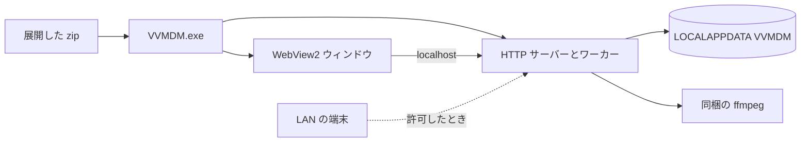
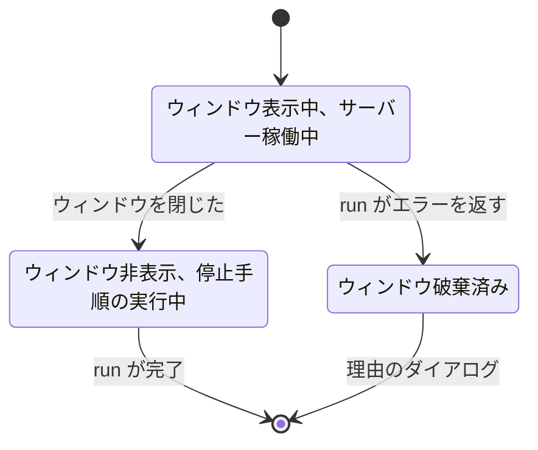
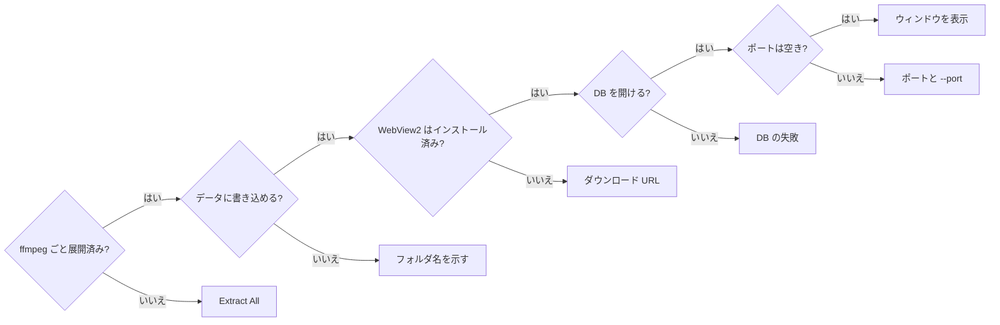
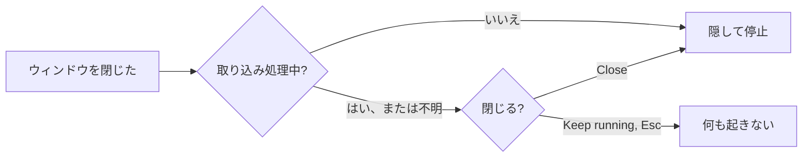
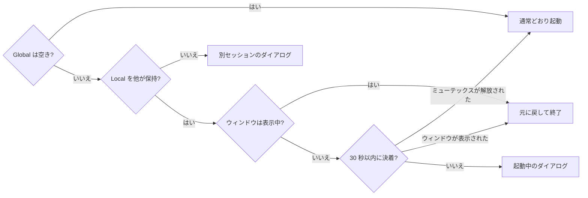
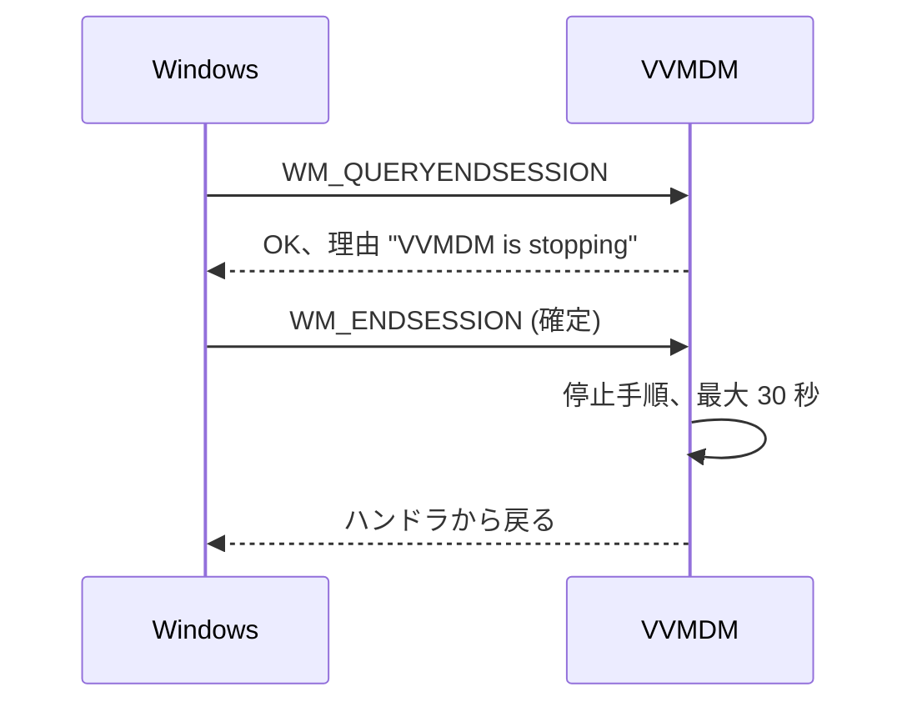
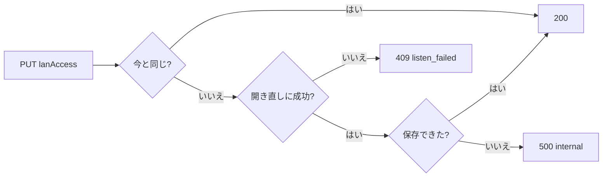
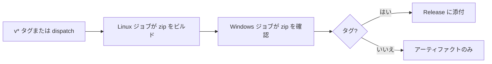

# Windows デスクトップアプリ (VVMDM.exe) {#windows-desktop-app-vvmdmexe}

Windows では、VVMDM はサーバーと UI を 1 つの GUI プロセス `VVMDM.exe` で動かす。このプロセスは `cmd/mdm` から `desktop` ビルドタグ付きでビルドし、Windows 固有の部分は [`internal/desktop`](../../internal/desktop) にある。背景: [specs/037-windows-app/](../../specs/037-windows-app/plan.md) (親 Issue #653)。zip の中身、起動引数、ダイアログの文言、データの場所: [contracts/windows-app.md](../../specs/037-windows-app/contracts/windows-app.md)。Docker で動かす形と直接実行する形は [running-vv.md](../how-to/running-vv.md) にある。

exe は直接実行と同じ HTTP サーバーを載せる。WebView2 のウィンドウは、そのクライアントの 1 つにすぎない。

## プロセスとウィンドウ {#process-and-window}

`cmd/mdm` は唯一の合成ルートのままだ。デスクトップのエントリポイント (`cmd/mdm/desktop_windows.go`、`//go:build windows && desktop`) とタグなしのサーバーのエントリポイントは同じ開始・停止手順 `run` を呼び、デスクトップ版のビルドでは環境変数と `mdm account` をコンパイルから除く。

ビルドは GUI exe (`GOOS=windows GOARCH=amd64 CGO_ENABLED=0 go build -tags desktop -ldflags "-H=windowsgui" ./cmd/mdm`) なので、コンソールウィンドウは出ない。`internal/desktop` は Win32 ウィンドウ、WebView2、ダイアログ、ジョブオブジェクト、データの場所を受け持ち、他の `internal/*` パッケージを import しない (depguard の兄弟規則)。

起動は次の順に進む。ウィンドウはリスナーができてから初めて現れるので、空白になることはない。

| 項目 | 動作 |
| --- | --- |
| リスナー | `127.0.0.1:<port>`。[LAN アクセス](#connections-from-the-lan) がオンのときは `0.0.0.0:<port>` |
| ポート | 既定は `47880`。`--port <1-65535>` で変える |
| その他の引数 | "Unusable argument" ダイアログを出して終了する |
| 転送ヘッダー | `MDM_TRUSTED_PROXIES=none` のときと同じく無視する。前段にプロキシはない |
| ウィンドウ | Win32 ウィンドウ。タイトルは `VVMDM`、クラスは `VVMDMWindow` で、`go-webview2` の `pkg/edge` を埋め込む |
| ページ | `http://localhost:<port>/`。cookie、同一オリジン、"open in default app" の確認は直接実行と同じく働く |
| 初期サイズ | DPI に合わせて拡大縮小した 1280×800。プライマリモニターの作業領域に収まるよう縮め、中央に置く |
| 動画の全画面 | そのモニターを覆う枠なしの `WS_POPUP`。終了すると元の配置に戻る |
| レンダラーのクラッシュまたはハング | ページを再読み込みする |
| ブラウザープロセスの終了 | 回復できないエラーのダイアログを出し、停止手順に進む |

ウィンドウを閉じた場合も `run` が失敗した場合も、プロセスは 1 つの経路で終わる。

| 採らなかった案 | 理由 |
| --- | --- |
| 合成を `internal/server` に置いた新しい `cmd/vvmdm` | 合成ルートが 2 つになるか、3,500 行の合成コードを移すことになる ([research.md](../../specs/037-windows-app/research.md) R-1) |
| `mdm.exe` を子プロセスとして起動するランチャー exe | GUI の親はコンソールの子に正常な停止を送れない (R-1) |
| `jchv/go-webview2` の高水準 API、Wails、Edge の `--app=`、Electron、Tauri | いずれも、閉じる操作を受け取れないか、アセットのオリジンが変わるか、ランタイムが増える (R-2) |

## データと ffmpeg {#data-and-ffmpeg}

データはユーザーごとの `%LOCALAPPDATA%\VVMDM` (`FOLDERID_LocalAppData`) に置き、exe の隣には決して置かない。同梱の `ffmpeg` が `PATH` の先頭に来る。

ユーザーは環境変数を設定せず、`ffmpeg` もインストールしない。zip は更新のたびに置き換えられ、`Program Files` や読み取り専用の共有フォルダに置かれることもあるので、exe の隣に書き込むとデータを失うか、書き込みが失敗する。

| 項目 | 規則 |
| --- | --- |
| `data\` | `MDM_DATA_DIR` と同じ中身 (`mdm.db`、`thumbnails\`)。`MDM_*` 変数は読まない |
| `webview2\` | WebView2 のユーザーデータ |
| `logs\vvmdm.log` | 既存の JSON 形式。起動のたびに前回のログを `vvmdm.1.log` に移し、それより古いものを削除する |
| `PATH` | `<exe folder>\ffmpeg` を先頭に加えるので、インストール済みのものより同梱のビルドが優先される |
| `ffmpeg`/`ffprobe` のプロセス | アプリのどの形でも `CREATE_NO_WINDOW` で起動する |
| ジョブオブジェクト | 最初に `JOB_OBJECT_LIMIT_KILL_ON_JOB_CLOSE` 付きで参加するので、プロセスが強制終了されても変換中の `ffmpeg` は残らない。参加に失敗したらログに記録して起動を続ける |

| 採らなかった案 | 理由 |
| --- | --- |
| データを exe の隣、または `%APPDATA%` (Roaming) に置く | zip を置き換えると失われるか、生成された大きなファイルがサインインのたびに同期される (R-5) |
| `internal/media` の設定としての `ffmpeg`/`ffprobe` のパス | 呼び出し元はデスクトップアプリだけで、変更が広がる (R-11) |

## 起動時の失敗 {#startup-failures}

ウィンドウを表示する前に、アプリは次の順に確認し、最初の失敗だけを `MessageBox` (タイトル `VVMDM`、OK のみ、英語の文言) で示してから終了する ([`internal/desktop` `Message*`](../../internal/desktop/messages.go))。

GUI exe には標準出力がないので、何も示さずに終了すると、何も起きなかったように見える。

最初の確認は、`VVMDM.exe` が一時フォルダから (長いパスとして) 実行されたとき、または隣に `ffmpeg\ffmpeg.exe` と `ffmpeg\ffprobe.exe` がないときに失敗する。エクスプローラーで zip の中の exe を開くと、こうなる。データフォルダのメッセージを除き、どのメッセージもログの場所を示す。データフォルダのときはログを書き込めない。

DB とポートを確認する `run` は、エラーの文言を変えずに、失敗した段階 (`startupStage`) をエラーに付ける。そのため、サーバーのエントリポイントの出力は変わらない。それ以外の失敗は、ウィンドウが現れる前でも後でも (`ffmpeg` が `PATH` にない、回復できない WebView2 のエラー、リスナーの喪失)、概要とログの場所を示す。

| 採らなかった案 | 理由 |
| --- | --- |
| WebView2 内の失敗ページ | WebView2 Runtime がないか初期化に失敗すると表示できない (R-10) |

## 終了、2 回目の起動、サインアウト {#closing-second-launch-and-sign-out}

アプリは、取り込みを中断することになる終了の前には確認し、ユーザーとデータの場所の組ごとに 1 つのインスタンスだけを動かし、Windows がセッションを終えるときは確認せずに停止する。

ユーザーは、閉じると取り込みが中断されることを知らないかもしれない (親 Issue の要件 6)。また、インスタンスが 2 つあると同じ DB を開いてしまう (要件 7)。サインアウトのとき、Windows は確認を待たない。

閉じるときに確認するのは、取り込みが処理中のとき、つまりスキャンが実行中か、ジョブが `queued` か `running` のとき (`app.Scans.Busy`) だけだ。ライブ変換は再開しないので数えない。

確認はタイトル `VVMDM` の TaskDialog で、"Import is in progress" と示し、取り込みは次の起動で再開すると伝える。ボタンは `Close` と `Keep running` (既定) だ。TaskDialog には Common Controls v6 が必要で、exe のマニフェストで選ぶ。それがないときは、同じ文言を Yes/No の `MessageBox` で示し、既定は No だ。

2 回目の起動は、名前付きミューテックス 2 つで検出する。起動の最初、ログと DB を開く前に、`Local\` (セッションごと)、次に DACL `D:P(A;;GA;;;<SID>)` 付きの `Global\VVMDM-<user SID>-<hash of the data location>` を取る。どちらも終了まで保持するので、`Global\` の所有者は必ず `Local\` も保持している。

`Local\` を調べるため、アプリは自分のものを解放してから確認し直す。ウィンドウがなければ、他のプロセスは停止中か、まだ表示されていない。

サインアウトとシャットダウンは、セッション終了のメッセージに従う。

理由は `ShutdownBlockReasonCreate` で設定し、終了が取り消されたら削除する。停止する前にプロセスが死んだら、次の起動時のスキャン再開と `RequeueRunningJobs` が作業を再開する。

| 採らなかった案 | 理由 |
| --- | --- |
| `beforeunload` または SPA 内での確認 | 閉じる操作が WebView2 に届かないか、SPA の読み込み前やレンダラーの障害後にウィンドウを閉じられない (R-7) |
| `Local\` ミューテックスだけ、ロックファイル、またはポートの競合 | セッションをまたいで同じ DB を許すか、強制終了で残るか、他のプログラムのポートと区別できない (R-6) |
| `WM_QUERYENDSESSION` で拒否して確認する | Windows は待たずに先へ進む (R-8) |

## LAN からの接続 {#connections-from-the-lan}

LAN アクセスは既定でオフで、リスナーを `0.0.0.0` か `127.0.0.1` で開き直して切り替える。そのため、オフの間は LAN からの TCP 接続はできず、初回起動で Windows ファイアウォールのダイアログも出ない (親 Issue の要件 8 と 9、受け入れ条件 7)。

設定は既存の `settings` テーブルのキー `desktop.lan_access` だ。`true` 以外の値、または行がなければオフを意味し、マイグレーションは追加しない。`run` は DB のマイグレーション後、ジョブとリスナーの開始前にこれを読む。読み取りの失敗は DB 段階の [起動時の失敗](#startup-failures) になる。

所有者は `GET`/`PUT /api/settings/network` (`lanAccess`、`port`、`addresses`) で切り替える。認証と同一オリジンの境界は `/api/settings/transcoding` と同じだ ([contracts/network-settings-api.md](../../specs/037-windows-app/contracts/network-settings-api.md))。デスクトップアプリ以外では、このルートは `404` `not_found` を返し、SPA は Network セクションを隠す。

切り替えはロックで直列化し、リスナーを開き直してから初めて保存する ([`NetworkSettings.SetLANAccess`](../../internal/app))。

`409` と `500` のときは、リスナーは前のアドレスに戻り、保存された値は変わらない。保存はリクエストの取り消しを無視するので、取り消されたリクエストによってリスナーと保存された値が食い違うことはない。新しいリスナーも同じ `http.Server` が処理するので、開いている接続 (このリクエスト、`/api/events` のストリーム、配信中の動画) は切れない。アクセスをオフにした後、新しい LAN からの接続は TCP の段階で拒否される。

| 状況 | `addresses` |
| --- | --- |
| アクセスがオン | 稼働中の各インターフェイスの、ループバックでない IPv4 アドレスごとに `http://<address>:<port>/` を 1 つ |
| アクセスがオフ | 空 |
| インターフェイスを読めない | 空。アクセスはオンのままで、失敗をログに記録する |

| 採らなかった案 | 理由 |
| --- | --- |
| 常に `0.0.0.0` で待ち受け、オフの間は LAN からの接続を切る | 初回起動でファイアウォールのダイアログが出る (R-14) |
| `127.0.0.1` と並べて `0.0.0.0` のリスナーを追加する | 1 つのポートでのワイルドカードと特定アドレスの共存は、Windows のソケットオプションに依存する (R-14) |
| データの場所に置く設定ファイル | 保存の仕組みが 2 つになる (R-14) |

## 配布 {#distribution}

`v*` タグで、`ffmpeg` を同梱した `VVMDM-<version>-windows-amd64.zip` を GitHub Release に公開する。exe はコード署名せず、対象は `windows/amd64` だけだ。

ユーザーには、それだけで動き、置き換えで更新できるダウンロードが必要だ (親 Issue の要件 1、2、10)。一方、それ以外では CI は `main` への push で Docker イメージだけを公開する。

| 項目 | 規則 |
| --- | --- |
| `<version>` | 先頭の `v` を除いたタグ。タグがなければ `sha-<12 characters>`。数値の `a.b.c.d` なら exe のバージョン情報にも入る |
| zip の構成 | 同じ名前のフォルダ 1 つ: `VVMDM.exe`、`README.txt`、`ffmpeg\` (`ffmpeg.exe`、`ffprobe.exe`、`LICENSE.txt`、バージョンと入手元を書いた `README.txt`) |
| README | メモ帳のために改行は CRLF。最上位のものは展開、SmartScreen、データの場所、更新を扱う |
| ビルド | `task build-windows-app`。zip を `dist/` に書き出す |
| exe のマニフェスト | Per-monitor v2 の DPI と Common Controls v6。`cmd/mdm/winres/` から `go-winres` (`tools/go.mod` で固定) を通して作る |
| `.syso` | ビルド中に生成し、その後削除する。コミットはしない |
| FFmpeg の入手元 | `scripts/build/windows_app.go` で固定したバージョンと SHA-256 の `GyanD/codexffmpeg` `essentials_build` zip |
| FFmpeg のキャッシュ | `dist/cache/`。使うたびにハッシュを計算し直し、一致しなければ削除して、期待値と実際のハッシュを示して失敗する |
| ハードウェアエンコーダー | [hardware-encoding.md](hardware-encoding.md) と同じく NVENC と QSV。AMF はない |
| Windows での確認 | 構成と、`ffmpeg -hide_banner -encoders` が `h264_nvenc` と `h264_qsv` を挙げること。GPU での変換は実機で確認する ([quickstart.md](../../specs/037-windows-app/quickstart.md)) |
| Release | ないときは作り、あるときは zip を置き換える |
| SmartScreen | 手順は `README.txt` と [running-vv.md](../how-to/running-vv.md#windows-app) にある |

そうしないと、`.syso` は同じ `GOOS`/`GOARCH` のすべての `cmd/mdm` のビルドに入ってしまう。Windows のランナーには GPU がないので、CI はエンコーダーが組み込まれていることの確認までで止める。ワークフロー: `.github/workflows/windows-app.yml`。

| 採らなかった案 | 理由 |
| --- | --- |
| `main` への push ごとの zip | ユーザーに見えるバージョンの区切りがない (R-13) |
| `windows/arm64` も対象にする | 固定できる arm64 の `ffmpeg` がなく、x64 の exe はエミュレーションで動く (R-13) |
| BtbN/FFmpeg-Builds の `ffmpeg` | バージョンごとの固定された Release がないので、固定したものを後で取得できない (R-12) |
| `.syso` をコミットする | タグなしの `mdm.exe` にもアイコンとマニフェストが入り、バージョン情報が古くなる |
