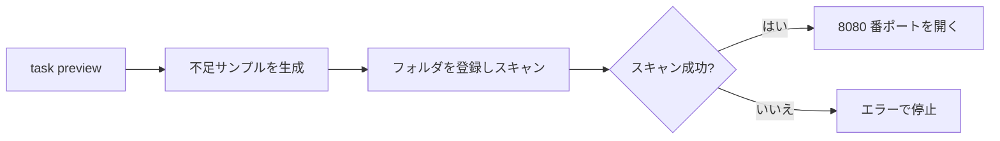
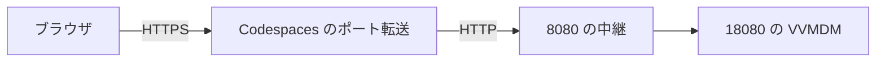
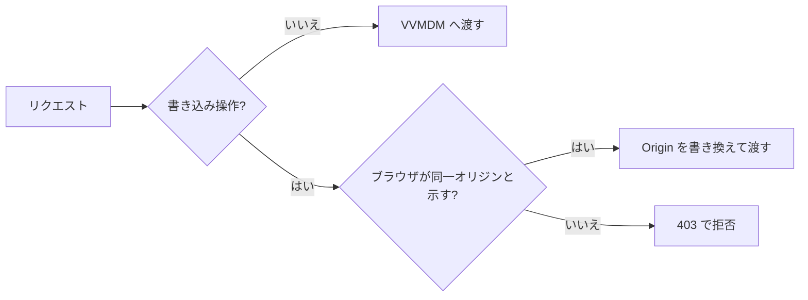

# Codespaces で PR を確認する {#check-a-pr-in-codespaces}

PR のブランチを GitHub Codespaces で開くと、サンプル動画をスキャン済みの状態で VVMDM が起動するので、変更をブラウザで試せる。Codespace はそれぞれ使い捨てで、1 つの PR に属する。

## 手順 {#steps}

1. PR のページで **Code → Codespaces → Create codespace on `<branch name>`** を選ぶ。
2. 初回のビルドを待つ。ビルドは数分で ffmpeg と Go、Node の依存関係をインストールする。
3. ビルドが終わり `task preview` が起動すると 8080 番ポートで開くブラウザのタブを使う。タブが開かない場合は、**Ports** タブで `VVMDM` の地球儀アイコンを使う。
4. PR に新しいコミットが入ったら、`git pull` を実行し、Ctrl+C でプレビューを止めてから再び起動する。

   ```sh
   mise exec -- task preview
   ```

Codespace を開き直すと `task preview` が再び実行される。前のインスタンスがまだ動いている場合は、URL を表示して終了する。

## プレビューの内容 {#what-the-preview-contains}

`task preview` は起動のたびに、8080 番ポートを開く前にライブラリを準備する。



| パスまたは項目 | 内容 |
| --- | --- |
| `.local/preview/media/` | `ffmpeg` が様々な形式で作るサンプル動画。ブラウザが再生できないものも含む |
| `.local/preview/data/` | データベースとサムネイル。最初からやり直すには `.local/preview/` を削除する |
| 起動ごとのスキャン | スキャンが中断された後やファイルを追加した後でも、ライブラリを完全にする |
| 自分の動画 | ファイルを Explorer にドラッグし、そのフォルダを Settings 画面で追加する |

`task preview` はローカルでもそのまま動く。ffmpeg が必要だ。

## 公開範囲 {#visibility}

転送するポートは Codespaces の既定である **Private** のままにし、自分の GitHub アカウントだけが開けるようにする。VVMDM 自体もアカウント認証を求める。**Public に変更しない。**

Codespaces は HTTPS を終端して平文の HTTP を転送するため、VVMDM の同一オリジン検査はすべての書き込みを `403` で拒否することになる。そこで `task preview` は VVMDM を `127.0.0.1:18080` で、中継を 8080 番ポートで動かす。



中継はリクエストごとに次のように判断する。



別サイトからの書き込みや `Origin` のない書き込みは VVMDM に決して届かない。VVMDM はループバックの Host をローカル操作として扱うため、中継は Host を書き換えない。すべてのリクエストがループバックアドレスから VVMDM に届くため、プレビューではループバック限定の "open file" 機能を無効にしている（`DISPLAY` を渡さない）。

## 費用 {#cost}

個人アカウントには Codespaces の月間無料枠がある。使い終わった Codespace は <https://github.com/codespaces> で削除する。停止した Codespace もストレージの枠を使う。無料枠と支出上限は GitHub の **Settings → Billing and licensing** で確認する。
