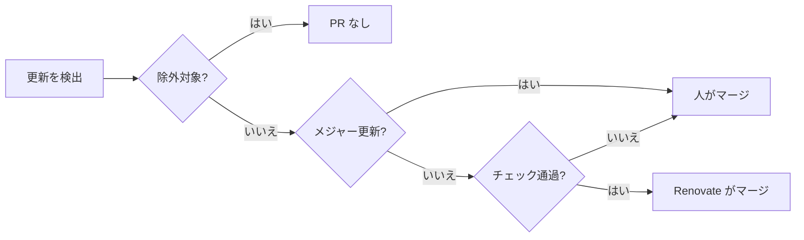

# 依存関係の更新を扱う（Renovate） {#handle-dependency-updates-renovate}

[Renovate](https://docs.renovatebot.com/) GitHub App は `renovate.json` に従って依存関係の更新 PR を開く。その設定の意図はこの文書にある。

## Renovate がすること {#what-renovate-does}

Renovate は、PR を自分でマージするかを更新ごとに決める。

- PR は毎週月曜の早朝（JST）に 6 つのグループで開く。Go モジュール、web の npm、tools の npm、GitHub Actions、mise のツール、コンテナイメージである。脆弱性修正の PR はいつでも開く。
- マイナー、パッチ、ピン留め、ダイジェスト、ロックファイル保守の更新は、必須の `Checks` ジョブが通ると自動でマージされる。ブラウザ E2E と Docker イメージは、マージ後の `main` への push で実行される。
- メジャー更新は、人が破壊的変更を読んでからマージする。
- GitHub Actions はコミットハッシュに固定し、タグ名をコメントに書く（`config:best-practices` の既定）。
- `Dockerfile` のベースイメージは `tag@sha256:digest` として固定する。タグの指す内容が変わると、Renovate がダイジェスト更新の PR を開く。

## 除外する依存関係 {#excluded-dependencies}

| 依存関係 | 扱い | 理由 |
| --- | --- | --- |
| `Dockerfile` の `golang` / `node` イメージ、`mise.toml` の `go` / `node` | バージョン更新は除外する。`Dockerfile` のイメージのダイジェスト更新は対象のまま | ランタイムのバージョンは `go.mod` の `go` 行と一致しなければならないため、人がまとめて変える |
| `mise.toml` の `task` と `jq`、`Dockerfile` の `alpine` | 対象。mise のツールとコンテナイメージのグループに入る | — |
| Windows の zip に同梱する FFmpeg（`scripts/build/windows_app.go` の `ffmpegVersion` と `ffmpegSHA256`） | 人が上げる（[同梱 FFmpeg のバージョンを上げる](#raise-the-bundled-ffmpeg-version)） | Renovate はこれらの定数を読まない |
| Dependabot のセキュリティ更新 | リポジトリの設定で無効 | Renovate の `vulnerabilityAlerts` が同じ役目を果たす |

除外には `matchPackageNames` ではなく `matchDepNames` を使う。mise マネージャーは `go` を `golang/go`、`node` を `nodejs` と名付ける一方、依存関係名は両方のマネージャーで共通だからである。

## 同梱 FFmpeg のバージョンを上げる {#raise-the-bundled-ffmpeg-version}

Windows の zip は、`GyanD/codexffmpeg` の GitHub Releases から Gyan.dev の essentials ビルド（`ffmpeg-<version>-essentials_build.zip`）を同梱し、バージョンと SHA-256 で固定している（[Windows デスクトップアプリの配布](../design-docs/windows-app.md#distribution)）。1 つの PR で上げる。

1. 新しいリリースに `ffmpeg-<version>-essentials_build.zip` があり、その SHA-256 が <https://www.gyan.dev/ffmpeg/builds/> の `.sha256` の値と一致することを確認する。
2. `scripts/build/windows_app.go` の `ffmpegVersion` と `ffmpegSHA256` を変える。一致しないと `task build-windows-app` は失敗し、期待値と実際の値を表示する。
3. `task build-windows-app` で zip をビルドし、その `ffmpeg/README.txt` のバージョンを確認する。
4. マージ後、`main` での `Windows app` ワークフローの実行が通ることを確認する。これで同梱の `ffmpeg` に `h264_nvenc` と `h264_qsv` があることが確かめられる。

`ffmpeg` がエンコーダー名や引数を変えたときは、[hardware-encoding.md](../design-docs/hardware-encoding.md) と `internal/media` を合わせて更新する。

## 同梱した shadcn スキルを更新する {#update-the-vendored-shadcn-skill}

shadcn CLI は `web/package.json` の devDependency `shadcn` であり、Renovate が web の npm グループと一緒に更新する。`.agents/skills/shadcn/` の shadcn スキルは Renovate が読まない複製なので、1 つの PR で更新する。

1. [shadcn-ui/ui](https://github.com/shadcn-ui/ui) の新しいコミットから `skills/shadcn/` を `evals/` を除いて複製する。
2. `npx shadcn@latest`、`pnpm dlx shadcn@latest`、`bunx --bun shadcn@latest` をすべて `npm --prefix web exec shadcn --` に置き換え、`.agents/skills/shadcn/VENDORED.md` のコミットを更新する。
3. `task test-web` を実行する。`shadcn@` が残っている間、`vendoredSkill.test.ts` は失敗する。

## 人の対応が必要な Renovate の PR {#renovate-prs-that-need-a-person}

- 開いたまま残る PR は、CI が失敗しているか、競合しているか、メジャー更新である。Renovate の Dependency Dashboard Issue がそれらを一覧にする。
- 更新を止めるには、PR を閉じる（同じバージョンは再び開かれない）か、`renovate.json` の `packageRules` に `enabled: false` を設定する。

## 設定を変える {#changing-the-configuration}

push の前に `npx --package renovate renovate-config-validator` で検証する。
