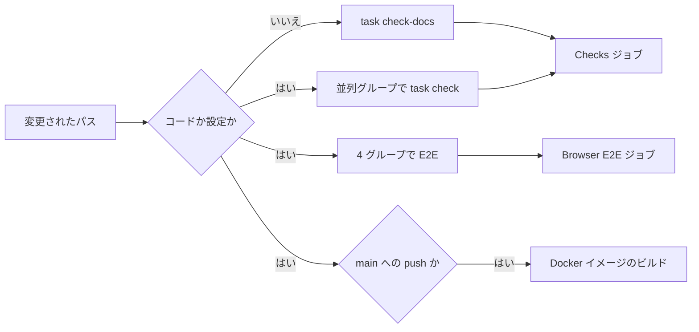

# 開発 {#development}

## ツールチェーンを準備する {#set-up-the-toolchain}

Go、Node.js、Task のバージョンは `mise.toml` で固定されている。`ffmpeg`、Docker、Git、bash はシステムの依存関係で、`task doctor` が確認する。

```bash
mise trust
mise install
mise exec --command "task setup"
mise exec --command "task doctor"
```

npm の依存関係をインストールするタスクは `task setup` だけだ。Windows では、ネイティブの依存ファイルがロックされることがあるため、再実行の前に起動中の開発サーバーを止める。

## ローカルで実行する {#run-locally}

```bash
mise exec --command "task dev"
```

<http://localhost:5173> を開く。このコマンドは、自動再起動つきの Go サーバーと Vite 開発サーバーを起動する。

| 設定 | 効果 |
| --- | --- |
| `MDM_ADDR` | Go の待ち受けアドレスで、Vite の API プロキシの既定の転送先 |
| `MDM_API_TARGET` | `MDM_ADDR` と異なる場合の Vite の API プロキシの転送先 |
| `MDM_DATA_DIR` | データフォルダ。Windows で直接起動した Go バイナリには、ドライブ文字つきの絶対パスが必要（`task dev` は絶対パスを渡す） |

## 変更を検証する {#validate-changes}

```bash
mise exec --command "task check"
```

`task check` は、フォーマットの確認、静的解析、単体テスト、生成ファイルの確認、マイグレーションの確認、Windows のビルド確認を実行する。push の前には毎回、コードまたは設定の変更ならこれを、Markdown、`docs/`、`specs/` の変更なら `task check-docs` を実行する。実行を省くと、CI からフォーマットや lint の修正として戻ってきやすい。`task fmt` は Go と Web のソースを確認対象の形式に書き換える。

lint の指摘はコードで直し、抑止しない。`task check` は、Go のソースに `//nolint` コメントが一つでもあると失敗し（`scripts/nolintguard`）、`web/` に `eslint-disable*` などのインラインの ESLint 設定コメントが一つでもあると失敗する（`linterOptions.noInlineConfig`）。

ブラウザテストは別のコマンドだ。

```bash
mise exec --command "task test-e2e"
```

`task help` はすべてのコマンドを一覧表示する。開発者向けコマンドのサポートされた入口は `Taskfile.yml` だ。

CI は変更されたパスからジョブを選び、必須の `Checks` ジョブと `Browser E2E` ジョブで結果を報告する。



「いいえ」は、Markdown、`docs/`、`specs/` だけが変更されたことを意味する。コードの変更では、CI は `task check` のサブタスクを並列の `Checks (<group>)` ジョブとして実行する。生成ファイル、マイグレーション、Windows のビルドの確認と組み合わせた Go の lint、Go のテスト、Web の lint、3 つのシャードに分けた Vitest スイート（`task test-web -- --shard=1/3`）だ。`task check` に追加する確認は、`.github/workflows/ci.yml` のこれらのグループのいずれかにも入れる。Vitest はファイル単位でシャードに分けるため、一つのシャードの大半を占めるまで大きくなったテストファイルは、`web/src/tags/TagsPage*.test.tsx` が共有の `web/src/testing/tagsPage.tsx` を中心に分けられているように、トピックごとに分割する。Docker イメージは `main` への push でのみビルドされる。

OpenAPI の契約が変わるときは、`api/openapi.yaml`（外部 API なら `api/external-v1.yaml`）を編集し、`task generate` を実行する。`internal/httpapi/gen/`、`internal/httpapi/extgen/`、`web/src/api/gen/` を直接編集してはならない。
