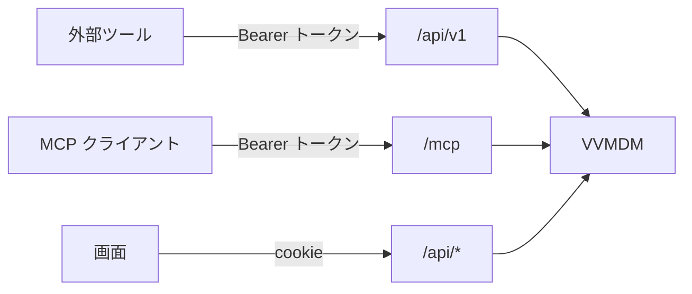
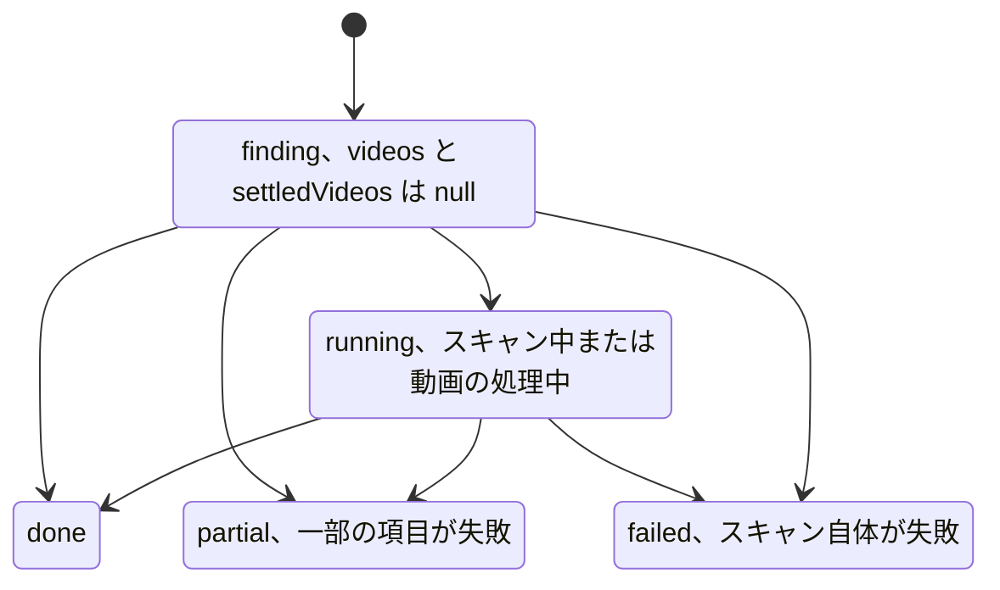
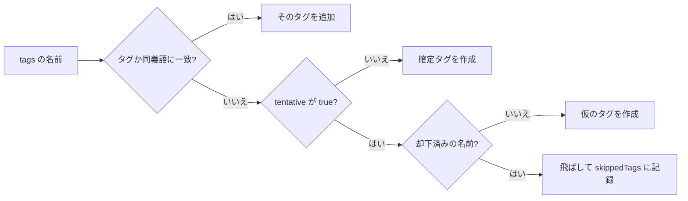
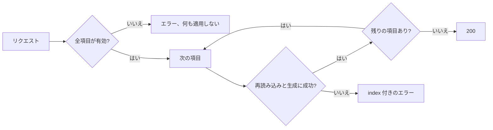
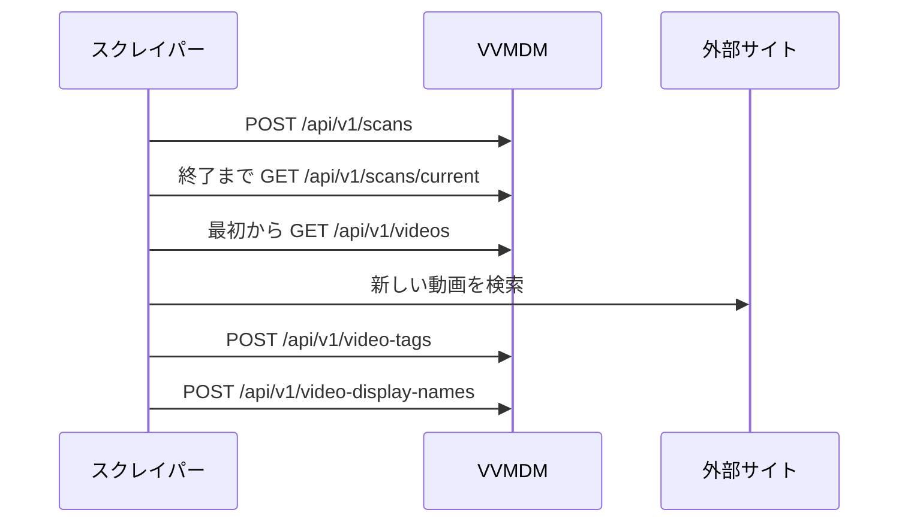

# 外部 API を使う {#use-the-external-api}

API トークンがあれば、スクレイパーなどの外部ツールは `/api/v1` または `/mcp` の MCP サーバーを通じて、動画一覧を読み、スキャンを開始し、タグ、表示名、カバーサムネイルを設定できる。判断の理由は [specs/026-external-api/research.md](../../specs/026-external-api/research.md) にある。

外部ツールは `/api/v1` と `/mcp` だけを使う。画面用の `/api/*` は予告なく変わる。



## 契約 {#contract}

[api/external-v1.yaml](../../api/external-v1.yaml)（OpenAPI 3.1）が、操作、フィールド、エラーの `code` と `reason` の値の正となる情報源である。サーバーはこのファイルを配信しない。画面用の契約は [api/openapi.yaml](../../api/openapi.yaml) である。

## 互換性の方針 {#compatibility-policy}

| 変更 | 反映先 |
| --- | --- |
| 新しいフィールド、操作、`code` または `reason` | `v1` に追加する。クライアントは知らない値を読み飛ばす |
| 意味、型、必須かどうかの変更、または操作の削除 | 新しい `v2`。`v1` は変えない |

## トークンを作成する {#create-a-token}

1. 所有者としてサインインし、Settings ページの "API tokens" セクションを開き、トークンの用途を表す名前を入力してトークンを作成する。
2. 平文のトークン（`vvt_` で始まる 47 文字）をその場でコピーする。表示されるのは一度だけである。失くした場合は失効させ、新しく作成する。
3. 使わなくなったトークンは同じセクションで失効させる。ユーザー名またはパスワードを変更する（`mdm account`）と、すべてのトークンが失効する。

トークンは非公開の動画の読み取りを含め、所有者の権限を持つ。パスワードと同じように保管する。

## API を呼び出す {#call-the-api}

すべてのリクエストに `Authorization: Bearer <token>` を付ける。cookie は読まない。

```sh
BASE=http://localhost:8080
TOKEN=vvt_...

curl -H "Authorization: Bearer $TOKEN" "$BASE/api/v1/tags"
curl -H "Authorization: Bearer $TOKEN" "$BASE/api/v1/videos?limit=100"
curl -X POST -H "Authorization: Bearer $TOKEN" "$BASE/api/v1/scans"
curl -H "Authorization: Bearer $TOKEN" "$BASE/api/v1/scans/current"
```

| 場合 | 挙動 |
| --- | --- |
| トークンがない、形式が不正、無効、または失効済み | `WWW-Authenticate: Bearer` 付きの `401`（`code: unauthenticated`）。原因は区別しない |
| リクエストが `Origin` を送る | 受け付ける。同一オリジンの検査はない |
| 操作が本文を取る | `Content-Type: application/json` が必要 |
| リクエスト中にトークンが失効する | リクエストは打ち切られる |

- エラー本文は `{ code, message, reason?, limit?, index?, tagId?, tagName? }` である。`message` は英語の文である。分岐には `code` と `reason` を使う。`tagId` と `tagName` はタグ名の衝突のときだけ付く（[タグを整理する](#tidy-up-tags)）。
- Settings ページのトークン一覧は最終使用時刻を表示する。この時刻の更新は最大で 1 分に 1 回である。

## スキャン {#scans}

`POST /api/v1/scans` は本文を取らない。スキャンを開始したときは `201` を、すでに実行中のスキャンがあるときはそのスキャンとともに `200` を、メディアフォルダが登録されていないときは `409`（`media_folders_not_configured`）を返す。

`GET /api/v1/scans/current` は最新のスキャンを返し、まだ一度も実行されていなければ `404`（`no_scan`）を返す。その `status` は次のように遷移する。`done`、`partial`、`failed` ではスキャンは終了している。



## 動画一覧を読む {#read-the-video-list}

`GET /api/v1/videos` は、登録済みフォルダの下にある動画を、非公開のものも含めて、追加の古い順（`addedAt`、次に `id`）に返す。`limit` はページサイズを決める。既定は 100、範囲は 1 から 200 で、範囲外は `400` になる。

応答は `{ items, nextCursor }` である。空でない `nextCursor` は、次のページの `cursor` としてそのまま渡す。空文字列は終わりを表す。カーソルを解析しない。解析できないカーソルは `400`（`invalid_cursor`）を返す。そのときは最初からやり直す。

```sh
cursor=""
while :; do
  page=$(curl -s -G -H "Authorization: Bearer $TOKEN" "$BASE/api/v1/videos" \
    --data-urlencode "cursor=$cursor")
  echo "$page" | jq -c '.items[]'
  cursor=$(echo "$page" | jq -r '.nextCursor')
  [ -z "$cursor" ] && break
done
```

| 場合 | 挙動 |
| --- | --- |
| スキャン後の新しい動画 | 追跡しない。一覧を最初から読み直す |
| ページング中に動画が追加、削除、移動された | 次のリクエストも成功する。動画が抜けたり重複したりすることがある |
| 動画が削除された | 一覧から消える。削除を伝えるフィールドはない |
| 動画が登録済みフォルダの外にしか残っていない | 削除されたものとして扱う |

保持している動画がまだ存在するか確かめるには、[その動画を検索する](#look-up-one-video)。`404`（`video_not_found`）は存在しないことを表す。

| フィールド | 意味 |
| --- | --- |
| `locations` | 登録済みフォルダの下の現在の場所。パス順に並び、最初が主な場所である |
| `title` | 設定されていれば `displayName`、なければ主な場所のファイル名から得た `fileTitle` |
| `displayName` | 表示名。未設定なら `null` |
| `thumbnailPositionMs` | カバーサムネイルの位置（ミリ秒）。未設定なら `null` |
| `durationMs` | 解析前は `null` |
| `tags.manual` | 手で付けたタグ |
| `tags.fromFolder` | 祖先フォルダの名前から得たタグ |
| `tags.tentative` | 仮のタグ（[タグを仮のタグとして付ける](#add-tags-as-tentative-tags)） |
| `updatedAt` | 表示名、タグ、公開状態、カバーサムネイルの最後の編集時刻。この API による編集も含む。一度も編集されていなければ `addedAt` と等しい。何も変えないリクエストでは変わらない |
| `fileCreatedAt` | 主な場所のファイルの作成時刻。ファイルシステムが作成時刻を持たないときは mtime |

## 1 本の動画を検索する {#look-up-one-video}

`GET /api/v1/videos/lookup` は `id`、`contentKey`、`path` のうちちょうど 1 つを取る。どれもないか 2 つ以上あると `400` を返す。応答は一覧の項目と同じ形である。

```sh
curl -G -H "Authorization: Bearer $TOKEN" "$BASE/api/v1/videos/lookup" \
  --data-urlencode "path=/media/videos/clip.mp4"
```

- `path` は正規化せずにバイト単位で比較する。NFD で綴られた名前（macOS など）には、一覧の `locations[].path` をそのまま渡す。
- 存在しない動画、または登録済みフォルダの下に場所を持たない動画は `404`（`video_not_found`）を返す。

## 動画にタグを付ける {#tag-videos}

`POST /api/v1/video-tags` は、1 回のリクエストで複数の動画に対し、名前でタグを追加、削除、または置き換える。

```json
{ "videos": [{ "path": "/media/videos/clip.mp4" }, { "contentKey": "…" }, { "id": 12 }],
  "action": "add",
  "tags": ["猫", "ねこ"] }
```

どの action も手で付けたタグだけを変える。`fromFolder` のタグは残る。

| `action` | 効果 |
| --- | --- |
| `add` | 指定した名前のタグを追加する。知らない名前にはタグを作成する |
| `remove` | 指定した名前のタグを削除する。知らない名前は何もしない |
| `replace` | 手で付けたタグをちょうど `tags` にする。知らない名前は作成する。空の `tags` はすべて削除する |

| 項目 | 規則 |
| --- | --- |
| `videos` の要素 | `id`、`contentKey`、`path` のうちちょうど 1 つ。[検索](#look-up-one-video) と同じように解決する |
| `videos` の数 | 1 から 20000。範囲外は `limit` 付きの `400` `too_many_videos` |
| `tags` | 名前または同義語。同じタグに解決される名前はまとめる。最大 100、`add` と `remove` では 1 以上。範囲外は `limit` 付きの `400` `too_many_tags` |
| タグ名のエラー | `400` `tag_name_empty`、`tag_name_control_characters` または `tag_name_too_long`。`index` は `tags` 内の位置 |
| 本文のサイズ | 最大 32 MiB（33554432 バイト）。超えると `400` `invalid_request`。長いパスが多いときはリクエストを分割する |
| 知らない動画 | `404` `video_not_found`。`index` は `videos` 内の位置 |

- 応答は `{ items: [{ video: { id, contentKey }, tags }], skippedTags }` である。項目は `videos` の順に動画ごとに 1 つで、操作後のタグを一覧の項目と同じ形で持つ。
- リクエストは 1 つのトランザクションで実行される。エラーがあれば何も適用せず、タグも作成しない。
- 同じリクエストを繰り返しても状態は変わらず、`200` を返す。そのため、ネットワーク障害の後はそのまま再送する。

### タグを仮のタグとして付ける {#add-tags-as-tentative-tags}

`"tentative": true` を指定すると、`add` と `replace` が新しく作成するタグは **仮のタグ** になる。画面では、ユーザーが Tags ページで確定または却下するまで仮として表示される。

```json
{ "videos": [{ "path": "/media/videos/clip.mp4" }],
  "action": "add",
  "tags": ["猫", "高画質"],
  "tentative": true }
```

`tentative` は真偽値で、既定は `false` である。それ以外の値は `400`（`invalid_request`）を返す。`remove` では何も変えない。`tags` の各名前は次のように解決される。



- 既存のタグは、仮か確定かの状態を保つ。
- 却下済みの名前は綴りの完全一致で照合する。その名前を確定タグとして作成すると、却下済みの名前から除かれる。
- 飛ばした名前でリクエストは失敗せず（`200`）、`replace` の結果にも含まれない。`skippedTags` は飛ばした名前を正規化して `tags` の順に 1 回ずつ並べ、何も飛ばさなかったときは空の配列である。
- 応答と `GET /api/v1/tags` の各タグは `tentative` を返す。
- 仮のタグの確定と却下、却下済みの名前の閲覧と消去は、画面でしかできない。

## タグを整理する {#tidy-up-tags}

### タグを一覧する {#list-tags}

`GET /api/v1/tags` は、タグ管理画面と同じ検索、絞り込み、並べ替え、ページでタグを一覧する（[specs/039-external-tag-admin/contracts/external-api.md §1](../../specs/039-external-tag-admin/contracts/external-api.md#1-get-apiv1tags)）。

```sh
curl -H "Authorization: Bearer $TOKEN" \
  "$BASE/api/v1/tags?tentative=true&q=selfie&sort=countDesc&limit=200"
```

| パラメータ | 意味 |
| --- | --- |
| `q` | 100 文字まで。全角半角、大文字小文字、かなの違いを無視して、名前または同義語の一部に一致する |
| `tentative` | `true` で仮のタグだけを一覧する |
| `unused` | `true` でどの動画にも付いていないタグだけを一覧する。`q` と `tentative` との AND |
| `sort` | `name`（既定、名前の自然順）、`countDesc`、`countAsc`、`createdDesc` または `createdAsc`。同順位は名前、次に `id` で並べる |
| `limit` | 1 ページあたり 1 から 200 個のタグ。**省略すると、一致するすべてのタグを** `nextCursor` なしで返す |
| `cursor` | 前回の `nextCursor`。同じ `q`、`tentative`、`unused`、`sort` とともに送る |

- 応答は `{ items, total, totalAll, nextCursor? }` である。どのページでも、`total` は絞り込みに一致するタグの数、`totalAll` はすべてのタグの数である。
- `limit` を付けたときは、`nextCursor` がなくなるまでそれを `cursor` として渡し返すと、一致するすべてのタグを 1 回ずつ読める。
- 各タグは `id`、`name`、`synonyms`、`videoCount`、`tentative`、`createdAt` を持つ。
- 5 つの値以外の `sort`、1 から 200 の範囲外の `limit`、または 100 文字を超える `q` は `400` `invalid_request` を返す。読めないカーソル、または別の `sort` で作られたカーソルは、`reason: invalid_cursor` 付きの `400` `invalid_request` を返す。そのときは最初のページから読み直す。

### タグを統合する {#merge-tags}

`POST /api/v1/tags/merge` は、1 つのトランザクションで統合元のタグを統合先のタグへ統合する（[§2](../../specs/039-external-tag-admin/contracts/external-api.md#2-post-apiv1tagsmerge)）。

```json
{ "targetId": 12, "sourceIds": [31, 45] }
```

- 各統合元の名前と同義語は統合先の同義語になり、その動画は統合先へ移り、統合元は削除される。統合先は確定タグになる。
- 応答は `{ tag, notFoundIds }` である。統合後の統合先と、存在せず飛ばした統合元を持つ。
- `sourceIds` は重複も数えて 1 から 20000 個の id を持つ。範囲外は `limit` 付きの `400` `too_many_tags` を返す。`targetId` を含む `sourceIds` は `400` `merge_same_tag` を、存在しない統合先は `404` `tag_not_found` を返す。どちらも何も変えない。

### タグの名前を変える {#rename-a-tag}

`{ "id": 12, "name": "自撮り" }` を付けた `POST /api/v1/tags/rename` は、タグの元の名前を変え、タグを返す（[§3](../../specs/039-external-tag-admin/contracts/external-api.md#3-post-apiv1tagsrename)）。

- 仮のタグは名前が変わると確定タグになる。今と同じ名前は何も変えない。
- 名前の規則に反する名前は `400` `tag_name_empty`、`tag_name_control_characters` または `tag_name_too_long` を返す。存在しない `id` は `404` `tag_not_found` を返す。
- 別のタグの名前か同義語である名前、またはこのタグの同義語の 1 つである名前は、`reason: tag_name_taken` 付きの `409` `conflict` を返し、`tagId` と `tagName` はその名前を持つタグを示す。何も変わらない。

### 同義語を編集する {#edit-synonyms}

`POST /api/v1/tags/synonyms` は、タグの同義語に名前を 1 つ追加または削除し、変更後のタグを返す（[§4](../../specs/039-external-tag-admin/contracts/external-api.md#4-post-apiv1tagssynonyms)）。

```json
{ "id": 12, "action": "add", "name": "自己撮影" }
```

| 場合 | 結果 |
| --- | --- |
| 新しい名前の `add` | `200`。名前は同義語になり、仮のタグは確定タグになる |
| すでに `id` の同義語である名前の `add` | `200`。変更なし |
| `id` 自身の名前、または別のタグの同義語の `add` | `tagId` と `tagName` 付きの `409` `tag_name_taken` |
| 別のタグの元の名前の `add` | そのタグの `tagId` と `tagName` 付きの `409` `tag_merge_required`。何も変わらない |
| 同じ `add` に `"mergeTagId": <tagId>` を付ける | `200`。そのタグは `id` へ統合される |
| `remove` | `200`。名前は同義語でなくなる。同義語でなかったときはタグは変わらない |

- `add` と `remove` 以外の `action` は `400` `invalid_request` を、存在しない `id` は `404` `tag_not_found` を返す。
- `mergeTagId` は統合を受け入れるタグを示す。再試行の前に別のクライアントがその名前を別のタグに与えた場合、見ていないタグを統合せず、呼び出しは再び `tag_merge_required` で失敗する。

## 表示名を設定する {#set-display-names}

`POST /api/v1/video-display-names` は、複数の動画の表示名を設定または消去する。表示名は画面とこの API の `title` に表示され、並べ替えと検索に使われる。ファイル名は変わらない。

```json
{ "items": [{ "video": { "path": "/media/videos/clip.mp4" }, "displayName": "旅行 2024 夏" },
            { "video": { "id": 12 }, "displayName": null }] }
```

- `video` は `id`、`contentKey`、`path` のうちちょうど 1 つを持つ。`displayName` は必須である。`null` または前後の空白を除くと空になる文字列は表示名を消去し、タイトルは `fileTitle` に戻る。項目は 1 から 20000 で、本文は 32 MiB までに制限される。
- 表示名は内容（`contentKey`）に属する。移動しても残り、同じ内容を持つすべての場所に表示される。複数の動画が同じ名前を共有できる。
- 応答は `{ items: [{ video: { id, contentKey }, title, fileTitle, displayName }] }` で、変更後の値を `items` の順に持つ。
- リクエストは 1 つのトランザクションで実行される。次のどのエラーでも何も適用せず、`items` 内の `index` を返す。

  | 条件 | エラー |
  | --- | --- |
  | 動画が見つからない | `404`（`video_not_found`） |
  | 名前に制御文字が含まれる | `400`（`display_name_control_characters`） |
  | 名前が 200 文字より長い | `400`（`display_name_too_long`、`limit: 200`） |

## カバーサムネイルの位置を変える {#change-the-cover-thumbnail-position}

`POST /api/v1/video-thumbnails` は、複数の動画のカバーサムネイルを指定の位置から生成し直す。

```json
{ "items": [{ "video": { "contentKey": "…" }, "positionMs": 12500 },
            { "video": { "id": 12 }, "positionMs": null }] }
```

- `positionMs` は必須で、先頭からのミリ秒である。0 以上で、長さ未満でなければならない。`null` は位置を消去し、自動の位置で生成し直す。
- 各項目が画像を生成するため、1 回のリクエストで取れる項目は 1 から 20 である。それより多いと `400`（`too_many_videos`、`limit: 20`）を返す。それより大きな集合は 20 件ずつ順に送る。
- 応答は `{ items: [{ video: { id, contentKey }, thumbnailPositionMs }] }` である。生成の後に返り、生成には項目ごとに数秒かかることがある。

リクエストはすべての項目を検証してから、`items` の順に 1 項目ずつ生成し、最初の失敗で止まる。



| 条件 | エラー |
| --- | --- |
| 動画が見つからない | `404`（`video_not_found`） |
| 動画のどの場所も開けない | `404`（`file_unavailable`） |
| 位置が負、または長さ以上 | `400`（`thumbnail_position_out_of_range`、長さは `limit`） |
| 動画がまだ解析されていない | `409`（`duration_unknown`） |
| 画像を生成できない | `409`（`thumbnail_frame_unavailable`） |
| 生成中の予期しない失敗 | `500` |

どのエラーも `index` を持つ。生成中にスキャンが動画を変えることがあるため、各項目は生成の直前に動画と場所を読み込み直す。そのため、検証エラーでもリクエストが途中で止まることがある。止まったとき、`index` より前の項目は適用され、その項目と残りは適用されない。続けるには、`index` の項目を直すか除き、`index` 以降を再送する。適用済みの項目を再送しても、同じ位置で生成し直すだけである。

## 例: スクレイパーを連携させる {#example-integrate-a-scraper}

この流れは、新しくスキャンされた動画を外部サイトで調べ、見つかった情報でタグを付ける。



1. スキャンを開始し、`status` が `done`、`partial` または `failed` になるまで待つ（[スキャン](#scans)）。
2. 一覧を最初から読み、記録にない `contentKey` を新しい動画として扱う。`contentKey` はファイルを移動しても残るため、記録のキーにする。
3. `locations[].path` または `title` で外部サイトを検索する。後で動画を確認し直すには、`GET /api/v1/videos/lookup?contentKey=…` を使う。
4. 見つかった名前を `POST /api/v1/video-tags` で追加する。同じ名前を付ける動画の集合ごとに 1 リクエストにする。LLM などが自動で生成した名前は、ユーザーが確定するように `"tentative": true` を付けて送る。却下済みの名前は再び作成されず、`skippedTags` に返る。
5. 見つかった正式なタイトルを、`POST /api/v1/video-display-names` で表示名に設定する。

```sh
# 2. Pick up contentKey and the primary path from the list (paging is in "Read the video list").
curl -s -H "Authorization: Bearer $TOKEN" "$BASE/api/v1/videos?limit=200" |
  jq -r '.items[] | [.contentKey, .locations[0].path] | @tsv'

# 4. Add the tags found. Names produced automatically are created as tentative tags.
curl -X POST -H "Authorization: Bearer $TOKEN" -H "Content-Type: application/json" \
  "$BASE/api/v1/video-tags" \
  -d '{"videos":[{"contentKey":"…"}],"action":"add","tags":["猫","旅行"],"tentative":true}'

# 5. Set the title found as the display name.
curl -X POST -H "Authorization: Bearer $TOKEN" -H "Content-Type: application/json" \
  "$BASE/api/v1/video-display-names" \
  -d '{"items":[{"video":{"contentKey":"…"},"displayName":"旅行 2024 夏"}]}'
```

- `replace` は画面で手で付けたタグも上書きする。画面も使われるときは、`add` と `remove` で差分だけを送る。
- `404` のときは、`index` の動画を記録から除くか検索し直してから再送する。

## MCP から使う {#use-from-mcp}

`/mcp` の MCP サーバー（Streamable HTTP）は、同じ操作を同じトークンでツールとして公開する。

```sh
claude mcp add --transport http vv https://vv.example/mcp --header "Authorization: Bearer vvt_…"
```

| ツール | 操作 |
| --- | --- |
| `list_videos` | `GET /api/v1/videos` |
| `get_video` | `GET /api/v1/videos/lookup` |
| `list_tags` | `GET /api/v1/tags`。ツールでは `limit` の既定は 100 |
| `update_video_tags` | `POST /api/v1/video-tags` |
| `start_scan` | `POST /api/v1/scans` |
| `get_current_scan` | `GET /api/v1/scans/current` |
| `update_video_display_names` | `POST /api/v1/video-display-names` |
| `update_video_thumbnails` | `POST /api/v1/video-thumbnails` |
| `merge_tags` | `POST /api/v1/tags/merge` |
| `rename_tag` | `POST /api/v1/tags/rename` |
| `update_tag_synonyms` | `POST /api/v1/tags/synonyms` |

- ツールの引数は操作のクエリと本文の形を持ち、構造化された結果は応答本文の形を持つ。操作のエラーは、`isError: true` と [エラー本文](#call-the-api) を持つツール結果になる。
- 受け付けるのは `POST /mcp` だけで、応答は `application/json` である。サーバーはセッションを保持しないため、`GET` と `DELETE` は `405` を返す。
- トークンがないか無効なときは、MCP の処理の前に `WWW-Authenticate: Bearer` 付きの `401` を返す。トークンを失効させると、実行中のツールは打ち切られる。
