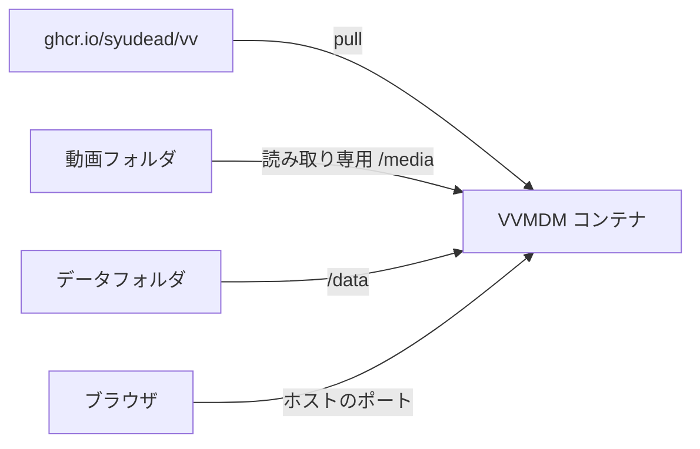

# 公開イメージで VVMDM をホストする {#hosting-vvmdm-with-the-published-image}

NAS や自宅サーバーなど、VVMDM のソースがない Docker ホストでは、公開されたイメージを実行する。ホストでは何もビルドしない。クローンからは、代わりに `task up` を使う（[VVMDM を実行する](running-vv.md)）。

ホストはイメージを pull し、ホスト自身のフォルダ 2 つをコンテナにマウントする。



## イメージ {#image}

CI の `Docker image` ジョブは、`main` へのマージのたびに `linux/amd64` と `linux/arm64` 向けの `ghcr.io/syudead/vv` を公開する。パッケージは公開されているので、ホストはログインせずに pull する。

| タグ | 指す先 |
| --- | --- |
| `latest` | `main` の最新のビルド |
| `sha-<12 chars>` | そのコミットのビルド。バージョンを固定するときに使う |

イメージはソフトウェアエンコードだけを使う。ホストの GPU を使うには、VVMDM をホストで直接実行する（[ハードウェアエンコード](running-vv.md#hardware-encoding)）。

## 起動する {#start}

1. [`compose.hosting.yaml`](../../compose.hosting.yaml) をコピーし、`変える` と印の付いた行を変更する:

   | 行 | 設定する値 |
   | --- | --- |
   | `8080:8080` の左側 | ホストのポート。QNAP などの一部の NAS は管理画面に 8080 を使うので、`18080` など別のポートを選ぶ |
   | `:/media:ro` の左側 | 使いたい動画フォルダがすべてその下に入る、十分に上位のホストのフォルダ |
   | `:/data` の左側 | データベースとサムネイルを置くホストのフォルダ |

2. データフォルダを作成する。
3. ファイルを NAS のコンテナマネージャー（QNAP Container Station、Synology Container Manager など）に新しいアプリケーションとして貼り付ける。または、ホストに `compose.yaml` として保存し、そのフォルダで `docker compose up -d` を実行する。
4. `http://<host>:<port>/api/health` を開き、VVMDM が起動していることを確認する。
5. ブラウザで VVMDM を開き、すぐに[アカウントの設定](running-vv.md#account-setup)を済ませる。
6. Settings で `/media` の下のフォルダを追加し、スキャンを開始する。

`MDM_LOG_LEVEL` は[実行時の設定](running-vv.md#runtime-settings)と同じように働く。NAS や家庭内ネットワーク上のリバースプロキシは、追加の設定なしで動く。VVMDM をインターネットから到達できるようにする前に、[ネットワークへの公開](running-vv.md#network-exposure)を読む。

## 更新する {#update}

1. データフォルダをバックアップする（[バックアップと復元](#back-up-and-restore)）。新しいバージョンで移行されたデータベースは、古いバージョンで開けないことがある。
2. コンテナマネージャーで、または次のコマンドで、イメージを pull し直してコンテナを作り直す。作り直すだけでは、ホストにすでにあるイメージが再利用される。

   ```bash
   docker compose pull
   docker compose up -d
   ```

データフォルダは更新後も残り、新しいバージョンの起動時に移行が実行される。あるバージョンにとどまる、またはあるバージョンに戻るには、`image:` の `latest` をその `sha-` タグに置き換える。

## バックアップと復元 {#back-up-and-restore}

1. コピー中に SQLite データベースへ書き込まれないように、コンテナを停止する。
2. NAS のファイルマネージャーやバックアップツールなどで、データフォルダをコピーする。
3. コンテナを再び起動する。

復元するには、コンテナを停止し、データフォルダの中身をコピーで置き換えてから、再び起動する。データフォルダには、スキャンでは復旧できない設定とユーザーデータが入っている（[データと復旧](running-vv.md#data-and-recovery)）。バックアップなしで失われた場合は、新たにアカウントの設定を済ませ、メディアフォルダを登録し直してからスキャンを開始する。
