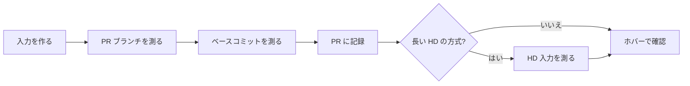

# モーションプレビューとシーク用サムネイルの生成を測る {#measure-motion-preview-and-seek-thumbnail-generation}

モーションプレビュー（ライブラリのカードでのホバー再生）やシーク用サムネイル（プレーヤーのシークバー上のプレビュー）の生成方法を変える PR は、同じ環境・同じ入力で、変更前と変更後の経過時間とピークメモリを記録する。`scripts/previewbench` は本番の生成コードを実行する。根拠は [specs/019-preview-input-seek/research.md R-4](../../specs/019-preview-input-seek/research.md#r-4-measurement-method) にある。

測定は次の順で進める。手順 4 は長い HD 動画向けの方式を比較するときだけ行う。



## 前提 {#prerequisites}

- Go と `ffmpeg`（`ffprobe` を含む）。
- PR ブランチのチェックアウト。

## 手順 {#steps}

### 1. 入力を作る {#1-create-the-inputs}

`ffmpeg` の `testsrc2` から入力を `.local/bench/` に生成する（git は `.local/` を無視する。リポジトリ外の任意のフォルダでもよい）。

```sh
mkdir -p .local/bench

# 2 hours, 640x360, 30 fps, H.264 (long input; takes a few minutes)
ffmpeg -nostdin -v error -f lavfi -i testsrc2=size=640x360:rate=30:duration=7200 \
  -c:v libx264 -preset ultrafast -pix_fmt yuv420p .local/bench/long-2h.mp4

# 2 minutes, 1280x720, H.264/AAC (short input)
ffmpeg -nostdin -v error -f lavfi -i testsrc2=size=1280x720:rate=30:duration=120 \
  -f lavfi -i sine=frequency=440:duration=120 \
  -c:v libx264 -preset ultrafast -pix_fmt yuv420p -c:a aac -shortest .local/bench/short-2m-720p.mp4

# For the hover check: a portrait input with rotation metadata (90 degrees, 1 minute)
ffmpeg -nostdin -v error -f lavfi -i testsrc2=size=640x360:rate=30:duration=60 \
  -c:v libx264 -preset ultrafast -pix_fmt yuv420p .local/bench/landscape.mp4
ffmpeg -nostdin -v error -display_rotation 90 -i .local/bench/landscape.mp4 \
  -c copy .local/bench/portrait-rotated.mp4
```

回転メタデータがあれば、`ffprobe .local/bench/portrait-rotated.mp4` は `rotation of 90.00 degrees`（displaymatrix）を出力する。

### 2. 測る {#2-measure}

```sh
go run ./scripts/previewbench [-kind preview|seek] [-runs N] <video>
```

`-kind` は `preview`（既定。モーションプレビュー）か `seek`（シーク用サムネイル）だ。ツールは入力ごとに生成を `-runs` 回（既定 2）実行し、次を出力する。

| 出力 | 表示される環境 |
| --- | --- |
| 各回の経過時間 | すべての OS |
| ffmpeg のピークメモリ（全回の最大値） | Linux と macOS。Windows では表示しない |
| 出力ディレクトリのファイル数と合計バイト数（回ごと） | `-kind seek` のときだけ |

ツールは各回の後に出力を削除する。入力がない場合や ffmpeg が失敗した場合は、理由を出力して 0 以外のコードで終了する。

ピークメモリは終了したすべての子プロセスの最大値なので、**入力ごとに別々に実行する**。1 回の実行に複数の入力を渡すと、後の入力に前の入力の値が残る。

変更前と変更後は、同じ環境で続けて測る。ベースコミットに `scripts/previewbench` がない場合は、PR ブランチのプログラムをベースコミットの worktree にコピーする。

```sh
# After (the PR branch)
go run ./scripts/previewbench .local/bench/long-2h.mp4
go run ./scripts/previewbench .local/bench/short-2m-720p.mp4

# Before (the PR's base commit)
bench="$PWD/.local/bench"
git worktree add ../vv-before <base commit>
cp -r scripts/previewbench ../vv-before/scripts/   # only when the base lacks it
(cd ../vv-before && go run ./scripts/previewbench "$bench/long-2h.mp4")
(cd ../vv-before && go run ./scripts/previewbench "$bench/short-2m-720p.mp4")
git worktree remove --force ../vv-before
```

時間はディスクキャッシュで変わるので、1 回目と 2 回目を分けて報告する。

### 3. 結果を PR に記録する {#3-record-the-results-in-the-pr}

環境（OS、CPU、ffmpeg のバージョン）と、入力ごとに各回の経過時間とピークメモリを記録する。PR 本文が日本語なので、テンプレートも日本語だ。

```markdown
環境: Linux x86_64, <CPU>, ffmpeg <版>

| 入力 | 変更前 1 回目 | 変更前 2 回目 | 変更前ピーク | 変更後 1 回目 | 変更後 2 回目 | 変更後ピーク |
| --- | --- | --- | --- | --- | --- | --- |
| 2 時間・640×360・H.264 | 00.000 秒 | 00.000 秒 | 0.0 MiB | 00.000 秒 | 00.000 秒 | 0.0 MiB |
| 2 分・1280×720・H.264/AAC | 00.000 秒 | 00.000 秒 | 0.0 MiB | 00.000 秒 | 00.000 秒 | 0.0 MiB |
```

| 場合 | セルに書く内容 |
| --- | --- |
| 「変更前」側が失敗した（例: メモリ不足） | 失敗したことと、出力された理由 |
| Windows のピーク列 | `測らない`（測定しない） |

#### シーク用サムネイル {#seek-thumbnails}

`long-2h.mp4` と `short-2m-720p.mp4` を `-kind seek` で、入力ごとに 1 回ずつ測る。ファイル数と合計は、生成が出力ディレクトリに書いたものすべてを対象とする。合計は MiB で報告する。

```sh
go run ./scripts/previewbench -kind seek .local/bench/long-2h.mp4
go run ./scripts/previewbench -kind seek .local/bench/short-2m-720p.mp4
```

```markdown
環境: Linux x86_64, <CPU>, ffmpeg <版>

| 入力 | 変更前 1 回目 | 変更前 2 回目 | 変更前ピークメモリ | 変更前ファイル数 | 変更前合計 | 変更後 1 回目 | 変更後 2 回目 | 変更後ピークメモリ | 変更後ファイル数 | 変更後合計 |
| --- | --- | --- | --- | --- | --- | --- | --- | --- | --- | --- |
| 2 時間・640×360・H.264 | 00.000 秒 | 00.000 秒 | 0 MiB | 0 | 0.0 MiB | 00.000 秒 | 00.000 秒 | 0 MiB | 0 | 0.0 MiB |
| 2 分・1280×720・H.264/AAC | 00.000 秒 | 00.000 秒 | 0 MiB | 0 | 0.0 MiB | 00.000 秒 | 00.000 秒 | 0 MiB | 0 | 0.0 MiB |
```

ピークメモリを取得できない環境（Windows など）では、ピークメモリの列に `取得不可`（取得できない）と書く。

### 4. 長い HD 動画の入力側シークを測る {#4-measure-long-hd-input-side-seeking}

長い HD 動画向けの方式を比較するときは、360p の入力に次の 1080p の入力を加える。30 秒のソースをストリームコピーで繰り返すので、2 時間分を再エンコードせずに済む。内容は実際の動画や NAS の I/O 性能を再現しない。

```sh
ffmpeg -nostdin -v error -f lavfi -i testsrc2=size=1920x1080:rate=30:duration=30 \
  -c:v libx264 -preset veryfast -crf 28 -g 75 -keyint_min 75 -sc_threshold 0 \
  -pix_fmt yuv420p .local/bench/h264-hd-seed.mp4
ffmpeg -nostdin -v error -stream_loop -1 -i .local/bench/h264-hd-seed.mp4 \
  -t 7200 -c copy .local/bench/h264-hd-2h.mp4

ffmpeg -nostdin -v error -f lavfi -i testsrc2=size=1920x1080:rate=30:duration=30 \
  -c:v libx265 -preset veryfast -crf 28 -g 75 \
  -x265-params keyint=75:min-keyint=75:scenecut=0:pools=8 \
  -pix_fmt yuv420p10le .local/bench/hevc-hd-seed.mp4
ffmpeg -nostdin -v error -stream_loop -1 -i .local/bench/hevc-hd-seed.mp4 \
  -t 7200 -c copy .local/bench/hevc-hd-2h.mp4

go run ./scripts/previewbench -kind seek .local/bench/h264-hd-2h.mp4
go run ./scripts/previewbench -kind seek .local/bench/hevc-hd-2h.mp4
```

コピーはフレーム境界で 7200 秒をわずかに超えて終わることがあるので、手で計算した 7200 ではなく、ベンチマークが ffprobe から読む長さを使う。方式を選ぶ条件と、フレームが欠けたときの動作は[設計文書](../design-docs/seek-sprite-generation.md)にある。

## ホバーで結果を確認する {#check-the-result-on-hover}

`task preview` の組み込みサンプルは 20 秒以下なので、生成した入力を `.local/preview/media/` に置く。`task preview` は起動のたびにこのフォルダを走査する（[Codespaces で PR を確認する](codespaces-preview.md)）。

```sh
mkdir -p .local/preview/media
cp .local/bench/long-2h.mp4 .local/bench/portrait-rotated.mp4 .local/preview/media/
task preview   # if it is running, stop it with Ctrl+C first, then start it again
```

プレビューの生成が終わったら、ライブラリのカードにホバーする。

| 入力 | 期待する結果 |
| --- | --- |
| 2 時間の入力 | 最初から最後までの場面（`testsrc2` の時計で分かる）が約 9 秒間、順に無音でループ再生される |
| 縦長の入力 | 縦長のまま、縦横比が崩れずに再生される |
