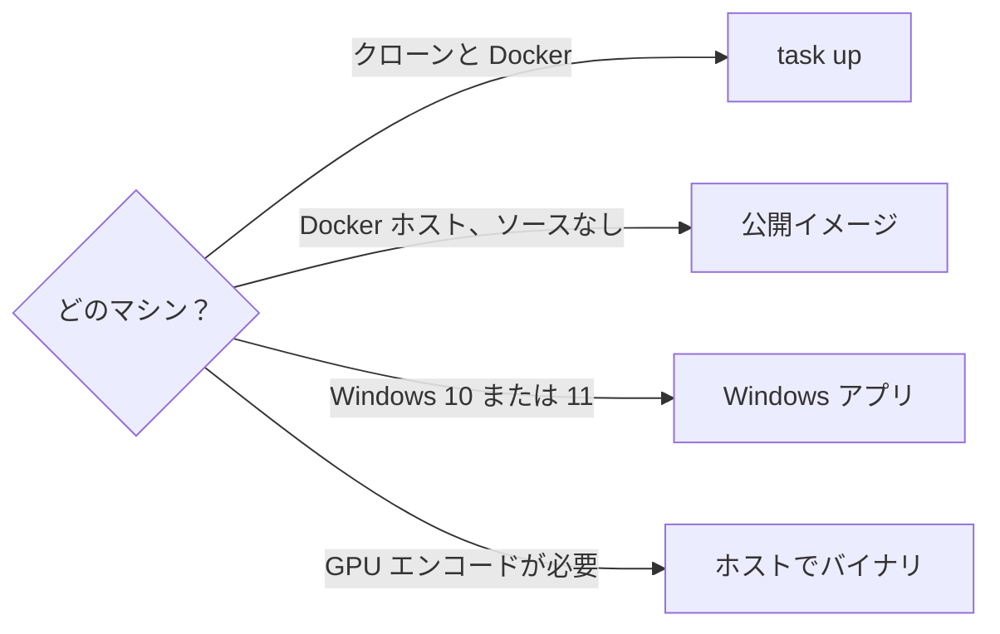
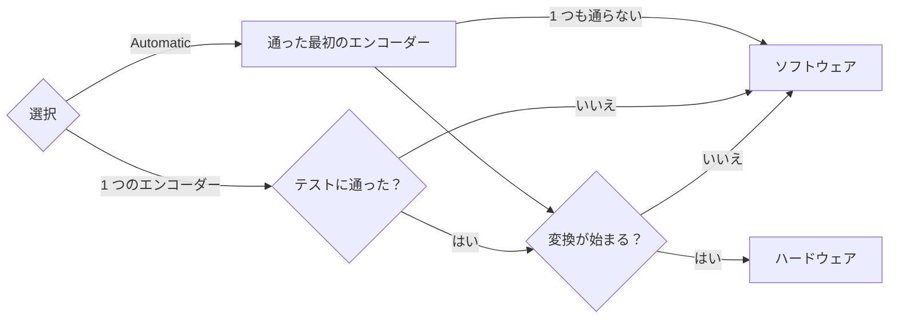
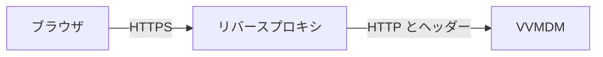
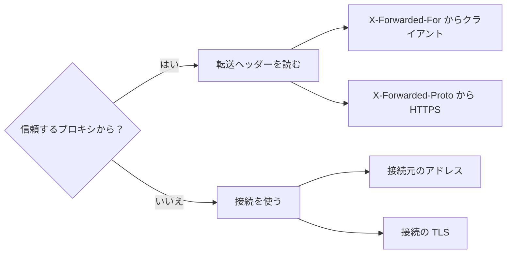

# VVMDM を動かす {#running-vvmdm}

VVMDM の動かし方は 4 通りある。マシンに合うものを選ぶ。



| 方法 | 節 | ハードウェアエンコード |
| --- | --- | --- |
| クローンから `task up` | [コンテナを起動する](#start-the-container) | 不可 |
| NAS やホームサーバーで公開イメージ | [VVMDM のホスティング](hosting-vv.md) | 不可 |
| Windows デスクトップアプリ | [Windows アプリ](#windows-app) | 不可 |
| ホストで `bin/mdm` | [VVMDM をホストで直接動かす](#run-vvmdm-directly-on-the-host) | 可 |

## コンテナを起動する {#start-the-container}

Task と Docker が必要だ。

1. リポジトリのルートから VVMDM を起動する。既定値（`./media`、`8080`）が合わないときは、メディアフォルダとホストのポートを選ぶ:

   ```bash
   task up
   MDM_MEDIA_HOST_DIR=/path/to/videos MDM_HOST_PORT=18080 task up
   ```

   メディアフォルダは `/media` に読み取り専用でマウントされる。変わるのはポートマッピングのホスト側だけで、コンテナ内では VVMDM は 8080 で待ち受ける。
2. <http://localhost:8080>（または選んだポート）を開き、[アカウントのセットアップ](#account-setup)を済ませる。ヘルスエンドポイントは `/api/health` である。
3. マウントしたフォルダを Settings で追加し、スキャンを開始する。
4. `task down` で VVMDM を停止する。

スキャンは手動だ。ファイルを追加してもスキャンは始まらない。元の動画が変更、移動、削除、変換されることは決してない。スキャン中とスキャン後は次のとおりである:

- インデックス作成が続く間も、ライブラリとプレイヤーは使える。
- 移動または名前を変更したファイルは、同一性と再生位置を保つ。
- ブラウザで再生できないファイルも一覧に残り、変換が成功すればライブ変換で再生される。
- タイトルは 1 文字目から検索できる。

## Windows アプリ {#windows-app}

Windows 10 または 11（x64）では、VVMDM は Docker、Go、Node、FFmpeg なしでデスクトップアプリとして動く。専用のウィンドウで開き、ウィンドウを閉じると停止する。

### 入手する {#get-it}

[GitHub Releases](https://github.com/syudead/vv/releases) から `VVMDM-<version>-windows-amd64.zip` をダウンロードする。zip には、`VVMDM.exe`、`README.txt`、そして `ffmpeg.exe`、`ffprobe.exe`、FFmpeg のライセンスとソースの情報を入れた `ffmpeg` フォルダが入っている。

同じ zip をソースからビルドするには、`task build-windows-app` を実行する。`dist/VVMDM-<version>-windows-amd64.zip` が書き出される。バージョンは先頭の `v` を除いた `VERSION` で、`VERSION` が未設定のときは `sha-<12 characters of the commit>` になる。

### 起動する {#start-it}

1. zip を右クリックして **Extract All** を選ぶ。zip の中から実行した `VVMDM.exe` は、先に展開するよう求める。
2. 展開したフォルダの `VVMDM.exe` を実行する。`ffmpeg` フォルダはその隣に置いたままにする。別の FFmpeg がインストールされていても、VVMDM はその FFmpeg を使う。
3. VVMDM はコード署名されていないため、初回の実行時に Windows SmartScreen が "Windows protected your PC" と表示することがある。**More info**、続いて **Run anyway** をクリックする。
4. ウィンドウで[アカウントのセットアップ](#account-setup)を済ませ、Settings でメディアフォルダを追加し、スキャンを開始する。

| 状況 | VVMDM の動作 |
| --- | --- |
| WebView2 Runtime がない | その旨と入手先を示す（Windows 10 と 11 には通常含まれている） |
| ポートが使用中か、データフォルダに書き込めない | 問題をダイアログで示す |
| 開いている間に `VVMDM.exe` をもう一度実行する | 開いているウィンドウを前面に出す |
| スキャンまたはインポートの最中にウィンドウを閉じる | 先に確認する。作業は次回の起動時に再開する |

Windows アプリは[実行時の設定](#runtime-settings)の環境変数を読まず、`mdm account` コマンドもない。

### データ {#data}

VVMDM は、サインインしている Windows ユーザーのすべてのデータを `%LOCALAPPDATA%\VVMDM` 以下に保存し、`VVMDM.exe` の隣には何も書き込まない:

| パス | 内容 |
| --- | --- |
| `data\mdm.db`（`-wal` と `-shm` を含む） | データベース。`MDM_DATA_DIR/mdm.db` と同じ |
| `data\thumbnails\` | 生成したサムネイル |
| `webview2\` | ウィンドウのブラウザデータ。サインインの Cookie を含む |
| `logs\vvmdm.log`、`logs\vvmdm.1.log` | 今回と前回の実行の JSON ログ |

バックアップするには、VVMDM を閉じて `data` フォルダをコピーする。[データと復旧](#data-and-recovery)もここに当てはまる。

### 更新する {#update}

1. VVMDM を閉じる。
2. 展開したフォルダの中身を新しい zip の中身で置き換えるか、新しい zip を新しいフォルダに展開して古いフォルダを削除する。
3. VVMDM を起動する。`%LOCALAPPDATA%\VVMDM` のデータは残り、新しいバージョンは起動時にデータベースを更新する。

VVMDM を削除するには、フォルダを削除し、ライブラリも削除するなら `%LOCALAPPDATA%\VVMDM` も削除する。

### ポート {#port}

VVMDM はポート `47880` で待ち受ける。別のプログラムがそのポートを使っているときは、VVMDM はダイアログでポートを示す。`--port` で別のポートで起動する。たとえば、ターゲットが次のショートカットから起動する:

```text
"C:\path\to\VVMDM-<version>-windows-amd64\VVMDM.exe" --port 47881
```

### 他の端末から開く {#open-it-from-other-devices}

既定では VVMDM は `127.0.0.1` だけで待ち受けるため、VVMDM を動かしている PC だけが開ける。同じネットワーク上のスマートフォンや別のコンピューターから開けるようにするには:

1. 所有者として **Settings** を開き、**Network** で **Allow connections from the local network** をオンにする。
2. Windows ファイアウォールが尋ねてきたら、**private networks** で VVMDM を許可する。
3. その節に表示されるアドレスのいずれか（`http://192.168.1.20:47880/` など）を開く。

設定は再起動後も保たれ、オフにすると他の端末からの新しい接続を受け付けなくなる。接続は平文の HTTP なので、信頼できるネットワークでだけ使う。Windows アプリは転送ヘッダーを決して読まない（`MDM_TRUSTED_PROXIES=none` として動く）。リバースプロキシの後ろに置く前に[ネットワークへの公開](#network-exposure)を読む。

## 字幕 {#subtitles}

VVMDM は、動画の隣に置かれ、動画から拡張子を除いた名前を付けた字幕ファイルを表示する。登録は不要で、再スキャンも要らない。ファイルを追加または削除してから、動画のページを開き直す。

| 動画 | 字幕ファイル | 表示名 |
| --- | --- | --- |
| `movie.mp4` | `movie.srt` または `movie.vtt` | "Default" |
| `movie.mp4` | `movie.<label>.srt` または `movie.<label>.vtt`（`movie.ja.srt`、`movie.en.forced.vtt` など） | ラベル |

| 規則 | 値 |
| --- | --- |
| 名前と拡張子の照合 | 大文字と小文字を区別しない |
| 同じラベルの `.srt` と `.vtt` | `.vtt` だけを使う |
| 形式 | SubRip（`.srt`）と WebVTT（`.vtt`） |
| 文字コード | UTF-8（BOM の有無を問わない）、BOM 付きの UTF-16、Shift_JIS |
| サイズの上限 | 4 MiB を超えるファイルは無視する |
| 探すフォルダ | 再生するファイルのフォルダだけ。`Subs/` フォルダは探さない |

動画に字幕があるとき、プレイヤーは再生速度の隣に字幕ボタンを表示し、`C` で字幕のオンとオフを切り替える。ブラウザは最後の選択を覚えており、同じラベルを持つ動画はその字幕をオンにした状態で始まる。

## 実行時の設定 {#runtime-settings}

| 変数 | 既定値 | 用途 |
| --- | --- | --- |
| `MDM_ADDR` | `:8080` | サーバーの待ち受けアドレス |
| `MDM_DATA_DIR` | `/data` | データベースと生成メディアの絶対パス |
| `MDM_LOG_LEVEL` | `info` | `debug`、`info`、`warn`、`error` のいずれか |
| `MDM_TRUSTED_PROXIES` | プライベートアドレス | 転送ヘッダーを信頼するリバースプロキシ。[ネットワークへの公開](#network-exposure)を参照 |

Docker Compose がコンテナにこれらを設定する。メディアフォルダは設定ファイルではなく Settings で管理する。不正な値はすべて、起動時にまとめて報告される。

## アカウントのセットアップ {#account-setup}

VVMDM のアカウントは 1 つだけで、それが作られるまでは、最初にサーバーに到達した人が作成できる。インストール直後、他の誰かがサーバーに到達できるようになる前に、VVMDM を開いてセットアップ画面でユーザー名とパスワードを決める。

## ユーザー名の変更とパスワードのリセット {#changing-the-username-or-resetting-the-password}

セットアップ後、ユーザー名とパスワードはホストのシェルからしか変更できない。コマンドは `MDM_DATA_DIR` だけを読み、マイグレーションを適用し、`ffmpeg` を必要とせず、サーバーが動いていても止まっていても動作する。

1. コマンドを実行する。Docker Compose でコンテナが動いている場合:

   ```bash
   docker compose exec mdm mdm account set-username NEW_NAME
   docker compose exec mdm mdm account set-password
   ```

   コンテナが止まっている場合:

   ```bash
   docker compose run --rm mdm account set-password
   ```

2. `set-password` では、新しいパスワードを 2 回入力する（エコーはオフ）。スクリプトからはパイプで渡す。標準入力が端末でないときは、最初の行を末尾の改行を除いて読む:

   ```bash
   docker compose exec -T mdm mdm account set-password < new-password.txt
   ```

パスワードは引数や環境変数では決して受け付けないため、シェルの履歴、プロセス一覧、`docker inspect` に残らない。ユーザー名は制御文字を含まず先頭と末尾に空白のない 1〜128 文字、パスワードは 1〜1024 バイトである。コマンドがアカウントを作ることは決してない。未設定のサーバーでは何も変更せず、セットアップ画面を案内する。

| 終了コード | 意味 |
| --- | --- |
| `0` | 保存した。すべてのセッションがサインアウトされ、API トークンが失効する |
| `1` | データベースを開けなかった、または書き込めなかった |
| `2` | まだ設定されていない、不正な値、確認の不一致、または不明なコマンド |

## ハードウェアエンコード {#hardware-encoding}

ブラウザで再生できない動画は、既定では CPU（ソフトウェアエンコード）で、配信しながら変換される。代わりに GPU で映像部分をエンコードでき、CPU の負荷が下がる。

ハードウェアエンコードは、VVMDM がホスト（Windows、Linux、macOS）で直接動くときだけ使える。`task up` や[VVMDM のホスティング](hosting-vv.md)の Docker イメージは GPU ドライバーを含まない。コンテナに GPU を渡しても効果はなく、そこでは Settings がすべてのハードウェアエンコーダーを利用不可と表示する。

### 各エンコーダーに必要なもの {#what-each-encoder-needs}

直接インストールした場合、VVMDM は FFmpeg も GPU ドライバーも同梱しない。`PATH` 上の `ffmpeg` を実行するため、そのビルドがエンコーダーを含み、ホストにドライバーとデバイスがなければならない。

| Settings のエンコーダー | OS | GPU とドライバー |
| --- | --- | --- |
| NVENC (NVIDIA) | Linux、Windows | NVENC を備えた NVIDIA GPU と NVIDIA ドライバー |
| Quick Sync (Intel) | Linux、Windows | oneVPL GPU ランタイムが対応する Intel GPU（Iris Xe、第 11 世代 Core 以降）、Intel ドライバー、そのランタイム |
| VAAPI (Intel/AMD) | Linux | Intel GPU（Broadwell 以降）またはビデオエンコーダーを備えた AMD GPU、VA-API ドライバー、`/dev/dri/renderD128` へのアクセス |
| VideoToolbox (macOS) | macOS | Mac。ドライバーは macOS に含まれる |

1. Linux で Quick Sync と VAAPI を使うときは、VVMDM を動かすユーザーに、通常はそのグループ（多くは `render` または `video`）を通じて、`/dev/dri/renderD128` の読み書き権限を与える:

   ```bash
   ls -l /dev/dri/renderD128
   sudo usermod -aG render "$USER"   # then sign out and in again
   ```

2. `PATH` 上の `ffmpeg` がエンコーダー（`h264_nvenc`、`h264_qsv`、`h264_vaapi`、`h264_videotoolbox` のいずれか）を一覧に出すことを確認する。出さない場合は、それを含むビルド、たとえば [ffmpeg.org](https://ffmpeg.org/download.html) からリンクされているものをインストールする。

   ```bash
   ffmpeg -hide_banner -encoders
   ```

一覧に出たエンコーダーでも、GPU が動くとは限らない。VVMDM は起動時にそれをテストする（[Settings で有効にする](#turn-it-on-in-settings)）。VAAPI は最初の GPU である `renderD128` を使う。コンシューマー向けの NVIDIA GPU は NVENC の同時セッション数を制限している。GPU が拒否した変換はソフトウェアにフォールバックする。

### VVMDM をホストで直接動かす {#run-vvmdm-directly-on-the-host}

1. [開発](development.md#set-up-the-toolchain)のとおりにツールチェーンを用意する。
2. リポジトリのルートから、単一のバイナリ `bin/mdm`（SPA を埋め込む）をビルドする:

   ```bash
   mise exec --command "task build"
   ```

3. 絶対パスのデータディレクトリ（Windows ではドライブ文字を含める）と、必要な他の[実行時の設定](#runtime-settings)を指定して起動する:

   ```bash
   MDM_DATA_DIR=/absolute/path/to/vv-data ./bin/mdm
   ```

4. <http://localhost:8080> を開き、[アカウントのセットアップ](#account-setup)を済ませ、Settings でメディアフォルダを追加する。

### Settings で有効にする {#turn-it-on-in-settings}

VVMDM は起動のたびに、各ハードウェアエンコーダーを短いエンコードでテストする。所有者として **Settings** を開き、**Video conversion** に進む:

- テストに通ったエンコーダーは選択できる。それ以外は "Not supported on this server's operating system"、"Not found on this server"、"The test encode failed" などの理由を表示する。
- エンコーダーを 1 つ、または **Automatic** を選ぶ。
- **In use now** は、変換が使うエンコーダーを示す。

選択は再起動後も保たれる。各変換は次のようにエンコーダーを選ぶ。



Automatic は NVENC、Quick Sync、VAAPI、VideoToolbox の順に試す。再起動後に選んだエンコーダーが使えないとき（ドライバーが削除された、または VVMDM が Docker イメージで動くようになった）は、Settings がソフトウェアを使っていると表示する。たとえば GPU が使用中のためにエンコーダーが開始できない変換は、ソフトウェアを使う。起動ログには各テストの結果（`transcode video encoder checks finished`）が出て、失敗したテストは FFmpeg のエラー出力の末尾とともに記録される。

## データと復旧 {#data-and-recovery}

Docker の構成では、アプリケーションのデータを `vv_data` ボリュームに保存する。SQLite データベース `MDM_DATA_DIR/mdm.db` と、`MDM_DATA_DIR/thumbnails/` 以下のサムネイルである。データベースには、スキャンでは復元できないユーザーデータと設定データが、スキャンで再構築されるインデックスと並んで入っている:

| 分類 | テーブルとファイル | 復旧の手段 |
| --- | --- | --- |
| 再構築できるインデックス | `videos`、`video_locations`、`location_search_fts`、`jobs`、`scans`、`scan_videos`、`scan_issues`、フォルダのインデックス（`folder_groups`、`folder_group_members`、`video_folder_names`、`folder_index_state`）、`video_transcode_probes`、`video_successions`、`video_fingerprints`、`video_version_candidates`、生成されたサムネイルとプレビュー | 登録済みのメディアフォルダを再びスキャンする |
| ユーザーデータ | `playback_progress`、`tags`、`tag_names`、`video_tags`、`rejected_tag_names`、`public_videos`、`video_overrides`、`video_edits`、`video_favorites`、`folder_favorites`、`video_bundles`、`video_bundle_members`、`video_version_dismissals`、`folder_group_overrides` | バックアップのみ |
| 設定 | `account`、`media_folders`、`settings`、`api_tokens` | バックアップ、または設定し直す |
| セッション | `sessions` | ログインし直す |

ユーザーデータは再スキャンで再現される値（内容の鍵、バージョンのまとまりの鍵、フォルダの絶対パス）をキーにし、動画の行の id をキーにすることはないため、インデックスを再構築しても残る。メディアフォルダを登録するまでスキャンは開始できず、失った API トークンは発行し直す必要がある。

VVMDM をリセットまたは更新する前に、`mdm.db` を含む `vv_data` ボリューム**全体**をバックアップする:

1. `task down` でコンテナを停止する。SQLite は WAL モードで動くため、書き込み中に取ったコピーは整合していないことがある。
2. Docker ボリュームのバックアップツールでボリュームをコピーする。
3. `task up` で再び起動する。

`task down` はボリュームを残す。`docker compose down -v` はボリュームを削除する。

| 状況 | 復旧 |
| --- | --- |
| バックアップがある | VVMDM を停止し、ボリュームを復元し、VVMDM を起動する |
| バックアップなしでデータベースを失った | 新しいアカウントを作り、Settings でメディアフォルダを登録し直し、スキャンする。ユーザーデータと設定データは失われる |
| スキャン中に VVMDM が停止した（`task down`、再起動、シャットダウン） | 次回の起動時に自動で再スキャンし、インデックス済みで変更のないファイルは素早く通過する |
| インポート中に VVMDM が停止した | 再起動後にインポートが続く |

## ネットワークへの公開 {#network-exposure}

信頼できる家庭のネットワークでは平文の HTTP で問題ない。インターネットから VVMDM に到達するには、HTTPS を提供するリバースプロキシの後ろに置き、VVMDM 自身の HTTP ポートは決して公開しない。HTTP ではパスワードとセッション Cookie が暗号化されずに流れる。



リバースプロキシは次を満たさなければならない:

- HTTPS を終端し、HTTP で VVMDM に転送する。
- `Host` を変えずに渡す（VVMDM は同一オリジンの変更だけを受け付けるためにそれを `Origin` と比較し、`X-Forwarded-Host` は読まない）。
- `X-Forwarded-For` にクライアントのアドレスを設定または追記し、`X-Forwarded-Proto` を `https` に設定する。

VVMDM は既定で、ループバックとプライベートアドレス（`127.0.0.0/8`、`10.0.0.0/8`、`172.16.0.0/12`、`192.168.0.0/16`、`::1`、`fc00::/7`）からの転送ヘッダーを信頼する。そのため、同じ PC、家庭のネットワーク、同じ Docker ネットワーク上のプロキシには設定が要らない。`MDM_TRUSTED_PROXIES` を設定するのは、これをカンマまたは空白で区切った CIDR 範囲か単一のアドレスで狭めるときか、転送ヘッダーを決して読まないよう `none` にするときだけだ:

```bash
MDM_TRUSTED_PROXIES=172.18.0.0/16 task up
```

VVMDM は接続ごとに、クライアントのアドレスと HTTPS かどうかを次のように決める。



信頼するプロキシからの場合、クライアントのアドレスは `X-Forwarded-For` を右から最初の信頼しないアドレスまでたどって求め、HTTPS かどうかは最後の `X-Forwarded-Proto` の値から決める。インターネット上のクライアントはどちらも偽装できない。既定の設定では、家庭のネットワーク上の端末は偽装できる。別のアドレスを名乗ってログイン試行の制限を回避できるので、ネットワーク上のすべての端末を信頼しないなら、`MDM_TRUSTED_PROXIES` をプロキシのアドレスに狭める。`Forwarded` ヘッダー（RFC 7239）は読まない。不正なエントリは、他の不正な設定とともに起動時に報告される。

クライアントのアドレスと HTTPS かどうかで、次が決まる:

- ログイン試行の制限と、認証ログのアドレス。
- セッション Cookie。HTTPS では `Secure` 付きの `__Host-vv_session`、HTTP では `vv_session`。
- 同一オリジンの検査。
- "open in default app" がサーバー自身の PC からの操作とみなされるかどうか。この操作は、プロキシが同じ PC で動いていてもリモートのクライアントには拒否され、さらに接続自体がループバックから来ることも求めるため、ネットワーク上の端末が `X-Forwarded-For` で `127.0.0.1` を名乗ることはできない。

| 症状 | 原因 | 対処 |
| --- | --- | --- |
| 1 人のログイン失敗で全員がロックアウトされる | プロキシのアドレスが信頼されていないため、すべてのクライアントがそのアドレスと 1 つのログイン試行制限を共有する | プロキシを `MDM_TRUSTED_PROXIES` に追加するか、プロキシにプライベートアドレスを与える |
| ログインを含むすべての変更（`POST`、`PUT`、`PATCH`、`DELETE`）が 403 で失敗する | プロキシが信頼されていないため、リクエストが HTTP とみなされ、ブラウザの `https://` の `Origin` と一致しない | 上と同じ |

VVMDM と Caddy が同じ Docker ネットワークにある場合の最小の Caddy 設定:

```caddyfile
vv.example.com {
	reverse_proxy mdm:8080
}
```

Caddy は証明書を取得し、`Host` をそのまま渡し、既定で `X-Forwarded-For` と `X-Forwarded-Proto` を設定する。Docker ネットワークはプライベートアドレスを使うので、`MDM_TRUSTED_PROXIES` の設定は要らない。
