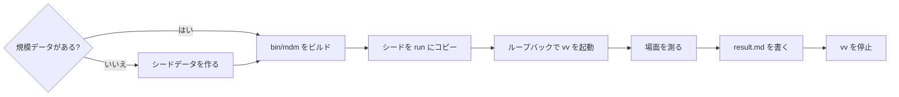
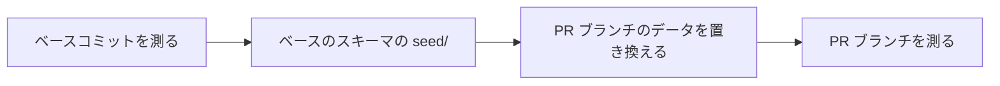

# 大規模データでタグ管理画面を測る {#measure-the-tag-admin-screen-with-scale-data}

タグ管理画面（`/tags`）の描画方法を変える PR は、変更前と変更後の時間を記録する。時間は本番ビルドに対してヘッドレス Chromium から測り、ライブラリは 1,000 タグと動画 10,000 本、3,000 タグと動画 30,000 本、30,000 タグと動画 30,000 本の 3 つである。何を測り何を期待するかは [specs/036-tag-admin-scale/quickstart.md](../../specs/036-tag-admin-scale/quickstart.md) に、この構成の根拠は [research.md R-9](../../specs/036-tag-admin-scale/research.md#r-9-scriptstagsbench-builds-scale-data-and-a-playwright-script-measures-the-production-build) にある。

このベンチマークは `task check`、`task test-e2e`、CI のいずれにも含まれない。画面の描画方法を変える PR で、手動で実行する。

## 前提 {#prerequisites}

- `task build` が通る環境（Go、Node、`ffmpeg`、`ffprobe`。[ローカル開発](development.md) を参照）。ベンチマークは動画ファイルを作らないので、`ffmpeg` は vv の起動時チェックでだけ使われる。
- `web/` 用の Playwright の Chromium がインストールされている（`task test-e2e` と同じ）。インストールできない環境では、`-chromium` でローカルの Chromium を渡す。

## 手順 {#steps}

### 1. 測る {#1-measure}

```sh
go run ./scripts/tagsbench -scale 1000
go run ./scripts/tagsbench -scale 3000
go run ./scripts/tagsbench -scale 30000 -videos 30000
```

`scripts/tagsbench` の各実行は次の段階を経る。



| 段階 | 動作 |
| --- | --- |
| シードデータを作る | 存在しないときだけ `.local/tagsbench/<data name>/seed/` に書き込む |
| `bin/mdm` をビルド | `go run ./scripts/build` が単一バイナリをビルドする。`-skip-build` で省略する |
| シードを run にコピー | 測定は確定と改名で行を書き換えるので、毎回の実行は `seed/` を `run/` にコピーしたものから始める |
| vv を起動 | `bin/mdm` が空いているループバックのポートで `run/` のデータを配信する |
| 場面を測る | `web/bench/tags-admin.bench.ts`（`web/bench/playwright.config.ts` で設定する）が表を出力する |
| 結果を書く | 表は `.local/tagsbench/<data name>/result.md` に書かれる。その後 vv は停止する |

| フラグ | 意味 |
| --- | --- |
| `-scale N` | 規模（タグの数）。必須 |
| `-videos N` | 動画の数（1 以上）。既定は `-scale` の 10 倍 |
| `-skip-build` | 既存の `bin/mdm` を再ビルドせずに使う |
| `-chromium PATH` | Playwright のものの代わりに使う Chromium の実行ファイル |

シードデータは次の規則に従う。

| 性質 | 値 |
| --- | --- |
| 30,000 タグの規模での動画 | 30,000 本。3,000 タグの規模と同じなので、違いはタグの数だけになる（R-9） |
| データ名 | 動画がタグの 10 倍のときは規模（`1000`）。それ以外は動画の数を付け足す（`30000-videos-30000`） |
| 動画が 0 本のタグ | 11 個に 1 個（約 9%）。ほかのタグはすべて動画を持つ |
| 仮のタグ | タグの半分 |
| 行の書き込み方 | `internal/store` の公開操作を通す |
| 動画ファイル | なし。メディアフォルダ `.local/tagsbench/<data name>/media/` の下の場所の行だけ |
| 初回の所要時間 | 1,000 で約 1 分、3,000 で数分、30,000 で約 10 分 |

規模データを作り直すには、`.local/tagsbench/<data name>/` を削除する。データの作り方（`scripts/tagsbench` の `planTags`）を変えた後も削除する。

### 2. 変更前と変更後を比べる {#2-compare-before-and-after}

変更前と変更後は、同じ環境で続けて測る。変更前のコミットに `scripts/tagsbench` や `web/bench/` がない、または古いときは、PR ブランチのものを worktree にコピーしてそこで実行する。

シードデータはスキーマのバージョンをまたいで前方にしか使えないので、ベースコミットを先に測る。



`scripts/tagsbench` は、ビルドに使った `internal/store` のスキーマで `seed/` を書く。vv は起動のたびにコピー（`run/`）だけをマイグレーションし、`seed/` は決して書き換えないので、ベースのスキーマで作った `seed/` は両側で使える。PR ブランチの `scripts/tagsbench` で作った `seed/`（新しいスキーマ）は、ベースコミットの vv では開けない。PR ブランチの `.local/tagsbench` にすでにあるデータは PR ブランチが作ったものなので、ベース側にコピーしない。コピーした `scripts/tagsbench` がベースコミットの `internal/store` の操作に対してビルドできないときは、データ作成の部分だけをベースの操作に合わせる。

```sh
# Before (the PR's base commit) first; seed/ is created in the base schema
git worktree add ../vv-before <base commit>
cp -r scripts/tagsbench ../vv-before/scripts/   # only when the base lacks it or has an old one
cp -r web/bench ../vv-before/web/               # only when the base lacks it or has an old one
ln -s "$PWD/web/node_modules" ../vv-before/web/node_modules
(cd ../vv-before && go run ./scripts/tagsbench -scale 1000)
(cd ../vv-before && go run ./scripts/tagsbench -scale 3000)
(cd ../vv-before && go run ./scripts/tagsbench -scale 30000 -videos 30000)

# After (the PR branch); replace its data with the data the base created
rm -rf .local/tagsbench
mkdir -p .local && cp -r ../vv-before/.local/tagsbench .local/
go run ./scripts/tagsbench -scale 1000
go run ./scripts/tagsbench -scale 3000
go run ./scripts/tagsbench -scale 30000 -videos 30000
git worktree remove --force ../vv-before
```

### 3. 結果を PR に記録する {#3-record-the-results-in-the-pr}

環境（OS、CPU、ブラウザのバージョン）と、規模ごとの各場面の値を記録する。規模は列見出し（1,000、3,000、30,000）で区別する。PR 本文が日本語なので、雛形も日本語である。

```markdown
環境: Linux x86_64, <CPU>, Chromium <版>

| 場面 | 1,000 変更前 | 1,000 変更後 | 3,000 変更前 | 3,000 変更後 | 30,000 変更前 | 30,000 変更後 | 期待 |
| --- | --- | --- | --- | --- | --- | --- | --- |
| 開いてから最初の行が出るまで（中央値） | 0 ms | 0 ms | 0 ms | 0 ms | 0 ms | 0 ms | 1 秒以内 |
| 開いたときに受け取るタグ（items / 本文） | 0 / 0 B | 0 / 0 B | 0 / 0 B | 0 / 0 B | 0 / 0 B | 0 / 0 B | 3 つの規模で同じ（±5%） |
| GET /api/tags の応答（内訳） | 0 ms | 0 ms | 0 ms | 0 ms | 0 ms | 0 ms | — |
| 検索の 1 文字目（最長のタスク） | 0 ms | 0 ms | 0 ms | 0 ms | 0 ms | 0 ms | 0.2 秒を超えない |
| Esc での取り消し（最長のタスク） | 0 ms | 0 ms | 0 ms | 0 ms | 0 ms | 0 ms | 0.2 秒を超えない |
| 1 件の確定（最長のタスク） | 0 ms | 0 ms | 0 ms | 0 ms | 0 ms | 0 ms | 0.2 秒を超えない |
| 1 件の改名（最長のタスク） | 0 ms | 0 ms | 0 ms | 0 ms | 0 ms | 0 ms | 0.2 秒を超えない |
| スクロール（50 ms 超が続いた回数 / 最長のフレーム） | 0 / 0 ms | 0 / 0 ms | 0 / 0 ms | 0 / 0 ms | 0 / 0 ms | 0 / 0 ms | 2 つ続かない |
| まとめての確定（最長のタスク） | 0 ms | 0 ms | 0 ms | 0 ms | 0 ms | 0 ms | 0.2 秒を超えない |
```

## 表の読み方 {#read-the-table}

場面は quickstart.md の 8 つと、内訳の 1 行である。値はマシンとブラウザで変わるので、期待の列とではなく、同じ環境で測った変更前の値と並べて読む。

| 場面 | 値 |
| --- | --- |
| 開いてから最初の行が出るまで | `/tags` へのナビゲーションの開始から、一覧の最初の行が DOM に現れるまでの時間。3 回再読み込みし、各値と中央値 |
| 開いたときに受け取るタグ | 開いたときの `GET /api/tags` の応答の `items` の数と、本文のサイズ（Playwright の `response.body()` のバイト数） |
| `GET /api/tags` の応答（内訳） | 開いたときの `GET /api/tags` の応答時間（`response.timing` の `responseEnd`） |
| 検索の 1 文字目、Esc での取り消し、1 件の確定、1 件の改名、まとめての確定 | 操作から目に見える結果までの最長のタスク（Long Task） |
| スクロール | マウスホイールで一覧を先頭から末尾までスクロールし、途中で続きを読み込む間の `requestAnimationFrame` の間隔 |

場面ごとの詳細は次のとおり。

- 開いたときに受け取るタグ: 備考には転送サイズ（`request.sizes()`）と `nextCursor` の有無が加わる。3 つの規模すべてで件数とサイズ（±5%）が同じなら、開いたときの転送量はタグの数とともに増えない。
- `GET /api/tags` の応答: 応答が長ければサーバー側が時間を使っており、短ければ描画が時間を使っている（[quickstart.md](../../specs/036-tag-admin-scale/quickstart.md#breakdown)）。
- 最長のタスク: ブラウザは 50 ms を超えるタスクだけを記録するので、1 つもなければ値は `なし（50 ms 以下）` になる。備考の `〜まで` の値は Playwright の往復を含み、参考にすぎない。
- スクロール: ベンチマークはまず `/tags` を開き直す。50 ms を超えるフレームが続いた回数と最長のフレームを報告し、備考には読み込んだ行の数、続きの読み込みの要求の数とそれらの応答時間が加わる。末尾には、最後のページが描画された後の下端で届く。`nextCursor` が尽き、列見出しの "Select all N loaded tags" の N がページ見出しのタグ数に達する（036 の最初の形では、件数の隣の " · N loaded" が消える）。60 秒の間、位置も読み込んだ行も変わらなければスクロールを止め、備考に `末尾に届かず` を示す。
- まとめての確定: ベンチマークは `/tags` を開き直し、"Tentative only"（上部バーの "Filter" の中。036 の最初の形ではトグルボタン）と "Select all N loaded tags"（変更前の画面では "Select all shown tags"）で読み込み済みの仮のタグをすべて選び、選択バーの "Confirm" から、結果の通知（"Confirmed N tags"）または "No tentative tags" が現れるまでを測る。まとめて選ぶ手段が画面にないコミットでは、値は `測れない` になる。
