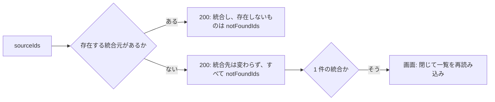
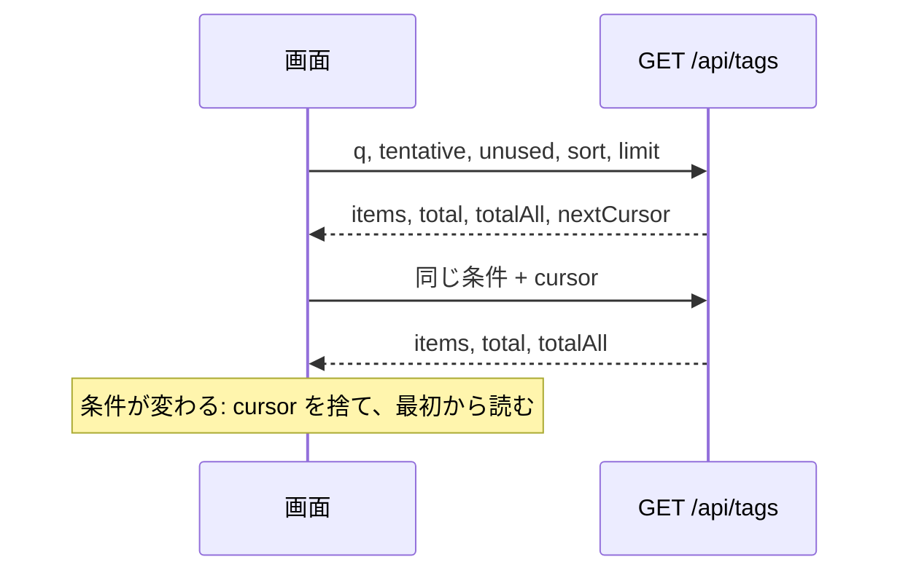

# 契約: 画面 API のページ単位の読み込み、一括操作、`createdAt` {#contract-paged-reads-bulk-actions-and-createdat-in-the-screen-api}

正本: [api/openapi.yaml](../../../api/openapi.yaml)。この文書は、追加したフィールド、ルート、パラメータ、エラーだけを列挙する。エラーの形、同一オリジンの確認、JSON 本文の読み取り、`requiresJSONBody` と `openapi_routes_test.go` への追加は [specs/014-video-tags/contracts/tags-api.md](../../014-video-tags/contracts/tags-api.md) のとおりである。決定は [research.md の R-1、R-4 から R-6、R-8、R-13、R-14](../research.md) にある。どのルートも所有者専用である (`security` は既存のタグ操作と同じ)。外部 API (`api/external-v1.yaml`) は変わらない。

| 部分 | 状態 |
| --- | --- |
| [`POST /api/tags/batch`](#post-apitagsbatch) から [`POST /api/tags/impact`](#post-apitagsimpact)、[スキーマの変更](#schema-changes) の `Tag.createdAt` と一括操作のスキーマ | feature ブランチにマージ済み。親 Issue の改訂で変わらない |
| [スキーマの変更](#schema-changes) の一覧のスキーマ、[`GET /api/tags` のパラメータ](#get-apitags-parameters)、[`GET /api/tags/rejected-names` のパラメータ](#get-apitagsrejected-names-parameters)、[`web/src/api` の関数](#websrcapi-functions) のそれらの関数 | 改訂で追加 |

## スキーマの変更 {#schema-changes}

| スキーマ | 追加するフィールド | 規則 |
| --- | --- | --- |
| `Tag` | `createdAt: string, format: date-time` (`required`) | `tags.created_at`。`GET /api/tags` と、作成、名前の変更、統合、同義語、確定の応答に現れる (マージ済み) |
| `TagList` | `total: integer` (`required`)、`totalAll: integer` (`required`)、`nextCursor: string` (省略可能) | `total` は条件 (`q`、`tentative`、`unused`) に合うタグの数、`totalAll` はすべてのタグの数。`nextCursor` は `limit` 付きの要求で続きが残っているときだけある (`LibraryPage` と同じ) |
| `RejectedTagNameList` | `total: integer` (`required`)、`nextCursor: string` (省略可能) | `total` は却下した名前すべての数 |

新しいスキーマ (マージ済みの一括操作):

```yaml
TagBatchRequest:
  type: object
  required: [action, ids]
  additionalProperties: false
  properties:
    action: { type: string, enum: [confirm, reject, delete] }
    ids:
      type: array
      minItems: 1
      maxItems: 20000
      items: { type: integer, format: int64 }

TagBatchResponse:
  type: object
  required: [appliedIds, notFoundIds, notApplicableIds]
  additionalProperties: false
  properties:
    appliedIds:        { type: array, items: { type: integer, format: int64 } }  # ids processed
    notFoundIds:       { type: array, items: { type: integer, format: int64 } }  # ids that no longer existed
    notApplicableIds:  { type: array, items: { type: integer, format: int64 } }  # ids of a kind the action does not apply to

TagMergeResponse:
  type: object
  required: [tag, notFoundIds]
  additionalProperties: false
  properties:
    tag:         { $ref: "#/components/schemas/Tag" }                            # the merge target after the merge
    notFoundIds: { type: array, items: { type: integer, format: int64 } }        # sources that no longer existed

TagImpactRequest:
  type: object
  required: [action, ids]
  additionalProperties: false
  properties:
    action: { type: string, enum: [reject, delete, merge] }   # the action being confirmed; it decides which kinds are counted
    ids:
      type: array
      minItems: 1
      maxItems: 20000
      items: { type: integer, format: int64 }

TagImpactResponse:
  type: object
  required: [tagCount, videoCount]
  additionalProperties: false
  properties:
    tagCount:   { type: integer }   # ids that exist now and that action applies to
    videoCount: { type: integer }   # videos now in the library carrying any of them (no duplicates)
```

新しいスキーマ (改訂で追加):

```yaml
TagSort:
  type: string
  enum: [name, countDesc, countAsc, createdDesc, createdAsc]
  default: name
  # name is the natural name order (no direction). Tags with the same value sort by
  # natural name order, then by id (specs/036-tag-admin-scale/data-model.md "Migration" and "Store operations")
```

`ErrorReason` に `too_many_tags` を加える (`limit` 付きで、`too_many_videos` と同じ形。マージ済み)。

## `POST /api/tags/batch` {#post-apitagsbatch}

複数のタグを 1 つのトランザクションで確定、却下、または削除する。

| 本文 | 成功 | エラー |
| --- | --- | --- |
| `TagBatchRequest` | 200 `TagBatchResponse` | 400 `invalid_request` (`action` が 3 つの値のどれでもない。`ids` が空または長すぎる: reason `too_many_tags`) |

| 場合 | 規則 |
| --- | --- |
| 重複した `ids` | 1 つとして扱う。応答の 3 つの配列は重ならず、合わせると重複を除いた `ids` に等しく、`ids` に現れた順に並ぶ。空の配列は `[]` で、`null` にはしない |
| 操作が適用される種類 | [data-model.md、`domain` に追加する値](../data-model.md#values-added-to-domain) の `TagBatchApplies`: `confirm` と `reject` は仮のタグに、`delete` は確定したタグに適用する。それ以外の id は何も変えず、`notApplicableIds` に入る |
| 存在しない id | `notFoundIds` |
| 残り | 1 つのトランザクションで処理する ([data-model.md、ストアの操作](../data-model.md#store-operations))。トランザクションが失敗したら `500` で、何も変わらない |
| ルーティング | `/api/tags/batch` と `/api/tags/impact` は、リテラルのセグメントが優先するという `ServeMux` の規則で `/api/tags/{id}` と区別される。`openapi_routes_test.go` は `{id}` がどちらも受け取らないことを確認する (`/api/tags/rejected-names` と同じ) |
| `reject` の後の画面 | 1 件の却下の後と同じく、却下した名前の最初のページを読み直す ([`GET /api/tags/rejected-names` のパラメータ](#get-apitagsrejected-names-parameters)) |
| 1 件のタグのルート | `POST /api/tags/{id}/confirm` と `/reject`、`DELETE /api/tags/{id}` は変わらない。行の操作は引き続きそれらを使う |

## `POST /api/tags/{id}/merge` の変更 {#post-apitagsidmerge-changes}

1 つ以上の統合元のタグを、タグ `{id}` に統合する。

| 本文 | 成功 | エラー |
| --- | --- | --- |
| `{ sourceIds: int64[] }` (1 から 20,000) | 200 `TagMergeResponse` | 400 `invalid_request` (`sourceIds` が空または長すぎる: reason `too_many_tags`。`sourceIds` が `{id}` を含む: reason `merge_same_tag`)、404 `tag_not_found` (統合先が存在しない) |

- `MergeTagRequest` の `sourceId` を削除し、`sourceIds` を `required` にする。1 件の統合 (行の "Merge into another tag…") も `sourceIds: [sourceId]` を送る。
- 応答は `Tag` から `TagMergeResponse` に変わる。存在しない統合元は飛ばして `notFoundIds` に列挙し、残りを 1 つのトランザクションで統合する。

図は、結果が統合元のどれがまだ存在するかでどう変わるかを示す。



すべての統合元が `notFoundIds` で返ってきた 1 件の統合は、今の `tag_not_found` と同じように扱う。画面はダイアログを閉じて一覧を再読み込みする。統合先が選択したタグに含まれるとき、画面は送る前にそれを統合元から除く (Edge Case)。統合先が残った唯一の統合元のとき、画面は送らない (操作は実行できない)。

## `POST /api/tags/impact` {#post-apitagsimpact}

一括の却下、削除、統合が影響するタグと動画を、何も変えずに数える。

| 本文 | 成功 | エラー |
| --- | --- | --- |
| `TagImpactRequest` | 200 `TagImpactResponse` | 400 `invalid_request` (`action` が 3 つの値のどれでもない。`ids` が空または長すぎる: reason `too_many_tags`) |

| 規則 | 詳細 |
| --- | --- |
| 本文を使う理由 | 数千の id は URL に収まらない。`POST /api/video-tags/summary` と同じ形 |
| 数える対象 | 今存在し、`action` が適用される `ids` だけ ([data-model.md、`domain` に追加する値](../data-model.md#values-added-to-domain) の `TagImpactApplies`): `reject` は仮のタグを、`delete` は確定したタグを、`merge` は両方を数える。`POST /api/tags/batch` が飛ばすタグとその動画は数えない。統合では、画面は統合先を除いた統合元を送る |
| `videoCount` | [data-model.md、ストアの操作](../data-model.md#store-operations) の `TagImpact` として数える |
| 画面 | 一括の却下、削除、統合の確認を開いたときに呼ぶ。応答までは件数を読み込み中として表示する。失敗すると確認は理由を表示して操作を実行できなくするので、件数のない確認から操作が実行されることはない。一括の確定は確認を求めず、これを呼ばない (要件 11) |

## `web/src/api` の関数 {#websrcapi-functions}

`tags.ts` に追加または変更する。

| 関数 | 振る舞い |
| --- | --- |
| `listTagPage(query, signal)` | 改訂で追加。[`GET /api/tags` のパラメータ](#get-apitags-parameters) で `GET /api/tags` を呼び、`TagList` (`items`、`total`、`totalAll`、`nextCursor`) を返す。共有キャッシュには触れない。条件が変わったときに中止できるよう、呼び出し元の `AbortSignal` を受け取る |
| `listRejectedTagNamePage(cursor, limit, signal)` | 改訂で追加。[`GET /api/tags/rejected-names` のパラメータ](#get-apitagsrejected-names-parameters) で `GET /api/tags/rejected-names` を呼び、`RejectedTagNameList` を返す。今の `listRejectedTagNames` を置き換える |
| `getTags`、`refreshTags`、`subscribeTags`、`currentTags` | 変わらない (`limit` なしの `GET /api/tags` ですべてのタグを読み、候補と絞り込みの検証が使う)。`listTags` は引き続き `items` だけを使う |
| `afterTagChanged` | 改訂で変更。購読者 (`subscribeTags`) がいれば従来どおり再読み込みし、いなければ `held` を捨てて次の `getTags` が読み直すようにする ([research.md R-12](../research.md#r-12-actions-update-the-loaded-rows-in-place-positioned-with-a-port-of-naturalsortkey))。`clearListSnapshot` は変わらない |
| `batchTags(action, ids)` | `POST /api/tags/batch`。成功時に `afterTagChanged` を 1 回呼ぶ (マージ済み) |
| `mergeTag(id, sourceIds)` | `TagMergeResponse` を返す。`tag_not_found` は `refreshOnStaleTagError` を通る (マージ済み) |
| `tagImpact(action, ids)` | `POST /api/tags/impact`。共有キャッシュには触れない (マージ済み) |
| `Tag`、`TagSort` | 生成コードから |

| 定数または文言 | 規則 |
| --- | --- |
| `errorText` | `too_many_tags` の文言を持つ (マージ済み) |
| `maxTagBatch = 20000` | `maxVideoTagsSelection` の隣に置く。上限は送る id の数に適用されるので、画面は読み込んだ行が上限を超えたときに "読み込んだ行をすべて選択" (見出しのチェックボックス) だけを無効にし、選択が上限を超えたときにだけ一括操作を無効にする ([research.md R-4](../research.md#r-4-bulk-confirm-reject-and-delete-use-one-post-apitagsbatch-transaction-that-skips-and-counts-misses)) |
| `tagPageLimit = 100` | 追加。画面の 1 ページあたりのタグの数 |

## `GET /api/tags` のパラメータ {#get-apitags-parameters}

| パラメータ | 型 | 既定値 | 意味 |
| --- | --- | --- | --- |
| `q` | string、`maxLength: 100` | 空 | 検索語。`FoldForMatch` で畳み込んで前後の空白を除く。空でないときは、元の名前か同義語の照合形がそれを含むタグだけを返す ([014 data-model.md、検索欄でのタグ名の照合](../../014-video-tags/data-model.md#matching-tag-names-in-the-search-box) の照合形。語は単語に分割しない) |
| `tentative` | boolean | false | true のとき、仮のタグだけ |
| `unused` | boolean | false | true のとき、どの動画にも付いていないタグだけ。`tentative` と `q` と AND で組み合わせる |
| `sort` | `TagSort` | `name` | 並び順。同じ値のタグは自然な名前順、次に `id` で並ぶ |
| `cursor` | string | — | 前の応答の `nextCursor`。中身は不透明 |
| `limit` | integer、1 から 200 | — | 1 ページあたりのタグの数。**省略すると、すべてのタグ**を `nextCursor` なしで返す (候補、絞り込みの検証、外部 API の経路が使う既存の形) |

| 成功 | エラー |
| --- | --- |
| 200 `TagList` (`items`、`total`、`totalAll`、`limit` が設定され続きが残っているときの `nextCursor`、下記の `exact`) | 400 `invalid_request` (`sort` が 5 つの値のどれでもない、`limit` が範囲外、`cursor` が読めないか別の並び順のもの、`q` が 100 文字を超える) |

図は、画面が一覧をページ単位で読む流れを示す。



| 規則 | 詳細 |
| --- | --- |
| `total`、`totalAll` | `total` は `q`、`tentative`、`unused` をすべて適用し、`totalAll` はどれも適用しない。どちらもページ分けに関係なく返す (`LibraryPage.total` と同じ) |
| カーソルの再利用 | `cursor` は同じ `q`、`tentative`、`unused`、`sort` で使う。条件が変わったら、画面はカーソルを捨てて最初から読む。別の `sort` のカーソルは `400` を返す。別の条件 (`q` など) でカーソルを再利用した結果は保証しない (ライブラリと同じ) |
| ページ分けの途中の変更 | ページ分けの途中で別のタブがタグを追加、削除、名前変更したときの保証は、ライブラリのキーセットと同じ ([013 list-api.md、カーソルとエラー](../../013-library-search/contracts/list-api.md#cursor-and-errors))。画面は重複した `id` を捨て、`totalAll` の不一致を報告する ([data-model.md、画面の状態](../data-model.md#screen-state)) |
| 行の内容 | 動画の数 (`videoCount`)、同義語、`tentative`、`createdAt` を従来どおり返す |
| `exact` | `limit` があり `cursor` がない要求で、元の名前か同義語が、前後の空白を除いた `q` と正確に同じ綴り (照合形ではなくバイト単位) で、`tentative` と `unused` にも合うタグ。それ以外では存在しない。`items` は `sort` 順の部分一致の 1 ページなので、`items` に含まれないことがある。統合のダイアログはこれを使って、正確に一致する統合先を提示する ([ui-design.md "Target candidates"](../ui-design.md#target-candidates)) |
| 外部 API | `GET /api/v1/tags` は変わらない (`limit` なしの要求と同じ結果を、今の形で返す) |
| キャッシュ | 今と同じく `Cache-Control: no-store` |

## `GET /api/tags/rejected-names` のパラメータ {#get-apitagsrejected-names-parameters}

| パラメータ | 型 | 既定値 | 意味 |
| --- | --- | --- | --- |
| `cursor` | string | — | 前の応答の `nextCursor` |
| `limit` | integer、1 から 200 | 100 | 1 ページあたりの名前の数 |

| 成功 | エラー |
| --- | --- |
| 200 `RejectedTagNameList` (`items`、`total`、続きが残っているときの `nextCursor`) | 400 `invalid_request` (`limit` が範囲外、`cursor` が読めない) |

| 規則 | 詳細 |
| --- | --- |
| 順序 | 自然な名前順 (`sort_key`、次に `name` のバイト順。[data-model.md、マイグレーション](../data-model.md#migration)) |
| 削除 | `DELETE /api/tags/rejected-names?name=…` は変わらない ([031 contracts/screen-api.md、却下した名前](../../031-tentative-tags/contracts/screen-api.md#rejected-names)) |
| 画面 | 開いたときに最初のページを受け取り、入口に `total` を表示する。最後までスクロールしたら、`nextCursor` で次のページを追加する ([research.md R-13](../research.md#r-13-rejected-names-load-in-pages-from-get-apitagsrejected-names-with-more-loaded-on-scroll)) |
