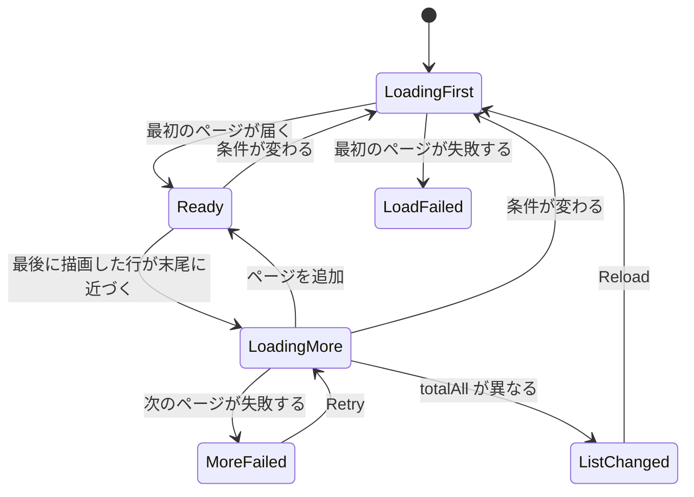

# データモデル: ページ単位のタグ一覧、タグの一括操作、画面の状態 {#data-model-paged-tag-list-bulk-tag-actions-and-screen-state}

親 Issue: #651。モデルの残りは変わらない。正本:

| 項目 | 出典 |
| --- | --- |
| 既存のテーブル定義 | [internal/store/migrations/](../../internal/store/migrations/) |
| タグのテーブル、名前の規則、書き込みの規則 | [specs/014-video-tags/data-model.md](../014-video-tags/data-model.md) |
| 仮のタグと却下した名前 | [specs/031-tentative-tags/data-model.md](../031-tentative-tags/data-model.md) |

このファイルは、`domain` に追加する値、追加または変更するストアの操作、画面の状態の規則だけを扱う。ここで挙げない操作 (1 件の作成、名前の変更、削除、確定、却下、同義語、動画へのタグの追加と削除、動画の数) は変わらない。

§1 から §3 の一括操作 (`BatchTags`、`MergeTags`、`TagImpact`) は feature ブランチにマージ済みで、親 Issue の改訂で変わらない。§0 のマイグレーション、§1 のページの値、§2 の `ListTags`、`ListRejectedTagNames`、キーの書き込み、§4 は改訂で追加または書き直した。

## 0. マイグレーション {#0-migration}

マイグレーションは `00030_tag_sort_keys.sql` の 1 つ ([research.md R-10](research.md#r-10-a-natural-order-name-key-sort_key-on-tag_names-and-rejected_tag_names-filled-by-the-startup-key-refresh))。テーブルの意味と既存の列は変わらない。

| テーブル | 追加する列 | 規則 |
| --- | --- | --- |
| `tag_names` | `sort_key text not null default ''` | `domain.NaturalSortKey(name)`。名前の行を書くすべての操作 (作成、同義語、割り当て時の作成、名前の変更) が、同じトランザクションで `search_key` と一緒に書く。`tag_id` を移す統合は変えない |
| `rejected_tag_names` | `sort_key text not null default ''`、`search_version integer not null default 0` | `sort_key` は `domain.NaturalSortKey(name)` で、却下が書く。`search_version` の意味は `tag_names.search_version` と同じ (`domain.SearchKeyVersion`) |

マイグレーションは `update tag_names set search_version = 0` を実行し、起動時の `TagStore.RefreshSearchKeys` が既存の行の `sort_key` を `search_key` と一緒に埋める (§2)。既存の `rejected_tag_names` の行は `search_version` が既定値の 0 なので、同じ更新が拾う。キーは作り直せる派生値で、`SearchKeyVersion` を上げたときは同じ仕組みで作り直す。

**自然な名前順**: `sort_key` のバイト順、次に `tags.id` (却下した名前では `name` のバイト順)。`NaturalSortKey` は照合形 (`FoldForMatch`) に対して働くので、全角、半角、かなを畳み込んで等しくなる名前は同順になり、`id` で並ぶ (R-10、"Change in the name order")。

## 1. `domain` に追加する値 {#1-values-added-to-domain}

マージ済み (一括操作):

| 値 | 内容 |
| --- | --- |
| `Tag.CreatedAt time.Time` | `tags.created_at` (Unix 秒)。`Tag` を返すすべての操作が設定する。API では `Tag.createdAt` ([research.md R-8](research.md#r-8-date-created-is-tagscreated_at-exposed-as-tagcreatedat-tags-created-in-the-same-second-sort-by-name)) |
| `TagBatchAction` | `TagBatchConfirm`、`TagBatchReject`、`TagBatchDelete` の 3 つの値と `Valid()` |
| `TagBatchOutcome{AppliedIDs, NotFoundIDs, NotApplicableIDs []int64}` | 一括操作の結果。各配列は `ids` の順を保ち、id がないときは `nil` ではなく空 |
| `TagMergeOutcome{Tag Tag, NotFoundIDs []int64}` | 統合の結果。`Tag` は統合後の統合先 |
| `TagImpactAction` | `TagImpactReject`、`TagImpactDelete`、`TagImpactMerge` の 3 つの値 (確認を求める操作、要件 11) と `Valid()` |
| `TagImpact{TagCount, VideoCount int}` | 確認が表示する件数。`TagCount` は操作が働く既存の `ids` の数 (`TagImpactApplies`)。`VideoCount` はそのどれかが付いた動画の数で、重複を含まない |
| `MaxTagBatch = 20000` | `ids` と `sourceIds` の上限。理由は `MaxVideoTagsSelection` と同じ ([R-4](research.md#r-4-bulk-confirm-reject-and-delete-use-one-post-apitagsbatch-transaction-that-skips-and-counts-misses)) |

操作が働く種類は純粋関数 `TagBatchApplies(action TagBatchAction, tentative bool) bool` で決まる:

| 操作 | true になる条件 |
| --- | --- |
| `confirm`、`reject` | `tentative` が true |
| `delete` | `tentative` が false |

これは画面の行ごとの規則 ([031 ui-design.md "Row"](../031-tentative-tags/ui-design.md#row)) なので、サーバーも要件 8 の「既存の行ごとの規則は変わらない」を守る。確認の件数は `TagImpactApplies(action TagImpactAction, tentative bool) bool` を使う。`reject` と `delete` は同じ名前の操作に対して `TagBatchApplies` が返すものを返し、`merge` はどちらの種類でも true である。

改訂で追加 (ページ分け、[R-1](research.md#r-1-the-server-pages-the-list-and-applies-search-filters-and-sort-to-every-tag)):

| 値 | 内容 |
| --- | --- |
| `TagSort` | `TagSortName` (既定)、`TagSortCountDesc`、`TagSortCountAsc`、`TagSortCreatedDesc`、`TagSortCreatedAsc`。API の `TagSort` と同じ文字列 (`name`、`countDesc`、`countAsc`、`createdDesc`、`createdAsc`) と `Valid()` |
| `TagListQuery{Search string; TentativeOnly, UnusedOnly bool; Sort TagSort; Cursor string; Limit int}` | 一覧の条件。`Search` は呼び出し元からの生の文字列で、ストアが `FoldForMatch` で畳み込んで前後の空白を除く (空は検索なし)。`Limit` 0 はすべてのタグを意味する (カーソルは無視し、`NextCursor` は空)。空の `Sort` は `TagSortName` を意味する |
| `TagPage{Items []Tag; Total, TotalAll int; NextCursor string; Exact *Tag}` | 1 ページ。`Total` は条件 (検索と絞り込み) に合うタグの数、`TotalAll` はすべてのタグの数。次のページがないとき `NextCursor` は空。`Exact` は前後の空白を除いた検索語と正確に同じ綴りのタグで、`Limit` 付きの要求の最初のページでだけ読む (それ以外は nil。[screen-api.md §5](contracts/screen-api.md#5-get-apitags-parameters)) |
| `RejectedTagNamePage{Items []string; Total int; NextCursor string}` | 却下した名前の 1 ページ |
| `MaxTagPageLimit = 200` | `limit` の上限。`GET /api/library` と同じ |

`ErrInvalidCursor` は 013 のもの (別の並び順で作ったカーソル、または解析できないカーソル)。

## 2. ストアの操作 {#2-store-operations}

`TagStore` に追加または変更する。どの操作も共有の SQLite 接続だけを使い、ドメインイベントを発行しない (タグの変更に副作用はない。ARCHITECTURE.md の `TagStore` の段落は変わらない)。`ids` は 1 つの引数として `json_each` に渡す (`external_video_tags.go` と同じ)。

マージ済み (一括操作):

| 操作 | 1 つのトランザクションですること |
| --- | --- |
| `BatchTags(ctx, action, ids) (TagBatchOutcome, error)` | `ids` の重複を除き、`tags` と結合して、どれが存在するかとその `tentative` を読む。存在しない id は `NotFoundIDs` に、`TagBatchApplies` が false の id は `NotApplicableIDs` に入る。残りに対して、`confirm` は `update tags set tentative = 0` を、`reject` は各タグの主な名前の `rejected_tag_names` への `insert or ignore` に続けて `delete from tags` を、`delete` は `delete from tags` を実行する。それらの id が `AppliedIDs` になる |
| `MergeTags(ctx, targetID, sourceIDs) (TagMergeOutcome, error)` | 統合先がないときは `ErrTagNotFound`。`sourceIDs` の重複を除き、存在しない id は `NotFoundIDs` に入る。残り (統合先の id を除く) は `mergeTagsInto` に渡り、統合元の数によらない文の数で、割り当てをコピーし、名前を移し、統合元を削除する。その後 `tagByID` が統合先を 1 回読む |
| `TagImpact(ctx, action, ids) (TagImpact, error)` | `ids` の重複を除き、どれが存在するかとその `tentative` を読み、`TagImpactApplies` が true の id だけを残す。`TagCount` はその数。`VideoCount` は残した id を条件として `taggedVideosSQL` に加え、`distinct video_id` を数える |

改訂で変更または追加:

| 操作 | すること |
| --- | --- |
| `ListTags(ctx, query TagListQuery) (TagPage, error)` | `ListTags(ctx)` を置き換える。1 つのクエリが `taggedVideosSQL("")` の集計 (CTE) からすべてのタグに件数を付け、条件、並び順 (下の表)、カーソルの条件を適用して `Limit + 1` 行を読む。`Limit + 1` 行目があるとき、`Limit` 行目から `NextCursor` を作る。ページのタグの同義語は `tag_id in (json_each)` で 1 回で読む。`Total` は同じ条件での `count(*)`、`TotalAll` は `tags` の `count(*)`。`Limit` 0 では条件と並び順だけを適用し、すべてのタグを返す (外部 API の `listTags` と候補の全件一覧は `TagListQuery{}` で呼ぶ) |
| `ListRejectedTagNames(ctx, cursor string, limit int) (RejectedTagNamePage, error)` | 全件一覧の形を置き換える。`sort_key, name` の順で `limit + 1` 行を読む。`Total` は `count(*)`。カーソルは `sort_key` と `name` を包む |
| `RefreshSearchKeys(ctx) (int, error)` | `search_version` が現在の版より小さい `tag_names` の行の `search_key` と `sort_key` を、同じ条件の `rejected_tag_names` の行の `sort_key` を書き直す。書き直した行の数 (両方のテーブルの合計) を返す |
| 名前の行を書く操作 (`insertTagName` を通る作成、同義語、割り当て時の作成、名前の変更。`RejectTag` と `BatchTags(reject)` の `rejected_tag_names` への insert) | 同じ文で `sort_key = domain.NaturalSortKey(name)` を書く |

`ListTags` の条件:

| 条件 | SQL |
| --- | --- |
| `Search` | `exists (select 1 from tag_names tn where tn.tag_id = t.id and instr(tn.search_key, ?) > 0)` |
| `TentativeOnly` | `t.tentative = 1` |
| `UnusedOnly` | 動画の数が 0 |

並び順とキーセットの条件は、`listOrder` の `orderBy` と `after` と同じ考え方に従う。値と名前は逆の向きに並ぶことがあるので、1 つの行値の比較ではなく条件を展開する:

| `TagSort` | `order by` | カーソルが包むもの | 「カーソルより後」の条件 |
| --- | --- | --- | --- |
| `name` | `tn.sort_key asc, t.id asc` | `sort_key`、`id` | `(tn.sort_key, t.id) > (?, ?)` |
| `countDesc` / `countAsc` | `video_count desc/asc, tn.sort_key asc, t.id asc` | `video_count`、`sort_key`、`id` | `video_count < ?` (asc では `>`) `or (video_count = ? and (tn.sort_key, t.id) > (?, ?))` |
| `createdDesc` / `createdAsc` | `t.created_at desc/asc, tn.sort_key asc, t.id asc` | `created_at`、`sort_key`、`id` | 件数の並び順と同じ形 |

カーソルは、並び順の名前、値、`sort_key`、`id` を包む不透明な文字列である。別の並び順のカーソル、または解析できないカーソルは `ErrInvalidCursor` を返す (`listing.go` の `encodeCursor` と `decodeCursor` と同じ形で、共有できるものは共有する)。

[031 data-model.md §1](../031-tentative-tags/data-model.md#1-migration) の 2 つの不変条件に、`invariants_test.go` で確認する 3 つ目を加える:

| 規則 | 強制する場所 |
| --- | --- |
| 現在の `search_version` の `tag_names` または `rejected_tag_names` の行は、`sort_key` が `NaturalSortKey(name)` に等しい | `internal/store/invariants_test.go` |

`internal/httpapi` が宣言する `Tags` インターフェース (`router.go`) の `ListTags` と `ListRejectedTagNames` のシグネチャが変わる。`cmd/mdm` の配線は変わらない。

## 3. 書き込みの規則 {#3-write-rules}

014 §4 と 031 §3 の表に、新しい種類の書き込みは加わらない。一括操作は、1 件の操作を 1 つのトランザクションで何度か実行したのと同じ結果になる (マージ済み)。

| 一括操作 | 1 件の操作との関係 |
| --- | --- |
| 確定 | 各 id への `ConfirmTag` と同じ。確定済みのタグは飛ばして数える (1 件のルートは何も変えずに 200 を返す) |
| 却下 | 各 id への `RejectTag` と同じ。確定したタグは飛ばして数える (1 件のルートは `409 tag_not_tentative` を返す) |
| 削除 | 各 id への `DeleteTag` と同じ。仮のタグは飛ばして数える (1 件のルートは仮のタグも削除するが、画面は仮の行に削除を表示しない。031 §3) |
| 統合 | `mergeTagsInto` は、統合元の数によらない文の数で、各統合元を順に統合した結果を作る。統合先は 1 回確定する |

`sort_key` は名前の行と一緒に書かれ、一緒に消えるので、書き込みの規則に影響しない。

## 4. 画面の状態 {#4-screen-state}

タグ管理画面 (`web/src/tags/TagsPage.tsx`) が持つ状態とその規則。条件 (検索語、絞り込み、並び順) とタブは URL のクエリに入る (`web/src/tags/tagListUrl.ts`、[ui-design.md "URL state"](ui-design.md#url-state))。`localStorage` は並び順だけを保存する ([R-7](research.md#r-7-the-sort-order-is-a-per-device-preference-in-localstorage-filters-stay-in-screen-state) の追記)。画面は共有キャッシュ (`web/src/api/tags.ts` の `getTags` と `subscribeTags`、[R-1](research.md#r-1-the-server-pages-the-list-and-applies-search-filters-and-sort-to-every-tag)) を使わない。

下の図は、一覧の読み込みの状態と、条件の変更、ページ、操作がそれぞれ何をするかを示す。

| 状態 | 規則 |
| --- | --- |
| 条件 `query` | 検索語、`Tentative only`、`Unused only`、並び順 `TagSort` (URL の `sort`。ないときは `tagListPreferences.ts` が保存した値。それが読めないか壊れているときは `name`)。どれかが変わったら、送信中の要求を中止し、世代番号を進め、選択を解除し、最初のページを要求する (Edge Case の "while selecting…" と "while more rows load…")。前の行は届くまで残る (空の一瞬の表示はない) |
| ページ `rows` | 読み込んだ行 (`Tag[]`)、`total`、`totalAll`、`nextCursor`、続きを読み込み中かどうか、次のページの失敗。続きの行は `id` で重複を除いて追加する ([R-11](research.md#r-11-more-rows-load-100-at-a-time-near-the-end-duplicates-are-dropped-by-id-and-a-count-mismatch-asks-for-a-reload))。1 ページは 100 件のタグ |
| 続きの読み込みのきっかけ | 仮想化の最後に描画した行が `rows.length - overscan` 以降にあり、`nextCursor` があり、何も読み込み中でないときに 1 回要求する。失敗すると読み込んだ行は残り、末尾の失敗の行の `Retry` が同じカーソルで再試行する (Edge Case "loading more fails") |
| 不一致 `inconsistent` | 次のページの応答の `totalAll` が画面の値と異なるとき true。行は残り、続きの読み込みは止まり、`Reload` 付きの一覧変更の行が現れる。`Reload` は最初のページから読み込み、選択を解除する (Edge Case "while more rows load, another tab…") |
| 読み込みの失敗 | 最初のページの失敗: 一覧を持っていなければ、`Retry` 付きの既存の失敗表示。一覧を持っていれば、その一覧は残り、理由を添える (Edge Case "loading the list fails") |
| 見える行 `visibleRows` | `rows` そのまま。名前を変更中の行が `rows` にないとき (条件が変わって最初のページを読み直した後)、その行を `sort` の位置に挿入して残す (Edge Case "row being renamed")。位置は `naturalSortKey` と並び順の値から決まる ([R-12](research.md#r-12-actions-update-the-loaded-rows-in-place-positioned-with-a-port-of-naturalsortkey)) |
| 見出しの件数 | 検索か絞り込みが有効なときは `〈total〉 of 〈totalAll〉` (受け入れ条件 8)、それ以外は `〈totalAll〉`。読み込んだ数は表示せず、挿入した名前を変更中の行は数えない。最初のページが届くまでは読み込み中 |
| タブ | `Tags` または `Rejected names` (URL の `tab`)。切り替えると選択、作成、名前の変更を閉じる。`Rejected names` を開いている間、タグ一覧は続きを読み込まない |
| 選択 `Set<number>` | `rows` の id の部分集合。`rows` から外れた id と名前を変更中の行の id は取り除く。読み込んだ行をすべて選択すると、`rows` のすべての id を選択する (要件 10。読み込んでいないタグは選択しない)。上限は送る id の数を数える ([R-4](research.md#r-4-bulk-confirm-reject-and-delete-use-one-post-apitagsbatch-transaction-that-skips-and-counts-misses)): `rows.length` が `maxTagBatch` を超えたときは見出しのチェックボックス (読み込んだ行をすべて選択) だけを無効にし、一括操作は選択が `maxTagBatch` を超えたときだけ無効にするので、読み込んだ行がいくつでも 1 行ずつの選択は使える (要件 8 と 9) |
| 描画する行 | 仮想化がビューポートの中か近くに置く `visibleRows` の行と、フォーカスのある行と、名前を変更中の行 ([R-2](research.md#r-2-rows-are-virtualized-with-usewindowvirtualizer-from-tanstackreact-virtual)、マージ済み) |
| 却下した名前 | 最初のページ (`items`、`total`、`nextCursor`)。画面を開いたときと 031 のきっかけで取り直す。`Rejected names` タブを末尾までスクロールすると続きを追加する。`Allow again` で取り除いた名前は手元で取り除き、`total` が減る ([R-13](research.md#r-13-rejected-names-load-in-pages-from-get-apitagsrejected-names-with-more-loaded-on-scroll)) |
| 統合のダイアログの候補 | 畳み込んだ入力での `GET /api/tags?q=…&limit=…` からの候補。入力と正確に同じ綴りのタグ (応答の `exact`) が先頭に来る。行から開いたときは、統合元の数だけ多くの行を要求し、統合元を除く。選択から開いたとき (`fromSelection`) は、選択したタグも候補に残る (その 1 つを統合先に選ぶと統合元から外れる。要件 9 と Edge Case、マージ済みの形)。入力が変わると送信中の要求を中止する ([R-14](research.md#r-14-merge-target-candidates-come-from-get-apitagsqlimit)) |

1 件でも一括でも、操作の後は画面が `rows` をその場で更新する (R-12)。失敗すると何も変わらず、選択は残る。`notFoundIds` が空でないとき、一覧は最初のページから読み直す。

| 操作 | `rows` と件数の変化 |
| --- | --- |
| 確定 | `tentative: false` にする。`Tentative only` が有効なら行を取り除く |
| 却下、削除、統合元 | 行を取り除き、`total` と `totalAll` を減らす |
| 統合先 | 応答の `tag` で書き直す。`rows` にあれば置き換えて位置を直し、なければその位置に挿入する (読み込んでいないタグで、統合のダイアログが取得したもの)。統合前の `Tag` (行またはダイアログの候補) と応答の `tag` の両方を現在の条件と照らし合わせる: 前は合っていて後は合わないなら取り除いて `total` を減らし、前は合わず後は合うなら `total` を増やす (統合元の名前が同義語になるので、統合先が検索語に合い始めることがある) |
| 名前の変更 | 名前を置き換えて位置を直す。現在の条件に合わなくなったら行を取り除く |
| 作成 | 条件に合えばその位置に挿入して `total` と `totalAll` を増やす。合わなければ `totalAll` だけを増やす |

行が条件に合うかどうかは、`foldForMatch` の部分一致、`tentative`、`videoCount === 0` で判定する (R-3)。位置の修正と挿入は、`naturalSortKey` と並び順の値が示す位置に行を置く。ただしその位置が読み込んだ範囲の外 (`nextCursor` があるときの最後の行より後) なら、行を `rows` に入れない (あれば取り除く)。次のページのカーソルは最後の行のキーなので、次のページはその後の行を返すが、その前に移った行 (`countDesc` で件数が増えた統合先など) は返さない。前に移った行は、画面が置かなければ見えなくなる (R-12)。

共有キャッシュ (`web/src/api/tags.ts`) は候補と絞り込みの確認のために残る。1 件と一括の操作の関数が成功後に呼ぶ `afterTagChanged` は、購読者がいれば従来どおり取り直し、いなければ `held` を捨てる (R-12)。動画一覧のスナップショット (`clearListSnapshot`) の扱いは変わらない。
