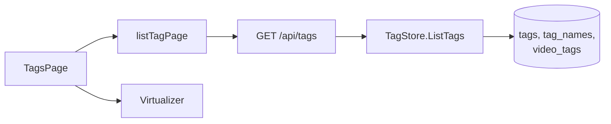
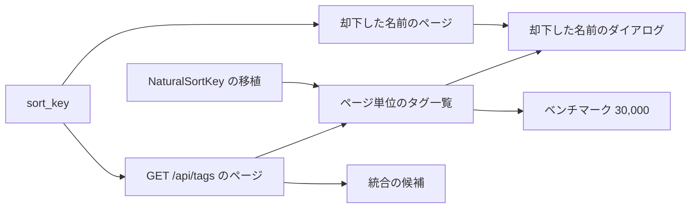

# 実装計画: 数千のタグでもタグ管理画面の応答を保ち、並び順、絞り込み、一括操作で整理できるようにする {#implementation-plan-keep-the-tag-admin-screen-responsive-with-thousands-of-tags-and-tidy-them-up-with-sort-filters-and-bulk-actions}

**ブランチ**: `feature/036-tag-admin-scale` | **親 Issue**: #651

**入力**: 親 Issue。親 Issue がこの機能の仕様である。

## 概要 {#summary}

タグ管理画面 (`/tags`) は、数千から数万のタグがあっても開いてすぐに一覧を表示し、検索、スクロール、行の操作で固まらない。この機能は、並び順 (名前、動画の数、作成日)、未使用のタグ (どの動画にも付いていないもの) の絞り込み、選択した複数の行に対する一括の確定、却下、削除、統合を加える。一覧をスクロールしている間も、却下した名前、検索、絞り込み、並び順、一括操作に手が届く。

### この改訂での変更 {#changes-in-this-revision}

親 Issue が改訂された。画面は表示する分だけを読み込み、スクロールで続きを読み込む。検索、並び順、絞り込みは、まだ読み込んでいないタグを含むすべてのタグに適用する。「すべて選択」は読み込んだ行だけを対象にする。規模に 30,000 タグが加わる。却下した名前も表示する分だけを読み込む。これは以前の Plan の R-1 (「すべてのタグを 1 つの応答で受け取り、画面で絞り込み、見えている行だけを描く」) と矛盾する。子 Issue #678 から #687 はすべて feature ブランチにマージ済みである。表は、その作業の各部分がどうなるかを示す。

| 扱い | 対象 |
| --- | --- |
| 維持 | `Tag.createdAt` (R-8) |
| 維持 | `POST /api/tags/batch` と `POST /api/tags/impact` (R-4、R-6) |
| 維持 | `POST /api/tags/{id}/merge` の `sourceIds` (R-5) |
| 維持 | 行の仮想化 (R-2) |
| 維持 | 端末に保存する並び順 (R-7) |
| 維持 | 行のチェックボックスと選択バー |
| 維持 | 統合のダイアログの幅 |
| 維持 | トップバーの下の帯と却下した名前のダイアログ |
| 維持 | ベンチマークの道具 (R-9) |
| 維持、新しい役割 | `FoldForMatch` の移植とその共有の検査 (R-3) |
| 置き換え | 一覧の読み方: すべてのタグ → サーバーのページ ([research.md R-1](research.md#r-1-the-server-pages-the-list-and-applies-search-filters-and-sort-to-every-tag)) |
| 置き換え | 検索、絞り込み、並び順を実行する場所: 画面 → サーバー |
| 置き換え | 件数の行の数: 画面で計算 → 応答の `total` と `totalAll` |
| 置き換え | 「すべて選択」が選ぶもの: 絞り込んだすべてのタグ → 読み込んだ行 |
| 置き換え | 却下した名前の読み方: すべて → ページ ([R-13](research.md#r-13-rejected-names-load-in-pages-from-get-apitagsrejected-names-with-more-loaded-on-scroll)) |
| 置き換え | 統合先の候補の出どころ: 画面上のすべてのタグ → サーバーの検索 ([R-14](research.md#r-14-merge-target-candidates-come-from-get-apitagsqlimit)) |
| 追加 | 自然順の名前のキー `sort_key` とそのマイグレーション ([R-10](research.md#r-10-a-natural-order-name-key-sort_key-on-tag_names-and-rejected_tag_names-filled-by-the-startup-key-refresh)) |
| 追加 | 続きの読み込みと、重複、件数の不一致、失敗の扱い ([R-11](research.md#r-11-more-rows-load-100-at-a-time-near-the-end-duplicates-are-dropped-by-id-and-a-count-mismatch-asks-for-a-reload)) |
| 追加 | 読み込んだ行の中での変更の反映と、`NaturalSortKey` の移植 ([R-12](research.md#r-12-actions-update-the-loaded-rows-in-place-positioned-with-a-port-of-naturalsortkey)) |
| 追加 | 30,000 の規模とそのベンチマークの場面 (R-9) |

`## Implementation Work` はマージ済みの単位を繰り返さない。その単位は、現在の feature ブランチの上にまだ必要な差分だけである (`plan-to-issues` は既にある子 Issue を飛ばす)。以前の単位は子 Issue #678 から #687 と git の履歴に記録されている。

| 領域 | 決定 |
| --- | --- |
| 一覧 | `GET /api/tags` に `q`、`tentative`、`unused`、`sort`、`cursor`、`limit` が加わる。画面は 100 タグずつ受け取り、スクロールで続きを読み込む。`limit` のない要求は、候補、絞り込みの検証、外部 API のために、引き続きすべてのタグを返す (R-1、[contracts/screen-api.md、`GET /api/tags` のパラメータ](contracts/screen-api.md#get-apitags-parameters)) |
| 名前のキーセット | `tag_names.sort_key` (`NaturalSortKey`) が名前順のキーセットを支える。起動時のキーの更新がこれを埋める (R-10、[data-model.md、マイグレーション](data-model.md#migration)) |
| 描画 | 読み込んだ行は終わりに達すると総数まで増えるので、見えている行だけを描くことは維持する ([R-2](research.md#r-2-rows-are-virtualized-with-usewindowvirtualizer-from-tanstackreact-virtual)) |
| 検索 | サーバーは `search_key` (`FoldForMatch`) と照合する。変更された行が現在の条件にまだ一致するかは、画面の移植がその場で決める ([R-3](research.md#r-3-the-typescript-port-of-foldformatch-decides-on-the-screen-whether-a-loaded-row-still-matches)) |
| 操作の後 | 画面は一覧を読み直さずに読み込んだ行を書き換え、`NaturalSortKey` の移植で行を配置する。共有のキャッシュは購読者がいる間だけ再読み込みする (R-12) |
| 一括操作 | マージ済みの作業から変わらない (R-4 から R-6)。読み込んだ行に作用する。20,000 の上限は送る id の数に適用する。それより多くの行を読み込んでいるときは「読み込んだものをすべて選択」だけを無効にし、1 行ずつ選んだ選択は引き続き動く |
| 却下した名前 | `GET /api/tags/rejected-names` はページを返し、ダイアログは自身の中で続きを読み込む (R-13、[contracts/screen-api.md、`GET /api/tags/rejected-names` のパラメータ](contracts/screen-api.md#get-apitagsrejected-names-parameters)) |
| ベンチマーク | `scripts/tagsbench` に 30,000 の規模 (30,000 本の動画) と、開いたときの転送量と続きを読み込みながらのスクロールの場面が加わる (R-9、[quickstart.md](quickstart.md)) |
| 設計 | Issue に `ui` ラベルがあるので、`design` の段階が `ui-design.md` を改訂し、次を決める。続きの読み込み、失敗、不一致の行。件数の行の文言 (読み込んだ行に対する「すべて選択」)。上限を超えたときに無効にするもの (ヘッダーのチェックボックスだけ。現在の `ui-design.md` は "Confirm" と "More" も無効にする) とその理由の文。却下した名前のダイアログでの続きの読み込み。読み込み中の統合のダイアログの候補の見え方。現在の `ui-design.md` は以前の Plan に従っている |

### 見た目の確認の後の修正 {#fixes-after-the-visual-review}

実装の単位がマージされた後、見た目の確認で、コンテンツ内の操作の行、詰まった件数の行、画面の下に浮かぶ選択バー、却下した名前のダイアログがライブラリ画面と合わないことがわかった。修正は要素を動かすだけで、振る舞いとサーバーの API は保つ (「案 1」、レビューで承認済み)。

| 要素 | 配置 |
| --- | --- |
| 検索、絞り込み ("Filter" のポップオーバー内の "Tentative only" と "Unused only")、並び順 | ライブラリと同じく、共有のトップバー |
| コンテンツの上部 | 見出し (件数と "New tag")、タブ "Tags \| Rejected names"、絞り込みのチップ、列見出し |
| 選択中の見出し | 選択の行に置き換わる |
| 却下した名前 | そのタブの本文 |
| 統合のダイアログの候補 | 入力の下の高さ固定のリスト |
| 条件とタブ | URL に保つ |
| 件数 | 読み込んだ数は表示しない |

[ui-design.md](ui-design.md) がレイアウトの正本である。状態を URL に保つという決定は [research.md R-7](research.md#r-7-the-sort-order-is-a-per-device-preference-in-localstorage-filters-stay-in-screen-state) に加えた。

## 技術的な前提 {#technical-context}

**正本の定義**:

| 項目 | 出典 |
| --- | --- |
| 境界、依存の方向、役割の型の規則、ドメインイベント、認証の境界、Web 層の分割 | [ARCHITECTURE.md](../../ARCHITECTURE.md)、[.golangci.yml](../../.golangci.yml) (depguard) |
| タグのテーブル、名前の規則、動画の数、検索ボックスでの照合 | [specs/014-video-tags/data-model.md](../014-video-tags/data-model.md)、[specs/014-video-tags/contracts/tags-api.md](../014-video-tags/contracts/tags-api.md)、[internal/store/tags.go](../../internal/store/tags.go)、[tag_listing.go](../../internal/store/tag_listing.go)、[tag_lookup.go](../../internal/store/tag_lookup.go)、[tag_search_keys.go](../../internal/store/tag_search_keys.go)、[folder_tags.go](../../internal/store/folder_tags.go) (`taggedVideosSQL`)、[internal/domain/tag.go](../../internal/domain/tag.go)、[internal/domain/search.go](../../internal/domain/search.go) (`FoldForMatch`、`NaturalSortKey`、`SearchKeyVersion`) |
| 仮のタグと却下した名前 | [specs/031-tentative-tags/data-model.md](../031-tentative-tags/data-model.md)、[specs/031-tentative-tags/contracts/screen-api.md](../031-tentative-tags/contracts/screen-api.md)、[internal/store/tentative_tags.go](../../internal/store/tentative_tags.go) |
| キーセットのページ、カーソル、タイトルのキー `title_key` | [specs/013-library-search/contracts/list-api.md](../013-library-search/contracts/list-api.md)、[specs/013-library-search/data-model.md](../013-library-search/data-model.md) ([`title_key` の規則](../013-library-search/data-model.md#title_key-rules)、[キーを作るときと `search_version`](../013-library-search/data-model.md#when-keys-are-built-and-search_version))、[internal/store/listing.go](../../internal/store/listing.go) (`listOrder`、`encodeCursor`、`decodeCursor`)、[internal/store/search_keys.go](../../internal/store/search_keys.go) (起動時のキーの更新) |
| 画面 API と変換 | [api/openapi.yaml](../../api/openapi.yaml)、[internal/httpapi/tags.go](../../internal/httpapi/tags.go)、[internal/httpapi/router.go](../../internal/httpapi/router.go) (`Tags`)、[internal/httpapi/external.go](../../internal/httpapi/external.go) (すべてのタグを求める `listTags` の呼び出し元) |
| 画面 | [web/src/tags/](../../web/src/tags/)、[web/src/api/tags.ts](../../web/src/api/tags.ts) (共有のキャッシュ)、[web/src/api/videosData.ts](../../web/src/api/videosData.ts) (`appendUnique`、`inconsistent`)、[web/src/lib/foldForMatch.ts](../../web/src/lib/foldForMatch.ts)、[web/src/preferences/tagListPreferences.ts](../../web/src/preferences/tagListPreferences.ts)、[web/src/ui/legacy/Combobox.tsx](../../web/src/ui/legacy/Combobox.tsx)、[web/src/i18n/en.ts](../../web/src/i18n/en.ts) |
| 画面のレイアウトの規則と仮想スクロールの決定 | [docs/design-docs/library-ui.md](../../docs/design-docs/library-ui.md) ([仮想スクロールは使わない](../../docs/design-docs/library-ui.md#no-virtual-scrolling)、[一覧のレイアウト](../../docs/design-docs/library-ui.md#list-layout))、[ui-design.md](ui-design.md) (以前の Plan に従う。`design` が改訂する) |
| ベンチマーク | [docs/how-to/tags-admin-benchmark.md](../../docs/how-to/tags-admin-benchmark.md)、[scripts/tagsbench](../../scripts/tagsbench/)、[web/bench/](../../web/bench/) |
| 生成と検査の入口 | [Taskfile.yml](../../Taskfile.yml) (`task check`、`task check-docs`、`task generate`、`task test-e2e`) |

**この機能固有の前提**:

- マイグレーションを 1 つ加える (`00030_tag_sort_keys.sql`、[data-model.md、マイグレーション](data-model.md#migration))。派生したキーの列を加えるだけで、テーブルの意味は変えない。以前の「マイグレーションなし」はもう成り立たない。
- npm と Go の依存は加えない (`@tanstack/react-virtual` はマージ済み)。ドメインイベントと `/api/events` の種類は加えない。
- 性能の予算は、30,000 タグまでの親 Issue の受け入れ条件 1 から 4 である。最初の行は 1 秒以内。開いたときに受け取るタグの数とバイト数は規模で変わらない。操作の後に 0.2 秒を超える固まりがない。スクロールと続きの読み込みの間に 50 ms を超えるフレームが連続しない。`task check` ではこれらを検証できない。[quickstart.md](quickstart.md) が測り方を示す。
- 外部 API (`api/external-v1.yaml`) と MCP は変わらない。`GET /api/v1/tags` は `TagListQuery{}` (すべてのタグ) を通して同じ結果を返す。
- `limit` のない `GET /api/tags` は、候補と絞り込みの検証 (`web/src/library/`、`web/src/player/`) のために、引き続きすべてのタグを返す。それらを全件の一覧から外すことは、親 Issue で範囲外である (#674、#675)。

## 憲章の確認 {#constitution-check}

| ゲート | 判定 |
| --- | --- |
| 依存の方向 (ARCHITECTURE.md "Intended dependency direction") | 合格。`internal/domain` は値 (`TagSort`、`TagListQuery`、`TagPage`、`RejectedTagNamePage`) と純粋な関数 (`NaturalSortKey` は既にある) を持つ。`internal/store` は `TagStore` の `ListTags` と `ListRejectedTagNames` を置き換え、`sort_key` を書く。`internal/httpapi` はパラメータを解析して変換する。`internal/app` と `cmd/mdm` には手を付けない |
| 役割の型は他の役割の公開メソッドを呼ばない。SQL は `internal/store` に留まる | 合格。キーの更新は `TagStore.RefreshSearchKeys` の中で実行され、その起動時の呼び出し元 (`cmd/mdm`) は変わらない。カーソルの符号化は `listing.go` と共有する |
| API の正本と生成ファイル (AGENTS.md) | 合格。`api/openapi.yaml` を編集し、`task generate` を実行する。`TagList` と `RejectedTagNameList` の新しい `required` のフィールドは画面の契約であり、その唯一の呼び出し元は `web/src/api/tags.ts` である |
| マイグレーションの規則 (`task migrations-check`、[014 data-model.md、Migration](../014-video-tags/data-model.md#migration) の書き方) | 合格。`00030` は列を加えて `search_version` をリセットするだけである。Down は列を削除する。キーは `SearchKeyVersion` の仕組みの上の作り直せる派生値である ([013 data-model.md、キーを作るときと `search_version`](../013-library-search/data-model.md#when-keys-are-built-and-search_version)) |
| 仮想スクロールの決定 (library-ui.md、[仮想スクロールは使わない](../../docs/design-docs/library-ui.md#no-virtual-scrolling)) | 合格。ページ単位で読んでも読み込んだ行は総数まで増えるので、決定は成り立つ (R-2)。[仮想スクロールは使わない](../../docs/design-docs/library-ui.md#no-virtual-scrolling) の「すべてのタグを 1 つの応答で受け取って持つ」という記述は直す |
| サーバーの出力は英語、画面の文言はカタログ (gosmopolitan、i18n.md) | 合格。新しい文言はすべて `web/src/i18n/en.ts` に置く |
| ゲストは所有者のデータを見ない | 合格。`/tags` と新しいパラメータは所有者専用のルートにある |
| 設計文書は現在を記述する (docs/design-docs/index.md) | 合格。各単位が、ARCHITECTURE.md (`TagStore` と `web/src/tags/` の段落)、`docs/design-docs/library-ui.md`、[仮想スクロールは使わない](../../docs/design-docs/library-ui.md#no-virtual-scrolling)、`docs/how-to/tags-admin-benchmark.md` のうち自分の部分を更新する |

判定はフェーズ 1 の後も成り立つ。Complexity Tracking に載せる違反はない。

## プロジェクトの構成 {#project-structure}

### 文書 (この機能) {#documentation-this-feature}

```text
specs/036-tag-admin-scale/
├── plan.md               # This file
│                         # No spec.md — the parent Issue is the specification
├── research.md           # R-1 to R-14 (R-1 replaced and R-10 to R-14 added in the revision)
├── data-model.md         # Migration 00030, domain values, TagStore operations, screen-side state rules
├── quickstart.md         # Steps and expectations for measuring acceptance criteria 1 to 4 at scale
├── ui-design.md          # Output of the design stage; follows the earlier Plan and design revises it
└── contracts/
    └── screen-api.md     # Tag.createdAt, GET /api/tags parameters, POST /api/tags/batch, merge changes,
                          # POST /api/tags/impact, GET /api/tags/rejected-names parameters
```

### ソースコード {#source-code}

**影響を受ける境界** (改訂の差分。マージ済みの境界は子 Issue #678 から #687 のとおり):

| 境界 | 変わるもの |
| --- | --- |
| `internal/domain` | `TagSort`、`TagListQuery`、`TagPage`、`RejectedTagNamePage`、`MaxTagPageLimit`。`NaturalSortKey` の共有の検査の事例 |
| `internal/store` | マイグレーション `00030`。`tag_names` と `rejected_tag_names` への `sort_key` の書き込み。`RefreshSearchKeys` の拡張。`ListTags(query)` と `ListRejectedTagNames(cursor, limit)` への置き換え。共有のカーソル。不変条件のテスト |
| `internal/httpapi` | `tags.go` の `ListTags` と `ListRejectedTagNames` のパラメータ、`external.go` の呼び出し、`router.go` の `Tags`。`api/openapi.yaml` と生成ファイル |
| `web/src/api` | `tags.ts` の `listTagPage`、`listRejectedTagNamePage`、`tagPageLimit`、`afterTagChanged` |
| `web/src/lib` | `naturalSortKey.ts` |
| `web/src/tags` | `TagsPage` でのページ単位の読み込みと変更の反映、`RejectedNames` での続きの読み込み、`MergeTagDialog` の候補 |
| `web/src/i18n` | 新しい文言 |
| ベンチマーク | `scripts/tagsbench`、`web/bench/`、`docs/how-to/tags-admin-benchmark.md` |
| 文書 | `ARCHITECTURE.md`、`docs/design-docs/library-ui.md` |

**新しいパス**:

- `internal/store/migrations/00030_tag_sort_keys.sql`
- `internal/domain/testdata/natural_sort_key.json` (Go と Vitest の両方が読むキーの事例。R-12)
- `web/src/lib/naturalSortKey.ts`

**構成の決定**: 一覧のページは `TagStore.ListTags` に置く。新しい役割の型は作らない。動画の数え上げ、絞り込み、並べ替え、カーソルは、`tags`、`tag_names`、`video_tags`、`video_folder_names` に対する 1 つのクエリに収まる (R-1、R-10)。カーソルの符号化とキーセットの条件の組み立ては `listing.go` と共有し、タグ用に書き直さない。図は 1 つのページの要求の経路を示す。



`TagsPage` は条件、ページ、選択を持ち、描く行の選択だけを仮想化に任せる ([data-model.md、画面の状態](data-model.md#screen-state))。キーの移植は `web/src/lib/` の `foldForMatch.ts` の隣に、サーバーを呼ばない純粋な関数として置く。ベンチマークの道具は製品のコードの外、`scripts/` と `web/bench/` に置く (R-9)。

## 実装作業 {#implementation-work}

マージ済みの単位 (#678 から #687) は繰り返さない。以下の単位は、現在の feature ブランチの上に必要な差分である。図は、どの単位がどの単位より先に入らなければならないかを示す。



### `tag_names` と `rejected_tag_names` に自然順の名前のキー `sort_key` を保存し、起動時に埋める {#store-a-natural-order-name-key-sort_key-on-tag_names-and-rejected_tag_names-filled-at-startup}

**範囲**: `internal/store/migrations/00030_tag_sort_keys.sql` ([data-model.md、マイグレーション](data-model.md#migration))。名前の行を書くすべての操作 (`insertTagName`、名前の変更、`RejectTag` と `BatchTags(reject)` の `rejected_tag_names` への挿入) は、同じ文で `sort_key = domain.NaturalSortKey(name)` を書く。`TagStore.RefreshSearchKeys` は `search_key` とともに `sort_key` を埋め、`rejected_tag_names` についても埋める ([data-model.md、ストアの操作](data-model.md#store-operations)、[research.md R-10](research.md#r-10-a-natural-order-name-key-sort_key-on-tag_names-and-rejected_tag_names-filled-by-the-startup-key-refresh))。`invariants_test.go` に新しい不変条件を加える。ARCHITECTURE.md の `TagStore` の段落 (キーの更新は 2 つのキーを扱う)。一覧の順序はまだ変わらない。

**依存**: なし

**受け入れ**: `task check` (`migrations-check` を含む) が通る。ストアのテストが次を示す。

- マイグレーションの後、既存の行 (空の `sort_key`、`search_version` 0) は `RefreshSearchKeys` によって `NaturalSortKey(name)` になり、その戻り値は `tag_names` と `rejected_tag_names` で書き換えた行の合計である。
- `CreateTag`、`AddSynonym`、`RenameTag`、`ApplyVideoTags` (仮のタグを作る)、`RejectTag`、`BatchTags(reject)` の後、書いた各行の `sort_key` は `NaturalSortKey(name)` に等しく、その `search_version` は現在のものである。
- 統合で `tag_id` を移した行は `sort_key` を保つ。
- 既存のテストの後と一括操作の後に、不変条件の検査が通る。

### `GET /api/tags` に検索、絞り込み、並び順、ページを加える {#add-search-filters-sort-and-pages-to-get-apitags}

**範囲**: `domain` に `TagSort`、`TagListQuery`、`TagPage`、`MaxTagPageLimit` ([data-model.md、`domain` に追加する値](data-model.md#values-added-to-domain))。`TagStore.ListTags(ctx, query)` に置き換える。動画の数の CTE、`search_key` への `instr`、仮と未使用の絞り込み、キーセットの条件を伴う 5 つの並び順、`NextCursor` のための `Limit + 1` 行の読み込み、`Total` と `TotalAll`、`Limit` 0 のときのすべてのタグ ([data-model.md、ストアの操作](data-model.md#store-operations)、[research.md R-1](research.md#r-1-the-server-pages-the-list-and-applies-search-filters-and-sort-to-every-tag))。カーソルの符号化を `listing.go` と共有する。`api/openapi.yaml` に、`listTags` のパラメータ、`TagSort`、`TagList` の `total`、`totalAll`、`nextCursor` を生成ファイルとともに加える。`internal/httpapi/tags.go` でのパラメータの解析と `400`、`external.go` の呼び出し、`router.go` の `Tags` ([contracts/screen-api.md、スキーマの変更](contracts/screen-api.md#schema-changes)と[`GET /api/tags` のパラメータ](contracts/screen-api.md#get-apitags-parameters))。`web/src/api/tags.ts` の `listTagPage`、`tagPageLimit`、`TagSort` の型 (`tagListOrder.ts` の `TagListSort` は生成された `TagSort` に移る。[`web/src/api` の関数](contracts/screen-api.md#websrcapi-functions))。画面はまだ変わらない。

**依存**: `Store a natural-order name key sort_key on tag_names and rejected_tag_names, filled at startup`

**受け入れ**: `task check` が通る。ストアのテストが次を示す。

- 250 のタグ (名前に `tag 2`、`tag 10`、全角、かなを含む) を `Limit` 100 で 3 ページに分けて読むと、すべてのタグが `sort_key, id` の順に 1 回ずつ返る。3 ページ目の `NextCursor` は空である。`Total` と `TotalAll` はどのページでも 250 である。
- `Search` を `ＡＣＴＩＯＮ` にすると、`action` という名前のタグと、同義語 `Action Movie` を持つタグに一致し、`Total` はその数である (受け入れ条件 9)。
- `UnusedOnly` では、`Total` が未使用のタグの数に等しく、`Items` の数はすべて 0 であり、`TentativeOnly` や `Search` と組み合わせられる (受け入れ条件 8、要件 6)。
- `countDesc` は動画の最も多いタグを先頭に、未使用のタグを最後に置き、同数は名前で並べる (受け入れ条件 5)。
- `createdDesc` は最も新しいタグを先頭に置く (受け入れ条件 6)。
- 数と日付の並び順は、ページの境界の両側のタグが同じ値を持つときも、何も失わず、何も繰り返さない。
- 別の並び順のカーソルは `ErrInvalidCursor` を返す。
- `Limit` 0 は、空の `NextCursor` とともにすべてのタグを返す。
- 既存の `ListTags` のテスト (数、同義語、`CreatedAt`) は `TagListQuery{}` で引き続き通る。

httpapi のテストが次を示す。

- `GET /api/tags?limit=100&sort=countDesc` は 100 の `items` を `total`、`totalAll`、`nextCursor` とともに返し、`cursor` で残りを読める。
- `limit=0`、`limit=201`、`sort=foo`、壊れた `cursor`、101 文字の `q` は `400 invalid_request` を返す。
- パラメータがなければ、`nextCursor` なしですべてのタグを返す。
- `GET /api/v1/tags` の応答は変わらない。
- ゲストは `401` を受け取る。

生成ファイルの検査が通る。

### `GET /api/tags/rejected-names` をページ単位にし、その数を返す {#page-get-apitagsrejected-names-and-return-its-count}

**範囲**: `domain.RejectedTagNamePage`。`TagStore.ListRejectedTagNames(ctx, cursor, limit)` に置き換える (順序は `sort_key, name`、`Total` を伴う。[data-model.md、ストアの操作](data-model.md#store-operations))。`api/openapi.yaml` に、`listRejectedTagNames` の `cursor` と `limit`、`RejectedTagNameList` の `total` と `nextCursor` を生成ファイルとともに加える。`internal/httpapi/tags.go` と `router.go` の `Tags` ([contracts/screen-api.md、`GET /api/tags/rejected-names` のパラメータ](contracts/screen-api.md#get-apitagsrejected-names-parameters)、[research.md R-13](research.md#r-13-rejected-names-load-in-pages-from-get-apitagsrejected-names-with-more-loaded-on-scroll))。`web/src/api/tags.ts` の `listRejectedTagNamePage`。`listRejectedTagNames` の現在の呼び出し元である `TagsPage` は `items` だけを使うことで引き続き動き、ダイアログでの続きの読み込みは別の単位である。

**依存**: `Store a natural-order name key sort_key on tag_names and rejected_tag_names, filled at startup`

**受け入れ**: `task check` が通る。ストアのテストが次を示す。250 の却下した名前を `limit` 100 で 3 ページに分けて読むと、名前の自然順 (`name 10` の前に `name 2`) で、何も失わず何も繰り返さずに返り、`Total` は 250 で、3 ページ目の `NextCursor` は空である。名前を × で外す (`ForgetRejectedTagName`) と `Total` が減る。httpapi のテストが次を示す。`GET /api/tags/rejected-names?limit=2` は 2 つの `items` を `total` と `nextCursor` とともに返し、`cursor` で残りを読める。`limit=0` と壊れた `cursor` は `400` を返す。パラメータがなければ最大 100 を返す。既存の `DELETE` のテストは引き続き通る。Vitest では、`TagsPage.test.tsx` の現在の却下した名前のテストが引き続き通る。

### `NaturalSortKey` を TypeScript に移植する {#port-naturalsortkey-to-typescript}

**範囲**: `web/src/lib/naturalSortKey.ts`。`foldForMatch` の上で、ASCII の数字の各連続を、先頭のゼロを除いた桁数を 4 桁の 10 進数で表す接頭辞と、それに続く数字に置き換える (`internal/domain/search.go` の `NaturalSortKey` と同じ手順)。`compareNaturalSortKeys(a, b)` は UTF-16 のコード単位ではなくコードポイントで比べる。`internal/domain/testdata/natural_sort_key.json` と、それを両方とも読む Go のテスト (`NaturalSortKey`) と Vitest のテスト ([research.md R-12](research.md#r-12-actions-update-the-loaded-rows-in-place-positioned-with-a-port-of-naturalsortkey) の "Port check"。`fold_for_match.json` と同じやり方)。

**依存**: なし

**受け入れ**: `task check` が通る。共有の事例は、`tag 2` と `tag 10` (`2` → `00012`、`10` → `000210`)、`0` と `00` (→ `0000`)、数字と文字の混在、全角の数字 (NFKC の後は半角)、かな、サロゲートペアを含む名前を含み、Go と Vitest は同じキーを生成する。Vitest では、キーの順序が Go の `strings.Compare` の順序 (共有の事例の順序) と一致し、`compareNaturalSortKeys` は U+FFFF を超えるコードポイントを U+E000 から U+FFFF の後に置く (テストは `<` が逆に並べる組を含む)。

### 条件ごとにタグ管理の一覧をサーバーから読み、スクロールで続きを読み込む {#read-the-tag-admin-list-from-the-server-for-each-set-of-conditions-and-load-more-on-scroll}

**範囲**:

- `TagsPage` を共有のキャッシュ (`getTags`、`subscribeTags`、`currentTags`) から切り離す。条件 (検索語、"Tentative only"、"Unused only"、並び順) が変わるたびに、`listTagPage` で最初のページを読み直す。実行中の要求を中断し、世代番号を使い、選択を空にし、応答が届くまで前の行を保つ。
- 仮想化が描く最後の行が終わりに近づいたら、`nextCursor` で次のページを追加する。重複する `id` を落とし、要求は一度に 1 つにし、失敗には "Retry" を持つ行を、`totalAll` の不一致には "Reload" を持つ 1 つの行を出す。
- `total` と `totalAll` から件数の行を表示する。
- ヘッダーのチェックボックスを「読み込んだものをすべて選択」にする。
- 上限 `maxTagBatch` を、ヘッダーのチェックボックスには読み込んだ行の数で、一括操作 (選択バーの `overLimit`) には選択した数で適用する。
- 単一と一括の操作を読み込んだ行の中で反映する。`naturalSortKey` と並び順の値で行を配置する。行が一致するかを `foldForMatch`、`tentative`、`videoCount` で決める。`total` と `totalAll` をその場で調整する。
- 条件が変わっても、名前を変更中の行は落とさない。
- `afterTagChanged` が購読者のいる間だけ再読み込みするようにする。
- `sortTags` (画面での並べ替え) と、すべてのタグへの `matchesFilters` の適用を取り除く。

出典: [data-model.md、画面の状態](data-model.md#screen-state)、[research.md R-1、R-3、R-11、R-12](research.md#r-11-more-rows-load-100-at-a-time-near-the-end-duplicates-are-dropped-by-id-and-a-count-mismatch-asks-for-a-reload)。英語のカタログの文言 (続きの読み込み、失敗、不一致、読み込んだ行に対する「すべて選択」。形は改訂された `ui-design.md` に従う)。ARCHITECTURE.md の `web/src/tags/` の段落と、`docs/design-docs/library-ui.md` の [仮想スクロールは使わない](../../docs/design-docs/library-ui.md#no-virtual-scrolling) にある「すべてのタグを 1 つの応答で受け取って持つ」という記述。

**依存**: `Add search, filters, sort and pages to GET /api/tags`、`Port NaturalSortKey to TypeScript`

**受け入れ**: この単位は画面を変える (見た目と操作の確認が必要)。`task check` が通る。Vitest が次を示す。

- 開くと `GET /api/tags` を `limit=100&sort=name` で 1 回送り、全件の `getTags` の要求は決して送らない。
- 検索に `ＡＣＴＩＯＮ` と入力すると、`q=ＡＣＴＩＯＮ` で先頭から読み、応答の行だけを表示する (受け入れ条件 9)。
- "Unused only" は `unused=true` を送り、件数の行は `<total> of <totalAll>` となる (受け入れ条件 8)。
- 並び順を変えると `sort=countDesc` で読み直し、選択を空にする (Edge Case)。
- 描く範囲が終わりに近づくと、`cursor` を伴う要求を 1 つ送り、その行を追加し、重複する `id` を落とす。
- 後の応答の `totalAll` が異なるとき、「一覧が変わった」行が現れ、続きの読み込みが止まり、"Reload" は先頭から読む。
- 続きの読み込みが失敗したとき、読み込んだ行は残り、"Retry" は同じ `cursor` を送る (Edge Case)。
- 続きを待つ間に検索を変えると、古い応答を捨てる (Edge Case)。
- ヘッダーのチェックボックスは読み込んだ行だけを選び、`nextCursor` があってもそれ以上は選ばない (要件 10)。
- 読み込んだ行が `maxTagBatch` を超えるとき、ヘッダーのチェックボックスだけが無効になり、1 つずつ選んだ少数の行への一括操作は引き続き動く。
- "Tentative only" の下で、読み込んだ仮のタグをすべて選んで確定すると、`POST /api/tags/batch` を 1 回送る。応答の後、仮の印は行から消え、一覧の再読み込みは送らない (受け入れ条件 10)。
- 名前順の下で作ったタグはそのキーの位置に挿入され、`createdDesc` の下では先頭に現れる (受け入れ条件 6)。
- 検索中に名前を変えて一致しなくなった行は取り除かれ、`total` が減る。
- `countDesc` の下で、読み込んでいない統合先に統合すると、応答の数が決める位置が読み込んだ範囲の中にあれば統合先をそこに挿入し、外にあれば挿入せず、終わりまで読み込んだ後に同じタグが 2 回現れることはない。
- 名前の変更中に並び順を変えても、名前を変更中の行とその入力値は保たれる (Edge Case)。
- 操作の後、`getTags` に購読者がいなければ全件の `GET /api/tags` は送らず、いれば送る。
- 最初のページが失敗したとき、画面はまだ一覧を持っていなければ失敗と "Retry" を表示し、持っていればその一覧を保つ (Edge Case)。
- `TagsPage.test.tsx` の現在の行の操作、選択バー、統合、却下した名前のテストは引き続き通る。

`web/e2e/tags.e2e.ts` の管理のテスト (検索 18、16 と 16b、9 から 12、14、17 ほか) は引き続き通る。`tagsbench` の 3 つの規模で、最初の行は 1 秒以内に現れ、開いたときの `items` は 100 で応答のサイズは規模で変わらず、検索の最初の文字、Esc、1 回の確定、1 回の名前の変更の後の最長のタスクは 0.2 秒以内に収まる (受け入れ条件 1 から 3)。

### 却下した名前のダイアログが開いたときに表示する分だけを読み込む {#load-only-what-the-rejected-names-dialog-shows-when-it-opens}

**範囲**: `TagsPage` の却下した名前の状態は最初のページ (`items`、`total`、`nextCursor`) になり、入口は `total` を表示する。`RejectedNames` のダイアログの内容が終わりまでスクロールしたら、`listRejectedTagNamePage` で次のページを追加する (読み込み中、失敗、"Retry" は、改訂された `ui-design.md` の "Rejected names" に従う)。× で外した名前はその場で落とし、`total` を減らす。031 からの契機 (却下、作成、名前の変更、同義語の追加、一括の却下) は最初のページだけを再読み込みする ([data-model.md、画面の状態](data-model.md#screen-state) の "Rejected names"、[research.md R-13](research.md#r-13-rejected-names-load-in-pages-from-get-apitagsrejected-names-with-more-loaded-on-scroll))。英語のカタログの文言。

**依存**: `Page GET /api/tags/rejected-names and return its count`、`Read the tag admin list from the server for each set of conditions, and load more on scroll`

**受け入れ**: この単位は画面を変える (見た目と操作の確認が必要)。`task check` が通る。Vitest が次を示す。

- 開くと `GET /api/tags/rejected-names` を `limit=100` で 1 回送り、入口は `total` (応答の `items` より大きい) を表示する。
- ダイアログを開いて終わりまでスクロールすると、`cursor` を伴う要求を送り、名前を追加する。
- × は `DELETE` を送り、名前が消え、入口の数が 1 減る。
- 一括の却下の後、最初のページを読み直す。
- 続きの読み込みが失敗したとき、読み込んだ名前は残り、"Retry" が現れる。

`tagsbench` の 1,000 の規模で、却下した名前のダイアログは、スクロールせずに `/tags` を開いた直後に開く (受け入れ条件 13)。

### 統合先の候補をサーバーの検索で探す {#find-merge-target-candidates-with-server-search}

**範囲**: `MergeTagDialog` から `tags` プロパティを取り除き、入力が変わるたびに `listTagPage({ q, limit })` で候補を取得する。行から開いたときだけ統合元を除き、選択から開いたときは選んだタグを候補に残し、実行中の要求を中断し、応答が届くまで前の候補を保ち、読み込み中と失敗は改訂された `ui-design.md` の "Merge dialog" のとおりに表示する。候補はサーバーの名前順で来る。入力に完全に一致する名前や同義語 (`exactOption`) の扱いは応答から決める。`TagsPage` での呼び出し ([research.md R-14](research.md#r-14-merge-target-candidates-come-from-get-apitagsqlimit)、[data-model.md、画面の状態](data-model.md#screen-state) の "Merge dialog candidates")。英語のカタログの文言。ARCHITECTURE.md の `web/src/tags/` の段落 (統合先を「すべてのタグから」選ぶ方法)。

**依存**: `Add search, filters, sort and pages to GET /api/tags`

**受け入れ**: この単位は画面を変える (見た目と操作の確認が必要)。`task check` が通る。Vitest が次を示す。

- ダイアログを開くと `GET /api/tags?limit=8` (空の `q`) を送る。行から開いたとき、候補は統合元を除いた応答である。選択から開いたとき、候補は選んだタグを含む。
- `ａｃｔ` と入力すると `q=ａｃｔ` を送り、読み込んでいないタグ `Action` が候補として現れる (要件 9)。
- 入力を繰り返し変えると前の要求は中断され、最後の応答だけが候補になる。
- 選択から統合先を選ぶとその id が `sourceIds` から外れ、統合先が唯一の統合元のときは操作を実行できない (Edge Case。マージ済みのテストは引き続き通る)。
- `MergeTagDialog.test.tsx` の既存のテストは `tags` プロパティなしで通る。

`web/e2e/tags.e2e.ts` のテスト 12、17、B3 と統合のテストは引き続き通る。

### ベンチマークに 30,000 の規模と、開いたときの転送と続きを読み込みながらのスクロールの場面を加える {#add-the-30000-scale-and-the-open-transfer-and-scroll-while-loading-scenes-to-the-benchmark}

**範囲**: `scripts/tagsbench` に `-videos N` (省略時は `-scale` の 10 倍) を加え、30,000 タグ、30,000 本の動画のデータを作れるようにする。`web/bench/tags-admin.bench.ts` に「開いたときに受け取るタグ」(開いたときの `GET /api/tags` の `items` の数と応答のバイト数) を加え、スクロールの場面を「続きを読み込みながら終わりまで」(`nextCursor` がなくなるまで) に変える。`docs/how-to/tags-admin-benchmark.md` と [quickstart.md](quickstart.md) の表を更新する ([research.md R-9](research.md#r-9-scriptstagsbench-builds-scale-data-and-a-playwright-script-measures-the-production-build) の "Scales and scenarios added by the revision")。`task test-e2e` にも CI にも含めない。

**依存**: `Read the tag admin list from the server for each set of conditions, and load more on scroll`

**受け入れ**: `task check` と `task check-docs` が通る。`go run ./scripts/tagsbench -scale 30000 -videos 30000` は 30,000 タグと 30,000 本の動画のデータを作る。起動した本番ビルドで `GET /api/tags?limit=100` は 100 項目を返す。ベンチマークの表 (quickstart.md の 8 つの場面) が出力される。3 つの規模すべてで、開いたときに受け取る `items` は 100 で応答のサイズは ±5% 以内に収まり (受け入れ条件 2)、30,000 タグの一覧を続きを読み込みながら終わりまでスクロールしても 50 ms を超えるフレームが 2 つ続くことはない (受け入れ条件 4)。PR 本文は、同じ環境で改訂の前 (改訂の前の feature ブランチの先頭) と後に測った表を記録し、`GET /api/tags` の応答時間を別に報告する (quickstart.md の "Breakdown")。
