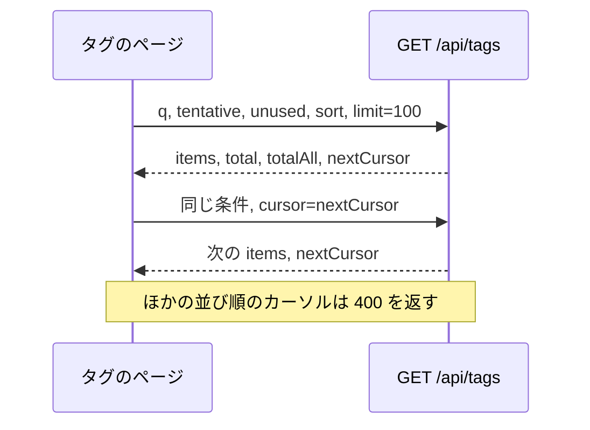
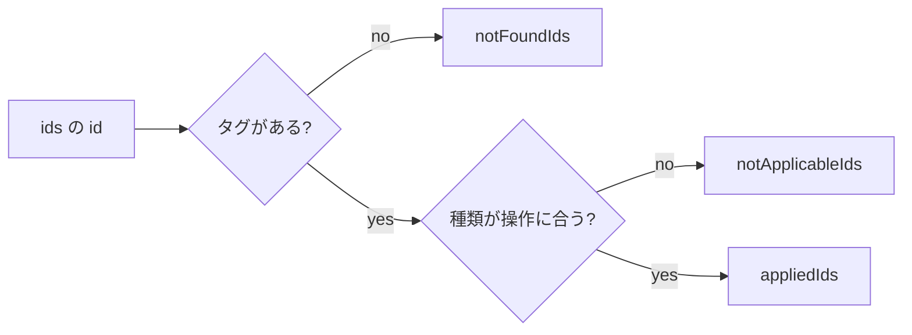
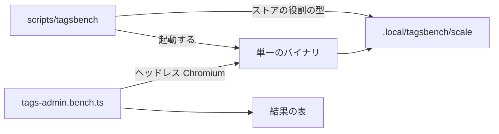
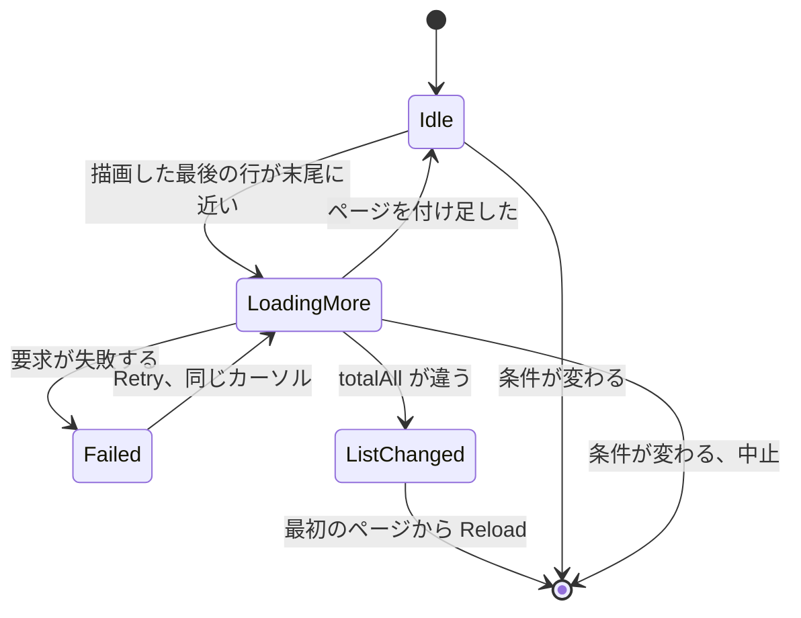
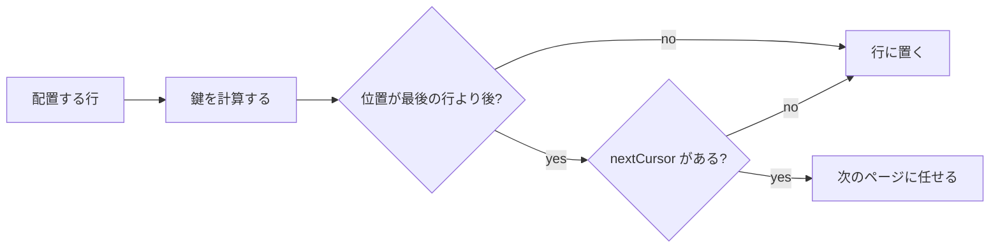

# 調査: 数千から数万のタグでのタグ管理 {#research-tag-management-at-thousands-to-tens-of-thousands-of-tags}

親 Issue: #651。引き継ぐ決定:

| 項目 | 正本 |
| --- | --- |
| 技術スタック | [docs/design-docs/tech-stack-selection.md](../../docs/design-docs/tech-stack-selection.md) |
| 境界と依存の向き | [ARCHITECTURE.md](../../ARCHITECTURE.md) |
| タグの表と名前の規則 | [specs/014-video-tags/data-model.md](../014-video-tags/data-model.md) |
| 仮のタグと却下した名前 | [specs/031-tentative-tags/data-model.md](../031-tentative-tags/data-model.md) |
| 画面の文言と書式 | [docs/design-docs/i18n.md](../../docs/design-docs/i18n.md) |
| 一覧の画面の見た目の規則 | [docs/design-docs/library-ui.md](../../docs/design-docs/library-ui.md) |

このファイルは、この機能が加える決定だけを記録する。

親 Issue の改訂 (画面は表示する分だけを読み込む。検索、並び順、絞り込みは、読み込んだかどうかによらずすべてのタグに適用する。規模に 30,000 タグが加わる) は、R-1 を置き換え、R-9 に規模と場面を加え、R-3、R-7、R-12 の役割を書き直した。R-10 以降は改訂で加わった。R-2、R-4 から R-6、R-8 は、すでに feature ブランチにマージした実装と一致し、変わらない。

## R-1: サーバーが一覧をページに分け、検索、絞り込み、並び順をすべてのタグに適用する {#r-1-the-server-pages-the-list-and-applies-search-filters-and-sort-to-every-tag}

**決定**: `GET /api/tags` に `q`、`tentative`、`unused`、`sort`、`cursor`、`limit` を加える ([contracts/screen-api.md、`GET /api/tags` のパラメータ](contracts/screen-api.md#get-apitags-parameters))。開いたとき、画面は 1 ページ (`limit` 個のタグ) を受け取り、スクロールに合わせて `nextCursor` で次のページを取得する。検索、絞り込み、並び順は要求のパラメータで、サーバーがページを切り出す前にすべてのタグに適用する。ページは `total` (条件に合うタグ) と `totalAll` (すべてのタグ) を運び、件数の行がそれを表示する (受け入れ条件 8)。`limit` のない要求は今までどおりすべてのタグを返す。コンボボックスの候補と絞り込みの確認が使う共有のキャッシュ (`web/src/api/tags.ts` の `getTags`) はその形を保つ。

下のシーケンスは、1 つの画面が開いてスクロールする様子を示す。

カーソルは、`GET /api/library` と同じくキーセットだ (並び順の値、名前の鍵、`id`)。ほかの並び順で作ったカーソルは `400` を返す (`ErrInvalidCursor`、[013 list-api.md、カーソルとエラー](../013-library-search/contracts/list-api.md#cursor-and-errors))。

| 案 | 判断 |
| --- | --- |
| **`GET /api/tags` にページと条件を加える** | 採用 |
| すべてのタグを一度に受け取り、画面で絞り込む (改訂前の R-1) | 不採用: 要件 2 と受け入れ条件 2 と矛盾する |
| `GET /api/tags/page` のような別のルート | 不採用: 応答の形と絞り込みの規則が 2 つのルートに分かれ、#674 は同じ条件で候補を取得するためにさらに別のルートを必要とする |
| オフセットでのページ (`?page=N`) | 不採用: 続きを読み込む間にほかのタブがタグを加えたり取り除いたりすると、行が繰り返されたり抜けたりする。これは Edge Case「続きを読み込む間に、ほかのタブが…」が禁じている。キーセットにはライブラリという前例がある |

**理由**: 改訂した要件 2 は、開くまでの待ち時間と最初に読み込む量がタグの数とともに増えないように、画面が表示に必要なタグだけを読み込むことを求める。受け入れ条件 2 は、受け取る件数と転送するバイト数が 1,000、3,000、30,000 タグで同じであることを測る。仮想化は描画を直したが、一覧全体の転送と JSON の解析は総数とともに増える。要件 4、6、7 と受け入れ条件 8、9 は、まだ読み込んでいないタグに並び順、絞り込み、検索を適用するので、条件はサーバーへ送る必要がある。既存のルートを拡張するのは、候補と絞り込みの確認が全件の一覧を必要とするからだ (親 Issue の `対象外`。#674 と #675 が扱う)。

**同じ値の順序**: どの並び順でも、同じ値のタグは名前の自然な順序 (R-10 の `sort_key`)、次に `id` で並べる (要件 4「同じ値のタグは名前順に並べる」。`SortTagRefs` と同じ順序の決め方)。動画の数と作成日の並び順は名前の順序と逆向きになりうるので、カーソルの条件は 1 つの行値の比較ではなく、「値が前、または値が等しく (鍵、id) が後」になる ([data-model.md、ストアの操作](data-model.md#store-operations))。

**検索の規則**: `q` は `domain.FoldForMatch` で畳み込み、前後を削る。空でなければ、`tag_names.search_key` (主の名前とシノニムの両方の行) に対して `instr` で照合する。照合の形は [014 data-model.md、検索欄でのタグ名の照合](../014-video-tags/data-model.md#matching-tag-names-in-the-search-box) と同じだ (要件 7)。語は AND、OR、除外に分けない。改訂前の画面の検索は 1 語の部分一致で、親 Issue が求めるのは同じ照合の形であり、クエリの構文ではない。`q` は、`GET /api/library` の `query` と同じく 100 文字までに制限する。

**動画の数**: 1 つのクエリが既存の `taggedVideosSQL` の集計 ([014 data-model.md、動画の数](../014-video-tags/data-model.md#video-counts)) ですべてのタグを数え、それを件数の並び順、`Unused only` の絞り込み、ページの件数に使う。改訂前の全件の一覧は、要求ごとに同じ集計を 1 回実行していたので、そのコストは新しくない。新しいのは、ページごとに実行することだ。quickstart.md は 30,000 タグでの `GET /api/tags` の応答時間を分けて報告する。集計に 1 秒かかるなら、件数の保存の仕方 (サーバー側) を変える必要があり、親 Issue の `対象外` はそれを #674 に任せている。

## R-2: 行は `@tanstack/react-virtual` の `useWindowVirtualizer` で仮想化する {#r-2-rows-are-virtualized-with-usewindowvirtualizer-from-tanstackreact-virtual}

**決定**: `web/package.json` に `@tanstack/react-virtual` を加え、タグの一覧でだけ使う。スクロールの持ち主は今までどおりウィンドウ (文書) で、行の高さは描画した要素から測る (`measureElement`)。ページ分け (R-1) はこれを変えない。

| 案 | 判断 |
| --- | --- |
| **測った高さを使う `@tanstack/react-virtual`** | 採用 |
| 手書きの窓 | 不採用: 高さが 2 種類に固定されていればオフセットは足し算で済むが、改名のエラーの文言と作成の行がそれを崩す。それを避けるために行の形を変えるのは、実装の都合で設計を狭めることになる |
| 行の高さを 1 つに固定し、シノニムを名前の行に詰める | 不採用: 要件の裏付けなしに [014 ui-design.md「行」](../014-video-tags/ui-design.md#rows) の情報の階層を変える |
| `react-window` | 不採用: 固定の高さか高さの関数を必要とするので、測る部分はやはり手書きになる |
| 一覧がページ単位になったので仮想化をやめる | 不採用: 理由で説明するとおり、読み込んだ行は総数まで増える |

**理由**: 行の高さはまちまちだ。シノニムのあるタグは 1 行高く、改名中の行はエラーの文言の分だけ伸び、作成の行は先頭に入る。手書きの窓では、高さの測定とオフセットに不具合が入り込む。この依存には実行時の依存がなく、Renovate の手順に従う ([docs/how-to/dependency-updates.md](../../docs/how-to/dependency-updates.md))。[library-ui.md、長い一覧の仮想スクロール](../../docs/design-docs/library-ui.md#virtual-scrolling-of-long-lists) が仮想スクロールを避ける理由として挙げる 2 つ (1 行のカード数が幅で決まる折り返すグリッドと、60 件ずつしか読み込まないこと) のうち、1 つ目は 1 列の一覧には当てはまらず、2 つ目も R-1 の後は当てはまらない。受け入れ条件 4 は 30,000 タグの一覧を続きを読み込みながら末尾までスクロールするので、読み込んだ行は 30,000 に達し、それをすべて描画すると改訂前に測った遅さが戻ってくる。

**文書**: `docs/design-docs/library-ui.md`、[長い一覧の仮想スクロール](../../docs/design-docs/library-ui.md#virtual-scrolling-of-long-lists) は、タグの一覧がこれを使い、グリッドは変わらない理由でまだ使わないと述べている (マージ済み)。R-1 の改訂の後、その「すべてのタグを一度に受け取って保持する」という文言は「ページを受け取り、読み込んだ行は総数まで増える」になる。

## R-3: `FoldForMatch` の TypeScript への移植が、読み込んだ行がまだ一致するかを画面で決める {#r-3-the-typescript-port-of-foldformatch-decides-on-the-screen-whether-a-loaded-row-still-matches}

**決定**: `web/src/lib/foldForMatch.ts` (マージ済み。NFKC、次にコードポイントごとの小文字化、次にひらがなからカタカナへ) と、Go と Vitest の両方が読む `internal/domain/testdata/fold_for_match.json` を残す。その役割は変わる。サーバーが `search_key` で検索する (R-1) ので、画面はもうこれで検索語を照合しない。画面は作成、改名、確定、却下の後にこれを使い、往復なしに、その行が今の条件 (検索語、`Tentative only`、`Unused only`) にまだ合うかを決める (R-12)。

| 案 | 判断 |
| --- | --- |
| **行ごとの確認のために移植を残す** | 採用 |
| 移植をやめ、操作のたびに一覧を取り直す | 不採用: 理由で説明するとおり、操作ごとの取り直しが戻ってくる |
| 移植をやめ、操作した行はもう一致しなくても残す | 不採用: 検索中に改名して一致しなくなった行が次の取り直しまで残り、サーバーの一覧と食い違う |

**理由**: 改訂前は、移植によって画面がすべてのタグを照合できた。ページ分けの下で 1 行を往復で確かめると、行の操作ごとに一覧を取り直すことになり、それは改訂前の「毎回固まる」の原因の 1 つだった。サーバーの照合の形を画面に持てば、確認は同期的に済む。同じ入力の組で 2 つの言語の食い違いを捕まえる仕組みは、すでにマージ済みだ。

小文字化と残る差 (Node の Unicode のバージョンにないコードポイントは既知の例外として除く) は、マージ済みの実装とテストに従い、ここでは決め直さない。

## R-4: 一括の確定、却下、削除は、外れを飛ばして数える 1 つの `POST /api/tags/batch` のトランザクションを使う {#r-4-bulk-confirm-reject-and-delete-use-one-post-apitagsbatch-transaction-that-skips-and-counts-misses}

**決定**: ルートは `{ action: confirm | reject | delete, ids }` を受け取り、1 つのトランザクションで、その操作が働く種類の既存のタグである id だけを処理する (確定と却下: 仮のタグ。削除: 確定したタグ)。応答は 3 つの配列を持つ。処理した id、見つからなかった id、種類が違うために飛ばした id だ ([contracts/screen-api.md、`POST /api/tags/batch`](contracts/screen-api.md#post-apitagsbatch)、[data-model.md、ストアの操作](data-model.md#store-operations))。1 つのタグのルート (`POST /api/tags/{id}/confirm` など) は残り、行の操作は引き続きそれを使う (要件 8「既存の行ごとの規則は変わらない」)。

下の規則が `ids` の各 id を振り分ける。

| 案 | 判断 |
| --- | --- |
| **1 つのルート、1 つのトランザクション、外れは飛ばして報告する** | 採用 |
| 操作ごとに 1 つのルート (`/api/tags/confirm`、`/reject`、`/delete`) | 不採用: 本文と応答の形が同じなので、分ける理由がない |
| 画面が 1 つのタグのルートを順に呼ぶ | 不採用: 要求の数が選択の大きさに等しく、途中で失敗したときの扱いが画面に残される。これが固まることそのものだ |
| 見つからない id があれば要求全体を `404` で失敗させる | 不採用: Edge Case は残りを処理することを求める |

**理由**: 100 個の仮のタグを 100 回の要求と 100 回の取り直しで確定することが、親 Issue の「毎回固まる」だ。1 つのトランザクションなら要求も画面の更新も 1 回で、受け入れ条件 10 を満たす。Edge Case「操作が当てはまらない種類を選んだとき」と「ほかのタブが対象の一部を取り除いたとき」はどちらも「残りを処理して件数を報告する」と言うので、結果は全部か無しかではなく、飛ばした id は理由ごとに返す。失敗したトランザクションは何も適用しないので、画面が `appliedIds` だけを選択から取り除けば、「済んだ部分と済んでいない部分がはっきりし、済んでいない部分は選ばれたまま残る」が成り立つ。

**上限**: `ids` は 1 から 20,000 個の id を持つ。理由は `POST /api/video-tags` の `videoIds` と同じだ (1 MiB の本文の上限に収まり、1 つの引数として `json_each` に渡せる)。上限を超えると理由 `too_many_tags` (`limit` を伴う) とともに `400` を返す。上限は送る id を数えるので、読み込んだ行が上限を超えたとき、画面は列見出しのチェックボックス (読み込んだものをすべて選択) だけを無効にし、一括操作を無効にするのは選択が上限を超えたときだけだ。要件 10 は読み込んだ行を対象とするので、末尾までスクロールした 30,000 タグの一覧ではすべて選択を使えないが、1 行ずつの選択は今までどおり働く (要件 8、9)。一括操作を読み込んだ行の数で制限すると、利用者が末尾近くまでスクロールしたというだけで、数行の選択が妨げられてしまう。

## R-5: 統合は、1 つの統合でも、`POST /api/tags/{id}/merge` で `sourceIds` (1 つ以上) を受け取る {#r-5-merge-takes-sourceids-one-or-more-in-post-apitagsidmerge-also-for-a-single-merge}

**決定**: `MergeTagRequest` は `{ sourceIds: int64[] }` になり、`sourceId` は取り除く。応答は `{ tag: Tag, notFoundIds: int64[] }` だ。統合先の `{id}` がなければ `404 tag_not_found` を返す。`sourceIds` の中の `{id}` は `400` を返す (理由は今と同じ `merge_same_tag`)。見つからない統合元は飛ばして `notFoundIds` に挙げ、残りは 1 つのトランザクションで統合する ([contracts/screen-api.md、`POST /api/tags/{id}/merge` の変更](contracts/screen-api.md#post-apitagsidmerge-changes))。

| 案 | 判断 |
| --- | --- |
| **`sourceIds` だけ** | 採用 |
| `sourceId` を残し、省略できる `sourceIds` を加える | 不採用: 2 つのうちちょうど 1 つを必要とする形は、生成したコードに `oneOf` の扱いを加える。[014 contracts/tags-api.md、スキーマ](../014-video-tags/contracts/tags-api.md#schemas) が避けた形だ |
| 一括の統合だけのための別のルート | 不採用: 同じトランザクションが 2 か所に置かれる |

**理由**: 統合のトランザクション (割り当てを写し、名前を移し、統合元を削除し、統合先を確定する) は統合元ごとに繰り返すだけなので、1 つと複数で形を変える必要はない。`api/openapi.yaml` は画面の契約で、その唯一の呼び出し元は `web/src/api/tags.ts` の `mergeTag` だ。外部 API (`api/external-v1.yaml`) には統合がない。

**統合元の数によらない文の数**: 統合元ごとに 1 つの `mergeTagInto` を呼ぶと、統合先の `tagByID` (数え直しと、増えていくシノニムの一覧の読み込み) を毎回実行し、20,000 タグの統合では書き込みのトランザクションを長く保持する。統合元の集合は `json_each` に渡す。割り当ての写し、名前の移動、統合元の削除はそれぞれ 1 つの文で、統合先は最後に 1 回読む ([data-model.md、ストアの操作](data-model.md#store-operations) の `mergeTagsInto`)。

統合先が統合元の中にあるとき、画面はそれを統合元から取り除く (Edge Case)。サーバーはそれでも `400` で拒む。

## R-6: `POST /api/tags/impact` は、確認のために影響を受ける動画を重複なく数える {#r-6-post-apitagsimpact-counts-affected-videos-without-duplicates-for-the-confirmation}

**決定**: ルートは `{ action, ids }` を受け取り、`ids` のうち存在して `action` (`reject`、`delete`、`merge`) が働くものの数と、今ライブラリにある動画のうちそのどれかを持つもの (手で付けたもの、またはフォルダの名前から、[014 data-model.md、動画の数](../014-video-tags/data-model.md#video-counts)) の数を、動画の `id` で重複を除いて返す ([contracts/screen-api.md、`POST /api/tags/impact`](contracts/screen-api.md#post-apitagsimpact))。

| 案 | 判断 |
| --- | --- |
| **一括の規則で数える読み取りのルート** | 採用 |
| `videoCount` の合計 | 不採用: 重複を数え、要件がそれを禁じている |
| 種類ごとの件数を返し、画面に選ばせる | 不採用: 画面が規則の 2 つ目の写しを持つことになり、サーバーの処理とずれうる |
| `POST /api/tags/batch` に `dryRun` を加える | 不採用: 1 つのルートに読み取りと書き込みが混ざる。読み取りのルートの前例は `POST /api/video-tags/summary` だ |

**理由**: 要件 11 と受け入れ条件 11、12 は重複のない件数を求める。画面の `videoCount` の合計は、タグを 2 つ持つ動画を 2 回数える。1 つの削除や統合の確認は今までどおり `videoCount` を使う (014 の「確認のためのルートはない」は 1 つのタグについてであり、一括の確認はこの機能が加える要求だ)。

**`action` がある理由**: 一括の却下と削除は仮のタグと確定したタグを混ぜられ (要件 8)、`POST /api/tags/batch` は当てはまらない種類を飛ばす (R-4)。すべての `ids` を数えると、100 本の動画に付いた仮のタグと 1 本の動画に付いた確定したタグを一緒に削除するとき、削除されるのは確定したタグだけなのに 101 本と表示してしまう。件数は操作が変えるものだけを対象とするので、処理と同じ規則を使う (`TagBatchApplies` にならった `TagImpactApplies`、[data-model.md、`domain` に追加する値](data-model.md#values-added-to-domain))。

## R-7: 並び順は `localStorage` に置く機器ごとの設定で、絞り込みは画面の状態にとどめる {#r-7-the-sort-order-is-a-per-device-preference-in-localstorage-filters-stay-in-screen-state}

**決定**: `web/src/preferences/tagListPreferences.ts` の `readTagListPreferences` と `writeTagListPreferences` (マージ済み) は並び順だけを保存する。`viewPreferences.ts` と同じく全域関数だ (決して例外を投げず、壊れた値は既定値の `Name` として読む)。`Tentative only`、`Unused only`、検索語は保存せず、URL にも入れない。並び順の値は API の `TagSort` の 5 つの値 (`name`、`countDesc`、`countAsc`、`createdDesc`、`createdAsc`) で、画面は保存した値を `sort` パラメータとして送る (R-1)。

| 案 | 判断 |
| --- | --- |
| **`localStorage` に置く機器の設定** | 採用 |
| URL のクエリ | 不採用: ライブラリと同じ形だが、戻ると進むで並び順が変わり、ブラウザーを開き直すと失われる |
| サーバーの `settings` の表 | 不採用: 機器ごとの表示の設定をサーバーの設定にする理由がない |

**理由**: 要件 5 が、画面を離れてブラウザーを開き直しても残ることを求めるのは並び順だけだ。ライブラリの並び順も `viewPreferences` で機器に保たれ、管理画面の URL は共有するためのものではないので、機器の設定が合う。絞り込みを保存しないのは、`Tentative only` を画面の状態にとどめた [031 research.md R-8](../031-tentative-tags/research.md#r-8-the-tentative-only-filter-and-the-rejected-name-list-live-in-the-screen) の判断を変えるものが何もなく、未使用の絞り込みも同じ性質だからだ。保存する値が API の値に等しいのは、並べ替えがサーバーへ移った (R-1) ので、画面が対応表を持つ理由がなくなったからだ。

**値**: `name` (既定)、`countDesc`、`countAsc`、`createdDesc`、`createdAsc`。`Name` には向きがない (今の順序と同じ)。同じ値の順序は R-1 のとおりサーバーが決める。

**追記 (見た目のレビューの後の修正)**: 検索、絞り込み、並び順をライブラリが使う共有の上部バーへ移したので、検索語、`Tentative only`、`Unused only`、並び順、見出しの下のタブは、ライブラリの一覧の条件と同じく URL のクエリ (`q`、`tentative=1`、`unused=1`、`sort`、`tab=rejected`) に入る ([ui-design.md「URL state」](ui-design.md#url-state)、`web/src/tags/tagListUrl.ts`)。これで条件は、ライブラリと同じく再読み込みと戻ると進むを越えて残る。これは上の「URL にも入れない」を置き換える。`localStorage` は引き続き並び順だけを保ち、URL に `sort` がないときに使う。

## R-8: 「作成日」は `Tag.createdAt` として公開する `tags.created_at` で、同じ秒に作ったタグは名前で並べる {#r-8-date-created-is-tagscreated_at-exposed-as-tagcreatedat-tags-created-in-the-same-second-sort-by-name}

**決定**: `GET /api/tags` と `Tag` を返すすべての応答に `createdAt` (`date-time`) を加える (マージ済み)。値は既存の `tags.created_at` (Unix 秒) なので、マイグレーションも列の変更もない。`Date created` の並び順は `created_at` を比べ、等しければほかのすべての並び順と同じく名前の順序を使う (要件 4)。

| 案 | 判断 |
| --- | --- |
| **既存の秒単位の `created_at`、同じ値は名前で** | 採用 |
| 同じ値は `id` の降順 (作成の順序) | 不採用: 要件 4「同じ値のタグは名前順に並べる」と矛盾する |
| `created_at` をミリ秒で保存する | 不採用: 既存の行と単位が混ざり、マイグレーションで写しても精度は戻らない |

**理由**: 列はすでにあり、`insertTag` がそれを書く。精度を細かくすると列の意味が変わり、既存の行と混ざる。外部 API での一括のタグ付けは 1 つのトランザクションで複数のタグを作るので、それらは同じ秒を共有し、要件 4 はその順序を名前の順序と定める。

外部 API の応答 (`api/external-v1.yaml` の `listTags`) は変わらない。フィールドが加わるのは `domain.Tag` だけで、`internal/httpapi/external.go` は外部の型へ明示的に写す。

## R-9: `scripts/tagsbench` が規模のデータを作り、Playwright のスクリプトが本番ビルドを測る {#r-9-scriptstagsbench-builds-scale-data-and-a-playwright-script-measures-the-production-build}

**決定**: `scripts/tagsbench` (Go、マージ済み) は `.local/tagsbench/<scale>/` の下にデータのディレクトリを作る。親 Issue の規模を `internal/store` の役割の型 (`SettingsStore.AddMediaFolder`、`ScanIndexStore.UpsertVideo`、`TagStore.ApplyVideoTags`) を通して書く。動画ファイルは作らず、登録フォルダの下の場所の行だけを作る。同じプログラムがそのデータでビルドした単一のバイナリを起動し、`web/bench/tags-admin.bench.ts` (Playwright。`web/e2e/` のテストとは別に構成し、`task test-e2e` にも CI にも含めない) が場面を測って表を出力する。手順は `docs/how-to/tags-admin-benchmark.md` にあり、結果は PR 本文に入れる ([quickstart.md](quickstart.md))。

下の流れは、データと測定がどうつながるかを示す。

**改訂で加わった規模と場面**: 動画 30,000 本の 30,000 タグの規模 (3,000 タグのときと同じ)。`-videos N` は動画の数を規模から切り離す (省くと、今までどおりタグの数の 10 倍)。場面を 2 つ加える。開いたときに `GET /api/tags` が返す件数と応答の大きさ (受け入れ条件 2) と、続きを読み込みながら 30,000 タグの一覧を末尾までスクロールする間のフレーム時間 (受け入れ条件 4) だ。

| 案 | 判断 |
| --- | --- |
| **本番ビルドに対する別のベンチマーク** | 採用 |
| `web/e2e/` に置き、`task test-e2e` で実行する | 不採用: 30,000 本の動画の読み込みと測定で e2e が数分延び、時間の揺れで CI が不安定になる |
| 本物のファイルを生成してスキャンする | 不採用: ffprobe のせいで規模の準備が遅くなり、対象はスキャンではなく管理画面だ |
| Vitest の jsdom で測る | 不採用: 描画時間が本物のブラウザーと違うので、受け入れの数値が意味を持たない |
| 30,000 タグでも動画を 10 倍にする | 不採用: データの作成に 1 時間を超え、親 Issue の表にない動画の数を測ることになる |

**理由**: 受け入れ条件はヘッドレス Chromium から本番ビルドを測り、その数値 (1 秒、0.2 秒、50 ms、同じ転送量) は規模のデータなしには確かめられない。`docs/how-to/preview-benchmark.md` の `scripts/previewbench` と同じく、対象は本番のコードそのもので、製品には測定のためのフックを入れない。行はストアの公開の操作だけを通して書くので、SQL が `internal/store` の外に出ることはない (ARCHITECTURE.md「`store.DB` does not hand out its `*sql.DB`」)。30,000 タグの規模で 300,000 本の動画を使わないのは、親 Issue がその規模に動画の数を与えておらず (表の見出しは「30,000 タグのライブラリ」)、狙いがタグの数による違いだからだ。3,000 タグのときと同じ動画なら、2 つの規模の違いはタグの数だけになる。

## R-10: `tag_names` と `rejected_tag_names` に自然な順序の名前の鍵 `sort_key` を置き、起動時の鍵の更新で埋める {#r-10-a-natural-order-name-key-sort_key-on-tag_names-and-rejected_tag_names-filled-by-the-startup-key-refresh}

**決定**: `tag_names` と `rejected_tag_names` に `sort_key text not null default ''` を加える。これは `domain.NaturalSortKey(name)` (`FoldForMatch` を適用し、次に数字の連なりをそれぞれ長さの接頭辞付きの形に置き換えるので、バイト順が自然な順序になる。[013 data-model.md、`title_key` の規則](../013-library-search/data-model.md#title_key-rules)) を持ち、名前の行を書くたびに (作成、シノニム、割り当て時の作成、改名、却下) 同じトランザクションで書く。既存の行については、マイグレーションが `search_version` を 0 に戻し (`rejected_tag_names` には `search_version` を加え)、起動時の `TagStore.RefreshSearchKeys` が `search_key` と一緒に鍵を埋める ([014 data-model.md、検索欄でのタグ名の照合](../014-video-tags/data-model.md#matching-tag-names-in-the-search-box) と同じ時点)。サーバーの名前の順序は、この鍵のバイト順、次に `id` だ ([data-model.md、マイグレーション](data-model.md#migration))。

| 案 | 判断 |
| --- | --- |
| **起動時の更新で埋める保存した鍵** | 採用 |
| `order by name collate nocase` | 不採用: 大文字と小文字しか畳み込まず、`2` を `10` より前に並べない。今の自然な順序から後退する |
| 鍵を保存せず、Go ですべてを並べてから `limit` で切る | 不採用: ページごとにすべてのタグを読んで並べるので、ページ分けの意味がなくなる |
| `search_key` を鍵として使い回す | 不採用: 照合の形は数字の連なりに長さの接頭辞を付けないので、`tag 2` が `tag 10` の後に並ぶ |
| 別の `sort_version` の列 | 不採用: `search_version` の意味は「鍵の規則のバージョン」で、1 つのバージョンで 2 つの鍵を扱える |

**理由**: R-1 のキーセットのカーソルは「名前の順序での次の行」を SQL で取得する必要があり、Go の関数 `CompareNatural` ではそれができない。ライブラリの題名の順序は、すでに同じ鍵を `order by` とカーソルのために `video_locations.title_key` に保っている (`listing.go` の `sortText`)。却下した名前にも鍵を持たせるのは、要件 12 がその一覧に、表示する分だけを名前の自然な順序で読み込むことを求めるからだ ([031 contracts/screen-api.md、却下した名前](../031-tentative-tags/contracts/screen-api.md#rejected-names))。起動時の更新を使うのは、SQL では `NaturalSortKey` を計算できず、鍵の規則のバージョンと作り直しの仕組みがすでにあるからだ。

**名前の順序の変化**: 改訂前、`ListTags` は Go の `SortTags` (主の名前に対する `CompareNatural`、同じ値は生の文字列) で並べていた。`NaturalSortKey` は照合の形 (全角、半角、かなを畳み込んだもの) に対して働くので、`アニメ` と `あにめ` のように照合の形が同じ名前は、これからは `id` で並ぶ。これはライブラリの題名の順序と同じ定義なので、契約の「名前の自然な順序」という文言はそのままだ。

## R-11: 続きは末尾の近くで 100 行ずつ読み込み、重複は `id` で捨て、件数の食い違いでは読み直しを求める {#r-11-more-rows-load-100-at-a-time-near-the-end-duplicates-are-dropped-by-id-and-a-count-mismatch-asks-for-a-reload}

**決定**: 1 ページは 100 タグだ (`limit=100`。行が軽い 1 列で、1 画面に 12 行より多く収まるので、`GET /api/library` の 60 より多い)。仮想化の処理が描画する最後の行が、読み込んだ行の末尾から数行以内に来たら、画面は `nextCursor` で次のページを 1 回要求する (同時に 2 つは送らない)。届いた行は、`id` で重複を捨てて付け足す (`videosData.ts` の `appendUnique` と同じ)。読み込みが取り消されたか失敗したとき、または食い違いがあったときは、図の規則が当てはまる ([data-model.md、画面の状態](data-model.md#screen-state))。

下の図は、一覧の読み込みの状態を示す。

次のページの応答の `totalAll` が画面の値と違うとき、行は残り、続きの読み込みは止まり、画面は `Reload` を持つ「一覧が変わった」の行を表示する (`videosData.ts` の `inconsistent` と同じ形)。次のページに失敗したときは、読み込んだ行を保ち、末尾に `Retry` を持つ失敗の行を表示し、それは同じカーソルでやり直す。検索、絞り込み、並び順を変えると、実行中の要求を `AbortController` で中止し、古い応答を世代番号で捨て、最初のページから読み込む。

| 案 | 判断 |
| --- | --- |
| **仮想化の処理が描画した最後の行をきっかけにする** | 採用 |
| `IntersectionObserver` の番兵 (ライブラリの形) | 不採用: 仮想化した一覧では番兵の位置が仮想化の処理の外で制御される。仮想化の処理が描画した最後の行を使うほうが短い |
| 食い違いのときに黙って最初のページから読み直す | 不採用: 選択とスクロールの位置を失う。`useScanIssues` のようにそれまで読んだものをすべて読み直すのは、数千行を読み直すことになる |
| 食い違いを `total` でも確かめる | 不採用: `total` は利用者自身の操作で変わり、その場で数え直すので、ほかのタブの変更の印としては `totalAll` のほうが確かだ。自身の操作は `totalAll` もその場で数え直す |
| 1 ページに 200 タグ | 不採用: 1 ページの応答がほぼ 3 倍になり、受け入れ条件 2 の「最初に読み込む量」を膨らませる |

**理由**: Edge Case「続きを読み込む間にほかのタブがタグを加えたり取り除いたりする: どのタグも 2 回現れず、気づかれないまま抜ける行はない」は、前半をキーセットと `id` による重複の除去で、後半を `totalAll` の食い違いの通知で満たす。キーセットはカーソルより前に移った行を返さないので、抜けそのものは防げない ([013 list-api.md、カーソルとエラー](../013-library-search/contracts/list-api.md#cursor-and-errors) も同じ保証を与える)。黙って読み直すと選択とスクロールの位置を失う。Edge Case「続きを読み込む間に検索、絞り込み、並び順を変える: 古い条件の行が混ざらない」は、中止と世代番号で満たす (`web/src/api/tags.ts` の `generation` と同じ考え方)。

## R-12: 操作は読み込んだ行をその場で更新し、`NaturalSortKey` の移植で位置を決める {#r-12-actions-update-the-loaded-rows-in-place-positioned-with-a-port-of-naturalsortkey}

**決定**: 単独の操作と一括操作の後、画面は一覧を取り直さず、読み込んだ行を書き換える:

| 操作 | 読み込んだ行への変更 |
| --- | --- |
| 確定 | 行の `tentative` を false にする |
| 却下、削除、統合元 | 行を取り除く |
| 統合先 | 応答の `tag` で置き換え (読み込んでいなければ差し込み)、位置を決め直す |
| 改名 | 名前を置き換え、位置を決め直す |
| 作成 | 今の条件に合えばその位置に差し込み、合わなければ入れない |

作成した行が条件に合うかは、検索語には R-3 の `foldForMatch` を、絞り込みには `tentative` と `videoCount` を使って決める。`total` と `totalAll` はその場で変える。最初のページからの取り直しは、`notFoundIds` が届いたときだけ起きる (R-4)。共有のキャッシュの `afterTagChanged` (`web/src/api/tags.ts`) は購読者がいるときだけ取り直し、いなければ `held` を捨てて次の `getTags` に取得を任せる。

下の規則が、位置を決め直す行や作成した行を配置する。

鍵は `web/src/lib/naturalSortKey.ts` (`NaturalSortKey` の移植: `foldForMatch` に数字の連なりの置き換えを加えたもの) から得て、コードポイントで比べる。動画の数と作成日の並び順は、先にその値を比べる。キーセットは最後の行の鍵より後の行だけを返すので、読み込んだ範囲の外に置いた行は次のページで繰り返される。読み込んだ範囲に入ってくる行 (まだ読み込んでいない統合先や、`countDesc` の下で件数が増えた行) は、画面が配置しない限り、数えられているのに取り直すまで見えない。

| 案 | 判断 |
| --- | --- |
| **読み込んだ行を書き換え、移植した鍵で位置を決める** | 採用 |
| 操作のたびに最初のページから取り直す | 不採用: 理由で説明するとおり |
| `compareNatural` で位置を決める | 不採用: 照合の形が同じ名前の順序がサーバーと違う |
| 作成した行と改名した行を、鍵を比べずに先頭に置く | 不採用: 新しい順の `Date created` では正しいが、名前の順序は取り直すまで崩れたままだ |
| 共有のキャッシュを今のように取り直し続ける | 不採用: 理由で説明するとおり |

**理由**: 操作のたびに最初から取り直すと、読み込んだ 30,000 行が 1 ページに縮み、スクロールの位置と選択を失う。読んだものを読み直すのは数千行の往復だ。その場での書き換えは往復を必要とせず、受け入れ条件 3 と 10 の「固まらない」を満たす。サーバーの鍵で位置を決めれば取り直しで行が跳ばないが、`compareNatural` (主の名前に対するもの) は R-10 の鍵と食い違う。共有のキャッシュが購読者のためだけに取り直すのは、タグ管理画面には購読者がなく、操作ごとに 30,000 タグをすべて取り直すと、総数とともに増える転送が戻ってくるからだ (要件 2、3。全件の JSON の解析は 0.2 秒の長いタスクになりうる)。

**移植の確認**: `NaturalSortKey` の入力と期待値の組は、`fold_for_match.json` と同じく `internal/domain/testdata/natural_sort_key.json` に置き、Go と Vitest のテストが同じファイルを読む。Go は鍵をバイトで、画面はコードポイントで比べる。どちらも同じ順序になる (UTF-8 のバイト順はコードポイントの順序に等しい。UTF-16 のコード単位の順序は等しくないので、文字列を `<` で比べない)。

## R-13: 却下した名前は `GET /api/tags/rejected-names` からページ単位で読み込み、スクロールで続きを読み込む {#r-13-rejected-names-load-in-pages-from-get-apitagsrejected-names-with-more-loaded-on-scroll}

**決定**: `GET /api/tags/rejected-names` に `cursor` と `limit` (既定 100、最大 200) を加え、応答に `total` と `nextCursor` を加える ([contracts/screen-api.md、`GET /api/tags/rejected-names` のパラメータ](contracts/screen-api.md#get-apitagsrejected-names-parameters))。順序は `sort_key` (R-10)、次に `name` のバイト順だ。開いたとき、画面は 1 ページを受け取って入口に `total` を表示し、一覧が末尾までスクロールしたら続きを読み込む。`Allow again` で外した名前はその場で取り除き、`total` を 1 減らす。却下、作成、改名、シノニムの追加の後は、最初のページだけを取り直す (031 のきっかけ、変わらない)。

| 案 | 判断 |
| --- | --- |
| **`total` を持つページ単位のルート** | 採用 |
| 全件の一覧を保つ | 不採用: 要件 12 と矛盾する |
| 入口のために `total` だけを返す別のルート | 不採用: ページの応答の `total` で足りる |

**理由**: 要件 12 の後半は、却下した名前の一覧が開いたときに表示する分だけを読み込むことを求める。却下した名前は外部 API が仮のタグを作るたびに増えうるので、タグと同じく総数に比例して読み込んではならない。既定の 100 は R-11 に従う。

**追記 (見た目のレビューの後の修正)**: ダイアログとその入口は、見出しの下のタブ `Rejected names 〈total〉` とその本文に置き換えた ([ui-design.md「Rejected names tab」](ui-design.md#rejected-names-tab))。本文のスクロールに合わせて続きの行を読み込む (ビューポートを基準とする番兵)。上のページ、件数、取り直しの規則は変わらない。

## R-14: 統合先の候補は `GET /api/tags?q=…&limit=…` から得る {#r-14-merge-target-candidates-come-from-get-apitagsqlimit}

**決定**: `MergeTagDialog` の統合先の候補は、R-1 のルートである `GET /api/tags` から、`q` (畳み込んだ入力) と `limit` (候補の行の最大数。[ui-design.md「Merge dialog」](ui-design.md#merge-dialog) では 8) で得る。行から開いたときは応答から統合元を取り除き、選択から開いたとき (`fromSelection`) は取り除かない (要件 9「統合先は選んだタグの 1 つでもよい」と、Edge Case「統合先は統合元から取り除く」。マージ済みの `MergeTagDialog` と同じ)。候補はサーバーの名前の順序を保つ。入力が変わると実行中の要求を中止し、待つ間は前の候補が残る。`tags` プロパティ (画面が持つ全件の一覧) は取り除く。

| 案 | 判断 |
| --- | --- |
| **入力ごとにサーバーから候補を取得する** | 採用 |
| 共有のキャッシュの全件の一覧から作る | 不採用: 理由で説明するとおり。親 Issue の `対象外` は管理画面の外の全件の一覧からの候補を #674 と #675 に任せているが、管理画面の中のダイアログはこの機能に属する |
| 読み込んだ行だけから作る | 不採用: 要件 9 と矛盾する |

**理由**: 改訂前は画面がすべてのタグを持っていたので、候補はそこから得ていた。ページ分け (R-1) の下では画面は読み込んだ行しか持たず、要件 9 は統合先を、読み込んでいないタグを含め、選んでいない任意のタグにできるとする。ダイアログを開くたびに共有のキャッシュの全件の一覧を取得すると、30,000 タグではすべてを転送して解析することになる (0.2 秒を超えうる長いタスク。要件 3「統合…は固まらない」)。サーバーは照合の形で検索する (R-1) ので、候補の照合は `toLowerCase().includes` から、全角、半角、かなの畳み込みに移る。

**範囲**: `Add tag` の候補 (`web/src/library/tagChoices.tsx`、`AddTagPopover`、`VideoTags`) は変わらない (親 Issue の `対象外`)。
