# UI 設計: 数千から数万のタグでも管理できるタグ管理画面 {#ui-design-tag-admin-screen-that-stays-manageable-with-thousands-to-tens-of-thousands-of-tags}

**機能**: [親 Issue #651](https://github.com/syudead/vv/issues/651) · [plan.md](plan.md) · [research.md](research.md) (R-1 から R-7、R-11 から R-14) · [data-model.md、画面の状態](data-model.md#screen-state) · [contracts/screen-api.md](contracts/screen-api.md) ([`GET /api/tags` のパラメータ](contracts/screen-api.md#get-apitags-parameters)、[`GET /api/tags/rejected-names` のパラメータ](contracts/screen-api.md#get-apitagsrejected-names-parameters))

見た目の規則は次の出典から来るもので、ここでは決め直さない。

| 項目 | 出典 |
| --- | --- |
| 色、操作の状態、幅のブレークポイント、一覧のレイアウト、選択バーの形 | [Library UI](../../docs/design-docs/library-ui.md) ([視覚値は CSS の 1 か所に置き、コントラストはテストで保証する](../../docs/design-docs/library-ui.md#visual-values-in-one-css-location-with-contrast-guaranteed-by-tests)、[長い一覧の仮想スクロール](../../docs/design-docs/library-ui.md#virtual-scrolling-of-long-lists)、[幅のブレークポイントは CSS に置き、サイドバーは例外とする](../../docs/design-docs/library-ui.md#width-breakpoints-in-css-and-the-sidebar-exception)、[一覧のレイアウト](../../docs/design-docs/library-ui.md#list-layout)) |
| 役割のトークン | [`web/src/index.css`](../../web/src/index.css) の `@theme`。名前で参照し、値をコピーしない |
| テスト対象のコントラストの組 | [`web/src/theme/tokens.test.ts`](../../web/src/theme/tokens.test.ts) |
| タグ管理画面の骨格 (本文の幅、行の列と書式、作成と名前の変更、同義語のダイアログ、削除のダイアログ、状態の表) | [specs/014-video-tags/ui-design.md "Tag management page"](../014-video-tags/ui-design.md#tag-management-page) と現在の [`web/src/tags/`](../../web/src/tags/) |
| 仮のマーク、"Tentative only"、行の "Confirm" と "Reject…"、却下のダイアログ、却下した名前の**内容** (説明、チップ、×、読み込み、再読み込み、空) | [specs/031-tentative-tags/ui-design.md "Tag management page"](../031-tentative-tags/ui-design.md#tag-management-page) |
| ライブラリのツールバーの並び順 (メニューと向きの切り替え、`md` 未満での表示と並び順をまとめた操作) | [specs/013-library-search/ui-design.md "Sort and direction"](../013-library-search/ui-design.md#sort-and-direction)、[specs/033-video-dates/ui-design.md "Sort and direction"](../033-video-dates/ui-design.md#sort-and-direction)、現在の [`web/src/videoList/SortControls.tsx`](../../web/src/videoList/SortControls.tsx)、[`FilterMenu.tsx`](../../web/src/videoList/FilterMenu.tsx)、[`web/src/library/LibraryToolbar.tsx`](../../web/src/library/LibraryToolbar.tsx) |
| ライブラリの選択 (リスト表示のチェックボックスの見え方。選択バーの箱、折り返し、上限) | [specs/014-video-tags/ui-design.md "Selection bar"](../014-video-tags/ui-design.md#selection-bar)、現在の [`web/src/library/SelectionBar.tsx`](../../web/src/library/SelectionBar.tsx) と [`web/src/videoList/VideoCard.tsx`](../../web/src/videoList/VideoCard.tsx) (リスト表示の行) |
| ライブラリの続きの読み込み (読み込み中の `Skeleton`、続きの読み込みの失敗の箱と "Retry") | [specs/013-library-search/ui-design.md](../013-library-search/ui-design.md)、現在の [`web/src/videoList/states.tsx`](../../web/src/videoList/states.tsx) (`LoadMoreFailed`) と [`web/src/library/LibraryPage.tsx`](../../web/src/library/LibraryPage.tsx) |
| 画面の文言の置き場所と書式 | [Screen text and formatting (i18n)](../../docs/design-docs/i18n.md)。ここの英語は意図を示す案で、実装後はカタログ [`web/src/i18n/en.ts`](../../web/src/i18n/en.ts) が正本である |

この機能は、所有者専用のタグ管理画面 (`/tags`) に 8 つのものを追加または変更する。1 から 7 は feature ブランチにマージ済み (子 Issue #678 から #687) で、この文書はそれらを改訂した親 Issue と Plan に合わせる。8 と、それが影響するもの (単位が「読み込んだ行」であるすべての場所) が、その改訂で加わったものである。

1. 一覧をスクロールする間、見出し、タブ、列見出しはトップバーの下に**留まる** (要件 13)。
2. **並び順** (名前、動画の数、作成日) と**未使用だけ**の絞り込み (要件 4 から 6)。
3. 各行の**チェックボックス**と、**何かを選択している間だけ**表示し、一括で確定、却下、削除、統合する選択バー (要件 8 から 11)。
4. 一括の却下、削除、統合の**確認のダイアログ** (要件 11) と、複数の統合元を持つ**統合のダイアログ** (要件 9 と 14)。
5. **却下した名前**は見出しの下のタブに移り、ページの本文で開く (要件 12)。
6. タッチデバイスと狭い幅では、行の操作が**文字のラベル付きのメニュー**にまとまる (`UI品質`: `行の操作`)。
7. 一覧は見える行だけを描画する (要件 1 と 3)。**見た目は変わらない。**
8. 一覧は**表示に必要な分だけをサーバーから読み込み、スクロールで続きを読み込む** (要件 1 から 3 と 7)。検索、絞り込み、並び順は、読み込んだかどうかによらずすべてのタグに適用する。一覧の末尾に**続きの読み込み、失敗、一覧の変更**の行が加わる。列見出しの全選択は**読み込んだ行**を選択する (要件 10)。却下した名前のタブと統合のダイアログの候補も、表示する分だけを読み込む (要件 12 と 9)。

後の見た目のレビューで、本文の中に作った操作の行 (独自の検索欄、2 つの切り替えボタン、並び順) と件数の行 (件数、全選択、却下した名前の入口) がライブラリと合わず、浮いて見えることがわかった。この文書は、レビューが承認した修正 ("Proposal 1") に従う。振る舞いとサーバーの API は変わらない: 100 件ずつのページ、サーバー側の `q`、`tentative`、`unused`、`sort`、読み込んだ行だけを対象とする全選択。修正は次の部品を移す:

| 部品 | 行き先 | 節 |
| --- | --- | --- |
| 検索、絞り込み、並び順 | ライブラリと同じく、**共有のトップバー** | [Top bar](#top-bar) |
| 本文の上部 | **見出しの行** ("Tags"、件数、"New tag")、**タブ** "Tags \| Rejected names"、有効な**絞り込みのチップ**、**列見出し** | [Band](#band) |
| 一括操作 | 何かを選択している間、見出しの行が本物のボタンを持つ**選択バーに置き換わる** | [Selection bar](#selection-bar) |
| 却下した名前 | ダイアログではなく、本文の**タブ** | [Rejected names tab](#rejected-names-tab) |
| 統合の候補 | 入力の下の**高さ固定の一覧** | [Merge dialog](#merge-dialog) |
| 条件とタブ | **URL** | [URL state](#url-state) |

変わらないもの: 行の列と書式、作成の行、名前の変更、同義語のダイアログ、1 件のタグの確定、却下、削除、統合の規則、仮のマーク、"Tentative only" の振る舞い、却下した名前の内容の規則。色、角の丸み、影のトークンは追加しない ([Colour](#colour))。

ページを上から下へ。帯はトップバーの下に留まり、行は文書と一緒にスクロールする。

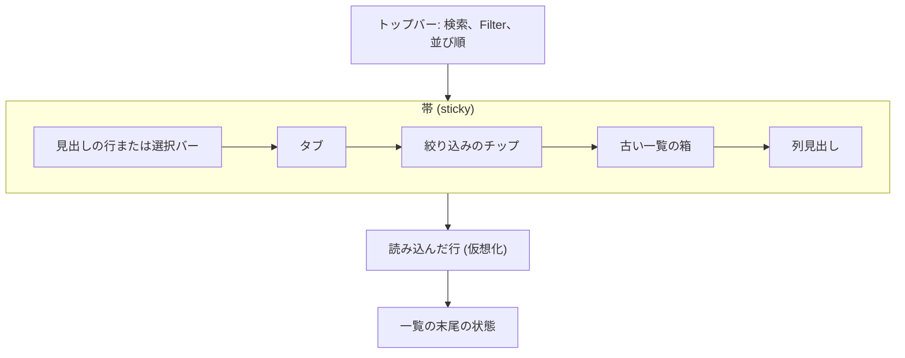

絞り込みのチップは絞り込みが適用されている間だけ、古い一覧の箱は最初のページが失敗した後だけ現れる。

## この形にした理由 {#why-this-shape}

- **ページの操作は、ライブラリと同じく共有のトップバーに置く。** 検索、絞り込み、並び順は `TopBarPortal` でトップバーの中央に入り、ライブラリの `SearchBox`、`FilterMenu` の枠 (`FilterPopover`)、`SortMenu` の形 (`SortMenuView`、`CompactSortView`) を再利用する。最初の版は本文の中に独自の操作の行を作り、ライブラリと合わなかった (レビュー)。トップバーは常に見えるので、スクロール中も操作に手が届く (要件 13)。
- **見出し、タブ、列見出しは `sticky` の帯に留まり、本文のスクロールは変わらない。** 一覧を専用の箱の中でスクロールさせる (本文は固定し、一覧だけが動く) と、戻ると進むでブラウザがスクロール位置を復元する方法と `/` の扱いが変わり、ページが設定など他の本文の画面と違う動きをする。帯は見出しの行 (選択中は選択バー)、タブ、絞り込みのチップ、列見出しを持ち、行は本文と一緒に流れる。選択バーが帯にあるので、どのスクロールの深さでも一括操作に手が届く。
- **並び順は、ライブラリの "Sort by" メニューと向きの切り替えを同じ場所で使う。** 親 Issue の `UI品質` がこの形を挙げており、ユーザーはライブラリですでに知っている。副次の `Button` は現在の種類を表示するので、その文字がどの並び順が有効かを示す。列の見出しをクリックしても並び替えない。列見出しはどの列が何かを示すだけで、並び順はトップバーのボタンが示す。
- **"Tentative only" と "Unused only" は、ライブラリの "Filter" ポップオーバーのチェックボックスである。** 最初の版は本文の操作の行に 2 つの切り替えボタンを置き、ライブラリの絞り込みと合わず、行を窮屈にした (レビュー)。有効な絞り込みは、"Filter" ボタンの件数 (ライブラリと同じく `bg-accent-soft text-link` と数字) と、見出しの下の**チップ** (ライブラリの `ActiveTagFilters` と同じ `FilterChip`) で示す。ユーザーはポップオーバーを開かずに何が適用されているかを読め、チップの × を 1 回押して絞り込みを外せる。
- **検索、絞り込み、並び順は、見える行の見た目を変えずにサーバーに送る。** 見える違いは、結果が読み込んだ行からではなくすべてのタグから来ることだけである (要件 4、6、7)。部品と位置は変わらない。条件が変わると、新しい最初のページが届くまで**前の行と件数が残る** (ライブラリの検索と同じ。空の一瞬の表示も `Skeleton` のちらつきもない)。失敗すると前の行が残り、"Retry" 付きの失敗の箱が**帯に留まって**、行が現在の条件と合わないことを伝える (Edge Case: 現在の失敗表示と "Retry" を表示する。一覧がすでにあれば残す)。トーストだけでは消えてしまい、合わない行が現在の結果のように見えたままになる。
- **スクロールが読み込んだ行の末尾に近づくと、続きの行を自動で読み込む。"Show more" ボタンはない。** これはライブラリと同じで、親 Issue はユーザーのスクロールに合わせて続きを読み込むよう求めている。続きの読み込み、失敗、一覧の変更は、トーストではなく**一覧の末尾の行**として表示する。これらは読み込んだ行に続くものなので、一覧が止まる場所に表示するのが最もわかりやすく、スクロールして戻れば前の行がまだあることがわかる。失敗の行はライブラリの `LoadMoreFailed` の箱で、"Retry" は同じカーソルから読み直す。
- **不一致 (別のタブでのタグの追加や削除) では、黙って読み直さずに行を残してユーザーに伝える。** 続きの読み込みの応答の `totalAll` が画面の値と異なるとき、読み込んだ行と選択は残り、一覧の末尾に "Reload" 付きの 1 行の一覧変更の通知を表示し、続きの読み込みは止まる ([research.md R-11](research.md#r-11-more-rows-load-100-at-a-time-near-the-end-duplicates-are-dropped-by-id-and-a-count-mismatch-asks-for-a-reload))。先頭から黙って読み直すと、数千行の深さのスクロール位置と選択した行が失われる。"Reload" だけが先頭から読み直す (選択は空になる)。通知は失敗ではないので、危険の色ではなく面を持つ中立の箱を使う。
- **全選択は読み込んだ行だけを選択し、読み込んでいないタグには及ばない。** 要件 10 と範囲外の項目 (条件に合うすべてへの一括操作) がこれを決める。選択できる集合が「条件に合う集合」より狭いので、アクセシブルな名前と選択バーの件数が、**読み込んだ行だけを選択した**ことを示す ([Column header](#column-header))。一覧の総数と選択した件数の差 ("500 of 1,000 tags" に対する "100 tags selected") が、残りを読み込んでいないことを示す。件数は読み込んだ数 (ページの境界) を表示しない。読み込みはスクロールで自動的に続き、その数はユーザーが必要としない仕組みだからである (レビュー)。
- **選択はチェックボックスを使い、選択中は見出しの行が選択バーに置き換わる。** 最初の版は画面の下端にバーを浮かせ、それが最後の行を覆った (レビュー)。見出しの行は帯に留まるので、それを置き換えると、行を覆わずにスクロール中も操作に手が届く (要件 13)。入れ替えても高さ (`min-h-10`) は同じなので、最初の行を選択しても一覧はずれない。チェックボックスはライブラリのリスト表示と同じく常にうっすら見えるので、ホバーのないデバイスでも入口が見える。
- **一括操作は本物のボタンで、適用されない操作は表示しない。** 最初の版は "Confirm" だけを表示し、残りを "More" メニューの下に隠した。選択バーには "Confirm" (主要。整理の主な操作)、"Merge into one tag…"、"Reject…"、"Delete…" (副次。文字とアイコンは危険の色) を置く余裕がある。選択に適用されない操作 (仮のタグがないときの "Confirm" と "Reject…"、確定したタグがないときの "Delete…") は薄くせずに隠す。使えるものだけを並べるほうが、なぜ使えないかをユーザーに読ませるより短い。確定は何も尋ねない (要件 11)。却下、削除、統合は確認のダイアログを通る。
- **"Select all loaded" は列見出しの先頭のチェックボックスである。** 一覧の上の細い列見出し (チェックボックス、"Name"、右寄せの "Videos") の先頭にあり、メール一覧の見出しのチェックボックスのように「この一覧 (読み込んだ部分) を選択する」と読める。ライブラリの "Select all" を選択バーに置く案は採らなかった。そのバーは最初の選択の後にしか現れないので、最初の行に別の押下が要る。見出しのチェックボックスなら、絞り込んだ後の 1 回の押下で読み込んだ行をすべて選択できる。
- **上限より多くの行を読み込んだときは、見出しのチェックボックスだけが止まる。** 一括の上限 (`maxTagBatch`、20,000) は送る id の数に適用される ([research.md R-4](research.md#r-4-bulk-confirm-reject-and-delete-use-one-post-apitagsbatch-transaction-that-skips-and-counts-misses)、Plan "Bulk actions")。1 つずつ選んだ数行は、読み込んだ行がいくつでも上限を下回るので、選択バーの操作を止める理由はない。"select all loaded" だけが止まり、その理由は読み込んだタグが多すぎることを伝えて絞り込みを促す。選択バーの操作は選択した件数そのものが上限を超えたときだけ止まり、行を 1 つずつ選んでそこに達することは実際にはない。
- **却下した名前は見出しの下の "Rejected names" タブで開き、本文の中で続きを読み込む。** 031 が一覧の下に置いた折りたたみの節は、数千行の下にあって手が届かない (要件 12)。最初の版は件数の行の右端の小さな入口からダイアログを開き、その行を窮屈にし、"Rejected names 0" をわかりにくくした (レビュー)。タブは両方の一覧とその件数を同じ形 "Tags 300 | Rejected names 4" で示し、帯に留まるので上端から届く。内容は本文にあり、本文のスクロールに合わせて続きを読み込む (要件 12 の後半)。タブの件数は読み込んだ数ではなく応答の `total` である。
- **統合先の候補は、キー入力のたびにサーバーから来る。** 画面は読み込んだ行しか持たず、要件 9 は選択したかどうかによらず任意のタグを統合先にできることを求める ([research.md R-14](research.md#r-14-merge-target-candidates-come-from-get-apitagsqlimit))。候補は一覧の検索と同じ照合形を使うので、全角と半角の形とかなの違いが一致する。見える違いは、入力の右端の小さなスピナーと、入力から少し遅れて変わることがある候補である。前の候補は新しい候補が届くまで残るので、一覧は空になってちらつかない。候補は、入力に重ねた一覧ではなく、入力の下の**高さ固定の箱**に常に表示する。重ねた一覧はダイアログの内容より高く開き、そのボタンを覆った (レビュー)。
- **タッチデバイスと `sm` 未満では、行の操作を文字のラベル付きの 1 つのメニューにまとめる。** 親 Issue の `UI品質` は、押すまで意味のわからないアイコンを操作にしないことを求める。各アイコンの横に文字を置く案は採らなかった。4 つの操作のラベルが行の幅を取り、名前の余地がなくなる。メニューの各項目は文字を持ち、"⋯" の入口は現在の一覧の製品が「この行の操作」として落ち着いている形である。行の 1 回の押下での確定は 2 回の押下になるが、タッチでの主な整理の経路は「チェックボックス → Confirm (選択バー)」で、1 行あたり 1 回の押下のままである。マウスのデバイスでは、現在の 4 つの `IconButton` (ツールチップ付き) は変わらない。

## 文言 {#words}

カタログがすでに持つラベルは、`web/src/i18n/en.ts` が示すとおりに書く。

| 場所 | 文言 | 注 |
| --- | --- | --- |
| 並び順のメニューの見出し | Sort by | |
| 並び順の種類 | Name / Video count / Date created | |
| 並び順のボタンのアクセシブルな名前 | Sort by: {kind} | |
| 向きの切り替え (動画の数) | Descending (most videos first). Press for ascending / Ascending (fewest videos first). Press for descending | |
| 向きの切り替え (作成日) | Descending (newest first). Press for ascending / Ascending (oldest first). Press for descending | |
| 向きの `SegmentedControl` の項目 (`sm` 未満のコンパクト表示) | Most videos first / Fewest videos first, Newest first / Oldest first | |
| `md` 未満のコンパクトな並び順のボタン | Sort | |
| 検索欄 | Search tags | アクセシブルな名前とプレースホルダー |
| 絞り込みのボタン | Filter / Filter (2 applied) | ライブラリと同じ。2 つ目はアクセシブルな名前 |
| 絞り込みのポップオーバーのチェックボックス | Tentative only / Unused only | |
| 絞り込みのチェックボックスのヒント | Show only tags created by automatic tagging / Show only tags that aren't on any videos | |
| 絞り込みのポップオーバーのリセット | Clear filters | ライブラリと同じ |
| チップの一覧のアクセシブルな名前 | Active filters | |
| チップのアクセシブルな名前 | Remove the filter "Tentative only" / Remove the filter "Unused only" | |
| 見出しの件数 | 90 of 1,000 tags | 絞り込みか検索が適用されている間は `totalAll` に対する `total`。それ以外は 1,000 tags。読み込んだ数は決して加えない |
| タブの一覧のアクセシブルな名前 | Tag lists | |
| タブ | Tags {`totalAll`} / Rejected names {`total`} | |
| 列見出し | Name / Videos | |
| 見出しのチェックボックスのアクセシブルな名前 | Select all 100 loaded tags / Clear selection | 2 つ目はすべてを選択している間。1 行のとき: Select the 1 loaded tag |
| 見出しのチェックボックスが無効な理由 (読み込んだ行が上限を超える) | Too many tags are loaded to select them all at once (limit {limit}). Narrow the list with search or a filter. | |
| 行のチェックボックスのアクセシブルな名前 | Select "{name}" | |
| 続きを読み込んでいる間 | Loading more tags… | スクリーンリーダーだけ |
| 続きの読み込みの失敗の行 | Couldn't load more: {reason} / Retry | |
| 一覧を表示中に最初のページが失敗した | Couldn't load tags: {reason}. The list below may not match the current search, filters and sort. / Retry | 帯の中 |
| 一覧変更の行 | Tags were added or removed elsewhere, so the rest of this list may be out of date. / Reload | |
| 結果が空のときの見出し | No unused tags / No unused tentative tags / No unused tags match "{input}" / No unused tentative tags match "{input}" | |
| 結果が空のときの説明 | Every tag is on at least one video. | "Unused only" だけで、検索なし |
| 結果が空のときのボタン | Show all tags | 現在の文言 |
| 選択バー (`region`) のアクセシブルな名前 | Selected tags | |
| 選択バーの件数 | 1 tag selected / 12 tags selected | |
| 選択バーの操作 | Clear selection (×) / Confirm / Merge into one tag… / Reject… / Delete… | |
| 選択した件数が上限を超える | Too many tags are selected to act on them together (limit {limit}). Clear some of the selection. | 選択バーの下 |
| 一括の確定のトースト | Confirmed 8 tags / Confirmed 8 tags. 4 were already confirmed. | |
| 一括の却下のダイアログのタイトル | Reject selected tags | |
| 一括の却下の文 (すべてに適用) | The 8 selected tags will be removed from 120 videos, and automatic tagging won't create their names again. You can allow a name again from Rejected names. | |
| 一括の却下の文 (一部に適用) | 8 of the 12 selected tags are tentative. They will be removed from 120 videos, and automatic tagging won't create their names again. The 4 confirmed tags are left as they are. You can allow a name again from Rejected names. | |
| 一括の削除のダイアログのタイトル | Delete selected tags | |
| 一括の削除の文 (すべてに適用) | The 8 selected tags will be removed from 120 videos. This can't be undone. | |
| 一括の削除の文 (一部に適用) | 8 of the 12 selected tags are confirmed. They will be removed from 120 videos. This can't be undone. The 4 tentative tags are left as they are; reject them instead. | |
| 動画が 0 件 (却下、削除、統合) | "…aren't on any videos…" の形 | "removed from 0 videos" には決してしない |
| 数えている間 | Counting the affected videos… | |
| 数えるのに失敗した | Couldn't count the affected videos: {reason} / Retry | |
| 一括の却下と削除のボタン | Cancel / Reject (Rejecting… while sending) / Delete (Deleting… while sending) | |
| 一括の却下と削除のトースト | Rejected 8 tags / Rejected 8 tags. 4 confirmed tags were skipped. / Deleted 8 tags / Deleted 8 tags. 4 tentative tags were skipped. | |
| 統合のダイアログのタイトル (複数) | Merge 4 tags | |
| 統合のダイアログの統合元の見出し | Tags to merge | |
| 統合先の入力 | Tag to merge into | 見えるラベルとアクセシブルな名前 |
| 候補なし (一覧の中) | No matching tags | |
| 統合のダイアログのフッター | Alpha → Action / 3 tags → Action | 統合元 → 統合先 |
| 候補の検索の失敗 (入力の下) | Couldn't search tags: {reason} | |
| 統合の確認 (複数) | The 120 videos tagged with these 4 tags get the tag "Action". Their names and synonyms become synonyms of "Action", and the 4 tags leave the tag list. This can't be undone. | 数は統合先を除いた統合元 |
| 選択から選んだ統合先 | "Action" is kept and the other 3 tags merge into it. | |
| 統合元が残っていない | Choose another tag to merge into: "Action" is the only tag selected. | |
| 統合のトースト (複数) | Merged 4 tags into "Action" | 実際に統合した数 |
| 対象の一部がもう存在しなかった | Some of the tags no longer existed, so the list was reloaded | |
| 却下した名前のタブの説明 | Automatic tagging won't create these names. Allow a name again to let it be created. | |
| 却下した名前の行のボタン | Allow again / Allow "{name}" again | 見える文字 / アクセシブルな名前 |
| 却下した名前の続きの読み込みの失敗 | Couldn't load more rejected names / Retry | |
| 行の操作のメニューの入口 (タッチ、`sm` 未満) | Actions | |

- "Unused" はどの動画にも付いていないタグを指し、文では "tags that aren't on any videos" と説明する。"Empty" と "orphan" は使わない。
- "Loaded" は「これまでに画面が受け取った」を意味し、読み込んでいないタグが残っていることを含意する。"Shown" と "visible" は使わない。見える行は描画した行で、読み込んだ行とは別の集合である。"Loaded" は見出しのチェックボックスのアクセシブルな名前と無効な理由にだけ現れ、件数やページの境界としては決して現れない。
- すべての数は `formatNumber` を使い、件数はカタログの `tagCount` と `videos` を使う。タグ名はユーザーデータで、翻訳せずに埋め込む (i18n.md)。

## トップバー {#top-bar}

検索、絞り込み、並び順は、ライブラリと同じく共有のトップバー (`TopBarPortal`) の中央に置く ([`web/src/tags/TagToolbar.tsx`](../../web/src/tags/TagToolbar.tsx))。順序と見た目は [`LibraryToolbar`](../../web/src/library/LibraryToolbar.tsx) に合わせ、Tab の順序も同じ: 検索 → "Filter" → 並び順 → 向き。本文に操作の行はない。"Rejected names" タブを開いている間、トップバーは何も持たない。タグの検索、絞り込み、並び順は却下した名前に適用されない (031 と同じ)。

検索、"Tentative only"、"Unused only"、並び順を変えると、新しい条件で**サーバーから最初のページを読み直す** ([data-model.md、画面の状態](data-model.md#screen-state)、"Conditions")。

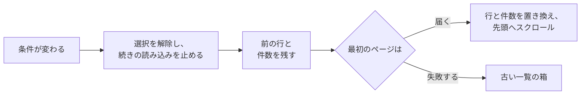

- 待つ間に `Skeleton` は戻らない。届いたときにスクロール位置は先頭に戻る。新しい条件では古い位置に意味がないからである。
- 送信中の続きの読み込みは捨てるので、古い条件の行が混ざることはない (Edge Case)。
- 並び順の変更を含め、**どの変更も選択を空にする** (Edge Case: 選択中に検索、絞り込み、並び順が変わったら選択を解除する)。同じ id で戻ってきた行は選択し直さない。
- 名前を変更中の行は条件の変更を越えて残る ([Row checkbox](#row-checkbox))。最初のページの失敗は [Stale list](#stale-list) である。

| 操作 | 形と振る舞い |
| --- | --- |
| 検索 | `syntaxHelp={false}` (動画の検索構文のヘルプなし) のライブラリの `SearchBox`。アクセシブルな名前とプレースホルダーは "Search tags"。`/` でフォーカスする。Esc は内容を消して欄を離れる (IME の変換中の Esc は無視する)。キー入力のたびに要求する (`debounceMs={0}`、前の要求は中止する。014 からの振る舞い)。サーバーはすべてのタグの名前と同義語を照合し、全角と半角の形とかなの違いを等しく扱う。ライブラリのタグ検索と同じ規則である (要件 7、[contracts/screen-api.md、`GET /api/tags` のパラメータ](contracts/screen-api.md#get-apitags-parameters) の `q`)。入力は `q` の上限である 100 文字 (コードポイント) で止まり、ライブラリの検索欄と同じ方法で数える。タグがないときは `disabled` |
| "Filter" | ライブラリの `FilterMenu` のボタンとポップオーバー (`FilterPopover`。副次の `Button`、`ListFilter`、`xl` 以上で文字 "Filter")。2 つの `FilterCheckbox`: "Tentative only" (ヒント "Show only tags created by automatic tagging") と "Unused only" (ヒント "Show only tags that aren't on any videos")。どちらかが適用されている間、ボタンはライブラリの `bg-accent-soft text-link` と有効な数 (1 または 2) を持ち、アクセシブルな名前は "Filter (N applied)" になり、ポップオーバーの最後に "Clear filters" が付く (両方を外す。検索と並び順は残る)。チェックボックスは `tentative=true` または `unused=true` で読み直し、ポップオーバーを開いたままにする (ライブラリと同じ)。両方を合わせると、すべてのタグのうち両方に合うタグに一致する (要件 6) |
| "Filter" が無効 | 最初のページが一度も届いていないとき、一覧のない失敗の後、何も適用されていないのに `totalAll` が 0 のとき。**絞り込みの適用中に `total` が 0 になっても無効にしない**: それはユーザーが絞り込みを外す手段であり、フォーカスの行き先である |
| 並び順、`md` 以上 | ライブラリの `SortMenu` の形 (`SortMenuView`): 現在の種類 ("Name"、"Video count"、"Date created") と `ChevronDown` を持つ副次の `Button` で、アクセシブルな名前は "Sort by: {kind}"。メニューは見出し "Sort by" と 3 つのラジオ項目を持つ。アイコン: Name は `ArrowDownAZ` (ライブラリの "Title" のアイコンで、名前順を意味する)。Video count は `Hash` (数)。Date created は `CalendarPlus` (タグが作られた日。ライブラリの "Date created" はファイルの作成日に `FileClock` を使うが、それは別のものなので絵を変える) |
| 並び順の既定の向き | 種類を選ぶとその既定の向きになる: Video count は降順 (`countDesc`)、Date created は新しい順 (`createdDesc`)。Name に向きはない (要件 4) |
| 向きの切り替え | ライブラリと同じく、メニューのボタンの右につなげた `Button` (`rounded-l-none px-2.5`) で、`ArrowDownWideNarrow` (降順) または `ArrowUpNarrowWide` (昇順) を持つ。アクセシブルな名前とツールチップは [Words](#words) にある。**Name では隠す** (メニューのボタンは角の丸みが全体に戻る) |
| 並び順、`md` 未満 | ライブラリの表示と並び順をまとめた操作と同じく、`SlidersHorizontal` のボタン (アクセシブルな名前 "Sort") がポップオーバー (`PopoverContent`、`align="end"`、`w-72`) を開き、その中に `CompactSortControls` の形 (`CompactSortView`) を持つ: 見出し "Sort by"、2 列のラジオ、その下の向きの `SegmentedControl` (Name では隠す)。ボタン自体は並び順で変わらない (ライブラリと同じ) |
| 並び順の範囲と記憶 | 読み込んだかどうかによらず、すべてのタグに適用する (要件 4)。サーバーが並べ、画面は並べ直さない。同順は自然な名前順で決める (R-10)。選んだ並び順は URL ([URL state](#url-state)) と `localStorage` (R-7) にある。URL に並び順がないときは保存した並び順を適用し、それが壊れていれば Name |
| 並び順が無効 | タグがないとき。最初のページが届く前を含む |

## URL の状態 {#url-state}

検索の文字、絞り込み、並び順、タブは、ライブラリの一覧の条件 ([specs/013-library-search/contracts/list-url.md](../013-library-search/contracts/list-url.md)) と同じく URL のクエリパラメータで、再読み込み、戻る、進むを越えて残る ([`web/src/tags/tagListUrl.ts`](../../web/src/tags/tagListUrl.ts))。

| パラメータ | 値 | 規則 |
| --- | --- | --- |
| `q` | `normalizeQuery` の形の検索の文字 | |
| `tentative` | `1` | false のときは書かない |
| `unused` | `1` | false のときは書かない |
| `sort` | `name`、`countDesc`、`countAsc`、`createdDesc`、`createdAsc` | 常に書く。省くと「この端末に保存した並び順」を意味することになり、戻るで前の並び順に戻れない ([013 list-url.md、パラメータ](../013-library-search/contracts/list-url.md#parameters) と同じ) |
| `tab` | `rejected` | "Tags" タブのときは書かない |

- 解析できない値は既定値として扱う。
- 絞り込み、並び順、タブ、チップの × は、それぞれ履歴の項目を 1 つ積む。検索の入力はライブラリと同じく働く: フォーカスからブラーまでの 1 回の中では、最初の確定だけが積み、残りは置き換える。
- R-7 は "Tentative only"、"Unused only"、検索の文字を URL に入れなかった。ライブラリの条件に合わせるため、今は入れる (レビュー)。`localStorage` は引き続き並び順だけを保存する。

## 帯 {#band}

本文の上部は、トップバーの下に留まる 1 つの帯である ([`web/src/tags/TagsPage.tsx`](../../web/src/tags/TagsPage.tsx))。上から下へ: **見出しの行** (選択中は**選択バー**) → **タブ** → **絞り込みのチップ** (絞り込みが適用されている間だけ) → [Stale list](#stale-list) の箱 (あるときだけ) → **列見出し**。

- 帯は `position: sticky` で、`top` はトップバーの高さのトークン (`top-navbar`)、行が透けないよう不透明な `bg-bg` の面を持ち、`z-20` (トップバーの `z-40` の下) である。中は `pt-3` 付きの `flex flex-col gap-3` なので、留まった見出しがトップバーに接しない。本文の幅は `max-w-4xl` のままである。
- 帯の高さは幅と内容 (チップ、箱、折り返した選択バー) で変わる。`ResizeObserver` がそれを測り直し、仮想化のスクロールのオフセットと `scroll-padding-top` がそれを差し引くので、フォーカスを受けた行が帯の下に隠れることはない。
- 一覧の先頭が帯の下に見えていないときに "New tag" を押すと、先に先頭までスクロールしてから作成の行を挿入し、その入力にフォーカスする。作成の行は常に一覧の最初にあり、入力が見えない場所に作られることはない。

### 見出し {#header}

見出しの行は `flex min-h-10 items-center gap-3` である: 左にライブラリの見出しの書式 (`text-xl font-semibold tracking-tight sm:text-2xl`) の `h1` "Tags"、その右にライブラリの "N items" の書式 (`text-xs text-fg-muted tabular-nums sm:text-sm`、`role="status"`、`aria-live="polite"`) の件数、次に主要な "New tag" (`Plus`)。

- **件数**: 応答の `total` と `totalAll` から作る ([contracts/screen-api.md、`GET /api/tags` のパラメータ](contracts/screen-api.md#get-apitags-parameters))。"1,000 tags"、または絞り込みか検索が適用されている間は "90 of 1,000 tags" (受け入れ条件 8。読み込んでいないタグも数える)。**読み込んだ数とページの境界は決して現れない。** 進行中の名前の変更のために残した行は数えない。操作の後の変化は手元で数える ([data-model.md、画面の状態](data-model.md#screen-state)、"Applying an action's result")。最初のページが届く前は、件数は "Loading…" と読める。
- "Rejected names" タブでは、行は件数と "New tag" なしで `h1` だけを表示する。
- 1 行を選択すると、この行は同じ高さの選択バーに置き換わる ([Selection bar](#selection-bar))。

### タブ {#tabs}

見出しの行の下に、下線の付いた 2 つのタブ (`ui/Tabs`、`role="tablist"`、アクセシブルな名前 "Tag lists") がある: "Tags {`totalAll`}" と "Rejected names {却下した名前の `total`}"。数は名前の後に `font-normal text-fg-subtle tabular-nums` で続き、わかるまでは省く。選択したタブは `text-fg` で 2px の `border-accent` の下線を持ち、もう一方は `text-fg-muted` (ホバーで `text-fg`) である。行は `border-b border-border` で終わる。

- 切り替えは押下、または左右の矢印、Home、End で行う。Tab の順序に入るのは選択したタブだけである。パネルは `role="tabpanel"` と `aria-labelledby` を持つ。
- タブは URL の `tab` である ([URL state](#url-state))。切り替えると、選択、作成の行、名前の変更を閉じる (どれも "Tags" タブのもの)。作成または名前の変更を送信している間、タブは切り替わらない。
- "Tags" タブを離れても読み込んだ行と件数は残り、戻ると同じ一覧を表示する。"Rejected names" を開いている間は何も続きを読み込まない。

### 有効な絞り込み {#active-filters}

"Tentative only" または "Unused only" が適用されている間、有効な絞り込みはタブの下にチップとして表示する (`ul`、アクセシブルな名前 "Active filters"、`flex flex-wrap gap-1.5`)。各チップはライブラリのタグの絞り込みの `FilterChip` である (`ActiveTagFilters`: `h-6`、`rounded-sm`、`bg-accent-soft`、`text-xs text-link`、末尾の `X`)。先頭のアイコン: "Tentative only" は `CircleDashed` (仮のマーク)、"Unused only" は `VideoOff`。アクセシブルな名前は "Remove the filter "{name}""。チップを押すとその絞り込みだけを外し、フォーカスを残ったチップに、なければ "Filter" に移す (タグがないときは "New tag" に)。

### 列見出し {#column-header}

一覧の上の細い行 (`h-9`、`border-b border-border`、`text-xs text-fg-muted`) で、行と同じ `px-2` と `gap-2 sm:gap-3` を持つ。左から右へ: **見出しのチェックボックス** → "Name" (`flex-1`) → 右寄せの "Videos" (`w-16 sm:w-20`、行の動画の数の列の幅) → 行の操作の列と同じ幅の空き (`sm` 以上のマウスのデバイスでは 4 つの `IconButton`、タッチまたは `sm` 未満では 1 つの "Actions")。操作の列をそろえるため、確定した行は "Confirm" の幅を確保するので、どの行でも動画の数が "Videos" の下に来る。列見出しは並び順の操作を持たず、一覧に行がないとき (空の状態) は隠す。

見出しのチェックボックスは `size-8` の包みの中の `Checkbox` (`size-5`) である。行のチェックボックスと同じように現れる ([Row checkbox](#row-checkbox): 何も選択していない間は `opacity-40`、列見出しのホバー時または選択中は `opacity-100`)。範囲は**選択できる読み込んだ行** (`rows`) である。名前を変更中の行は除き、読み込んでいないタグは決して選択しない (要件 10)。

| 状態 | 条件 | 印 | 押すと | アクセシブルな名前 |
| --- | --- | --- | --- | --- |
| 空 | 選択できる行を 1 つも選択していない | 空 | 選択できる行をすべて選択する | Select all 100 loaded tags (選択できる読み込んだ行の数) |
| 混在 | 一部を選択している | lucide `Minus` | 選択できる行をすべて選択する | Select all 100 loaded tags |
| すべて | すべてを選択している | チェック | 選択を解除する | Clear selection |
| 無効 | 選択できる行がない、または読み込んだ行が `maxTagBatch` を超える | | | 上限を超えたときは、理由 "Too many tags are loaded to select them all at once…" を包みの `title` と、`aria-describedby` が指す `sr-only` の要素に置く (ライブラリの上限と同じ)。選択バーはそれを表示しない ([Enabled and disabled](#enabled-and-disabled)) |

続きの読み込みが行を加えると、"すべて" は "混在" に戻る。

### 古い一覧 {#stale-list}

一覧を表示している間に**最初のページ**が失敗したときの形である: 条件の変更、"Reload"、`notFoundIds` の後の読み直しの後 ([data-model.md、画面の状態](data-model.md#screen-state)、"Load failure")。

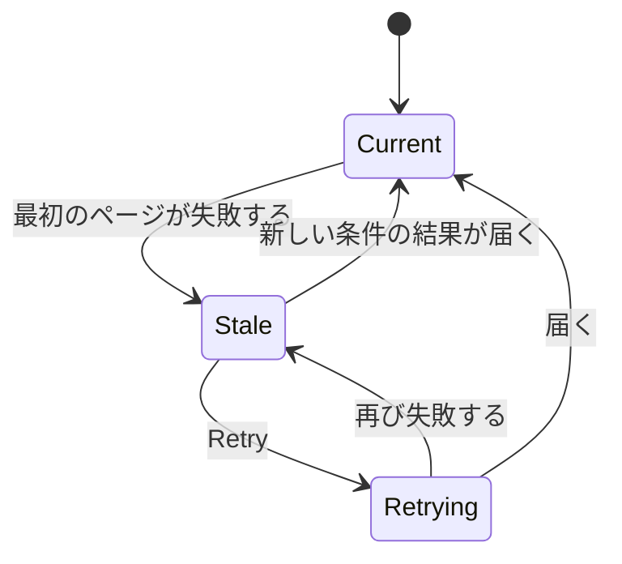

- 前の行と件数は残る (Edge Case)。帯の中の列見出しの上に、ライブラリの `LoadMoreFailed` の箱 (`rounded-md border border-danger bg-danger-soft px-3 py-2 text-sm text-danger`、`AlertCircle`、`role="alert"`) が、`sm` の `Button` "Retry" 付きで "Couldn't load tags: {reason}. The list below may not match the current search, filters and sort." と伝える。トーストは出さない: 箱が同じことを伝え、消えない。残した行が条件に合わないので、通知はどのスクロールの深さでも見えなければならず、そのため帯に置く。
- 箱は、"Retry" か条件の変更で最初のページが**届く**まで残る。"Retry" は現在の条件で最初のページを読み直し、送信中は `disabled` である。届くと行と件数が置き換わり、スクロールは先頭に戻り、箱は消える。再び失敗すると箱は残り、理由だけが変わる。
- 箱を表示している間は**何も続きを読み込まない**: カーソルは古い条件のものであり (Edge Case: 古い条件の行が混ざることはない)、[Loading more](#loading-more) の状態は表示しない。残した行のチェックボックスと操作は引き続き使える。それぞれが実在するタグに働き、従来どおり読み込んだ行の中で適用される。
- 帯は箱の分だけ高くなる (`sm` 未満では文字とボタンが `flex-wrap` で折り返す)。これはまれな失敗の間だけで、仮想化は現在の帯の高さを差し引く ([Band](#band))。

## 行 {#rows}

行の列、書式、高さ (`py-2`)、名前のリンク、同義語の行、動画の数、仮のマーク、名前の変更の入力は 014 と 031 のままである。先頭のチェックボックスと、タッチと狭い幅でまとめた操作だけを加える。見える行だけの描画 (R-2) とページ単位の読み込み (R-1、R-11) は、行の見た目を変えない。

### 続きの読み込み {#loading-more}

一覧の末尾 (最後に読み込んだ行の下) は、一度に 1 つの続きの読み込みの状態を表示する。行と同じ `px-2` と幅を使い、`divide-y` の線の下に置き、数えず、選択できず、仮想化の描画範囲の外にある (読み込んだ行の後の普通の要素)。

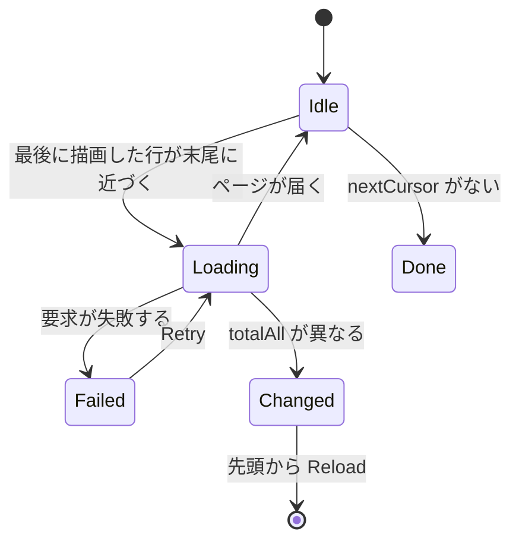

新しい条件で先頭から読み直すと、すべての状態が消える。

| 状態 | 一覧の末尾に表示するもの |
| --- | --- |
| 読み込み中 | 3 つの行の `Skeleton` (最初の読み込みの形と高さ、`aria-hidden`)。一覧の包みは `aria-busy` で、`sr-only` の `role="status"` "Loading more tags…" を持つ。**見える行はスクロールし続け、操作を受け付け続ける** (`UI品質`)。読み込み中の 1 行の操作は読み込んだ行の中で適用される (R-12)。届いた行は追加され、`Skeleton` は消える |
| 失敗 | ライブラリの `LoadMoreFailed` の箱 (`rounded-md border border-danger bg-danger-soft px-3 py-2 text-sm text-danger`、`AlertCircle`、`role="alert"`、`my-3`) に "Couldn't load more: {reason}" と `sm` の `Button` "Retry" を置き、"Retry" は同じカーソルから読み直す。読み込んだ行は残る (Edge Case: when loading more fails) |
| 一覧が変わった (続きの読み込みの `totalAll` が画面の値と異なる) | 同じ大きさの中立の箱 (`rounded-md border border-border-strong bg-elevated px-3 py-2 text-sm text-fg`、lucide `RefreshCw`、`role="status"`) に "Tags were added or removed elsewhere, so the rest of this list may be out of date." と副次の `sm` の `Button` "Reload" を置く。続きの読み込みは止まり、読み込んだ行と選択は残る。"Reload" は先頭から読み直し (選択は空、スクロールは先頭)、箱は消える (Edge Case: 続きの読み込み中に別のタブがタグを変える。R-11)。失敗ではなく通知なので、危険の色にしない |
| 完了 (`nextCursor` がない) | 何もない。"Everything is loaded" の行はない: 続きの読み込みの `Skeleton` がないことが合図で、読み込んだ数は表示しない |

きっかけは、仮想化の最後に描画した行が、読み込んだ行の末尾から数行以内に来ることである ([data-model.md、画面の状態](data-model.md#screen-state)、"When to load more")。そのため、ユーザーが末尾に着く前に読み込みが始まる。操作によって**読み込んだ行がなくなり** (`rows` が空)、`nextCursor` があるときは、行を描画しないのでそのきっかけは起きない。そのとき画面は操作の適用と一緒に次のページを 1 回要求し、`total` が 0 でなければ空の状態ではなく読み込み中の `Skeleton` を表示する。例: "Tentative only" で読み込んだ仮のタグをすべて確定する、"Unused only" で読み込んだ行をすべて削除する。

### 行のチェックボックス {#row-checkbox}

- `Checkbox` (`size-5`) は名前の列の**左**に `gap-2` (`sm:gap-3`) で置く。押す対象は、チェックボックスを中央に置いた `size-8` の正方形の包みなので、タッチでも外さない。押しても名前のリンクには進まない。
- 見え方はライブラリのリスト表示に従う: 何も選択していない間は `opacity-40`、その行のホバーまたはフォーカスで `opacity-100`、何かを選択している間はすべての行で `opacity-100`。ホバーのないデバイスは `opacity-40` のまま押す (薄いが見える)。
- 選択した行は `bg-accent/10` の面 (アクセントの 10%) を持つ。最初の版の `bg-accent-soft` はべた塗りの濃い青緑で、選択した行が続くと一覧が重く見えた (レビュー)。名前 (`text-fg`) と件数と同義語 (`text-fg-muted`) は色を保つ。
- 名前を変更中の行は名前の変更の面 (`ring-control-border` 付きの `bg-elevated`) を表示し、それが優先し、そのチェックボックスは `disabled` である。名前の変更を確定すると行が別の並び順の位置に移ることがあるので、名前の変更中は選択できない。選択した行で名前の変更を始めると、その行は選択から外れる (選択バーの件数が減り、0 になると見出しの行が戻る)。一括操作は名前を変更中のタグに決して働かない。
- 選択は**読み込んだ行**の部分集合で、検索、絞り込み、**並び順**が変わると空になる (Edge Case、[data-model.md、画面の状態](data-model.md#screen-state)、"Selection")。操作または読み直しの後に `rows` から外れた id は選択から落ちる。読み込んだ行が上限を超えても、行のチェックボックスは押せるままである ([Why this shape](#why-this-shape))。
- 名前を変更中の行は、新しい条件での先頭からの読み直しを越えて残る: 新しい `rows` にそれがなければ並び順の位置に挿入するので、入力した名前は失われない (名前を変更中の行の Edge Case。現在の検索と同じ)。名前の変更を確定または取り消したとき、現在の条件に合わなければ行は消える。
- Shift による範囲選択はない: 親 Issue は求めておらず、見出しのチェックボックスが読み込んだ行をすべて選択する。

### タッチと狭い幅での操作 {#actions-on-touch-and-narrow-widths}

| デバイスと幅 | 行の操作 |
| --- | --- |
| `sm` 以上のマウス (`pointer: fine`) | 変わらない: "Confirm"、"Rename"、"Synonyms" の `IconButton` と "More actions" メニュー (031 "Row") |
| タッチ (`pointer: coarse`) または `sm` 未満 | 右端の 1 つの `IconButton` (`Ellipsis`、アクセシブルな名前 "Actions"、ツールチップなし) が、ラベル付きの項目のメニューを開く: "Confirm" (`Check`、仮の行だけ) → "Rename" (`Pencil`) → "Synonyms" (`Tags`) → "Merge into another tag…" (`Merge`) → 区切り → "Reject…" (`Ban`、危険、仮の行) または "Delete…" (`Trash2`、危険、確定した行) |

- 項目のラベルは、現在の `IconButton` のアクセシブルな名前とメニューの項目を再利用する。どちらの形にするかは `matchMedia` を読まずに CSS で選ぶ (`[@media(pointer:coarse)]` と `max-sm:`。library-ui.md、[幅のブレークポイントは CSS に置き、サイドバーは例外とする](../../docs/design-docs/library-ui.md#width-breakpoints-in-css-and-the-sidebar-exception)、`TouchControls` と同じ)。
- メニューの "Confirm" は行の "Confirm" と同じく振る舞う: 確認なし。送信中は入口の `IconButton` が `aria-busy` になり、それ以上の押下を無視する。名前の変更、同義語、統合、却下、削除は、それぞれの `IconButton` と項目と同じく振る舞う。"Rename" または "More actions" を対象とする 014 と 031 のフォーカスの規則は、まとめている間は入口の `IconButton` を対象とする。
- 360px での幅: 本文の `px-4` と行の `px-2` で 312px が残る。そこからチェックボックスの包み `size-8` (32px)、3 つの `gap-2` (24px)、件数の列 `w-16` (64px)、入口の `IconButton` (32px) を引くと、名前の列は約 160px になる (031 の 92px より広い)。横スクロールはない。
- このまとめはマージ済みである (#683)。

## 選択バー {#selection-bar}

1 行を選択すると、帯の上端の見出しの行が同じ高さ (`min-h-10`) の**選択バー**に置き換わる ([`web/src/tags/TagSelectionBar.tsx`](../../web/src/tags/TagSelectionBar.tsx)): `role="region"`、アクセシブルな名前 "Selected tags"。選択が空になると見出しの行が戻る。画面の下端に浮くバーはない (最後の行を覆った。レビュー)。帯と一緒に留まるので、どのスクロールの深さでも手が届く (要件 13)。

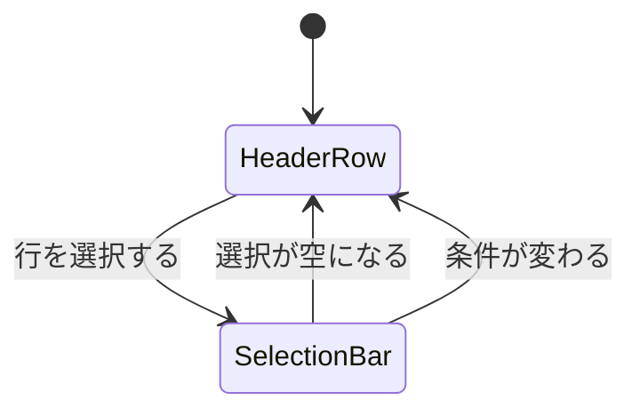

選択は、×、"すべて" の状態の見出しのチェックボックス、条件の変更、タブの切り替え、最後に選択した行の名前の変更、操作の適用で空になる。

### レイアウト {#layout}

左から右へ:

1. **×** (`IconButton`、アクセシブルな名前 "Clear selection")。選択を解除し、フォーカスを見出しのチェックボックスに移す。
2. 件数 "12 tags selected" (`text-lg font-semibold text-fg tabular-nums`、`role="status"`、`aria-live="polite"`。見出しの場所にあるので見出しに近い大きさ)。数は選択した id の数で、読み込んだ行の部分集合である。見出しのチェックボックスの後は、選択できる読み込んだ行の数 ("100 tags selected") になる。それが条件に合う総数 (タブの "Tags 1,000"、見出しの行の "500 of 1,000 tags") を下回るとき、その差が「残りは読み込んでいない」と読める。
3. 右寄せで、一括操作を本物のボタン (`Button`、`md`) として置く:

| ボタン | 種類とアイコン | 表示する条件 |
| --- | --- | --- |
| Confirm | 主要、lucide `Check` | 選択に仮のタグがある |
| Merge into one tag… | 副次、`Merge` | 常に (1 つの統合元の統合は、行の統合と同じ結果になる) |
| Reject… | 副次、`Ban`。文字とアイコンは `text-danger` | 選択に仮のタグがある |
| Delete… | 副次、`Trash2`。文字とアイコンは `text-danger` | 選択に確定したタグがある |

幅が足りないとき (`sm` 未満など)、ボタンは件数の下の行に折り返す (`flex-wrap`)。ライブラリの "Select all" はここにはない。見出しのチェックボックスがその役目を果たす。

### 有効と無効 {#enabled-and-disabled}

- 選択に適用されない操作は**薄くせずに隠す**。仮のタグと確定したタグが混在するときは "Confirm"、"Reject…"、"Delete…" がすべて表示され、それぞれが適用されるタグに働き、飛ばした数を報告する (Edge Case)。
- 上限は**選択した件数**に適用される: 選択した id が `maxTagBatch` を超えたときだけ、表示している操作が `disabled` になり、ライブラリと同じ形の理由 ("Too many tags are selected to act on them together…") を `title`、`aria-describedby`、選択バーの下の `text-xs text-danger` の行に置く。**読み込んだ行が上限より多くても、選択した件数が上限内なら操作は押せるままである** (1 つずつ選んだ行は、読み込んだ行がいくつでも使える。Plan "Bulk actions"、要件 8 と 9)。見出しのチェックボックスは読み込んだ件数で止まる ([Column header](#column-header)) ので、この状態には上限より多くの行を 1 つずつ選ばないと達せず、それは実際には起きない。
- 一括操作を送信している間、選択バーのすべてのボタンは `disabled` で、確定の間は "Confirm" のアイコンが `LoaderCircle` (`animate-spin motion-reduce:animate-none`) になる。続きの読み込みは止めない: 送る id は選択で決まり、届く行に左右されない。

### 一括の確定 {#bulk-confirm}

"Confirm" は、ダイアログなしで 1 つの `POST /api/tags/batch` (`confirm`、選択したすべての id) を一度に送る (要件 11)。

| 応答の部分 | 画面の結果 |
| --- | --- |
| `appliedIds` | それらの行は**読み込んだ行の中で** `tentative: false` に変わり (マークと行の "Confirm" が消える。読み直さない。R-12)、選択から外れる。トースト "Confirmed 8 tags" |
| `notApplicableIds` (確定済み) | 選択に残る。トーストは "Confirmed 8 tags. 4 were already confirmed." になる |
| `notFoundIds` が空でない | 一覧を**先頭から**読み直す (スクロールは先頭。新しい `rows` にない id は選択から外れる)。トースト "Some of the tags no longer existed, so the list was reloaded" |
| 失敗 (`5xx`、ネットワーク) | `errorText` のトースト。何も変わらず、選択は残る (Edge Case: when it fails midway) |

"Tentative only" では、確定した行は一覧から外れ、`total` が減る。読み込んでいない仮のタグは仮のままで、続きを読み込むと現れる (受け入れ条件 10)。確定の後のフォーカスは次の規則に従い、押せないボタンに着くことは決してない。

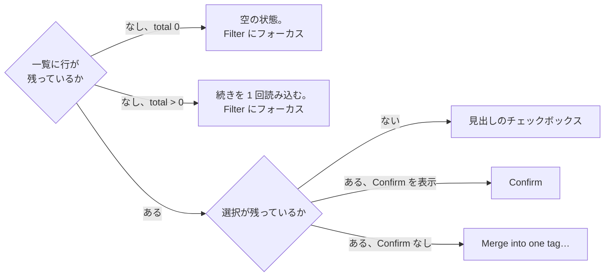

- "なし、total 0" は 031 の "No tentative tags" の空の状態を表示する。フォーカスは "Filter" に行く。031 がフォーカスした切り替えは今はそこにある (031: 行が絞り込みから外れたときのフォーカス)。
- "なし、total > 0" は、読み込んでいない仮のタグが残っていることを意味する。画面は空の状態を表示しない。行を描画しないので仮想化のきっかけが起きないため、確定の適用と一緒に `nextCursor` で次のページを要求する ([Loading more](#loading-more))。カーソルは最後に読み込んだ行の位置なので、確定した行が外れても動かない。選択バーは消え、見出しのチェックボックスは `disabled` なので、フォーカスは "Filter" に行く。
- "ある、Confirm なし" は、仮のタグと確定したタグが混在し、確定したものだけが選択に残ったときに起きる。

### 一括の却下と削除 {#bulk-reject-and-delete}

選択バーの "Reject…" と "Delete…" は、014 の削除のダイアログの骨格を持つ `ModalFrame` のダイアログを開く: 本文の段落、副次の "Cancel" (最初のフォーカス)、危険の "Reject" または "Delete"。

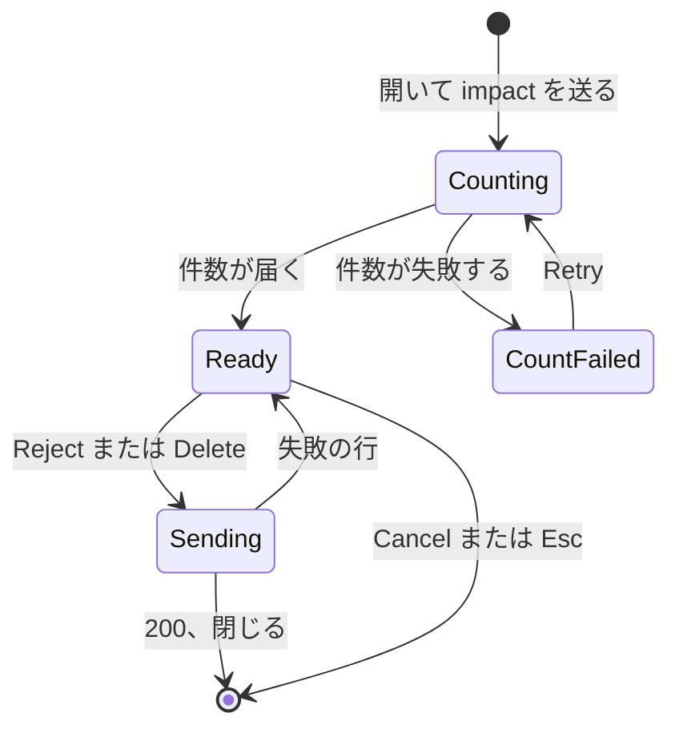

| 状態 | ダイアログが表示するもの |
| --- | --- |
| 数えている | 開くと `POST /api/tags/impact` (`reject` または `delete`、選択したすべての id) を送る。本文は `LoaderCircle` 付きの 1 行 "Counting the affected videos…" (`text-sm text-fg-muted`)。数がないまま何も実行しないよう、**危険のボタンは `disabled` のまま** ([contracts/screen-api.md、`POST /api/tags/impact`](contracts/screen-api.md#post-apitagsimpact)) |
| 準備完了 | `tagCount` が選択した件数と等しいときは "すべてに適用" の文、小さいときは "一部に適用" の文 ([Words](#words)。選択した数、適用する数、飛ばす数と `videoCount` を埋める)。`videoCount` 0 は "aren't on any videos" の形を使い、"removed from 0 videos" には決してしない。段落は 014 の `border-l-2 border-danger-strong pl-3` を持つ |
| 数えるのに失敗した | `text-sm text-danger` (`role="alert"`) の "Couldn't count the affected videos: {reason}" と ghost の `sm` の `Button` "Retry"。危険のボタンは `disabled` のまま |
| 送信中 | 両方のボタンが `disabled`。危険のボタンに `LoaderCircle` (削除のダイアログと同じ) |
| 失敗 | `errorText` を持つ `text-sm text-danger` (`role="alert"`) の 1 行。ダイアログは開いたままで、選択は残る |
| Cancel または Esc | 何も変えずに閉じ、フォーカスを開いたボタン ("Reject…" または "Delete…") に戻す |

`200` でダイアログは閉じる:

- `appliedIds` の行は読み込んだ行 (`total` と `totalAll` が減る。読み直さない) と選択から外れる。`notApplicableIds` は選択に残る。
- トースト "Rejected 8 tags" または "Deleted 8 tags"。飛ばしたタグがあれば "… 4 confirmed tags were skipped." または "… 4 tentative tags were skipped."。
- 却下の後は、却下した名前の最初のページを読み直す (タブの件数が増える)。
- 空でない `notFoundIds` は、[Bulk confirm](#bulk-confirm) と同じトーストで一覧を先頭から読み直す。
- 取り除いたことで一覧の末尾が描画範囲に入ると、通常どおり続きの読み込みが始まる。読み込んだ行が残っておらず `nextCursor` があるときは、結果の適用と一緒に次のページを要求する ([Loading more](#loading-more))。

フォーカスは、014 と 031 の削除と却下の規則を一括操作に適用する:

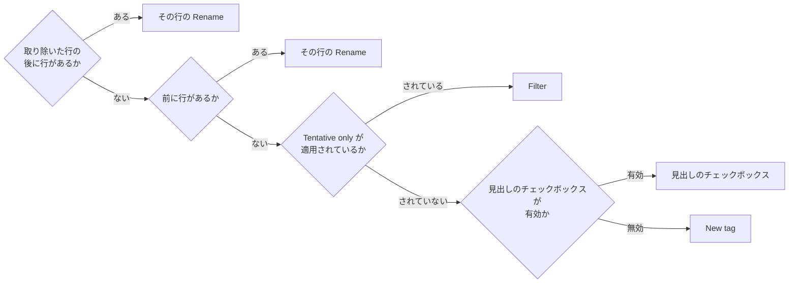

行の操作をまとめている間、"Rename" は入口の `IconButton` を意味する。

## 統合のダイアログ {#merge-dialog}

`MergeTagDialog` は、1 つ以上の統合元を持つ 1 つのダイアログになる。行の "Merge into another tag…" (1 つの統合元) と選択バーの "Merge into one tag…" (選択したタグを統合元とする) は同じダイアログを開く。

### 幅 {#width}

- ダイアログは `sm:max-w-lg` の `ModalFrame` である (`sm` 未満では全幅)。統合先の入力の枠と候補の一覧は、1 件の統合でも、ダイアログの内側の幅を埋める (`frameClassName="w-full"`。要件 14)。

### 統合先の欄と一覧 {#target-field-and-list}

- **見えるラベル** "Tag to merge into" (`label`、`text-sm font-medium text-fg`) を入力の上に、lucide `Search` (`text-fg-subtle`) を枠の左に置く。枠は本文の検索欄に合わせる (`h-9`、`text-sm`、`rounded-md`)。
- 候補は、入力に重ねた一覧ではなく、入力の下の**高さ固定の箱** (`h-60 max-h-[40vh]`、`rounded-md border border-border p-1`、縦にスクロール。`Combobox` の `inline`) に**常に**並べる。箱の高さは候補の数によらず、ダイアログのフッターのボタンを決して覆わない。候補の行は `min-h-9` と `rounded-md` で、ホバーした行または矢印で選んだ行は `bg-hover-wash` である。
- **選んだ統合先は一覧の中で目立つ** (`bg-accent-soft text-link`、名前は `font-medium`)。
- 候補がないとき (読み込み中でも失敗でもない)、箱は `text-sm text-fg-muted` で "No matching tags" を表示する。
- フッター (ボタンの行) の左は、統合先を選ぶと "**統合元 → 統合先**" を表示する: 統合元が 1 つならその名前、複数なら "3 tags" を `text-sm text-fg-muted` で、統合先を `font-medium text-fg` で、間に `ArrowRight` を置く。
- "Merge" は**主要**の `Button` で、統合先を選んでその件数が届くまで `disabled` (主要の `disabled`、`opacity-50`) である。押せない "Merge" を危険の赤で表示しない (レビュー)。本文の `border-l-2 border-danger-strong` の段落が、操作が破壊的であることを伝える (014 と同じ)。
- 候補の箱が開いていても、Esc はダイアログを閉じる: 箱はダイアログの本文の一部で、閉じる独自の階層を持たない。

### 統合元 {#sources}

| 統合元 | ダイアログの内容 |
| --- | --- |
| 1 つ (行から) | 現在の形: タイトル "Merge "X""、統合元の一覧なし、014 の確認の文と件数 (`videoCount`) |
| 複数 (選択バーから) | タイトル "Merge 4 tags"。入力の上に、見出し "Tags to merge" (`text-xs font-semibold text-fg-muted uppercase`、ポップオーバーの `legend` の書式) と統合元の名前 (`ul`、`flex flex-wrap gap-1.5`。それぞれ 014 の同義語のダイアログと同じ `bg-bg` の `Chip`、`h-6`、`text-xs`、× なし)。一覧は `max-h-32 overflow-y-auto` なので、数十の統合元でもダイアログは伸びない。仮のタグは名前の後に行のマーク (`size-3`) を持つ |
| 選択から選んだ統合先 | そのタグは統合元から外れる (Edge Case)。そのチップは `text-fg-muted` の "kept" 付きで残り (取り除くと選択したタグがなくなったように見える)、確認の文の上に `text-sm text-fg-muted` の行 ""Action" is kept and the other 3 tags merge into it." を置く |
| 統合先だけが残った (1 つのタグを選択し、それを統合先に選んだ) | `text-sm text-fg-muted` の "Choose another tag to merge into: "Action" is the only tag selected." が確認の文に代わり、"Merge" は `disabled` |

### 統合先の候補 {#target-candidates}

候補は**すべてのタグ**から来る: 選択したもの、選択していないもの、読み込んでいないもの (要件 9)。入力のたびに `GET /api/tags?q={input}&limit=8` を要求する ([research.md R-14](research.md#r-14-merge-target-candidates-come-from-get-apitagsqlimit)、[data-model.md、画面の状態](data-model.md#screen-state)、"Merge dialog candidates")。

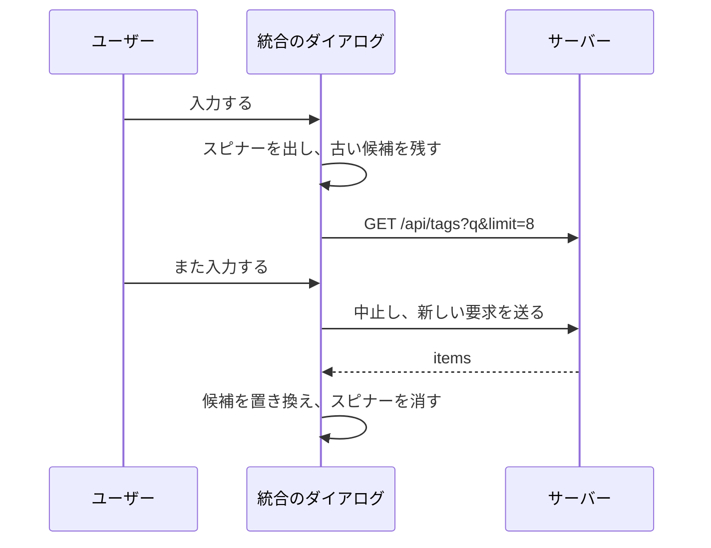

- **候補の行は現在の `Combobox` の内容を保つ**: 名前、同義語が一致したときの "Synonym: …"、右端の件数、入力と等しい名前または同義語の `exactOption`、最大 8 行。入力と正確に同じ綴りのタグは、最初の部分一致の中になくても応答の `exact` から取り、先頭に来る ([screen-api.md §5](contracts/screen-api.md#get-apitags-parameters))。残りはサーバーの自然な名前順を保つ。行から開いたときは、8 に統合元の数を足した数を要求し、画面が統合元を落とすので 8 行が残る。選択から開いたときは、選択したタグも候補に残る (マージ済みの形)。
- **開いた直後** (空の入力) は、同じ要求で最初の 8 件を取得し、届いたら並べる。空の入力の候補は今のままである。
- **読み込み中**: `Combobox` の `busy` (枠の右端の `LoaderCircle`、`size-3`、`text-fg-muted`、`aria-busy`)。置き換わるまで**前の候補が残る**。キー入力のたびに消えて戻る一覧は追えないので、一覧は空にも閉じもしない。"Searching…" の行はない: スピナーで足り、読み込みは 1 往復で、たいてい入力と一緒に現れる。次の入力は送信中の要求を中止し、最後の応答だけが候補になる。
- **候補なし** (`items` が空で `exactOption` もない): 箱に "No matching tags"。
- **失敗**: 入力の下に `Combobox` の `reason` の書式 (`mt-1 text-xs text-danger`) で "Couldn't search tags: {reason}"。最後の候補は残り、次の入力がメッセージを消して検索し直す。"Retry" はない: 入力を変えれば検索し直すので、他に押すものはない。"Merge" は従来どおり、候補を選ぶまで押せない。
- 照合は一覧の検索の照合形を使うので、`ａｃｔ` は "Action" を読み込んでいなくても見つける (要件 9 と 7)。選んだ後に起きることは [Confirmation](#confirmation) にある。

### 確認 {#confirmation}

- 統合先を選ぶと、統合先を除いた統合元に対して `POST /api/tags/impact` (`merge`) を送る。届くまでは `LoaderCircle` 付きの "Counting the affected videos…" を表示し、"Merge" は `disabled`。届くと、014 の `border-l-2 border-danger-strong` の段落が "The 120 videos tagged with these 4 tags get the tag "Action". …" と伝える。タグの数 ("these 4 tags"、"the 4 tags leave") は選択した件数ではなく**統合先を除いた統合元**である: 4 つを選択してその中の "Action" を選ぶと "these 3 tags" になる。動画の数は応答の `videoCount` である。統合元が 1 つ残るときは、014 の 1 件のタグの文を使う。件数の失敗は一括の却下の "Couldn't count…" と "Retry" を表示する。別の統合先を選ぶと数え直す。
- 実行すると、`sourceIds` = 統合先を除いた統合元で `POST /api/tags/{id}/merge` を送る。`200` で:

| 結果 | 規則 |
| --- | --- |
| ダイアログ | 閉じる |
| 統合元の行 | 読み込んだ行から外れる |
| 統合先 | 応答の `tag` から書き直す (件数は合算。仮は確定になる)。読み直さない |
| 読み込んだ行の中の統合先 | その行を置き換え、並び順の位置に移す |
| 読み込んでいない統合先 (候補から選んだ) | 並び順の位置が読み込んだ範囲の中なら挿入する。そうでなければ挿入せず、後のページが返す (R-12) |
| 選択 | 空になる |
| トースト | **実際に統合した**数 (`sourceIds` から `notFoundIds` を除いたもの): "Merged 4 tags into "Action"" (1 つなら 014 の "Merged "X" into "Action"") |
| フォーカス | 統合先の行が読み込んだ行の中にあればその名前 (014 と同じ)。そうでなければ (読み込んだ範囲の外、または "Tentative only" で確定した) 031 の規則: 最初に取り除いた統合元の後の行、なければ見出しのチェックボックス (行が残らずチェックボックスが `disabled` なら "New tag") |
| 読み込んだ行が残らず `nextCursor` がある | 結果の適用と一緒に次のページを要求する ([Loading more](#loading-more)) |

- 空でない `notFoundIds` は一覧を先頭から読み直す。**すべての**統合元がなくなっていたとき (`notFoundIds` が `sourceIds` に等しい。応答の `tag` は変わらない) は統合のトーストを出さず、今の `tag_not_found` と同じように扱う: ダイアログを閉じ、トースト "Some of the tags no longer existed, so the list was reloaded" を表示し、一覧を読み直す。一部だけがなくなっていたときは、統合した数のトーストの後に同じ読み直しのトーストが続く。
- 失敗、"Cancel"、Esc は 014 のままである: 失敗は開いたダイアログに表示し、閉じるとフォーカスは開いた "More actions" または選択バーの "Merge into one tag…" に戻る。

## 却下した名前のタブ {#rejected-names-tab}

見出しの下の "Rejected names" タブ ([Tabs](#tabs)) を選ぶと、却下した名前を本文に並べる (`role="tabpanel"`。[`web/src/tags/RejectedNames.tsx`](../../web/src/tags/RejectedNames.tsx))。ダイアログは開かない。内容は `GET /api/tags/rejected-names` の**ページ**で届き、本文のスクロールに合わせて続きを読み込む ([research.md R-13](research.md#r-13-rejected-names-load-in-pages-from-get-apitagsrejected-names-with-more-loaded-on-scroll)、[contracts/screen-api.md、`GET /api/tags/rejected-names` のパラメータ](contracts/screen-api.md#get-apitagsrejected-names-parameters))。

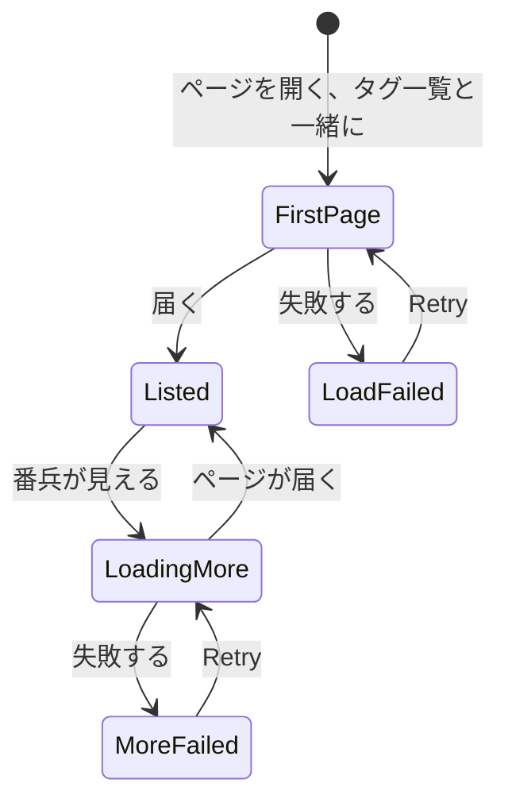

- **内容**: 説明の 1 行 (`text-sm text-fg-muted` の "Automatic tagging won't create these names. Allow a name again to let it be created.") と名前 (`ul`、アクセシブルな名前 "Rejected names"、`divide-y divide-border`)。行は `min-h-12` と `px-2` で、名前 (`text-sm font-medium`、`title` 付きの `truncate`) と右の副次の `sm` の "Allow again" (アクセシブルな名前 "Allow "{name}" again") を持つ。押すとすぐに名前を取り除く (確認なし、送信中は `disabled`、トーストなし)。フォーカスは次の行の "Allow again" に、なければ前の行のものに、なければ "Rejected names" タブに移る。取り除くのに失敗すると、一覧の下に `role="alert"` の 1 行を表示する。最初の読み込みは行の高さの `Skeleton` を 4 つ (`h-10`) 表示する。最初の読み込みが失敗すると "Couldn't load the rejected names" と "Retry" を表示する。名前がないときは "No rejected names" を中央に表示する。規則は 031 の "Rejected names" で、× のチップを行のボタンに変えたものである。
- **読み込み**: ページを開くと、タグ一覧と一緒に最初のページ (100) を取得し、タブの件数は応答の `total` である。タブを開くと、読み直さずにそのページを表示する (受け入れ条件 13)。
- **続き**: 一覧の末尾がビューポートに近づくと (ビューポートを root とする番兵)、次の 100 件が `nextCursor` で届いて追加される (#730 の規則。行は仮想化しない)。読み込み中は行の高さの `Skeleton` を 3 つ (`aria-hidden`) 一覧の下に置き、その `ul` は `aria-busy` である。要求は一度に 1 つ。届くまで行のボタンは押せるままである。読み直し中に番兵が見えたら、読み直しの後にもう一度監視し、続きを読み込む。
- **続きの失敗**: 一覧の下に、`text-sm text-danger` (`role="alert"`) の "Couldn't load more rejected names" と ghost の `sm` の `Button` "Retry"。読み込んだ名前は残り、"Retry" は同じカーソルから読み直す。読み込んだ名前をすべて取り除いたが続きが残っているとき、画面は空の文ではなく続きの読み込みの状態 (失敗の後なら "Retry") を表示する。
- **取り除き**: `204` で行を取り除き、読み直さずにタブの件数 (`total`) を 1 減らす。最初のページの読み直しが送信中の取り除きと重なったら、その応答は捨て、取り除きの後に読み直す。
- **読み直し**のきっかけ (却下、作成、名前の変更、同義語の追加、一括の却下の後) は 031 のままである。読み直すのは**最初のページ**だけである。
- 検索、絞り込み、並び順は却下した名前に適用しない (タグではないため。031 と同じ)。このタブではトップバーは何も持たず、検索もない: `GET /api/tags/rejected-names` は検索を持たず、それを加えるのはこの修正の範囲外である。

## 状態 {#states}

これらの行は、014 と 031 の "States" の表に追加または変更する。

| 状態 | 画面が表示するもの |
| --- | --- |
| 条件 (検索、絞り込み、並び順) の変更の後、最初のページを待っている | 前の行と件数が残る。選択は空になり、見出しの行が戻る。`Skeleton` はない。届くと行が置き換わり、スクロールは先頭に戻る |
| "Unused only" に一致なし (検索なし、"Tentative only" は無効) | `EmptyState` (`VideoOff`) の "No unused tags"、説明 "Every tag is on at least one video."、`Button` "Show all tags"。押すと絞り込みを外し、"Filter" にフォーカスする。応答の `total` が 0 かどうかで決める |
| "Unused only" と "Tentative only" に一致なし | `EmptyState` (`VideoOff`) の "No unused tentative tags"、説明なし、`Button` "Show all tags"。押すと両方を外し、"Filter" にフォーカスする |
| "Tentative only" に一致なし (031) | 031 の "No tentative tags"。"Show all tags" はそれを外し、"Filter" にフォーカスする (タグがないときは "New tag") |
| 絞り込みと検索に一致なし | `EmptyState` (`SearchX`) の "No unused tags match "{input}"" または "No unused tentative tags match "{input}""、`Button` "Show all tags"。押すと絞り込みと検索を外し、検索の入力にフォーカスする |
| 続きを読み込み中 | 末尾に 3 つの行の `Skeleton`、スクリーンリーダーには "Loading more tags…"。見える行はスクロールし続け、操作を受け付け続ける |
| 続きの読み込みが失敗した | 末尾に "Retry" 付きの危険の箱 "Couldn't load more: {reason}"。読み込んだ行は残る |
| 続きの読み込みの間に一覧が変わった (`totalAll` の不一致) | 末尾に "Reload" 付きの中立の箱 "Tags were added or removed elsewhere…"。読み込んだ行と選択は残り、続きの読み込みは止まる。"Reload" は先頭から読み直し、選択を空にする |
| すべて読み込んだ | 末尾に何もない |
| 一括の確定を送信中 | 選択バーのすべてのボタンが `disabled`。"Confirm" のアイコンは `LoaderCircle` |
| 一括の却下、削除、統合で件数を待っている | 本文に `LoaderCircle` 付きの "Counting the affected videos…"。危険のボタンは `disabled` |
| 件数の失敗 | 本文に "Retry" 付きの `role="alert"` の "Couldn't count the affected videos: {reason}"。危険のボタンは `disabled` |
| 適用されないタグを含む選択で実行する | ダイアログの本文が先に "8 of the 12 selected tags are …" と伝え、実行後のトーストが "4 … were skipped." と伝える。飛ばしたタグは選択に残る |
| 対象の一部がもう存在しなかった (`notFoundIds`) | 残りは処理する。トースト "Some of the tags no longer existed, so the list was reloaded"。一覧は先頭から読み直す。新しい `rows` にない id は選択から外れる |
| 一括操作が失敗した | 選択バーから (確定) ならトースト、ダイアログからならダイアログの中の 1 行。一覧と選択は変わらない |
| 読み込んだ行が上限を超える | 見出しのチェックボックスだけが `disabled` で、理由は `title` と `sr-only` にある。行のチェックボックスと選択バーの操作は押せるまま |
| 選択した件数が上限を超える | 選択バーの操作が `disabled` で、理由は `title`、`aria-describedby`、選択バーの下の 1 行にある |
| 統合のダイアログで候補を検索中 | 入力の右端に `LoaderCircle`。前の候補は残る |
| 統合のダイアログで候補の検索が失敗した | 入力の下に `text-xs text-danger` の "Couldn't search tags: {reason}"。最後の候補は残る |
| 統合のダイアログに候補がない | 候補の箱に "No matching tags" |
| 却下した名前のタブで続きを読み込み中 | 一覧の下に 3 つの行の `Skeleton` |
| 却下した名前のタブで続きの読み込みが失敗した | 一覧の下に "Retry" 付きの "Couldn't load more rejected names"。読み込んだ名前は残る |
| 一覧を表示中の読み込みの失敗 | 現在の一覧と件数は残る。"Retry" 付きの危険の箱 "Couldn't load tags: {reason}…" が帯の中の列見出しの上にあり、ページが届くまで残り、何も続きを読み込まない ([Stale list](#stale-list)、Edge Case)。まだ一覧がないときは、"Retry" 付きの現在の危険の `EmptyState` |

最初の読み込みの `Skeleton`、"No tags yet"、"Tentative only" の空の状態、名前の変更、作成、1 行の操作の状態は 014 と 031 のままである。1 行の操作も、読み直さずに読み込んだ行の中で適用する (確定、却下、削除、名前の変更、作成、統合。[data-model.md、画面の状態](data-model.md#screen-state)、"Applying an action's result")。見える違いは、操作によって `Skeleton` も行のちらつきも起きず、スクロール位置が動かないことである。並び順、"Filter"、見出しのチェックボックスは、最初のページが届く前と、一覧のない失敗の後は `disabled` である。タブは常に表示し、その件数はわかった時点で現れる。

## レスポンシブな振る舞い {#responsive-behaviour}

幅による違いは、Tailwind の既定のブレークポイントだけを CSS で使う (library-ui.md、[幅のブレークポイントは CSS に置き、サイドバーは例外とする](../../docs/design-docs/library-ui.md#width-breakpoints-in-css-and-the-sidebar-exception))。判定する幅は 360px (390px のデバイスを含む)、768px、1280px である。トップバーはライブラリの `LibraryToolbar` と同じように変わる。

| 幅 | トップバー | 帯 | 行 |
| --- | --- | --- | --- |
| 1280px | 検索 (`sm:max-w-md`) → "Filter" (`xl` 以上で文字付き) → 並び順 (メニューと向き) | 見出しの行 ("Tags"、件数、"New tag") → タブ → (チップ) → 列見出し | チェックボックス → 名前の列 → 件数 → 4 つの `IconButton` (マウス) または 1 つの "Actions" (タッチ) |
| 768px (`md` 以上) | 同上 ("Filter" はアイコンと件数だけを表示) | 同上 | 同上 |
| 360px (`md` 未満) | 検索 (`flex-1`) → "Filter" (アイコンと件数) → コンパクトな並び順 (`SlidersHorizontal`、アクセシブルな名前 "Sort") | 同上。選択バーはボタンを件数の下に折り返す | チェックボックス → 名前の列 (約 160px) → 件数 (`w-16`) → 1 つの "Actions"。横スクロールはない |

- `md` 未満のコンパクトな並び順は、`CompactSortControls` の形を持つライブラリの表示と並び順のポップオーバー (`PopoverContent`、`align="end"`、`w-72`) である ([Top bar](#top-bar))。
- 見出しの行は 360px でも 1 行に収まる ("Tags"、"1,000 of 1,000 tags"、"New tag" で約 300px)。件数は `truncate` で、折り返さない。タブ "Tags 1,000 | Rejected names 1,000" も 1 行に収まる (約 250px)。
- チップのない 1280px での帯の高さ: `pt-3` + 見出しの行 `h-10` + タブ `h-10` + 列見出し `h-9` + 2 つの `gap-3` で、約 150px。1280×800 では、トップバーと帯の下の一覧は約 600px で、同義語の行のないタグで約 12 行である。100 件の 1 ページは約 8 画面分なので、開いた直後に続きを読み込む必要はない。
- ダイアログ (確認、統合) は `ModalFrame` の現在の幅の扱いを保つ (`sm` 未満では全幅)。

## レビューの基準 {#review-criteria}

実際の画面で判定する (library-ui.md、[レイアウトは機械ではなく人が確かめる](../../docs/design-docs/library-ui.md#layout-verified-by-people-not-machines))。存在するだけでは合格しない (Q-4)。主に 1280×800 で確認し、次に 768px と 360px で確認する (タッチデバイスで、または devtools のタッチのエミュレーションで)。規模: 1,000、3,000、30,000 のタグの `tagsbench` ([quickstart.md](quickstart.md))。見た目の判断は 30,000 でも同じである。

1. **ライブラリとの一致**: トップバーの検索欄、"Filter"、並び順のボタンが、ライブラリの画面と同じ場所に、同じ高さで、同じ見た目で並ぶ。見出し "Tags" とその右の件数は、"Library" と "N items" の書式を使う。本文は独自の操作の行を持たない。
2. **視覚的階層**: 1280×800 で画面を開くと、目は行の名前 → 見出しと "New tag" → 件数、同義語、仮のマークの順に向かい、チェックボックス (`opacity-40`) はその後に気づく。1 行を選択すると見出しの行が選択バーに入れ替わり、薄い選択の面 (`accent/10`) とすべてのチェックボックスが前に出るが、名前の色と大きさは変わらない。× で画面が戻る。選択バーでは "Confirm" だけが主要で、統合、却下、削除は副次である (却下と削除は危険の文字)。適用されない操作はない。絞り込みが適用されている間、"Filter" ボタンは `accent-soft` の面と数を持ち、チップが見出しの下に並ぶ。一覧の末尾の状態 (`Skeleton`、失敗、一覧の変更) が行より目立つことはなく、危険の色を持つのは失敗の箱だけである (`UI品質`: `視覚的階層`、`操作の優先順位`)。
3. **密度**: 1280×800 で、同義語の行のない行が帯の下に約 12 行表示される。行の高さは 031 のものである (`size-5` のチェックボックスは `py-2` の行を伸ばさずに収まる)。選択バーは見出しの行と同じ高さなので、選択しても表示される行の数は変わらない。件数にページの境界は現れない。
4. **余白のリズム**: 帯の中で、見出しの行、タブ、チップ、列見出しは `gap-3` の間隔である。列見出しの下の線は、行の間の線と色と太さが一致する。チェックボックスと名前の列の間隔は列の間隔 `gap-2` (`sm:gap-3`) と等しいので、列見出しのチェックボックス、"Name"、"Videos" は行のチェックボックス、名前、件数のちょうど上に来る。帯が留まったとき、その下をスクロールする行は透けない。続きの読み込みの `Skeleton` は行と同じ高さと `px-2` を持つので、読み込んだ行の続きとして読める。
5. **文字の扱い**: 見出しと件数はライブラリの書式を使う。選択バーの件数は `text-lg font-semibold`、列見出しとタブの数は `fg-muted` または `fg-subtle` の `text-xs` または `text-sm` である。並び順のボタンの文字は種類の名前だけで、向きはアイコンで示す。
6. **操作の優先順位**: "Filter" → "Tentative only"、見出しのチェックボックス、選択バーの "Confirm" で、読み込んだ仮のタグを 4 回の押下ですべて片付ける (受け入れ条件 10。URL に `tentative=1` があれば 2 回)。却下は "Reject…" → 数を待つ → "Reject" の 2 回の押下で、確定よりダイアログが 1 つ多い。マウスのデバイスでの 1 行の操作は 1 回の押下のままである。タッチでは、行の操作は "Actions" → 項目の 2 回の押下だが、どの項目も読める文字である (`UI品質`: `行の操作`)。
7. **読み込んだものとすべて**: "Tentative only" で `total` が 500 ("500 of 1,000 tags") のとき、見出しのチェックボックスで選択バーは "100 tags selected" になり、チェックボックスは選択した状態を示し、そのアクセシブルな名前は "Select all 100 loaded tags" → "Clear selection" と変わる。"Confirm" の後、読み込んだ 100 行は仮のマークを失い、見出しの件数は "400 of 1,000 tags" になり、スクロールして続きを読み込むと残りの仮のタグが仮のまま現れる (受け入れ条件 10、要件 10)。この間、画面は固まらない。
8. **続きの読み込み**: 30,000 のタグの一覧を末尾までスクロールすると、最後に読み込んだ行の下に行の `Skeleton` が現れてすぐ行に置き換わり、その間、帯は動かず、行のチェックボックスと操作は押せるままである。同じタグが 2 回表示されることはない。続きの読み込みの失敗は読み込んだ行を残し、危険の箱の "Retry" が続きを読み込む。別のタブでタグを作成してから続きを読み込むと、中立の箱 "Tags were added or removed elsewhere…" を表示して読み込みを止め、"Reload" が先頭から読み直す (Edge Case)。
9. **見える並び順と絞り込み**: 並び順のボタンの文字が種類を、その右の矢印が向きを示す。"Unused only" を有効にすると、見出しの件数は "90 of 1,000 tags" になり、チップ "Unused only" が表示され、表示されるすべての行が "0 videos" と読める。件数は読み込んでいないタグを含む (受け入れ条件 8)。"Video count" の降順では、最も使われているタグが先頭に来て、末尾で 0 videos に達する (受け入れ条件 5)。"Date created" の新しい順で "New tag" からタグを作成すると、その行が先頭に来る (受け入れ条件 6)。並び順、絞り込み、検索、タブを変えて再読み込みすると、同じ条件で開く (受け入れ条件 7、[URL state](#url-state))。検索に `ＡＣＴＩＯＮ` と入力すると、読み込んでいなくても "action" が表示される (受け入れ条件 9)。条件を変えても空の一覧や `Skeleton` は決して表示されず、古い行が新しい行に入れ替わる。
10. **スクロール中の到達**: 30,000 のタグの一覧の末尾で、トップバーの検索、"Filter"、並び順と、帯の見出し (または選択バー)、タブ、列見出しが見える (要件 13)。1,000 のタグの一覧の上端で、スクロールせずに "Rejected names" タブを押すと、本文にそれらが並ぶ (受け入れ条件 13)。
11. **確認の数**: 8 つの仮のタグと 4 つの確定したタグを選択して "Delete…" を開くと、"8 of the 12 selected tags are confirmed" ではなく "4 of the 12 selected tags are confirmed" と、4 つの確定したタグのどれかが付いた重複のない動画の数を表示する (受け入れ条件 12)。選択した 4 つのタグを "Action" に統合すると、4 つのチップとダイアログの幅いっぱいの統合先の入力を表示する。実行後、4 つは消え、"Action" の件数は重複のない合計になる (受け入れ条件 11、要件 14)。統合先の入力に `ａｃｔ` と入力すると、読み込んでいない "Action" が入力の下の箱に表示され、入力中は右端に小さなスピナーがあり、候補が消えて戻ることはない (要件 9)。箱はフッターのボタンを覆わず、選んだ統合先は目立ち、フッターは "統合元 → 統合先" を表示する。統合先を選ぶまで、"Merge" は押せない主要のボタンで、赤ではない。
12. **却下した名前のタブ**: 1,000 の却下した名前があるとき、タブは "1,000" を表示する。開くと最初の 100 件を行として並べ、末尾までスクロールすると行の `Skeleton` を表示して次の 100 件を追加する。"Allow again" は行を取り除き、タブの数を 1 減らす (要件 12)。
13. **キーボード**: Tab は、トップバーの検索 → "Filter" → 並び順のメニュー → 向き → 本文の "New tag" (選択中は選択バーの × → 操作) → タブ → チップ → ([Stale list](#stale-list) の箱があればその "Retry") → 見出しのチェックボックス → 行のチェックボックス → 行の名前 → 行の操作 → … と進み、最後に読み込んだ行の後は一覧の末尾の箱のボタン (あれば "Retry" または "Reload") に進む。`/` は検索に飛ぶ。ダイアログの中の Esc はダイアログだけを閉じる。1,000 のタグの一覧で、描画範囲の端を越えて行を Tab で進むと次の行に着き (フォーカスは帯や本文の外に飛ばない)、Shift+Tab も同様に前の行に戻る。Tab が最後に読み込んだ行に着いたとき、続きがあれば読み込みはすでに始まっている (その行を描画した時点から。[Keyboard across virtualized rows](#keyboard-across-virtualized-rows))。
14. **要件を満たさない例** (`UI品質`): 速くなったが、読み込んだタグをまとめて選択して確定する方法がない。何も選択していないとき、チェックボックスや操作のボタンが名前より先に目を引く。絞り込みが適用されているのに、"Filter" ボタンもチップもそれを示さない。却下、削除、統合が主要の確定と同じ重さに見える。適用されない操作が薄いボタンとして表示される。選択の操作が最後の行を覆う。件数がページの境界 (読み込んだ数) を示す。却下した名前が一覧の下にあり、上端から届かない。タッチで、行の操作がアイコンだけで、押すまでわからない。1280×800 で表示される行が 12 行より少ない。統合のダイアログの入力が、ダイアログより明らかに狭い。条件を変えるたびに一覧が `Skeleton` に戻ってちらつく。続きの読み込み中にスクロールや行の操作が止まる。見出しのチェックボックスの後、件数が読み込んだ行だけを選択したことを示さない。別のタブでの変更で、ユーザーが黙って先頭に戻され、選択を失う。

## 仮想化した行をまたぐキーボード {#keyboard-across-virtualized-rows}

見える行だけの描画 (R-2) では描画範囲の外の行が DOM にないので、ブラウザの既定の Tab は最後に描画した行から一覧の外へ飛ぶ。2 つの規則が Tab の順序を読み込んだ行の順序と等しく保つ (マージ済み)。

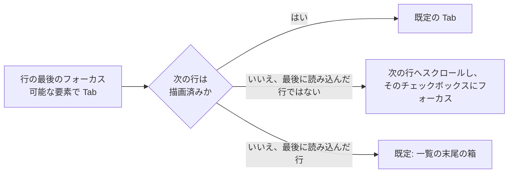

- **フォーカスのある行は描画したままにする**: 仮想化の描画範囲 (`rangeExtractor`) は、フォーカスのある行の番号を常に含む。画面の外にスクロールしても取り除かないので、フォーカスが `body` に落ちることはない。
- **端での Tab は次の行に渡る**: 一覧の包みの `keydown` で、Tab が行の最後のフォーカス可能な要素から来て、次の行が描画されていない (かつこれが最後に読み込んだ行ではない) とき、既定の動作を止め、一覧を次の行へスクロールし (`scrollToIndex`、帯の高さを引く。[Band](#band))、描画されたらフォーカスをその行のチェックボックスに移す。前の行が描画されていないときの、行の最初のフォーカス可能な要素からの Shift+Tab は、前の行へスクロールし、その最後のフォーカス可能な要素 (行の操作の入口) にフォーカスする。最後に読み込んだ行からの Tab と最初の行からの Shift+Tab は既定のままで、一覧を離れる (一覧の末尾の箱のボタンへ、または帯の見出しのチェックボックスへ)。
- **続きの読み込みとの関係**: 最後に読み込んだ行まで Tab で進むとその行が描画され、それが続きの読み込みを始める ([Loading more](#loading-more) のきっかけ)。届いた行はその後に追加されるので、ユーザーは Tab で進み続けられる。読み込みが遅すぎてフォーカスが一覧を離れたら、Shift+Tab で戻る。

## 色 {#colour}

- トークンは追加しない。選択した行の面は 10% の `accent` (`bg-accent/10`) である。`bg` の上に重なるので、名前 (`fg`) と件数と同義語 (`fg-muted`) のコントラストは `bg` の上でのものに近いままである。
- 次の組はすでに `pairs` にある: 有効な "Filter" とチップ (`accent-soft` の上の `link`)、選んだ統合の候補 (同じ組)、選択バーの文字 (`bg` の上の `fg`)、選択バーの "Reject…" と "Delete…" の文字 (`elevated` の上の `danger`)、ダイアログの失敗の行 (`elevated` の上の `danger`)、帯の文字 (`bg` の上の `fg-muted`)、続きの読み込みの失敗の箱と帯の古い一覧の箱 (ライブラリの `LoadMoreFailed` と同じく `danger-soft` の上の `danger`)、一覧変更の箱 (`elevated` の上の `fg`)。
- 仮のマークの `fg-subtle` はアイコンにだけ使う (031 と同じ)。

## アクセシビリティ {#accessibility}

親 Issue はスクリーンリーダーやコントラストの設計を求めていないので、この節は名前と役割だけを定める (014 と 031 と同じ範囲)。

| 要素 | 名前と役割 |
| --- | --- |
| 行のチェックボックス | アクセシブルな名前 "Select "{name}"" |
| 見出しのチェックボックス | "Select all 100 loaded tags" / "Clear selection"。混在の状態は `aria-checked="mixed"`。無効な理由は `aria-describedby` で |
| "Filter" | アクセシブルな名前 "Filter" / "Filter (N applied)"。ポップオーバーはラベル付きの `checkbox` を持つ |
| チップ | `ul` "Active filters" の中のボタン "Remove the filter "{name}"" |
| 並び順のメニュー | `aria-label` "Sort by: {kind}"。向きのボタンは [Words](#words) のとおり。コンパクトなボタンは "Sort" |
| タブ | `role="tablist"` "Tag lists"。`aria-selected` と `aria-controls` を持つ `role="tab"`。パネルは `aria-labelledby` を持つ `role="tabpanel"`。見出しの件数は `role="status"` |
| 一覧の末尾の状態 | 読み込み中: 一覧の包みの `aria-busy` と、`sr-only` の `role="status"` "Loading more tags…"。失敗の箱は `role="alert"`、一覧変更の箱は `role="status"`。帯の古い一覧の箱は `role="alert"` |
| 選択バー | `role="region"` "Selected tags"。件数は `role="status"` (`polite`)。上限を超えた理由は `title` と `aria-describedby` に |
| ダイアログ | タイトルは `ModalFrame` の `title`。数えている行は `aria-busy`、失敗の行は `role="alert"`。統合の入力は見える `label` を持ち、候補を読み込んでいる間は `Combobox` が `aria-busy` を設定する。候補の箱は `role="listbox"` (常に開いているので `aria-expanded="true"`) |
| 却下した名前のタブ | 一覧の `ul` "Rejected names"、続きを読み込んでいる間は `aria-busy`。行のボタンのアクセシブルな名前は "Allow "{name}" again" |
| "Actions" メニュー | 入口の `aria-label` は "Actions"。項目は文字を持つ |
