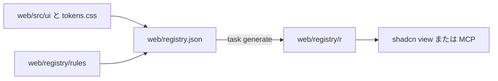

# 契約: vv レジストリとデザインシステムの検査 {#contract-the-vv-registry-and-the-design-system-checks}

正本: アイテムは `web/registry.json`、shadcn の設定は `web/components.json`、検査は `web/eslint.config.js` と `web/design-exceptions.js`。この契約は、エージェントとレビュアーが頼れることを定める。その背景の決定は [research.md R-3 から R-9](../research.md#r-3-the-registry-is-built-into-the-repository-and-read-from-disk) にある。

## 配置 {#layout}

図は各ファイルと、それぞれを作るものを示す。

| パス | 内容 | 手で編集するか |
| --- | --- | --- |
| `web/registry.json` | アイテムの一覧: 名前、種類、ファイル、依存関係、`docs` | する |
| `web/registry/rules/*.md` | 使い方の規則。層ごとに 1 ファイル | する |
| `web/src/ui/tokens.css` | すべてのトークン。`@theme` に置く | する |
| `web/registry/r/*.json` | `shadcn build` の出力。アイテムごとに 1 ファイルと `registry.json` | しない。`task generate` が書く |

## アイテム {#items}

| アイテム | 種類 | 運ぶもの |
| --- | --- | --- |
| `vv` | `registry:file` | 索引: すべてのアイテム名、その層、いつ使うかの 1 行 |
| `vv-theme` | `registry:file` | `tokens.css`。`cssVars` ではなくファイルとして運ぶので、読んでも CSS 変数を書かない |
| `vv-rules` | `registry:file` | `web/registry/rules/` |
| コンポーネントごとに 1 アイテム | `registry:ui` | `web/src/ui` のコンポーネントのファイル。`docs` は `components.md` 内の節を指す |
| ページパターンごとに 1 アイテム | `registry:block` | パターンのファイル。`docs` は `patterns.md` 内の節を指す |

アイテム名は、コンポーネントのファイル名をケバブケースにしたもの (`icon-button`) である。どのコンポーネントとパターンがあるかは、ここではなく層の PR が決める ([research.md R-1](../research.md#r-1-each-tier-is-confirmed-on-its-own-implementation-pr))。

## アイテムを読む {#reading-an-item}

`web/` から、次のどれもがファイルの内容と `docs` を含めてアイテムを返す (受け入れ条件 2)。

| ツール | 呼び出し |
| --- | --- |
| CLI | `npx shadcn view ./registry/r/<item>.json` |
| MCP | `./registry/r/<item>.json` を渡す `view_items_in_registries` |
| ファイルを直接読む | `web/registry/r/<item>.json` |

`shadcn search` と MCP の検索ツールはこのレジストリに届かない。`vv` アイテムが一覧である。

## 検査の規則 {#check-rules}

各規則は、示したメッセージで `task check` (`lint-web` または `test-web`) を失敗させる (受け入れ条件 4)。

| 失敗する対象 | 規則 | メッセージ |
| --- | --- | --- |
| `web/src/ui` の外の `<button>`、`<input>`、`<select>`、`<textarea>`、`<table>`、`<dialog>` | `no-restricted-syntax` | `Use the design-system component (web/registry/rules/components.md).` |
| `web/src/ui` の外の `role="button"` | `no-restricted-syntax` | `Use the design-system Button (web/registry/rules/components.md).` |
| `web/src/ui` の外で `style` に書いた固定値 (リテラル)。`style` は実行時にわかる値にだけ使う | `no-restricted-syntax` | `A fixed value in style bypasses the design-system scale. …` |
| `web/src/ui` の外での `radix-ui` または `@radix-ui/*` からのインポート | `no-restricted-syntax` | `Use the design-system components in web/src/ui/shadcn instead of Radix directly.` |
| `web/src/ui/shadcn` の外の `outline-none`、`outline-hidden`、または `focus`、`focus-visible`、`focus-within` のいずれかのバリアントの下にある `ring` か `outline` のクラス | `better-tailwindcss/no-restricted-classes` | `Keep the shared focus ring (web/src/index.css :focus-visible); never remove it or add your own (web/registry/rules/components.md, Focus).` |
| 任意値または任意のプロパティを持つクラス、または `(--var)` の省略記法 | `better-tailwindcss/no-restricted-classes` | `Arbitrary value outside the design-system scale (web/registry/rules/foundations.md).` |
| テーマが生成しないクラス | `better-tailwindcss/no-unknown-classes` | プラグイン自身のメッセージ |
| スケール外の数値の段階 (テーマのリセットまで) | `better-tailwindcss/no-restricted-classes` | `Step outside the design-system scale (web/registry/rules/foundations.md).` |
| `tokens.css` の外の生の色、既定のパレットのクラス、最小値を下回るコントラストの組 | `tokens.test.ts` | 変更なし |

任意のバリアント (`data-[state=open]:`、`has-[...]:`、`max-[49.5rem]:`) は通る。検査するのは最後の `:` の後の部分だけである。

## 例外リスト {#exception-list}

`web/design-exceptions.js` は配列を 1 つエクスポートする。エントリは、ファイルを指定した規則から除外するか、ファイル内で指定したクラスを許す。

| フィールド | 意味 |
| --- | --- |
| `file` | `web/src` の下のパス |
| `rules` | エントリが除外する規則 |
| `classes` | 省略可: 許す唯一のクラスを正規表現で挙げる。省略するとファイル全体が `rules` から除外される |
| `kind` | `migration` (そのファイルを移行する PR が削除する) または `special` (残る) |
| `reason` | `special` では必須: デザインシステムでその見た目を表せない理由 |

エントリが存在しないファイルを指すとき、`special` エントリに `reason` がないとき、そしてテーマのリセットが入った後は `migration` エントリが残っているとき、Vitest のテストが失敗する。
