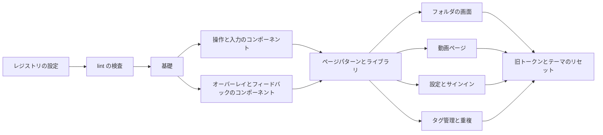

# 実装計画: shadcn/ui 上の vv デザインシステムを、AI による実装の参照先として使う {#implementation-plan-vv-design-system-on-shadcnui-used-as-the-reference-for-ai-implementation}

**ブランチ**: `feature/038-design-system` | **親 Issue**: #757

**入力**: 親 Issue。親 Issue がこの機能の仕様である。

## 概要 {#summary}

ライブラリ画面は、shadcn/ui 上に作る新しい vv デザインシステムの出発点である。デザインシステムは、基礎、使い方の規則を持つコンポーネント、ページパターンからなる。デザインシステムはリポジトリ内の shadcn レジストリとして置き、エージェントは `AGENTS.md` から shadcn スキルと MCP サーバーを通じてたどり着き、ESLint はデザインシステムの外のコードを失敗させ、すべての画面がデザインシステムに移る。

| 関心事 | 方針 |
| --- | --- |
| デザインシステムの決定 | `ui-design.md` がライブラリ画面から各層の方向を決める。基礎、コンポーネント、ページパターンはこの順に、それぞれ専用の PR で開発専用のショーケース上に作り、保守者が確認する ([R-1](research.md#r-1-each-tier-is-confirmed-on-its-own-implementation-pr)、[R-2](research.md#r-2-a-development-only-showcase-route-renders-each-tier)) |
| レジストリ | `web/registry.json`。`task generate` が `web/registry/r/` にビルドし、パスで読む ([R-3](research.md#r-3-the-registry-is-built-into-the-repository-and-read-from-disk)、[contracts/registry.md](contracts/registry.md)) |
| shadcn の設定 | Radix ベース、`@/` エイリアス、`cn` パッケージ、コンポーネントは `web/src/ui` に置いたまま ([R-4](research.md#r-4-shadcn-is-set-up-on-radix-with-a-path-alias-and-the-cn-package)) |
| トークン | shadcn の意味的な名前に vv 独自の役割を加え、16 進で `web/src/ui/tokens.css` に置く。ダークのみで、ライトの組はない ([R-5](research.md#r-5-tokens-use-shadcns-semantic-names-in-hex-in-their-own-file)) |
| 規則とエージェントの経路 | 層ごとの規則ファイルを `vv-rules` アイテムとして配布する。`AGENTS.md` → `design-system.md` → レジストリ。shadcn スキルをリポジトリに取り込み、プロジェクトに MCP サーバーを登録する ([R-6](research.md#r-6-usage-rules-are-markdown-files-shipped-as-registry-items)、[R-7](research.md#r-7-agents-reach-the-registry-through-agentsmd-a-vendored-skill-and-an-mcp-server)) |
| 検査と移行 | `eslint-plugin-better-tailwindcss` を使う ESLint と既存のトークンのテスト。例外リストは 1 つで、現在の違反箇所をすべて載せて始め、画面の PR ごとに縮む ([R-8](research.md#r-8-eslint-enforces-the-design-system-with-exceptions-in-one-list)、[R-9](research.md#r-9-screens-migrate-one-area-per-pr-behind-a-shrinking-exception-list)) |

Issue には `ui` ラベルがあるので、次は `design` を実行する。その `ui-design.md` は Issue の `UI品質` から次を決める。ライブラリ (管理) と動画ページ (視聴) の密度、文字、余白、角丸、影、色のスケールの方向、コンポーネントとページパターンの一覧、そして特別な見た目 (シークプレビュー、サムネイルの印、video.js のコントロール) のそれぞれを vv のコンポーネントにするか `special` の例外にするか。トークンの具体的な値は基礎の PR で選ぶ (R-1)。

## 技術的な前提 {#technical-context}

**正本の定義**:

| 項目 | 出典 |
| --- | --- |
| Web 層とそのディレクトリ | [ARCHITECTURE.md](../../ARCHITECTURE.md#web-layer) |
| 技術スタック | [docs/design-docs/tech-stack-selection.md](../../docs/design-docs/tech-stack-selection.md) |
| 現在の見た目の規則とトークンの検査 | [docs/design-docs/library-ui.md](../../docs/design-docs/library-ui.md)、[web/src/index.css](../../web/src/index.css)、[web/src/theme/tokens.test.ts](../../web/src/theme/tokens.test.ts) |
| lint の設定とインライン設定を禁じる規則 | [web/eslint.config.js](../../web/eslint.config.js) |
| 検査の入口 | [Taskfile.yml](../../Taskfile.yml) (`task check`、`task generate`、`task test-e2e`) |
| 依存関係の更新 | [docs/how-to/dependency-updates.md](../../docs/how-to/dependency-updates.md) |

**この機能固有の前提**:

- Web の新しい依存関係: `radix-ui` (8 つの `@radix-ui/react-*` パッケージを置き換える)、`class-variance-authority`、`cn`、`tw-animate-css`。devDependencies は `shadcn` 4.21 と `eslint-plugin-better-tailwindcss` 4.7。
- 新しい生成物: `web/registry/r/`。`task generate` が書き、`generate-check` が比較する。
- 新しいエージェントの設定: `.mcp.json`、`.codex/config.toml`、リポジトリに取り込んだ `.agents/skills/shadcn/`。
- サーバー、API、データの変更はない。`data-model.md` はなく、契約はレジストリとその検査だけである。

## 憲章の確認 {#constitution-check}

| ゲート | 判定 |
| --- | --- |
| 重要な制約はテストできる (core-beliefs.md) | 合格。素のコントロール、任意値、スケール外の段階、未知のクラスは `task check` を失敗させる (R-8)。例外リスト自体もテストする ([contracts/registry.md](contracts/registry.md#exception-list))。 |
| エージェント向けの案内は地図であり、写しではない (core-beliefs.md、AGENTS.md) | 合格。`AGENTS.md` には `design-system.md` への 1 行を足す。規則は `web/registry/rules/` に 1 か所だけある (R-6)。 |
| 生成ファイルは手で編集しない (AGENTS.md) | 合格。`web/registry/r/` を書くのは `task generate` だけで、ずれは `generate-check` が捕まえる。 |
| `eslint-disable` コメントを使わない (`noInlineConfig`、syudead/vv#443) | 合格。例外は `web/design-exceptions.js` のエントリで、それぞれ種類を持ち、`special` は理由も持つ。 |
| 途中のどの状態もビルドでき、検査に通る (Issue のエッジケース) | 合格。検査は例外の基準線とともに入り、旧トークン名は最後の単位までエイリアスとして残る (R-9)。 |
| ダーク配色のみ (要件 9、library-ui.md) | 合格。`tokens.css` の組は 1 つだけである。shadcn のライトの `:root` と `.dark` の分割は作らない。 |
| 画面の文言は i18n カタログに置く (i18n.md) | 合格。ショーケースとコンポーネントの文言は `t` を通す。i18n の ESLint 規則は変えない。 |
| 文書は振る舞いとともに変え、翻訳する (AGENTS.md) | 文書の各節には所有する単位が 1 つある ([文書の所有](#documentation-ownership))。各単位は変えたものを翻訳する。 |

フェーズ 1 の後に再確認した。違反はない。

## プロジェクトの構成 {#project-structure}

### 文書 (この機能) {#documentation-this-feature}

```text
specs/038-design-system/
├── plan.md
├── research.md          # R-1..R-9
├── quickstart.md        # Confirmation records, registry access, agent route, failing checks, operations
└── contracts/
    └── registry.md      # Registry layout and items, reading an item, check rules, exception list
```

`data-model.md` はない。この機能は何も保存しない。

### ソースコード {#source-code}

**影響する境界**:

| 境界 | 変わること |
| --- | --- |
| `web/src/ui` | コンポーネントを shadcn/ui 上に作り直す。`tokens.css` を追加する |
| `web/src/index.css` | `tokens.css` を読み込む。video.js とシークプレビューの CSS は残す |
| `web/src` の下の各画面のディレクトリ | コンポーネント、パターン、スケールに移る |
| `web/src/theme/tokens.test.ts` | 生の色の除外を `tokens.css` に絞る。組は新しい名前で検査する |
| `web/eslint.config.js`、`web/package.json`、`web/tsconfig.json`、`web/vite.config.ts` | 検査、依存関係、`@/` エイリアス |
| `scripts/generate`、`Taskfile.yml` | `task generate` でのレジストリのビルド |
| `AGENTS.md`、`.agents/skills/sdd-design`、`sdd-implement`、`issue-handoff/references/design.md` | UI の作業をデザインシステムへ案内する (R-7) |

**新しいパス**:

| パス | 目的 |
| --- | --- |
| `web/components.json` | shadcn の設定 |
| `web/registry.json`、`web/registry/rules/`、`web/registry/r/` | レジストリのソース、規則、ビルドしたアイテム |
| `web/src/ui/tokens.css` | トークン |
| `web/design-exceptions.js` | 例外リスト |
| `web/src/designSystem/` | 開発専用の `/design-system` ショーケース |
| `.agents/skills/shadcn/`、`.mcp.json`、`.codex/config.toml` | shadcn スキルと MCP サーバー |
| `docs/design-docs/design-system.md` | 設計文書。索引からリンクする |

**構成の判断**: [Web 層](../../ARCHITECTURE.md#web-layer)に従う。レジストリはリポジトリのルートではなく、説明するコードの隣の `web/` に置く (R-3)。

### 文書の所有 {#documentation-ownership}

各節には所有する単位が 1 つあり、その単位が振る舞いと同じ PR で節を書く。「shadcn/ui と vv レジストリを設定し、エージェントをそこへ案内する」が、下のすべての見出しを持つ `design-system.md` を作る。

| 文書 | 節 | 所有する単位 |
| --- | --- | --- |
| `docs/design-docs/design-system.md` と索引 | 作成、「Registry and agent route」 | shadcn/ui と vv レジストリを設定し、エージェントをそこへ案内する |
| `docs/design-docs/design-system.md` | 「Checks and exceptions」 | 素のコントロール、任意値、未知の Tailwind クラスで lint を失敗させる |
| `docs/design-docs/design-system.md` | 「Foundations」。`library-ui.md` の 1 節の役割の表をリンクに置き換える | デザインシステムの基礎を定め、ライブラリ画面に適用する |
| `docs/design-docs/design-system.md` | 「Components」 | 操作と入力のコンポーネントを shadcn/ui 上に作り直す |
| `docs/design-docs/design-system.md` | 「Page patterns」 | ページパターンを定め、ライブラリ画面をその上で仕上げる |
| `docs/design-docs/library-ui.md` | 1 節と 2 節を最終的なトークンファイルとテーマのリセットに合わせて更新する | 旧トークンを削除し、Tailwind をデザインシステムのスケールに限る |
| `ARCHITECTURE.md` | Web 層: `ui/` の行とトークンの場所 | shadcn/ui と vv レジストリを設定し、エージェントをそこへ案内する |
| `docs/design-docs/tech-stack-selection.md` | shadcn/ui と Radix | shadcn/ui と vv レジストリを設定し、エージェントをそこへ案内する |
| `docs/how-to/dependency-updates.md` | リポジトリに取り込んだ shadcn スキルの更新 | shadcn/ui と vv レジストリを設定し、エージェントをそこへ案内する |

## 実装作業 {#implementation-work}

図は各単位と、それぞれが何を待つかを示す。



各移行単位は、その画面の操作を PR 本文に挙げ、`main` と PR の上で確認する ([quickstart.md](quickstart.md) の手順 6)。

### shadcn/ui と vv レジストリを設定し、エージェントをそこへ案内する {#set-up-shadcnui-and-the-vv-registry-and-route-agents-to-it}

**範囲**: `components.json`、`@/` エイリアス、R-4 の依存関係 (`@radix-ui/react-*` の import と `lib/cn.ts` を見た目を変えずに置き換える)、`vv` 索引アイテムと現在の `web/src/ui` のコンポーネントを持つ `registry.json`、`task generate` でのレジストリのビルド、空の `/design-system` ルート ([R-2](research.md#r-2-a-development-only-showcase-route-renders-each-tier))、[R-7](research.md#r-7-agents-reach-the-registry-through-agentsmd-a-vendored-skill-and-an-mcp-server) のエージェントの経路、[文書の所有](#documentation-ownership)にあるこの単位の行。

**依存**: なし

**受け入れ**: `web/` で `npx shadcn view ./registry/r/vv.json` がアイテムを一覧する。`task check` と `task test-e2e` が画面の変化なしで通る。`task generate` を実行せずにコンポーネントを編集すると `generate-check` が失敗する。`/design-system` は `task dev` で開け、`task build` の出力には含まれない。

### 素のコントロール、任意値、未知の Tailwind クラスで lint を失敗させる {#fail-lint-on-raw-controls-arbitrary-values-and-unknown-tailwind-classes}

**範囲**: スケール外の段階の規則を除く [contracts/registry.md](contracts/registry.md#check-rules) の規則、現在の違反箇所をすべて `migration` エントリとして持つ `web/design-exceptions.js`、その Vitest テスト ([例外リスト](contracts/registry.md#exception-list))。

**依存**: shadcn/ui と vv レジストリを設定し、エージェントをそこへ案内する

**受け入れ**: `task check` が通る。リストにないファイルに `<button>` または `h-[3px]` を加えると、契約のメッセージで `task lint-web` が失敗する。存在しないファイルを指すエントリは `task test-web` を失敗させる。

### デザインシステムの基礎を定め、ライブラリ画面に適用する {#define-the-design-system-foundations-and-apply-them-to-the-library-screen}

**範囲**: R-5 の名前で色、文字、余白、角丸、影、動きのスケールを持つ `tokens.css`、エイリアスとしての旧名、生の色の除外を絞り、コントラストの組を移すこと ([R-5](research.md#r-5-tokens-use-shadcns-semantic-names-in-hex-in-their-own-file))。スケール外の段階の規則。`vv-theme`、`foundations.md` とその `vv-rules` のエントリ。ショーケースの基礎の節。新しいトークンとスケールに載ったライブラリ画面とシェル。

**依存**: 素のコントロール、任意値、未知の Tailwind クラスで lint を失敗させる

**受け入れ**: PR に `/design-system` の基礎とライブラリの 1440 px と 390 px のスクリーンショット、保守者の承認レビューがある。ライブラリ画面が目に見えて変わる。新しい名前でのすべてのコントラストの組を含めて `task check` が通る。

### 操作と入力のコンポーネントを shadcn/ui 上に作り直す {#rebuild-the-action-and-input-components-on-shadcnui}

**範囲**: `ui-design.md` の一覧にある操作と入力のコンポーネント (ボタン、テキストと選択の入力、トグル、スライダー、コンボボックス、チップ) を基礎の上に shadcn/ui から作り直す。それぞれをレジストリのアイテムにし、`components.md` の節を持たせ、すべての状態をショーケースに載せ、ライブラリ画面で使う。

**依存**: デザインシステムの基礎を定め、ライブラリ画面に適用する

**受け入れ**: ショーケースとライブラリの 1440 px と 390 px のスクリーンショットと、保守者の承認レビュー。`npx shadcn view ./registry/r/button.json` が、節を指す `docs` 行を出力する。`task check` と `task test-e2e` が通る。

### オーバーレイとフィードバックのコンポーネントを shadcn/ui 上に作り直す {#rebuild-the-overlay-and-feedback-components-on-shadcnui}

**範囲**: `ui-design.md` の一覧にあるオーバーレイとフィードバックのコンポーネント (ダイアログ、ポップオーバー、メニュー、ツールチップ、タブ、トースト、スケルトン、バッジ、一覧がコンポーネントとして残す vv 固有の印)。「操作と入力のコンポーネントを shadcn/ui 上に作り直す」と同じように作り、ショーケースに載せる。

**依存**: デザインシステムの基礎を定め、ライブラリ画面に適用する

**受け入れ**: これらのアイテムについて、操作と入力のコンポーネントと同じ。両方のコンポーネントの PR が承認されると、コンポーネントの層は確認済みになる。

### ページパターンを定め、ライブラリ画面をその上で仕上げる {#define-the-page-patterns-and-finish-the-library-screen-on-them}

**範囲**: `ui-design.md` の一覧にあるページパターン (リスト、ツールバー、空、読み込み中、エラーの状態、ダイアログ、フォーム) を、`patterns.md` とともに `registry:block` アイテムとし、ショーケースに載せる。ライブラリ画面、シェル、`web/src/videoList` をパターンから組み立て、それらの `migration` エントリを削除する。

**依存**: 操作と入力のコンポーネントを shadcn/ui 上に作り直す、オーバーレイとフィードバックのコンポーネントを shadcn/ui 上に作り直す

**受け入れ**: ショーケースとライブラリの 1440 px と 390 px のスクリーンショットと、保守者の承認レビュー。ライブラリの操作リストが通る。`library/`、`shell/`、`videoList/` の `migration` エントリが残っていない。`task check` と `task test-e2e` が通る。

### フォルダの画面をデザインシステムに移す {#move-the-folder-screens-onto-the-design-system}

**範囲**: `web/src/folders` をレジストリのコンポーネントとパターンから組み立て、その `migration` エントリを削除する。

**依存**: ページパターンを定め、ライブラリ画面をその上で仕上げる

**受け入れ**: フォルダの画面の 1440 px と 390 px のスクリーンショット。フォルダの操作リストが通る。`folders/` の `migration` エントリが残っていない。`task check` と `task test-e2e` が通る。

### 動画ページをデザインシステムに移す {#move-the-video-page-onto-the-design-system}

**範囲**: `web/src/player` をレジストリから組み立て、`ui-design.md` が定める視聴の密度を保つ。シークプレビュー、サムネイルの印、video.js のコントロールは、`ui-design.md` の判断どおりコンポーネントまたは `special` エントリになる。

**依存**: ページパターンを定め、ライブラリ画面をその上で仕上げる

**受け入れ**: 再生中と一時停止中の動画ページの 1440 px と 390 px のスクリーンショット。動画ページの操作リストが通る。`player/` には `special` エントリだけがあり、それぞれ理由を持つ。`task check` と `task test-e2e` が通る。

### 設定、サインイン、セットアップの画面をデザインシステムに移す {#move-the-settings-sign-in-and-setup-screens-onto-the-design-system}

**範囲**: `web/src/settings` と `web/src/auth` をレジストリから組み立て、それらの `migration` エントリを削除する。

**依存**: ページパターンを定め、ライブラリ画面をその上で仕上げる

**受け入れ**: 設定、サインイン、セットアップの 1440 px と 390 px のスクリーンショット。設定の操作リストが通る。`settings/` と `auth/` の `migration` エントリが残っていない。`task check` と `task test-e2e` が通る。

### タグ管理と重複の画面をデザインシステムに移す {#move-the-tag-admin-and-duplicates-screens-onto-the-design-system}

**範囲**: `web/src/tags` と `web/src/versions` をレジストリから組み立て、それらの `migration` エントリを削除する。

**依存**: ページパターンを定め、ライブラリ画面をその上で仕上げる

**受け入れ**: タグ管理と重複の 1440 px と 390 px のスクリーンショット。タグ管理の操作リストが通る。`tags/` と `versions/` の `migration` エントリが残っていない。`task check` と `task test-e2e` が通る。

### 旧トークンを削除し、Tailwind をデザインシステムのスケールに限る {#remove-the-legacy-tokens-and-limit-tailwind-to-the-design-system-scale}

**範囲**: 旧トークンのエイリアスの削除、テーマの名前空間のリセット ([R-8](research.md#r-8-eslint-enforces-the-design-system-with-exceptions-in-one-list))、スケール外の段階の規則の削除、例外のテストを `migration` エントリを拒むように切り替えること、[文書の所有](#documentation-ownership)にある `library-ui.md` の行。

**依存**: フォルダの画面をデザインシステムに移す、動画ページをデザインシステムに移す、設定、サインイン、セットアップの画面をデザインシステムに移す、タグ管理と重複の画面をデザインシステムに移す

**受け入れ**: `web/design-exceptions.js` には `special` エントリだけがある。画面で `p-7` (またはスケール外の任意の段階) を使うと、未知のクラスとして `task lint-web` が失敗する。[quickstart.md](quickstart.md) のすべての手順が通る。
