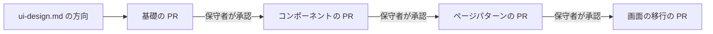
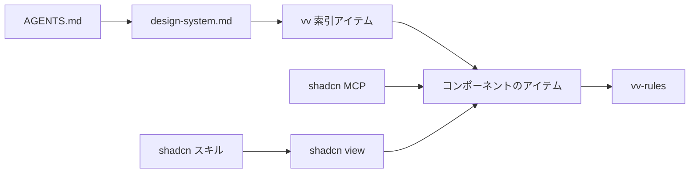

# 調査: shadcn/ui 上の vv デザインシステム {#research-vv-design-system-on-shadcnui}

親 Issue: #757。引き継ぐ決定:

| 項目 | 正本 |
| --- | --- |
| 技術スタック (React、Vite、Tailwind CSS) | [docs/design-docs/tech-stack-selection.md](../../docs/design-docs/tech-stack-selection.md) |
| Web 層のディレクトリ | [ARCHITECTURE.md](../../ARCHITECTURE.md#web-layer) |
| トークンの場所、生の色の走査、コントラストの組 | [docs/design-docs/library-ui.md](../../docs/design-docs/library-ui.md#1-visual-values-in-one-css-location-with-contrast-guaranteed-by-tests) |
| ダーク配色のみ | [docs/design-docs/library-ui.md](../../docs/design-docs/library-ui.md#2-dark-scheme-only-without-a-lightdark-switch) |
| ESLint が強制する画面の文言の規則 | [docs/design-docs/i18n.md](../../docs/design-docs/i18n.md) |
| 依存関係の更新 | [docs/how-to/dependency-updates.md](../../docs/how-to/dependency-updates.md) |

このファイルは、この機能が加える決定だけを記録する。`shadcn` CLI についての事実はバージョン 4.21.1 のものである。

## R-1: 各層はそれぞれ専用の実装 PR で確認する {#r-1-each-tier-is-confirmed-on-its-own-implementation-pr}

**決定**: `ui-design.md` がライブラリ画面から 3 つの層すべての方向とレビューの基準を決める。その後、各層 (基礎、コンポーネント、ページパターン) をこの順に専用の実装 PR で作り、その層をショーケース (R-2) に載せた PR への保守者の承認レビューを確認の記録とする (受け入れ条件 1)。

図は順序と、保守者が確認する場所を示す。

| 案 | 保守者が見るもの | 判定 |
| --- | --- | --- |
| **デザインの方向の後、層ごとに 1 つの PR** | アプリで描画された各層を、次の層がその上に作られる前に見る | 採用 |
| 3 つの層すべてを `ui-design.md` だけで決める | 文章とトークン名だけ。コンポーネントは、その下の基礎を見る前に設計される | 不採用: レビューが層ごとではなく 1 回になる (要件 3) |
| 層ごとに 1 回、計 3 回の `design` 実行 | 層ごとの文章 | 不採用: ステージの選択は `design` を 1 回実行する。残りの 2 回は、保守者が毎回改訂を指定する必要がある |

**根拠**: トークンの値は CSS にだけ置く ([design.md](../../.agents/skills/issue-handoff/references/design.md#sources-that-already-decide-things))。そのため具体的な値は CSS を変える場所で選ぶ。保守者が変更を求めた層の PR はマージ前に変更し、次の層はマージされた層に依存する。

## R-2: 開発専用のショーケースのルートが各層を描画する {#r-2-a-development-only-showcase-route-renders-each-tier}

**決定**: `/design-system` は `vite dev` (`import.meta.env.DEV`) の下でだけ存在し、すべてのトークン、レジストリのコンポーネント、ページパターンをその状態とともに描画する。各層の PR はその節を追加し、その節の 1440 px と 390 px の Playwright のスクリーンショットを添える。

| 案 | 判定 |
| --- | --- |
| **SPA 内の開発専用ルート** | 採用 |
| Storybook | 不採用: 2 つ目のビルドツールチェーンと、Tailwind 4 と `@/` エイリアスに合わせ続ける専用の Vite 設定が要る |
| ライブラリ画面のスクリーンショットだけ | 不採用: その画面がたまたま使うコンポーネントを、たまたまその状態で見せるだけになる |
| 配布するアプリ内の所有者専用ルート | 不採用: 製品に画面を加える (範囲外: 機能を追加しない) |

## R-3: レジストリはリポジトリ内にビルドし、ディスクから読む {#r-3-the-registry-is-built-into-the-repository-and-read-from-disk}

**決定**: `web/registry.json` がアイテムを宣言し、`shadcn build` がそれらを、バージョン管理する `web/registry/r/` に書く。`task generate` がビルドを実行するので、ビルドした JSON が古いと `task check` (`generate-check`) が失敗する。エージェントはアイテムをパスで読む ([contracts/registry.md](contracts/registry.md#reading-an-item))。

| 案 | `shadcn view` / MCP の view | `shadcn search` / MCP の search | 判定 |
| --- | --- | --- | --- |
| **ディスク上のビルドした JSON をパスで読む** | `.json` のパスで動く | 使えない。代わりに `vv` 索引アイテムがすべてのアイテムを挙げる | 採用 |
| localhost の URL 上の `@vv` 名前空間 | サーバーが動いている間は動く | サーバーが動いている間は動く | 不採用: すべてのエージェントのセッションが先にサーバーを起動する必要があり、`web/public` の下の出力はバイナリに含まれて配布される |
| GitHub のアドレス `syudead/vv/<item>` | プッシュした ref で動く | プッシュした ref で動く | 不採用: リポジトリのルートに `registry.json` が要り、プッシュしたコミットしか見えないので、作業ブランチで追加したコンポーネントはそれを使うエージェントから見えない |
| `registries` での `file://` または相対パス | 失敗する (undici は `file://` を扱えず、相対パスには `ui.shadcn.com` が前置される) | 失敗する | 不採用: 4.21.1 では動かない |

## R-4: shadcn は Radix 上に、パスのエイリアスと cn パッケージで設定する {#r-4-shadcn-is-set-up-on-radix-with-a-path-alias-and-the-cn-package}

**決定**: `web/components.json` は `radix` ベース、`aliases.ui` に `@/ui` (既存の `web/src/ui`)、`tailwind.css` に `src/index.css` を使う。`@/*` のパスは `tsconfig.json` と `vite.config.ts` で `web/src/*` に対応させる。依存関係は radix ベースが宣言するもの、つまり `radix-ui` (8 つの `@radix-ui/react-*` パッケージを置き換える)、`class-variance-authority`、`cn`、`tw-animate-css` で、CLI のバージョンを固定して Renovate が更新するように `shadcn` を devDependency にする。

| 選択 | 採用しなかった案 | 理由 |
| --- | --- | --- |
| `radix` ベース | `base` (Base UI)、`aria` | 既存の 8 つのプリミティブはすでに Radix である。ほかのベースはそのすべてを書き直す |
| `@/*` パスエイリアス | `#/*` パッケージインポート | どちらも `shadcn init` を満たす。上流のアイテム、shadcn スキルとその規則は `@/` で書かれている |
| `web/src/lib/cn.ts` を置き換える `cn` パッケージ | 手書きの `cn` を残す | 文字列をつなぐだけなので、呼び出し側の `className` がバリアントのクラスを上書きできない。shadcn のコンポーネントはその統合に頼っている |
| コンポーネントは `web/src/ui` に置いたまま | `web/src/components/ui` に移す | `aliases.ui` は任意のパスを受け付け、[ARCHITECTURE.md](../../ARCHITECTURE.md#web-layer) はすでにプリミティブの場所として `ui/` を挙げている |

## R-5: トークンは shadcn の意味的な名前を使い、16 進で、専用のファイルに置く {#r-5-tokens-use-shadcns-semantic-names-in-hex-in-their-own-file}

**決定**: 基礎の層は色のトークンを shadcn の意味的な名前 (`background`、`foreground`、`card`、`popover`、`primary`、`secondary`、`muted`、`accent`、`destructive`、`border`、`input`、`ring` とその `-foreground` の組) と、shadcn にない vv 独自の役割 (`navbar`、`warning`、`success`、`favorite`、`overlay`) で定める。すべてのトークンは、文字、余白、角丸、影、動きのスケールとともに、`index.css` が読み込む新しい `web/src/ui/tokens.css` の `@theme` に置く。色の値は 6 桁の 16 進のままにする。生の色の走査は `tokens.css` だけを除外する。

| 選択 | 採用しなかった案 | 理由 |
| --- | --- | --- |
| shadcn の意味的な名前 | vv の名前 (`surface`、`fg-muted`、`accent-hover`) を残す | 上流のコンポーネントのコードと shadcn スキルのスタイルの規則は意味的な名前を使う。vv の名前のままだと、追加するコンポーネントのたびに手で置き換えることになる |
| 16 進の値 | shadcn の既定どおり oklch | コントラストのテストは `#rrggbb` しか解析しない。CLI は 16 進をそのまま書く |
| 別の `tokens.css` | トークンを `index.css` に残す | `shadcn add` は上流のテーマやスタイルの CSS 変数を `tailwind.css` のファイルに書き、同じ名前の変数を上書きする。トークンが別の場所にあり、走査が `tokens.css` だけを除外していれば、そうした書き込みは `index.css` に入って検査を失敗させる (Issue のエッジケース: 上流の更新) |

**根拠**: vv の名前 (`surface`、`accent`、...) は、最後の画面の移行が入るまで新しいトークンの `var()` エイリアスとして定義したまま残す。そのため移行していない画面は見た目を保つ ([R-9](#r-9-screens-migrate-one-area-per-pr-behind-a-shrinking-exception-list))。`library-ui.md` はトークンを CSS に置く理由を残し、トークンの役割はデザインシステムの文書に移る。

## R-6: 使い方の規則は Markdown ファイルで、レジストリのアイテムとして配布する {#r-6-usage-rules-are-markdown-files-shipped-as-registry-items}

**決定**: エージェントが従う規則は、層ごとに `web/registry/rules/` (`foundations.md`、`components.md`、`patterns.md`) に 1 回だけ書き、`registry:file` アイテム `vv-rules` として配布する。各コンポーネントとパターンのアイテムの `docs` 文字列は、それらのファイル内の節を指す。`docs/design-docs/design-system.md` はデザインシステムの決定と理由を記録し、規則は繰り返さずにリンクする。

| 案 | 判定 |
| --- | --- |
| **レジストリのアイテムとして配布する規則ファイル** | 採用 |
| 規則を `docs/design-docs/` にだけ置く | 不採用: shadcn CLI や MCP から取得できない (要件 4) |
| 規則を各アイテムの `docs` 文字列にだけ置く | 不採用: インストール時に表示されるただの文字列である。ページパターンと基礎には、規則を載せる専用のアイテムがない |
| `.agents/skills/` の下のエージェントスキル | 不採用: レジストリの隣にできる 2 つ目の写しで、自分たちのエージェントは読むが shadcn を通しては読まれない |

## R-7: エージェントは AGENTS.md、リポジトリに取り込んだスキル、MCP サーバーを通じてレジストリにたどり着く {#r-7-agents-reach-the-registry-through-agentsmd-a-vendored-skill-and-an-mcp-server}

**決定**: `AGENTS.md` に、UI の作業を `docs/design-docs/design-system.md` へ案内する 1 行を足す。この文書はレジストリ、`vv` 索引アイテム、規則を挙げる。公式の shadcn スキルは固定したコミットで `.agents/skills/shadcn/` に取り込む (`.claude/skills` はそこへリンクする)。ローカルの変更は 1 つだけで、すべての `npx shadcn@latest` を `npm --prefix web exec shadcn --` に置き換える。これで、スキルに従うエージェントは固定した devDependency を実行する (R-4)。取り込んだスキルが `shadcn@` を含むと Vitest のテストが失敗する。同じく固定した devDependency から実行する shadcn MCP サーバーを、Claude 向けには `.mcp.json` に、Codex 向けには `.codex/config.toml` に登録する。`sdd-design`、`sdd-implement`、`design` のリファレンスは UI の作業をデザインシステムへ送り、`ui-design.md` がレジストリのコンポーネントとパターンを組み合わせるように指示し、足りないものは先にデザインシステムに追加させる (要件 6)。

図は、`AGENTS.md` から始めたエージェントがアイテムにたどり着く道を示す。

| 案 | 判定 |
| --- | --- |
| **固定したコミットでリポジトリに取り込み、固定した CLI を呼ぶスキル** | 採用 |
| 取り込んだスキルを変更しない | 不採用: スキルは `npx shadcn@latest` を実行する。これはネットワークを必要とし、上流が最後に公開したスキーマでレジストリを読む |
| セッション開始時の `npx skills add shadcn/ui` | 不採用: 毎回のセッションでネットワークが要り、レビューなしに上流に追従する |
| shadcn スキルを使わず、自分たちの規則だけ | 不採用: 要件 5 がスキルを指定している |

## R-8: ESLint がデザインシステムを強制し、例外は 1 つのリストに置く {#r-8-eslint-enforces-the-design-system-with-exceptions-in-one-list}

**決定**: `eslint-plugin-better-tailwindcss` は `src/index.css` を Tailwind のエントリポイントとして読む。`no-unknown-classes` はテーマが生成しないクラスで失敗し、`no-restricted-classes` は任意値、任意のプロパティ、`(--var)` の省略記法で失敗し、任意のバリアント (`data-[state=open]:`、`has-[...]:`) は許す。`no-restricted-syntax` は `web/src/ui` の外の `<button>`、`<input>`、`<select>`、`<textarea>` で失敗する。生の色の走査とコントラストの組は `tokens.test.ts` に残す。`noInlineConfig` がコメントを禁じているので、例外はファイルとクラスのエントリとしてそれぞれ理由を付け、1 つのファイル `web/design-exceptions.js` に置く ([contracts/registry.md](contracts/registry.md#check-rules))。

| 案 | 判定 |
| --- | --- |
| **`eslint-plugin-better-tailwindcss` 4.7** | 採用: Tailwind 4 自体でクラスを解決し、`className` と `cn()`/`cva()` の引数を読み、許可リストを受け付ける |
| `eslint-plugin-tailwindcss` 4.4 | 不採用: `no-arbitrary-value` に許可リストがなく、例外ごとに別の設定ブロックになる |
| Vitest での正規表現の走査 | 不採用: テーマがどのクラスを生成するかを判別できず、`cn()` の式で組み立てるクラスを見落とす |

**根拠**: スケール外の検査はテーマ自体から来る。最後の単位が Tailwind の開いた名前空間 (`--spacing: initial`、`--text-*: initial`、基礎の層がスケールを定めるほかの名前空間) をリセットするので、スケールの段階だけが存在し、それ以外は `no-unknown-classes` で失敗する。それまでは、スケールから作った `no-restricted-classes` のパターンが、例外リストの外のファイルでスケール外の数値の段階を失敗させる。

## R-9: 画面は縮んでいく例外リストの陰で、PR ごとに 1 領域ずつ移行する {#r-9-screens-migrate-one-area-per-pr-behind-a-shrinking-exception-list}

**決定**: 検査を先に入れ、今日それに違反するすべてのファイルを `migration` の例外として挙げる。各移行 PR は 1 つの画面領域をデザインシステムに移し、そのファイルのエントリを削除する。最後の単位は旧トークンのエイリアスを削除し、テーマの名前空間をリセットし (R-8)、理由を持つ `special` 種別のエントリだけを残す (Issue のエッジケース: 特別な見た目)。

| 案 | 判定 |
| --- | --- |
| **検査を先に入れ、例外リストを縮める** | 採用: 最初の PR から新しい違反ファイルは失敗し、途中のどの状態もビルドでき、検査に通る |
| 検査を最後に入れる | 不採用: 移行中に新しい違反が入り、最後になって初めて見つかる |
| すべての画面を移行する 1 つの PR | 不採用: 見た目のレビューには大きすぎ、受け入れ条件 6 の操作の確認は 5 つの画面にわたる |
