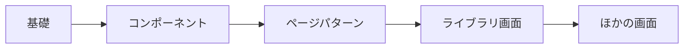
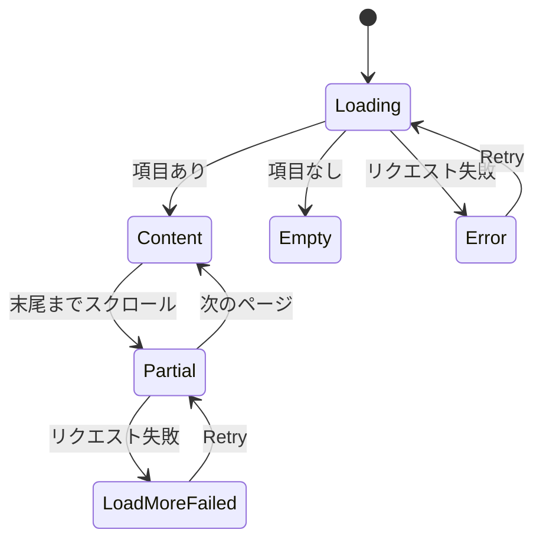

# UI 設計: shadcn/ui の上に作る vv デザインシステム {#ui-design-vv-design-system-on-shadcnui}

出典: [plan.md](plan.md)、[research.md](research.md)、[library-ui.md](../../docs/design-docs/library-ui.md) (レイアウト、密度、画面ごとの振る舞い。この設計はこれらを保つ)、[VVMDM ブランド](../022-vvmdm-brand/ui-design.md) (暗い面、シアン)、[web/src/index.css](../../web/src/index.css) の `@theme` ブロック (現在のトークン名)。

この文書は各層の方向を決める。基礎、コンポーネント、ページパターンの PR はこれに沿って具体的な値を選び、保守者は `/design-system` ショーケースで各層を確認する ([R-1](research.md#r-1-each-tier-is-confirmed-on-its-own-implementation-pr))。

## この形にする理由 {#why-this-shape}

vv は自分らしさ、つまり暗い中間色の面と、操作を示す唯一の色としてのシアンを保ち、欠けているものを得る。閉じたスケール、役割ごとに 1 つのコンポーネント、画面の種類ごとに名前のあるパターンだ。面は shadcn の平らな中間色のスタイル (細い枠線、グラデーションなし、影は浮かぶ層だけ) に移る。レジストリのコンポーネントはそのスタイルで届き、そうすればすべての画面がコンポーネントごとの作り直しなしにそれを共有するからだ。採用しなかった案: 白い主ボタンを持つ shadcn の既定の見た目。シアンがブランドの操作の色だからだ。現在の見た目をそのまま保つ案。Issue がそれを出発点にすぎないとしているからだ。

図は、各層が何の上に作られ、どの画面が最初に使うかを示す。

## 基礎 {#foundations}

### 色の役割 {#colour-roles}

どの色もこれらの役割のどれかだ。基礎の PR が `tokens.css` に値を置く。右の列は各役割が出発点にする現在のトークンを示し、最初の描画が vv だとわかるようにする。`overlay` を除き、どの役割も不透明だ。

| トークン | 役割 | 出発点 |
| --- | --- | --- |
| `background` / `foreground` | ページと本文の文字 | `bg` / `fg` |
| `navbar` | トップバーとサイドバー | `navbar` |
| `card` / `card-foreground` | カード、セクション、リストの行 | `surface` / `fg` |
| `popover` / `popover-foreground` | メニュー、ポップオーバー、ダイアログ、トースト | `elevated` / `fg` |
| `muted` / `muted-foreground` | 入力欄の塗りと補助の文字 | `field` / `fg-muted` |
| `secondary` / `secondary-foreground` | 副ボタン、チップ | `surface-hover` / `fg` |
| `accent` / `accent-foreground` | ホバーと強調したメニューの行 (shadcn の意味であり、ブランドの色ではない) | `surface` と `hover-wash` を不透明に混ぜた色 / `fg` |
| `primary` / `primary-foreground` | 領域ごとに 1 つの主操作、選択状態、進捗 | `accent` / `accent-fg` |
| `primary-soft` | 選択した行と有効な絞り込みチップ | `accent-soft` |
| `border`、`input`、`ring` | 区切り線、コントロールの枠線、キーボードのフォーカス | `border`、`control-border`、`link` |
| `destructive`、`warning`、`success`。それぞれ `-foreground` と `-soft` を持つ | 危険、注意、完了。常に文字とアイコンを伴う | `danger*`、`warning*`、`success*` |
| `favorite` | お気に入りのハートだけ | `favorite` |
| `overlay` | ダイアログの背後とサムネイルの上 | `overlay` |

`fg-subtle` は `muted-foreground` に、`border-strong` は `input` にまとめる。主と補助を分けるには、文字の灰色 2 つと線の灰色 2 つで足りる。

### 文字 {#type}

| 段階 | 用途 |
| --- | --- |
| `text-2xs` | サムネイル上の文字: 長さ、シーク時刻、画像に重ねるバッジ |
| `text-xs` | メタデータ、件数、チップのラベル、ヘルプの文 |
| `text-sm` | ライブラリの本文、コントロール、メニュー、カードのタイトル |
| `text-base` | 動画ページの本文、ダイアログの本文 |
| `text-lg` | セクションの見出し、ダイアログのタイトル |
| `text-xl` | ページのタイトル、動画のタイトル |

太さは `font-normal`、`font-medium` (コントロール、ラベル、カードのタイトル)、`font-semibold` (見出し) だ。`text-2xl` 以上、`font-bold`、サムネイル上のピクセル指定のサイズ (`text-[10px]`、`text-[11px]`) はスケールから外れる。

### 余白とサイズ {#spacing-and-sizes}

余白とサイズは 4px グリッドの 1 つのスケールを共有する。段階は `0`、`px`、`0.5`、`1`、`1.5`、`2`、`3`、`4`、`5`、`6`、`8`、`10`、`12`、`16` で、これにレイアウトの定数 (トップバー、サイドバー、カードの幅、シークプレビュー) が名前のある段階として加わる。現在の `2.5`、`9`、`14`、`15` とピクセル値 (`h-[3px]`、`px-[7px]`) は、最も近い段階かコンポーネントに移る。

| 役割 | ライブラリ | 動画ページ |
| --- | --- | --- |
| コントロールの高さ | `h-8` | `h-9`。主操作は `h-10` |
| コントロール間の間隔 | `gap-2` | `gap-3` |
| カード間の間隔 | `gap-3` | `gap-4` |
| セクションの内側の余白 | `p-3` | `p-4`–`p-6` |
| アイコン | `size-4` | `size-4`。プレーヤーでは `size-5` |

### 角丸、影、動き {#radius-shadow-and-motion}

| スケール | 段階 |
| --- | --- |
| 角丸 | `rounded-sm` (チェックボックス、バッジ)、`rounded-md` (コントロール、カード、サムネイル)、`rounded-lg` (ポップオーバー、ダイアログ)、`rounded-full` (ピル、スクラブの点)。`rounded-xl` はなくなる |
| 影 | 静止した面にはなし。ホバーしたカードに `shadow-card-hover`、浮かぶ層に `shadow-elevated`、画像に重ねる印に `drop-shadow-mark` |
| 動き | `fade-in`、`pop-in`、`slide-up` は残す。新しいアニメーションは足さない。動きを減らす設定では今と同じくこれらを止める |

## コンポーネント {#components}

各コンポーネントは radix ベースの shadcn/ui のコンポーネントで、上のトークンだけで見た目を変え、右の列の vv のコンポーネントまたは素の要素を置き換える。2 つのコンポーネントの PR は表のとおりに分かれる。

| PR | コンポーネント | 置き換えるもの |
| --- | --- | --- |
| 操作と入力 | `Button` (`default` = 主、`secondary`、`outline`、`ghost`、`destructive`、`link`。サイズは `sm`、`default`、`lg`、`icon-sm`、`icon`) | `ui/Button`、`ui/IconButton`、素の `<button>` |
| 操作と入力 | `Input`、`Textarea`、`Label`、`Field` | 認証、設定、タグ、タイトル編集の素の `<input>` と `<textarea>` |
| 操作と入力 | `Select`、`RadioGroup` | 素の `<select>`、並び順のラジオの列 |
| 操作と入力 | `Checkbox`、`Switch` | `ui/Checkbox`、公開範囲のスイッチ |
| 操作と入力 | `ToggleGroup`、`Toggle` | `ui/SegmentedControl`、`ui/FilterChip` |
| 操作と入力 | `Slider` | ズームのスライダー |
| 操作と入力 | `Combobox` (`Popover` の中の `Command`) | `ui/Combobox` |
| オーバーレイとフィードバック | `Dialog`、`AlertDialog` | `ui/ModalFrame`。削除と却下の確認には `AlertDialog` |
| オーバーレイとフィードバック | `Popover`、`DropdownMenu`、`Tooltip`、`Tabs` | `ui/Popover`、`ui/Menu`、`ui/Tooltip`、`ui/Tabs` |
| オーバーレイとフィードバック | `Sonner` (新しい依存 `sonner`) | `ui/Toast` |
| オーバーレイとフィードバック | `Badge` | `ui/Chip`、タグのチップ、件数のバッジ |
| オーバーレイとフィードバック | `Skeleton`、`Progress`、`Spinner` | `ui/Skeleton`、スキャンと視聴の進捗バー |
| オーバーレイとフィードバック | `Alert`、`Empty` | 停止の警告、自動再生の通知、その場のエラー、空の状態のブロック |
| オーバーレイとフィードバック | `Separator`、`Kbd`、`Breadcrumb` | 区切り線、検索構文のキー、フォルダのパンくず |
| オーバーレイとフィードバック | `Sidebar` | `shell/Sidebar`。その expanded、icon、offcanvas の状態が vv の展開、レール、ドロワーにあたる |

vv 独自のコンポーネント。独自の規則を持つレジストリのアイテムだ。

| コンポーネント | 何か |
| --- | --- |
| `VideoThumbnail` | 長さのバッジ、進捗の縁、お気に入りと選択の印を持つサムネイル。動画、グループ、フォルダのカードとリストの行が使う |
| `FavoriteToggle` | 印と切り替えを 1 つにしたハート ([library-ui.md、Favorite mark](../../docs/design-docs/library-ui.md#favorite-mark)) |
| `TentativeMark` | 仮のタグの印 |
| `ScrubPreview`、`ThumbnailBackdrop`、`BrandHomeLink` | 今と同じで、新しいトークンの上に作る |

2 つの見た目は `special` の例外として残り、それぞれの理由を `web/design-exceptions.js` に書く。`index.css` の CSS でサードパーティの DOM にスタイルを当てる video.js のコントロールバーのスキンと、video.js の進捗バーの上に出るプレーヤーのシークプレビュー (`.vv-seek-preview`) で、後者の位置はポインターとフレームの大きさから計算する。[032](../032-card-scrub-preview/ui-design.md) のカードのスクラブである `ScrubPreview` は別の要素で、例外を持たない。

## ページパターン {#page-patterns}

各画面はこれらのパターンのどれかで、上のコンポーネントで作る。ページパターンの PR はこれらを `registry:block` アイテムとして加え、ライブラリをリストのパターンの上に作る。

| パターン | 部品 | 画面 |
| --- | --- | --- |
| リストのページ | トップバーのツールバー、件数の行、グリッドまたはリストの表示、選択バー | ライブラリ、フォルダの中身、検索結果、重複 |
| ツールバー | 検索、絞り込みのポップオーバー、表示の切り替え、ズーム、並び順。広い幅未満では `View and sort` にまとまる | ライブラリ、フォルダ |
| 管理の表 | 検索と操作を持つ帯、タブ、チェックの列を持つ並べ替えられる行、一括操作 | タグ管理 |
| 設定のページ | タイトルのあるセクション。各行はラベル、説明、コントロール | 設定 |
| 詳細のページ | 見出しの帯、プレーヤーの区画、事実の行を持つ情報の区画 | 動画ページ |
| 中央のフォーム | タイトル、入力欄、主ボタン 1 つを持つカード 1 枚 | サインイン、セットアップ |
| フォームのダイアログ | タイトル、入力欄、`Cancel` と主操作 1 つ。幅は最大 32rem | タグの作成、統合、同義語、まとまり |
| 確認のダイアログ | `AlertDialog`: 何が起きるか、`Cancel`、動詞で名付けた破壊的な操作 | タグの削除と却下 |

### 状態 {#states}

どのリスト、表、セクションも、同じブロックからこれらのどれかを表示する。

| 状態 | 画面が表示するもの |
| --- | --- |
| 読み込み中 | 最終的なレイアウトの `Skeleton` の形。ページ全体にスピナーを重ねない |
| 空 | `Empty`: アイコン、理由を言う 1 行、そして見る人が実行できるときは、それを埋める操作 |
| エラー | `destructive` の `Alert`: 何が失敗したか、そして再試行が役立つときは `Retry` |
| 一部 (続きを読み込み中) | 内容と、その末尾の `Spinner` の行 |
| 続きの読み込みに失敗 | 内容を保ち、その末尾に `Retry` 付きの `Alert` の行。再試行は同じページをもう一度要求する |

図は、リストがこれらの間をどう移るかを示す。

## 文言 {#words}

ショーケースは開発専用だが、その文言も `t` を通す。

| 場所 | 文言 | 注記 |
| --- | --- | --- |
| ショーケースの見出し | `Design system` | ページのタイトル |
| ショーケースのセクション | `Foundations`、`Components`、`Page patterns` | 層ごとに 1 つ |

製品の画面で文言が増えたり変わったりするものはない。

## 幅ごとの振る舞い {#responsive-behaviour}

各層の PR のスクリーンショットはこれらの幅で撮る。

| 幅 | レイアウト |
| --- | --- |
| 390px | サイドバーはドロワー。ツールバーは 1 列。ダイアログは 16px の余白を残した全幅 |
| 768px | サイドバーはレール。ツールバーは `View and sort` にまとまる |
| 1440px | サイドバーは展開。ツールバーは横に並ぶ |

ブレークポイントは [library-ui.md の 4 節](../../docs/design-docs/library-ui.md#4-width-breakpoints-in-css-and-the-sidebar-exception)のものだ。

## レビューの基準 {#review-criteria}

1. 基礎: ショーケースで、色の役割が 5 段階の面 (navbar、background、card、popover、muted) として読め、どの 2 つも同じに見えない。シアンは操作、選択、フォーカス、進捗、ブランドマーク ([022](../022-vvmdm-brand/ui-design.md)) にだけ現れる。
2. 基礎: 文字の段階が並べて区別でき、ライブラリのカードのタイトル、メタデータ、サムネイルの文字が 3 つの異なる段階を使う。
3. 基礎: 1440px で、ライブラリは各ズームの段階で 1 行あたり `main` と同じ数以上のカードを表示する。
4. コンポーネント: ショーケースのどのコンポーネントも、通常、ホバー、キーボードのフォーカス、押下、選択 (あるもののみ)、無効の状態を表示し、フォーカスはどれでも同じリングだ。
5. コンポーネント: ライブラリで、1 つの領域の `primary` ボタンは最大 1 つで、アイコンだけのボタンはツールバー、選択バー、カードの上で同じ当たり判定の大きさを持つ。
6. ページパターン: ライブラリ、フォルダの画面、重複は、1440px と 390px で同じツールバー、件数の行、グリッドの端をそろえる。
7. ページパターン: リストの読み込み中、空、エラーの状態はツールバーを同じ位置に保ち、ブロックをグリッドの領域に表示する。
8. すべての画面: 動画ページは、部品の間にライブラリより多くの余白を保つ (コントロールの高さ、間隔、本文の文字が 1 段階大きい)。
