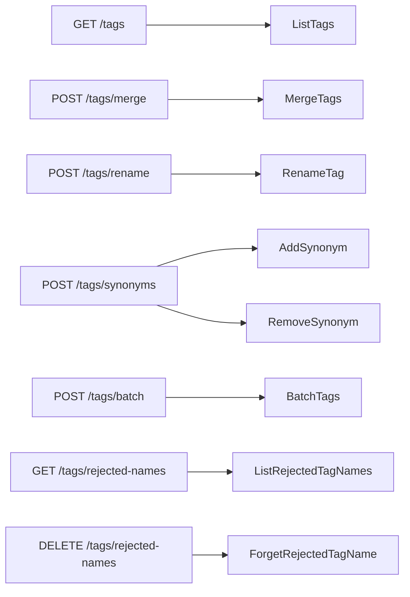
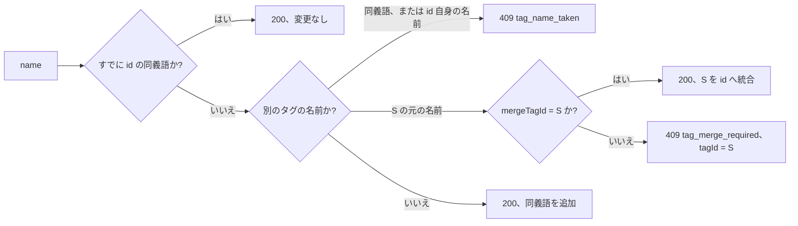

# 契約: 外部 API v1 と MCP でのタグ管理 {#contract-tag-administration-in-the-external-api-v1-and-mcp}

正本: `api/external-v1.yaml`。この文書は、この機能が加えるパラメータ、操作、フィールド、エラーだけを記述する。共通の規則 (Bearer、エラーの形、件数の上限、32 MiB の本文) は [specs/026-external-api/contracts/external-api.md、共通の規則](../../026-external-api/contracts/external-api.md#common-rules) のとおりである。互換性の方針に従い、加えるのはフィールド、パラメータ、操作、`reason` の値だけである。各操作は画面が実行するのと同じストアの操作を実行する ([research.md R-6](../research.md#r-6-the-external-handlers-call-the-same-tags-methods-as-the-screen-with-no-new-write-path)) ので、各呼び出しの後の状態には [036 contracts/screen-api.md](../../036-tag-admin-scale/contracts/screen-api.md) と [031 contracts/screen-api.md](../../031-tentative-tags/contracts/screen-api.md) の規則が成り立つ。この文書は呼び出し側に見えるものだけを繰り返す。

図は、新しい操作と変わった操作がそれぞれどのストアの操作に届くかを示す。



## スキーマの変更 {#schema-changes}

| スキーマ | 追加するもの | 規則 |
| --- | --- | --- |
| `Tag` | `createdAt: string, format: date-time` (`required`) | `tags.created_at`。`createdDesc` と `createdAsc` が並べ替えに使う値 |
| `TagList` | `total: integer` (`required`)、`totalAll: integer` (`required`)、`nextCursor: string` (省略可能) | 画面の `TagList` と同じ: `total` は `q`、`tentative`、`unused` に合うタグの数、`totalAll` はすべてのタグの数。`nextCursor` は `limit` 付きの要求で続きが残っているときだけある |
| `Error` | `tagId: integer, format: int64`、`tagName: string` (どちらも省略可能) | 衝突したタグの id と元の名前。`tag_name_taken` と `tag_merge_required` のときだけある |
| `ErrorReason` | `tag_not_found`、`tag_name_taken`、`tag_merge_required`、`merge_same_tag` | 下の統合、名前の変更、同義語の操作。`too_many_tags` と `invalid_cursor` は既存 |
| `TagSort` | `enum: [name, countDesc, countAsc, createdDesc, createdAsc]`、既定は `name` | 画面の `TagSort` |

新しい要求と応答のスキーマは、それぞれの操作とともに示す。応答の中の配列は、空なら `null` ではなく必ず `[]` である。

## `GET /api/v1/tags` {#get-apiv1tags}

画面の検索、絞り込み、並べ替え、ページでタグを一覧にする。

| パラメータ | 型 | 既定 | 意味 |
| --- | --- | --- | --- |
| `q` | string, `maxLength: 100` | 空 | 検索語。画面と同じく照合する (畳み込み、前後の空白の除去、名前か同義語の部分文字列) |
| `tentative` | boolean | `false` | 仮のタグだけ |
| `unused` | boolean | `false` | どの動画にも付いていないタグだけ。`q` と `tentative` との AND |
| `sort` | `TagSort` | `name` | 並び順。同順位は自然な名前順、次に `id` で決める |
| `cursor` | string | — | 前回の `nextCursor`。不透明な値で、同じ `q`、`tentative`、`unused`、`sort` でだけ有効 |
| `limit` | integer, 1 から 200 | — | 1 ページのタグの数。**省略すると、すべてのタグ**を、現在と同じく `nextCursor` なしで返す |

**応答**: `200 TagList`。MCP ツール `list_tags` は、呼び出しが `limit` を省くと 100 を入れる ([R-1](../research.md#r-1-get-apiv1tags-takes-the-screens-list-parameters-and-only-the-mcp-tool-pages-by-default))。REST の既定は変わらない。

| ステータス | `code` / `reason` | 条件 |
| --- | --- | --- |
| `400` | `invalid_request` | `sort` が 5 つの値以外、`limit` が 1 から 200 の範囲外、`q` が 100 文字を超える |
| `400` | `invalid_request` / `invalid_cursor` | `cursor` が読めない、または別の `sort` で作られた |

## `POST /api/v1/tags/merge` {#post-apiv1tagsmerge}

1 つ以上の統合元のタグを、1 つのトランザクションで統合先のタグへ統合する (要件 2)。

```json
{ "targetId": 12, "sourceIds": [31, 45] }
```

| フィールド | 型 | 必須 | 意味 |
| --- | --- | --- | --- |
| `targetId` | int64 | はい | 付与、名前、同義語を受け取るタグ。確定したタグになる |
| `sourceIds` | int64[]、送られたとおりの要素数で 1 から 20,000 | はい | 統合するタグ。それぞれの元の名前と同義語は統合先の同義語になり、タグ自体は削除される。重複した id は 20,000 の要素数に数え、1 回だけ統合する |

**応答**: `200 { tag: Tag, notFoundIds: int64[] }`。存在しない統合元は飛ばして `notFoundIds` に挙げる。統合元がすべて存在しないとき、`tag` は変わっていない統合先である。

| ステータス | `code` / `reason` | 条件 |
| --- | --- | --- |
| `400` | `invalid_request` / `too_many_tags`、`limit` | `sourceIds` が空、または重複を含めて 20,000 要素を超える |
| `400` | `invalid_request` / `merge_same_tag` | `sourceIds` が `targetId` を含む。何も変わらない |
| `404` | `not_found` / `tag_not_found` | `targetId` が存在しない。何も変わらない |

## `POST /api/v1/tags/rename` {#post-apiv1tagsrename}

タグの元の名前を変える (要件 5)。仮のタグは名前が変わると確定したタグになる。現在と同じ名前なら何も変わらない。

```json
{ "id": 12, "name": "自撮り" }
```

**応答**: `200 Tag`。

| ステータス | `code` / `reason` | 条件 |
| --- | --- | --- |
| `400` | `invalid_request` / `tag_name_empty`、`tag_name_control_characters`、`tag_name_too_long` (`limit`) | 名前が名前の規則に反する |
| `404` | `not_found` / `tag_not_found` | `id` が存在しない |
| `409` | `conflict` / `tag_name_taken`、`tagId`、`tagName` | 名前が別のタグの元の名前か同義語、または `id` 自身の同義語の 1 つである (このとき `tagId` は `id`)。何も変わらない |

## `POST /api/v1/tags/synonyms` {#post-apiv1tagssynonyms}

タグの同義語に名前を 1 つ加える、または 1 つ取り除く (要件 3)。

```json
{ "id": 12, "action": "add", "name": "自己撮影", "mergeTagId": 31 }
```

| フィールド | 型 | 必須 | 意味 |
| --- | --- | --- | --- |
| `id` | int64 | はい | 同義語が変わるタグ |
| `action` | `add` または `remove` | はい | — |
| `name` | string | はい | 同義語。どのタグ名とも同じく正規化する |
| `mergeTagId` | int64 | いいえ | `add` のときだけ: 呼び出し側が統合を受け入れるタグの id で、`tag_merge_required` のエラーから取る。`name` が別のタグの元の名前でないときは無視する |

図は `add` がどう答えるかを示す。



**応答**: `200 Tag`。変更後のタグである。`add` は名前を加えると仮のタグを確定する。`remove` は、名前が `id` の同義語でなければタグを変えずに返す。

| ステータス | `code` / `reason` | 条件 |
| --- | --- | --- |
| `400` | `invalid_request` | `action` が 2 つの値以外 |
| `400` | `invalid_request` / `tag_name_empty`、`tag_name_control_characters`、`tag_name_too_long` (`limit`) | 名前の規則に反する名前での `add`。`remove` は何にも一致せず、タグを変えずに返す |
| `404` | `not_found` / `tag_not_found` | `id` が存在しない |
| `409` | `conflict` / `tag_name_taken`、`tagId`、`tagName` | `add`: 名前が `id` 自身の元の名前か、別のタグの同義語である |
| `409` | `conflict` / `tag_merge_required`、`tagId`、`tagName` | `add`: 名前が別のタグの元の名前で、`mergeTagId` がないか別のタグを指している。何も変わらない |

## `POST /api/v1/tags/batch` {#post-apiv1tagsbatch}

1 つのトランザクションで複数のタグを確定、却下、削除する (要件 4 から 6。[R-3](../research.md#r-3-confirm-reject-and-delete-go-only-through-post-apiv1tagsbatch))。

```json
{ "action": "reject", "ids": [31, 45, 9999] }
```

| フィールド | 型 | 必須 | 意味 |
| --- | --- | --- | --- |
| `action` | `confirm`、`reject`、`delete` のいずれか | はい | `confirm` と `reject` は仮のタグに、`delete` は確定したタグに働く |
| `ids` | int64[]、送られたとおりの要素数で 1 から 20,000 | はい | 重複した id は 20,000 の要素数に数え、1 回だけ適用する |

**応答**: `200 { appliedIds, notFoundIds, notApplicableIds }`。重ならない 3 つの `int64[]` で、合わせると重複を除いた `ids` に等しく、現れた順に並ぶ。却下したタグの元の名前は却下した名前に入る。削除したタグの名前は記憶しない。

| ステータス | `code` / `reason` | 条件 |
| --- | --- | --- |
| `400` | `invalid_request` | `action` が 3 つの値以外 |
| `400` | `invalid_request` / `too_many_tags`、`limit` | `ids` が空、または重複を含めて 20,000 要素を超える |
| `500` | `internal` | トランザクションが失敗した。何も変わらない |

## `GET /api/v1/tags/rejected-names` {#get-apiv1tagsrejected-names}

却下した名前を自然な名前順に、ページ単位で一覧にする (要件 7)。

| パラメータ | 型 | 既定 | 意味 |
| --- | --- | --- | --- |
| `cursor` | string | — | 前回の `nextCursor`。不透明な値 |
| `limit` | integer, 1 から 200 | 100 | 1 ページの名前の数 |

**応答**: `200 { items: string[], total: integer, nextCursor?: string }`。`total` は却下した名前すべての数である。`nextCursor` は続きが残っているときにある。

| ステータス | `code` / `reason` | 条件 |
| --- | --- | --- |
| `400` | `invalid_request` | `limit` が 1 から 200 の範囲外 |
| `400` | `invalid_request` / `invalid_cursor` | `cursor` が読めない |

## `DELETE /api/v1/tags/rejected-names?name=…` {#delete-apiv1tagsrejected-namesname}

却下した名前から名前を 1 つ取り除き、その名前の次の仮の付与でタグがもう一度作られるようにする (要件 7)。

**応答**: `200 { name: string, removed: boolean }`。`name` は照合に使った正規化後の表記である。名前が一覧になかったか正規化できないとき、`removed` は `false` で、何も変わっていない ([R-5](../research.md#r-5-every-operation-returns-a-json-body-so-every-tool-has-a-result))。

| ステータス | `code` / `reason` | 条件 |
| --- | --- | --- |
| `400` | `invalid_request` | `name` がない |

## MCP ツール {#mcp-tools}

[specs/026-external-api/contracts/mcp.md、ツール](../../026-external-api/contracts/mcp.md#tools) の表に加える。各ツールの入力は操作のパラメータか本文であり、構造化された結果は応答の本文である。エラーは、`isError: true` とエラーの本文を持つツールの結果である。この機能の後、ツールは 14 個になる。

| ツール | 操作 | ヒント |
| --- | --- | --- |
| `list_tags` (変更) | `GET /api/v1/tags` | `readOnlyHint: true`。入力に上の `GET /api/v1/tags` のパラメータが加わる。ツールの中で `limit` の既定は 100 (R-1) |
| `merge_tags` | `POST /api/v1/tags/merge` | `destructiveHint: true`、`idempotentHint: true` (統合元は消える) |
| `rename_tag` | `POST /api/v1/tags/rename` | `destructiveHint: false`、`idempotentHint: true` |
| `update_tag_synonyms` | `POST /api/v1/tags/synonyms` | `destructiveHint: true`、`idempotentHint: true` (`remove` は名前を取り除き、`mergeTagId` 付きの `add` は統合する) |
| `batch_tags` | `POST /api/v1/tags/batch` | `destructiveHint: true`、`idempotentHint: true` (`reject` と `delete` はタグを消す) |
| `list_rejected_tag_names` | `GET /api/v1/tags/rejected-names` | `readOnlyHint: true` |
| `forget_rejected_tag_name` | `DELETE /api/v1/tags/rejected-names` | `destructiveHint: true`、`idempotentHint: true` |

列挙 `action` (`update_tag_synonyms` と `batch_tags` のもの) は、`update_video_tags` が自身の `action` の値を加えるのと同じ方法で入力スキーマに加える。ツールの説明は、操作、その上限、そして `update_tag_synonyms` では `tag_merge_required` と `mergeTagId` の働きを述べる。

## `docs/how-to/external-api.md` {#docshow-toexternal-apimd}

"Tidy up tags" 節 (一覧のページと絞り込み、統合、`mergeTagId` を使う同義語、一括の確定、却下、削除、名前の変更、却下した名前)、エージェントが仮のタグをページごとに読んで表記揺れを統合する例、MCP の表の 7 つのツールが加わる。確定、却下、却下した名前は画面専用だという文は削除する。
