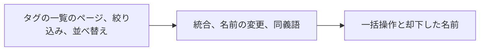

# 実装計画: 外部 API と MCP からタグを整理する (統合、同義語、確定、却下、名前の変更、削除) {#implementation-plan-tidy-up-tags-from-the-external-api-and-mcp-merge-synonyms-confirm-reject-rename-delete}

**ブランチ**: `feature/039-external-tag-admin` | **親 Issue**: #759

**入力**: 親 Issue。これがこの機能の仕様である。

## 概要 {#summary}

AI エージェントなど API トークンを持つクライアントは、`/api/v1` と MCP ツールを通じて、タグ管理画面の検索、絞り込み、並べ替えでタグの一覧をページ単位で読み、タグを統合し、名前を変え、確定し、却下し、削除し、同義語を編集し、却下した名前を一覧して消す。どの操作も画面が実行するのと同じストアの操作を実行するので、操作の後の状態は画面で操作した後の状態と同じになる。

| 関心事 | 方針 |
| --- | --- |
| 一覧 | `GET /api/v1/tags` は画面の `q`、`tentative`、`unused`、`sort`、`cursor`、`limit` を受け取る。`limit` がなければ従来どおりすべてのタグを返す。MCP ツール `list_tags` は既定でページ単位にする ([research.md R-1](research.md#r-1-get-apiv1tags-takes-the-screens-list-parameters-and-only-the-mcp-tool-pages-by-default)、[contracts/external-api.md §1](contracts/external-api.md#1-get-apiv1tags)) |
| 操作 | `POST`、`GET`、`DELETE` の 6 つの固定のルートで、`/api/v1/tags/…` の下にある。タグは本文で指定する ([R-2](research.md#r-2-tag-operations-are-literal-post-routes-that-name-the-tag-in-the-body)、[§2 から §7](contracts/external-api.md#2-post-apiv1tagsmerge)) |
| 確定、却下、削除 | 一括操作 1 つだけで、タグ 1 つ用のルートはない。種類の違うタグは対象外として返す ([R-3](research.md#r-3-confirm-reject-and-delete-go-only-through-post-apiv1tagsbatch)) |
| 名前の衝突 | 衝突したタグの `tagId` と `tagName` を付けた `409 conflict`。別のタグの元の名前である同義語は、`mergeTagId` があるときだけ統合する ([R-4](research.md#r-4-name-conflicts-answer-409-conflict-with-the-conflicting-tags-tagid-and-tagname)) |
| ツールの結果 | どの操作も JSON 本文を返す ([R-5](research.md#r-5-every-operation-returns-a-json-body-so-every-tool-has-a-result)) |
| 画面との一致 | ハンドラは同じインターフェースを通じて同じ `TagStore` の操作を呼ぶ。新しい書き込み経路はない ([R-6](research.md#r-6-the-external-handlers-call-the-same-tags-methods-as-the-screen-with-no-new-write-path)) |
| MCP | 新しいツール 6 つと変更した `list_tags`。合計 14 ツール ([§8](contracts/external-api.md#8-mcp-tools)) |

公開しないもの: `POST /api/tags/impact` (画面の確認用の件数。エージェントは一覧の `videoCount` を読む) と、画面のタグ 1 つ用の確定、却下、削除のルート (R-3)。親 Issue のとおり範囲外のもの: タグだけの作成、トークンごとの権限、統合候補の提案、取り消し、タグ管理画面。

## 技術的な文脈 {#technical-context}

**正本の定義**:

| 項目 | 出典 |
| --- | --- |
| 境界、依存の方向、認証の境界、ストアの役割 | [ARCHITECTURE.md](../../ARCHITECTURE.md)、[.golangci.yml](../../.golangci.yml) (depguard) |
| 外部 API と MCP: 契約、互換性の方針、エラーの形、本文の上限、ツールのつなぎ込み | [api/external-v1.yaml](../../api/external-v1.yaml)、[specs/026-external-api/contracts/external-api.md](../026-external-api/contracts/external-api.md)、[specs/026-external-api/contracts/mcp.md](../026-external-api/contracts/mcp.md)、[specs/026-external-api/research.md](../026-external-api/research.md) (R-3 から R-5、R-7、R-8)、[internal/httpapi/external.go](../../internal/httpapi/external.go)、[internal/httpapi/external_video_tags.go](../../internal/httpapi/external_video_tags.go)、[internal/httpapi/mcp.go](../../internal/httpapi/mcp.go)、[docs/how-to/external-api.md](../../docs/how-to/external-api.md) |
| 画面が実行するタグの操作: 一覧の問い合わせ、統合、名前の変更、同義語、一括操作、却下した名前 | [specs/014-video-tags/contracts/tags-api.md §3](../014-video-tags/contracts/tags-api.md#3-tag-management)、[specs/031-tentative-tags/contracts/screen-api.md](../031-tentative-tags/contracts/screen-api.md)、[specs/036-tag-admin-scale/contracts/screen-api.md](../036-tag-admin-scale/contracts/screen-api.md)、[internal/httpapi/tags.go](../../internal/httpapi/tags.go)、[internal/httpapi/router.go](../../internal/httpapi/router.go) (`Tags`)、[internal/store/tags.go](../../internal/store/tags.go)、[tag_listing.go](../../internal/store/tag_listing.go)、[tag_synonyms.go](../../internal/store/tag_synonyms.go)、[tag_batch.go](../../internal/store/tag_batch.go)、[tentative_tags.go](../../internal/store/tentative_tags.go) |
| 操作が使うドメインの値 | [internal/domain/tag.go](../../internal/domain/tag.go)、[tag_list.go](../../internal/domain/tag_list.go)、[tag_batch.go](../../internal/domain/tag_batch.go)、[rejected_tag_name.go](../../internal/domain/rejected_tag_name.go) |
| 2 つの面からの同時編集 | [specs/031-tentative-tags/research.md R-6](../031-tentative-tags/research.md#r-6-rejection-and-a-tentative-attach-of-the-same-name-rely-on-sqlite-write-serialization) |
| 生成と検査の入口 | [Taskfile.yml](../../Taskfile.yml) (`task check`、`task check-docs`、`task generate`) |

**この機能に固有の文脈**:

- マイグレーション、新しいテーブルや列、ドメインイベント、Go や npm の依存は追加しない。`data-model.md` はない。この機能はエンティティを追加せず、フィールドも変えない ([P-2](../../docs/design-docs/plan-quality.md#p-2-do-not-create-an-artifact-with-nothing-to-say))。
- どの操作も本文を返すように、ストアのシグネチャを 2 つ変える (R-5)。`TagStore.RemoveSynonym` は `(domain.Tag, error)` を返し、`TagStore.ForgetRejectedTagName` は `(bool, error)` を返す。画面のハンドラは追加した値を無視する。`Tags` (`router.go`) もこれに合わせる。
- `api/external-v1.yaml` は追加だけである: 6 つの操作、`listTags` の 6 つのパラメータ、`Tag.createdAt`、`TagList` の 3 つのフィールド、`Error` の 2 つのフィールド、`ErrorReason` の 4 つの値、`TagSort`。`internal/httpapi/extgen/` は `task generate` で再生成する。
- サイズの目安は受け入れ条件 1 である: 2,000 タグのときの `list_tags` の応答 1 つがエージェントの読める量に収まる。`limit` が 100 ならページは約 10 KB である。ツールの中の既定値 100 によって、引数なしの呼び出しの応答がこのページになる。
- [quickstart.md](quickstart.md) は、`task check` が実行しない実際の MCP クライアントで、受け入れ条件 1 から 3 と 5 を確かめる。

## Constitution Check {#constitution-check}

| 関門 | 判定 |
| --- | --- |
| 依存の方向 (ARCHITECTURE.md "Intended dependency direction") | 合格。`internal/httpapi` は解析と変換をし、自身が宣言する `Tags` インターフェースを通じてストアに届く。`internal/app`、`internal/domain`、`cmd/mdm` は変わらない。ただし、ハンドラが必要とするなら `TagSynonymsAction` の列挙を `internal/domain` に加える |
| ストアの役割: 操作ごとに役割は 1 つ、`internal/store` の外に SQL を書かない | 合格。どの操作も既存の `TagStore` のメソッドである (R-6)。2 つのシグネチャの変更は、トランザクションがすでに持っている値を読む |
| API の正本と生成ファイル (AGENTS.md) | 合格。`api/external-v1.yaml` を編集し、`task generate` を実行し、`internal/httpapi/extgen/` は編集しない |
| `v1` の互換性の方針 (docs/how-to/external-api.md) | 合格。追加だけである (R-1)。`limit` のない要求に対する REST の既定は「すべてのタグ」のままである |
| どの要求もルーティングの前にパスで分類する (ARCHITECTURE.md "Every read knows its viewer") | 合格。新しいルートは `/api/v1` の下にあり、境界はすでにここを bearer に分類している。ルートのセキュリティのテストは新しい規則なしでこれらを扱う |
| サーバーの文字列は英語 (gosmopolitan) | 合格。エラーメッセージとツールの説明は英語である。ユーザーのデータ (タグ名) は翻訳せずにそのまま通す |
| 文書は現在を記述する (core-beliefs.md) | 合格。各単位は、自身の担当部分について `docs/how-to/external-api.md` と `specs/026-external-api/contracts/mcp.md` のツールの表を更新する |

この判定は Phase 1 の後も成り立つ。Complexity Tracking に載せる違反はない。

## プロジェクトの構成 {#project-structure}

### 文書 (この機能) {#documentation-this-feature}

```text
specs/039-external-tag-admin/
├── plan.md               # This file
│                         # No spec.md — the parent Issue is the specification
├── research.md           # R-1 to R-6
├── quickstart.md         # Acceptance criteria 1 to 3 and 5 with a real MCP client
└── contracts/
    └── external-api.md   # The list parameters, six operations, schema and error changes, seven MCP tools
```

`data-model.md` はない (技術的な文脈を参照)。親 Issue に `ui` ラベルはないので、`design` 段階はない。

### ソースコード {#source-code}

**影響する境界**:

| 境界 | 変わるもの |
| --- | --- |
| `api/external-v1.yaml`、`internal/httpapi/extgen/` (生成物) | 技術的な文脈に挙げた追加 |
| `internal/httpapi` | `ListTags` (`external.go`) がパラメータを解析する (画面の `parseTagListQuery` の規則を共有する)。6 つの操作の新しいハンドラを新しい `external_tags.go` に置く。`ErrTagNotFound`、`TagNameConflict`、`TagMergeRequired`、`merge_same_tag` の外部向けエラーへの対応付け。`mcp.go` が 6 つのツールと `list_tags` の入力を、その既定の `limit` とともに登録する。2 つの変わったシグネチャに合わせた `Tags` (`router.go`) |
| `internal/store` | `RemoveSynonym` がトランザクションの中でタグを読む。`ForgetRejectedTagName` が `RowsAffected` を報告する |
| `internal/domain` | ハンドラが文字列の確認を再利用しないなら、同義語の操作用の 2 値の action 列挙 |
| `docs/how-to/external-api.md`、`specs/026-external-api/contracts/mcp.md` | "Tidy up tags" 節、エージェントの例、ツールの表 |

**新しいパス**: `internal/httpapi/external_tags.go` とそのテスト。

**構成の決定**: 026 が選んだ配置に従う。別のハンドラ型 `externalServer` を `internal/httpapi` に置き、専用の生成パッケージを持たせる ([specs/026-external-api/plan.md "Structure decision"](../026-external-api/plan.md#source-code))。

## 実装作業 {#implementation-work}

各単位が前の単位による `api/external-v1.yaml`、`mcp.go`、手順書への追加の上に積み上がるように順序を決めている。これで生成ファイルとツールの一覧にマージの衝突が起きない。



### 外部 API と MCP でタグの一覧をページ単位で読み、絞り込み、並べ替える {#page-filter-and-sort-the-tag-list-in-the-external-api-and-mcp}

**範囲**: `Tag.createdAt`、`TagList` のフィールド、`TagSort` (`api/external-v1.yaml`)。`GET /api/v1/tags` の 6 つのパラメータとその `400` 応答。`list_tags` ツールの入力 (`limit` の既定は 100) ([contracts/external-api.md §0、§1、§8](contracts/external-api.md#0-schema-changes)、[research.md R-1](research.md#r-1-get-apiv1tags-takes-the-screens-list-parameters-and-only-the-mcp-tool-pages-by-default))。手順書の節の一覧の部分と、MCP の表の `list_tags` の行 ([§9](contracts/external-api.md#9-docshow-toexternal-apimd))。

**依存**: なし

**受け入れ**: `task check` が通る。httpapi のテストで、名前がある語を共有する 2,000 個の仮のタグについて、`GET /api/v1/tags?tentative=true&q=<term>&limit=200` に続けて `cursor` で読むと、どのタグも 1 回ずつ読まれ、最後のページに `nextCursor` はない。どのページにも `total`、`totalAll` があり、各タグに `createdAt` がある。`GET /api/v1/tags` は `limit` がなければ、既存のテストが期待するとおり、すべてのタグを返し `nextCursor` はない。MCP のテストで、引数なしの `list_tags` は 100 項目と `nextCursor` を返し、`list_tags` に `limit: 10` と `sort: "countDesc"` を付けると件数順に 10 項目を返す。列挙にない `sort`、`limit` 201、別の並べ替えで作られたカーソルは `400 invalid_request` を返し、最後のものは `invalid_cursor` を伴う (受け入れ条件 1)。

### 外部 API と MCP でタグを統合し、名前を変え、同義語を編集する {#merge-rename-and-edit-synonyms-of-tags-in-the-external-api-and-mcp}

**範囲**: `POST /api/v1/tags/merge`、`/tags/rename`、`/tags/synonyms`。`Error.tagId` と `tagName`。理由 `tag_not_found`、`tag_name_taken`、`tag_merge_required`、`merge_same_tag`。タグを返す `TagStore.RemoveSynonym`。ツール `merge_tags`、`rename_tag`、`update_tag_synonyms` ([contracts/external-api.md §2 から §4 と §8](contracts/external-api.md#2-post-apiv1tagsmerge)、[research.md R-2、R-4、R-5](research.md#r-2-tag-operations-are-literal-post-routes-that-name-the-tag-in-the-body))。手順書と MCP の表のこれらの部分。

**依存**: 外部 API と MCP でタグの一覧をページ単位で読み、絞り込み、並べ替える

**受け入れ**: `task check` が通る。MCP のテストで、仮のタグを統合元としてある統合先へ `merge_tags` すると、`synonyms` に統合元の名前を持ち `tentative: false` の統合先を返す。その後、画面の `GET /api/tags` は統合元を一覧に出さず、統合元が付いていた動画の `GET /api/videos/{id}` は統合先を一覧に出す (受け入れ条件 2)。`sourceIds` が `targetId` を含むと `400 merge_same_tag` を返し、何も変えない。存在しない統合先は `404 tag_not_found` を返す。一部が存在しない `sourceIds` は残りを統合し、存在しない id を `notFoundIds` に挙げる。別のタグの同義語へ名前を変える `rename_tag` は、そのタグの `tagId` と `tagName` を持つ `409 tag_name_taken` を返し、何も変えない。`update_tag_synonyms` で別のタグの元の名前を `add` すると、`409 tag_merge_required` をそのタグの `tagId` とともに返す。同じ呼び出しにその `mergeTagId` を付けると、`synonyms` にその名前を持つタグを返し、もう一方のタグは一覧から消える。`remove` はその名前のないタグを返す。同じ統合、名前の変更、同義語の追加を同一のフィクスチャで画面のルートを通じて実行するテストは、同一の `GET /api/tags` 本文を得る (受け入れ条件 5)。

### 外部 API と MCP でタグを一括で確定、却下、削除し、却下した名前を管理する {#confirm-reject-and-delete-tags-in-bulk-and-manage-rejected-names-in-the-external-api-and-mcp}

**範囲**: `POST /api/v1/tags/batch`、`GET` と `DELETE /api/v1/tags/rejected-names`。`TagStore.ForgetRejectedTagName` が `removed` を報告する。ツール `batch_tags`、`list_rejected_tag_names`、`forget_rejected_tag_name` ([contracts/external-api.md §5 から §8](contracts/external-api.md#5-post-apiv1tagsbatch)、[research.md R-3、R-5](research.md#r-3-confirm-reject-and-delete-go-only-through-post-apiv1tagsbatch))。手順書の節の残り、エージェントの例、MCP の表、確定と却下は画面専用だという文の削除 ([§9](contracts/external-api.md#9-docshow-toexternal-apimd))。

**依存**: 外部 API と MCP でタグを統合し、名前を変え、同義語を編集する

**受け入れ**: `task check` が通る。MCP のテストで、`batch_tags` を `action: "reject"` で仮のタグ、確定したタグ、存在しない id に対して実行すると、1 つ目を `appliedIds`、2 つ目を `notApplicableIds`、3 つ目を `notFoundIds` に入れて返し、確定したタグは変わらない (受け入れ条件 4)。続いて `list_rejected_tag_names` は却下した名前を一覧に出し、`update_video_tags` に `tentative: true` とその名前を付けると、その名前を `skippedTags` で返し、タグを作らない (受け入れ条件 3)。`batch_tags` の `confirm` の後、そのタグは `tentative: false` で `list_tags` に現れる。仮のタグの `delete` はそのタグを `notApplicableIds` に入れる。`forget_rejected_tag_name` は 1 回目に `removed: true`、2 回目に `removed: false` を返し、次の仮の付与はタグをもう一度作る。MCP のツールの一覧は §8 のヒントを持つ 14 ツールである。手順書と 026 のツールの表を更新した状態で `task check-docs` が通る。
